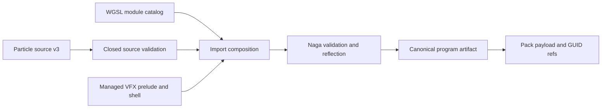

# @forgeax/engine-vfx-compiler

Build-time compiler for code-first GPU particle effects. It turns source metadata and small WGSL hooks into one deterministic, runtime-ready program artifact.

## Cook pipeline


```mermaid
flowchart LR
    source["Particle source v3"] --> validate["Closed source validation"]
    modules["WGSL module catalog"] --> compose["Import composition"]
    validate --> compose
    prelude["Managed VFX prelude and shell"] --> compose
    compose --> naga["Naga validation and reflection"]
    naga --> artifact["Canonical program artifact"]
    artifact --> payload["Pack payload and GUID refs"]
```

> [!IMPORTANT]
> The compiler runs at import/build time. `@forgeax/engine-vfx`, player bundles, and shipped applications do not depend on Naga or a runtime shader compiler.

The producer entry in
[`schemas/asset-authority.schema.json`](../../schemas/asset-authority.schema.json) identifies this
package's current source owners. Its lifecycle evidence is the validated source
plus composed WGSL, the deterministic program fingerprint, and the native-cook
Pack projection. DDC and Catalog are disposable or derived; a failed or stale
cook is repaired from author source and never promoted as current runtime data.

## Public cook

```ts
import { cookParticleCodeEffect } from '@forgeax/engine-vfx-compiler';

const cooked = await cookParticleCodeEffect(source, {
  'sparks.vfx.wgsl': {
    entry: sparksWgsl,
    imports: { 'game::noise': sharedNoiseWgsl },
  },
});
if (!cooked.ok) return cooked;

// cooked.value.asset    -> particle-effect Pack payload
// cooked.value.artifact -> particle-effect/program.json
// cooked.value.refs     -> sorted material and mesh GUID references
```

Vite/Preview importers use `createParticleCodeNativeCooker(modules, materials?)`.
The core compiler receives an explicit module catalog. The build-only
`createParticleCodeNativeCookerFromRoots(roots, materials?)` adapter discovers
authored files and delegates to the same cooker; discovery does not enter runtime.

`cookParticleCodeProgram`, `cookParticleCodeEffect`, and the native adapters
share one cook implementation and preserve the same optional material catalog.
There are no version-suffixed compatibility entry points. The compiler accepts
only `schemaVersion: 3`, emits
`forgeax-vfx-program-4`, and can receive a material particle-input catalog for
typed cross-asset matching. The generated binding layout uses one shared typed
event buffer for the retained channel/sub-emitter path, then reserves
Parameters and Custom and allocates only the declared camera, single-sample
scene-depth, and noise resources.

## Managed ABI

Author code supplies only:

```wgsl
fn vfx_spawn(ctx: VfxSpawnContext, particle: ptr<function, VfxParticle>)
fn vfx_update(ctx: VfxUpdateContext, particle: ptr<function, VfxParticle>)
```

The compiler owns compute entry points for spawn, update, hierarchical scan, stable compaction, billboard, mesh, ribbon, trail, and beam projection. It reflects each renderer's capacity and topology resources into the artifact. It also owns all runtime bindings. Author declarations that conflict with this surface fail with `vfx-reserved-surface-conflict`.

The Core WGSL declaration derives from `VFX_PARTICLE_CORE_LAYOUT`; the simulation
and event shells directly express that ABI. They do not translate a legacy
template with string replacements before compilation. Reflected Custom/material
specialization still belongs to the compiler, not to the runtime loader.

For Program v3, an author may declare `VfxParameters` and a bounded
`VfxCustom`. When Custom is present, both hooks receive a pointer to that
record; the managed shell writes it on spawn and persists it across update
ticks. Renderer semantics are explicit source-to-Core/Custom mappings rather
than field-name guesses. Material WGSL may declare particle inputs with a
comment such as `// forgeax-vfx-particle-input heat: f32 fragment lane=0`;
the cooked material reflection and VFX compiler perform the name/type/lane
match.

| Helper | Determinism contract |
|:--|:--|
| `vfx_integrate` | Explicit opt-in Euler integration using fixed delta |
| `vfx_random_spawn` | Addressed by seed, particle ID, tick, sample key; replay cycle does not change entropy |
| `vfx_random_update` | Same address model; call order does not define randomness |

## Artifact contract

| Fact | Value |
|:--|:--|
| Key | `particle-effect/program.json` |
| Format | `forgeax-vfx-program-4` for the schema-driven slice |
| MIME | `application/vnd.forgeax.vfx-program+json` |
| Fingerprint | SHA-256 of canonical program bytes |
| Reflection | hooks, composed imports, resources, entry points, bind-group layouts |

`reflectVfxRendererV3` returns topology, capacity, semantic mappings, material
inputs, Standard Mesh lighting/shadow intent, and resource identity that the
runtime executes. These are cooked projections, not parser-only metadata.
Custom mesh and billboard sorting is reflected into the managed GPU sort pass (one
validated `VfxCustom` scalar per emitter); unsupported or ambiguous custom
sources fail with a structured cook error rather than silently becoming emitter
order.

> [!IMPORTANT]
> Cooked program format 4 separates renderer sorting from mesh firstIndex in the
> managed GPU uniform. Source schema and reflection remain version 3. Re-cook
> existing effects with this compiler; runtime rejects older program formats.

GPU channel fan-outs are admitted atomically in input order: the complete fan-out
must fit both free particle slots and the current tick's event output capacity.
Rejected inputs do not inflate alive/produced counts. Child creation uses physical
free slots, resets Custom fields, and keeps per-tick output offsets separate from
persistent diagnostics. VFX Render then runs the canonical scan/compaction again
so the next scheduled spawn consumes current free ranks. The bounded event
allocation is serial on the GPU; particle update/projection remains parallel.

Canonical object keys are sorted. Emitter, renderer and WGSL struct member
order remain authored order: sorting struct members would change GPU offsets.
Custom array stride follows natural storage alignment, independently of the
vec4-equivalent budget. Payload emitter identities/capacities and the artifact
fingerprint are checked again by the runtime loader.

## Errors

| Code | Meaning |
|:--|:--|
| `vfx-module-missing` | Source names a module absent from the explicit catalog |
| `vfx-hook-missing` | One required author hook is absent |
| `vfx-hook-invalid` | A hook name exists with the wrong signature |
| `vfx-reserved-surface-conflict` | Author code declares managed stages, bindings, or symbols |
| `vfx-shader-invalid` | Composition, Naga validation, or reflection failed; inspect `detail.cause` |

Every error carries `expected`, `hint`, and emitter/module detail. Cook never emits a partial program.
