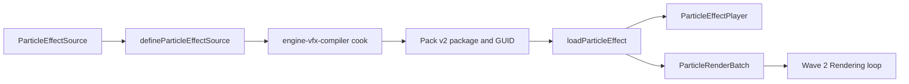

# @forgeax/engine-vfx

> [!IMPORTANT]
> `@forgeax/engine-vfx` is the runtime-safe VFX contract and CPU-only particle
> simulation owner. It owns source validation, Pack v2 loading, ECS author
> intent, FixedUpdate simulation, structured observations, and producer-owned
> render batch data. It does not submit draws, execute GPU work, or implement
> RenderFeature.


## Start here

The public path is one directional:



A runtime consumer only needs a host-owned `AssetRegistry`, a cooked GUID, and
the public VFX entry:

```ts
import { World } from '@forgeax/engine-ecs';
import type { Handle } from '@forgeax/engine-types';
import type { AssetRegistry } from '@forgeax/engine-assets-runtime';
import {
  ParticleEffectPlayer,
  createParticleRenderBatch,
  loadParticleEffect,
  particleEffectPackLoader,
} from '@forgeax/engine-vfx';

declare const assets: AssetRegistry;
const effectGuid = '019e2cc6-0c86-79da-aa76-b0984c86d45c';
assets.configurePackIndex('/pack-index.json');
assets.loaders.registerPackLoader(particleEffectPackLoader);

const loaded = await loadParticleEffect(assets, effectGuid);
if (!loaded.ok) {
  console.error(loaded.error.code, loaded.error.hint);
  return;
}

const world = new World();
const effect: Handle<'ParticleEffectAsset', 'shared'> =
  world.allocSharedRef('ParticleEffectAsset', loaded.value);

const spawned = world.spawn({
  component: ParticleEffectPlayer,
  data: { effect, playing: true, seed: 7, timeScale: 1 },
});
if (!spawned.ok) {
  console.error(spawned.error.code, spawned.error.hint);
  return;
}

const emptyBatch = createParticleRenderBatch([]);
if (!emptyBatch.ok) {
  console.error(emptyBatch.error.code, emptyBatch.error.hint);
}
```

The build-time half of this path is documented in
[`@forgeax/engine-vfx-compiler`](../vfx-compiler/README.md). It defines the
source, registers operators, cooks the canonical payload and asset-local
program artifact, and emits the generic Importer product. It never belongs in a
player bundle.

## Wave 2 CPU particle simulation

The text contract is sufficient without reading the diagram. Wave 2 adds one
opt-in, CPU-only `ParticleSimulation` resource to the existing path:

```ts
import { World } from '@forgeax/engine-ecs';
import { runPlugins, type Plugin } from '@forgeax/engine-plugin';
import {
  PARTICLE_SIMULATION_RESOURCE_KEY,
  ParticleCpuExecutorRegistry,
  ParticleEffectPlayer,
  type ParticleSimulation,
  particleSimulationPlugin,
} from '@forgeax/engine-vfx';

declare const assets: import('@forgeax/engine-assets-runtime').AssetRegistry;
declare const defaultSet: readonly Plugin[];
declare const effect: import('@forgeax/engine-types').Handle<
  'ParticleEffectAsset',
  'shared'
>;

const world = new World();
const spawned = world.spawn({
  component: ParticleEffectPlayer,
  data: { effect, playing: true, seed: 7, timeScale: 1 },
});
if (!spawned.ok) return;

const userPlugins = [
  particleSimulationPlugin({
    assets,
    cpuExecutors: new ParticleCpuExecutorRegistry(),
  }),
];
const installed = await runPlugins(world, defaultSet, userPlugins);
if (!installed.ok) return;

const advanced = world.update(1 / 60);
if (!advanced.ok) return;
const simulation = world.getResource<ParticleSimulation>(PARTICLE_SIMULATION_RESOURCE_KEY);
const observation = simulation.read(spawned.value);
const replay = simulation.replay(spawned.value);
```

`runPlugins(world, defaultSet, userPlugins)` is the existing three-argument
plugin contract. `defaultSet` is supplied by the host; the VFX plugin belongs
in `userPlugins`. `world.update(delta)` is the host-facing step. Particle
emission, initialization, update, aging, death, and output observation run only
on the ECS `FixedUpdate` ticks that this call actually executes.

The public ownership chain is deliberately short:

| Concern | Public owner | Consumer-visible rule |
|:--|:--|:--|
| Effect readiness | `AssetRegistry` | Load the GUID and wait for the validated payload before allocating the shared effect handle. |
| Author intent | `ParticleEffectPlayer` | Keep only `effect`, `playing`, `seed`, and `timeScale` in World component data. |
| Live lifecycle | `ParticleSimulation` | `playing=false` pauses; seed change or `replay` resets at the next fixed boundary; despawn releases transient state. |
| Backend | CPU executor registry | CPU plans run; GPU-only plans report `unavailable`, and explicit GPU disable plans report `disabled`. |
| Batch ownership | VFX simulation | Publish validated `ParticleRenderBatch` data and World shared handle references; do not publish malformed buckets. |
| Rendering boundary | Rendering lane | Consume the public batch only; VFX production does not import Renderer, RHI, Device, RenderGraph, or RenderFeature. |

The observation state is not inferred from an empty batch. `empty` means a valid
player currently has no live output. `disabled` means the cooked policy elected
not to run a backend. `unavailable` means a required runtime capability or
ready output is missing and the observation carries a diagnostic for retry.
`failed` means an executor or player input rejected the current tick. These are
distinct states even when `batches.batches` is empty.

| State | Meaning | First action |
|:--|:--|:--|
| empty | The player is valid, but no emitter has live output at this tick. | Continue the fixed-step loop or inspect the player intent. |
| disabled | The cooked policy explicitly disabled an unavailable backend. | Change the authored backend policy if output is required. |
| unavailable | A required capability or output asset is not ready. | Read `diagnostics`, repair readiness, and retry in the same World. |
| failed | A player field or executor rejected the current simulation boundary. | Read `code`, `detail`, and `hint`, then repair and retry. |

## Public surface

| Layer | Public symbols | Owner and rule |
|:--|:--|:--|
| Source | `ParticleEffectSource`, `defineParticleEffectSource`, `serializeParticleEffectSource` | Authoring input; schema is the source contract |
| Asset | `ParticleEffectAsset`, `ParticleEmitterDefinition` | Cooked JSON-safe payload; identity comes from `engine-types` |
| Load | `particleEffectPackLoader`, `loadParticleEffect` | Pack v2, GUID, refs, and asset-local artifacts |
| ECS intent | `ParticleEffectPlayer`, `ParticleEffectPlayerData` | Four serializable fields only: effect, playing, seed, timeScale |
| Batch | `ParticleRenderBatch`, `createParticleRenderBatch`, `validateParticleRenderBatch` | Empty, billboard, and mesh output buckets; no device or draw object |
| Simulation | `particleSimulationPlugin`, `ParticleSimulation`, `PARTICLE_SIMULATION_RESOURCE_KEY` | Opt-in CPU-only FixedUpdate resource with `read` and `replay` |
| Errors | `VfxError`, `vfxError` | Closed `code` union with `expected`, `hint`, and narrowed `detail` |

The shared asset identity is owned by
[`@forgeax/engine-types`](../types/README.md). Use
`Handle<'ParticleEffectAsset', 'shared'>`; do not create a VFX-local handle
registry or infer identity from a URL or filename.

## Source and schema

The JSON Schema is
[`schema/particle-effect-source.schema.json`](./schema/particle-effect-source.schema.json).
The TypeScript validator and serializer are in
[`src/source.ts`](./src/source.ts). A valid source has one or more uniquely
identified emitters. Each emitter declares capacity, space, schedule, bounds,
backend policy, four operator stages, and one billboard or mesh output.

The source is the authoring SSOT. Cooked programs, backend plans, refs, and
artifact bytes are derived. The runtime package does not accept raw source as a
load fallback.

## Structured recovery

Never parse an error message. Switch on `error.code`, then read the narrowed
`detail` and execute `hint`.

| Code | Detail signal | Recovery |
|:--|:--|:--|
| `vfx-source-invalid` | `path`, optional `emitterId` | Repair the schema path and validate again |
| `vfx-operator-unknown` | stage, kind, version | Register the definition in the compiler registry |
| `vfx-operator-backend-unsupported` | emitter, operator, backend | Add the declared compiler or change the explicit source policy |
| `vfx-program-invalid` | emitter, path, format | Recook the source and restore the asset-local program |
| `vfx-batch-invalid` | output, index, path | Repair count, handle, or typed-array stride |
| `vfx-asset-load-failed` | package, artifact, or reference stage | Repair the named Pack v2 producer and retry |
| `vfx-simulation-capability-unavailable` | player, emitter, stage, backend, plan | Enable the declared CPU capability or change the explicit cooked policy |
| `vfx-simulation-player-invalid` | player, field, value | Repair the named author-intent field and retry the next fixed boundary |
| `vfx-simulation-output-unavailable` | player, emitter, reference, expected kind | Make the host-owned output ready and retry in the same World |
| `vfx-simulation-execution-failed` | player, emitter, stage, operator, reason | Repair or register the executor and retry without rebuilding the World |

`vfx-asset-load-failed.detail.stage` distinguishes package locator,
asset-local artifact, and referenced GUID failures. A failure never returns a
partial ready asset.

## Pack v2 boundary

`loadParticleEffect` delegates GUID lookup and dependency readiness to the
host `AssetRegistry`. The VFX loader validates the
`particle-effect` payload and the asset-local
`particle-effect/program.json` artifact. It does not:

- load package-global artifacts or raw source URLs;
- guess an artifact from a filename suffix;
- own a transport, DDC, GUID registry, or dependency graph;
- mint ECS shared handles.

See [`packages/pack/README.md`](../pack/README.md) for the Pack v2 envelope,
catalog locator, cook receipt, artifact descriptors, and evidence flow.

## Wave 1 contract and Wave 2 boundary

> [!WARNING]
> Wave 1 freezes the data contracts consumed by the Wave 2 CPU simulation and
> parallel Rendering lane.

Delivered:

- source validation and deterministic cooked asset vocabulary;
- Pack v2 GUID load and structured readiness failures;
- ECS author intent through `ParticleEffectPlayer`;
- producer-owned empty, billboard, and mesh batch shapes;
- public declarations and AI-indexable recovery documentation.

Still outside this package and this Wave 2 lane:

- GPU buffers, compute passes, device execution, draw calls, or RenderGraph;
- renderer assembly, editor, preview UI, gameplay, or VFX transport;
- production `RenderFeature` integration.

The Wave 2 Simulation loop owns transient live state, FixedUpdate scheduling,
seeded replay, lifecycle reconciliation, readiness retry, diagnostics, and
validated `ParticleRenderBatch` production. It stays headless and CPU-only.

The **Wave 2 Rendering loop** owns the neutral test-only adapter for public
`RenderFeature<ParticleRenderBatch>` callback and registration compatibility.
It is the first milestone inside that loop, not a shared pre-wave Gate or a
separate loop. This package does not implement or import RenderFeature in
production.

<details>
<summary>Deep links</summary>

- [Public entry](./src/index.ts)
- [Source implementation](./src/source.ts)
- [Pack loader](./src/loader.ts)
- [GUID load boundary](./src/load-particle-effect.ts)
- [Player schema](./src/player.ts)
- [Batch contract](./src/render-batch.ts)
- [Compiler package](../vfx-compiler/README.md)
- [Shared Asset and Handle vocabulary](../types/README.md)
- [Feature plan and AC mapping](../../.forgeax-harness/forgeax-loop/feat-20260728-wave1-vfx-contract-and-asset-cook/plan-strategy.md)

</details>
