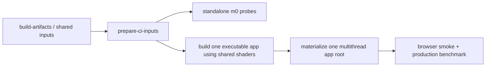
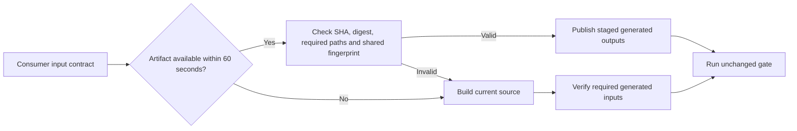

# CI operation and iteration

## Focused startup and shader dependency regressions

The Browser scheduler regression checks complete ownership, deterministic
assignment and the existing load-difference bound. Adding an owner may move
any group; two named tests need not remain on different shards. Their process
boundaries and all assertions stay intact. Reproduce with
`node --test scripts/ci/__tests__/run-split-vitest-browser.test.mjs`.

The ordinary Renderer diffuse fixture uses native device access only to
destroy its fresh test-owned replay device. Its explicit AC-08 entry preserves
that existing test boundary; capture, replay and readback use RHI Debug.

The card-coverage fixture has the same explicit AC-08 test-only admission for
native validation events and cleanup. It unwraps the recorder's test device and
asserts both native devices exist, so optional access cannot silently skip error
observation or cleanup. All capture and replay commands remain on RHI.

The two-sided SDF, SDF storage, SDF expansion-policy, Card sampling, multi-material Card, Global SDF composition/query/minimum-step and Global Card lookup fixtures have separate exact-file admissions for the same
native validation/cleanup purpose. It verifies both device handles exist and
keeps distance queries, material capture, readback and replay on RHI. New fixtures
must pass `node apps/hello/triangle/scripts/ac-08-grep-gate.mjs` before pushing;
do not replace these file entries with a raytracing-directory exemption.

The multiplayer Snake process fixture owns two loopback listeners. Its child
reports a structured startup code over IPC; the harness retries at most twice
for native `EADDRINUSE` or endpoint `connection-failed` during startup only.
Each failed child and temporary bundle is cleaned before a new attempt. Gameplay,
chaos convergence, readiness deadlines and all later failures retain their gates.
The occupied-listener regression uses a real socket and preserves that listener.
Reproduce with `pnpm --filter @forgeax/multiplayer-snake test:process-e2e`.

The grazing-diffuse Dawn fixture executes Standard's coefficient and its actual
shared helper closure, including `standardDiffuseWeight`. If extraction-based
shader tests report an undeclared function after a shared-helper change, include
the real dependency and retain the GPU energy assertions; do not paste a second
formula. Compilation failures serialize message and source location explicitly.

The SDF lifecycle coverage test prepares only its cube field, loaded Card layout
and shared base materials through `prepareSdfCardsBaseFixture`. The complete GPU
fixture extends that same base with hollow, textured, normal-map, sheet and layered
cases. Keep the lifecycle test's five-second bound and all resource/retirement
assertions; unused GPU-scene preparation caused a reproducible coverage timeout.

## Explicit Smoke frame budgets

The default correctness budget remains 60. `--frames N` (or `SMOKE_MIN_FRAMES=N`)
requests one safe integer minimum of at least 60. Invalid requests fail before
execution; owners report completed frames, never requested frames. The receipt
has no `framesExpected` field: the runner and aggregate independently bind it to
the external budget, exact Engine HEAD, roster digest and complete shard closure.

The framebuffer owner divides the requested budget between passthrough and
inversion, awaits both modes, checks the existing pixel relation and falsifier,
then emits `learn-render-framebuffers/direct-dawn`. At the default budget this
is 30 completed frames per mode, without a hidden 300-frame minimum. Its gauntlet
still executes the complete lifecycle and destructive controls as a composite gate.

| Route | Command / contract |
|:--|:--|
| One real owner | `pnpm ci:focus --kind smoke --select hello-cinder-fall/smoke --frames 300` |
| Complete local hello/learn fleet | `pnpm ci:focus --kind smoke --select all --frames 300` |
| Existing local app-smoke route | `node scripts/dev-verify/run-engine-smoke-roster.mjs --frames 300` propagates the budget; it is not the canonical full-fleet aggregate. |
| Actions full fleet | Dispatch `ci-focus.yml` with `kind=smoke`, `selector=all`, `frames=300`; four independent shards rebuild their assigned apps and publish mandatory reports/logs, then one aggregate checks all evidence. |
| Already prepared shard | `node scripts/ci/run-dawn-smoke-roster.mjs --run --scope full --frames 300 --shard-index 0 --shard-count 4 --expected-product-sha "$EXPECTED_PRODUCT_SHA" --report artifacts/ci-focus/shard-0.json` |
| Collected four-shard evidence | `node scripts/ci/run-dawn-smoke-roster.mjs --aggregate --scope full --frames 300 --shard-count 4 --expected-product-sha "$EXPECTED_PRODUCT_SHA" --reports artifacts/ci-focus` |

The Actions execution shards use the self-hosted `heavy` pool; aggregation uses
the self-hosted `standard` pool.

`full` derives all 92 executable hello/learn declarations from the canonical
roster, including independently scheduled gates: 88 frame-receipt owners each
meet the requested budget, while two assertion and two composite owners execute
their complete original commands without fabricated frame counts. Existing
exclusions and the five supplemental non-hello/learn apps retain their ordinary
CI ownership. The default `sharded` scope remains the existing 30 gates.

Full-fleet admission rejects missing/duplicate owners or receipts, incomplete
frames, 299 for a 300 request, mixed/self-downgraded budgets, failed/skipped
commands, mismatched HEAD/roster, and log digest or receipt projection drift.
`--allow-blocked` is prohibited for `full`. Five 60-frame processes cannot count
as 300. FXAA completes each lane separately and reports the minimum; fixed
benchmark and performance sampling windows do not inherit the soak budget.
Bloom emits one correctness-lifecycle receipt for `smoke:all`, and still requires
the entire timing, falsifier and browser command chain to succeed.

> [!IMPORTANT]
> A passing explicit full fleet is additional verification evidence. It does not
> replace complete ordinary CI, `pnpm test:browser`, or `pnpm test:dawn` at the
> same final HEAD. No latency improvement is claimed by increasing the budget.

## Runtime Pack browser ownership

`pnpm test:browser` includes the DevKit runtime Pack Worker gate after the
ordinary browser roster. In Actions, browser shard 1 runs the same
`pnpm --filter @forgeax/engine-devkit test:runtime-browser` command under Xvfb.
Headed browser subprocesses preserve `XAUTHORITY` alongside `DISPLAY`; the
xvfb-run cookie is required on authenticated CI displays. Node Playwright fixtures
also honor the existing `FORGEAX_CHROME_CHANNEL` for every initial and restored
browser. Keep these tests in the coverage roster; no second browser installation
or unauthenticated X server substitutes for the selected CI browser.
Its explicit Node Playwright config owns all four JS/TS x dev/build journeys;
it is not discovered by the ordinary Vitest browser project. This adds coverage
without replacing the ordinary browser, Dawn, or 300-frame smoke requirements.

The generated game-3d Worker journey keeps its 360-second total test bound and
requires 300 real Render Worker completed frames at the existing 320x180 size,
plus its original input, physics, animation and pixel assertions. Its final
frame-observation budget is 240 seconds. Two SwiftShader runs exhausted the
former 180-second observation window after reaching 255 and 283 **submitted**
frames; those failures did not reach the subsequent pixel assertion. They do
not establish a completed-frame rate. The owner now records elapsed time and
the complete execution report at observation start, every 30 seconds and at the
terminal result in `artifacts/worker-execution-policy-3297/new-project/frame-progress.json`.
Keep that evidence on failures: completion must continue under the same render
epoch with healthy execution. Stalled completion, recovery or watchdog errors
require an owner fix, not another budget increase. The Engine's production
deadlines and per-frame watchdog remain unchanged.

The Runtime Pack browser lane also runs the `game-3d` template through DevKit in main
and Engine Worker modes. Its shared UI probe checks parameter replacement under one
GUID/entity, rejected input retaining the bound mesh, retry, and 300 completed frames.
UI screenshots use 1200x800; the subsequent continuity check uses the existing
template smoke resolution of 320x180, asserted against the actual canvas drawing
buffer before taking the frame baseline. This new UI test alone has a 480-second
observation / 600-second total bound. A local software-GPU attempt added 205
completed frames in 240 seconds; 300 frames therefore estimate about 351 seconds,
with 480 seconds allowing about 37% margin. This is an estimated qualification
budget, not a performance claim or a change to the existing Worker/JS/TS lanes.
`frame-progress.json` records elapsed time, buffer/CSS dimensions, DPR, renderer
state and the complete execution report at baseline, every 30 seconds and at the
terminal result. Require stable World identity/render epoch, healthy execution,
no faults or reversed counters; two consecutive samples without completed-frame
progress fail. Preserve failed evidence and diagnose any further failure instead
of extending the bound again.
The normal Preview template journey uses the same probe before its existing camera,
movement, animation, and collision checks. Evidence stays under
`artifacts/runtime-pack-worker/game-3d-{main,worker}/` for the DevKit lane.

The native App JS/TS integration cases each execute create and restore in separate
Node processes. Their outer bounds are 25 seconds for plugin fixtures and 35 seconds
for scene/tool fixtures: twice the existing 10/15-second child deadline plus a
5-second cleanup allowance. Child limits and semantic assertions remain unchanged;
the old default 5-second outer bound could expire between successful children.

## Independent run regression

SDK PR Preflight also runs `node packages/devkit/scripts/verify-independent-run.mjs`
after the existing archive browser gate. It uses the built package closure and
real headless Chromium/software WebGPU, checks late reads after source deletion,
HTML and Shadow DOM pixels in the final PNG, private control authorization,
cached observation, same-version reload, replacement input versions and repeated
stop. The original browser, Dawn and smoke rosters remain mandatory.

## CI regression ownership

`ci-runtime-bounds.test.mjs` checks the current consumer/producer seam. Nine
failures reproduced on the clean `b51c306611` source snapshot were stale
assertions, not missing workflow execution. Update the owning assertion when
work moves; do not duplicate the old commands in every workflow job.

| Contract | Assertion owner |
|:--|:--|
| Core-only browser consumers | Workflow depends directly on `core-build` and `shared-app-inputs`, passes their artifact IDs/fingerprint to `prepare-ci-inputs`, and exports the shared manifest to consumers. |
| Unpack, validate and source recovery | `prepare-ci-inputs` unpacks staged shared inputs, verifies before publication, and verifies source fallback. Its behavioral tests retain missing/corrupt-input and cancellation failures. |
| Consumer ordering | Verified preparation precedes shader materialization or live-sync startup; the catalog-only Blending projection is configured by its smoke owner. |
| Preparation deadlines | The producer owns a 60-second transfer-family budget and 20-minute command bounds; the retired 50-minute workflow hydration-step assertion is not a current contract. Smoke still has its 60-minute job, 45-minute roster step and 300-second entry bound. |
| Live-sync startup | The existing 330-second outer start command encloses the 300-second cold-start owner; ordinary commands remain 180 seconds and fresh-revision observation 150 seconds. |
| SSR onerror viewport | Explicit CI lightweight mode uses 128; the current interactive default is 512. Dedicated pixel/performance fixtures retain their own dimensions. |

Run the bounds, input-recovery and browser-planning suites together:

```bash
node --test scripts/ci/__tests__/ci-runtime-bounds.test.mjs scripts/ci/__tests__/prepare-ci-inputs.test.mjs scripts/ci/__tests__/run-split-vitest-browser.test.mjs
```

These baseline repairs change tests only; they do not increase execution limits,
alter workflows or replace real Browser/Dawn/Smoke acceptance.

## Browser discovery boundary

The floating `.forgeax-harness/` clone contains workflow state and experiments.
Its diagnostic `*.browser.test.ts` files are outside the Engine Browser roster.
Both `config/vitest-browser-project.ts` and the split runner exclude that tree;
keep Engine owners, including the shared R32Float integration fixture, admitted.
An unexpected harness test can require private experiment commands unavailable
in the product fixture (for example `commands.saveCapture`). Repair discovery
instead of adding those commands to Engine or deleting the experiment.

After shared inputs are prepared, run both the scanner regression and real
Vitest discovery:

```bash
FORGEAX_SHARED_APP_INPUTS_MANIFEST="$PWD/shared-build-inputs/manifest.json" \
  node --test scripts/ci/__tests__/run-split-vitest-browser.test.mjs \
  scripts/ci/__tests__/browser-test-discovery.test.mjs
```

The complete Browser suite remains required after the boundary changes.

## Shared configuration and output paths

| Path | CI use |
|:--|:--|
| `config/tsup.base.ts` | Shared package build options; included in build-task cache inputs. |
| `config/vitest*.ts` | Browser project, providers, aliases and Dawn setup; the root `vitest.config.ts` remains the default entrypoint. |
| `config/vitest.browser.config.ts` | Explicit browser-only entrypoint used by split runners and `pnpm test:browser`. |
| `config/jscpd.json` | Duplication policy; source roots and anchored ignores are relative to `config/`, while file-pair exemptions remain repository-relative. `pnpm dup-check` passes the config explicitly. |
| `schemas/` | Metrics, SDK, asset-authority and SSR evidence contracts. |
| `artifacts/` | Ignored generated evidence and archives; persistent fixtures belong with their owner. |

Changes under `config/` and `schemas/` trigger CI through `paths.json`. Keep
workflow paths synchronized with `pnpm ci:paths-sync` after moving shared inputs.

## Vitest API runner regression scope

The empty-unit-marker regression invokes the real API runner against an isolated
Vitest workspace. It checks that the explicit `unit` marker accepts zero tests,
while an empty ordinary project or a mixed selection still fails. Loading all
Engine workspace and graphics configs for this empty discovery is redundant:
run 35427039092 hit its 30-second child deadline before testing the contract.
Full repository unit, browser and Dawn gates retain their normal configs and
rosters. A regression child timeout reports its captured stdout/stderr alongside
the spawn error, so initialization failures keep their diagnostic context.

## Rust bootstrap reuse

Linux x64 CI, Native, SDK source fallback and the Linux nightly source fallback
use `setup-rust-toolchain`. It puts the persisted Cargo bin directory on PATH
before testing for rustup and reuses an exact installed toolchain, target and
component set. Comma-separated inputs allow spaces, including `rustfmt, clippy`.
Missing inputs still hydrate through the bounded download path;
macOS keeps its platform-specific upstream installer. The installed-version
match uses extended regular expressions so `1.93(-|$)` recognizes the real
rustup listing instead of reinstalling on every call.

Native run 35424740670 attempt 2 spent about six minutes downloading an installer
before reporting an existing settings file and existing 1.93 toolchain. Attempt
1 had failed that unnecessary bootstrap with a TLS EOF. The warm-path shell
regression deliberately omits Cargo from PATH and rejects unexpected downloads
or reinstall commands; another installed version must still hydrate the exact
requested toolchain, target and components.

## Native source checkout

Native Ray Query, SDK source producers, and required submodule pin checks
initialize `third_party/wgpu` with `node scripts/ci/prepare-wgpu-checkout.mjs`
after the authenticated Engine checkout. The `GHA` credential must read
`ForgeaX-Games/wgpu`; the script propagates the checkout's authentication to Git
children and verifies the Engine gitlink. Asset preparation is scoped to
`forgeax-engine-assets` and does not fetch wgpu. SDK Candidate's recursive
checkout includes both pinned inputs. Public SDK source contains the expanded
wgpu files and performs no private Git fetch.

Run the isolated checkout and public-source export regressions with:

```sh
node --test scripts/ci/__tests__/prepare-wgpu-checkout.test.mjs scripts/ci/__tests__/prepare-assets-checkout.test.mjs scripts/forgeax/__tests__/sdk-source.test.mjs
```

The native implementation begins at unmodified wgpu `30.0.1`; the optional
upstream lane also pins that release. Current native contracts and packaged tests
compile the Engine-pinned local source. Historical reports retain their original
version and results; upgrading does not claim that the three Metal semantic
failures are fixed.

## Math benchmark checkout

`bench.yml` checks out source with `submodules: false`: the Math benchmark imports
only its package source and installed dependencies. Its frozen pnpm/Bun installs,
workspace guard, English check, benchmark command and summary remain required.
Asset-backed rendering jobs still initialize the pinned asset submodule.

If this job fails before installation with `Unable to find current revision in
submodule path 'forgeax-engine-assets'`, check that its checkout uses this
source-only boundary. Run `pnpm -F @forgeax/engine-math bench:json` to reproduce
the owner. The command passed all four benchmark files in an isolated workspace
without the asset directory; a persisted submodule revision is not a Math input.

## English-only agent guidance

The existing English-only CI steps run
`python3 scripts/forgeax/check-agent-docs-english.py` alongside source/config checks.
This repository-owned selector reuses the vendored character checker without
modifying it. It checks every tracked `AGENTS.md` and `SKILL.md`, plus text files
under `skills/` (references, SDK entry templates, scripts, and HTML included).
Greek and symbols keep the existing allowance; ordinary localized README files
outside skills remain permitted. Missing or unreadable tracked guidance fails
closed. Git discovery excludes untracked worktrees, installed dependencies, and
external Harness mounts.

Run the same gate locally, then its temporary-Git regression suite:

```bash
python3 scripts/forgeax/check-agent-docs-english.py
python3 -m unittest discover -s scripts/forgeax/__tests__ -p test_agent_docs_english.py
```

## Full CI time budget

The [SDK/Dawn follow-up](sdk-dawn-workload-2026-09-19.md) records the two-profile
source equivalence and standalone point-profile reuse.

The [2026-09-19 workload investigation](throughput-2026-09-19.md) examines jobs
above twelve minutes, including complete shader manifests, GPU fixture setup,
unused SSAO readbacks and SDK compilation/packing. Use its work-level evidence
before changing shard placement or reducing test content.

The [2026-09-13 task-level investigation](throughput-2026-09-13.md) records the
measured bottlenecks, selected changes, failure classification and remaining work.

### Jobs at or above 13 minutes: run 36110279881

Measured in [36110279881](https://github.com/ForgeaX-Games/forgeax-engine/actions/runs/36110279881):
`coverage-pnpm` 23m01s, `vitest-browser-shard-1` 25m19s (others 16m51s,
13m45s, 17m13s), `vitest-dawn` lanes 16m52s and 14m21s, and `ci-core` 13m02s.
Every split below stays at or under four shards and retains the full roster,
real backends, 60-frame windows and falsifiers.

| Job | Change | Expected outcome (estimate, not yet measured) |
|:--|:--|:--|
| `coverage-pnpm` | Three heavy `coverage-pnpm-shard-N` jobs run an LPT partition of the same groups (`--shard-index/--shard-count`, typecheck preflight on shard 0). Devkit e2e files and the vite-plugin-shader unit file run as isolated children and are excluded elsewhere. The `coverage-pnpm` merge job keeps the required context name, runs on `!cancelled()`, fails closed unless every shard succeeded, rejects a missing, duplicated or foreign group, and applies the unchanged aggregate thresholds and perf budget. | About 9-10m per shard plus 2-3m merge. |
| `vitest-browser` | Each of the four shards runs `--group-concurrency=2`, launching the heaviest selected owners first. The LPT plan weighs groups in estimated seconds (startup plus measured per-file owners) and reserves the serial tails (shard 0 smokes about 220s, shard 1 Runtime Pack Worker about 270s, both measured in 36123229770) scaled by concurrency. Ordinary groups use `on-demand` Pack readiness; Preview and Surface provenance keep `before-consume`. Group boundaries and per-group retries are unchanged. A SIGKILLed group reports cgroup `memory.events`, peak and the top RSS processes. | Run 36123229770 measured 14m49s / 14m28s at concurrency 2 with the old weights. Runs 36136259969 and 36141138082 still lost groups to cgroup OOM (`oom_kill` 1 and 12, peak 15.9 GB of 16 GB): each ordinary group's Vitest node reached 6-7 GB because its `before-consume` pass cooked the whole browser catalog, and `normaliseForPack` expands the Sponza glTF into about 2.6 GB of JS arrays. Locally the same two-file group peaked at 6.2 GB / 97s before-consume and 1.7 GB / 65s on-demand. Estimate: about 11m of Vitest plus tail per shard, plus setup. |
| `vitest-dawn` | `dawn-gate-roster.mjs` places whole groups into four lanes. The ordinary project is split into two Vitest `--shard=i/2` halves; the other groups keep their owners and are placed by the measured per-group durations recorded there. Native execution stays serial per lane. | Run 36123229770 measured 15m00s / 12m46s / 9m09s with three lanes; four lanes are estimated at about 8-9m each. |
| `ci-core` | The tsbuildinfo cache restores only the exact source key; prefix hits were deleted by the invalidation step after about 130s of restore. The targeted runtime/import edge rebuilds no longer pass `--force`. | Saves about 2-3m on a cache miss. |
| DevKit runtime Pack/vase browser gates | Additional completed-frame windows use the repository-wide 60 frames instead of 300. | Shorter coverage/browser children; assertions unchanged. |

Replace these estimates with the PR's measured job durations before citing them
as results.

The delivery target in [AGENTS.md](../../AGENTS.md#ci-efficiency-and-recovery)
is 30 minutes from submission to complete CI termination, including queueing,
reporting and cleanup. Aim for 25-27 minutes of execution to leave scheduling
and cold-input margin. Track P95 across comparable full runs; a single fast run
does not establish reliability. These are operating objectives, not newly
implemented timeout settings or an automatic P95 admission gate.

The existing [`full-run-terminal-slo-contract.json`](full-run-terminal-slo-contract.json)
still declares a stricter 1200-second per-attempt evidence budget. Preserve that
contract and report its verdict separately; this operating target does not change
its threshold or imply that its checker enforces a population percentile in CI.

The standalone `vitest-dawn` job keeps a 45-minute execution envelope because
run `35088057273` attempt 1 hit its former 35-minute job limit at 35m27s while
the Dawn partitions were still passing; the failed-only rerun completed in
21m30s. This margin prevents runner provisioning variance from cancelling the
unchanged gate. It does not reduce coverage, alter assertions, or establish a
throughput improvement.

| Evidence | Record and compare |
|:--|:--|
| Identity and coverage | Commit SHA, run ID, attempt, required roster, runner class, actual backend and omitted/deferred scopes. A focused run or a post-merge skip is not a full-run timing sample. |
| End-to-end latency | Submission timestamp through terminal workflow state. If only Actions `created_at` is available, label the measurement Actions latency; it excludes submission-to-trigger delay. |
| Critical path | Dependency-ready time, runner start, step durations and completion for the chain that delays the final result. Separate dependency wait from runner queueing. |
| Cost and stability | Sum job execution minutes across attempts, first-attempt pass rate, retries, cancellations, timeouts and failures. Keep failed attempts visible instead of selecting only green samples. |
| Build acceleration | Cold rebuild time versus lookup, download, verification, extraction and upload cost; record actual hits and misses and critical-path placement. |

Collect existing Actions evidence before dispatching another run:

```bash
gh run list --repo ForgeaX-Games/forgeax-engine --workflow ci.yml --limit 20 \
  --json databaseId,headSha,status,conclusion,createdAt,url
# Set RUN_ID to the exact run being investigated.
gh api "repos/ForgeaX-Games/forgeax-engine/actions/runs/$RUN_ID"
gh api --paginate "repos/ForgeaX-Games/forgeax-engine/actions/runs/$RUN_ID/jobs?per_page=100"
```

Inspect the workflow at that run's commit. Reuse existing CI cost summaries and
the `collect-ci-critical-path.mjs` / `check-full-run-terminal-slo.mjs` contracts
when their input evidence is available; do not infer queue or resource contention
from a long job duration alone. Report sample count, measurement window, runner
mix and cold/warm conditions with any percentile claim.

### Avoid unused rendering-test output

Large complete Dawn shader manifests use suite-scoped Blob URLs: retain all
variants and validation while avoiding percent-encoding/decoding the WGSL fleet.
The barrel precision oracle needs a real compute device and dimension inputs,
not full-resolution render targets. Its browser output comparison waits for an
accepted submitted mapping when a reused renderer reports `lastKnownGood`.
SSAO room settling frames advance and observe without pixel capture; its gate
requires 64 settling frames plus 76 captured frames, including 60 stable samples.

SDK prepares only `base-ssao` and `point-ssao`. SSAO is one independent fullscreen
utility, so packaged and transferred inputs use the same consumer projection
when SSAO is disabled; all four point-shadow/SSAO configurations remain supported.
The producer admits a shared input independently for each stored profile;
mismatches still compile from source. SDK reuses its freshly built matching
`point-ssao` profile and compiles `base-ssao` once. The
59 ordinary public packages share one serial recursive pack invocation; WASM
staging remains separate. Counts derive from the final artifact inventory. The
canonical carrier writer consumes the staged package directly, omitting the
offline store during copying; the ZIP retains it. SDK progress is on stderr,
with elapsed stage times and child error tails; stdout remains the result JSON.

Standalone SSR and reflection smokes pass custom material packages to the
shader builder. These packages compile freshly against the engine imports,
while the admitted shared projection supplies the unchanged built-in shader
fleet. They must not disable shared input reuse and recompile every engine
variant for each smoke lane. Standalone point-shadow requests without authored
packages also reuse the prepared point profile; absent inputs and explicit
`FORGEAX_ENGINE_SHADER_SOURCE_BUILD=1` requests keep the source path.
The builder regression proves base rows survive, only the custom row is added,
the base result stays independent and missing authored files still fail.

Bloom's quality carrier still renders every pass for all 60 motion samples and
reads the reconstructed bloom texture on every sample. It reads the full-size
composite only for the three PNG witnesses (frames 0, 30 and 59). The intensity
oracle decodes its unchanged source once; other cases do not decode unused
source pixels. This removes 57 composite readbacks (114 MiB) from the motion
window without changing its energy samples, edge checks or PNG evidence.

Solar calibration separates frame submission/completion from screenshot
observation. Every original World update, GPU submission, completion check and
presentation yield remains. It captures the pixel pairs used by the temporal
oracles, keeps all negative controls, and inspects every resource-stability
frame. Unobserved replay and settling frames no longer encode, transfer, decode
or save PNGs: the six-test owner eliminates 169 screenshots.

The browser point-shadow producer already validates cached inputs and output
bytes before reusing local results. An explicit `--build` does not mean it
always recompiles: inspect `engineShaderCompileCount` and the producer timing.
The browser splitter forwards `FORGEAX_SHARED_APP_INPUTS_MANIFEST` to the
profile producer. With a matching `shaderBuild` receipt it projects the existing
shader manifest into `point-ssao` without another compilation or transfer file.

The two source producers derive `shaderBuild` from the same compiler identity:
shader-plugin workspace dependency closure, built JS/WASM, authored shader/VFX
sources, lockfile, Node version, producer implementation and profile flags.
Unrelated package builds and generated release profiles are not compiler inputs.
The native compiler identity includes executable JS/WASM and package module
metadata, excluding wasm-pack documentation, declarations and `.gitignore`.
Actions omits hidden files by default; those omissions must not invalidate
identical executable compiler inputs.
The receipt also binds the shader manifest's exact bytes and relative path.
Existing artifact provenance admission remains in place.

Missing, old, malformed, profile-mismatched, source-stale or corrupted shared
inputs log the specific admission failure (including expected/observed identity,
payload path or digest where applicable), then use the existing source producer; its verified local cache is still
available. `FORGEAX_BUILD_NO_TASK_CACHE=1` forces source compilation. This is
preparation acceleration, never test evidence. SDK builds retain their explicit
source-build route. A copied file without a valid receipt cannot enable reuse.

### Child failure diagnostics

The Dawn Node preload wrapper preserves direct stdout/stderr ownership. Do not
filter native warnings through an asynchronous shell process substitution:
pnpm can finish reading a short-lived child before that filter drains, losing
the actual error. The action regression installs the real wrapper and runs a
failing pnpm script, requiring its path, observed/expected values, hint and exit
status to survive. Native Dawn limit warnings remain visible.
The exact-stderr fixture uses the portable `C` locale for its child processes;
an unavailable runner locale must not inject a Bash startup warning into the
assertion. Keep all stderr and exit-code assertions intact.

Browser, Dawn and input preparation share `runBrowserCommand`. Each invocation
logs its label, argv, working directory, PID and command deadline before work
starts. A failed attempt records the actual exit code or signal, elapsed time,
time since the last child output, cleanup result and the last 8 KiB of stdout /
stderr. Missing executables preserve the OS error code. A signal without further
evidence is not classified as an OOM or engine defect.

In Actions, failures also appear as an **attempt** warning and a job summary
containing the command and bounded output tail. Browser and preparation terminal
errors retain that detail instead of replacing it with only an exit status.
Runtime Pack Worker screenshots use the same optional-diagnostic upload policy:
the upload step tolerates action initialization failures; the preceding real
browser test remains mandatory and never inherits `continue-on-error`.

An optional artifact miss identifies the consumer and missing input; fingerprint
rejection includes expected and observed digests. Summary-write failure never
replaces the original command status. Environment variables are not dumped.

Retries and source recovery still use their existing admission rules. The
command's literal arguments are kept out of the captured output used for retry
classification. Expected failure fixtures isolate their summary/annotation
output from the enclosing CI job.

### Release-input recovery

Optional diagnostic uploads declare `continue-on-error` on the workflow caller,
which also covers nested Action download/initialization and outer step timeouts.
An inner composite-step policy cannot cover those failures. The original test
step still determines acceptance, and required producer/evidence uploads remain
mandatory. AC-08 permits that policy only on an explicit canonical optional
upload step; job-level, test-command and required-upload overrides still fail.
Its CLI regression exercises both accepted diagnostics and rejected bypasses.
Wave 1 shadow capture upload runs only when its file exists, avoiding
empty uploads and Action downloads on other browser shards.

The core upload remains optional acceleration for PR consumers, which recover
from source. On a main push it is required because the three WASM release jobs
publish those exact producer bytes. An exhausted upload retry fails core-build
and blocks publication instead of passing an empty artifact ID downstream.

Failed or cancelled SDK Candidates are cleaned up. Recover by dispatching a
**new Candidate run**, after repairing any failing semantic gate; a failed-job
rerun cannot consume a deleted seed. Never rebuild bytes under the old Candidate
identity. Successful sealed Candidates support Promotion retries until expiry.

### SDK Candidate critical path

Target: a Candidate run completes within 20 minutes. Reproducibility and
collision rebuild the same source commit, so they start beside `build-sdk`
instead of waiting for the seed. Each uploads only its own evidence: the
rebuild's sorted npm-tree SHA-256 inventory, and the `game-3d` collision
template report with its witness. `seal` is the first job that holds both the
seed and that evidence, so it performs the two seed-bound checks before sealing:
the byte comparison against the seed's `npm/` tree, and
`check-sdk-version-collision.mjs` against the seed tarballs and fetched tags.
Moving a check does not weaken it. A mismatch or an existing version or tag
still blocks the seal.

Engine shader variants compile on a worker pool, and workers pull from one
shared cursor. Emission order is unchanged. `build-shared-inputs.mjs` sizes the
pool from the cgroup quota (`runnerResources().cpus - 1`), because Node reports
host CPUs inside a limited runner. `FORGEAX_SHADER_COMPILE_WORKERS` overrides
the size. `pnpm build:engine` overlaps the declaration build (`types-preflight`
and `tsc -b`) with that producer. The full build keeps types after apps. The
archive verifier starts the source-snapshot install, `build:engine`, and
`build:app preview` under `nice -n 10` while the archive consumer journeys run.
The source browser smoke still waits for those journeys and gets its own X
server.

Measured on run `36111265954` (before this change, 8-vCPU heavy runners):

| Stage | Time |
|:--|:--|
| Whole workflow | about 44 minutes |
| `build-sdk` | 14.5 minutes |
| `reproducibility` (serial, after `build-sdk`) | 24.7 minutes |
| Serial engine shader producer inside one `build:engine` | 318 seconds |
| Source `build:engine` inside archive-browser | 423 seconds |

Measured locally after this change, on a 72-core workstation:

| Stage | Before | After |
|:--|:--|:--|
| Shared shader producer | 7m32s | 68–76 seconds |
| Cold `build:engine` | 235 seconds | 175 seconds |

The shader manifests are byte-identical before and after. These are
workstation measurements, not runner measurements. The expected runner result
is an estimate until a main Candidate reports it: about 1–1.5 minutes per
producer pass, and a critical path of `build-sdk` → archive-browser → `seal`
near 20 minutes. Record measured Candidate stage times here once one runs.

### Consumer-scoped source recovery

Every asset-consuming CI, SDK preflight and focused job checks out Engine
source before preparing its pinned asset submodule with `node scripts/ci/prepare-assets-checkout.mjs`. A persistent
runner may retain a submodule Git directory whose HEAD no longer resolves;
recursive checkout otherwise stops with `Needed a single revision` before any
build runs. The helper validates the Engine identity and gitlink, repairs only
checkout-owned metadata, reuses the pinned local object or fetches that exact
commit, then force-checks out and verifies the resulting asset SHA. Fresh and
healthy submodules use the normal shallow Git update path. The pure math
benchmark does not fetch assets because it has no asset input. Authentication is inherited
in the Git child environment and never printed or written to another config.
Failures retain phase, path, exit/signal and Git's underlying reason.
The pin-reachability gate independently inherits matching source-checkout HTTP
credentials for its refresh child. It still fetches complete main ancestry;
authentication/transport failures report an undetermined ancestry result and
recovery hint, rather than claiming the pin was never merged. Its local HTTP
regression proves authenticated Git fetch without persisting child credentials.

`build-artifact-contract.json` declares `sourceAppRoots` for app distributions
and scoped shader consumers. On an artifact miss, the multithread benchmark
rebuilds core/shared inputs and materializes only its app's shaders; its next
workflow step builds the executable app. Smoke rebuilds the full Hello,
Learn-render, Shadertoy and Collectathon inputs. Shader materialization uses the same roots. Unknown or
malformed roots fail admission instead of silently omitting apps. Engine and
shared-input source recovery remain mandatory when their artifacts are absent.
Compact shader manifest v2 app deltas carry the referenced source digests and
fragment table along with app-owned rows. Materialization merges those sources
with the shared Engine manifest before Smoke starts; the manifest reader checks
the reconstructed source digests, so a missing table fails before a 60-frame run.

The process lifecycle regression waits for its real descendant readiness marker
before advancing the command deadline. Only that deadline is controlled by the
test; real signals, cleanup grace timers, detached pipe ownership and process
exit remain the assertions. This avoids treating slow Node startup as failed
process cleanup and preserves a bounded readiness failure. The real preview
HTTP diagnostic fixture uses a one-second bound so concurrent build load can
deliver its 503 response; the former 100 ms bound could abort before any status
was observable. Production preview readiness keeps its existing deadline.

### Optimization order and acceptance

| Observed bottleneck | Change to investigate | Required proof |
|:--|:--|:--|
| Long producer waits behind unrelated tests | Separate real data prerequisites from scheduling barriers; start independent metrics producers earlier and keep final evidence joins. | Inspect producer inputs and required contexts. On a test machine prove CPU, memory and GPU isolation under representative overlap before removing an ordering barrier. |
| Uneven Smoke or Dawn shards | Rebalance the existing roster by measured duration before adding workers. | Every previous gate still executes with the 60-frame smoke window, assertions and failure propagation; compare the slowest shard and total job minutes. |
| Repeated fixture or shader compilation | Reuse the owning producer's verified shared inputs. | Changed source and missing/corrupt output rebuild correctly; compare cold and warm preparation separately. |
| Cache transfer costs more than rebuilding | Remove or narrow the transfer when measured expected savings are negative. | Include save cost and hit rate; test source fallback with absent acceleration artifacts. |
| Queueing or GPU contention | Qualify placement and bound concurrency using actual available resources. | A `heavy` label alone is insufficient. Confirm cgroup limits, co-resident workloads and observed backend; use `forgeax-github-runner` for host operations. |

> [!IMPORTANT]
> Default smoke and correctness soak windows use **60 completed frames** on
> PR, push and local runs. An [explicit frame budget](#explicit-smoke-frame-budgets)
> raises the required completed minimum for that run. Preserve
> the full roster, real backend coverage, pixel falsifiers, metric thresholds,
> and every lifecycle transition; rescale phase boundaries when shortening a
> loop. Warmup, readiness polling, timeout durations and texture dimensions are
> separate quantities and must not be shortened by substituting frame numbers.
>
> GPU timing windows use 60 measured samples; the existing 120-frame warmup,
> five paired groups and nearest-rank P95 calculation remain unchanged. This
> changes sample count and statistical precision: compare new full CI runs at
> the same workload, and retain historical 300-frame reports as historical
> evidence. An 80% reduction in sampled frames is not an 80% wall-time claim.
> Software-GPU success is not physical-GPU evidence.

The Physics smoke retains its original baseline, oversized-delta and healthy
recovery probes. Its remaining 60-frame window observes two fixed physics
steps per render, so ground contact and writeback still occur without changing
the scene, fixed timestep or drop policy; it rejects additional dropped time.

Validate the changed path locally, then on a qualified Linux test machine where
needed. Exercise normal and missing-input preparation before publishing one
consolidated PR revision for full CI. Compare exact-commit results against the
baseline; re-query the critical path after each change. A faster isolated command
does not prove a faster full workflow.

For workflow or artifact-contract changes, also run the complete command in
`ci.yml`'s **CI execution and process lifecycle regression** step before pushing.
Build package prerequisites first. That step covers browser grouping and
HTTP-readiness regressions. Actual Vitest discovery runs on browser shard zero
after shared app inputs are hydrated; it must not cold-cook the Engine shader
fleet inside the cheap core gate.
Its cross-job assertions can live outside the test file named after the edited
script; a passing narrow test selection is insufficient for this boundary.

The local `run-engine-smoke-roster.mjs` entry passes the requested minimum
(default 60) to every child, just like the CI roster. Its package-level
`smoke` selection is not the canonical full-fleet aggregate. Demo defaults and
short-run overrides are not full-fleet acceptance.

Cold Vite startup is separate from browser journey deadlines. The custom-importer
HMR and Catalog-recovery smokes use the shared HTTP-readiness observer; the DSH
visual carrier stops its child group if readiness fails. Export the verified
shared-input manifest before full Smoke execution, as CI does, rather than
cold-compiling the Engine manifest in every child. These carriers share `scripts/ci/browser-launch.json` and honor
`FORGEAX_BROWSER_HEADLESS=0` for the runner's Xvfb execution. The DSH carrier
allows 180 seconds to observe 300 frames on a software GPU; its state, pixel and
lifecycle assertions remain unchanged.

Browser grouping must agree with actual Vitest discovery, including the shared
`r32float-capability-generation.integration.test.ts` fixture. If a planned group
reports no tests, repair `config/vitest-browser-project.ts` inclusion; do not drop the
group or enable `passWithNoTests`. The browser shard runs `browser-test-discovery.test.mjs` against actual Vitest
discovery using `FORGEAX_SHARED_APP_INPUTS_MANIFEST`; core checks the split plan.

Canonical-kit preparation is producer-owned. A package cache hit does not prove a
custom `FORGEAX_CANONICAL_KIT_OUTPUT` contains `sky.hdr`, its Meta, and its cook
receipt; `scripts/build.mjs` reruns the existing Preview producer when any staged
file is absent, then materializes the package source. The CI execution regression
step covers this warm-cache recovery and the Wave1 smoke-classification/roster
regressions through explicit `node --test` entries.

<details>
<summary>Historical baseline and next candidates: PR #3158, 2026-09-13</summary>

[Full successful run 34746174276](https://github.com/ForgeaX-Games/forgeax-engine/actions/runs/34746174276)
at `953609eee37b7262298c56fd7e5ee3a9129e900d` took 39m11s from Actions
creation to final update. Relative to the first job start, build preparation ended
at 9.8m, the last Smoke at 22.2m, browser metrics at 34.6m, and cleanup at 38.7m.
Smoke shards took 12.3/5.5/9.1/6.9m; Dawn finished at 20.6m.

Candidates are earlier browser **and runtime** metrics under verified resource
isolation, balanced Smoke shards, and shared-input reuse inside metric fixtures.
The estimated 26-28m full-run outcome is unverified. Reinspect current workflow
dependencies and timing before implementing; these historical numbers are not
current acceptance results.

</details>

> [!NOTE]
> The scheduled Linux nightly lane has a separate wall-clock budget from the
> 30-minute CI delivery target because it intentionally runs the complete Dawn
> roster and AC-33 coverage on one software-GPU runner. On 2026-09-17, the
> rerun of nightly run `35166251385` measured 28m25s for Dawn and reached the
> 60m job limit while coverage was still running (the completed coverage group
> had 500 passing tests). The Linux matrix timeout is therefore 90 minutes;
> this is cancellation headroom, not a throughput claim or a relaxed test
> threshold.

### Hosted nightly probe budgets

The hosted nightly probes have separate job limits: macOS 15 minutes and
Windows 25 minutes. In run `35844404909` on 2026-09-23, Windows reached the
hello-triangle Vite build after 6m54s of package preparation and was cancelled
at the former 15-minute limit without a smoke assertion. The previous
successful Windows probe in run `35210296195` took 6m23s for the complete
hello-triangle step. The 25-minute Windows limit leaves bounded room for the
cold shader build and serial Dawn probe; it does not relax either assertion.

## Local software graphics on Linux / Linux x64

The Render Worker browser owner runs in its own process: its two 50k-entity
pressure cases and two Worker/device-loss recoveries measured about 250 seconds
locally. Mixing it with ordinary files exceeded the 300-second group bound.
All four cases, their pixel assertions, and the existing deadlines remain.

The eleven Render Worker content cases measured 585 seconds in one local run.
They now use five independent process owners: deformation, geometry, media,
tiles, and environment/targets. Every case retains both execution tiers, at
least 300 submitted feature acknowledgments per tier, real child termination
and replacement, and pixel equivalence. The ordinary 300-second group deadline
is unchanged; the split does not reduce coverage. Environment comparisons wait
for the existing IBL binding receipt before capturing their baseline.
The three VFX mesh-lighting cases also own one process: the mixed eight-file
local group reached its 300-second bound after fresh-consumer reconstruction
and tape replay were added. The isolated three-case test body measured 165 seconds
locally. The original cases and per-process bound remain.

Extended smoke consumers must compare observed frames with the requested
`SMOKE_MIN_FRAMES` minimum, rather than require exactly 60. The M3 inheritance
consumer follows the same rule as its custom-material producer. Picking waits
for the renderer's actual initialization signal before sending DOM input.
The multithreaded and intelligence browser carriers use the shared Chrome
launch profile while retaining their user-gesture audio policy. The M7 replay
requests the adapter's actual uniform-buffer binding limit, rather than an
unsupported fixed 256 KiB requirement.

M7 cross-backend replay derives both Dawn and RhiNull device requests from the
actual tape through `replayDeviceRequest`. Handwritten compression-only feature
lists omit descriptor requirements such as `depth32float-stencil8` and fail
replay admission. Keep that admission strict and preserve its structured cause.

The M7 device-loss carrier uses the shared Linux CI software launch profile plus
ANGLE SwiftShader, matching the graphics preflight. Reports retain the exact
launch arguments and browser version for both successful and failed runs. The
three intentional GPU crashes retain the adapter restart/quarantine flags.
Raw tape upload uses the existing Blob transport, as in DevKit and Sponza.
An inline typed-array body exceeded Node's string limit in Playwright's CDP pipe
after snapshot hashing completed; the retained binary tape must not travel as
CDP request-body text.

The M7 device-loss report retains the pre-capture renderer state before requesting
the first `Browser.crashGpuProcess`. `faultRequested: false` means a failed baseline
snapshot never reached that intervention. Snapshot exceptions report the same
bounded RHI Debug progress as timeouts; distinguish `queue-drain` from a named
resource readback before changing capture or recovery code. Browser version and
the original cause remain in the failure artifact. These diagnostics do not waive
the capture, three recovery cycles, pixel comparisons, or existing deadlines.

A CPU profile of the baseline snapshot attributed about 5.85 seconds to synchronous
blob hashing, exceeding its unchanged five-second snapshot budget. Snapshot seeds
now use native asynchronous SHA-256 and fence publication after each digest by
the capture generation. Queue-upload recording stays synchronous; tape format and
content keys are unchanged. The Browser/Dawn cancellation regression holds a digest
across rearming and rejects publication from the old generation. Profile samples
are diagnostic evidence; the complete M7 carrier still owns recovery acceptance.

The BarrelDistortion fixture resolves shaders through `buildEngineShaderManifest`,
which honors the supplied shared input. It must not select a leftover Browser
profile merely because that path exists while the Dawn producer owns a newer
profile; otherwise shader and runtime bindings can disagree.

The physical-material regression on Lavapipe exposed 23 sampled textures and
17 sampler bindings. Device admission now requests the supported texture
ceiling; diffuse IBL and the BRDF LUT share their existing linear-clamp sampler
binding. The physical carrier awaits each FrameReceipt completion before
observation and the next frame, allowing the asynchronous IBL stages to finish
instead of exhausting its frame count against white fallback resources. It
retains the 300-frame and semantic falsifier gates and rejects failed completion.

The local runner uses the same CI commands and rosters. On hosts whose system
Vulkan driver cannot satisfy Dawn, explicitly select the isolated software lane:

```bash
pnpm ci:graphics setup
pnpm ci:graphics probe
pnpm ci:graphics --probe dawn -- pnpm ci:focus --kind dawn --select ordinary
pnpm ci:graphics -- pnpm ci:focus --kind smoke --select hello-triangle/smoke
EXPECTED_PRODUCT_SHA=$(git rev-parse HEAD) pnpm ci:graphics -- pnpm ci:local --group vitest-dawn
# Omit --group to project the complete required CI job graph.
```

`setup` downloads the SHA-256-pinned Mesa/LLVM closure in
[`local-graphics.lock.json`](local-graphics.lock.json), verifies each archive before
extraction, and atomically publishes it under the user cache. It uses no sudo or
system package replacement. The bundle requires Linux x64, glibc 2.38 or later,
a system Vulkan loader, and curl/ar/tar with zstd support. Browser probing also
requires the checkout's Playwright dependency and installed Chrome Beta.
`FORGEAX_CI_GRAPHICS_ROOT` selects another bundle directory; `XDG_CACHE_HOME`
selects the default cache parent. Bundle directories include the lock digest, so
updating the lock preserves previous installations. Missing/corrupt bundles fail
with setup guidance; normal test invocations never download drivers implicitly.

`ci:graphics` sets driver/library paths only for its child process tree, defaults
`LP_NUM_THREADS=4`, and preserves an explicit thread setting. `--probe dawn`,
`--probe browser`, or the default `both` selects preflight coverage, not test
coverage. Each probe creates a real adapter/device, draws, waits for queue
completion, reads pixels and reports actual adapter identity. Preflight has a
60-second process bound. The browser probe and Vitest browser project share
`browser-launch.json`; the preflight explicitly selects the software lane.
A failure prevents the requested command from starting;
a test failure keeps its nonzero exit status. Full commands keep their original
rosters, frame counts, retries and time limits. `ci:focus` remains diagnostic.

| Evidence | Interpretation |
|:--|:--|
| Dawn reports Mesa / software / llvmpipe | The isolated Lavapipe path executed. |
| Chrome reports Google / SwiftShader | Browser software rendering executed, even if the Vulkan ICD environment names Lavapipe. |
| Probe passes | Capability, draw, completion and pixel readback work; this is not a suite PASS. |
| CLI or test compiler failure | Preserve the producer error; a GPU profile cannot repair shader or asset input contracts. |

PR, nightly and SDK workflows and the local runner all execute `resolve-lavapipe-icd.mjs`: explicit
`VK_DRIVER_FILES`, then `VK_ICD_FILENAMES`, then sorted system Lavapipe discovery.
The selector fails on missing files or conflicting explicit selectors. The wrapper
sets both selectors to the locked bundle; the local runner does not rewrite GPU
commands. Workflow assertions and explicit step environment overrides remain in
force. Hardware-specific lanes must still reject software adapters.

The original Linux 4.4 reproduction had Mesa 23.1.4 reject Dawn with
`shaderUniform*ArrayDynamicIndexing required`; Mesa 25.2.8 + LLVM 20.1.2 admitted
Dawn and completed a 300-frame triangle smoke with pixel readback. This establishes
a usable software path, not physical GPU support or whole-roster acceptance.
See the [measured local validation report](linux-validation-2026-09-18.md) for
CLI coverage and retained failures.

## Frame and graph contract failure diagnosis

Render contract fixtures that draw need explicit positive canvas dimensions;
missing dimensions must not be repaired by weakening the real canvas guard.
The same applies to benchmark setup: points/lines uses its declared 1280 x 720
viewport without reducing entity counts, samples or performance thresholds.
Include the structured draw error in failed assertions. A replacement compiled
graph remains a candidate until successful queue submission: its selected
transaction owner retires the previous graph once. Do not also retire it at
compile time, because a later encode/submit failure must retain the old graph.
The GPU view LKG regression checks both the pre-submit live state and the single
post-submit retirement.

## Shader inputs during device recovery

Recovery forks the admitted CPU shader catalog for each candidate device instead
of downloading and parsing the same large manifest on every loss. GPU modules
and device caches remain independent. A failed/unloaded catalog still needs a
successful source load; this is not a missing-input bypass. The Wave1 two-loss
browser assertion includes the last manifest fetch/response/validation stage
alongside the structured recovery failure. A timeout after HTTP 200 can therefore
be distinguished from an unavailable prewarmed pipeline.

## Fullscreen feature recovery identity

A fullscreen feature's graph resource name and required shader-prewarm identity
must agree. Recovery prepares every declared pipeline before publishing the
replacement generation; an alias that boot never prewarmed can return a cold
async pipeline and fail `compile-graph`. The barrel stage uses one graph-valid
identity for its feature, fullscreen resource and shader declaration.
Reproduce with `pnpm ci:focus --kind browser --select
packages/runtime/src/__tests__/wave1-rendering-recovery.browser.test.ts`; retain
both host-loss cycles and pixel checks. Do not retry an incomplete candidate or
remove the effect from the recovery scene.

## Importer failures during CI builds

An unavailable importer module must surface `import-internal-error` with its
`detail.loadError`, including the missing path. Source reads and conversion
failures likewise preserve the original import diagnostic. Only actual output
GUID topology failures become `source-package-guid-closure-mismatch`.
Recover the named build input and rebuild the app; changing Meta GUIDs cannot
repair a missing WASM carrier. The production Pack integration regression loads
an intentionally absent module and checks both structured fields and the printed
message, with no partial publication.

## Large shader fixtures and cache-recovery tests

In-process Dawn fixtures and Node smokes transport large shader manifests with
`URL.createObjectURL(new Blob(...))`. They retain the exact JSON and runtime
`fetch`/parse path without percent-encoding shader source into a data URL.
Per-case fixtures revoke URLs with `onTestFinished`; module fixtures use
`afterAll`, and standalone smokes revoke them on process exit. Keep small
material data URLs when the test specifically exercises their asset transport.
Do not replace custom shader production with an incompatible base manifest. The full
expanded manifest can exceed V8's string limit during `encodeURIComponent`
(`RangeError: Invalid string length`) before renderer creation; preserve that
failure and rerun the same smoke after changing only its URL carrier. Reusable
Node drivers also revoke at their returned `dispose` boundary. This applies to
the full hello/learn-render/Bevy fleet, including custom material manifests;
keep all variants, real fetch, frame counts, pixel oracles and falsifiers.
The glTF indexed and instanced draw probes are module fixtures and revoke their
manifest URL in `afterAll`. Run them through the compact Dawn roster
(`FORGEAX_DAWN_COMPACT=1` when selecting the files directly).

Composer tests that validate the full Standard authoring schema derive their
test-only scene stride from `derive(schema).totalBytes`; a fixed test constant
can prevent shader validation as the schema grows. Production still admits
rows against `GPU_DRIVEN_MATERIAL_ROW_BYTES`, including the structured overflow
falsifier in `material-entry-validation.integration.test.ts`.

The canonical-kit cache recovery regression runs `pnpm build:packages` twice.
All build modes execute the same canonical staging producer; package mode avoids
unrelated full shader compilation. The regression still removes the staged HDR,
executes the real build again, and compares recovered source and metadata bytes.
The final PR still requires the complete Engine build and GPU roster.

Local transport measurements and their limits are recorded in the
[CI review](review-2026-09-18.md#merge-follow-up-and-fixture-transport).

### Smoke Node heap budget

The full Smoke fleet and focused fleet both reserve a 4 GiB Node old-space
ceiling. Run `36293860168` exhausted a roughly 2 GiB V8 default during the
transmission IOR/thickness/roughness owner; the same source's complete
300-frame focused fleet (`36293873381`) passed with its explicit 4 GiB ceiling.
With the exact downloaded CI shader input, local Node 24 passed at 2 GiB,
while CI-pinned Node 22.22.3 reproduced the heap exhaustion at 2 GiB. Compare
the pinned runtime and shader payload, not just the test name. The same Node 22
owner passes at 4 GiB (36.12 seconds of test work, 59.00 seconds to process exit),
with the original finite-pixel, IOR, thickness and roughness assertions. The aligned
ceiling removes runner-dependent V8 defaults; latest-head complete
CI remains the acceptance gate. Preserve all transmission cases, process
partitions, pixel oracles, deadlines and the requested Smoke frame count.

## Failed-owner iteration

### Intentional empty unit marker

`pnpm test:unit` includes the named `unit` project as an orchestration marker;
it intentionally has no test files. The programmatic wrapper
`scripts/ci/run-vitest-projects.mjs` passes `passWithNoTests` only when the
selector is exactly `--project unit`, so the marker prints `No test files
found` and exits 0. A missing test population in any package project remains a
failure (`VITEST_FILES_NOT_FOUND`) and must not be hidden by a global
`passWithNoTests` override.

When changing this boundary, run both the marker and its regression test before
the full roster:

```bash
node scripts/ci/run-vitest-projects.mjs run --project unit
node --test scripts/ci/__tests__/run-vitest-projects.test.mjs
pnpm test:unit
```

The first command is a command-path check; the final `pnpm test:unit` remains
the authoritative 22-group/65-project roster and must retain its normal
missing-test failure semantics for every non-marker project.

### Dawn fixture cold shader preparation

The cooked-material and VFX mesh-lighting Dawn fixtures require authored-package
or point-shadow shader variants. Authored packages reuse the validated built-in
projection and compile custom programs from source. Before Dawn groups begin,
`run-dawn-gate.mjs` admits the transferred point profile through the same producer
as browser tests. The standalone builder then consumes that matching profile
without recompiling every material variant. Missing/stale/corrupt acceleration
rebuilds; the public source-compilation regression explicitly bypasses packaged
inputs. The VFX mesh test reports preparation, verification and cooking time on
stderr. Keep source fallback in a bounded
`beforeAll` hook (300 seconds, matching the shader producer tests), then retain
the existing 60/120-second GPU assertion windows. A hook failure remains fatal;
per-test retries must not double as shader warmup. The cooked-material fixture
also awaits renderer disposal before destroying its swap-chain target.

The PR Dawn lane sets `FORGEAX_DAWN_LIGHTWEIGHT=1`. Surface lifecycle evidence
uses a 20-frame transition schedule there: every direct/GPU lane switch, probe
swap/restore, pause/resume, stable-active pair, stop, readback and recovery
assertion remains, while idle frames between those transitions are omitted. The
Surface cost owner uses 12 warmup frames and still requires two consecutive
stable frames; standalone and nightly execution retain the 300-frame windows.
Feature-depth and VFX-depth cases submit two completed frames in the PR lane and
five otherwise.

Direct-light PR captures submit two completed frames before readback. Its
destructive falsifiers retain a live same-process baseline. Optional metrics
shares the contract partition, and the four independent HDRP producer cases run
in two bounded partitions.
Shadow-field falsifiers remain the field-attribution proof and subsume the
removed standalone A/B and equal-control renders. PR feature-depth and VFX-depth
matrices cover every declared axis through pairwise cases; standalone and nightly
execution retain the full Cartesian matrices. All destructive controls remain
covered in both profiles.

After those workload reductions, PR CI ran the remaining independent Dawn
groups in two explicit lanes (`run-dawn-gate.mjs --shard 1/2` and `2/2`); it
now runs three (`--shard 1/3` .. `3/3`, see the 13-minute table above). Each
lane keeps one software-GPU worker and serial native execution. The lane map is
owned by `dawn-gate-roster.mjs` and covers every group exactly once. Run
`35828812686` reached the 25-minute lane-1 deadline after the planar-reflection
GPU regression joined the ordinary group. Later, current-main
[35883669019](https://github.com/ForgeaX-Games/forgeax-engine/actions/runs/35883669019)
and PR [35884150517](https://github.com/ForgeaX-Games/forgeax-engine/actions/runs/35884150517)
finished lane 1 in about 11 minutes while lane 2 reached the unchanged
25-minute deadline after shadow-fields and before direct-light. Moving the
complete shadow-fields and direct-light groups to lane 1 gave PR
[35890108318](https://github.com/ForgeaX-Games/forgeax-engine/actions/runs/35890108318)
passing Dawn lanes of 17m19s and 10m58s. Later PR
[36090223572](https://github.com/ForgeaX-Games/forgeax-engine/actions/runs/36090223572)
measured a roughly 14-minute `ordinary` group: lane 1 exhausted the unchanged
25-minute job deadline after completing `shadow-fields` and as `direct-light`
started, while lane 2 passed. Moving both complete groups to lane 2 produced
13m56s and 16m46s successful jobs in
[36093042365](https://github.com/ForgeaX-Games/forgeax-engine/actions/runs/36093042365).
The `compact` group remains on lane 2 and every assertion and serial GPU
execution stays in the roster. The `vitest-dawn` aggregate remains the required
context.
Local and nightly commands continue to run the full group list serially.

Before the 60-frame/shared-input optimization, the cooked-material test failed locally at 60.007 seconds
with `--retry=0`. With preparation separated, the cold setup took about
82 seconds and the unchanged 300-frame GPU assertion took 12.6 seconds,
passing without retries. That is historical evidence for separating cold setup;
it is not a measurement of the current optimized fixture. The current fixture
uses 60 frames and Blob manifest transport, and retains readback, GPU deadlines
and awaited cleanup without retry-based warmup:

```bash
FORGEAX_DAWN_COMPACT=1 pnpm ci:graphics --probe dawn -- \
  node node_modules/vitest/vitest.mjs run --project=dawn --retry=0 \
  packages/runtime/src/__tests__/dawn/material-cooked-fixture.dawn.test.ts
pnpm ci:focus --kind dawn --select vfx-mesh
# Final acceptance still requires the complete Dawn roster.
```

### Process cleanup fixture startup

The real-process fixtures in
`scripts/ci/__tests__/run-browser-gate-with-retry.test.mjs` deliberately delay
descendant creation by 500 ms. Their two-second child deadline accommodates
startup, while settlement after that deadline retains the 1250 ms cleanup
budget and 100 ms TERM grace. The inherited-pipe case must prove the detached
descendant is still alive when cleanup reports failure, then explicitly reap it.
The ordinary descendant case parses only its `descendant-pid=` marker, never a
PID from the runner's own timeout diagnostic.

Run `35364649884` twice reached the old 250 ms deadline before the inherited-pipe
fixture wrote its PID. The earlier ordinary-child test could falsely pass by
reading the leader's PID from the timeout message. These are fixture startup
and evidence problems, not evidence for changing production cleanup limits.
Reproduce with `node --test scripts/ci/__tests__/run-browser-gate-with-retry.test.mjs`,
then run the complete **CI execution and process lifecycle regression** command
from `ci.yml` to retain its concurrent-file coverage.

### Process cleanup completion observation

Run `35439434564` failed the shell lifecycle regression after its 100 ms TERM
window was reused for SIGKILL reaping. A second diagnostic conflated an absent
process group with an inherited pipe that had not closed. TERM grace now only
controls escalation; post-KILL group disappearance and child/stdio close each
have at least one second to settle. The normal two-second production default
is unchanged, and a surviving group or pipe remains a hard failure.

The real-process regression in `rhi-debug-process.test.mjs` keeps inherited
stdout open for 300 ms after the group leader exits. It fails with the former
50 ms shared deadline and passes with separate completion observation. The
existing forever-open pipe regression still fails cleanup within its bound.
Failures report `phase=group-exit` or `phase=stdio-close`, the wait bound, leader
exit code/signal and the next process/pipe inspection to perform. An unreaped
zombie is not silently treated as successful cleanup.

### Bevy demo spec validation

The Lint job runs `pnpm bevy:validate`, which checks every Bevy-covered package
spec, including non-`apps/bevy` apps (for example `hello-bloom`) that may name
any of their own `smoke*` scripts. `bevy:smokes` validates only dedicated
`apps/bevy/*` packages, so a drifted non-dedicated spec would otherwise stay
invisible until someone ran the command by hand. The cost is a few file reads.

### Bevy skybox Smoke frame pacing

The skybox Dawn driver must await GPU completion after each synthetic animation
frame. Batched callbacks and a fixed delay can exhaust the frame budget before
the asynchronous IBL submissions publish their candidate, producing a black
readback even though the skybox pass exists. Keep both frame batches, pixel
thresholds, zero-error checks and the `remove-skybox` falsifier unchanged; do not
increase a delay to stand in for completed work.

### Bevy audio Smoke frame pacing

The `audio`, `audio-control`, and `play-sound-effect` Bevy Dawn drivers call
`World.update` and `Renderer.draw` directly, outside App's Host frame-credit
loop. They must await the captured native device's `queue.onSubmittedWorkDone()`
after each draw, as other paced Bevy fixtures do. Otherwise a synchronous loop
queues all frames before the software GPU can retire their resources. Keep the
full frame count and existing structural/audio/error assertions.

After Bevy shard 1 stopped at `audio-control` in run `35366703492`, a local
Linux/lavapipe replay measured 14754856 KiB peak RSS for the unpaced 100-frame
case. The paced 300-frame case completed at 2327344 KiB. These are process RSS
measurements from `/usr/bin/time -v`, not GPU allocation metrics or proof that
the remote failure was an OOM kill; its log did not preserve a termination cause.

### Bevy depth-of-field Smoke frame pacing

The depth-of-field direct Dawn driver must drain `queue.onSubmittedWorkDone()`
after every draw, including all three off/on/soak batches. It runs outside App's
Host frame-credit loop. Keep the configured frame minimum, off/on pixel falsifier
and error thresholds; draining the queue does not reduce the rendering workload.
The measurements below used the historical 300-frame fixture; the current
correctness Smoke policy uses 60 frames.

After Bevy shard 0 stopped at depth-of-field in run `35426699118`, the
`07267b593` source was replayed through `runNodeSmoke` with its lifecycle pipe,
Node 22.22.3 and the CI Dawn device-limit preload. Measurements used
`/usr/bin/time -v` on Linux 4.4, Xeon Gold 6133, Mesa 25.2.8 / LLVM 20.1.2
llvmpipe with four threads and the same prepared shader inputs.

| Driver | Peak process RSS (KiB) | Wall time | Rendering evidence |
|:--|--:|--:|:--|
| Original 100-frame batches | 14,842,592 | 65.45 s | 300 frames, PASS |
| Per-frame queue drain | 2,553,656 | 58.99 s | 300 frames, PASS |

Both produced `dofDiffMean=7.1394`, 8,535 changed pixels and 35,200 visible
pixels with no rendering errors. The regression in `scripts/__tests__/bevy-demo.test.ts`
protects all three awaited batches and the existing acceptance thresholds.

> [!NOTE]
> These are local software-backend process measurements, not physical-GPU
> performance results or proof of a remote OOM kill. The failed CI log did not
> preserve a termination signal; a new complete final-head CI remains required.

### Hello Triangle Browser startup budget

The Learn Render 1.2 triangle gate uses the shared onerror gate's 30-second total
budget, including cold `import('../index.ts')`. Its separate bootstrap observation
window remains 15 seconds and uses a monotonic deadline. The non-clear-only marker,
successful draw count, bootstrap marker and zero SUT-attributable errors all remain
required. The 30-second bound is startup headroom, not a throughput improvement.

Run `35426699118` group 19 failed at Vitest's implicit 15-second total timeout,
before the gate could complete its own observation or report its diagnostic.
Local reproduction at `991c70728` passed in 11.84 seconds alone; the exact eight-file
group also passed under headed Chrome Beta / SwiftShader. This does not establish
an intermittent transport failure and does not authorize a failed-job retry.
Re-run the entire group and final-head CI after changing the owner.

### Shared runtime content Browser completion budget

`packages/runtime/src/__tests__/runtime-content.browser.test.ts` creates two
independent renderers and checks seven managed-content states through real
compositor screenshots. Its 120-second total completion budget covers device
initialization, completed GPU submissions, and capture. Preserve every state,
three frames per renderer per state, copied-input checks, pixel thresholds, and
the ordinary 300-second group deadline.

Run `35502482782` failed this owner at its former 60-second limit; the log did
not identify the stalled phase. With that original limit, a local headed Chrome
Beta 155 / SwiftShader run passed in 50.76 seconds, and the exact eight-file
group passed all 21 tests in 189.62 seconds of process time. These local results
do not establish the remote cause or runner P95. The larger owner budget is
completion headroom, not a measured performance improvement.

A subsequent local diagnostic run completed both renderer initializations at
17.49 seconds, the first capture at 23.48 seconds, and all states plus cleanup
at 28.56 seconds. This establishes local completion of each phase, not which
phase exhausted the remote limit.

Reproduce with `pnpm ci:focus --kind browser --select
packages/runtime/src/__tests__/runtime-content.browser.test.ts`, using
`pnpm ci:graphics -- xvfb-run -a env FORGEAX_BROWSER_HEADLESS=0` as the command
prefix on the local software lane. For detailed output, run the emitted Vitest
`process-start` command with `--reporter=verbose`. Inspect `runtime-content-progress` stages
for renderer creation, completed submissions, captures, and cleanup; then rerun
the failed group with repeated splitter `--file` selectors and complete final-head
CI. A failed pixel assertion still requires owner-level rendering diagnosis.

### Clipping planes Browser process isolation

Main CI run [35867442604](https://github.com/ForgeaX-Games/forgeax-engine/actions/runs/35867442604)
exhausted the ordinary 300-second Browser group deadline twice for the same
eight-file runtime group. The clipping-planes color/depth/shadow/replay test
passed in 63.9 seconds on the first attempt; the group reached its deadline
after that test, before the remaining files completed. Keep this complete
WebGPU journey in its own fresh process under the unchanged 300-second bound.
The splitter contract requires a singleton group and conserves the roster.
Run the focused Browser gate for this owner and its former neighbors, then
the complete Browser matrix on the final PR head. The post-merge trace shows
group budget exhaustion, not a failed clipping assertion.

### Material publication Browser process isolation

The complete `material-publication.browser.test.ts` hot-reload/recovery journey
owns a singleton process in the existing splitter. Keep its real Vite HTTP
transport, broken-program recovery, pixel assertions, 120-second test bound and
ordinary 300-second process deadline. Other runtime owners retain normal grouping.

| Local evidence at `b51c306611` plus the compact-GBuffer working diff | Observation |
|:--|:--|
| Original eight-file runtime group | Reached the 300-second process deadline on both attempts. |
| Material publication alone | Passed in 139.46 seconds including startup/cleanup; test body 115.37 seconds. |
| All eight files run separately | Passed; isolated times include repeated Vite/Chrome startup and cannot be summed into a group duration. |
| Regrouped headed Chrome 155 / SwiftShader reproduction | Material publication passed in 70.19 seconds; its eight-file successor group passed all 20 tests in 235.29 seconds including startup/cleanup (222.46 seconds reported by Vitest). Neither group retried. |

These measurements establish group-budget exhaustion, not a GBuffer regression
or a CI latency improvement. Preserve the failed attempts. Reproduce the owner
with `pnpm ci:focus --kind browser --select
packages/runtime/src/__tests__/material-publication.browser.test.ts`, then rerun
its former neighbors using the current split plan and the complete Browser gate.
The planner regression conserves the exact roster at both group sizes 8 and 16.

`render-publication.browser.test.ts` uses the same singleton boundary. In CI run
36040095295, its mixed eight-file group reached 300 seconds twice; the retry's
seven completed test bodies totaled 254.099 seconds before the remaining owner
reported a result. Publication alone used 80.269 / 65.004 seconds in those two
attempts. These are observations of group exhaustion, not failed assertions or
an isolated-owner qualification. Keep the complete journey and 300-second process
bound; verify the actual regrouped neighbors and final Browser matrix.

The same process boundary applies to these complete renderer pixel owners.
Local Chrome 155 / SwiftShader evidence at `787eac1a35` plus the LOD working
diff retained the ordinary 300-second process bound:

| Owner | Independent elapsed time | Preserved test contract |
|:--|--:|:--|
| `lod-transition.browser.test.ts` | About 69 seconds | Three Forward/Deferred/TAA journeys, 60 completed frames, alpha-mask controls, direct readback; 180 seconds per case. |
| `normal-bump.browser.test.ts` | About 186 seconds | Normal/bump pixels, material bytes and fresh RHI replay; 240 seconds for the complete case. |
| `barrel-distortion-output.browser.test.ts` | About 126 seconds, including 77 seconds of test work | All five rendered-output journeys and pixel oracles; 120 seconds per case. |
| `ssr-gpu-dispatch.browser.test.ts` | About 64 seconds, including 33 seconds of test work | All nine cases, including 60 completed Hi-Z/trace/temporal frames, coordinates and falsifiers; 30 seconds for the 60-frame case. |

The initial LOD group reached 300 seconds twice; the seven other files passed
in about 247 seconds. The adjacent normal/bump group also reached 300 seconds.
Regrouping by moving only the newly arriving eighth file still exhausted the
first group's budget, so the original five-case barrel owner keeps its own
process. Material-program tests retain ordinary grouping. These measurements
identify process-budget pressure, not rendering failures or a CI speedup;
independent timings cannot be summed into an exact mixed-group duration.
The SSR 60-frame case also exceeded its unchanged 30-second deadline twice in
the same eight-file group, while all nine cases passed alone. Its group had
passed earlier with identical runtime sources; the observed issue is a bounded
execution timeout, not a pixel mismatch. Give the complete SSR owner the same
fresh-process boundary rather than changing its frame count or deadline.
Keep all assertion and process deadlines, rerun the owners and their actual
regrouped neighbors, and run the complete Browser matrix on the final PR head.
The existing runtime group-timeout troubleshooting route points to this section.

> [!WARNING]
> Browser splitter startup publishes shared shader profiles. Do not start another
> profile producer or Engine build while browser consumers read those outputs.
> Parallel CI shards require independent workspaces; a focused pass does not
> replace complete gate evidence.

### Decal capture/replay Browser process isolation

`decals.browser.test.ts` owns a fresh process in the existing Browser splitter.
It exercises mesh overlays and GPU depth projection, 60 completed frames per
path, channel/occlusion/order pixels, real RHI tapes, fresh-device replay and
draw-removal falsifiers. Keep its 180-second test deadline and the ordinary
300-second process deadline.

On the local Chromium 155 / SwiftShader lane at `86c8034167` plus the decal
working diff, the focused fixture passed in 67.57 seconds reported by Vitest;
its eight-file runtime group reached the 300-second process deadline. These
measurements establish a group-budget failure, not a rendering regression or
a hardware performance claim. Preserve the failed attempts in the verification
report. Reproduce with `pnpm ci:focus --kind browser --select
packages/runtime/src/__tests__/decals.browser.test.ts`, then verify the former
neighbors under the current split plan and the complete Browser roster. The
splitter regression conserves every file at group sizes 8 and 16.

### Canvas texture Browser process isolation

The six Canvas renderer journeys cover HTMLCanvas, OffscreenCanvas and native
publication on cube and quad UVs, including explicit updates, resize, recovery,
disposal and fresh-device RHI replay. The owner measured 222 seconds in the
local software Browser fixture; its eight-file runtime group then exceeded the
unchanged 300-second process bound at 300.383 seconds. The isolated owner then
passed all six tests in 231.594 seconds including startup and cleanup; its final
eight-file neighboring group passed all 18 tests in 273.676 seconds. Neither
regrouped process retried. These are software-GPU diagnostic measurements.

Keep `packages/runtime/src/__tests__/canvas-texture.browser.test.ts` in a fresh
process, with all six journeys and the ordinary deadline. The planner regression
checks exact roster conservation at group sizes 8 and 16. Reproduce through
`pnpm ci:focus --kind browser --select packages/runtime/src/__tests__/canvas-texture.browser.test.ts`,
then verify its former neighbors and complete CI at the final PR commit.

### Runtime rendering Browser process budgets

Regular tests under `packages/runtime/src/__tests__/` and the Preview capture
fixture share a four-file maximum per process. Existing isolated owners retain
their complete journeys and deadlines, including Canvas update/recovery/replay.
Ordinary contract groups keep their configured size. A smaller explicit group
size also applies to rendering groups; a larger size cannot exceed this cap.

CI run `36091943094` exhausted an eight-file runtime group's 300-second budget
twice before Outline completed. After integrating new main tests, a different
eight-file group containing light-casters, material programs and runtime content
also exhausted the unchanged deadline locally at 300.336 seconds. The original
normal/bump and Outline isolation no longer covers every displaced neighbor.
Use the rendering-family boundary rather than adding each new neighbor to a
file-name list. The former Wave 1 rendering roster follows the same boundary.

Preserve all test files, real backends, complete frame journeys, pixel oracles,
recovery, falsifiers and 300-second process bounds. Planner tests conserve the
exact roster at group sizes 8 and 16 and enforce the rendering cap. Verify the
actual regrouped owners and complete final-commit CI before delivery.

Local software-Browser qualification passed five final-plan groups covering
17 files / 36 tests. Process durations were 208.605, 195.150, 230.750, 143.949
and 204.271 seconds. The last group first failed on a nested Vite HMR WebSocket
handshake timeout before its Surface assertions; an unchanged rerun passed
all six tests. Retain that failed attempt alongside the retry evidence. These
results are diagnostics, not a replacement for final-commit full CI.
### Multi-camera Browser process isolation

`multi-camera.browser.test.ts` owns a fresh process under the existing
300-second group limit. Its 180-second test limit, 60 completed warmup frames,
split/minimap/monitor pixels, lifecycle checks, fresh-device RHI replay and
missing-composite falsifier remain unchanged. The planner preserves the exact
Browser roster at group sizes 8 and 16.

`render-worker-multi-camera.browser.test.ts` also owns one process. It exercises
actual Engine and Render Workers, source acknowledgment, late/held views,
monitor textures, child replacement, and fresh-device capture replay under the
same 300-second group limit. The regression conserves its exact roster entry.

On local software WebGPU at `787eac1a35` plus the multi-camera working diff,
the original eight-file group reached 300.409 and 300.360 seconds. The complete
multi-camera fixture passed alone in 60.92 seconds reported by Vitest, including
43.73 seconds in the test body. These are local grouping measurements, not a CI
latency improvement or a rendering-failure diagnosis. Preserve the failed
attempts, verify the singleton and regrouped neighbors, then complete the full
Browser roster. Use the maintained shard selectors for recovery; a focused file
selection alone is not complete gate evidence.

The regrouped runtime neighbors also reached the same deadline on both attempts.
A verbose reproduction retained passing point-shadow (17.36 s), publication
(71.35 s), shared-content (31.65 s), offscreen-shadow (39.60 s), recovery (21.69 s)
and prepared-graphics (25.98 s total) assertions before the group expired with
other files unfinished. `render-publication.browser.test.ts` therefore also
owns a singleton process, preserving its local/transferred scene comparison and
updates. Verify both singletons and the current neighboring groups; intermediate
passing cases do not authorize a failed group.

The unfinished `normal-bump` and `outline` files each own complete live/pixel/RHI
replay journeys, with existing 240-second and 180-second test limits. They also
run as singletons inside the unchanged 300-second process bound. Their fixture
contents and limits remain unchanged; validate their complete results instead
of hiding them behind the accumulated runtime-group deadline.

After those extractions, an eight-file ordinary Runtime group still exhausted
300 seconds on both attempts (300.335 s and 300.356 s including cleanup).
The planner therefore splits any ordinary batch containing Runtime tests into
batches of at most four files; unrelated batches keep the requested size.
The regression conserves the exact roster at requested sizes 2, 8 and 16.
This bounds accumulated work without changing test or process deadlines. A
prepared-graphics case also failed during the first attempt, so a successful
complete rerun of its smaller group is required; grouping alone does not prove
that assertion healthy. Preserve both attempts when closing recovery coverage.

### Normal/bump Browser process isolation

`normal-bump.browser.test.ts` keeps its complete forward/deferred material and
RHI Debug journey in a singleton process. Retain all normal/bump cases, 60
completed frames per case, replay/binding checks, the 240-second test bound and
the ordinary 300-second process deadline. Its eight-file runtime group reached
the process deadline twice during local software-GPU validation. The unchanged
owner passed alone: 139.31 seconds in the test body, 179.45 seconds including
startup and cleanup. These are local observations, not CI latency or hardware
performance results; partial pixel artifacts do not turn the timed-out group
into a pass.

The planner regression requires a singleton and preserves the complete roster
at group sizes 8 and 16. Reproduce with the existing `ci:focus --kind browser
--select packages/runtime/src/__tests__/normal-bump.browser.test.ts` route,
then verify its regrouped neighbors and the complete Browser roster.

### GBuffer capture/replay Browser process isolation

`standard-gbuffer-replay.browser.test.ts` owns one fresh Browser process.
Its four real Renderer modes capture v7 tapes, replay on fresh devices, inspect
integer GBuffer and HDR attachments after selected work, and exercise SSAO/SSR
plus a missing-lighting falsifier. Keep the 180-second test bound and ordinary
300-second process deadline.

| Local diagnostic at `b51c306611` plus the compact-GBuffer working diff | Result |
|:--|:--|
| Initial eight-file mixed group | Process deadline reached at 300.284 seconds. |
| One automatic mixed-group retry | Failed at 271.894 seconds; fixture cleanup masked the original failure with `renderer-state-invalid`. |
| Singleton with between-capture native device destruction | Failed twice at effects-frame completion; the native log confirms Chrome GPU process exit 512 and external-Instance loss. |
| Same journey with end-of-journey native device destruction | Passed without retry in 110.60 seconds reported by Vitest; all four whole-image live/replay errors were zero. |
| Final assertions under the new test's initial 120-second bound | Reached the test deadline during replay without a repeated device loss; the new Browser test now has 180 seconds inside the unchanged 300-second process bound. Existing test deadlines are unchanged. |
| Final three-group diagnostic selection | All 12 files / 30 tests passed without retry; Vitest durations were 111.33, 223.42 and 17.04 seconds. This is not a complete Browser run. |
| Planner regression | Requires a singleton and conserves the complete roster at group sizes 8 and 16. |

The fixture preserves the original error, Renderer inspection and event errors
in `failure.json`; successful pixel reports alone do not make a failed process
pass. Reproduce with `pnpm ci:focus --kind browser --select
packages/runtime/src/__tests__/standard-gbuffer-replay.browser.test.ts`, then
rerun the former neighbors under the current split plan and the full Browser
gate. Preserve all failed attempts; process isolation does not establish a
rendering or RHI-debug root cause.

### Standard displacement Browser process isolation

`standard-displacement.browser.test.ts` owns a singleton process. Preserve its
22 cases with 60 completed frames each, real Vite transport, CPU geometry oracle,
color/depth/shadow checks, eight captured tapes and fresh-device RHI replay.
The test keeps its 240-second bound inside the ordinary 300-second process limit.

| Local Chrome 155 / SwiftShader evidence at `787eac1a35` plus displacement changes | Observation |
|:--|:--|
| Complete displacement journey alone | Passed in 150.83 seconds reported by Vitest; test body 137.38 seconds. |
| Original eight-file runtime group | Reached the 300-second process deadline. |
| Splitter regression | Requires a singleton and conserves the exact roster at group sizes 8 and 16. |

Run the displacement owner and its former neighbors through the current split
plan, then the complete Browser gate on the final PR head. Keep original failed
attempts. This scheduling boundary does not establish a full-gate pass or a
measured CI latency improvement; native GPU failures still need their own evidence.

Each ReplaySession releases its buffers/textures after inspection. The fixture
retains its fresh native devices until the live Renderer journey ends, then
destroys every device, including on failure. This separates diagnostic-device
teardown from the active capture device on Chromium's shared adapter. The local
counterfactual identifies a teardown-sensitive browser failure; it does not
prove a driver-internal cause or justify suppressing device-loss errors.

### Engine owner selection

`packages/devkit/src/__tests__/scene-bootstrap.e2e.test.ts` runs a real generated
Vite host and Engine Worker, including V8 coverage in the coverage job. Run
`35368830193` failed with `app-execution-deadline-exceeded`, phase `handshake`,
at the implicit 10-second App deadline. The local covered path reproduced it;
with the generated development host's explicit 30-second startup window, Worker
creation occurred at 2.151 seconds and the first real frame at 12.504 seconds
after navigation began. Keep this test's 30-second first-frame wait, pixels,
plugin isolation, and error assertions. The production App defaults and
per-frame deadline are independent of this development compilation allowance.

Coverage run `35872990404` also found that two Pack authoring tests and the
Surface publication cook crossed Vitest's default 5-second limit under loaded
coverage execution. Those three filesystem/compiler tests have explicit
15-second per-test limits; their assertions and coverage remain intact. The
same run saw a Vite `504 (Outdated Optimize Dep)` response during the generated
scene-worker test despite a submitted frame. Its Vite fixture disables dependency
discovery, as other DevKit test hosts do, so a late optimizer pass cannot
invalidate an in-flight import. Retain the page-error assertion and real frame.

Run the failing owner against changed source before paying for another full PR run.
The command validates selectors before building and uses the ordinary incremental
build receipts, browser splitter, Dawn groups, or Smoke frame-receipt parser.

| Failure | Local command |
|:--|:--|
| Unit project | `pnpm ci:focus --kind unit --select @forgeax/engine-devkit` |
| Unit file | `pnpm ci:focus --kind unit --select packages/devkit/src/__tests__/host.test.ts` |
| Type fixtures | `pnpm ci:focus --kind type --select @forgeax/engine-devkit` |
| Browser file | `pnpm ci:focus --kind browser --select apps/learn-render/2.lighting/1.colors/src/__tests__/onerror-gate.browser.test.ts` |
| Native Dawn group | `pnpm ci:focus --kind dawn --select transmission` |
| Smoke gate | `pnpm ci:focus --kind smoke --select app-learn-render-2-lighting-1-colors/smoke` |

Append `--dry-run` to validate and print the selected command without building.
Dawn IDs come from `dawn-gate-roster.mjs`; Smoke IDs come from
`dawn-smoke-roster.json`. Browser selectors must exactly match discovered files.
Normal commands without a selector still run the complete roster.

The R32Float generation integration file is intentionally shared by Browser and
Dawn. Keep its explicit include in `config/vitest-browser-project.ts` aligned with the
splitter roster and Dawn project; the `*.browser.test.ts` glob alone cannot admit
it. A scheduled group reporting `No test files found` is a configuration failure,
not an empty group to waive. Run its exact selector with `--passWithNoTests=false`.

The `smoke-fleet` Dawn shard that owns `@forgeax/hello-bloom` also runs the
package's `smoke:all` aggregate. That aggregate includes the real Browser
WebGPU lifecycle and GPU-process-loss recovery, the 100-case HDR extraction
oracle, and odd-extent coverage in addition to the Dawn and falsifier legs.
Because the aggregate is scheduled in roster group 2, the workflow provisions
Playwright Chrome Beta, exports the lavapipe ICD, and runs the Browser leg
headed under Xvfb for that group explicitly; a warm self-hosted runner is never
a prerequisite. The group also uploads the package-owned `apps/hello/bloom/evidence/`
directory on every attempt, including a failed device-loss wait, so the last
renderer inspection and carrier diagnostics remain reviewable.
Keep this preparation and evidence upload paired with the `smoke:all` invocation
when changing the shard or its browser coverage.

The SSAO/PCSS Room browser journey retains four 2048-square cascades, both PCSS
radius endpoints and 60 stationary pixel comparisons. Its explicit 240-second
completion bound accommodates software WebGPU; it does not relax a rendering
performance threshold. The earlier 90-second bound expired in run 34807462431.
Bounded `ssao-room` progress records report completed capture counts and elapsed
time so a stalled journey can be distinguished from slow rendering. Reproduce it
through the Browser file selector above; do not shorten its frame or pixel gates.

### Browser solar-atmosphere calibration

`packages/runtime/src/__tests__/solar-atmosphere-calibration.browser.test.ts`
contains six real WebGPU calibration and composition assertions. On the b323
Linux/lavapipe runner the file completed in 239119 ms and 243797 ms across the
initial group run and its fresh-process retry. It therefore owns a fresh browser
process in the splitter; the existing 300-second group timeout remains unchanged,
and all six assertions
remain in the full browser roster. The failure signature to recognize is a
group that prints the solar file as passed and then times out while later
runtime files are still queued: that is group packing, not permission to raise
the timeout or remove solar cases.

Reproduce the owner with the normal focused command:

```bash
pnpm ci:focus --kind browser --select packages/runtime/src/__tests__/solar-atmosphere-calibration.browser.test.ts
```

### Browser multithread benchmark input materialization

The `multithread-browser-benchmark` job executes one browser consumer:
`apps/hello/multithreaded-execution`. Its `smoke:browser` and
`bench:production` consume that app's Vite output. The transferred `app-dist`
classes contain shader/Pack projections, not executable HTML/JavaScript. After
verified input preparation, CI invokes `build-apps.mjs` for this one app with
`--shared-input-manifest shared-app-inputs/manifest.json`, materializes its shader
manifest, then runs both assertion scripts against that complete output.
The threshold self-test still runs before the production benchmark. Local
package front doors retain their build step. A PR run measured two redundant
cold Vite builds at approximately 310 seconds each; the shared-input local
producer built the same app once in 6.21 seconds. These are separate machines.
The browser owners fail immediately with the missing `dist/index.html` path
when given only a transfer projection; HTTP readiness failures include URL,
status, deadline and last transport error.

The `m0` capability probes
serve standalone inline pages and workers and do not need app shader manifests.
The job's shared shader materialization step must pass exactly
`--app-root apps/hello/multithreaded-execution`. The materializer's broad
`apps/` default remains available to consumers that intentionally execute an
app fleet; it is not appropriate for this single owner.



Run `node scripts/ci/materialize-app-shader-manifests.mjs` with the exact app
root when reproducing this owner. Keep the job's two-minute materialization
step, benchmark sample/threshold contract, and all capability/smoke assertions
unchanged. A source fallback may still rebuild its declared artifact producer;
the owner-local materialization step must not scan unrelated app manifests a
second time. The measured failure signature was a successful fallback that
built 213 apps, followed by a broad materialization pass taking 138865 ms and a
duplicate broad pass reaching the two-minute step timeout before the benchmark
started.

The local shader producer reuses output only after checking current compiler,
source, profile and output bytes. Browser profile inputs survive between invocations
in the checkout's disposable build cache. Missing or modified output rebuilds;
`FORGEAX_BUILD_NO_TASK_CACHE=1` forces a cold build. Focus reports record the Git
commit, dirty state, selector and process logs, including preparation failures.

### Focused CI and unpublished wgpu source

Full CI producers and `ci-focus.yml` use the same
`prepare-wgpu-wasm` Action: content-keyed cache, release hydration, then Rust
source build when current-source provenance is unavailable or rejected. Both
WASM and glue digests must validate before package builds. File presence and a
successful best-effort postinstall are insufficient. Rust/wasm-pack setup only
runs on this fallback; no release publication or main-branch merge is required.

`gpu-pass-timing-contract` also provisions through that Action before optional
artifact restoration. At `7b1a8a95e`, an artifact download deadline sent this
no-GPU job into source recovery, where best-effort release hydration exited zero
without the unpublished wgpu content key's provenance. The later build failed.
The job now retains verified current WASM even when transfer acceleration fails;
the contract test checks ordering and executes missing/stale/corrupt/current
provenance cases. GPU timing assertions and thresholds are unchanged.

All `ci.yml` jobs using `prepare-ci-inputs.mjs` now provision through that same
Action before optional transfer. Run `36384688222` failed twice in `app-shard-2`:
the core download finished, the shared download exhausted the unchanged 60-second
budget, and best-effort release hydration could not provide the unpublished wgpu
content key. The source build then failed on missing provenance before app tests.
The existing content-keyed package cache is reused; Rust compilation runs only
when both cache and release fail current-source verification. Cancellation and
source-build failure remain fatal. The regression checks every recovery caller
and retains the Action's real missing/stale/corrupt/current provenance controls.
Measure the added preparation cost in the full run; it is not a test waiver or
a reason to extend transfer or test deadlines.

The first 300-frame run at `f176ad16e` failed before any Smoke owner started:
its new wgpu content key had no release, and Focus omitted source recovery.
`prepare-wgpu-wasm-action.test.mjs` executes the Action's readiness/final
verification against the real provenance reader with missing, source-stale,
byte-corrupt and current bundles. Keep a current-head full-fleet run as the
acceptance evidence; these preparation controls do not count as GPU tests.

The contributor checkout needs its pinned assets submodule, locked dependencies,
WASM prerequisites, and the same browser/GPU tools as the selected test. Missing
WASM uses the existing release hydration command; source changes requiring a new
WASM payload need the owning Rust/Emscripten build toolchain.

For a Linux diagnostic, push to a branch with no open PR. This avoids triggering
the existing PR's full workflow on every edit:

```bash
git push origin HEAD:refs/heads/codex/my-diagnostic
gh workflow run ci-focus.yml --ref codex/my-diagnostic \
  -f kind=dawn -f selector=transmission
```

After the selected scope passes, push the same commit to the PR branch once for
complete CI. Continue using the same diagnostic branch while fixing that owner.

The workflow uses the selected branch's commit and has no producer-job or Actions
artifact dependency. It becomes dispatchable once its definition is on the default
branch. Before that, the same command runs locally or over SSH on a test machine.

> [!IMPORTANT]
> Focus results are diagnostic, including when they pass. They never satisfy the
> complete PR aggregate. GitHub's **Re-run failed jobs** repeats the old commit;
> use a new focus dispatch after code changes, then full PR CI for final admission.

Full and focused CI both set `LP_NUM_THREADS=4` for Mesa software rendering.
Use the same setting for Linux reproductions: CPU affinity can expose dozens of
host cores while the job has only eight CPUs of cgroup quota. More render threads
can increase throttling without increasing throughput. Keep the same frames,
pixel checks and native process isolation when comparing thread budgets; changing
the execution budget is not permission to weaken performance or visual gates.

Browser metrics consume core/shared inputs and the fallback status directly and
can start before Smoke finishes. A same-machine overlap rehearsal preserves the
full color matrix and Dawn roster. Runtime performance metrics still wait for
Smoke/Bevy, and the stable metrics join still waits for Smoke and both metric
producers. Early semantic evidence cannot make the complete CI aggregate green
while another required gate is pending or failed.

## Volumetric fog stability regression

The ordinary browser roster discovers
`packages/runtime/src/__tests__/volumetric-fog-stability.browser.test.ts`.
It uses one real WebGPU Renderer at 128 x 128, the demo's procedural density
producer, normal 60 Hz World ticks and FXAA. After 32 warmup frames it measures
16 frame pairs with normal history and 16 with alternating author parameters
(the first keeps the baseline; the following 15 transitions invalidate history). Each air-ROI mean frame delta must remain below 0.005 on
normalized display values. A light-off control must remove the scattering
immediately; available resources and actual resolved pixels are required.
Black output, missing volume work and stale light history cannot pass.

The test shares the existing browser process/shader preparation, uses in-memory
canvas readback, and adds no workflow job, asset download, per-frame PNG or
60-frame rerun. The small CPU contract in
`volumetric-fog-temporal.unit.test.ts` covers normal ticks and clock discontinuities.
The compact Dawn roster also includes
`packages/render/src/__tests__/volumetric-fog-stage-readback.dawn.test.ts`.
Its point/spot regression reads 64 pixels from the production integrator and
compares scattering against an independent CPU quadrature (16,384 samples,
checked against 32,768). Maximum relative scattering error must stay below 3%.
The unchanged 24-step uniform diagnostic must exceed 10%, so constant output or
an insensitive fixture cannot pass. The default test consumes the unmodified
cooked shader; step-count overrides are explicitly diagnostic. The 96-step and
384-step uniform controls expose the remaining near-source convergence cost.
A third probe uses a repeating fine-density field with matching seam texels and
requires production transmittance error below 0.002; the 24-step falsifier must
exceed 0.005. This protects smoke detail away from the near-light refinement.
This adds three cases to an existing process, with no screenshot files, new job,
asset download or full-scene render loop. Shared shader build time is separate
from test execution. The full existing Smoke/Browser/Dawn roster remains required.

```bash
pnpm ci:focus --kind browser --select packages/runtime/src/__tests__/volumetric-fog-stability.browser.test.ts
pnpm ci:focus --kind unit --select packages/render/src/__tests__/volumetric-fog-temporal.unit.test.ts
```

For recurrence, verify the served checkout and whether it contains the previous
repair before blaming main: the September 16 solar-atmosphere demo branch did
not contain September 14's `79c6730732` / PR #3170. A single-frame spatial-noise
metric, a homogeneous stage probe, or a frozen-time replay does not establish
continuous-frame stability. Keep the pixel regression red on the broken source
and green on the repair; report test execution time separately from shared build,
browser startup and queue time. Local timing does not establish Linux runner P95.

## Direct-light browser receiver cases

The direct-light Browser parity owner tests `base` and `clearcoat` receivers as
independent cases. Each retains both URP/HDRP captures, the full 60-frame local
path, all ROI assertions and its paired evidence record under the existing
120-second per-case bound. The combined four-capture case timed out at 120
seconds in both a full Browser run and an isolated reproduction on software
WebGPU. Splitting the independent receiver cases preserves the workload and
the existing 420-second group deadline; it does not relax a pixel threshold or
enable the optional lightweight capture path.

## Extended lighting browser completion bounds

The Spot comparison and Probe oracle in
`apps/parity/color-lighting/cases/extended-lighting/__tests__/` include renderer
initialization, shader work, and pixel readback. They use the same explicit
60-second completion bound as the neighboring Cookie contrast test. CI run
`35367286501` reached the implicit 15-second limit in both cases; the focused
Spot reproduction also timed out locally and reported 18.9 seconds including
failure handling. This is a semantic-test execution bound, not an FPS threshold.
The pixel comparisons, Probe tolerance of `1e-5`, renderer-lane assertions,
frame work, and 300-second group bound are unchanged.

Reproduce through `pnpm ci:focus --kind browser --select` with either
`spot-modifiers.browser.test.ts` or `probe.browser.test.ts` at that path. Use
`CI=1` on a headless Linux host with the browser/GPU prerequisites installed.

## Bun dependency ownership

`portability-bun` installs its dependency tree with `bun install
--frozen-lockfile --ignore-scripts`. Its job environment sets
`pnpm_config_verify_deps_before_run=false` so incidental pnpm `run` / `exec`
commands during source recovery use that tree without reinstalling it. pnpm 11
otherwise treats the Bun layout as stale and starts an install in every parallel
package build; run `35364057676` failed with installation subprocesses receiving
`SIGKILL` before the Bun tests began. The normal pnpm jobs retain their policy.

The regression in `scripts/ci/__tests__/prepare-ci-inputs.test.mjs` executes real
pnpm against an installed non-pnpm dependency layout and proves that no install
hook or pnpm lockfile is produced. Frozen Bun installation, topological Bun
builds, type checks, and the full test roster remain required.

### Cold declarations with hoisted workspace links

Bun 1.2.0 source recovery reproduced `TS7016` for the App test's Rapier3D
import even though the referenced project had already emitted `index.d.ts`.
The TypeScript resolution trace first probes that package while emitting
Physics, before Rapier3D is built. The solution builder caches the missing
hoisted symlink path; writing the real output path does not invalidate that
entry. Removing all declarations and build info, or changing to a static import,
still reproduces the failure. The Bun dependency tree must remain intact.

The missing-output preflight now performs two explicit phases: forced declaration
emit (`tsc -b --force --noCheck`), then a separate forced full check
(`tsc -b --force`). Either phase's first failure is terminal. The checked phase
cannot reuse unchecked build info or be skipped, and declarations are not admitted
until it succeeds. Bun 1.2.0 with all 59 declaration-producing project outputs
removed passes this path. Real compiler regressions also prove that a semantic
assignment error still fails the second phase; the existing first-error regression
continues to prohibit retries. The real-compiler regression runs after frozen
dependency installation; its workflow-order assertion rejects the old pre-install
position, which failed on clean runner `35434007326` with `MODULE_NOT_FOUND`.

## Build inputs and recovery

Smoke's source roots also include Shadertoy and Collectathon: their workflow
Smoke steps and supplemental roster entries consume generated app inputs.
The source-input regression conserves the entire executable roster and every
explicit workflow Smoke package with a build script. Run `35429630900` exhausted
the existing 20-minute input-command bound while rebuilding unrelated fleets.
Before merging the later CI optimizations from main, local source recovery rebuilt
all 97 required apps without task-cache reuse in 414.76 s at concurrency four;
shared shader preparation took 303.09 s. The complete recovery and input verifier
passed in 838.62 s. These local timings do not establish fleet latency or the CI SLO.

One shard-wide sampler records all child process trees once per second. Do not
restore one `ps` process per build every 250 ms: that monitoring loop added
thousands of process-table scans to a cold fleet and amplified load on already
degraded self-hosted runners without strengthening a gate. The existing
machine-adaptive Vite concurrency and full app roster remain unchanged. Fleet
builds emit only app-local shader rows and disable Vite's compressed-size report;
the shared producer already transfers and measures the common roughly 25 MB
manifest once. The shard's existing projection/merge contract consumes that
delta directly. This avoids roughly 5 GB of repeated manifest writes across the
current fleet. App minification, module validation, custom-shader compilation,
the full roster, and ordinary standalone build output remain unchanged.

Repeated shader-manifest materialization recognizes already-validated hardlinks
by file identity instead of parsing the same immutable catalog for every app.
Source recovery and the following consumer step can both invoke this command.
Coverage run `35429630900` reached the existing two-minute materialization bound
on that second invocation. With the real 142518109-byte catalog and 200 app
projections, local elapsed time fell from 168.14 s to 1.08 s with identical
outputs. The bound and full application roster are unchanged; the regression
also counts shared-catalog parses across repeated invocations.



`prepare-ci-inputs.mjs` stages downloads outside the checkout. Rejected or partial
transfers never overlay source. A missing/expired artifact, transport deadline,
or identity mismatch triggers source rebuilding; a failed rebuild or cancellation
remains a failure. The log records restore/build durations and which path ran.
An unavailable optional upload has an empty ID and null upload observation; it
does not manufacture transfer evidence or repeat the wrapper's upload attempt.
Test-result reports remain authoritative
evidence and are checked by their existing aggregates.

When evidence artifacts are missing, rerun the owning test producer for the
intended commit and then its aggregate; a source build cannot recreate a passing
test result. Never promote a partial report or another commit's output. Keep
producer activation aligned with actual consumers, use immutable artifact IDs,
and preserve failed-run diagnostics until their declared expiry. Treat cancelled
or unused acceleration output as disposable rather than a reason to rerun tests.

Core-only consumers wait on their actual core/shared producers instead of the app
fleet. Shared input IDs are transferred separately once. DDC preparation and upload
use the same activation condition as their measurement consumer. Persistent runners
let Playwright check its exact installed revision directly instead of transporting
the entire multi-revision browser cache.

Failed runs retain their declared, expiring inputs and diagnostics in both cleanup
paths. Successful/cancelled runs clean up normally. Canonical Smoke evidence has its
own artifact; it never overwrites a shared shader artifact that a rerun may still use.

> [!IMPORTANT]
> Matrix evidence aggregates discover the exact expected artifact count, verify each
> artifact's product SHA and digest, and merge them through
> `download-artifact-with-retry.mjs`. Transient listing or blob-route failures such as
> `ECONNRESET` retry within the bounded transfer budget; incomplete evidence remains fatal.
> Producer artifacts use a shard-only name prefix distinct from the canonical aggregate.
> A failed-job rerun may publish the same producer name again; discovery selects its newest
> immutable artifact ID, then still requires exactly one distinct name for every shard.

The explicit full-fleet `ci-focus.yml` aggregate follows this same downloader
route, with job-scoped `actions: read`. Run `36380930969` reproduced why: all four
300-frame producers passed after retry, but the generic wildcard download merged
both old and new `ci-focus-smoke-shard-2` artifacts and admitted the old failed
point-shadow row. Preserve both attempts; select the newest ID per producer,
verify product SHA and archive digest, then enforce the complete roster and
per-entry log/receipt digests. Do not delete failure evidence to make discovery
unambiguous. Artifact IDs are opaque: this run's newer shard 2 ID was smaller
than the older failed ID. Duplicate producer selection uses `created_at`, rejecting
missing, invalid or equal timestamps instead of guessing from ID or list order.
A local reaggregation is diagnostic until the workflow also passes.

PR workflow definitions can include newer base-branch changes while checkout remains
bound to the product head. If aggregation reports a missing root-level shard after
successful downloads, verify that the checked-out downloader supports the workflow's
`--merge-multiple` argument before rerunning. Keep each artifact in its own directory
unless that explicit flag requests the aggregate's shared report root.

Browser and runtime metrics consume the verified shared shader projection in all
child processes, including Vite builds and native Dawn manifest construction.
`build-shared-app-inputs.mjs` always generates from source and ignores inherited
consumer manifest paths, so rebuilding missing inputs cannot depend on its own
deleted output. Native process boundaries and test evidence requirements remain
unchanged.

Split coverage runs semantic fixture checks that create their own TypeScript
Program once, serially, after the shared typecheck preflight. Coverage children
exclude those checks and retain every ordinary runtime assertion. This prevents
the Runtime fixture compiler from competing with the DevKit browser/Vite child
while preserving its complete-import-closure diagnostic gate and 30-second
deadline.

The shader manifest's production `buildStart` assertion stays instrumented in
split coverage. On PR #3381 the eight-vCPU runner measured 607 seconds for it
with three concurrent coverage children, exceeding its former 420-second test
timeout twice; an isolated local run without coverage took 140 seconds. Its
bounded test timeout is 900 seconds so the complete shader-entry and variant
contract remains in the coverage gate. This is a measured timeout allowance,
not a change to the 30-minute complete-CI target or the test roster.

The Preview Vitest browser fixture prepares its complete Pack catalog in a bounded
`beforeAll` hook before starting the unchanged 120-second gameplay assertion.
Its measured cold catalog preparation took about 300 seconds on the local software-GPU
runner; the hook is bounded at 330 seconds and the existing browser-group process
budget remains 420 seconds. A failed producer or expired hook still fails the gate.
The nightly Linux AC-33 fallback exports the absolute path to that same
`shared-build-inputs/manifest.json` before starting its split coverage children.
The path is absolute because the first consumer is a Vite build launched from a
package directory. This keeps shader contract tests on the already verified
producer output instead of cold-compiling the full manifest per child; it changes
startup work only, not the test roster or coverage thresholds.

The split coverage runner keeps Vitest at one worker per child and caps automatic
group concurrency at two. Runs `35807917423` and `35810988219` showed that three
instrumented children on an 8-CPU, 16-GB runner could push otherwise passing
repository scans past 15 seconds and the real source shader build past seven
minutes. The lower cap preserves every project and coverage threshold while
leaving enough CPU and I/O headroom for those owner-level gates.

The SDK Candidate collision lane follows the same rule: after `pnpm build:engine`
has produced `shared-build-inputs/manifest.json`, the isolated `game-3d`
Preview smoke exports `FORGEAX_SHARED_APP_INPUTS_MANIFEST` before launching
Vite. Its selected template also disables unrelated authored-material roots, so
server readiness does not spend the startup budget recompiling the full Preview
catalog. If that manifest is missing or invalid, fix preparation or rebuild the
producer; do not hide the regression by raising the smoke timeout.
The collision approach advances 48 fixed ticks before checking at least three
world units of forward travel. Its no-progress diagnostic allows up to 20 seconds
for a cold shader frame, with a 60-second completion bound for each fixed-step phase.
This preserves the movement and settled-collision assertions when a software-GPU
runner submits frames slowly; a stuck simulation still fails.

The SDK npm check-only gate supplies its local registry through
`pnpm_config_registry` for pnpm 11 and `npm_config_registry` for SDK metadata
fetches. It must not depend on template `.npmrc` files: current templates own
pnpm policy in `pnpm-workspace.yaml`. A request for an unpublished verification
version reaching the public registry is a gate configuration failure.
The gate passes script arguments directly after `pnpm run <script>`, uses
`project package`, and resolves `dev start` through its live endpoint before
stopping that endpoint; a literal `--` or the retired foreground `dev` envelope
is not the current CLI contract.
Even a failed start may own a daemon: the gate reads its discovery record and
stops it before cleanup. Failed consumers retain their temporary project and
original error; directory cleanup must not erase the startup diagnostic.

Browser capture smokes select their backend through `resolveBrowserWebGpuLaunch`.
The SwiftShader route selects both Vulkan and ANGLE SwiftShader, matching the
software consumer gate. On the Linux verification host, leaving ANGLE implicit
caused a destroyed native device followed by `external Instance` readback errors;
explicit software selection passed the same custom-material pixel oracle. Backend
selection does not waive frame, readback, replay, or falsification assertions.

Vitest's CI software launch also disables Chromium's GPU watchdog. The SSR
GPU-dispatch owner failed with `external Instance` errors both in its group and
alone. A standalone diagnostic located GPU-process exit 512 during the first
submitted frame.
With only the watchdog flag changed, that first submission completed in 23.27 s
and subsequent submissions took about 4 ms; the original 60-frame and pixel
assertions passed within the unchanged 30-second test deadline. This isolates
watchdog intervention during the cold software submission, not a particular
compiler or driver defect.
The existing per-test and process deadlines remain the execution bound; do not
disable them, shorten this SSR probe, or treat a capability preflight as its
replacement. The flag is confined to the existing `CI` software branch; local
launches without `CI` retain their prior watchdog policy.

### Preview Catalog startup

The Preview template smoke waits for the same scoped Catalog as the browser,
using `createStandaloneRuntimeAssetBinding('preview')`, before starting its
30-second renderer assertion. HTTP listener readiness alone does not prove
Pack preparation has completed. Pending HTTP 503 responses remain bounded by
the existing server startup deadline; terminal responses preserve the producer
diagnostic and stop immediately. The full four-template roster, rendering,
input, physics and pixel assertions remain unchanged.

The Catalog request itself uses the remaining startup budget, not a separate
one-second timeout. Every scoped request fences filesystem freshness; a real
1.5-second HTTP response reproduced repeated abortion until the total deadline,
and the complete Preview owner separately observed 2.37-second watcher snapshots
on Node 22.22.3. The per-request cap must not discard an in-budget response.
Keep one request alive until it completes or the existing total deadline
expires. Connection failures and HTTP 503 can retry, terminal producer errors
still fail immediately, and an unresponsive listener still expires. The real
HTTP tests in `template-smoke-lifecycle.test.mjs` retain these three controls
plus a 1.5-second Catalog response that must complete with one request. The
complete four-template browser journey remains the acceptance gate. This does
not admit startup beyond 90 seconds: diagnose input hydration and producer work
separately when the complete owner still exhausts that unchanged budget.

Use `FORGEAX_WORKSPACE_TIMING=1` to distinguish Vite startup, Catalog inventory
and accepted producer publication in the retained server output. Emitted ESM
edge discovery uses DevKit's module lexer; do not rebuild full TypeScript trees
for generated runtime shader strings. Metadata-only Pack inventory uses up to
four isolated workers and settles every started read before failure; inventories
retaining build closures or caller executors remain serial. Keep literal/template
imports, program relocation and Engine dependency isolation covered by the
DevKit archive tests. Authored publication loads each source on demand from
one recyclable worker in the serial worklist, including fresh leases for
instances and dependency retries; its publication scope always closes the pool.
Do not preload every source into a retained worker before starting the worklist.
Keep real worker timeout/recovery and multi-Pack generation tests intact.
The Pack consume fence calls the observer's `drain()` once: that method already
requests a fresh stat snapshot and waits for publication, including writes that
race an earlier crawl. Calling `reconcile()` immediately before it duplicates
the full filesystem walk. Preserve the real watcher race and template browser
tests when changing this boundary; a faster HTTP listener is not acceptance.
When material preparation dominates, compare source collection and compilation
separately. The Pack material cooker reuses successful, identical compiler
inputs within its bounded lifetime; it still rereads sources and republishes
material values and generations. Keep changed-import, failed-compile recovery,
entry/output validation and complete material publication tests alongside the
original four-template browser gate.

## Preview browser asset closure

`config/vitest-browser-project.ts` and the Preview Vite configuration consume
`gameCapabilityAssetRoots` from `apps/preview/src/template-asset-roots.ts`.
The VFX cooker discovers modules through the same template source root.
Keep these test inputs aligned with the real Preview rather than copying a
partial Pack/WGSL list. Missing Boss VFX GUIDs `...0100` and `...0101` caused
HTTP 404s and a Preview journey timeout before this shared route was restored.
Reproduce with the normal focused Browser file command; a shader-only manifest
cannot replace an app's custom shader build for its Dawn smoke.

The entity-visibility pixel fixture fixes an 800 x 600 browser viewport and
asserts its 640 x 360 canvas capture dimensions. A clipped browser frame must
fail before its fixed pixel regions are compared.

The isolated Preview browser group sets `FORGEAX_BROWSER_PREVIEW_ONLY=1` to
pre-cook its shared `gameCapabilityAssetRoots` declarations and Preview external resources. It retains
`before-consume` readiness. Unrelated Sponza and learn-render test fixtures must
not delay this template's startup or be mistaken for part of its asset closure.
A focused reproduction needs both `FORGEAX_BROWSER_PREVIEW_ONLY=1` and
`FORGEAX_BROWSER_PACK_READINESS=before-consume`. Ordinary groups, focused or
split, use on-demand readiness; `FORGEAX_BROWSER_PACK_READINESS=before-consume`
restores the whole-catalog preparation for a diagnostic run.

The runtime Surface provenance test also owns a singleton group, using the
existing `FORGEAX_BROWSER_SURFACE_ONLY=1` input closure with `before-consume`
readiness. Its current journey includes optical and MSAA edge oracles, 300
completed lane frames, and two App/device-loss lifecycles on the same renderer.
The existing 300-second test timeout is enclosed by a 360-second process budget
so Vite/Chrome startup and cleanup do not consume the case's own deadline;
ordinary groups retain 300 seconds. Both attempts at the former 300-second
process bound timed out locally, while an independent run preserving the
300-second case limit passed every assertion in 257.49 seconds (265.46 seconds
for Vitest). These are software WebGPU observations, not a CI speedup claim.
Keep the complete catalog, same-renderer transitions, frame count, real pixel
falsifiers, and per-case timeout when changing this process boundary.

The LensEffects Browser owner also runs in an independent process. Its 88
completed frames include six enabled-state captures, fresh-device replay,
missing-draw falsifiers, zero restoration, composition, and resize. The local
standalone case took 75.27 seconds (81.97 seconds for Vitest); the eight-file
runtime group exhausted its 300-second budget. Preserve its 180-second case
limit and the ordinary 300-second process limit, with every assertion and
capture intact. Use the existing `--shard-count`, `--shard-index` and balanced
strategy for parallel full-roster execution in separate checkouts; mutable
Pack fixtures, caches and evidence outputs must remain isolated.

The runtime shadow-contact matrix runs in three independent processes: column
at 2048, centimeter at 1024, and centimeter at 2048. Each executes all five
filters through `shadow-contact.fixture.ts`. On the local software WebGPU host,
the original fifteen-case owner passed all assertions in 383.32 seconds
(371.36 seconds in tests), after exhausting the unchanged 300-second group
deadline twice. These are measured local durations, not a CI speedup claim.
Preserve all fifteen cases, three camera poses, 640-pixel backing store,
shadow-disabled falsifiers, pixel thresholds, 120-second per-case timeout,
and 300-second per-process timeout when changing this partition.
The managed-content fixture captures both Renderer canvases together, then
checks each 192 x 192 region independently, avoiding duplicate screenshot
round trips without dropping either consumer or any lifecycle state.


### Video texture completion and recovery samples

The video-texture browser journey waits for two successful `FrameReceipt.completed`
results before its existing time-separated pixel probes. For provider loss, its
test controls pause new frames and drain the latest submission before taking the
healthy reference; removal then resumes rendering with the provider absent.
This prevents queued pre-loss uploads from being mistaken for a changing retained
view. Both loss episodes, same-instance identities, bounded diagnostics, advancing
restored video, static sibling and original pixel thresholds remain mandatory.

The video-cutscene journey waits for the existing App completed-frame document
projection before sending C, then requires a later completed frame after resume.
`networkidle` plus a fixed delay could send the key before `createApp` installed
the listener. Overlay timing and original pixel thresholds stay unchanged.

### M3 resolve topology

`resolveTargetCount` counts distinct captured resolve-view identities. Opaque
and transparent passes can resolve into the same target; counting those passes
reported two targets for one MSAA output. The shared topology reader serves the
browser RHI, composed and aggregate probes. Real browser captures and fresh Dawn
replays retain their target-count, draw-count, repeatability and pixel falsifiers.

### M6 replay and viewer falsifiers

The M6 aggregate rejects Dawn `validation:` diagnostics even when a structural
inspection command returns an envelope. Viewer fixtures must carry both color
attachment descriptors, view identities and vertex-buffer usage so the same
tape supports real replay. Partial inspection closes the command and pass debug
groups still open at the selected work; the fresh-device Dawn and browser pixel
tests include nested scopes and preserve their original image thresholds. The browser waits for terminal readback status; `loading` is not evidence
of unavailable pixels. Its missing-attachment case removes the resources, skips
selection of those absent rows, and must report `FALSIFIER_CONFIRMED` with no
texture resources or pixels. The retired `FALSIFY_NO_SHADER_MODULE` environment
variable is not an active viewer test.

### Browser smoke graphics selection

DebugDraw fixes the Linux browser smoke to the shared SwiftShader launch profile.
Its exact foreground counts are 1908 at 256x192 and 1394 after the 384x192 resize;
the native-platform oracle remains 1809/1320. These are backend-specific exact
counts, not widened thresholds. A clean `main` build at `b1dea0fbc` and the Render
Worker branch produced identical PNG bytes for all nine camera/resize views on
Chrome 155.0.8059.5 / SwiftShader. The baseline and resize SHA-256 values were
`f41b39f85418d27553752fadd527ff4357e90b26b993fc3b952f6dfc11223c42` and
`2939c223427b1d767002501919b0ad92b3ffa38e749247a2f00e384a612611e8`.
The two complete normal journeys must match byte-for-byte; both shape-removal
journeys must still have zero foreground in every view.

Custom Shader and Bloom use `browser-launch.json` for Linux CI, including
ANGLE SwiftShader, matching the capability probe and Vitest software backend.
Their non-Linux/local launch policy and explicit Chrome channel overrides remain
available. The RHI capture verifier likewise pairs its explicit SwiftShader
Vulkan backend with ANGLE SwiftShader and leaves Vulkan surfaces enabled; the
macOS Metal route stays independent.

The earlier Custom Shader readback and Framebuffers capture failed with
`A valid external Instance reference no longer exists`. With the aligned launch,
Custom Shader readback succeeds and Framebuffers' fresh-browser replay has zero
pixel difference. These focused results retain the original pixel assertions;
full smoke aggregates and CI remain the acceptance gates. They are software
backend evidence, not physical GPU evidence.

Parallax Mapping uses the same fresh-browser replay verdict as Framebuffers.
Its independent Node Dawn replay remains mandatory and records cross-backend
metrics: SwiftShader versus Lavapipe produced a mean delta of 0.00008 but a
0.67843 maximum at sparse parallax-discard edges. The browser replay retains
all original mean, maximum-channel, and covered-pixel thresholds. Keep the
Node evidence; this gate does not assert cross-backend bit identity.
The demo publishes its six consumed texture sources and passes the scoped
asset binding during App creation, so loading does not start on the legacy
global catalog route.

## Extended local smoke frame counts

`SMOKE_MIN_FRAMES=300` extends the normal 60-frame Dawn smoke workload for local
acceptance. Cinder Fall, Boss Lightning, Custom Shader, FBX Cube, Entity Visibility
and learn-render Bloom honor this same override; their default remains 60 frames.
Use the [explicit full-fleet route](#explicit-smoke-frame-budgets) and emitted
observed counts to verify the requested workload, not just a zero exit status.
Render Worker acceptance requires this extended roster in addition to the
complete browser and Dawn gates.

Embedded custom-importer HMR, M10 RenderFeature and M8 capstone browser smokes use the shared
browser launch channel and the same CI `--use-angle=swiftshader` selection as
the browser gate and local graphics preflight. A successful preflight does not
qualify a child launched with different GPU flags. The mismatched local launch
reproduced a Chrome GPU-process failure (`external Instance reference`) and an
M10 screenshot stabilization timeout. M10 keeps its 64x64 render target inside
a 128x128 viewport so Chrome can capture the canvas, and checks both frame
completion Results before its pixel proof. M8 retains user-gesture-required
audio playback. Their pixel, HMR, error and cleanup assertions remain.

### Reflection fallback frame evidence

The reflection-fallback Dawn smoke honors `SMOKE_MIN_FRAMES` (60 by default;
300 for the complete Engine smoke gate). Its evidence manifest records completed
frames and accepts counts of at least 60; the execution must also meet the
requested frame minimum. A paired Browser/Dawn comparison still requires matching
fixture identities and frame counts. The larger run does not relax pixel,
readback, fallback, or lifecycle assertions.

LOD/occlusion and transform-hierarchy also honor the common `SMOKE_MIN_FRAMES` request. FXAA retains its
paired 60-frame pixel fixture, then runs both paths through the requested longer
smoke lifetime before emitting the observed frame count.

ReflectionProbe, FXAA and transform hierarchy checks use the shared
[explicit Smoke frame budget](#explicit-smoke-frame-budgets). Their real
300-frame runs retain the existing pixel and semantic checks; FXAA reports the
minimum completed count across both antialias lanes.

### Browser recovery process isolation

The Wave1 two-host-loss recovery journey owns a singleton browser process. Two
local mixed-group runs failed in the second `compile-graph` recovery phase at
the existing 20-second deadline; the isolated complete journey passed in
103.42 seconds. These are measured local results, not a CI percentile claim.
Keep the same Renderer, World and lease, both loss cycles, stale-receipt checks,
resource/pixel assertions and recovery deadline. Diagnose this owner through
`--file packages/runtime/src/__tests__/wave1-rendering-recovery.browser.test.ts`;
the full browser roster remains required.

## Render Worker cooperation regression

`render-worker-contract.browser.test.ts` runs in its own browser process. Its six
real Worker tests measured 122.55 seconds locally on Chrome 155 / SwiftShader,
including initialization and both forced-shutdown branches: the outer 10-second
deadline and the child's 5-second deadline followed by source cleanup.
The file covers bounded lead, sealing across async writes, submitted display
picking, cleanup acknowledgment and deterministic error propagation. Isolation
keeps that workload out of an ordinary eight-file group; it does not reduce
test coverage or change timeouts.

The ReflectionProbe, FXAA and transform hierarchy checks use the shared
[explicit Smoke frame budget](#explicit-smoke-frame-budgets). Their real
300-frame runs retain the existing pixel and semantic checks; FXAA reports the
minimum completed count across both antialias lanes. This replaces the earlier
local budget parsing with the common producer and receipt contract.

## Composable Worker browser coverage

`packages/app/__tests__/worker-policy.browser.test.ts` runs in a singleton
process with `FORGEAX_BROWSER_CROSS_ORIGIN_ISOLATED=1`. The browser Vite server
then sends real COOP/COEP headers. This allows default-auto Render and Kernel
Workers to execute together, including 300 completed frames, ordered feedback,
render replacement, partial-write poison/rebuild and invalid-kernel preflight.
The separate `worker-policy-fallback.browser.test.ts` uses the ordinary server
without isolation and requires Render Worker plus inline numeric kernels.
Neither case mocks capability probes or weakens frame limits.

Run either owner through `pnpm ci:focus --kind browser --select <file>`; the
splitter supplies its environment. When invoking Vitest directly for the combined
owner, also set `FORGEAX_BROWSER_CROSS_ORIGIN_ISOLATED=1`. A missing header causes
honest automatic kernel fallback, not evidence that shared dispatch succeeded.
The combined owner passed locally on headed Chrome Beta 155 / SwiftShader in
129.84 seconds (142.03 seconds including process startup/cleanup). The first
non-isolated attempt and subsequent rebuild/port failures remain recorded;
these durations are local observations, not CI latency estimates.

### Native RHI validation fixture

The AC-08 raw-device boundary admits only the exact cached-depth test fixture
for native validation-error observation and fresh-device disposal. Its GPU
commands still go through RHI; capture/replay implementation gains no raw-device
exception. `node --test scripts/ci/__tests__/artifact-storage-policy.test.mjs`
exercises this boundary with the required-upload policy checks.
The exact `packages/runtime/src/__tests__/clipping-planes.fixture.ts` fixture
shares this test-only exception for native validation scopes and fresh-device
disposal. Its rendering, capture, replay and color/depth readbacks use RHI Debug;
production clipping receives no raw-device exception.

The SMAA fixture at `packages/runtime/src/__tests__/smaa.fixture.ts` uses the
same test-only boundary solely to destroy its fresh replay device. Its capture,
stage readback, live/replay comparison and missing-weight falsifier use RHI Debug.

Diffuse GI's exact `diffuse-gi.fixture.ts`, `diffuse-gi-reference.fixture.ts`
and `gi-view.fixture.ts`
paths under `packages/render/src/__tests__/raytracing/` use this boundary only
for native validation observation and test-device disposal. Raster, compute,
independent PT, capture, replay and readback still use RHI. Register these exact
fixtures in AC-08; do not exempt the raytracing directory or production owners.
The exact `sdf-visibility.fixture.ts` has the same validation/disposal-only
admission. Its thin-sheet, mask, exhaustion, missing-field, sign and world-grid
checks execute real Browser/Dawn work and compare a fresh RHI Debug replay.
The exact `visibility-cards.fixture.ts` has this same validation/disposal-only
admission. It reduces a Metal zero-allowance lookup failure to one asymmetric
card, checks silhouette/depth/normal faults, and replays the three production works.
Render's no-emit test config uses the repository root because existing Dawn tests
import Runtime's shader-manifest fixture. Its `src` include and project references
remain unchanged; direct `tsc -p packages/render/tsconfig.test.json` must check
that existing closure without a false TS6059 root-directory failure.
The exact `path-buffer.fixture.ts` uses the same exception only for native
validation and test-device disposal. GPU source generation, source consumption,
controlled direction changes and fresh-device replay stay on RHI. The exact
`raster-source.fixture.ts` shares this validation/disposal boundary; its raster
attachments, receiver generation, invalid-input diagnostics and replay use RHI.
The exact `submitted-textures.gpu-fixture.ts` observes native validation and
destroys test devices through this same exception. Texture residency, dynamic
MASK, transport and replay remain on RHI. AC-08 scans source files on disk,
including untracked fixtures. Check its own exit status; the final command in
a shell batch must not hide an earlier failed gate.

## Large RHI tape browser uploads

Browser capture upload keeps the existing raw tape endpoint and MIME, but
uses a Blob body. Chromium expands a TypedArray request body into
`Network.requestWillBeSent` data; cached 4096-square depth snapshots made the
CSM smoke exceed V8's string length ceiling inside Playwright. A measured
16 MiB request duplicated 16,777,216 postData characters and 22,369,624
base64-entry characters; the Blob request omitted both and delivered the same
16,777,216 bytes. This changes transport only, with no shadow-size reduction
or omitted initial resources. The shared verification transaction regression
checks MIME and exact sliced-array bytes; the full CSM Browser gate retains
its capture, fresh replay, atlas lineage and pixel assertions.

## IBL material parity readiness

The VFX Mesh/Standard IBL comparison waits for the Renderer’s existing
`iblBinding.active` receipt before taking sequential material samples. The
fixture scopes and restores `FORGEAX_MATERIAL_DIAGNOSTICS` so this opt-in
receipt is available in both Browser and Dawn. Eight
completed scene frames can precede the asynchronous IBL bake: a captured
failure sampled fallback textures at `[67,66,67,255]`, then the later VFX
sample used active textures at `[8,5,93,255]`. The bounded wait allows at most
300 frames and fails if publication does not complete. Pixel tolerances,
material cases, the 16-texture capability case and publication/replay coverage
remain unchanged; readiness is observed independently from expected pixels.

### Browser roster excludes floating harness experiments

The Engine Browser gate excludes `.forgeax-harness/` in both split discovery
and Vitest collection. The floating clone contains workflow experiments with
independent fixtures and commands; their `*.browser.test.ts` files are not
Engine product tests. A `commands.saveCapture is not a function` failure under
`.forgeax-harness/solo/...` reproduced this boundary leak. Run those experiments
with their own configuration. The Engine app/package roster, pixel assertions,
backend coverage and frame budgets remain unchanged.

The temporary-directory regression in
`__tests__/run-split-vitest-browser.test.mjs` retains a product browser owner
beside a harness probe and verifies discovery admits only the product owner.
### CSM View ABI lineage

The CSM browser verifier reads the public shader `VIEW_ABI` payload size and
derives its 256-byte-aligned dynamic slot stride. Buffer allocation is a multiple
of the slot stride; each binding and upload uses the unpadded payload size.
Clipping extends these sizes to 1136 and 1280 bytes respectively. The captured
CI failure retained a correct 1136-byte binding in a 61440-byte buffer; the old
1024-byte consumer assertion was stale. The same tape fails the old assertion
and passes the corrected complete contract. Fresh local Browser/Metal and
Dawn/Metal replay retained the original pixel thresholds and measured zero delta.

### LOD query binding across idle frames

The real `hello-lod-occlusion bench:json` baseline-to-treatment transition
reproduced a missing `occlusionQuerySet` at `beginOcclusionQuery`. The graph
compiler correctly snapshots declarations, so a getter had captured the idle
value. Typed scene passes now use the explicit per-execution query-set resolver.
The graph regression exercises idle, active, idle and rotated pages through a
compiled graph, including callback receiver preservation. Rebuild the app, then
run its unchanged benchmark with all six falsifiers; retain the structured
failed-draw evidence and the successful 128-sample report.

### Opaque ray reference foundation

Native PR and nightly owner checks enable both `conformance,reference`, so the bounded scene transport, input validation and native WGSL are compiled and unit-tested with the pinned Naga. Portable reference capture/replay is collected by the regular Dawn/browser rosters. Hardware scene re-execution remains separately qualified on a real Ray Query adapter; the unsupported desktop CI lane and software GPU tests cannot stand in for that evidence. Reproduction and record layouts are in [the ray reference guide](../raytracing/README.md).

### M7 cold production tree-shake input

M7's browser capture runs the development server and does not materialize a
production bundle. Before its unchanged RHI Debug tree-shake gate, M7 builds
`@forgeax/hello-cube` with `FORGEAX_ENGINE_RHI_DEBUG=0`, using the same owned
producer as the isolated coverage job. Missing app artifacts must trigger this
build; a successful capture or cross-backend replay cannot substitute for it.
The gate still rejects absent bundles and any retained debug implementation.

### IBL furnace manifest and readback recovery

Run `36340507387`, Engine `b0c924789`, exhausted the Dawn ordinary-1 worker's
4 GiB heap twice in the IBL furnace carrier before the job's 25-minute bound
cancelled it. Local diagnosis measured expanded manifest JSON of 366,467,440
characters being parsed by each Renderer; this is diagnostic input size, not
GPU memory or a rendering performance measurement.

The standalone `shaderManifestUrl` fixture now uses the existing exported
`publishShaderManifest(entries, materialShaders)` producer. All direct entries,
material variants, metadata and source bytes remain; only repeated transport
source is shared as in production. The furnace single-scatter falsifier rewrites
all source fields while retaining repeated string identity, avoiding a full
JSON clone. Do not remove shader variants, split away assertions or increase
heap limits to hide this failure.

A separate local reproduction found four unread HDR observations in repeated
furnace timing warmups. Only the beauty readback requests HDR; replay and timing
warmups now use their own capture/timing paths. The forward/deferred comparisons,
RHI Debug falsifier, four interleaved rounds and 20 measured frames per round
remain unchanged. Verify the complete furnace carrier with the existing CI
4 GiB setting, then require the final commit's full Dawn/Browser and 300-frame
fleet. A focused success does not establish the ordinary group's final result.

The follow-up run `36343719233` passes the furnace 4/4 but finds a separate
`encodeURIComponent(JSON.stringify(ENGINE_MANIFEST))` in the textures pixel
carrier. It exceeds V8's string-size limit before test collection. That owner
now reuses the same `shaderManifestUrl` fixture, retaining all programs and the
wood-color, UV-variation and clear-rim pixel assertions. Reproduce through the
actual Dawn carrier; a manifest-size check alone cannot accept its pixels.

## Multithread core/shared source recovery

Run `36364300369` failed before the multithread browser tests: source recovery
built the selected app, then the broad `app-dist-*` contract demanded unrelated
Pack files. The benchmark now consumes verified core and shared shader inputs,
then its existing owner builds the executable app once. It no longer waits for
or restores the full app fleet. `sourceAppRoots` also scopes shader materialization
on a source-recovery path. Smoke fleet Pack requirements remain unchanged.

The shared wgpu preparation Action establishes current provenance before source
recovery. Run the input-verifier, prepare-inputs, wgpu-Action, contract and workflow
regressions; retain the real browser capability, raw-kernel, smoke and production
benchmark gates at the final commit. Missing shared shaders still fail admission;
the original missing-Pack failure is a regression fixture, not a retry exception.

The execution regression in `scripts/__tests__/ci-input-recovery.test.ts` must
exercise this core/shared recovery order and the exact benchmark shader root.
Run it alongside the Node preparation tests; the two runners cover different
paths. Run `smoke-browser.mjs` from the app directory, as CI does: its `dist/`
readiness check is relative to the owning app, and root execution is invalid.
