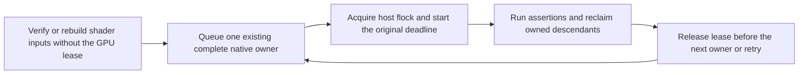
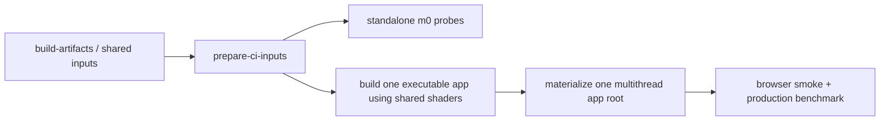
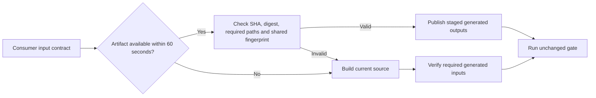

# CI operation and iteration

## Conservative workload trimming

The [2026-10-06 audit](workload-audit-2026-10-06.md) ranks real job, step and
case durations. Keep every job and test case before considering larger cuts.
Prefer removing a GPU prefix replay whose pixels are never consumed: captured
pipeline/binding facts already live in `buildFrameModel`; independently asserted
texture and presented-pixel reads, fresh devices and falsifiers remain mandatory.
Canvas initial pixels do not need an additional uninspected frame tape.

The standalone point-shadow public-surface test uses admitted prepared inputs,
with ordinary source fallback. Coverage prepares the existing `point-ssao`
profile through `prepare-shader-release-inputs.mjs --build --profile point-ssao
--shared-input-manifest shared-app-inputs/manifest.json`; verified shared inputs
re-project without compilation, while stale or damaged receipts rebuild.
The full source-built Vite manifest integration,
real single-worker Naga compilation and forced-source cache/fallback regressions
remain the source-path owners. Do not replace these with synthetic WGSL or remove
their source forcing.

Only diagnostic workload changes depend on the existing lightweight flags:
external-video CI measures 960x540 and 1280x720 sources, and specular-AA cost CI
uses 384x384. Local diagnostics retain 720p/1080p and 1024x1024 respectively.
Timing reports identify the actual resolution and sampling window; compare equal
workloads before claiming a performance improvement. Correctness thresholds,
source import/copy assertions, all quality references and smoke budgets survive.

Run `37440428941` preserved the complete Browser, Smoke and SDK journeys but
its fourth Dawn lane exceeded the existing 27-minute limit. The second lane
finished in 795 seconds. Move the complete `renderer` and `gi-2` owners to the
second lane, including the renderer's required disabled-point-shadow source
profile (240 seconds on the failed lane). Keep four serial native lanes and
their original deadlines. This rebalances execution; it does not remove the
source control or claim a reduction in total machine work. Require complete CI
again after the move.

At `9f03d86d4616`, run `37465917882` passed all four Browser lanes but cancelled
Dawn lane two at its original 27-minute bound. Its completed base producer,
ordinary, compact, Surface and renderer owners took 347.536, 824.124, 135.264,
219.845 and 25.570 seconds. Heavy four was unfinished and GI two never started.
Lane one completed in 827 seconds. Transfer complete renderer/GI-two owners and
the renderer's conditional producer to receiving headroom; reconcile newer main
placements using complete group measurements, not a larger job budget.
All 35 groups, four partitions, native boundaries and original limits remain.
These are placement estimates until complete new-head CI succeeds.

Main `ce1fff291` also transfers complete GI-four to lane three and GI-five to
lane two. Retain those moves: this combined source measured them at 126.416s
and 159.140s respectively. Keep transmission on lane three because the observed
ordinary-two owner alone takes 824.124s. The combined allocation has renderer
and GI-two on lane one, Surface/GI-five on lane two, transmission/GI-four on
lane three and the original feature-depth/specular/direct-light tail on lane
four. Actual exact-once discovery, conditional preparation and full new-head
execution must qualify the resolved allocation.

## Pack revision hashing and build memory

Run `37465917882` failed the complete hello-GI build with a Node heap exhaustion.
The same Vite/Sponza build reproduces locally with Node 22.22.3 and the original
2-GiB heap. A diagnostic allocation trace identifies `revisionStable` recursively
mapping the already transported numeric shader-byte arrays while the heap is
near its limit. Consume canonical numeric arrays directly in revision and package
hashing; keep object-key ordering, native-byte digests and mixed-array traversal.
There is no persistent cache, serialization change or increased heap budget.

The exact original revision goldens and mutation controls pass. After rebuilding
Pack, the complete GI build passes at the same 2-GiB limit in 3m53s; both original
OOM runs remain failures. This local memory correction is not a controlled CI
speed measurement. Require full final-head build, native and four SDK routes.
Package build fingerprints exclude Rust `target` directories before walking the
package tree. Cargo can remove temporary metadata while TypeScript preparation
runs; those scratch outputs are neither source nor published inputs. Rust source,
Cargo manifests and generated `pkg` WASM/glue remain fingerprinted. App asset
inventory keeps its original directory rules. Verify these boundaries with
`node --test scripts/__tests__/build-task-cache.test.mjs`.

## Concurrent local sessions and the GPU lease

When several agent sessions share a POSIX host, use the canonical gate's
per-owner admission instead of wrapping a full build or test suite in `flock`:

```bash
FORGEAX_LOCAL_GPU_LEASE=1 pnpm test:browser
FORGEAX_LOCAL_GPU_LEASE=1 pnpm test:dawn
FORGEAX_LOCAL_GPU_LEASE=1 pnpm ci:focus --kind smoke --select all --frames 60
```

For a shared host under CPU pressure, set `FORGEAX_PACKAGE_BUILD_CONCURRENCY=1`,
`FORGEAX_SHADER_COMPILE_WORKERS=1` and `CARGO_BUILD_JOBS=1` before preparation.
The Dawn entry preserves explicit package concurrency and defaults to two when
unset; it does not change native ownership or test bounds.

Python 3 supplies the OS `flock`; no Python packages are needed. The switch is
opt-in and does not change hosted CI scheduling. It interoperates with existing
exclusive users of `/tmp/forgeax-physical-gpu.lock`. Never delete the lock file
or cancel another session's holder to free the device.



| Boundary | Lease scope |
|:--|:--|
| Split Browser rendering roster | One unchanged fresh-process group per attempt; shared shader preparation stays outside. |
| Qualified Browser Host contracts | No GPU lease, shader or Pack preparation; real Chromium uses software DOM presentation and rejects graphics API acquisition. |
| Browser suite companions | Entity visibility, DevKit runtime Pack and Mesh-IO parity each own one complete command. |
| Dawn roster | One ordinary group or existing native partition per attempt; shared shader preparation stays outside. |
| Full Smoke roster | One complete declared command, including its original frames, assertions and falsifiers. Focus builds occur before admission. |
| Prepared standalone probe | `FORGEAX_LOCAL_GPU_LEASE=1 node scripts/ci/local-gpu-lease.mjs --timeout-ms MILLISECONDS -- node path/to/probe.mjs` |

Do not add an outer exclusive wrapper around these commands: nested acquisition
would prevent per-owner release. Native Smoke commands propagate a private held
lease marker so their child partitions do not acquire the same lock again; do
not set that marker manually. CPU work inside an individual fixture or companion
command still belongs to that complete owner's lifetime. This does not move
runtime cooking to a different path or skip preparation.

The `[local-gpu]` records separate queue and execution milliseconds, append an
absolute UTC `at` timestamp, emit a
waiting heartbeat every 30 seconds and confirm release after process cleanup.
The original process/test deadlines start after admission. Queue cancellation
starts no native command; command cancellation retains the original process-tree
stopper. A missing Python executable, replaced lock inode or failed holder is
a failure, never permission to run without the lease. A holder's stdin closes
on parent death, releasing its OS lock without a stale PID-file recovery flow.

Standalone owners must supply their original complete process budget through
`--timeout-ms`; missing, invalid or overflowing budgets fail before queueing.
The existing process runner starts this budget after admission and returns 124
on timeout, retaining child output and reclaiming its private descendants before
release. A stalled module, Worklet, page evaluation or teardown cannot bypass
this outer bound. Keep the owner's stage/test budgets as well; the process bound
does not identify which internal await stalled or turn an incomplete run into PASS.

| Browser companion | Complete process ceiling | Existing inner contract |
|:--|--:|:--|
| Entity visibility | 300,000 ms, ordinary Browser process envelope | 60-second test |
| Runtime Pack Worker | 2,700,000 ms, existing Browser CI job ceiling | Four JS/TS dev/build cases and two 420-second Game 3D cases |
| Mesh interchange | 2,700,000 ms, existing Browser CI job ceiling | Complete Catalog, replay, download and pixel witnesses |

The latter two ceilings are final cleanup backstops for previously unbounded
local companion commands, not new per-test budgets or measured durations. Hosted
CI retains its original job ceiling; every original assertion and inner deadline
remains. The standalone regression uses real processes and private OS locks,
including a stalled module and a TERM-resistant descendant, then admits the next
owner only after cleanup. It acquires no physical device.

The October 6 Console audit found full-suite exclusive wrappers in temporary
Python scripts, including SDK verification with CPU preparation under the lock.
Navigation's transcript reported roughly ten hours queued; skeletal motion's
wrapper serialized independent Browser and Worker probes. These are transcript
observations, not an aggregate host throughput measurement. The lease regression
uses real OS locks and child processes to verify an execution deadline survives
a longer queue wait, release between owners, failure/cancellation and descendant
cleanup. Reproduce with `node --test scripts/ci/__tests__/local-gpu-lease.test.mjs
scripts/ci/__tests__/gate-process-lifecycle.test.mjs`.

> [!IMPORTANT]
> This change reduces the scope of admission; it does not claim faster GPU frames
> or enable concurrent native correctness tests. Performance captures need an
> uncontended physical device, and mixed Browser owners have already reproduced
> timeout and memory-pressure failures. CPU preparation and separate qualified
> devices/hosts can run concurrently; qualify any new same-device concurrency
> against the unchanged full cases, deadlines, pixels and cleanup before enabling
> it. A software adapter is not physical-GPU performance evidence.

## DevKit consumer preparation and canonical roots

For a cold contributor worktree, build package JavaScript/declarations first.
Run the ordinary project, Vite archive, builtin Worker and module-identity
contracts before expensive shader source preparation. Canonical project roots
come from `readProjectFacts`; temporary fixtures must compare the same real path
rather than a platform alias such as `/var` versus `/private/var`.

Named `shader-check` still builds the complete ordinary project and adds the
requested WGSL as an entry. Without verified shared or packaged Engine inputs,
that route can cold-compile the builtin fleet before reaching the named file.
Prepare through `scripts/build-shared-inputs.mjs` outside the GPU lease, retain
its actual compiler/source/profile/Node receipt and payload digest, then pass
`FORGEAX_SHARED_APP_INPUTS_MANIFEST` to the ordinary consumer. Missing, stale or
forced-source inputs retain the existing source producer; do not disable Engine
entries or raise the named-file test deadline to get a pass.

Separate page assertions, Context close, Chromium process exit, and Vite/HTTP
cleanup when diagnosing Host fixtures. The existing `FORGEAX_CHROME_CHANNEL`
selects a provider only where the fixture supports it. A framework exit 0 does
not qualify a Chromium teardown watchdog/native exit 2. Preserve the original
case budgets and real final CI; browser sharing or deadline changes require
independent lifecycle evidence rather than a faster single diagnostic sample.

## Browser Host contracts without GPU admission

The split runner separates the exact roster in `browser-host-files.json` from
Renderer owners. Input events, browser WebSocket endpoints, Web Audio and DOM UI
contracts use `config/vitest.browser-host.config.ts`: real Chromium, existing
interaction/audio policies, the PCM HTTP fixture and real Node WebSocket listeners.
Chromium runs with `--disable-gpu`; a setup guard rejects WebGPU adapter requests
and WebGL/WebGPU canvas contexts before native acquisition. A contract that grows
a rendering dependency must move back to the native config rather than fallback.
Unknown files keep the existing native route.

### Browser dependency cache isolation

Host and Native projects retain the same Vitest project name, but have different
plugins and dependency collections. Host therefore uses the explicit checkout-local
`node_modules/.vite/browser-host` cache. Native keeps its existing cache. Sharing
their default cache lets Host startup invalidate a dependency URL already published
by a running Native server.

The regression resolves both maintained configurations, starts real Vite servers,
and checks that the Native dependency publication survives Host preparation and
still returns HTTP 200. The shared-cache control loses that file; a later source
request can repair it, so a successful fresh source request does not disprove the
race. A software Chromium probe also rejects the old published dependency import
with the shared cache and imports it with isolated caches. CI import failures have
matching startup chronology, but their original HTTP request chain is unavailable;
this qualifies the cache invariant rather than attributing every import failure to it.

```bash
node --test scripts/ci/__tests__/browser-cache-isolation.test.mjs
```

No native launch flags, process boundaries, rosters, deadlines or GPU admission
rules change. Require complete final-head Browser and CI acceptance after the fix.

Roster discovery also skips the exact generated owners
`packages/wgpu-wasm/target` and `packages/dawn-node/.native-build` in both Vitest and
the split runner. Local native builds can leave large trees there; repeatedly
walking them does not discover Engine tests. Other source directories named
`target` remain eligible. Verify the real Vitest roster through
`scripts/ci/__tests__/browser-test-discovery.test.mjs`; this changes traversal,
not native test ownership.

| Preserved boundary | Behavior |
|:--|:--|
| Complete roster | Every file remains scheduled once; Host and rendering groups never mix. |
| PCM Range/output owner | Retains its singleton process and seven native audio assertions. |
| UI capture owner | Keeps real PNG bytes and the existing small-group bound. |
| Test/process deadlines | Unchanged; Host groups retain 300 seconds and existing case limits. |
| Native shader inputs | One verified producer before the first rendering consumer, outside its GPU lease; Host groups need no shader publication. |

The first local Node 22 / headed Chromium qualification passed all 21 files and
76 assertions across five groups at concurrency two, with
`FORGEAX_LOCAL_GPU_LEASE=1`, no lease records and no retry. This qualifies these
Host contracts only; it does not qualify simultaneous same-device rendering or
claim an overall CI speedup. Preserve native Renderer, Dawn, Smoke, frames,
falsifiers, pixel thresholds and original failure evidence.

The headless `CI=1` local qualification also passed all 76 assertions in 84.874
seconds. All 135 nonblocking lock samples observed another holder; Host groups
recorded no GPU queue or shader producer. The Chrome launch-policy probe reported
software GPU compositing/rasterization and SwiftShader. These are local subset
facts, not continuous GPU utilization or Linux CI timing. Raw group receipts and
the blocked initialization-baseline limitation are retained in
[`browser-host-qualification-2026-10-06.json`](evidence/browser-host-qualification-2026-10-06.json).

Reproduce scheduling/admission and graphics rejection with
`node --test scripts/ci/__tests__/run-split-vitest-browser.test.mjs`.
For a focused real-browser check, use the existing selector:

```bash
FORGEAX_LOCAL_GPU_LEASE=1 node scripts/ci/run-split-vitest-browser.mjs \
  --file=packages/input/src/__tests__/browser-edge-latch.browser.test.ts
```

The Host canvas guard normalizes its context argument with DOMString coercion before classification. Boxed strings and custom string coercion must reject graphics before forwarding; native 2D coercion runs once and Symbol arguments retain their TypeError. This guard is a test-realm tripwire, not a security boundary or proof about arbitrary Workers.

Do not wrap Host groups in an outer GPU lock. The full Browser gate remains
`FORGEAX_LOCAL_GPU_LEASE=1 pnpm test:browser`; its native companions keep their
complete GPU admission boundaries.

## Browser startup and authored material reuse

Compare the native owner's elapsed time with Vitest's reported duration before
attributing a slow group to its cases or the GPU lease. In PR #3678's successful
[Browser shard 1/4](https://github.com/ForgeaX-Games/forgeax-engine/actions/runs/37435838491/job/112181693821), 23 native groups had roughly 30 seconds outside Vitest's
reported duration (median 30.439 seconds). The first exclusive Worker group
started at 08:45:45.800 UTC, printed `RUN` at 08:46:15.331, then completed only
0.684 seconds after Vitest's final duration line. There were no local-lease
records in that CI job: this was startup work, not lock queueing.

File-only `vitest list --filesOnly` intentionally skips project plugins, so it
cannot measure that startup. A Node 22 CPU profile of the real Browser project
initialization, without launching Chromium, identified Naga composition as the
main CPU path. That diagnostic pair used `CI=1`, Node 22.23.2 and the host's
inherited `NODE_ENV=production`; it is not an equivalent CI environment.
Authored packages previously created independent program
compilers even when they were aliases of the same Standard source.
The shader plugin now shares the existing bounded compiler within one package
preparation batch. It still cooks every package, publishes each identity and
retains all variants; there is no persistent cache or alternate runtime route.

The standalone builder also reuses admitted base/point engine inputs when
`materialPackages` is nonempty. Previously that option bypassed packaged reuse
and invoked the complete engine source producer again. Each authored package
still reads and cooks its own source; the engine projection preserves SSAO from
the prior authored source-build roster. Configured shared-input precedence,
missing/stale-profile recovery and explicit forced-source validation retain
their original routes. The input-ownership regression uses bounded engine
fixtures, forbids engine source jobs after admitted-profile selection, runs
real Naga for a fresh authored package and rejects a missing authored package.
An actual Node 22 point-profile build with
`apps/hello/physical-material/src/standard-clearcoat.pack.json` completed in
16.333 seconds (17.82-second process, 4.39 user-CPU seconds), publishing 68
entries and 27 material identities with SSAO retained. This is a loaded-host
producer sample after profile reuse, without a comparable source-build baseline
or GPU frames; it does not establish native rendering performance.

| Evidence | Before | After | Meaning |
|:--|--:|--:|:--|
| Real Naga compositions for two identical Standard aliases | 12 | 6 | Deterministic regression; both aliases retain six identical variants. |
| Browser project creation in one loaded-host CPU-profile pair | 89.860 s | 46.523 s | Batch reuse only; diagnostic wall time with uncontrolled contention/warming. |
| Entire initialization/close diagnostic process user CPU | 45.88 s | 40.96 s | Includes Pack startup and shutdown, not only shader work. |
| Diagnostic maximum resident bytes | 1,485,209,600 | 1,999,077,376 | A negative sample; this pair does not establish a memory improvement. |

> [!IMPORTANT]
> The sampled wall-time difference is not an admitted CI or GPU speedup.
> The compiler regression proves eliminated duplicate compilation, unchanged
> alias publications and rejection of a missing fragment entry after a reusable
> source has been compiled. Preserve fresh native owners, full Browser/Dawn/Smoke
> rosters, frames, pixels and deadlines. Complete final-head CI remains required.

Reproduce the regression on the real shader compiler with:

```bash
pnpm exec vitest run --config packages/vite-plugin-shader/vitest.config.ts \
  packages/vite-plugin-shader/src/__tests__/authored-material-reuse.integration.test.ts \
  packages/vite-plugin-shader/src/__tests__/packaged-builder.unit.test.ts \
  --typecheck.enabled=false --maxWorkers=1
```

For CPU-only diagnosis, use Node 22 and the same prepared point-SSAO inputs as
the Browser gate. Missing inputs retain the source build path and change the
workload. This diagnostic uses the pinned Vitest initialization API; it does not
run Browser assertions or constitute native acceptance:

```bash
CI=1 node --cpu-prof --input-type=module -e '
import { createVitest } from "vitest/node";
const start = performance.now();
const ctx = await createVitest("test", { config: "config/vitest.browser.config.ts", run: true, watch: false });
console.log("createVitestMs", performance.now() - start);
try {
  await ctx._initBrowserServers();
  console.log("browserServersMs", performance.now() - start);
} finally {
  await ctx.close();
  console.log("closeMs", performance.now() - start);
}'
```

### Concurrent material composition

The scoped material compiler must retain its pending composition before awaiting
Naga. [Raw qualification and negative evidence](evidence/material-composition-concurrency-2026-10-07.json)
separate call-count equality from Catalog and complete-CI acceptance. Otherwise two identical concurrent requests both miss the cache and do
real composition work. The maintained regression first observed two actual
Naga calls for two successful identical inputs; pending reuse reduces that to
one while retaining independent mutable result metadata. A rejected composition
is removed so the same input can retry. Pending source and completed WGSL bytes
share the original 128-entry / 16-MiB joint cache budget; evicted pending work
cannot restore itself on completion.

```bash
pnpm exec vitest run --config packages/shader-compiler/vitest.config.ts packages/shader-compiler/src/material/__tests__/program-compiler.test.ts --maxWorkers=1
```

> [!IMPORTANT]
> This CPU regression proves eliminated duplicate composition. It does not prove
> that repeated keys in Catalog profiling have this cause, that the Catalog
> completes within 90 seconds, or that native GPU frames or complete CI improve.
> Preserve the original Catalog, Browser, Dawn, Smoke and final-head SDK gates.

## Preview template browser cleanup

The Preview template smoke sends the existing `VAG_PREVIEW_DISPOSE` Host
message and waits for inspection/UI retirement before destroying a running
page. Asynchronous `pagehide` cleanup cannot finish after page destruction;
closing the live Worker/GPU page first can stall Chromium context teardown.
The original ten-second cleanup deadline still applies, and page, context and
browser cleanup remain independent after a disposal failure. Reproduce with
`node --test scripts/ci/__tests__/template-smoke-lifecycle.test.mjs` and
`pnpm --filter @forgeax/preview smoke:templates`; the latter is the real browser
gate and retains its original 90-second server readiness bound.
The smoke owns a public Playwright `BrowserServer`: its graceful close waits
for process termination, rather than closing a private protocol connection.
If that original ten-second close fails, a separate bounded ten-second kill
retires the owned process; the original failure still fails the smoke.
Launch and client connection share one original 30-second startup budget.
The [Playwright process contract](https://playwright.dev/docs/api/class-browserserver)
defines graceful close and forced termination. Keep the full template journeys
and distinguish successful execution from failed process cleanup.
Template readiness consumes the existing successful App GPU-receipt document
projection (`forgeaxFrameCompleted`) within its
original single 30-second deadline. Animation-frame settling ticks remain, but
cannot prove GPU completion.
Empty/engine-less projects retain their structural-only admission. The browser
channel derives from `browser-launch.json`. The Vite child explicitly uses
`NODE_ENV=development` for its scoped Pack protocol; an inherited production
value otherwise directs the browser to the absent shipped `pack-index.json`.
App owns native plugin disposal;
Preview removes its UI/inspection after that owner finishes, without a second
Fiber cleanup array. The stop listener is installed before asynchronous
Catalog/native-plugin startup. The existing inspection is published only
after native roots activate and the stop listener is installed; its factory
constructs the game registrar without advertising a partially started App.
The full browser gate holds the ordinary empty Scene package request, rejects
premature readiness, releases that request, then verifies disposal within the
same ten-second bound. Preview's Node/jsdom project externalizes the actual App
distribution so its Node filesystem dependency closure is not client-transformed.

## SDK source preparation ownership

Full archive verification completes source installation and all original Engine,
Tool and Preview builds before starting consumer journeys. Previously, the
background source build overlapped consumer deadlines; an early Game3D test
failure removed the unpack directory while its source build was still alive.
The verifier now awaits that preparation before consumer work. Source browser
smoke remains in its original later phase. All groups, build commands, browser
backends, frame counts and deadlines remain unchanged.

Run `node --test scripts/ci/__tests__/sdk-source-preparation.test.mjs` for the
process ownership regression, then run the complete `pnpm sdk:verify --archive
<archive>` gate. The small regression exercises the actual verifier preparation
phase with real child processes; it is not Engine or browser acceptance.

## October 5 SDK critical-path balance

The final [SDK PR run 37237458726](https://github.com/ForgeaX-Games/forgeax-engine/actions/runs/37237458726)
on `aef50f517689d69eeee3a1ed01d609bc522a2703` passed every check. Its active
critical path was **34m00s** (650s seed + 1367s View lane + 23s aggregate),
while queue-inclusive wall time was **36m37s**. The same commit's
[Main CI 37237458735](https://github.com/ForgeaX-Games/forgeax-engine/actions/runs/37237458735)
passed with an active critical path of **30m28s** and wall time of **45m41s**.
Engine PR #3614 merged as `90ee60760e66f899025a00c0e14fb76d98e6e60c`.

> [!IMPORTANT]
> The user explicitly excluded Runner waiting from this optimization target on
> October 5. Keep all PR workflows, preparation, testing, aggregation and cleanup
> within forty active critical-path minutes, then pursue thirty. Record wall time
> separately. Derive active finish times from the actual workflow `needs` DAG:
> each job adds its execution duration to the maximum active finish of its
> dependencies; each matrix contributes its maximum leg. Do not sum parallel
> queue waits or subtract that sum from elapsed wall time. Older queue-inclusive
> receipts below retain their original measurement scope.

The View consumer ran two complete installed-package journeys serially while
Project had substantial headroom:

| Exact gate in that run | Observed active seconds | Current archive group |
|:--|--:|:--|
| Project verification shell step | 285 | `project` |
| Paired diagnostic View probe | 505 | `view` |
| Installed JS/TS live/cold and Game 3D View journeys | 634 | `project` |

Move the entire installed-runtime owner to Project, preserving live-to-saved-to-
cold dependencies for both languages, independent native processes, Game 3D,
all lifecycle/pixel/device-retirement assertions and the immutable-store check.
The complete default `sdk:verify` still runs both View owners serially and exactly
once; npm and public-source qualifications retain their own complete routes.
The four matrix groups and seed/hash/revision aggregate are unchanged.
Evidence stays under `view-zip`, uploaded by whichever group owns the journey.

Using those measured component costs, the redistribution estimates approximately
**28 minutes** including the seed and preparation. This is placement arithmetic,
not a measured improvement; require complete CI on the new final PR commit.
Reproduce routing and conservation with
`node --test scripts/forgeax/__tests__/sdk-pr-preflight.test.mjs scripts/ci/__tests__/sdk-pr-preflight-contract.test.mjs`.

### Measured balance and verified profile reuse

The first redistribution head `19fd8f54fd0cdb331011cce5fdf300bbed2053f6`
passed complete SDK [37241091382](https://github.com/ForgeaX-Games/forgeax-engine/actions/runs/37241091382).
Its observed active critical path was **33m31s** (856s seed + 1133s Project +
22s aggregate), with **35m47s** wall time. View fell from 22m47s to **8m43s**,
and the longest consumer fell to **18m53s**. Slower preparation in this run
mostly offset the placement gain; this does not meet the 28-minute estimate.
The installed-runtime owner still passed all five complete journeys in 633.4s.

The seed spent **187.0s** preparing release shader profiles. Preserve that
producer's generated `shared-build-inputs-release/` as optional acceleration,
and restore it through the SDK PR workflow cache. After rebuilding Engine,
the profile producer checks the existing source/compiler/profile fingerprint,
actual shader payload digest and expected payload location before reuse.
The cache lookup key is not admission authority. A platform/Node prefix also
looks up older generated inputs after unrelated runtime/test edits; current
compiler/source/profile and actual payload bytes still decide admission. The existing transfer receipt
is portable across checkout paths and avoids relying on a local cache receipt
whose locator contains the old absolute root.

| Cache state | Required producer behavior |
|:--|:--|
| Matching compiler, WGSL, flags, Node version and payload bytes | Reuse the full profile; log `verified cached ...; compile count=0`. |
| Missing, malformed, corrupt or stale input, including changed compiler WASM | Rebuild the entire profile from source through the unchanged producer. |
| `FORGEAX_BUILD_NO_TASK_CACHE=1` | Ignore both shared and cached inputs; compile from source. |

The generated inputs are ignored by Git and remain outside the SDK source and
archive inventories. All consumer and Release qualification remains mandatory;
no cache hit can skip a consumer or make a failed gate successful. Measure cold
and matching-cache SDK runs separately. GitHub cache branch scope limits reuse;
never describe a warm-cache result as a guaranteed cold first-run duration.
SDK writes the profile admission lines to stderr while retaining its final JSON
stdout. Cache steps have no failure override; the ordinary no-override gate remains.
Cache v2 transfers only each profile's receipt and self-contained shader manifest.
Standalone WGSL/GLSL/binding diagnostics are not consumed by profile admission and
are excluded even if an older local directory retained them. The observed v1
cache was 216 MB compressed; v2 transfer size and end-to-end savings require real
CI measurement. A new cache namespace makes the first v2 run cold, followed by
a same-commit warm rerun; both retain the full source fallback and consumers.
The profile CLI regression tests actual restore, portability and invalidation
branches, and complete real CI must qualify the final commit.

### SDK software-GPU CPU envelope

The first SDK seed and consumers reported an **8-vCPU cgroup quota**, while
Main's existing affinity log exposed **96 allowed host CPUs** with the same
8-vCPU budget. SDK's independent-input, npm and archive browser commands did not
invoke that existing envelope. Wrap these three complete owners with
`run-with-runner-cpu-affinity.mjs`; Chromium, software Vulkan and descendants
inherit the quota-sized allowed mask. This is a CPU-contention hypothesis,
not a measured SDK speedup. The existing identity-based placement is not an
exclusive CPU lease. Retain browser flags, all qualifications and deadlines,
and measure complete cold and matching-cache SDK runs on the final commit.
Changes to the affinity script or its resource owner also trigger SDK preflight.

### Remove the seed browser barrier and balance language chains

Complete warm SDK [37252899230](https://github.com/ForgeaX-Games/forgeax-engine/actions/runs/37252899230)
on `acca1d838` passed all consumers in **41m07s active critical-path time**:
977s seed + 1466s Project + 24s aggregate. Its cache correctly reused both
profiles, but the seed's independent-input browser gate consumed 488s before
any consumer could start. View took 486s, Source 983s and npm 973s.

Move that complete independent run into View, against the archive's byte-verified
installed Engine and its real CLI/focused public exports. All immutable-input,
HTML/Shadow DOM pixels, eight parallel read-only observations, reload, replacement
and stop assertions remain. Seed no longer installs or runs a browser. The
mandatory aggregate still requires all four consumers, so this changes the
dependency barrier rather than removing the gate. The script's ordinary local
default still uses the built contributor umbrella; SDK never falls back to it.

Project's installed JS live-to-saved-to-cold chain measured **213.700s**. Move
that complete chain to View; Project retains the complete TS chain and installed
Game 3D. Both languages keep their own saved snapshot and cold replay on one
Runner. The default verifier and npm route still run all five installed journeys
serially in their original order. An actual subprocess/filesystem scheduler
regression verifies both chains, exact-once conservation and rejection of an
unknown group. The default archive verifier also executes the independent gate.

Subtracting only the measured 488s barrier and moving the measured JS chain
predicts a longest Project path of **29m25s**, including the unchanged aggregate.
Source predicts 24m56s, View 28m20s and npm 24m46s. These are placement estimates
using different Runner loads, with no snapshot/geometry speedup assumed. Require
complete final-head Main and SDK CI within forty active minutes before merging.

SDK PR preflight also inherits Main's existing `LP_NUM_THREADS=4` setting for
Mesa rendering; affinity alone does not declare that pool's thread count. This
does not control SwiftShader's own threads and is not a claim that the SDK
timeouts came from Mesa. The warm `acca1d838` seed verified both shader profiles
with no compilation (415ms preparation), but the independent run still took
488s: first startup through evaluation consumed 247s. Time its actual launch,
capture, reload and replacement operations with `sdkStage` before attributing
the remaining cost; every lifecycle and original bound remains mandatory.

### Independent-run snapshot I/O

A local run of the actual immutable-input producer copied **21,085 files and
715,611,353 bytes in 80.85s** against the built Engine dependency closure. A
diagnostic repeat measured planning at 28.24s but failed after an external
TypeScript input changed; that failed attempt is not a timing qualification.
Keep both complete closure scans and the fail-closed retry/version checks.

Snapshot planning now derives metadata and type from one bigint stat per entry.
Files at most **64 KiB** use one bounded read/write instead of three streams;
larger payloads retain streaming. The byte order, digest vocabulary, executable
bits, readonly outputs, dependency links, cancellation and atomic retirement
remain unchanged. The real producer regression checks empty files, both sides of
the buffer boundary and an executable against a version receipt from the original
streaming producer. All ten snapshot cases and four installer cases pass locally;
measure actual SDK launch/reload/replacement stages before claiming a speedup.

The warm `acca1d838` npm consumer passed in **16m13s** (previous failed-run npm
consumer: 25m52s on `b53033c`). Actual new stages measured SDK installation 9.805s,
paired View 280.011s, JS live/cold 79.839s/47.584s, TS live/cold 80.735s/48.140s,
and installed Game 3D 258.339s. Different Runner load prevents attributing that
end-to-end delta solely to the installer change. SDK Project and complete Main
are still required; the paired Main Editor admission failed on this head.

### Paired View scene geometry and pixels

Main `acca1d838` failed the unchanged ninety-second Editor admission with only
thirty ready frames. Its real RHI tape has 56 work items, healthy World/Renderer
state, no GPU errors and a SwiftShader adapter. GPU receipts took approximately
2.2 seconds at a 577x376 scene extent; these observations do not isolate the cost
of any single draw or prove a shader defect.

The diagnostic-only CI viewport becomes **860x660**, and the copied scene uses
128-square shadow maps instead of 256. Its disposable project also reduces
sphere/cylinder/torus tessellation and the three parametric surfaces to
24 longitudinal segments and 8 or 10 cross segments. Every mesh identity,
material slot, surface kernel, double-sided topology, scene entity, light and
interaction remains. Formal templates, installed SDK bytes and full diagnostic
defaults remain immutable. Retain sixty ready frames, the original ninety-second
admission, all sky/pixel/RHI falsifiers and both real resize transitions. The
actual preparation regression compares the complete copied roster, unchanged
source bytes and all content outside the explicit segment reductions. Validate
the complete Main and SDK consumers on the final head; this is a workload change,
not a measured end-to-end speedup.

### GTA complete Dawn job-bound recovery

Exact `217dfaf37` CI `37584066711` completed every lane-2 native group but its job exceeded the original 27-minute bound. Complete GI-2 measured 188.140s; moving only that owner from lane 2 to lane 1 projects lane 2 gate cost at 1331.928s and lane 1 at 1036.407s. All owners, native arguments, frames, falsifiers and the job bound remain unchanged. These are transfer estimates; final-head complete CI must validate them. The original cancellation remains a failed gate, separately from Pack-reader and Preview/SDK failures.

### Complete Dawn recovery on the SDK follow-up

Main [37241091418](https://github.com/ForgeaX-Games/forgeax-engine/actions/runs/37241091418)
on `19fd8f54fd0cdb331011cce5fdf300bbed2053f6` was **cancelled**, not accepted.
Dawn lanes 2 and 3 reached the original 27-minute job bound during transmission
and the final GI-2 reflection file. Their earlier assertions passed; ordinary
processes consumed 966s and 628s. Lanes 1 and 4 passed in 19m10s and 19m38s.
Move complete transmission from 2 to 1, GI-2 from 3 to 4, and GI-5 from 4 to 3
(the latter consumed 164s). This balances remaining work without changing any
native process boundary, assertion, profile, frame count or deadline. Historical
GI-2 and transmission costs vary across hosts; placement is an estimate until
another complete final-head Main run passes. Four lanes and serial GPU work remain.

### Surface browser static warmup recovery

At `165612a4b`, Main [37245520259](https://github.com/ForgeaX-Games/forgeax-engine/actions/runs/37245520259)
failed Surface's unchanged 300-second case: the real linear-HDR optical oracle
passed, MSAA's full five witnesses plus fifteen moving and five resized witnesses
passed after 145s, and the first App/device-loss lifecycle passed before the second
reached the case bound. CI halves each MSAA lane's first static warmup from
sixteen to eight completed frames. Every 1x/4x lane, camera offset, resize, HDR
readback, independent pixel mask/falsifier and epsilon remains mandatory. Other
warmups stay at two; ordinary and Native qualification retain sixteen. Require
real Browser CI to falsify insufficient settling; do not increase its timeout.

The same run rejected the new cache step's failure override; remove it rather
than exempting a cache action from the canonical no-override gate. View-2 also
failed a ten-second ready-frame capture with a live, healthy editor renderer;
its failure had no uploaded artifact. Preserve this structured failure and
require complete current-head View acceptance. A later pass alone does not
establish its root cause.

### SDK gameplay inspection and complete browser lifetimes

SDK Project at `165612a4b` failed its unchanged 120-second player-read bound
before installed View execution. Engine Worker inspection admission happens at
a frame boundary; the verifier previously activated its headed page only after
this baseline read. Activate the real page before navigation/readiness and all
asynchronous gameplay inspection. Keep startup, movement, FixedTick and cleanup
assertions, real Worker execution and original bounds. The actual readiness-body
ordering regression is red before and green after this correction. This is a
necessary page precondition, not yet proof that foreground scheduling caused the
observed timeout. Failed gameplay now reuses the existing bounded runtime/server
diagnostics before teardown, preserving the original cause; diagnostic evaluation
has a separate ten-second bound and cannot turn failure into success.

Main Browser-0 exhausted the four-file framebuffer/environment/light/MRT group
on both 300-second attempts. The full environment file alone consumed 223s;
light casters consumed 33s before the other owners finished. Keep each complete
file in its own existing bounded browser process, with four shards and no test
or timeout changes. Actual discovery and dry-run conservation remain required.
Complete current-head browser/SDK execution decides acceptance; absence of a
failing assertion in an incomplete process is not a pass.

## October 5 View workload and complete Dawn tail

At `b53033c58`, all four Browser lanes passed, including the unchanged Surface
pixel/lifecycle witnesses with reduced initial warmup. SDK cache v2 was cold:
the profile producer compiled from source (145.472s), the seed passed in 11m14s,
and the compressed saved cache was 3,007,864 bytes versus about 216 MB for v1.
SDK View and Source passed, but Project again reached its original player-read
bound. Complete SDK/Main acceptance remains absent. The gameplay failure
diagnostic now lives outside the operation's `try` scope; its actual-body
regression proves original-cause retention and diagnostics before independent
page/browser/server cleanup.

View-2 repeated the ten-second mesh-preview capture failure. App returns the
actual failed target's submitted/ready floor, extent, Renderer environment and
execution evidence, also derived into the textual hint when a consumer's error
printer collapses nested detail. Do not change ready admission, drive a second
frame loop, increase the timeout or claim an unobserved root cause.

The generated Worker game remained healthy through 300 initial completions,
which consumed 205.798s, then reached its unchanged 480-second case bound during
1280x720 resize qualification. CI samples sixty initial completed frames and
sixty after a real 640x360 resize; all input, pointer lock, physics, animation,
pixels and Worker assertions remain. Ordinary diagnostics retain 300 initial
frames and 1280x720. Full final-head CI must validate this workload reduction.

The npm consumer passed but occupied 25m52s, including preparation and cleanup.
Its captured output did not time the real install, carrier extraction, paired
diagnostic probe or individual installed JS/TS live/cold/Game3D journeys. Reuse
`sdkStage` for those actual operations, retaining final JSON stdout and every
consumer; do not attribute the whole job to one unmeasured phase.

The npm carrier installer previously copied every extracted SDK entry into
private staging, then removed its download directory. Both private directories
are created under the target's parent. Move their entries on that filesystem
after exact-version admission instead: this eliminates the second SDK copy and
retains carrier hard links and relative symbolic links. The actual installer
filesystem regression is red before adoption and green after it; real npm
installation and final-head consumer checks still decide delivery. No measured
CI speedup is claimed until that run completes.

Gizmo admitted sixty real frames after 85.5s at roughly 1050x672, passed its
first ten pointer witnesses, then exhausted the unchanged 300-second process
bound during uniform scaling. CI uses an 860x780 page, a real 740x740 resize,
and four drag interpolation steps instead of twelve. All endpoint assertions,
cancellation modes, local/orthographic/parent cases, two resource-transition
rounds, screenshots and frame admission remain. Ordinary and performance runs
retain the original viewport and interpolation. This is a workload hypothesis
until complete real CI passes.

Preview's last template failed its ninety-second Catalog readiness bound after
Vite reported ready, with no HTTP status. Preserve the last fetch failure's
name, message and cause code in that existing bounded failure; no deadline or
readiness admission changes. The producer cause remains unclassified.

View [PR #130](https://github.com/ForgeaX-Games/forgeax-view/pull/130) passed
complete CI [37235427636](https://github.com/ForgeaX-Games/forgeax-view/actions/runs/37235427636)
in **26m52s** including queueing and cleanup, then merged as
`ae0be3e647e94d88c59ed22dc653959400dde670`. Its complete plugin probe passed
in 498.7 seconds, including exact inline preview capture, all ten Play cycles,
UI-removal resize/capture and independent-run/reload checks. These are observed
receipts, not a matched performance comparison or final Engine acceptance.
The final paired Engine revision includes this View pin and main
`449a372e4f6b1b8ce2740de9856ac3d50b930ebd` (scoped demo asset preparation).


The next exact head, `32f1a8096f0ddcf31a19f4007380039b85d4fdd9`, passed
all four Dawn lanes and SDK PR Preflight
[37232873719](https://github.com/ForgeaX-Games/forgeax-engine/actions/runs/37232873719)
in **34m51s** including queueing and aggregation. Main
[37232873726](https://github.com/ForgeaX-Games/forgeax-engine/actions/runs/37232873726)
still failed: the secondary local-verifier regression expected Bloom on the old
lane, and the combined View plugin probe timed out capturing its first Mesh
preview within the original ten-second limit. Update the coupled lane assertion;
the complete primary execution/lifecycle regression passes locally (450 Node
and 12 Vitest cases). This is not complete CI acceptance.

The View-owned combined probe now selects the existing 1000x700 CI viewport
instead of its missed fixed 1440x900 window, reducing actual panel render extents.
The default full viewport, all ten Play cycles, visible/hidden previews, exact
panel sizing, independent 1280x720/300-frame capture and original deadlines remain.
This reduces test pressure; it does not establish the timeout's cause. Require
complete paired CI and the final Engine commit before claiming closure.

That failed Main run passed every Browser, Dawn and Smoke shard. Browser lane 0
spent 34m49s after starting 13m32s after the trigger (preparation and Runner waiting
combined); many of its file bodies ran approximately twice their earlier receipts.
The other Browser lanes took 25m12s, 19m58s and 21m20s. Those differing Runner
observations do not establish fixture regressions. One newly introduced image-
environment presentation owner had no weight and consumed 125.1 seconds; seed
its existing whole-group planner with 126 observed seconds instead of the generic
one-second file fallback. Preserve the original process and test contracts;
placement is still an estimate until final CI passes.


Run [37229582157](https://github.com/ForgeaX-Games/forgeax-engine/actions/runs/37229582157)
on `872864f98f1c3d615af74259ec4edd13ba280325` ended **cancelled in 40m42s**.
All Browser, Smoke, View, coverage, primary and metrics checks passed. Dawn
lane 2 exhausted its original 27-minute deadline in the final GI-2 reflection
file; no failing assertion was reported. Its preceding groups passed, including
585s ordinary work and all four transmission partitions. Move the complete
six-file GI-2 owner to lane 3, which passed in 17m46s; retain every native process,
reflection lifecycle, pixel/replay oracle and the 27-minute bound.

Smoke lane 3 passed in 18m12s while lane 1 passed in 7m10s. Bloom's complete
package aggregate plus evidence took 231s + 8s. Move both intact to lane 1 and
transfer their 239-second scheduling reservation. Mixed-run placement inputs
are estimates; the original 700-second model guard remains. The aggregate still
includes Dawn, Browser, odd extents, resize/recovery and falsifiers. Neither
sixty completed frames nor any test deadline changes. Require complete final-head
CI again; the cancelled run is not acceptance. Its SDK run
[37229582147](https://github.com/ForgeaX-Games/forgeax-engine/actions/runs/37229582147)
passed all four consumers and the aggregate on the first attempt in **33m09s**.


Integrated head `505f4f4840a336fb716ffb62cadc3ae0ce7eb40a` passed the
complete SDK PR Preflight run
[37225532783](https://github.com/ForgeaX-Games/forgeax-engine/actions/runs/37225532783)
in **32m49s**, including queueing and the required aggregate. All four consumers
passed on the first attempt. Its Main run failed the barrel zero-size restoration
case's original 15-second deadline, the live StringView import scan's original
five-second deadline, and the generated Mesh preview's fresh-frame capture.
The complete Main run finished failed in **42m06s** including reporting and
cleanup. This is not forty-minute acceptance.

Browser lane 1 was the last test owner on this integrated head: 29m42s
including preparation, the complete 3m41s Runtime Pack Worker tail and cleanup.
Lane 3 completed in 20m33s. Move the full Runtime Pack command, evidence upload
and concurrency-scaled scheduling reservation to lane 3. The JS/TS development
and production routes, sixty completed frames and all deadlines remain unchanged.
All four Browser/Dawn/Smoke lanes except the timed-out Browser lane 2 passed;
this placement estimate does not qualify the failed full run.

The StringView scanner now uses directory-entry types instead of requesting
metadata for every ordinary entry, preserving followed symbolic links. It only
splits and applies the unchanged per-line patterns when a file contains either
required literal token. Scope, fixture exclusions, line diagnostics and the
five-second test deadline remain intact; a symlinked-source regression covers
both banned import forms. Five local subprocess measurements gave medians of
2.776s before and 1.637s after (41% lower) while other local CPU work was active.
This is a local measurement, not a portable timing guarantee. Reproduce the
actual owner through `pnpm ci:focus --kind unit --select
packages/ecs/scripts/__tests__/grep-no-string-view-import.test.mjs`.


Run [37214945975](https://github.com/ForgeaX-Games/forgeax-engine/actions/runs/37214945975)
on `7f6db3492b5ca0a5bf1da9380db7d9cd6ff7205c` did not pass. Lane 3 reached
its 27-minute job deadline during the final direct-light owner. Lane 4's ordinary,
compact, VFX-depth, GI-3, GI-5 and Screen Probe groups totaled approximately
14 minutes. Move the complete direct-light owner to lane 4, preserving every
partition, shader producer and deadline. The saving remains an estimate until
complete final-head CI passes.

In that first full attempt, Browser lanes 0 and 2 started 29m31s/29m24s after
workflow creation. Their required core/shared inputs became ready at 16:09:14 UTC;
the remaining wait was 17m38s/17m31s. The jobs then took 36m00s/37m42s.
Dependency preparation, Runner waiting and execution are separate measurements;
neither the first failed attempt nor the successful reruns met the forty-minute
complete-PR target.

View's shared `scripts/browser-proof-workload.mjs` selects 60 completed Scene
frames, two complete dedicated-preview retirement cycles, a 1000x700 viewport,
and three 256-pixel directional shadow cascades in disposable Game 3D copies
when `FORGEAX_BROWSER_CI_LIGHTWEIGHT=1`. The ordinary diagnostic remains
300 frames, six cycles and the formal 2048-pixel shadow maps. Both JS/TS live
and saved-source cold routes retain real GPU devices, exact publications,
geometry/pixel assertions, repeated zero-resource retirement and all deadlines.
SDK staging includes the helper with both actual probes; formal source and
archive templates remain byte-for-byte unchanged. All four SDK consumers still
check the same complete seed. View's paired CI also conserves its derived
consumer roster across at most four shards.
The separate Runtime Capture UI proof retains its fixed 1280x720 independent
run, 300-frame barrier and exact DOM/Shadow DOM pixel markers. Its probe selects
the existing CI viewport override explicitly; the ordinary 320x180 Engine CI
capture default cannot satisfy that natural-image-size contract.

The same run failed one hidden Editor capture within its original ten-second
bound. SDK project/source/view consumers passed, including the installed Game
3D route; this does not establish a root cause for the failed capture. The npm
consumer failed during backend restart with phase `starting`. The exact SDK
archive reproduced three successful browser-free starts/stops locally in
8.24/4.69/5.90 seconds; Runner contention remains a hypothesis. Keep failure
logs and a rerun separate from full-run duration acceptance.

The same-head failed-job reruns subsequently passed: View lane 1 retained its
hidden capture and completed every lifecycle/workspace route; Dawn lane 3
completed all 13 groups, including every direct-light partition. The npm
consumer also passed its original installed-package journey. This restores
exact-head acceptance but does not turn the first failed run or the time spent
rerunning it into a forty-minute result. The next complete commit must measure
all PR workflows again.

View's first companion run used the older Engine candidate and failed its
independent-game sky oracle at `x=249` in a 320x180 image. The saved image places
that sample inside the vase HUD. Reading the same image with the unchanged
blue/gradient bounds gives `-31.8125` at the old sample and `68.6875` at the
current outer-margin sample `x=2`; both have sixteen blue pixels. Pair View CI
with the current fixed Engine probe, preserving the thresholds and frame tape.
This probe error is separate from the hidden-capture failure above.

View PR [129](https://github.com/ForgeaX-Games/forgeax-view/pull/129) merged as
`631258cdfc32909cf337a55558bbec19ca57c49d`. Its complete final candidate run
[37222581129](https://github.com/ForgeaX-Games/forgeax-view/actions/runs/37222581129)
passed architecture, build, all four browser lanes and aggregation in **35m43s**,
including waiting and cleanup. This measures the companion View workflow;
Engine's new complete PR run remains an independent acceptance requirement.

## Focused startup and shader dependency regressions

Snake's process E2E recovery uses the existing three-attempt bind budget. A
forced occupied listener requires at least one retry, but another real collision
can make the third attempt the valid success. Run `pnpm --filter
@forgeax/multiplayer-snake test:process-e2e`: retain both occupied-listener cases,
the controlled third-attempt success and exhausted-budget rejection, the live
occupied service and all process/socket cleanup. Do not increase the retry budget
or case deadline to hide a startup failure.

Headed Vitest runs disable the browser preview UI so its iframe cannot scale
authored screenshot dimensions. A 394x222 capture of a 640x360 canvas reproduces
with the preview enabled; keep the real browser and original pixel assertions.

The TAA maturity capture and displacement temporal fixtures have exact-file
AC-08 admissions solely to destroy fresh test-owned replay devices. Their
capture, intermediate readback, falsifiers and pixel replay use RHI Debug.
Reproduce through `node apps/hello/taa/scripts/smoke-maturity.mjs capture`
and the mandatory `displacement-temporal.dawn.test.ts` regression; stage the
new file paths before running the tracked-file AC-08 gate.

The Browser scheduler regression checks complete ownership, deterministic
assignment and the existing load-difference bound. Adding an owner may move
any group; two named tests need not remain on different shards. Their process
boundaries and all assertions stay intact. Reproduce with
`node --test scripts/ci/__tests__/run-split-vitest-browser.test.mjs`.

The ordinary Renderer diffuse, continuous-lines and Display-P3 fixtures use
native device access only to destroy their fresh test-owned replay devices.
Their explicit AC-08 file entries preserve that existing test boundary; capture,
replay and readback use RHI Debug. Continuous-lines and Display-P3 destroy the
borrowed replay devices after the live Renderer ends. Reproduce the admission
through `node --test scripts/ci/__tests__/artifact-storage-policy.test.mjs`.

The card-coverage fixture has the same explicit AC-08 test-only admission for
native validation events and cleanup. It unwraps the recorder's test device and
asserts both native devices exist, so optional access cannot silently skip error
observation or cleanup. All capture and replay commands remain on RHI.

The probe-placement fixture has the same exact-file admission for native
validation observation and destruction of its test-owned devices. Its real
raster inputs, accepted/candidate buffers and per-work replay remain on RHI;
the admission does not extend to the placement implementation.

The Card support fixture uses the same exact-file admission for native error
observation and test-device cleanup; the support dispatch and replay use RHI.

The two-sided SDF, SDF storage, SDF expansion-policy, Card sampling, multi-material Card, Global SDF composition/query/minimum-step, near-to-Global continuation and Global Card lookup fixtures have separate exact-file admissions for the same
native validation/cleanup purpose. It verifies both device handles exist and
keeps distance queries, material capture, readback and replay on RHI. New fixtures
must pass `node apps/hello/triangle/scripts/ac-08-grep-gate.mjs` before pushing;
do not replace these file entries with a raytracing-directory exemption.

The borrowed Global composition and candidate-to-rays fixtures have explicit
file entries for native validation events and test-owned device destruction.
They assert that the native device exists; all producers, queries, readbacks
and fresh-device replays remain on RHI. Their admission does not include the
production recorders or other test files.

The near-to-Global fixture reads native devices only to observe validation errors
and destroy its test-owned capture/replay devices. Its queries, handoff,
readbacks and mutated-tape controls remain on RHI. Stage new fixture paths before
running the tracked-file AC-08 gate; an untracked file is outside its input roster.

The Graph texture-residency and sampler-residency fixtures have exact-file
AC-08 admissions for native validation events and test-device destruction.
All uploads, Graph mip writers, sampler work and fresh replay use RHI. Reproduce
the calling CI gate with `node --test scripts/ci/__tests__/artifact-storage-policy.test.mjs`.

The multiplayer Snake process fixture owns two loopback listeners. Its child
reports a structured startup code over IPC; the harness retries at most twice
for native `EADDRINUSE` or endpoint `connection-failed` during startup only.
Each failed child and temporary bundle is cleaned before a new attempt. Gameplay,
chaos convergence, readiness deadlines and all later failures retain their gates.
The occupied-listener regression uses a real socket and preserves that listener.
Reproduce with `pnpm --filter @forgeax/multiplayer-snake test:process-e2e`.

The grazing-diffuse Dawn fixture executes Standard's coefficient and its actual
shared helper closure, including `standardDiffuseWeight`. If extraction-based
shader tests report an undeclared function after a shared-helper change, include
the real dependency and retain the GPU energy assertions; do not paste a second
formula. Compilation failures serialize message and source location explicitly.

The SDF lifecycle coverage test prepares only its cube field, loaded Card layout
and shared base materials through `prepareSdfCardsBaseFixture`. The complete GPU
fixture extends that same base with hollow, textured, normal-map, sheet and layered
cases. Keep the lifecycle test's five-second bound and all resource/retirement
assertions; unused GPU-scene preparation caused a reproducible coverage timeout.

The native GI foundation also runs `world-acceleration-support.dawn.test.ts`
on a real Ray Query device. It keeps the four-BLAS frame budget and checks cold
coverage, additions, moves, removal and an abandoned encoded submission. The
Graph copies the current traversal-table pending count into the shared field
uniform before sampling; retained bright probes cannot supply current transport
while geometry is absent. The native workflow retains its result JSON on failure.
Ordinary Dawn has no Ray Query extension, so this native-only case is skipped
there; portable sampler and Screen Probe support cases still run on both devices.
The test's exact-file AC-08 admission covers native validation observation and
owned-device cleanup only. Its FALSIFY dispatch removes only the world-coverage
guard: incomplete frames must expose ordinary hits/misses in that control while
the production query returns missing geometry. Screen Probe support additionally
rejects mixed resolved/incomplete rays and retained-cache fallback when required
scene transport is incomplete. Run the focused native owner before stage-wide CI.

## Clipmap energy-envelope regression

The Renderer clipmap owner checks convexity on one captured post-integration
field. RHI Debug freezes the probe buffers, replays the unchanged production
gather with both levels and each retained endpoint, and requires exact original
replay plus a maximum endpoint deviation of 2e-6. The normalized 0.02 bound,
independent finer-versus-coarse accuracy, seam, scroll, leak and cold-generation
controls remain. Separate generations have different update counts, rotations
and relocation, so their measured envelope deviation is retained diagnostically;
they cannot supply the endpoints of the same-cache convexity assertion.
No authored or compiled production shader is patched by this regression.
Reproduce with the unchanged `renderer-irradiance-field-clipmap.dawn.test.ts`
on Dawn and `FORGEAX_WEBGPU_NODE=wgpu-native FORGEAX_REQUIRE_NATIVE_RAY_QUERY=1`.

## Transform manipulator gates

The `hello-transform-gizmo` owner adds two sharded gates to the canonical roster:
`hello-transform-gizmo/smoke` renders all three modes on Dawn with the requested
completed-frame budget, axis-color/overlay pixel assertions and a destructive
`GIZMO_FALSIFY=1` control; `hello-transform-gizmo/browser` exercises real pointer
capture, axis/plane translation, rotation, scale, snapping, cancellation and
canvas resize and two complete rounds of retained-resource transitions. Both
emit ordinary completed-frame receipts. Hardware timing is explicit through
`pnpm --filter @forgeax/hello-transform-gizmo verify:performance`: it retains
two rounds of 30 warmup + 180 samples and 10000 hit tests per phase. It is a
diagnostic measurement, not a hardware-dependent performance threshold.

Reproduce with `pnpm ci:focus --kind smoke --select hello-transform-gizmo/smoke
--frames 60` and the same command with selector `hello-transform-gizmo/browser`.
`FORGEAX_CHROME_CHANNEL` selects the existing CI browser. A missing shader
manifest is rebuilt through the ordinary shared-input/app-build path.
`GIZMO_MODE=translate|rotate|scale pnpm --filter @forgeax/hello-transform-gizmo
verify:rhi` adds per-draw uniform inspection and a fresh-device pixel replay;
its tape transfer is gzip-compressed and chunked to stay within DevTools limits.

## Explicit Smoke frame budgets

The default correctness budget remains 60. `--frames N` (or `SMOKE_MIN_FRAMES=N`)
requests one safe integer minimum of at least 60. Invalid requests fail before
execution; owners report completed frames, never requested frames. The receipt
has no `framesExpected` field: the runner and aggregate independently bind it to
the external budget, exact Engine HEAD, roster digest and complete shard closure.

The framebuffer owner divides the requested budget between passthrough and
inversion, awaits both modes, checks the existing pixel relation and falsifier,
then emits `learn-render-framebuffers/direct-dawn`. At the default budget this
is 30 completed frames per mode, without a hidden 300-frame minimum. Its gauntlet
still executes the complete lifecycle and destructive controls as a composite gate.

| Route | Command / contract |
|:--|:--|
| One real owner | `pnpm ci:focus --kind smoke --select hello-cinder-fall/smoke --frames 300` |
| Complete local hello/learn fleet | `pnpm ci:focus --kind smoke --select all --frames 300` |
| Existing local app-smoke route | `node scripts/dev-verify/run-engine-smoke-roster.mjs --frames 300` propagates the budget; it is not the canonical full-fleet aggregate. |
| Actions full fleet | Dispatch `ci-focus.yml` with `kind=smoke`, `selector=all`, `frames=300`; four independent shards rebuild their assigned apps and publish mandatory reports/logs, then one aggregate checks all evidence. |
| Already prepared shard | `node scripts/ci/run-dawn-smoke-roster.mjs --run --scope full --frames 300 --shard-index 0 --shard-count 4 --expected-product-sha "$EXPECTED_PRODUCT_SHA" --report artifacts/ci-focus/shard-0.json` |
| Collected four-shard evidence | `node scripts/ci/run-dawn-smoke-roster.mjs --aggregate --scope full --frames 300 --shard-count 4 --expected-product-sha "$EXPECTED_PRODUCT_SHA" --reports artifacts/ci-focus` |

The Actions execution shards use the self-hosted `heavy` pool; aggregation uses
the self-hosted `standard` pool.

`full` derives all 99 executable hello/learn declarations from the canonical
roster, including independently scheduled gates: 93 frame-receipt owners each
meet the requested budget, while four assertion and two composite owners execute
their complete original commands without fabricated frame counts. Existing
exclusions and the five supplemental non-hello/learn apps retain their ordinary
CI ownership. The default `sharded` scope executes 34 gates, including both
transform-gizmo gates and all three transmission owners.

The Wave1 diagnostic smoke tool also executes all 34 sharded gates, including the
two transmission assertion owners. Its frame coverage counts only successful,
validated receipts: 32 sharded frame owners plus 66 independent frame owners,
including five supplemental apps. Its separate four independent non-frame gates
retain their additional-smoke route. This diagnostic's 98 frame owners are not
the full hello/learn fleet's 93. When the roster changes, run the Smoke budget
contract and `scripts/dev-verify/__tests__/run-smokes.test.mjs` together; do not
assume every sharded gate produces a frame receipt.

Full-fleet admission rejects missing/duplicate owners or receipts, incomplete
frames, 299 for a 300 request, mixed/self-downgraded budgets, failed/skipped
commands, mismatched HEAD/roster, and log digest or receipt projection drift.
`--allow-blocked` is prohibited for `full`. Five 60-frame processes cannot count
as 300. FXAA completes each lane separately and reports the minimum; fixed
benchmark and performance sampling windows do not inherit the soak budget.
Bloom emits one correctness-lifecycle receipt for `smoke:all`, and still requires
the entire timing, falsifier and browser command chain to succeed.

> [!IMPORTANT]
> A passing explicit full fleet is additional verification evidence. It does not
> replace complete ordinary CI, `pnpm test:browser`, or `pnpm test:dawn` at the
> same final HEAD. No latency improvement is claimed by increasing the budget.

## Runtime Pack browser ownership

`pnpm test:browser` includes the DevKit runtime Pack Worker gate after the
ordinary browser roster. In Actions, browser shard 1 runs the same
`pnpm --filter @forgeax/engine-devkit test:runtime-browser` command under Xvfb.
Headed browser subprocesses preserve `XAUTHORITY` alongside `DISPLAY`; the
xvfb-run cookie is required on authenticated CI displays. Keep these tests in the
coverage roster; no second browser installation or unauthenticated X server
substitutes for the selected CI browser.
The runtime Pack Worker fixture uses `__tests__/browser-launch.ts`, which honors
`FORGEAX_CHROME_CHANNEL` through Playwright for initial and restored browsers.
The Vase fixture uses the production DevKit `createBrowserCapture` owner and
its executable discovery. Both owners accept `FORGEAX_BROWSER_EXECUTABLE`.
On Mac these fixtures use native Metal; other hosts retain their existing
SwiftShader/Vulkan policy.
The original assertions, deadlines and completed-frame windows are unchanged.
The fixtures canonicalize their generated temporary roots before Vite builds:
Mac's `/var` and `/tmp` aliases otherwise produce an invalid relative chunk name
against a resolved `/private` entry. No `TMPDIR` override is required.
Correctness results from this lane do not
establish a hardware performance budget.
Its explicit Node Playwright config owns all four JS/TS x dev/build journeys;
it is not discovered by the ordinary Vitest browser project. This adds coverage
without replacing the ordinary browser, Dawn, or 60-completed-frame smoke requirements.

The generated game-3d Worker journey keeps its 360-second total test bound and
requires 300 real Render Worker completed frames at the existing 320x180 size,
plus its original input, physics, animation and pixel assertions. Its final
frame-observation budget is 240 seconds. Two SwiftShader runs exhausted the
former 180-second observation window after reaching 255 and 283 **submitted**
frames; those failures did not reach the subsequent pixel assertion. They do
not establish a completed-frame rate. The owner now records elapsed time and
the complete execution report at observation start, every 30 seconds and at the
terminal result in `artifacts/worker-execution-policy-3297/new-project/frame-progress.json`.
Keep that evidence on failures: completion must continue under the same render
epoch with healthy execution. Stalled completion, recovery or watchdog errors
require an owner fix, not another budget increase. The Engine's production
deadlines and per-frame watchdog remain unchanged.

The Runtime Pack browser lane also runs the `game-3d` template through DevKit in main
and Engine Worker modes, using the same DevKit-owned browser session as live projects.
Mac uses native hardware; other hosts use the CI software route. These are
correctness bounds, not a frame-rate or performance claim. Its shared UI probe checks parameter replacement under one GUID/entity, rejected
input retaining the bound mesh, retry, and 60 completed frames.
UI screenshots use 1200x800; the subsequent continuity check uses the existing
template smoke resolution of 320x180, asserted against the actual canvas drawing
buffer before taking the frame baseline. This UI test has a 240-second observation
and 420-second total bound. The separate Worker/JS/TS lanes retain their own
sampling and bounds. Native module tests also exercise the live browser owner:
Service Worker preparation, main/Worker execution and cold module-cache restore
after network disconnection. Fresh browser contexts permit the application's
delivery worker; existing foreign-worker rejection and preparation deadlines remain.
`frame-progress.json` records elapsed time, buffer/CSS dimensions, DPR, renderer
state and the complete execution report at baseline, every 30 seconds and at the
terminal result. Require stable World identity/render epoch, healthy execution,
no faults or reversed counters; two consecutive samples without completed-frame
progress fail. Preserve failed evidence and diagnose any further failure instead
of extending the bound again.
The normal Preview template journey uses the same probe before its existing camera,
movement, animation, and collision checks. Evidence stays under
`artifacts/runtime-pack-worker/game-3d-{main,worker}/` for the DevKit lane.

The native App JS/TS integration cases each execute create and restore in separate
Node processes. Their outer bounds are 25 seconds for plugin fixtures and 35 seconds
for scene/tool fixtures: twice the existing 10/15-second child deadline plus a
5-second cleanup allowance. Child limits and semantic assertions remain unchanged;
the old default 5-second outer bound could expire between successful children.

## Independent run regression

SDK PR Preflight also runs `node packages/devkit/scripts/verify-independent-run.mjs`
after the existing archive browser gate. It uses the built package closure and
real headless Chromium/software WebGPU, checks late reads after source deletion,
HTML and Shadow DOM pixels in the final PNG, private control authorization,
cached observation, same-version reload, replacement input versions and repeated
stop. The original browser, Dawn and smoke rosters remain mandatory.

## CI regression ownership

`ci-runtime-bounds.test.mjs` checks the current consumer/producer seam. Nine
failures reproduced on the clean `b51c306611` source snapshot were stale
assertions, not missing workflow execution. Update the owning assertion when
work moves; do not duplicate the old commands in every workflow job.

| Contract | Assertion owner |
|:--|:--|
| Core-only browser consumers | Workflow depends directly on `core-build` and `shared-app-inputs`, passes their artifact IDs/fingerprint to `prepare-ci-inputs`, and exports the shared manifest to consumers. |
| Unpack, validate and source recovery | `prepare-ci-inputs` unpacks staged shared inputs, verifies before publication, and verifies source fallback. Its behavioral tests retain missing/corrupt-input and cancellation failures. |
| Consumer ordering | Verified preparation precedes shader materialization or live-sync startup; the catalog-only Blending projection is configured by its smoke owner. |
| Preparation deadlines | The producer owns a 120-second transfer-family budget (see [Dawn slow-runner lane budget](#dawn-slow-runner-lane-budget)) and 20-minute command bounds; the retired 50-minute workflow hydration-step assertion is not a current contract. Smoke still has its 60-minute job, 45-minute roster step and 300-second entry bound. |
| Live-sync startup | The existing 330-second outer start command encloses the 300-second cold-start owner; ordinary commands remain 180 seconds and fresh-revision observation 150 seconds. |
| SSR onerror viewport | Explicit CI lightweight mode uses 128; the current interactive default is 512. Dedicated pixel/performance fixtures retain their own dimensions. |

Run the bounds, input-recovery and browser-planning suites together:

```bash
node --test scripts/ci/__tests__/ci-runtime-bounds.test.mjs scripts/ci/__tests__/prepare-ci-inputs.test.mjs scripts/ci/__tests__/run-split-vitest-browser.test.mjs
```

These baseline repairs change tests only; they do not increase execution limits,
alter workflows or replace real Browser/Dawn/Smoke acceptance.

## Browser discovery boundary

The floating `.forgeax-harness/` clone contains workflow state and experiments.
Its diagnostic `*.browser.test.ts` files are outside the Engine Browser roster.
Both `config/vitest-browser-project.ts` and the split runner exclude that tree;
keep Engine owners, including the shared R32Float integration fixture, admitted.
An unexpected harness test can require private experiment commands unavailable
in the product fixture (for example `commands.saveCapture`). Repair discovery
instead of adding those commands to Engine or deleting the experiment.

After Engine packages are built, run both the scanner regression and real
Vitest discovery. The actual `list --filesOnly` query retains the same project,
include/exclude rules and roster, while omitting renderer/asset producer hooks.
Those hooks belong to execution: a deliberately missing renderer publication
still fails an actual `run`, and the file query succeeds without consuming it.
The unchanged discovery deadline is 60 seconds. Run 37040195478 failed both
children at that bound; locally initialization took 39.8/40.6 seconds, compared
with 0.97 seconds and the identical 261 files when omitted for the query.

```bash
node --test scripts/ci/__tests__/run-split-vitest-browser.test.mjs \
  scripts/ci/__tests__/browser-test-discovery.test.mjs
```

The complete Browser suite remains required after the boundary changes.

## Shared configuration and output paths

| Path | CI use |
|:--|:--|
| `config/tsup.base.ts` | Shared package build options; included in build-task cache inputs. |
| `config/vitest*.ts` | Browser project, providers, aliases and Dawn setup; the root `vitest.config.ts` remains the default entrypoint. |
| `config/vitest.browser.config.ts` | Explicit browser-only entrypoint used by split runners and `pnpm test:browser`. |
| `config/jscpd.json` | Duplication policy; source roots and anchored ignores are relative to `config/`, while file-pair exemptions remain repository-relative. `pnpm dup-check` passes the config explicitly. |
| `schemas/` | Metrics, SDK, asset-authority and SSR evidence contracts. |
| `artifacts/` | Ignored generated evidence and archives; persistent fixtures belong with their owner. |

Changes under `config/` and `schemas/` trigger CI through `paths.json`. Keep
workflow paths synchronized with `pnpm ci:paths-sync` after moving shared inputs.

## Vitest API runner regression scope

The empty-unit-marker regression invokes the real API runner against an isolated
Vitest workspace. It checks that the explicit `unit` marker accepts zero tests,
while an empty ordinary project or a mixed selection still fails. Loading all
Engine workspace and graphics configs for this empty discovery is redundant:
run 35427039092 hit its 30-second child deadline before testing the contract.
Full repository unit, browser and Dawn gates retain their normal configs and
rosters. A regression child timeout reports its captured stdout/stderr alongside
the spawn error, so initialization failures keep their diagnostic context.

## Node shared shader publication verification

The build-time shared loader and packaged-profile loader use the same Node
publication verifier: strict fragment expansion, every source SHA-256, and row
validation. Hash the source strings with the existing native `createHash`
boundary rather than allocating browser `TextEncoder` buffers for Web Crypto.
The realm-neutral browser verifier retains Web Crypto. Producer metadata,
inventory, source/compiler receipts and complete shader variants remain required;
this introduces no cache or digest bypass.

The actual local Catalog profile identified shared-publication encoding while
the original 90-second readiness gate still failed. The 43 MB publication had
3,433 unique sources reconstructing 519,141,101 characters. Two sequential ABBA
cycles of the real Node loader retained identical input and full-output digests:

| Loader-only measurement, four processes per variant | Before | Node verifier |
|:--|--:|--:|
| Mean process CPU during loading | 1,783.61 ms | 1,306.67 ms |
| Mean peak process RSS at loader return | 912,076 KiB | 836,308 KiB |

The shared Mac was under external load. These observations qualify reduced
loader work and identical publication contents, not Catalog readiness, Browser
frame time or total CI speed. The source-import integration also timed out at
its original five-second bound on both the unchanged control and this candidate;
preserve those negatives and require complete integrated-head CI and SDK gates.

```bash
pnpm --filter @forgeax/engine-vite-plugin-shader exec vitest run src/__tests__/shared-publication-loader.unit.test.ts src/__tests__/manifest-publication.unit.test.ts src/__tests__/packaged-source-digest.unit.test.ts --maxWorkers=1
```

The loader regression rejects changed source bytes, unused digests and missing
inventory, and loads exact Unicode/CRLF bytes without a browser Crypto global.

## Rust bootstrap reuse

Linux x64 CI, Native, SDK source fallback and the Linux nightly source fallback
use `setup-rust-toolchain`. It puts the persisted Cargo bin directory on PATH
before testing for rustup and reuses an exact installed toolchain, target and
component set. Comma-separated inputs allow spaces, including `rustfmt, clippy`.
Missing inputs still hydrate through the bounded download path;
macOS keeps its platform-specific upstream installer. The installed-version
match uses extended regular expressions so `1.93(-|$)` recognizes the real
rustup listing instead of reinstalling on every call.

Native run 35424740670 attempt 2 spent about six minutes downloading an installer
before reporting an existing settings file and existing 1.93 toolchain. Attempt
1 had failed that unnecessary bootstrap with a TLS EOF. The warm-path shell
regression deliberately omits Cargo from PATH and rejects unexpected downloads
or reinstall commands; another installed version must still hydrate the exact
requested toolchain, target and components.

## Native source checkout

Native Ray Query, SDK source producers, and required submodule pin checks
initialize `third_party/wgpu` with `node scripts/ci/prepare-wgpu-checkout.mjs`
after the authenticated Engine checkout. The `GHA` credential must read
`ForgeaX-Games/wgpu`; the script propagates the checkout's authentication to Git
children and verifies the Engine gitlink. Asset preparation is scoped to
`forgeax-engine-assets` and does not fetch wgpu. SDK Candidate's recursive
checkout includes both pinned inputs. Public SDK source contains the expanded
wgpu files and performs no private Git fetch.

The Native Ray Query job provisions the locked Lavapipe bundle with
`pnpm ci:graphics setup` and runs the native owner's Cargo tests through
`FORGEAX_REQUIRE_NATIVE_RAY_QUERY=1 pnpm ci:graphics --probe dawn -- cargo test ...`.
Mesa 25.2 is the first Lavapipe with Ray Query, so the host driver would only
skip; with the flag a missing Ray Query adapter panics, and the BLAS/TLAS and
`world_traversal_parity` kernels (the renderer's generated WGSL fixtures) always
execute. The prebuilt Ubuntu 24.04 closure needs glibc 2.38, but the `heavy`
pool runs Ubuntu 22.04 (glibc 2.35): runs `36928656476` and `36937389380` failed
`graphics-host-unsupported` at setup. On such hosts `setup` selects the `source`
producer instead: it compiles only Lavapipe from the SHA-256-pinned Mesa 25.2.8
release tarball (`lock.source`) against the runner's glibc and distro LLVM 15.
The workflow resolves the producer first, restores the bundle from
`actions/cache` (key: lock digest + OS + glibc) into the workspace-relative
`FORGEAX_CI_GRAPHICS_ROOT`; a `$HOME` path differs per runner account and would
give each account its own cache version (observed: run `36942570691` missed the
entry saved by `36941755425` and rebuilt). It installs the build
prerequisites (`llvm-15-dev`, `glslang-tools`, `libdrm-dev`, Meson 1.7.0 in a venv, ...) only
on a cold miss. Mesa version, checksum, the required Ray Query adapter and the
test roster are unchanged; only the driver's link target differs. Measured in run
`36941755425` on Ubuntu 22.04: cold source build 85 s, job 8m25s, 25 tests with 0
ignored on `llvmpipe` (LLVM 15). Locally the
prebuilt command reproduces the job (measured: 25 tests, Dawn preflight
`llvmpipe`, Mesa 25.2.8 / LLVM 20.1.2).

The `native-node-gi` job reruns the GI Dawn owners on the napi addon instead of
Dawn: it builds every engine package (the root Vitest config initializes all
projects, and app configs import package dist entries; Preview's canonical kit falls
back to a generated sky without private assets), builds the addon with
`pnpm --filter @forgeax/engine-rhi-wgpu-native build:native`, and runs
the original seven Renderer owners plus the same-field sampling and Screen Probe support/order kernels: `renderer-irradiance-field`, `-edit`, `-add`, `-clipmap`,
`-residency`, `renderer-screen-probe`, `renderer-gi-coverage`, and
`irradiance-field-sampling`, `screen-probe-support` and `screen-probe-order` (Render). The same-field kernel tests diffuse/radiance sampling
from one retained pair of clipmap levels, including constant energy and rejection
of untraced, inside and relocated histories. It complements the independent-field
quality comparisons; it does not replace their envelope or leak bounds. The Screen Probe kernel runs resolve, directional filter, convolution, spatial integration and temporal accumulation over missing, physically zero and retained-cache samples. It requires unsupported samples to clear stale pixel history while supported zero still contributes to the temporal denominator. These run
under `FORGEAX_WEBGPU_NODE=wgpu-native FORGEAX_REQUIRE_NATIVE_RAY_QUERY=1`. With
that flag the shared harness throws as soon as a settled field reports any traversal
other than `'ray-query'`, so a missing adapter feature or a Global SDF fallback fails
instead of satisfying the traversal-agnostic assertions. `renderer-irradiance-field`
captures a Ray Query frame (TLAS included), replays it on a fresh native device and
compares the attachment bytes; a following step re-reads that evidence and requires
`replay.exact` and `traversal: 'ray-query'`. It shares the Lavapipe cache key with
the contract job, and it caches the Cargo registry and the workspace-relative
`.cargo-target/native-node-gi` (key: addon crate + wgpu gitlink). A fresh checkout
gives the path-dependent wgpu sources new mtimes, so a cache hit saves registry
downloads and registry crate builds but not wgpu itself. Measured on the heavy pool with warm
Lavapipe and Cargo caches (run 36951729791): about 21 minutes for the job, of which
the package build takes 18 s, the addon build 39 s and the five GI owners 18 minutes
(8 tests).

Run `37057009618` reached the unchanged 30-minute job deadline before the seven-owner
roster finished. The first five completed owners spent 146, 152, 153, 88 and 79 seconds
inside tests, with additional isolated project startup and two retries of each failed
case. Three parallel groups now preserve that roster: foundation (field + edit,
including bit-exact replay verification and same-field sampling), mutation (add + clipmap + residency), and
gather (Screen Probe + support/order kernels + coverage). The order regression executes the production ray generator with permuted adaptive records at frames 0, 1 and 47 in uniform and BRDF modes. All 64 ray records must agree byte-for-byte for each receiver pixel; frame jitter must still advance. Preserve its source hashes, adapter, validation errors and buffer readbacks under `artifacts/screen-probe/order/`. Foundation also runs the live-field
receiver-to-probe visibility regression: production Global SDF composition and its
derived texture feed the actual shared sampler, paired with visibility disabled on
the same retained probe bytes. Wall, movement/removal, missing/partial coverage and
outside-region controls retain adapter identity and validation errors in
`artifacts/irradiance-field/visibility/result.json`. These focused controls do not
replace the seven Renderer owners or their quality/replay bounds.
Each group remains serial on one native device
and has a 30-minute deadline; `fail-fast: false` preserves evidence from other groups.
`--retry=0` retains the first failure instead of repeating an unchanged failed case.
These are measured inputs for the partition, not a claim that the new job duration
has already passed. Artifact names include the group and runner to avoid collisions.

Native GI failures and deadline cancellations retain the exposed-clipmap, three
energy-comparison, hidden-emitter (including one- and three-bounce exact transport
controls and the matched cold-start radiosity on/off x half/full controls), and
thin-wall sunlight and post-material-edit ghost frames as
`native-node-gi-failing-frames-*` for one day. The comparison tapes capture the last
existing draw in each eight-image window; they add no convergence frames to the
field measurement. Exact hidden-emitter controls run afterward over the same
scene to distinguish cache leakage from transport around the finite wall.
Download those tapes with
the existing JSON evidence before rerunning: `clipmap-result.json` includes probe
update counts, classification states, measured HDR pixels and per-reference probe
inspection, and `add-result.json` includes the ghost bound inputs and failing-frame
digest. The thin-wall sunlight owner captures its existing measured frame before asserting the leak bound; `thin-wall-card-leak.json` records its digest. Only failing or cancelled runs upload these bounded frames;
assertions, traversal requirements and thresholds are unchanged. Local Dawn/SDF
success does not close a native Ray Query failure.

Run the isolated checkout and public-source export regressions with:

```sh
node --test scripts/ci/__tests__/prepare-wgpu-checkout.test.mjs scripts/ci/__tests__/prepare-assets-checkout.test.mjs scripts/forgeax/__tests__/sdk-source.test.mjs
```

The native implementation begins at unmodified wgpu `30.0.1`; the optional
upstream lane also pins that release. Current native contracts and packaged tests
compile the Engine-pinned local source. Historical reports retain their original
version and results; upgrading does not claim that the three Metal semantic
failures are fixed.

## Math benchmark checkout

`bench.yml` checks out source with `submodules: false`: the Math benchmark imports
only its package source and installed dependencies. Its frozen pnpm/Bun installs,
workspace guard, English check, benchmark command and summary remain required.
Asset-backed rendering jobs still initialize the pinned asset submodule.

If this job fails before installation with `Unable to find current revision in
submodule path 'forgeax-engine-assets'`, check that its checkout uses this
source-only boundary. Run `pnpm -F @forgeax/engine-math bench:json` to reproduce
the owner. The command passed all four benchmark files in an isolated workspace
without the asset directory; a persisted submodule revision is not a Math input.

## English-only agent guidance

The existing English-only CI steps run
`python3 scripts/forgeax/check-agent-docs-english.py` alongside source/config checks.
This repository-owned selector reuses the vendored character checker without
modifying it. It checks every tracked `AGENTS.md` and `SKILL.md`, plus text files
under `skills/` (references, SDK entry templates, scripts, and HTML included).
Greek and symbols keep the existing allowance; ordinary localized README files
outside skills remain permitted. Missing or unreadable tracked guidance fails
closed. Git discovery excludes untracked worktrees, installed dependencies, and
external Harness mounts.

Run the same gate locally, then its temporary-Git regression suite:

```bash
python3 scripts/forgeax/check-agent-docs-english.py
python3 -m unittest discover -s scripts/forgeax/__tests__ -p test_agent_docs_english.py
```

## Full CI time budget

### October 3 workload reduction: four-shard ceiling

Ordinary CI targets **at most 40 minutes**, including runner waiting and reporting,
with **30 minutes** as the optimization goal. Every test/build matrix is capped at
four shards. Reduce measured work before adding concurrency; a timeout increase
is not a throughput improvement. The stricter archival terminal-SLO comparison
contract below remains a separate evidence contract.

| Baseline full CI | Actions created to last completed job | Measured bottleneck |
|:--|--:|:--|
| [37071296349](https://github.com/ForgeaX-Games/forgeax-engine/actions/runs/37071296349), `db11a4a` | 83m47s | Browser shard 0: 40m14s active; multi-camera exhausted 300s then retried for 294s. Browser shard 3 started 51m44s after the core/shared dependency barrier. |
| [37065121734](https://github.com/ForgeaX-Games/forgeax-engine/actions/runs/37065121734), `41a75a7` | 83m02s | Dawn lanes 1/3/5 started about 51m after the core/shared barrier, then executed for 12–17m. |

These are historical observations from the Actions job timestamps, not matched
hardware performance comparisons. Runner waiting includes dispatch/scheduling;
runner names or labels do not prove a CPU performance class. Optional post-merge
skips are not full-run timing samples.

| Owner | Ordinary CI workload | Complete diagnostic workload / retained checks |
|:--|:--|:--|
| Dawn scheduling | Four ordinary Vitest partitions on four jobs; every isolated native owner runs serially once | Same discovered files, fresh-process boundaries, failure propagation and protected aggregate |
| Worker content | 12 acknowledged publications per tier rather than 300 | Full profile retains 300; both tiers, changed pixels, device recovery, identical recovered pixels and cleanup remain |
| Worker pressure/recovery | 1000 entities and at least 20 pings; two completed pressure publications | Full profile retains 50000 pressure / 10000 recovery entities and 100 pings; actual entity/sample counts are recorded |
| Multi-camera | 16 initial view frames; 12 shared-VFX frames | Full profile retains 60; cadence, held views, resize, submit failures, source acknowledgments, capture and fresh replay remain |
| Standard displacement Browser | 8 completed frames for each of 22 static cases | Full Browser and Dawn retain 60; both paths, CPU geometry oracle, color/depth/shadow checks, eight captured tapes and fresh-device replay remain; reports count completed receipts |
| Normal/bump | 8 frames per static material variant instead of 60 | Full profile retains 60; all forward/deferred variants, pixel relations, material bytes and replay controls remain |
| Canvas texture | 12-frame minimum after semantic update/recovery checks | Full profile retains 60; all canvas kinds, updates, resize, loss, replay and controls remain |
| Video diagnostic timing | 4 warmup + 24 measured frames at both 720p and 1080p | Full profile retains 20 + 120; both copy paths and import/copy counters remain; short samples are diagnostics, not performance qualification |
| Global probe retention | 8 unchanged frames instead of 60 | Full profile retains 60; cold/retained identity, composition-build count, candidate admission, failure and replay checks remain |
| Standard Surface | 60 submitted frames: first 50 plus every later time/revision boundary | Full profile retains 300; all lane receipts, probe swaps, pause/resume, revision retirement, pixel falsifiers and both recovery journeys remain |
| Picking Skin/Morph | 8 completed frames per pose, 4 warmup queries + 20 diagnostic query samples | Full profile retains 30 per pose and 20 + 100 queries; all deformation modes, triangle hits, real pixels and fresh-device replay remain |
| Outline AA | 8 settling frames for each of four AA modes | Full profile retains 60; every visibility/occlusion/width/replay assertion remains |
| Browser placement | Reserve both Runtime Pack and mesh-interchange tails; refresh costly owner weights | At most two concurrent groups per runner; existing memory-exclusive owners stay exclusive |
| Specular AA / furnace timing | Two alternating rounds with eight samples each; AA timing uses 512 squared pixels | Full diagnostics retain four rounds, twenty samples and 1024 squared AA timing; image-quality reference, energy bounds, both paths, controls and replay stay unchanged |
| Mesh interchange | 16 completed samples per fixture, spanning the original logical times and exact final pose; one capture frame follows | All 20 fixtures, cooked cubic-pose assertions, source geometry/material/camera/texture checks, fresh replay and missing-draw falsifiers remain; full diagnostics and physical qualification keep 60 samples plus capture |
| M7 browser GPU loss | CI viewport 320 by 240 instead of 800 by 600 | All three real CDP GPU crashes, 60 completed frames per recovery, owner/device identity, nonempty pixels and existing difference thresholds remain |

The existing `FORGEAX_BROWSER_CI_LIGHTWEIGHT=1` and
`FORGEAX_DAWN_LIGHTWEIGHT=1` select these bounds. Focus/local/nightly routes
without those flags retain complete diagnostics. Canonical hello/learn Smoke
receipts still require 60 completed frames; pixel thresholds and falsifiers do
not change. New frame evidence must report completed work, never the old count.

The immediately preceding full-main run, [37078788317](https://github.com/ForgeaX-Games/forgeax-engine/actions/runs/37078788317), also exposed a serial input-transfer tail. Smoke lane 2 spent 60 seconds downloading, then 435 seconds recovering core/shared inputs and rebuilding all three app partitions; the final metrics job similarly spent 60 seconds downloading and 244 seconds rebuilding. Two independent archive families had shared one serial 60-second deadline. Input preparation now downloads them concurrently into disjoint staging paths, within the current 120-second family bound inherited from the measured slow-runner recovery, with no added shards. Both writers drain before validation, fallback or cleanup; exact SHA/digest validation and cancellation priority remain mandatory. Regression gates exercise overlap, interrupted/missing core recovery and cancellation. These observed rebuild costs explain the optimization; saved wall time still requires the final run.

Run [37084468928](https://github.com/ForgeaX-Games/forgeax-engine/actions/runs/37084468928) passed complete CI in 46m46s, including the complete Browser/Dawn/Smoke suites, but missed the 40-minute ceiling during the final metrics chain. Runtime metrics consumed only core/shared inputs, yet waited for Smoke; it now retains Bevy admission and starts independently, while the metrics join still requires both exact-head producers and complete CI independently requires the entire Smoke fleet. The metrics join also starts without a Smoke dependency because it consumes no Smoke output. The measured Dawn lanes were 24m16s and 14m40s at their extremes; the complete transmission owner moves from lane 2 to lane 4. Bloom retains its initial 60-frame receipt, full timing profile and complete on/off/resize/recovery/falsifier roster, while ordinary CI post-resize observation uses eight frames instead of sixty on both Dawn and Browser. Full local/nightly profiles retain sixty. The same run's Smoke lanes ranged from 9m21s to 20m09s. Move the complete 4m02s Bloom owner and its evidence upload from lane 2 to lane 3, and the complete 1m22s SSR history/recovery owner from lane 2 to lane 1. Actual local-CI matrix projection verifies that both owners still execute exactly once across the same four lanes. The final-commit run must still demonstrate the 40-minute ceiling.

Run [37088037454](https://github.com/ForgeaX-Games/forgeax-engine/actions/runs/37088037454) passed the complete CI and SDK checks but still missed 40 minutes: 45m48s including cleanup. No Browser shard-3 retry occurred; its ordinary group startup median was 53.3 seconds versus 31.0-36.5 seconds on the other runners, and Surface took 320 seconds. Keep this negative evidence. Refresh placement weights from these logs, charge exclusive work for both runner slots, and reduce repeated Surface/Picking/Worker/Outline work in the ordinary CI profile. Worker content uses a 64x64 render surface instead of 128x128, retains both execution tiers, and requires 12 acknowledgments plus the existing before/after/recovery comparisons. Move the complete 254-second point-shadow owner from Smoke lane 3 to lane 2, whose entire job took 8m55s; the matrix projection still proves one owner. The successful-run artifact cleanup used serial API calls; it now admits at most four deletions, drains failures and retains the named-input preservation policy. Its behavioral regression verifies the concurrency bound, exact eligible IDs, failed deletion accounting and writer drainage. A further complete final-head run remains required.

Run [37100550747](https://github.com/ForgeaX-Games/forgeax-engine/actions/runs/37100550747) finished in **54m10s and failed coverage**. All four Browser, Dawn and Smoke lanes passed; this is not duration acceptance. The Pack baseline fixture now passed in 5.6 seconds, versus 32.3 seconds previously. Coverage exposed a 100 ms DDC lease expiring under contended real timers and an external POD `grep` exceeding its five-second test limit. The heartbeat fixture now advances lease time while waiting for two actual scheduled, on-disk renewals; disabling the real scheduler makes it fail. The POD gate scans the same source in-process and fails on read errors. No production lease or assertion budget changes.

Its artifact barrier spent 4m14s checking 234 apps, although those checks produce no package artifacts; the shared-input producer was ready after 7m43s while core took 11m06s. Keep package declaration production in core and move script/app checks plus lifecycle and kit-recovery regressions to the existing required `primary-pnpm` job. This preserves the full root typecheck command's three source checks and all named regressions. The real kit recovery runs after primary's artifact readers because it rewrites `dist`. Estimated earlier GPU admission is about three minutes on this run's runners; a final complete run must measure it.

Browser shard 1 then spent 7m23s on Runtime Pack and 10m01s on mesh interchange. Move the complete mesh owner and evidence to shard 2; reserve 452 seconds for Runtime Pack and 625 seconds for mesh including their observed uploads, alongside shard 0's existing 220-second tail. Refresh all 254 observed Browser file costs from this run. The four-shard planner still conserves every owner and scales serial reservations by group concurrency. These measured costs guide placement; they do not establish the next run's wall time.

Run [37096992364](https://github.com/ForgeaX-Games/forgeax-engine/actions/runs/37096992364) exposed a required coverage failure: the Pack baseline runner's final-mode test exceeded its 15-second limit, while the same coverage child passed 202 other files. Its fixture repeatedly generated the same ordinary report and diffed the entire repository against an August ancestor. Generate that immutable ordinary report once, and anchor this accounting fixture to a reachable parent instead of making the unit test's historical range grow with every feature. Final mode still scans real production source and the real Git range; identity, unknown/conflict classification and structural assertions remain, and the 15-second limit is unchanged. The original feature's production baseline and runner are unchanged. All Browser, Dawn, Smoke, SDK and metrics owners subsequently passed, but complete CI took 49m55s and remained red on coverage. Browser shard 2 spent 39m38s in Vitest with no retry or OOM; its startup median was 49.5 seconds versus 29.1, 29.9 and 37.3 seconds on the other runners. Refresh all 255 observed file costs and charge 50 seconds per startup. Run exclusive groups contiguously before the ordinary concurrent batch: mixed ordering repeatedly drained partially filled batches. The ordinary-concurrency regression fails at one occupied slot with the old ordering and passes at two with the new ordering, without permitting overlap beside exclusive owners. Complete CI on the resulting head is still mandatory.

Run [37103774821](https://github.com/ForgeaX-Games/forgeax-engine/actions/runs/37103774821), `e61622b`, took 48m07s including runner waiting and did not pass: Dawn lanes 1 and 4 reached the unchanged 25-minute job deadline. Core active time fell to 3m04s, and Browser, coverage, Smoke, metrics and SDK passed. Dawn lanes 1/4 showed a uniform 1.7-2.0 times slowdown against the preceding run, while lane 3 completed in about sixteen active minutes. Renderer on lane 4 additionally rebuilt its exact base-SSAO profile for 4m03s. Move the complete renderer owner and its profile to lane 3; move two complete GI files and VFX depth from lane 1 to lane 4, and two short native owners from lane 1 to lane 3. This preserves every discovered file exactly once and fresh-process lifetime boundaries. Diagnostic AA/furnace sampling and the M7 recovery viewport now use the bounded CI workload above. These placements are measured from those runs; the resulting duration is an estimate until complete final-head CI passes.

Run [37107583815](https://github.com/ForgeaX-Games/forgeax-engine/actions/runs/37107583815), `e8dbefb`, took 46m55s and did not pass. It passed Dawn lanes 2/3/4 but lane 1 again reached its 25-minute job deadline. Its measured ordinary/material/heavy/GI groups took 829.5/41.1/52.7/305.0 seconds before the final direct-light owner. The prior successful run's final direct-light group took 251.7 seconds; include the terminal PASS marker when measuring the last group rather than silently omitting that tail. Move this complete owner to lane 3 (about twenty active minutes in this run), and move lane 3's complete 137.8-second shadow-field owner to lane 2. The shader preparation and all native lifetime boundaries remain. Smoke's fixed steps after the roster actually totaled 209/676/374/326 seconds in 37103774821; refresh those reservations so the planner stops adding six minutes of roster work to the slowest fixed tail. Actual discovery and aggregate conservation gates remain mandatory; projected savings require another complete final-head run. All four Browser and Smoke lanes, coverage, metrics and SDK passed; mesh interchange was the final active owner at 632 seconds plus 25 seconds upload. Refresh its serial reservation to 657 seconds and Runtime Pack to 368 seconds (354 plus 14), and refresh all 251 observed Browser files. Mesh ordinary CI now submits sixteen selected logical frames plus capture per fixture, preserving the exact original final pose and all twenty fixtures. Reports use actual completed/sample counts and percentile indices. Full physical qualification rejects short profiles and retains its original budgets; no short timing series is a performance qualification.

Run [37110586071](https://github.com/ForgeaX-Games/forgeax-engine/actions/runs/37110586071), `cfb5f3d`, passed every Dawn, Browser and Smoke shard but failed both required lint callers on the same unformatted timing-table JSON. Complete CI therefore failed and still missed forty minutes. Its last Browser runner reported many unchanged owners at about 1.8 times their prior test durations; names and capacity labels do not prove the cause. Browser shard 0 took 32m49s in ordinary Vitest, then its original serial tails. Mesh's bounded twenty-fixture gate passed with seventeen actual completed frames per fixture and took 315 seconds plus seventeen seconds upload. Reserve that measured 340-second tail rather than the prior 657-second full-sampling tail; Runtime Pack measured 276 plus thirteen seconds, and shard 0's observed tail was 295 seconds. These reservations redistribute existing groups within four shards. Displacement Browser CI now renders eight completed frames for each static variant instead of sixty; all twenty-two cases, both paths, captured tapes, geometry/pixel oracles and falsifiers remain. Full Browser and Dawn retain sixty. The new complete final-head run must establish success and wall time; none of these measurements qualifies the forty-minute target.

Run [37114512697](https://github.com/ForgeaX-Games/forgeax-engine/actions/runs/37114512697), `5f704e5afc`, passed complete CI and the same-head SDK preflight. Required checks finished in 39m52s, but the complete workflow reached 40m56s including PR report scheduling and finalization, so it still missed the forty-minute ceiling. Its shared producer spent 114 seconds rebuilding four overlapping dependency closures and 427 seconds in the shared Vite build (91 percent reported under the shader plugin). Build the complete union of the same four package closures once. The CI shared shader producer now uses the same cgroup CPU budget as the repository producer rather than host affinity, retaining all programs and explicit worker overrides. These are workload/pressure optimizations, not measured savings; another complete final-head run must establish the result. All four Browser, Dawn and Smoke lanes, every required check and every pixel/falsifier gate passed in the recorded run.

Run [37117249540](https://github.com/ForgeaX-Games/forgeax-engine/actions/runs/37117249540), `40bcf2754a`, was cancelled after **43m55s** when Dawn lane 2 exhausted its unchanged 25-minute deadline. Its ordinary/compact groups took 464/250 seconds; feature-depth, heavy and shadow-field groups then completed, followed by a 337-second GI group. All 55 compact files passed before cancellation. Derive three disjoint compact groups from the same roster and assign them to existing lanes 1, 2 and 4; lane 3 already carries the direct-light tail. Conservation tests require every file and group exactly once. This moves roughly two thirds of the compact work away from lane 2; the next run must measure process overhead and wall time. Shared shader output bytes remained identical to the preceding successful run (SHA-256 `6ed9cf61ea3d1dd34ec4378195ebf8887ffee8b17b45c8c55fe045e7d6dc8159`), and the shared producer reported three shader workers for its four-CPU cgroup.

| Remaining measured owner in `40bcf2754a` | Reduction / placement | Retained acceptance |
|:--|:--|:--|
| Browser Worker policy: 125 seconds, including a 300-frame continuity window | Ordinary CI waits for 60 completed frames; full diagnostics retain 300 | Exact ordered kernel values, delayed startup, bounded in-flight submissions, render replacement, World identity, shared dispatch and both failure cases |
| Smoke lane 2: 706-second fixed tail, including a 258-second point-shadow owner | Move the complete point-shadow command from lane 2 to lane 0; measured adjusted tails are 465/326/448/355 seconds | Same 60-frame receipt, light/shadow controls and complete four-lane projection; placement retains the older 676-second slow M7 tail on lane 1 |
| Browser lane 0: unchanged files slower than sibling runners | Keep existing memory-exclusive owners and two-group concurrency | All real Browser cases passed; runner labels alone do not establish the cause of the slowdown |

All other Dawn, Browser and Smoke lanes, coverage, metrics and same-head SDK passed in this cancelled run. It is negative duration evidence, not acceptance. A complete successful final-head workflow must still finish within forty minutes.

Run [37120308905](https://github.com/ForgeaX-Games/forgeax-engine/actions/runs/37120308905), `a651c133dc`, finished in **37m28s but failed** one stale workflow-projection regression: point-shadow moved to lane 0, while `local-verify.test.mjs` still expected lane 2. All four Browser, Dawn and Smoke lanes, their aggregates, coverage, metrics and SDK passed. The actual projection still admitted the complete command once; update its owner expectation and run the entire required execution/lifecycle command before the next commit. The corrected projection and profile route passed all 413 Node regressions and the 12 preceding Vitest cases locally. The previous point-shadow step's 258 seconds included only 16.1 seconds inside its render/pixel window; its opt-in shader builder does not consume the shared manifest directly. Prepare the existing packaged `point-ssao` profile immediately before its sole Smoke owner using the existing producer and verified shared manifest. Source/compiler/WASM/output identity checks and source recovery remain mandatory; the original 60-frame receipt, shadow-map size, viewport, timing deadline, pixel thresholds and falsifiers remain unchanged. Estimate savings from eliminating preparation work separately from the next complete successful final-head measurement.

Run 37122421125 exposed an exact compiler mismatch after a failed WASM cache transfer: its release producer used a 6,612,329-byte WASM (`e8d2ae1300179922...`), while the core archive used a source-valid 6,613,097-byte WASM (`41d7c6c29c9c2035...`). The JS glue and package metadata matched, but the unchanged byte identity correctly forced source compilation on every consumer. Shared inputs now transfer their producer's complete compiler pkg alongside shader output. Input preparation verifies its current Rust source key, WASM and glue digests and compiler fingerprint before any publication, then installs these verified bytes after the core projection. Core and shared producers remain concurrent; missing compiler companions retain the existing source fallback. Never ignore binary differences or edit the shader receipt to force reuse. The next complete final-head run must measure the result.

Synchronize the October 3 Terrain, generated Mesh LOD and spatial-audio additions from main before final-head validation. Complete CI for the preceding `f6e98f7bcb` head passed in 66m13s and remains outside the ceiling. Preserve the new discovery roster and all four 60-frame LOD capture/replay journeys. Runs 37105111624 and 37115417704 measured the LOD Browser case at 38.8/38.2 seconds (68.9 seconds including process startup in the earlier run), not the local 364-second figure; record a 39-second file weight. New spatial-audio cases measured 0.444/0.175 seconds and OIT/WebGL2 3.258 seconds. Use these observations for placement, keeping singleton ownership and the four-shard ceiling; rebuild missing producer exports before local Vitest discovery.

Run [37122421125](https://github.com/ForgeaX-Games/forgeax-engine/actions/runs/37122421125), `f6e98f7bcb`, exposed a pre-test cache stall: the shared producer's 1.6 MB WASM cache returned zero bytes for ten minutes, then cache restore aborted at 12:28:36 UTC. Release hydration and current-source provenance validation succeeded by 12:28:40 UTC; no Rust source build was needed. Scope `SEGMENT_DOWNLOAD_TIMEOUT_MINS=2` to that optional package-cache step so verified release/source recovery starts promptly. This is the [cache action's supported segment timeout](https://github.com/actions/cache#environment-variables), not a test timeout extension. Existing real absent/stale/corrupt/current provenance regressions retain fail-closed admission and source repair. This removes up to eight minutes of measured idle wait on the same stalled transfer; another complete successful final-head run remains required, and the extra wait stays in this run's terminal timing.

Run [37091877499](https://github.com/ForgeaX-Games/forgeax-engine/actions/runs/37091877499) includes main's Pack digest/projection optimization and passed the complete Dawn, metrics and SDK checks. It exposed a standalone `hello-custom-shader` native shutdown crash: the process emitted its 60-frame receipt and expected pixel `[242,115,51,255]`, then exited 139. The receipt is not acceptance of a crashed process. Its standalone teardown now uses the same destroy/queue-drain/reference-release/100 ms quiescence sequence already used by the Dawn Vitest setup, extracted into `scripts/lib/dawn-teardown.mjs`. Deterministic tests prove completion callbacks drain before release and teardown failures retain their diagnostics. The standalone caller fails closed; Vitest retains its existing diagnostic behavior. A fresh complete final-head run must verify the real native process, every roster and the duration ceiling; mocks do not establish native recovery.

The same run's Browser lane on `Forgeax-grc-ubuntu-38` exceeded the total 40-minute budget without retries or OOM. Reduce additional CI-only repetition at its owners: Stereo uses 16 settling frames per phase, SMAA and both decal settling phases use 8, LOD retains all seven boundary samples plus 8 stable held frames, and all five modeling cases use 12 diagnostic timing frames instead of 60. Full no-flag profiles retain 60/52-frame windows. Pixel/disparity tolerances, independent per-eye histories, all LOD states, masked/deferred/TAA modes and fresh-device replay remain required. SDF/Card command preparation now coalesces identical immutable build work and returns a deep independent copy per caller, matching the existing Ray-path fixture policy; a real producer regression mutates two nested arrays and proves later callers stay unchanged. These changes still require a complete final-head timing receipt.


The first complete attempt, [37082849605](https://github.com/ForgeaX-Games/forgeax-engine/actions/runs/37082849605), exposed a memory admission failure: Render Worker deformation and multi-camera overlapped on a 16 GB runner; cgroup peak was 15.9 GB, the OOM counter was nonzero, and deformation ended with SIGKILL. Both complete owners now use the existing exclusive-runner admission, with a regression gate for their singleton/exclusive placement. Their assertions and time limits remain unchanged. This failed attempt is not duration acceptance.

Validate roster conservation and the four-shard boundary:

```sh
node --test scripts/ci/__tests__/dawn-gate-roster.test.mjs scripts/ci/__tests__/run-split-vitest-browser.test.mjs scripts/ci/__tests__/browser-test-discovery.test.mjs scripts/ci/__tests__/ci-runtime-bounds.test.mjs
```

> [!IMPORTANT]
> The workload reductions are implemented, but the end-to-end improvement remains
> unverified until a complete final-commit CI run finishes. Record its queueing,
> active time, retries and terminal wall here; estimates cannot satisfy 40 minutes.


The [SDK/Dawn follow-up](sdk-dawn-workload-2026-09-19.md) records the two-profile
source equivalence and standalone point-profile reuse.

The [2026-09-19 workload investigation](throughput-2026-09-19.md) examines jobs
above twelve minutes, including complete shader manifests, GPU fixture setup,
unused SSAO readbacks and SDK compilation/packing. Use its work-level evidence
before changing shard placement or reducing test content.

The [2026-09-13 task-level investigation](throughput-2026-09-13.md) records the
measured bottlenecks, selected changes, failure classification and remaining work.

### Jobs at or above 13 minutes: run 36110279881

Measured in [36110279881](https://github.com/ForgeaX-Games/forgeax-engine/actions/runs/36110279881):
`coverage-pnpm` 23m01s, `vitest-browser-shard-1` 25m19s (others 16m51s,
13m45s, 17m13s), `vitest-dawn` lanes 16m52s and 14m21s, and `ci-core` 13m02s.
Dawn now uses four lanes after the October workload reduction; all splits
stay at or under four shards. Every split retains the full roster,
real backends, 60-frame windows and falsifiers.

| Job | Change | Expected outcome (estimate, not yet measured) |
|:--|:--|:--|
| `coverage-pnpm` | Three heavy `coverage-pnpm-shard-N` jobs run an LPT partition of the same groups (`--shard-index/--shard-count`, typecheck preflight on shard 0). Devkit e2e files and the vite-plugin-shader unit file run as isolated children and are excluded elsewhere. The `coverage-pnpm` merge job keeps the required context name, runs on `!cancelled()`, fails closed unless every shard succeeded, rejects a missing, duplicated or foreign group, and applies the unchanged aggregate thresholds and perf budget. | About 9-10m per shard plus 2-3m merge. |
| `vitest-browser` | Each of the four shards runs `--group-concurrency=2`, launching the heaviest selected owners first. The LPT plan weighs groups in estimated seconds (startup plus measured per-file owners) and reserves the serial tails (shard 0 smokes 300s, shard 1 Runtime Pack Worker 250s and shard 2 mesh interchange 400s including uploads; tails refreshed from the four successful Browser shards in 37147881797) scaled by concurrency. Ordinary groups use `on-demand` Pack readiness; Preview and Surface provenance keep `before-consume`. Group boundaries and per-group retries are unchanged. A SIGKILLed group reports cgroup `memory.events`, peak and the top RSS processes. | Run 36123229770 measured 14m49s / 14m28s at concurrency 2 with the old weights. Runs 36136259969 and 36141138082 still lost groups to cgroup OOM (`oom_kill` 1 and 12, peak 15.9 GB of 16 GB): each ordinary group's Vitest node reached 6-7 GB because its `before-consume` pass cooked the whole browser catalog, and `normaliseForPack` expands the Sponza glTF into about 2.6 GB of JS arrays. Locally the same two-file group peaked at 6.2 GB / 97s before-consume and 1.7 GB / 65s on-demand. Estimate: about 11m of Vitest plus tail per shard, plus setup. |
| `vitest-dawn` | Four jobs execute four ordinary Vitest file partitions plus all complete isolated native owners serially. CI-only repeated-frame windows are reduced at their semantic owners. | Final-commit timing must be measured; the earlier six/eight-lane plans below are historical evidence. |
| `ci-core` | The tsbuildinfo cache restores only the exact source key; prefix hits were deleted by the invalidation step after about 130s of restore. The targeted runtime/import edge rebuilds no longer pass `--force`. | Saves about 2-3m on a cache miss. |
| DevKit runtime Pack/vase browser gates | Additional completed-frame windows use the repository-wide 60 frames instead of 300. | Shorter coverage/browser children; assertions unchanged. |

### Critical path on PR 3561

> Historical plan: October 3 caps both Browser and Dawn at four jobs. The six/twelve-lane placement below is retained as measured development history, not the current scheduling contract. `browser-file-seconds.json` is refreshed with run 37096992364, group startup is 50 seconds, serial tails are `[220, 590]`, and every exclusive owner is charged all concurrent slots. New GI groups are conserved inside the four serial Dawn jobs.

Measured (job timestamps, minutes from run creation, no runner queueing observed on
the heavy pool, peak 31 concurrent jobs):

| Run | Wall | Browser path | Smoke/metrics path |
|:--|:--|:--|:--|
| [36928656779](https://github.com/ForgeaX-Games/forgeax-engine/actions/runs/36928656779) | 51.5m | `shared-app-inputs` 8.6 -> `vitest-browser-shard-1` ends 47.4 (Vitest 23.2m, then Runtime Pack Worker 7.7m and mesh interchange 3.2m; other shards about 16.5m Vitest) | app shards 18.3 -> `smoke-fleet-3` source fallback in `prepare-ci-inputs` (783s) -> `metrics-validate-runtime` 4.3m -> `metrics-validate` 4.7m, ends 50.2 |
| [36956247978](https://github.com/ForgeaX-Games/forgeax-engine/actions/runs/36956247978) | 43.2m | `shared-app-inputs` 11.5 -> `vitest-browser-shard-1` ends 41.9 (Vitest 13.3m, Runtime Pack Worker 5.0m, mesh interchange failed after 10.1m); shards 0/3 end 32.7/33.2 | `smoke-fleet-2` 13.7m ends 35.9 -> runtime metrics 3.0m -> `metrics-validate` 3.7m, ends 42.7 |
| [36948654891](https://github.com/ForgeaX-Games/forgeax-engine/actions/runs/36948654891) | 38.8m | `shared-app-inputs` 8.6 -> `vitest-browser-shard-0` ends 38.2 (Vitest 25.8m) | app shards 18.3 -> `build-artifacts` 18.8 -> `smoke-fleet-2` 12.8m (setup 97s, roster 241s, fixed tail 421s) -> runtime metrics 2.8m -> `metrics-validate` 3.6m, ends 38.2 |

Both paths were critical. The browser path came from estimated weights (flat
per-file guesses and three hand-tuned overrides) that left one shard 7-9 minutes
behind the others; the smoke path came from round-robin roster placement that ignored
the 224-421s fixed steps each shard runs after the roster.

Changes:

- `scripts/ci/browser-file-seconds.json` records per-file Vitest seconds (maximum of
  runs 36928656779 and 36948654891, 237 of the roster's files). A group weighs 27s startup plus
  2s and its measured seconds per file (fit over 126 measured groups); unmeasured
  files keep conservative defaults. Refresh it from complete passing logs when an
  owner moves by more than about a minute; its unit test fails on a file that left
  the roster or when coverage drops below 85%.
- Browser runs six shards (`max-parallel: 6`). Tails `[240, 450]` are the measured
  shard 0 discovery plus serial smokes (67-71s + 147-169s) and shard 1 Runtime Pack
  Worker (307-312s) plus mesh interchange (about 2 min after the shared shader
  manifest fix; it failed after 10.1m before) and evidence uploads.
- A `before-consume` group (Preview, Surface provenance) cooks the whole catalog in
  its Vitest process, so it owns the runner exclusively and the planner charges it
  every concurrent lane. The first five-shard run (below) paired Surface provenance
  with the Render Worker group: cgroup `oom_kill` 20, peak 15.9 GB, both timed out.
- A Render Worker group runs a second renderer inside its worker, so it also owns the
  runner. Two runs SIGKILLed one beside an ordinary group: the deformation group in
  36961810482 and the contract group in PR run 36973851710, each at a 16.0 GB cgroup
  peak with two Chrome renderers at 3.3-3.7 GB. That is the repeated evidence the
  memory-pressure rule asks for. Its exclusive groups add about 11 lane-minutes, so
  browser moved from five shards to six. The planner models 17.0-17.4m per shard
  (estimate); five shards would model 20.5-20.8m.
- `run-dawn-smoke-roster.mjs` places sharded gates by LPT over measured gate seconds
  (`measuredSmokeGateSeconds`, default 11s) plus `ciSmokeShardTailSeconds`
  `[224, 315, 421, 340]`, the measured fixed steps after each shard's roster. Moving
  or retiming a fixed smoke step must update that reservation. Focus and full-scope
  runs use no tails. Roster membership, 60-frame windows and the aggregate are
  unchanged.

Measured after, dispatch run
[36958820889](https://github.com/ForgeaX-Games/forgeax-engine/actions/runs/36958820889)
(five browser shards and smoke LPT, before the exclusive `before-consume` rule), 37.7m:
`shared-app-inputs` 7.0, app shards end 17.9. Browser Vitest steps took 12.8, 6.1
(shard 1, then Runtime Pack Worker 5.1m), 13.4 (shard 2, the OOM pairing above), 13.0
and 14.0m; passing shards ended at 21.5-25.3m, against 16.5-25.8m Vitest steps and
33-47m ends before. Shard 1 ended at 30.5 only because mesh interchange failed after
10.1m, as it did on the PR head (3.2m when it passes). Smoke jobs took 10.0-11.5m
(previously up to 12.8-13.7m) and ended at 30.0m; runtime metrics 3.1m and
`metrics-validate` 4.5m ended the run at 37.7m. The smoke -> metrics chain is now the
critical path.

Confirmation run
[36961810482](https://github.com/ForgeaX-Games/forgeax-engine/actions/runs/36961810482)
(exclusive rule) ended at 34.5m with three unrelated failures. `app-shard-1` lost
`hello-m8-integrated-capstone` to SIGILL two seconds into Vite; the app-shard roster
is unchanged, and the same app built on two other runners in the previous runs.
`build-artifacts` failed closed on that producer. `vitest-browser-shard-1` lost the
Render Worker deformation group to SIGKILL at 54s, during the concurrent Vite
dependency optimization of two groups (Vitest node 4.6 GB, Chrome renderer 3.7 GB,
cgroup peak 16.0 GB). Shard 0's serial tail measured 214-240s.

Dispatch run [36972428887](https://github.com/ForgeaX-Games/forgeax-engine/actions/runs/36972428887)
(tails `[240, 450]`, five shards) took 52.0m. `shared-app-inputs` ended at 7.7m and
`ci-core` at 11.5m; app shards, coverage and the eleven Dawn lanes (8-14m of job
time each) all finished by 28.2m. Four browser shards ran their Vitest step in
8.9-18.2m and ended at 26.3-33.3m. Smoke shards 0-2 ended at 35.1-35.7m.

The wall came from one slow host, `Forgeax-grc-ubuntu-3x`. Browser shard 2 on
`Forgeax-grc-ubuntu-34` ran its Vitest step for 29.7m (2869s of group time) and ended
at 43.8m. `smoke-fleet-3` on `Forgeax-grc-ubuntu-35` took 20.0m against 10.3-10.8m for
its siblings. Runtime metrics (2.9m) and `metrics-validate` (4.0m) followed. Shard
2's 17 groups took 1.1-2.1x their modeled weight (median 1.6x), against medians of
0.7-1.2x on the other shards. A similar slow-host factor, 1.86-2.04x, appears in the
[Dawn slow-runner lane budget](#dawn-slow-runner-lane-budget).

Browser shard 0 failed on the hello-ssr onerror gate, which timed out at 30s
beside the room/scene-nesting gates. That gate took 14-15s in earlier runs; its
neighbors in other runs took 21-46s.

Expected with six shards and exclusive Render Worker groups (estimate, not yet
measured): the planner models 17.0-17.4m per browser shard, including exclusive
groups and tails, so browser jobs end near 26m on normal hosts. A 1.6x slow host
still puts one shard near 36m, and no static plan absorbs that. Reaching 30m also needs the
smoke -> runtime metrics -> `metrics-validate` chain shortened; that ordering is
kept until isolation evidence shows the runtime metrics can overlap Smoke, because
`metrics-validate-runtime` is a required check. A cross-run `shared-app-inputs`
cache was rejected (low key hit rate) and the native Mesa build is already a cache
hit off the critical path.

### Runtime browser group completion

Run [36924174364](https://github.com/ForgeaX-Games/forgeax-engine/actions/runs/36924174364),
job [110580266963](https://github.com/ForgeaX-Games/forgeax-engine/actions/runs/36924174364/job/110580266963),
exhausted the same four-file group's 300-second process deadline twice. On the
isolated retry, `advanced-modeling` completed in 135.150 seconds,
`adaptive-drs` in 50.112 seconds, and `asset-registry` in 14 milliseconds;
`alpha-hash` had no completed result. This proves group budget exhaustion,
not an alpha-hash rendering failure or a GPU overlap cause.

The three rendering owners now run as complete singleton groups under the
unchanged 300-second process bound and their original case deadlines. The
scheduler reserves rounded observed test seconds for modeling and DRS;
alpha-hash retains its existing estimate until a complete measurement exists.
These weights are scheduling estimates, not final CI duration measurements.

Run `node --test scripts/ci/__tests__/run-split-vitest-browser.test.mjs`
and `scripts/ci/__tests__/browser-test-discovery.test.mjs` to verify exact
roster conservation and deterministic balanced assignment. Focus each real
owner with `node scripts/ci/run-split-vitest-browser.mjs --file <exact-path>`,
then require the affected shard and complete CI on final HEAD. Preserve all
three alpha-hash variants, replay oracles and completed-frame requirements.

### Browser shard memory pressure

> [!TIP]
> When a browser group is killed, use its cgroup peak, `memory.events`, top RSS processes, and concurrent group logs to identify the pressure owner. If repeated evidence ties OOM to overlap, schedule that full owner group exclusively with `browserGroupRequiresExclusiveRunner`; retain its files, assertions, and deadlines, and keep ordinary groups at the configured concurrency. Rerun the affected shard, then require full CI on the final commit.

PR validation run [36821505941, attempt 2](https://github.com/ForgeaX-Games/forgeax-engine/actions/runs/36821505941) peaked at 15.9 GB of the 16 GB cgroup limit with `oom_kill=10`. Browser group 55 was SIGKILLed while group 73, containing `vertex-color-visual.browser.test.ts`, was active; the group-73 Vitest process used 4.6 GB RSS. The full eight-file visual group now gets an exclusive runner slot. CI on the updated PR must confirm the memory margin.

Run [36927168010](https://github.com/ForgeaX-Games/forgeax-engine/actions/runs/36927168010)
also records a 15,924,764,672-byte peak and `oom_kill=14`. Group 65 was killed
while the neighboring video performance process held 4,511,604 KiB RSS; its
720p/1080p benchmark completed afterward. The cumulative event counter does
not prove which kill caused this failure. That complete video owner now runs
exclusively through the same scheduler, preserving both resolutions, every
measurement, the 4 GiB heap and its 300-second process bound. The original full
group-65 rendering assertions remain grouped. A fresh affected-shard and full
CI run must establish the resulting memory margin and correctness.

Replace these estimates with the PR's measured job durations before citing them
as results.

The delivery target in [AGENTS.md](../../AGENTS.md#ci-efficiency-and-recovery)
is 30 minutes from submission to complete CI termination, including queueing,
reporting and cleanup. Aim for 25-27 minutes of execution to leave scheduling
and cold-input margin. Track P95 across comparable full runs; a single fast run
does not establish reliability. These are operating objectives, not newly
implemented timeout settings or an automatic P95 admission gate.

The existing [`full-run-terminal-slo-contract.json`](full-run-terminal-slo-contract.json)
still declares a stricter 1200-second per-attempt evidence budget. Preserve that
contract and report its verdict separately; this operating target does not change
its threshold or imply that its checker enforces a population percentile in CI.

The standalone `vitest-dawn` job keeps a 45-minute execution envelope because
run `35088057273` attempt 1 hit its former 35-minute job limit at 35m27s while
the Dawn partitions were still passing; the failed-only rerun completed in
21m30s. This margin prevents runner provisioning variance from cancelling the
unchanged gate. It does not reduce coverage, alter assertions, or establish a
throughput improvement.

| Evidence | Record and compare |
|:--|:--|
| Identity and coverage | Commit SHA, run ID, attempt, required roster, runner class, actual backend and omitted/deferred scopes. A focused run or a post-merge skip is not a full-run timing sample. |
| End-to-end latency | Submission timestamp through terminal workflow state. If only Actions `created_at` is available, label the measurement Actions latency; it excludes submission-to-trigger delay. |
| Critical path | Dependency-ready time, runner start, step durations and completion for the chain that delays the final result. Separate dependency wait from runner queueing. |
| Cost and stability | Sum job execution minutes across attempts, first-attempt pass rate, retries, cancellations, timeouts and failures. Keep failed attempts visible instead of selecting only green samples. |
| Build acceleration | Cold rebuild time versus lookup, download, verification, extraction and upload cost; record actual hits and misses and critical-path placement. |

Collect existing Actions evidence before dispatching another run:

```bash
gh run list --repo ForgeaX-Games/forgeax-engine --workflow ci.yml --limit 20 \
  --json databaseId,headSha,status,conclusion,createdAt,url
# Set RUN_ID to the exact run being investigated.
gh api "repos/ForgeaX-Games/forgeax-engine/actions/runs/$RUN_ID"
gh api --paginate "repos/ForgeaX-Games/forgeax-engine/actions/runs/$RUN_ID/jobs?per_page=100"
```

Inspect the workflow at that run's commit. Reuse existing CI cost summaries and
the `collect-ci-critical-path.mjs` / `check-full-run-terminal-slo.mjs` contracts
when their input evidence is available; do not infer queue or resource contention
from a long job duration alone. Report sample count, measurement window, runner
mix and cold/warm conditions with any percentile claim.

### Avoid unused rendering-test output

Large complete Dawn shader manifests use suite-scoped Blob URLs: retain all
variants and validation while avoiding percent-encoding/decoding the WGSL fleet.
The barrel precision oracle needs a real compute device and dimension inputs,
not full-resolution render targets. Its browser output comparison waits for an
accepted submitted mapping when a reused renderer reports `lastKnownGood`.
SSAO room settling frames advance and observe without pixel capture; its gate
requires 64 settling frames plus 76 captured frames, including 60 stable samples.

SDK prepares only `base-ssao` and `point-ssao`. SSAO is one independent fullscreen
utility, so packaged and transferred inputs use the same consumer projection
when SSAO is disabled; all four point-shadow/SSAO configurations remain supported.
The producer admits a shared input independently for each stored profile;
mismatches still compile from source. SDK reuses its freshly built matching
`point-ssao` profile and compiles `base-ssao` once. The
59 ordinary public packages share one serial recursive pack invocation; WASM
staging remains separate. Counts derive from the final artifact inventory. The
canonical carrier writer consumes the staged package directly, omitting the
offline store during copying; the ZIP retains it. SDK progress is on stderr,
with elapsed stage times and child error tails; stdout remains the result JSON.

Standalone SSR and reflection smokes pass custom material packages to the
shader builder. These packages compile freshly against the engine imports,
while the admitted shared projection supplies the unchanged built-in shader
fleet. They must not disable shared input reuse and recompile every engine
variant for each smoke lane. Standalone point-shadow requests without authored
packages also reuse the prepared point profile; absent inputs and explicit
`FORGEAX_ENGINE_SHADER_SOURCE_BUILD=1` requests keep the source path.
The builder regression proves base rows survive, only the custom row is added,
the base result stays independent and missing authored files still fail.

The Dawn gate prepares both `base-ssao` and `point-ssao` before the renderer lane;
other lanes retain the shared point profile without compiling an unused base fleet.
The point-shadow-disabled control deliberately removes the shared point profile;
its standalone builder uses the admitted base profile instead of compiling the
fleet inside the unchanged 120-second GPU test. A local cold base preparation
took 143.3 seconds; that is preparation evidence, not a rendering pass. Shared
inputs keep precedence for default requests, and authored or explicitly forced
source requests still compile from source. Plugin construction does not expand
packaged publications: workspace discovery constructs unselected projects too,
and repeated expansion exhausted the unchanged 4-GiB heap before Dawn started.
The selected plugin loads its profile in `buildStart` and releases it at cleanup.

Bloom's quality carrier still renders every pass for all 60 motion samples and
reads the reconstructed bloom texture on every sample. It reads the full-size
composite only for the three PNG witnesses (frames 0, 30 and 59). The intensity
oracle decodes its unchanged source once; other cases do not decode unused
source pixels. This removes 57 composite readbacks (114 MiB) from the motion
window without changing its energy samples, edge checks or PNG evidence.

Solar calibration separates frame submission/completion from screenshot
observation. Every original World update, GPU submission, completion check and
presentation yield remains. It captures the pixel pairs used by the temporal
oracles, keeps all negative controls, and inspects every resource-stability
frame. Unobserved replay and settling frames no longer encode, transfer, decode
or save PNGs: the six-test owner eliminates 169 screenshots.

The browser point-shadow producer already validates cached inputs and output
bytes before reusing local results. An explicit `--build` does not mean it
always recompiles: inspect `engineShaderCompileCount` and the producer timing.
The browser splitter forwards `FORGEAX_SHARED_APP_INPUTS_MANIFEST` to the
profile producer. With a matching `shaderBuild` receipt it projects the existing
shader manifest into `point-ssao` without another compilation or transfer file.

The two source producers derive `shaderBuild` from the same compiler identity:
shader-plugin workspace dependency closure, built JS/WASM, authored shader/VFX
sources, lockfile, Node version, producer implementation and profile flags.
Unrelated package builds and generated release profiles are not compiler inputs.
The native compiler identity includes executable JS/WASM and package module
metadata, excluding wasm-pack documentation, declarations and `.gitignore`.
Actions omits hidden files by default; those omissions must not invalidate
identical executable compiler inputs.
The receipt also binds the shader manifest's exact bytes and relative path.
Existing artifact provenance admission remains in place.

Missing, old, malformed, profile-mismatched, source-stale or corrupted shared
inputs log the specific admission failure (including expected/observed identity,
payload path or digest where applicable), then use the existing source producer; its verified local cache is still
available. `FORGEAX_BUILD_NO_TASK_CACHE=1` forces source compilation. This is
preparation acceleration, never test evidence. SDK builds retain their explicit
source-build route. A copied file without a valid receipt cannot enable reuse.

The local repo producer reports these misses through the same admission owner:
missing manifest, absent/invalid local receipt, expected/observed compiler identity,
or expected/observed output digest. Explicit cache bypass logs the requested input
identity before normal source production. This changes observability only; a miss
still rebuilds, and a hit still requires both identities and exact bytes. The
regression is `node --test scripts/__tests__/shared-build-cache.test.mjs`.

### SDK archive browser wait diagnosis

The archive verifier names its existing awaits through `sdkStage`; each pending
operation emits a 30-second heartbeat on stderr. Find the last unmatched
`[sdk] start` or `[sdk] running` label before attributing a long
`verifySelectedTemplate` step to rendering:

| Label | Awaited owner |
|:--|:--|
| `selectedBrowser.liveUrl`, `catalog`, `launch` | Live daemon endpoint, Pack preparation, or Chromium startup. |
| `selectedPage.<phase>.*` | Page creation/navigation, canvas/frame/game readiness, inspection listing, startup entry, or frame-timeout diagnostics. The phase distinguishes the original journey from fresh-process recovery. |
| `selectedBrowser.playerRead`, `runtimeProbe`, `rendererHealth` | The actual browser evaluation or game-owned inspection response. |
| `selectedBrowser.canvasBounds`, `focus`, `pointerMove`, `inputSettle`, `pointerClick`, `keyDown`, `keyUp` | The current Playwright interaction operation. |
| `selectedBrowser.recovery.closeBrowser`, `cleanup.<resource>` | Recovery teardown or the independent page, browser, live-daemon, signal, and server-exit cleanup attempts. |

A completed preparation command or source build does not complete the browser
journey. The verifier writes `sdk-verify-result.json` only after all journeys
finish; browser diagnostics remain in memory until their owning failure is
reported. SDK PR preflight builds one exact seed and transfers its ZIP/npm
bytes to four independent consumers. Each verifies the expected head, complete
SHA256SUMS and archive digest before running. The required `sdk-build` aggregate
requires all four consumers and rejects missing, duplicate, failed or mismatched
results. Its terminal optional `sdk-pr-consumer-evidence-<group>` artifacts
preserve installed View route images, frame tapes and frozen failure state,
even on failure. Evidence upload never masks or changes the original gate.
The professional helper saves the ordinary failed picture before RHI capture
can change graph work. Preserve the complete attempt log before retrying. An operator cancellation is a recovery action, not an assertion
failure. These labels add observation only: existing assertions, deadlines,
cleanup ordering, and error propagation remain unchanged.

### Child failure diagnostics

The Dawn Node preload wrapper preserves direct stdout/stderr ownership. Do not
filter native warnings through an asynchronous shell process substitution:
pnpm can finish reading a short-lived child before that filter drains, losing
the actual error. The action regression installs the real wrapper and runs a
failing pnpm script, requiring its path, observed/expected values, hint and exit
status to survive. Native Dawn limit warnings remain visible.
The exact-stderr fixture uses the portable `C` locale for its child processes;
an unavailable runner locale must not inject a Bash startup warning into the
assertion. Keep all stderr and exit-code assertions intact.

Browser, Dawn and input preparation share `runBrowserCommand`. Each invocation
logs its label, argv, working directory, PID and command deadline before work
starts. A failed attempt records the actual exit code or signal, elapsed time,
time since the last child output, cleanup result and the last 8 KiB of stdout /
stderr. Missing executables preserve the OS error code. A signal without further
evidence is not classified as an OOM or engine defect.

In Actions, failures also appear as an **attempt** warning and a job summary
containing the command and bounded output tail. Browser and preparation terminal
errors retain that detail instead of replacing it with only an exit status.
Runtime Pack Worker screenshots use the same optional-diagnostic upload policy:
the upload step tolerates action initialization failures; the preceding real
browser test remains mandatory and never inherits `continue-on-error`.

An optional artifact miss identifies the consumer and missing input; fingerprint
rejection includes expected and observed digests. Summary-write failure never
replaces the original command status. Environment variables are not dumped.

Retries and source recovery still use their existing admission rules. The
command's literal arguments are kept out of the captured output used for retry
classification. Expected failure fixtures isolate their summary/annotation
output from the enclosing CI job.

### Release-input recovery

Optional diagnostic uploads declare `continue-on-error` on the workflow caller,
which also covers nested Action download/initialization and outer step timeouts.
An inner composite-step policy cannot cover those failures. The original test
step still determines acceptance, and required producer/evidence uploads remain
mandatory. AC-08 permits that policy only on an explicit canonical optional
upload step; job-level, test-command and required-upload overrides still fail.
Its CLI regression exercises both accepted diagnostics and rejected bypasses.
Wave 1 shadow capture upload runs only when its file exists, avoiding
empty uploads and Action downloads on other browser shards.

The core upload remains optional acceleration for PR consumers, which recover
from source. On a main push it is required because the three WASM release jobs
publish those exact producer bytes. An exhausted upload retry fails core-build
and blocks publication instead of passing an empty artifact ID downstream.

Failed or cancelled SDK Candidates are cleaned up. Recover by dispatching a
**new Candidate run**, after repairing any failing semantic gate; a failed-job
rerun cannot consume a deleted seed. Never rebuild bytes under the old Candidate
identity. Successful sealed Candidates support Promotion retries until expiry.

### SDK Candidate critical path

Candidate recursive checkouts normalize an existing standalone `tools/view/.git`
with `git submodule absorbgitdirs tools/view` before `actions/checkout` persists
credentials. Prior installed-View gates can leave that independent checkout in
the persistent workspace. If the native absorption destination is already occupied,
move that stale Git metadata to a unique runner-temporary quarantine first. Keep
both the old Git revision and the live standalone checkout intact. Absorption
then retains the live source bytes and revision while making the nested config
path unambiguous; fresh workspaces skip it. The real-Git
regression lives in `sdk-pr-preflight-contract.test.mjs`.

Target: a Candidate run completes within 20 minutes. Reproducibility and
collision rebuild the same source commit, so they start beside `build-sdk`
instead of waiting for the seed. Each uploads only its own evidence: the
rebuild's sorted npm-tree SHA-256 inventory, and the `game-3d` collision
template report with its witness. `seal` is the first job that holds both the
seed and that evidence, so it performs the two seed-bound checks before sealing:
the byte comparison against the seed's `npm/` tree, and
`check-sdk-version-collision.mjs` against the seed tarballs and fetched tags.
Moving a check does not weaken it. A mismatch or an existing version or tag
still blocks the seal.

Engine shader variants compile on a worker pool, and workers pull from one
shared cursor. Emission order is unchanged. `build-shared-inputs.mjs` sizes the
pool from the cgroup quota (`runnerResources().cpus - 1`), because Node reports
host CPUs inside a limited runner. `FORGEAX_SHADER_COMPILE_WORKERS` overrides
the size. `pnpm build:engine` overlaps the declaration build (`types-preflight`
and `tsc -b`) with that producer. The full build keeps types after apps. The
archive verifier starts the source-snapshot install, `build:engine`, and
`build:app preview` under `nice -n 10` while the archive consumer journeys run.
The source browser smoke still waits for those journeys and gets its own X
server.

Measured on run `36111265954` (before this change, 8-vCPU heavy runners):

| Stage | Time |
|:--|:--|
| Whole workflow | about 44 minutes |
| `build-sdk` | 14.5 minutes |
| `reproducibility` (serial, after `build-sdk`) | 24.7 minutes |
| Serial engine shader producer inside one `build:engine` | 318 seconds |
| Source `build:engine` inside archive-browser | 423 seconds |

Measured locally after this change, on a 72-core workstation:

| Stage | Before | After |
|:--|:--|:--|
| Shared shader producer | 7m32s | 68–76 seconds |
| Cold `build:engine` | 235 seconds | 175 seconds |

The shader manifests are byte-identical before and after. These are
workstation measurements, not runner measurements. The expected runner result
is an estimate until a main Candidate reports it: about 1–1.5 minutes per
producer pass, and a critical path of `build-sdk` → archive-browser → `seal`
near 20 minutes. Record measured Candidate stage times here once one runs.

### Consumer-scoped source recovery

Every asset-consuming CI, SDK preflight and focused job checks out Engine
source before preparing its pinned asset submodule with `node scripts/ci/prepare-assets-checkout.mjs`. A persistent
runner may retain a submodule Git directory whose HEAD no longer resolves;
recursive checkout otherwise stops with `Needed a single revision` before any
build runs. The helper validates the Engine identity and gitlink, repairs only
checkout-owned metadata, reuses the pinned local object or fetches that exact
commit, then force-checks out and verifies the resulting asset SHA. Fresh and
healthy submodules use the normal shallow Git update path. The pure math
benchmark does not fetch assets because it has no asset input. Authentication is inherited
in the Git child environment and never printed or written to another config.
Failures retain phase, path, exit/signal and Git's underlying reason.
The pin-reachability gate independently inherits matching source-checkout HTTP
credentials for its refresh child. It still fetches complete main ancestry;
authentication/transport failures report an undetermined ancestry result and
recovery hint, rather than claiming the pin was never merged. Its local HTTP
regression proves authenticated Git fetch without persisting child credentials.

`build-artifact-contract.json` declares `sourceAppRoots` for app distributions
and scoped shader consumers. On an artifact miss, the multithread benchmark
rebuilds core/shared inputs and materializes only its app's shaders; its next
workflow step builds the executable app. Smoke rebuilds the full Hello,
Learn-render, Shadertoy and Collectathon inputs. Shader materialization uses the same roots. Unknown or
malformed roots fail admission instead of silently omitting apps. Engine and
shared-input source recovery remain mandatory when their artifacts are absent.

A shared transfer timeout preserves a separately completed core archive only
after its product SHA, ZIP digest and declared core-family paths pass admission.
`verify-build-artifact-input --transfer-artifact core-build` derives that subset
from this consumer's contract; an unknown or unconsumed family fails. Recovery
copies generated package outputs, rebuilds the normal source inputs, then runs
the unchanged full consumer verifier before its tests. A partial or invalid
core archive is discarded. This keeps the current unpublished FBX native bytes
available when the later shared transfer fails, without accepting an incomplete
consumer or changing the download budget.
Compact shader manifest v2 app deltas carry the referenced source digests and
fragment table along with app-owned rows. Materialization merges those sources
with the shared Engine manifest before Smoke starts; the manifest reader checks
the reconstructed source digests, so a missing table fails before a 60-frame run.
Repository and CI shared-input producers publish only `shaders/manifest.json`:
it embeds the complete WGSL, variant and binding closure. Standalone compiler
WGSL/GLSL/bindings diagnostics are omitted from those shared outputs and
transfers. Full shader profiles, source fallback and digest admission are retained.

The process lifecycle regression waits for its real descendant readiness marker
before advancing the command deadline. Only that deadline is controlled by the
test; real signals, cleanup grace timers, detached pipe ownership and process
exit remain the assertions. This avoids treating slow Node startup as failed
process cleanup and preserves a bounded readiness failure. The real preview
HTTP diagnostic fixture uses a one-second bound so concurrent build load can
deliver its 503 response; the former 100 ms bound could abort before any status
was observable. Production preview readiness keeps its existing deadline.

### Optimization order and acceptance

| Observed bottleneck | Change to investigate | Required proof |
|:--|:--|:--|
| Long producer waits behind unrelated tests | Separate real data prerequisites from scheduling barriers; start independent metrics producers earlier and keep final evidence joins. | Inspect producer inputs and required contexts. On a test machine prove CPU, memory and GPU isolation under representative overlap before removing an ordering barrier. |
| Uneven Smoke or Dawn shards | Rebalance the existing roster by measured duration before adding workers. | Every previous gate still executes with the 60-frame smoke window, assertions and failure propagation; compare the slowest shard and total job minutes. |
| Repeated fixture or shader compilation | Reuse the owning producer's verified shared inputs. | Changed source and missing/corrupt output rebuild correctly; compare cold and warm preparation separately. |
| Cache transfer costs more than rebuilding | Remove or narrow the transfer when measured expected savings are negative. | Include save cost and hit rate; test source fallback with absent acceleration artifacts. |
| Queueing or GPU contention | Qualify placement and bound concurrency using actual available resources. | A `heavy` label alone is insufficient. Confirm cgroup limits, co-resident workloads and observed backend; use `forgeax-github-runner` for host operations. |

> [!IMPORTANT]
> Default smoke and correctness soak windows use **60 completed frames** on
> PR, push and local runs. An [explicit frame budget](#explicit-smoke-frame-budgets)
> raises the required completed minimum for that run. Preserve
> the full roster, real backend coverage, pixel falsifiers, metric thresholds,
> and every lifecycle transition; rescale phase boundaries when shortening a
> loop. Warmup, readiness polling, timeout durations and texture dimensions are
> separate quantities and must not be shortened by substituting frame numbers.
>
> GPU timing windows use 60 measured samples; the existing 120-frame warmup,
> five paired groups and nearest-rank P95 calculation remain unchanged. This
> changes sample count and statistical precision: compare new full CI runs at
> the same workload, and retain historical 300-frame reports as historical
> evidence. An 80% reduction in sampled frames is not an 80% wall-time claim.
> Software-GPU success is not physical-GPU evidence.

The Physics smoke retains its original baseline, oversized-delta and healthy
recovery probes. Its remaining 60-frame window observes two fixed physics
steps per render, so ground contact and writeback still occur without changing
the scene, fixed timestep or drop policy; it rejects additional dropped time.

Validate the changed path locally, then on a qualified Linux test machine where
needed. Exercise normal and missing-input preparation before publishing one
consolidated PR revision for full CI. Compare exact-commit results against the
baseline; re-query the critical path after each change. A faster isolated command
does not prove a faster full workflow.

For workflow or artifact-contract changes, also run the complete command in
`ci.yml`'s **CI execution and process lifecycle regression** step before pushing.
Build package prerequisites first. That step covers browser grouping and
HTTP-readiness regressions. Actual Vitest discovery runs on browser shard zero
after shared app inputs are hydrated; it must not cold-cook the Engine shader
fleet inside the cheap core gate.
Its cross-job assertions can live outside the test file named after the edited
script; a passing narrow test selection is insufficient for this boundary.

The local `run-engine-smoke-roster.mjs` entry passes the requested minimum
(default 60) to every child, just like the CI roster. Its package-level
`smoke` selection is not the canonical full-fleet aggregate. Demo defaults and
short-run overrides are not full-fleet acceptance.

Cold Vite startup is separate from browser journey deadlines. The custom-importer
HMR and Catalog-recovery smokes use the shared HTTP-readiness observer; the DSH
visual carrier stops its child group if readiness fails. Export the verified
shared-input manifest before full Smoke execution, as CI does, rather than
cold-compiling the Engine manifest in every child. These carriers share `scripts/ci/browser-launch.json` and honor
`FORGEAX_BROWSER_HEADLESS=0` for the runner's Xvfb execution. The DSH carrier
allows 180 seconds to observe 300 frames on a software GPU; its state, pixel and
lifecycle assertions remain unchanged.

Browser grouping must agree with actual Vitest discovery, including the shared
`r32float-capability-generation.integration.test.ts` fixture. If a planned group
reports no tests, repair `config/vitest-browser-project.ts` inclusion; do not drop the
group or enable `passWithNoTests`. The browser shard runs `browser-test-discovery.test.mjs` against actual Vitest
discovery using `FORGEAX_SHARED_APP_INPUTS_MANIFEST`; core checks the split plan.

Canonical-kit preparation is producer-owned. A package cache hit does not prove a
custom `FORGEAX_CANONICAL_KIT_OUTPUT` contains `sky.hdr`, its Meta, and its cook
receipt; `scripts/build.mjs` reruns the existing Preview producer when any staged
file is absent, then materializes the package source. The CI execution regression
step covers this warm-cache recovery and the Wave1 smoke-classification/roster
regressions through explicit `node --test` entries.

The primary pnpm job runs `node --test scripts/raytracing/gltf/__tests__/*.test.mjs`
for the thin-gap producer's fixed-ray invariants and capture staging boundaries.
That step explicitly installs the repository-pinned Bun version for its source
producer; it must not rely on a runner-global Bun executable in the pnpm lane.
These CPU tool contracts do not replace the real Browser/Dawn query fixtures or
the archived Metal capture/replay and wrong-input checks in the raytracing report.

<details>
<summary>Historical baseline and next candidates: PR #3158, 2026-09-13</summary>

[Full successful run 34746174276](https://github.com/ForgeaX-Games/forgeax-engine/actions/runs/34746174276)
at `953609eee37b7262298c56fd7e5ee3a9129e900d` took 39m11s from Actions
creation to final update. Relative to the first job start, build preparation ended
at 9.8m, the last Smoke at 22.2m, browser metrics at 34.6m, and cleanup at 38.7m.
Smoke shards took 12.3/5.5/9.1/6.9m; Dawn finished at 20.6m.

Candidates are earlier browser **and runtime** metrics under verified resource
isolation, balanced Smoke shards, and shared-input reuse inside metric fixtures.
The estimated 26-28m full-run outcome is unverified. Reinspect current workflow
dependencies and timing before implementing; these historical numbers are not
current acceptance results.

</details>

> [!NOTE]
> The scheduled Linux nightly lane has a separate wall-clock budget from the
> 30-minute CI delivery target because it intentionally runs the complete Dawn
> roster and AC-33 coverage on one software-GPU runner. On 2026-09-17, the
> rerun of nightly run `35166251385` measured 28m25s for Dawn and reached the
> 60m job limit while coverage was still running (the completed coverage group
> had 500 passing tests). The Linux matrix timeout is therefore 90 minutes;
> this is cancellation headroom, not a throughput claim or a relaxed test
> threshold.

### Hosted nightly probe budgets

The hosted nightly probes have separate job limits: macOS 15 minutes and
Windows 25 minutes. In run `35844404909` on 2026-09-23, Windows reached the
hello-triangle Vite build after 6m54s of package preparation and was cancelled
at the former 15-minute limit without a smoke assertion. The previous
successful Windows probe in run `35210296195` took 6m23s for the complete
hello-triangle step. The 25-minute Windows limit leaves bounded room for the
cold shader build and serial Dawn probe; it does not relax either assertion.

## Local software graphics on Linux / Linux x64

The GPU pass timing Browser owner gives all three fresh-renderer cases the same
30-second startup allowance. The disabled-timing case originally retained Vitest's
15-second default: the unchanged eight-file group reproduced its CI timeout locally.
A separate SwiftShader phase probe measured initialization at 16.71 seconds, with
draw, both observations, and disposal complete at 16.94 seconds. The disabled and
omitted observation assertions, the other cases' three-frame assertions, and the
300-second group deadline remain unchanged.

The Render Worker browser owner runs in its own process: its two 50k-entity
pressure cases and two Worker/device-loss recoveries measured about 250 seconds
locally. Mixing it with ordinary files exceeded the 300-second group bound.
All four cases, their pixel assertions, and the existing deadlines remain.

The eleven Render Worker content cases measured 585 seconds in one local run.
They now use five independent process owners: deformation, geometry, media,
tiles, and environment/targets. Every case retains both execution tiers, at
least 300 submitted feature acknowledgments per tier, real child termination
and replacement, and pixel equivalence. The ordinary 300-second group deadline
is unchanged; the split does not reduce coverage. Environment comparisons wait
for the existing IBL binding receipt before capturing their baseline.
The three VFX mesh-lighting cases also own one process: the mixed eight-file
local group reached its 300-second bound after fresh-consumer reconstruction
and tape replay were added. The isolated three-case test body measured 165 seconds
locally. The original cases and per-process bound remain.

Extended smoke consumers must compare observed frames with the requested
`SMOKE_MIN_FRAMES` minimum, rather than require exactly 60. The M3 inheritance
consumer follows the same rule as its custom-material producer. Picking waits
for the renderer's actual initialization signal before sending DOM input.
The multithreaded and intelligence browser carriers use the shared Chrome
launch profile while retaining their user-gesture audio policy. The M7 replay
requests the adapter's actual uniform-buffer binding limit, rather than an
unsupported fixed 256 KiB requirement.

M7 cross-backend replay derives both Dawn and RhiNull device requests from the
actual tape through `replayDeviceRequest`. Handwritten compression-only feature
lists omit descriptor requirements such as `depth32float-stencil8` and fail
replay admission. Keep that admission strict and preserve its structured cause.

The M7 device-loss carrier uses the shared Linux CI software launch profile plus
ANGLE SwiftShader, matching the graphics preflight. Reports retain the exact
launch arguments and browser version for both successful and failed runs. The
three intentional GPU crashes retain the adapter restart/quarantine flags.
Raw tape upload uses the existing Blob transport, as in DevKit and Sponza.
An inline typed-array body exceeded Node's string limit in Playwright's CDP pipe
after snapshot hashing completed; the retained binary tape must not travel as
CDP request-body text.

The M7 device-loss report retains the pre-capture renderer state before requesting
the first `Browser.crashGpuProcess`. `faultRequested: false` means a failed baseline
snapshot never reached that intervention. Snapshot exceptions report the same
bounded RHI Debug progress as timeouts; distinguish `queue-drain` from a named
resource readback before changing capture or recovery code. Browser version and
the original cause remain in the failure artifact. These diagnostics do not waive
the capture, three recovery cycles, pixel comparisons, or existing deadlines.

A CPU profile of the baseline snapshot attributed about 5.85 seconds to synchronous
blob hashing, exceeding its unchanged five-second snapshot budget. Snapshot seeds
now use native asynchronous SHA-256 and fence publication after each digest by
the capture generation. Queue-upload recording stays synchronous; tape format and
content keys are unchanged. The Browser/Dawn cancellation regression holds a digest
across rearming and rejects publication from the old generation. Profile samples
are diagnostic evidence; the complete M7 carrier still owns recovery acceptance.

The BarrelDistortion fixture resolves shaders through `buildEngineShaderManifest`,
which honors the supplied shared input. It must not select a leftover Browser
profile merely because that path exists while the Dawn producer owns a newer
profile; otherwise shader and runtime bindings can disagree.

The physical-material regression on Lavapipe exposed 23 sampled textures and
17 sampler bindings. Device admission now requests the supported texture
ceiling; diffuse IBL and the BRDF LUT share their existing linear-clamp sampler
binding. The physical carrier awaits each FrameReceipt completion before
observation and the next frame, allowing the asynchronous IBL stages to finish
instead of exhausting its frame count against white fallback resources. It
retains the 300-frame and semantic falsifier gates and rejects failed completion.

The local runner uses the same CI commands and rosters. On hosts whose system
Vulkan driver cannot satisfy Dawn, explicitly select the isolated software lane:

```bash
pnpm ci:graphics setup
pnpm ci:graphics probe
pnpm ci:graphics --probe dawn -- pnpm ci:focus --kind dawn --select ordinary
pnpm ci:graphics -- pnpm ci:focus --kind smoke --select hello-triangle/smoke
EXPECTED_PRODUCT_SHA=$(git rev-parse HEAD) pnpm ci:graphics -- pnpm ci:local --group vitest-dawn
# Omit --group to project the complete required CI job graph.
```

`setup` downloads the SHA-256-pinned Mesa/LLVM closure in
[`local-graphics.lock.json`](local-graphics.lock.json), verifies each archive before
extraction, and atomically publishes it under the user cache. It uses no sudo or
system package replacement. The bundle requires Linux x64, a system Vulkan
loader, and curl/ar/tar with zstd support. Hosts below glibc 2.38 cannot run the
prebuilt Ubuntu 24.04 libraries, so `setup` builds Lavapipe from the locked Mesa
source instead; that path additionally needs Meson >= 1.4, Ninja,
`glslangValidator`, `llvm-config` (LLVM >= 8), bison, flex, pkg-config and Python
mako/PyYAML, and fails with `graphics-source-prerequisites` when a tool is missing.
The receipt records the producer, and bundle directories differ per producer. Browser probing also
requires the checkout's Playwright dependency and installed Chrome Beta.
`FORGEAX_CI_GRAPHICS_ROOT` selects another bundle directory; `XDG_CACHE_HOME`
selects the default cache parent. Bundle directories include the lock digest, so
updating the lock preserves previous installations. Missing/corrupt bundles fail
with setup guidance; normal test invocations never download drivers implicitly.

`ci:graphics` sets driver/library paths only for its child process tree, defaults
`LP_NUM_THREADS=4`, and preserves an explicit thread setting. `--probe dawn`,
`--probe browser`, or the default `both` selects preflight coverage, not test
coverage. Each probe creates a real adapter/device, draws, waits for queue
completion, reads pixels and reports actual adapter identity. Preflight has a
60-second process bound. The browser probe and Vitest browser project share
`browser-launch.json`; the preflight explicitly selects the software lane.
A failure prevents the requested command from starting;
a test failure keeps its nonzero exit status. Full commands keep their original
rosters, frame counts, retries and time limits. `ci:focus` remains diagnostic.

| Evidence | Interpretation |
|:--|:--|
| Dawn reports Mesa / software / llvmpipe | The isolated Lavapipe path executed. |
| Chrome reports Google / SwiftShader | Browser software rendering executed, even if the Vulkan ICD environment names Lavapipe. |
| Probe passes | Capability, draw, completion and pixel readback work; this is not a suite PASS. |
| CLI or test compiler failure | Preserve the producer error; a GPU profile cannot repair shader or asset input contracts. |

PR, nightly and SDK workflows and the local runner all execute `resolve-lavapipe-icd.mjs`: explicit
`VK_DRIVER_FILES`, then `VK_ICD_FILENAMES`, then sorted system Lavapipe discovery.
The selector fails on missing files or conflicting explicit selectors. The wrapper
sets both selectors to the locked bundle; the local runner does not rewrite GPU
commands. Workflow assertions and explicit step environment overrides remain in
force. Hardware-specific lanes must still reject software adapters.

The original Linux 4.4 reproduction had Mesa 23.1.4 reject Dawn with
`shaderUniform*ArrayDynamicIndexing required`; Mesa 25.2.8 + LLVM 20.1.2 admitted
Dawn and completed a 300-frame triangle smoke with pixel readback. This establishes
a usable software path, not physical GPU support or whole-roster acceptance.
See the [measured local validation report](linux-validation-2026-09-18.md) for
CLI coverage and retained failures.

## Frame and graph contract failure diagnosis

Render contract fixtures that draw need explicit positive canvas dimensions;
missing dimensions must not be repaired by weakening the real canvas guard.
The same applies to benchmark setup: points/lines uses its declared 1280 x 720
viewport without reducing entity counts, samples or performance thresholds.
Include the structured draw error in failed assertions. A replacement compiled
graph remains a candidate until successful queue submission: its selected
transaction owner retires the previous graph once. Do not also retire it at
compile time, because a later encode/submit failure must retain the old graph.
The GPU view LKG regression checks both the pre-submit live state and the single
post-submit retirement.

## Shader inputs during device recovery

Recovery forks the admitted CPU shader catalog for each candidate device instead
of downloading and parsing the same large manifest on every loss. GPU modules
and device caches remain independent. A failed/unloaded catalog still needs a
successful source load; this is not a missing-input bypass. The Wave1 two-loss
browser assertion includes the last manifest fetch/response/validation stage
alongside the structured recovery failure. A timeout after HTTP 200 can therefore
be distinguished from an unavailable prewarmed pipeline.

## Standard cold cooking and profile identity

For `standard-material-cold-cook.unit.test.ts`, rebuild the compiler and Vite
plugin owners, use the `.nvmrc` runtime, and run the complete four-case file with
its original 15-second limits. The Pack-owned bounded compiler admits source
before reuse; identical actual WGSL and entry/format/dynamic-offset contracts
share validated facts. Import dependency lists remain invocation-owned for HMR;
changed entries or malformed source still run or fail the real compiler path.
Native IR never enters the retained cache.

A recovery error naming an unavailable Standard `webgl2/uniform-fallback`
program belongs to Native publication, not a larger readiness deadline. Inspect
the exact authored Surface and cooked selections; require the real runtime
selector and complete installed SDK consumer to pass after re-cooking.

| Profile owner | Required input configuration |
|:--|:--|
| Shared app shader producer | `pointShadows: true`, `hdrpSsao: true` |
| View workspace base profile | `pointShadows: false`, `hdrpSsao: true` |

Both use `sharedShaderInputFingerprint`. Their differing input configuration
must produce different identities: a point-profile receipt cannot admit a base
profile. Check configuration, Node version and transferred compiler bytes
before attributing a mismatch to duplicate fingerprint code. Missing matching
inputs rebuild from source. Do not weaken input or output-digest validation.

## Fullscreen feature recovery identity

A fullscreen feature's graph resource name and required shader-prewarm identity
must agree. Recovery prepares every declared pipeline before publishing the
replacement generation; an alias that boot never prewarmed can return a cold
async pipeline and fail `compile-graph`. The barrel stage uses one graph-valid
identity for its feature, fullscreen resource and shader declaration.
Reproduce with `pnpm ci:focus --kind browser --select
packages/runtime/src/__tests__/wave1-rendering-recovery.browser.test.ts`; retain
both host-loss cycles and pixel checks. Do not retry an incomplete candidate or
remove the effect from the recovery scene.

## Importer failures during CI builds

An unavailable importer module must surface `import-internal-error` with its
`detail.loadError`, including the missing path. Source reads and conversion
failures likewise preserve the original import diagnostic. Only actual output
GUID topology failures become `source-package-guid-closure-mismatch`.
Recover the named build input and rebuild the app; changing Meta GUIDs cannot
repair a missing WASM carrier. The production Pack integration regression loads
an intentionally absent module and checks both structured fields and the printed
message, with no partial publication.

## Large shader fixtures and cache-recovery tests

In-process Dawn fixtures and Node smokes transport large shader manifests with
`URL.createObjectURL(new Blob(...))`. They retain the exact JSON and runtime
`fetch`/parse path without percent-encoding shader source into a data URL.
Per-case fixtures revoke URLs with `onTestFinished`; module fixtures use
`afterAll`, and standalone smokes revoke them on process exit. Keep small
material data URLs when the test specifically exercises their asset transport.
Do not replace custom shader production with an incompatible base manifest. The full
expanded manifest can exceed V8's string limit during `encodeURIComponent`
(`RangeError: Invalid string length`) before renderer creation; preserve that
failure and rerun the same smoke after changing only its URL carrier. Reusable
Node drivers also revoke at their returned `dispose` boundary. This applies to
the full hello/learn-render/Bevy fleet, including custom material manifests;
keep all variants, real fetch, frame counts, pixel oracles and falsifiers.
The glTF indexed and instanced draw probes are module fixtures and revoke their
manifest URL in `afterAll`. Run them through the compact Dawn roster
(`FORGEAX_DAWN_COMPACT=1` when selecting the files directly).

Composer tests that validate the full Standard authoring schema derive their
test-only scene stride from `derive(schema).totalBytes`; a fixed test constant
can prevent shader validation as the schema grows. Production still admits
rows against `GPU_DRIVEN_MATERIAL_ROW_BYTES`, including the structured overflow
falsifier in `material-entry-validation.integration.test.ts`.

The canonical-kit cache recovery regression runs `pnpm build:packages` twice.
All build modes execute the same canonical staging producer; package mode avoids
unrelated full shader compilation. The regression still removes the staged HDR,
executes the real build again, and compares recovered source and metadata bytes.
The final PR still requires the complete Engine build and GPU roster.

Local transport measurements and their limits are recorded in the
[CI review](review-2026-09-18.md#merge-follow-up-and-fixture-transport).

### Smoke Node heap budget

The full Smoke fleet and focused fleet both reserve a 4 GiB Node old-space
ceiling. Run `36293860168` exhausted a roughly 2 GiB V8 default during the
transmission IOR/thickness/roughness owner; the same source's complete
300-frame focused fleet (`36293873381`) passed with its explicit 4 GiB ceiling.
With the exact downloaded CI shader input, local Node 24 passed at 2 GiB,
while CI-pinned Node 22.22.3 reproduced the heap exhaustion at 2 GiB. Compare
the pinned runtime and shader payload, not just the test name. The same Node 22
owner passes at 4 GiB (36.12 seconds of test work, 59.00 seconds to process exit),
with the original finite-pixel, IOR, thickness and roughness assertions. The aligned
ceiling removes runner-dependent V8 defaults; latest-head complete
CI remains the acceptance gate. Preserve all transmission cases, process
native lifetime boundaries, pixel oracles, deadlines and the requested Smoke frame count.

Run `36717187173` passed the first five Transmission partitions, paying about
11 seconds of shader-manifest import each, then hit the outer 300-second Smoke
deadline during the budget cases. Four bounded partitions now share the six
light stream/HDR/orientation renderers (plus the roster receipt) in one process;
IOR and render-path sweeps retain fresh processes, as does the existing
eight-renderer budget group. All eight production cases and the ninth 60-frame
roster receipt remain mandatory. Regression: `node --test
scripts/ci/__tests__/dawn-partitions.test.mjs`; execution:
`pnpm ci:focus --kind smoke --select @forgeax/app-learn-render-6-pbr-4-transmission-refraction --frames 60`.

### Transmission manifest transport

Full300 run `36658343157` exhausted the unchanged 300-second app watchdog after
all six feature partitions passed; the canonical 300-frame process had no receipt.
The original Node 22.22.3 / 4 GiB local entry also timed out. Its fixture serialized
525,978,776 bytes of expanded shader JSON for repeated Renderer loading.

Transmission now uses the existing `shaderManifestUrl` fixture and production
`publishShaderManifest` format: 45,138,826 bytes with the same 63 entries, 26
materials and 3,437 variants. Blob fetch and verified loader expansion preserve
every source byte, binding and variant; missing or corrupted sources still fail.
The fixture-only repair retained seven native processes, all pixel/falsifier
assertions, requested frame count, 120-second case bounds and the 300-second app
watchdog. This reduces
repeated test-input serialization and parsing; it is not a renderer FPS claim.
The local original entry still reaches that watchdog: its first five partitions
drop from 265.467 to 208.048 seconds, but the sixth is cancelled. Isolated follow-up
runs pass the sixth partition in 94.718 seconds and complete canonical300 in
28.788 seconds. These diagnostics do not constitute a passing aggregate; retain
the original failure when investigating the remaining scheduling boundary.

### Transmission bounded Smoke owners

Transmission's canonical Smoke roster now selects three mandatory commands from
the existing partition declaration. Each native report must still contain all nine
unique tests, with only its selected partition passed and every other test skipped.
The native-process 360-second and per-case 120-second bounds are unchanged.

| Command suffix | Existing native partitions | Assertions | Frame oracle |
|:--|:--|--:|:--|
| `smoke:features-a` | First two feature partitions | 4 | Assertion only |
| `smoke:features-b` | Remaining two feature partitions | 4 | Assertion only |
| `smoke:frames` | Canonical frame stream | 1 | Requested completed frames |

Each command retains the 300-second entry watchdog. The cumulative allowance is
now three times 300 seconds, instead of one 300-second aggregate; this is a
scheduling-budget change, not a performance improvement. The initial split checkpoint had 94 gates
(previously 92), with 32 sharded owners (previously 30); its 88 frame-receipt owners
remained and assertion owners increased from two to four. The current complete
roster is derived from the producer declarations. A missing feature owner,
duplicate result, or short canonical receipt fails aggregation.

Run all three gate IDs under
`app-learn-render-6-pbr-4-transmission-refraction/` with `pnpm ci:focus --kind smoke
--select <gate> --frames 300`. The direct app `pnpm --filter
@forgeax/app-learn-render-6-pbr-4-transmission-refraction smoke` still executes all
five native partitions. Ordinary Dawn, including `--group transmission`, retains
its four feature partitions and eight assertions; it does not establish the
canonical 300-frame receipt. `selectTransmissionSmokeOwner` owns the canonical
frame partition as well as the two feature halves. Both the complete report roster
and the selected production command call that same selector: taking the last
feature partition as a frame owner would duplicate feature work and lose frame
credit after regrouping. The regression verifies the nine real test names, the
4/4/1 owner split, and rejection of missing, duplicated, failed or overlapping rows.
Run `node --test scripts/ci/__tests__/dawn-partitions.test.mjs
scripts/ci/__tests__/transmission-smoke-owners.test.mjs` before the full real roster.
No test deadline, process deadline, assertion, or frame budget changes here.

Full Smoke must leave `FORGEAX_DAWN_LIGHTWEIGHT`
unset; the complete Smoke lane keeps all four
IOR/thickness/roughness subcases; ordinary Dawn's lightweight variant omits the
thickness subcase, so their durations are not equivalent-work measurements.

RHI Debug resolves these same three canonical owners within this Engine checkout.
Its custom-root mode reports a foreign transmission package as unavailable instead
of borrowing this checkout's roster. Assertion owners carry no frame credit;
the frame owner receives `SMOKE_MIN_FRAMES`, validates the full producer output,
and accepts a receipt only after successful process exit. Failed exits or timeouts
retain their diagnostic stdout but carry no accepted frames or receipt.

The synthetic timeout regression delays its valid receipt by 350 ms and allows
five seconds for the intentionally hanging child. Run `36741028510` killed that
child at the old 300 ms total limit before it emitted anything; the delayed
producer reproduces the same empty-output failure deterministically. The test
must observe valid receipt parsing, `SIGTERM` and a null return code while still
rejecting frame/receipt credit. This is a synthetic fixture allowance only:
`executeSmokeRoster` retains its 300-second default and real Smoke budgets.
Reproduce with `node --test scripts/ci/__tests__/transmission-smoke-owners.test.mjs`.

Historical Node 22.22.3 / 4 GiB / repository Mesa validation at `aa218186c` plus the
initial six-feature-partition split passed the three real `ci:focus` owners in 147.750, 202.145 and
36.245 seconds of app-process time respectively. All seven native reports retain
nine test rows, and the frame owner completed 300 frames. These are software-GPU
diagnostics. At this source checkpoint, the original direct seven-process command
and native RHI Debug adapter execution remain under validation; complete CI on the
final commit remains required.

### Path-tracer Browser process isolation

Run `36656909768` at `740762d` reached the unchanged 300-second process deadline
twice in mixed raytracing group 67/73. Both attempts completed six path/replay cases
in about 226 seconds and three global-SDF cases; six other files did not complete.
The log establishes a timeout, not an assertion failure, OOM or GPU loss.

The existing isolated-file route now gives the complete path-tracer file its own
process. All 239 files, six cases, case deadlines, 300-second process watchdog and
eligible retry remain. Group count increases from 73 to 74, adding at most 300
seconds of process allowance plus another 300 for an eligible retry. Those are
budget bounds, not measured runtime or critical-path predictions.

At `59255fca5` plus the grouping patch, Node 22.22.3 / Chrome 155.0.8059.5 /
SwiftShader passed the singleton's 6/6 tests in 278.917 seconds and the actual
eight-file neighbor group's 11/11 tests in 233.840 seconds. The neighbor contains
the original other seven files and `scene-projection.browser.test.ts`. Both used
the original deadline, no retry, and identical source hashes. These are focused
software-GPU diagnostics; require complete Browser CI on the final commit because
later group and shard placement can also change.

## Failed-owner iteration

### Intentional empty unit marker

`pnpm test:unit` includes the named `unit` project as an orchestration marker;
it intentionally has no test files. The programmatic wrapper
`scripts/ci/run-vitest-projects.mjs` passes `passWithNoTests` only when the
selector is exactly `--project unit`, so the marker prints `No test files
found` and exits 0. A missing test population in any package project remains a
failure (`VITEST_FILES_NOT_FOUND`) and must not be hidden by a global
`passWithNoTests` override.

When changing this boundary, run both the marker and its regression test before
the full roster:

```bash
node scripts/ci/run-vitest-projects.mjs run --project unit
node --test scripts/ci/__tests__/run-vitest-projects.test.mjs
pnpm test:unit
```

The first command is a command-path check; the final `pnpm test:unit` remains
the authoritative 22-group/65-project roster and must retain its normal
missing-test failure semantics for every non-marker project.

### Job temporary root and system-volume quota

Run `36893292468` failed six consumers before tests on Ubuntu-34 because
`mkdtemp('/tmp/forgeax-ci-inputs-...')` reported `EDQUOT`. The same job had
successfully created its private XDG directory under `RUNNER_TEMP`; WebKit's
later `xvfb-run` also failed to create its default `/tmp` directory. These are
temporary-root failures, not rendering evidence.

The shared job-runtime action now verifies `RUNNER_TEMP` and exports it as
`TMPDIR` before input staging. Node's `os.tmpdir()` and shell tools derive the
same job-scoped root. Every verified-input consumer runs that bootstrap,
including the app build shards. A real shell/Node regression inherits an
unusable system temp path, runs the actual action body, then creates a real
`forgeax-ci-inputs-*` directory under the exported root. Workflow discovery
enforces bootstrap order for all input consumers. The CI execution regression
step runs this real staging contract before the separate package writer. No runner files are removed;
full final-head CI must prove the route with unchanged tests and source recovery.

The production Pack build fixture previously hardcoded seven real project
directories under `/tmp`, bypassing that exported root. Coverage job
`110546392180` at `40bf44dd2` failed all seven creation paths with error -122
on Ubuntu-34 before build assertions. The fixture now uses Node `tmpdir()`
for each existing prefix. Observe real directory creation under a non-default
`TMPDIR` and retain the complete production build cases; changing the common
action alone does not repair callers that hardcode a system directory.

### Depth-fixture coverage and output measurement

The native MSAA pyramid fixture produces partial coverage with an explicit empty
fragment stage and the original sample mask. A depth-only pipeline on the local
Dawn carrier wrote all four samples despite mask=1, so its input did not represent
the case the reduction assertion intended to test. Read individual depth samples
before changing the reducer; retain full/partial coverage, original depth bounds
and the occlusion falsifier.

Reverse-Z's clear-to-one falsifier must erase scene RGB exactly in its linear
`rgba16float` attachment. Check those half-float words for zero before final output
encoding. The existing half-LSB output dither can quantize black to one on a native
carrier, so encoded RGB is separately bounded by one LSB. Retain the altered tape,
linear color and encoded output before assertions. This preserves a strict
no-surviving-scene-color predicate without confusing it with output quantization.

### Package artifact writer isolation

[CI job 110419263214](https://github.com/ForgeaX-Games/forgeax-engine/actions/runs/36877011930/job/110419263214)
at `f0870d2b244a120a697d951af6e5723297020f17` passed 383 script tests but
failed Dawn roster discovery while importing `RenderGraphError` from a
partially rewritten package output. The canonical-kit recovery regression
runs real `pnpm build:packages` against the checkout; Node's multi-file test
runner executed it alongside Vitest discovery, which reads those same outputs.

CI now executes that complete two-build recovery regression in its own step
after the other script tests. No test, shader, backend, frame, assertion or
deadline is removed. Keep this artifact writer out of concurrent package
readers. Diagnose a recurrence with the preserved job log, then run the writer
and actual discovery regression sequentially:

```bash
node --test scripts/ci/__tests__/build-canonical-kit-cache-recovery.test.mjs
node --test scripts/ci/__tests__/dawn-gate-roster.test.mjs
```

### Dawn ordinary third lane budget

[Run 36743095173](https://github.com/ForgeaX-Games/forgeax-engine/actions/runs/36743095173)
at `56b9b671aa322cc0a0fbea4d17a71d20d4de11ac` exhausted the unchanged
25-minute Dawn lane-3 deadline twice without an assertion failure. Attempt 2
completed `ordinary-3` in 1,269.165 seconds and `vfx-mesh` in 135.265 seconds;
`heavy-5` began as the job was cancelled. Complete successful lane durations
from attempt 1 include setup and publication:

| Lane | Measured job duration |
| --- | ---: |
| 1 | 13m45s |
| 2 | 18m47s |
| 4 | 13m13s |
| 5 | 11m33s |
| 6 | 9m28s |

`dawn-gate-roster.mjs` now reserves lane 3 for `ordinary-3` and moves the
complete `vfx-mesh` and `heavy-5` groups to lane 6. This retains all six lanes,
three ordinary partitions, every file, group isolation, serial native work,
assertion deadline and required aggregate. The roster regression admits the
observed lane budget and actual Vitest discovery checks file conservation.
The moved groups' combined cost is estimated at roughly 2.6 minutes using
attempt 2's VFX measurement and the 22.017-second `heavy-5` measurement from
prior-head job 109963486578. This is an estimate across runs, not a measured
final lane duration; complete final-head CI must validate the allocation.

### Dawn ordinary fourth partition budget

[Run 36829789882](https://github.com/ForgeaX-Games/forgeax-engine/actions/runs/36829789882)
cancelled Dawn lane 2 at its configured 25-minute deadline. The lane had spent
23m35s in the ordinary `2/3` Vitest process, and its last reported Dawn file
passed shortly before cancellation. The wrapper had no assertion failure or
cgroup OOM evidence, so the outcome is a job timeout rather than a classified
test or memory failure.

At that revision, ordinary discovery used four deterministic Vitest partitions
across six serial GPU lanes. Lane 3 initially ran `ordinary-3` and `ordinary-4`
as separate sequential processes; the next placement moved ordinary-4 to lane 5
when their combined work exceeded the job budget. The current placement and
remaining standalone-process limit are documented below. Historical observations
do not substitute for complete final-head CI.

### Dawn ordinary process budget

[Run 37055495119](https://github.com/ForgeaX-Games/forgeax-engine/actions/runs/37055495119)
at `50b4a4b010aa1e51082c97f71b9fd93668f60d41` cancels the standalone
`ordinary-3` (`3/4`) process twice. Native annotations explicitly identify the
unchanged 25-minute job limit. Its GPU step runs for 1,414 seconds in attempt 1
and 1,410 seconds in attempt 2, without a terminal group result. Both logs
finish completed-file reporting at `raytracing/raster-source.dawn.test.ts`
before cancellation. Passing individual files do not admit the incomplete
partition. Attempt 2 runs after this workflow's other GPU producers finish,
so another unchanged-head retry supplies no scheduling correction.

| Previous lane | Complete attempt-1 job wall time |
|:--|--:|
| 1 | 18.68 min |
| 2 | 15.70 min |
| 3 | Cancelled at original 25-minute bound |
| 4 | 24.90 min |
| 5 | 19.65 min |
| 6 | 15.12 min |

Lane 3 already contains only that ordinary process; moving whole isolated groups
cannot shorten it. Ordinary discovery now uses six disjoint Vitest partitions
on eight lanes, each with one ordinary process at most. This was the pre-October
layout; current CI uses the four-shard ceiling above. The two additional
lanes carry ordinary-5 and ordinary-6. The complete specular-AA group moves from
near-budget lane 4 to ordinary-5's lane; direct-light stays separate from
renderer/transmission. All other isolated group placements remain intact.
This uses the existing partition mechanism, not a new per-file weight ledger.
The concurrent Lumen branch also uses six ordinary partitions, with additional
lanes for its broader feature roster; its new feature groups are not copied here.

This is a capacity estimate, not a measured speedup or a 30-minute CI pass.
`dawn-gate-roster.mjs` remains the file/group owner. Its regression checks actual
Vitest discovery, disjoint ordinary partitions, exactly one owner per file and
group, native lifetime boundaries, and the workflow's matrix/selector contract.
The 25-minute job limit, case/process deadlines, one-worker serial GPU work,
full roster, real backend, assertions and required `vitest-dawn` aggregate remain
unchanged. Run the discovery and bounds regressions, then complete final-head CI:

```bash
node --test scripts/ci/__tests__/dawn-gate-roster.test.mjs scripts/ci/__tests__/ci-runtime-bounds.test.mjs
```

### Dawn slow-runner lane budget

[Run 36937389323](https://github.com/ForgeaX-Games/forgeax-engine/actions/runs/36937389323)
at `61038dbc2` cancelled lane 5 (`Forgeax-grc-ubuntu-35`) at the 25-minute deadline
without an assertion failure: setup took 549s, `ordinary-5` 647s and `vfx-depth`
198s, and the job ended inside `shadow-fields`. Green run
[36928656779](https://github.com/ForgeaX-Games/forgeax-engine/actions/runs/36928656779)
ran the same groups in 317s, 103s and 157s.

**Measured.** Per-group times are the ANSI-stripped `"label":"Dawn ..."` and
isolated-test `elapsedMs` values summed by group from every lane log of both
runs. On identical groups, slow lanes took 1.86x (lane 4, `gahou-...-16`),
2.04x (lane 5, `Forgeax-grc-ubuntu-35`) and 1.87x (lane 7, `nicoxin-...-008`) the
fast-lane time; slowness follows the host at the time, not a runner name prefix.
Setup (job start to the Dawn gate step) took 72-126s when the transfer succeeded
and 341-549s in the four of 17 lanes that rebuilt from source. In every recovery
the 20 MB build family arrived in 7-11s and the 207 MB shared family hit the
60-second family budget, while successful shared transfers took 24-50s. The
source rebuild then took 250-445s.

**Setup cut.** The transfer-family budget is now 120 seconds. A rebuild costs
more than twice that, so a slow but progressing transfer is cheaper to finish;
a stalled transfer costs at most 60s more before the unchanged source recovery.
This removes the measured recovery tail; it is a projection until CI measures it.

**Estimated lane budget.** Worst-case setup is about 610s (90s of steps, the
120-second budget, a 445s rebuild) and the gate adds about 30s, so tests may
take about 860s on a slow runner: about 420s of fast-runner time at 2.05x.
Fast-runner group times below are the larger measurement of the two runs;
each ordinary partition adds an estimated 40s for its share of newly
discovered files (`shadow-receiver-plane` and `standard-shadow-mode`). The old
nine-lane layout measured up to 643s fast (lane 6) and 1086s slow (lane 4), so
no regrouping of nine lanes fits; eleven lanes do.

| Lane | Groups | Fast measured (s) | Slow estimate, 2.05x (s) |
| --- | --- | ---: | ---: |
| 1 | `ordinary-1`, `gi-3` | 284 + 99 (+40 est.) | ~870 |
| 2 | `ordinary-2`, `heavy-1`, `heavy-5`, `gi-4` | 210 + 11 + 15 + 136 (+40 est.) | ~845 |
| 3 | `ordinary-3`, `feature-depth` | 300 + 76 (+40 est.) | ~855 |
| 4 | `ordinary-4`, `vfx-mesh` | 314 + 58 (+40 est.) | ~845 |
| 5 | `ordinary-5`, timing, `heavy-7` | 317 + 30 + 15 (+40 est.) | ~825 |
| 6 | `ordinary-6`, `vfx-depth` | 276 + 103 (+40 est.) | ~860 |
| 7 | `material-publication`, `heavy-3`, `gi-1` | 25 + 24 + 367 | ~855 |
| 8 | `heavy-2`, `heavy-4`, `gi-2` | 31 + 22 + 357 | ~840 |
| 9 | `compact`, `heavy-6`, `specular-aa` | 241 + 26 + 147 | ~850 |
| 10 | `shadow-fields`, `direct-light` | 157 + 264 | ~865 |
| 11 | `renderer`, `transmission`, `heavy-8`, `heavy-9` | 166 + 158 + 31 + 25 | ~780 |
| 12 | `gi-5` (Card residency, skinned GI, multi-view) | ~184 local, ~2x est. | ~760 est. |

Run [36972428887](https://github.com/ForgeaX-Games/forgeax-engine/actions/runs/36972428887)
measured the eleven pre-`gi-5` lanes at 347-419s of fast-runner test time.
Lane 10 ran on a slow runner at 739s. `gi-1` took 335s, which includes the 20s
thin-wall Card case, so lane 7 stays at 385s, inside its bound. The largest
headroom is 78s (lane 5) and 71s (lane 2). That is below the estimate for
either `gi-5` owner alone (about 91s local, about 155-185s in CI), so `gi-5`
keeps the twelfth lane. Dawn jobs finished 8-14 minutes after they started,
well before the browser and Smoke critical path, so the extra lane costs a
runner but adds no wall time.

A slow runner with a source rebuild therefore projects to about 25 minutes only
in the conjunction of both worst cases; either alone leaves 6-10 minutes of
headroom. Vitest shards by file count, so per-partition cost moves when files
are added; rebalance from measured `elapsedMs` when any lane's fast-runner tests
approach 420s. Every file, frame window, falsifier, threshold and serial native
execution is retained.

### Dawn fixture cold shader preparation

The cooked-material and VFX mesh-lighting Dawn fixtures require authored-package
or point-shadow shader variants. Authored packages reuse the validated built-in
projection and compile custom programs from source. Before Dawn groups begin,
`run-dawn-gate.mjs` admits the transferred point profile through the same producer
as browser tests. The standalone builder then consumes that matching profile
without recompiling every material variant. Missing/stale/corrupt acceleration
rebuilds; the public source-compilation regression explicitly bypasses packaged
inputs. The VFX mesh test reports preparation, verification and cooking time on
stderr. Keep source fallback in a bounded
`beforeAll` hook (300 seconds, matching the shader producer tests), then retain
the existing 60/120-second GPU assertion windows. A hook failure remains fatal;
per-test retries must not double as shader warmup. The cooked-material fixture
also awaits renderer disposal before destroying its swap-chain target.

The PR Dawn lane sets `FORGEAX_DAWN_LIGHTWEIGHT=1`. Surface lifecycle evidence
uses a 20-frame transition schedule there: every direct/GPU lane switch, probe
swap/restore, pause/resume, stable-active pair, stop, readback and recovery
assertion remains, while idle frames between those transitions are omitted. The
Surface cost owner uses 12 warmup frames and still requires two consecutive
stable frames; standalone and nightly execution retain the 300-frame windows.
Feature-depth and VFX-depth cases submit two completed frames in the PR lane and
five otherwise.

Direct-light PR captures submit two completed frames before readback. Its
destructive falsifiers retain a live same-process baseline. Optional metrics
shares the contract partition, and the four independent HDRP producer cases run
in two bounded partitions.
Shadow-field falsifiers remain the field-attribution proof and subsume the
removed standalone A/B and equal-control renders. PR feature-depth and VFX-depth
matrices cover every declared axis through pairwise cases; standalone and nightly
execution retain the full Cartesian matrices. All destructive controls remain
covered in both profiles.

After those workload reductions, PR CI ran the remaining independent Dawn
groups in two explicit lanes (`run-dawn-gate.mjs --shard 1/2` and `2/2`); it
now runs three (`--shard 1/3` .. `3/3`, see the 13-minute table above). Each
lane keeps one software-GPU worker and serial native execution. The lane map is
owned by `dawn-gate-roster.mjs` and covers every group exactly once. Run
`35828812686` reached the 25-minute lane-1 deadline after the planar-reflection
GPU regression joined the ordinary group. Later, current-main
[35883669019](https://github.com/ForgeaX-Games/forgeax-engine/actions/runs/35883669019)
and PR [35884150517](https://github.com/ForgeaX-Games/forgeax-engine/actions/runs/35884150517)
finished lane 1 in about 11 minutes while lane 2 reached the unchanged
25-minute deadline after shadow-fields and before direct-light. Moving the
complete shadow-fields and direct-light groups to lane 1 gave PR
[35890108318](https://github.com/ForgeaX-Games/forgeax-engine/actions/runs/35890108318)
passing Dawn lanes of 17m19s and 10m58s. Later PR
[36090223572](https://github.com/ForgeaX-Games/forgeax-engine/actions/runs/36090223572)
measured a roughly 14-minute `ordinary` group: lane 1 exhausted the unchanged
25-minute job deadline after completing `shadow-fields` and as `direct-light`
started, while lane 2 passed. Moving both complete groups to lane 2 produced
13m56s and 16m46s successful jobs in
[36093042365](https://github.com/ForgeaX-Games/forgeax-engine/actions/runs/36093042365).
Those historical runs kept the `compact` group on lane 2. Current four-lane
CI derives `compact-1`, `compact-2` and `compact-3` from the same complete file
roster and runs them on lanes 1, 2 and 4 respectively; every assertion and serial
GPU execution stays in the roster. The `vitest-dawn` aggregate remains the required
context.
Local and nightly commands continue to run the full group list serially.

Global-illumination Dawn files are owned by the isolated `gi-1` and `gi-2`
groups rather than the discovered ordinary shards. In
[36889602583](https://github.com/ForgeaX-Games/forgeax-engine/actions/runs/36889602583)
they made `ordinary-3` take 806s; its single retry then reached the 25-minute
deadline before `ordinary-4` started. Lanes 5 and 6 finished in roughly 290s and
313s, so each now takes one complete GI group of about 300s.
[36900127493](https://github.com/ForgeaX-Games/forgeax-engine/actions/runs/36900127493)
measured `gi-1` at 371s and `gi-2` at 319s, with Dawn steps of 931s on lane 5
and 458s on lane 2, so the field-edit owner formed `gi-3`; the GI coverage owner
joins it. Each GI group except `gi-4` shares its lane with exactly one ordinary
partition or with small groups (see the slow-runner lane budget above); the
field-add, clipmap and field reflection denoiser owners form `gi-4`, measured at
136s. New GI Dawn files join the GI group on the
lane with the most headroom, and a group is split again when its lane approaches
the budget.

Before the 60-frame/shared-input optimization, the cooked-material test failed locally at 60.007 seconds
with `--retry=0`. With preparation separated, the cold setup took about
82 seconds and the unchanged 300-frame GPU assertion took 12.6 seconds,
passing without retries. That is historical evidence for separating cold setup;
it is not a measurement of the current optimized fixture. The current fixture
uses 60 frames and Blob manifest transport, and retains readback, GPU deadlines
and awaited cleanup without retry-based warmup:

```bash
FORGEAX_DAWN_COMPACT=1 pnpm ci:graphics --probe dawn -- \
  node node_modules/vitest/vitest.mjs run --project=dawn --retry=0 \
  packages/runtime/src/__tests__/dawn/material-cooked-fixture.dawn.test.ts
pnpm ci:focus --kind dawn --select vfx-mesh
# Final acceptance still requires the complete Dawn roster.
```

### Process cleanup fixture startup

The real-process fixtures in
`scripts/ci/__tests__/run-browser-gate-with-retry.test.mjs` deliberately delay
descendant creation by 500 ms. Their two-second child deadline accommodates
startup, while settlement after that deadline retains the 1250 ms cleanup
budget and 100 ms TERM grace. The inherited-pipe case must prove the detached
descendant is still alive when cleanup reports failure, then explicitly reap it.
The ordinary descendant case parses only its `descendant-pid=` marker, never a
PID from the runner's own timeout diagnostic.

Run `35364649884` twice reached the old 250 ms deadline before the inherited-pipe
fixture wrote its PID. The earlier ordinary-child test could falsely pass by
reading the leader's PID from the timeout message. These are fixture startup
and evidence problems, not evidence for changing production cleanup limits.
Reproduce with `node --test scripts/ci/__tests__/run-browser-gate-with-retry.test.mjs`,
then run the complete **CI execution and process lifecycle regression** command
from `ci.yml` to retain its concurrent-file coverage.

### Process cleanup completion observation

Run `35439434564` failed the shell lifecycle regression after its 100 ms TERM
window was reused for SIGKILL reaping. A second diagnostic conflated an absent
process group with an inherited pipe that had not closed. TERM grace now only
controls escalation; post-KILL group disappearance and child/stdio close each
have at least one second to settle. The normal two-second production default
is unchanged, and a surviving group or pipe remains a hard failure.

The real-process regression in `rhi-debug-process.test.mjs` keeps inherited
stdout open for 300 ms after the group leader exits. It fails with the former
50 ms shared deadline and passes with separate completion observation. The
existing forever-open pipe regression still fails cleanup within its bound.
Failures report `phase=group-exit` or `phase=stdio-close`, the wait bound, leader
exit code/signal and the next process/pipe inspection to perform. An unreaped
zombie is not silently treated as successful cleanup.

### Bevy demo spec validation

The Lint job runs `pnpm bevy:validate`, which checks every Bevy-covered package
spec, including non-`apps/bevy` apps (for example `hello-bloom`) that may name
any of their own `smoke*` scripts. `bevy:smokes` validates only dedicated
`apps/bevy/*` packages, so a drifted non-dedicated spec would otherwise stay
invisible until someone ran the command by hand. The cost is a few file reads.

### Bevy skybox Smoke frame pacing

The skybox Dawn driver must await GPU completion after each synthetic animation
frame. Batched callbacks and a fixed delay can exhaust the frame budget before
the asynchronous IBL submissions publish their candidate, producing a black
readback even though the skybox pass exists. Keep both frame batches, pixel
thresholds, zero-error checks and the `remove-skybox` falsifier unchanged; do not
increase a delay to stand in for completed work.

### Bevy audio Smoke frame pacing

The `audio`, `audio-control`, and `play-sound-effect` Bevy Dawn drivers call
`World.update` and `Renderer.draw` directly, outside App's Host frame-credit
loop. They must await the captured native device's `queue.onSubmittedWorkDone()`
after each draw, as other paced Bevy fixtures do. Otherwise a synchronous loop
queues all frames before the software GPU can retire their resources. Keep the
full frame count and existing structural/audio/error assertions.

After Bevy shard 1 stopped at `audio-control` in run `35366703492`, a local
Linux/lavapipe replay measured 14754856 KiB peak RSS for the unpaced 100-frame
case. The paced 300-frame case completed at 2327344 KiB. These are process RSS
measurements from `/usr/bin/time -v`, not GPU allocation metrics or proof that
the remote failure was an OOM kill; its log did not preserve a termination cause.

### Bevy depth-of-field Smoke frame pacing

The depth-of-field direct Dawn driver must drain `queue.onSubmittedWorkDone()`
after every draw, including all three off/on/soak batches. It runs outside App's
Host frame-credit loop. Keep the configured frame minimum, off/on pixel falsifier
and error thresholds; draining the queue does not reduce the rendering workload.
The measurements below used the historical 300-frame fixture; the current
correctness Smoke policy uses 60 frames.

After Bevy shard 0 stopped at depth-of-field in run `35426699118`, the
`07267b593` source was replayed through `runNodeSmoke` with its lifecycle pipe,
Node 22.22.3 and the CI Dawn device-limit preload. Measurements used
`/usr/bin/time -v` on Linux 4.4, Xeon Gold 6133, Mesa 25.2.8 / LLVM 20.1.2
llvmpipe with four threads and the same prepared shader inputs.

| Driver | Peak process RSS (KiB) | Wall time | Rendering evidence |
|:--|--:|--:|:--|
| Original 100-frame batches | 14,842,592 | 65.45 s | 300 frames, PASS |
| Per-frame queue drain | 2,553,656 | 58.99 s | 300 frames, PASS |

Both produced `dofDiffMean=7.1394`, 8,535 changed pixels and 35,200 visible
pixels with no rendering errors. The regression in `scripts/__tests__/bevy-demo.test.ts`
protects all three awaited batches and the existing acceptance thresholds.

> [!NOTE]
> These are local software-backend process measurements, not physical-GPU
> performance results or proof of a remote OOM kill. The failed CI log did not
> preserve a termination signal; a new complete final-head CI remains required.

### Hello Triangle Browser startup budget

The Learn Render 1.2 triangle gate uses the shared onerror gate's 30-second total
budget, including cold `import('../index.ts')`. Its separate bootstrap observation
window remains 15 seconds and uses a monotonic deadline. The non-clear-only marker,
successful draw count, bootstrap marker and zero SUT-attributable errors all remain
required. The 30-second bound is startup headroom, not a throughput improvement.

Run `35426699118` group 19 failed at Vitest's implicit 15-second total timeout,
before the gate could complete its own observation or report its diagnostic.
Local reproduction at `991c70728` passed in 11.84 seconds alone; the exact eight-file
group also passed under headed Chrome Beta / SwiftShader. This does not establish
an intermittent transport failure and does not authorize a failed-job retry.
Re-run the entire group and final-head CI after changing the owner.

### Shared runtime content Browser completion budget

`packages/runtime/src/__tests__/runtime-content.browser.test.ts` creates two
independent renderers and checks seven managed-content states through real
compositor screenshots. Its 120-second total completion budget covers device
initialization, completed GPU submissions, and capture. Preserve every state,
three frames per renderer per state, copied-input checks, pixel thresholds, and
the ordinary 300-second group deadline.

Run `35502482782` failed this owner at its former 60-second limit; the log did
not identify the stalled phase. With that original limit, a local headed Chrome
Beta 155 / SwiftShader run passed in 50.76 seconds, and the exact eight-file
group passed all 21 tests in 189.62 seconds of process time. These local results
do not establish the remote cause or runner P95. The larger owner budget is
completion headroom, not a measured performance improvement.

A subsequent local diagnostic run completed both renderer initializations at
17.49 seconds, the first capture at 23.48 seconds, and all states plus cleanup
at 28.56 seconds. This establishes local completion of each phase, not which
phase exhausted the remote limit.

Reproduce with `pnpm ci:focus --kind browser --select
packages/runtime/src/__tests__/runtime-content.browser.test.ts`, using
`pnpm ci:graphics -- xvfb-run -a env FORGEAX_BROWSER_HEADLESS=0` as the command
prefix on the local software lane. For detailed output, run the emitted Vitest
`process-start` command with `--reporter=verbose`. Inspect `runtime-content-progress` stages
for renderer creation, completed submissions, captures, and cleanup; then rerun
the failed group with repeated splitter `--file` selectors and complete final-head
CI. A failed pixel assertion still requires owner-level rendering diagnosis.

### Clipping planes Browser process isolation

Main CI run [35867442604](https://github.com/ForgeaX-Games/forgeax-engine/actions/runs/35867442604)
exhausted the ordinary 300-second Browser group deadline twice for the same
eight-file runtime group. The clipping-planes color/depth/shadow/replay test
passed in 63.9 seconds on the first attempt; the group reached its deadline
after that test, before the remaining files completed. Keep this complete
WebGPU journey in its own fresh process under the unchanged 300-second bound.
The splitter contract requires a singleton group and conserves the roster.
Run the focused Browser gate for this owner and its former neighbors, then
the complete Browser matrix on the final PR head. The post-merge trace shows
group budget exhaustion, not a failed clipping assertion.

### Material publication Browser process isolation

The complete `material-publication.browser.test.ts` hot-reload/recovery journey
owns a singleton process in the existing splitter. Keep its real Vite HTTP
transport, broken-program recovery, pixel assertions, 120-second test bound and
ordinary 300-second process deadline. Other runtime owners retain normal grouping.

| Local evidence at `b51c306611` plus the compact-GBuffer working diff | Observation |
|:--|:--|
| Original eight-file runtime group | Reached the 300-second process deadline on both attempts. |
| Material publication alone | Passed in 139.46 seconds including startup/cleanup; test body 115.37 seconds. |
| All eight files run separately | Passed; isolated times include repeated Vite/Chrome startup and cannot be summed into a group duration. |
| Regrouped headed Chrome 155 / SwiftShader reproduction | Material publication passed in 70.19 seconds; its eight-file successor group passed all 20 tests in 235.29 seconds including startup/cleanup (222.46 seconds reported by Vitest). Neither group retried. |

These measurements establish group-budget exhaustion, not a GBuffer regression
or a CI latency improvement. Preserve the failed attempts. Reproduce the owner
with `pnpm ci:focus --kind browser --select
packages/runtime/src/__tests__/material-publication.browser.test.ts`, then rerun
its former neighbors using the current split plan and the complete Browser gate.
The planner regression conserves the exact roster at both group sizes 8 and 16.

`render-publication.browser.test.ts` uses the same singleton boundary. In CI run
36040095295, its mixed eight-file group reached 300 seconds twice; the retry's
seven completed test bodies totaled 254.099 seconds before the remaining owner
reported a result. Publication alone used 80.269 / 65.004 seconds in those two
attempts. These are observations of group exhaustion, not failed assertions or
an isolated-owner qualification. Keep the complete journey and 300-second process
bound; verify the actual regrouped neighbors and final Browser matrix.

The same process boundary applies to these complete renderer pixel owners.
Local Chrome 155 / SwiftShader evidence at `787eac1a35` plus the LOD working
diff retained the ordinary 300-second process bound:

| Owner | Independent elapsed time | Preserved test contract |
|:--|--:|:--|
| `lod-transition.browser.test.ts` | About 69 seconds | Three Forward/Deferred/TAA journeys, 60 completed frames, alpha-mask controls, direct readback; 180 seconds per case. |
| `normal-bump.browser.test.ts` | About 186 seconds | Normal/bump pixels, material bytes and fresh RHI replay; 240 seconds for the complete case. |
| `barrel-distortion-output.browser.test.ts` | About 126 seconds, including 77 seconds of test work | All five rendered-output journeys and pixel oracles; 120 seconds per case. |
| `ssr-gpu-dispatch.browser.test.ts` | About 64 seconds, including 33 seconds of test work | All nine cases, including 60 completed Hi-Z/trace/temporal frames, coordinates and falsifiers; 30 seconds for the 60-frame case. |

The initial LOD group reached 300 seconds twice; the seven other files passed
in about 247 seconds. The adjacent normal/bump group also reached 300 seconds.
Regrouping by moving only the newly arriving eighth file still exhausted the
first group's budget, so the original five-case barrel owner keeps its own
process. Material-program tests retain ordinary grouping. These measurements
identify process-budget pressure, not rendering failures or a CI speedup;
independent timings cannot be summed into an exact mixed-group duration.
The SSR 60-frame case also exceeded its unchanged 30-second deadline twice in
the same eight-file group, while all nine cases passed alone. Its group had
passed earlier with identical runtime sources; the observed issue is a bounded
execution timeout, not a pixel mismatch. Give the complete SSR owner the same
fresh-process boundary rather than changing its frame count or deadline.
Keep all assertion and process deadlines, rerun the owners and their actual
regrouped neighbors, and run the complete Browser matrix on the final PR head.
The existing runtime group-timeout troubleshooting route points to this section.

> [!WARNING]
> Browser splitter startup publishes shared shader profiles. Do not start another
> profile producer or Engine build while browser consumers read those outputs.
> Parallel CI shards require independent workspaces; a focused pass does not
> replace complete gate evidence.

### Decal capture/replay Browser process isolation

`decals.browser.test.ts` owns a fresh process in the existing Browser splitter.
It exercises mesh overlays and GPU depth projection, 60 completed frames per
path, channel/occlusion/order pixels, real RHI tapes, fresh-device replay and
draw-removal falsifiers. Keep its 180-second test deadline and the ordinary
300-second process deadline.

On the local Chromium 155 / SwiftShader lane at `86c8034167` plus the decal
working diff, the focused fixture passed in 67.57 seconds reported by Vitest;
its eight-file runtime group reached the 300-second process deadline. These
measurements establish a group-budget failure, not a rendering regression or
a hardware performance claim. Preserve the failed attempts in the verification
report. Reproduce with `pnpm ci:focus --kind browser --select
packages/runtime/src/__tests__/decals.browser.test.ts`, then verify the former
neighbors under the current split plan and the complete Browser roster. The
splitter regression conserves every file at group sizes 8 and 16.

### Canvas texture Browser process isolation

The six Canvas renderer journeys cover HTMLCanvas, OffscreenCanvas and native
publication on cube and quad UVs, including explicit updates, resize, recovery,
disposal and fresh-device RHI replay. The owner measured 222 seconds in the
local software Browser fixture; its eight-file runtime group then exceeded the
unchanged 300-second process bound at 300.383 seconds. The isolated owner then
passed all six tests in 231.594 seconds including startup and cleanup; its final
eight-file neighboring group passed all 18 tests in 273.676 seconds. Neither
regrouped process retried. These are software-GPU diagnostic measurements.

Keep `packages/runtime/src/__tests__/canvas-texture.browser.test.ts` in a fresh
process, with all six journeys and the ordinary deadline. The planner regression
checks exact roster conservation at group sizes 8 and 16. Reproduce through
`pnpm ci:focus --kind browser --select packages/runtime/src/__tests__/canvas-texture.browser.test.ts`,
then verify its former neighbors and complete CI at the final PR commit.

### Runtime rendering Browser process budgets

Regular tests under `packages/runtime/src/__tests__/`,
`packages/render/src/__tests__/raytracing/` and the Preview capture
fixture share a four-file maximum per process. Existing isolated owners retain
their complete journeys and deadlines, including Canvas update/recovery/replay.
Ordinary contract groups keep their configured size. A smaller explicit group
size also applies to rendering groups; a larger size cannot exceed this cap.

CI run `36091943094` exhausted an eight-file runtime group's 300-second budget
twice before Outline completed. After integrating new main tests, a different
eight-file group containing light-casters, material programs and runtime content
also exhausted the unchanged deadline locally at 300.336 seconds. The original
normal/bump and Outline isolation no longer covers every displaced neighbor.
Use the rendering-family boundary rather than adding each new neighbor to a
file-name list. The former Wave 1 rendering roster follows the same boundary.

CI run `36717170157` also exhausted an eight-file Ray/GPU group's unchanged
300-second bound twice before reporting assertions. The same four-file cap
now covers Ray owners, including material publication and fresh-device replay.
Reproduce the regrouped owners through
`pnpm ci:focus --kind browser --select packages/render/src/__tests__/raytracing/`,
then qualify full final-head CI.

The regrouped Ray process still exhausted 300 seconds locally. Its CPU profile
showed repeated Naga preparation and Browser-command JSON serialization.
`path-tracer.commands.ts` now cooks the complete immutable fixture once per
Node process and returns independent deep clones; failed preparation is not
retained. WGSL artifacts cross the command channel as UTF-8 strings rather
than byte-number arrays. Every artifact and loader digest check survives.
The real Dawn replay test also mutates one returned fixture and requires the
next one to remain unchanged. Verify both publication/texture carriers and
the complete regrouped Browser roster, not only the preparation timing.

Local qualification retained all eight Browser files / 24 tests in two
processes (49.464 and 52.035 seconds), and three Dawn files / nine tests passed.
These measurements are diagnostics; full final-commit CI remains required.

Preserve all test files, real backends, complete frame journeys, pixel oracles,
recovery, falsifiers and 300-second process bounds. Planner tests conserve the
exact roster at group sizes 8 and 16 and enforce the rendering cap. Verify the
actual regrouped owners and complete final-commit CI before delivery.

Local software-Browser qualification passed five final-plan groups covering
17 files / 36 tests. Process durations were 208.605, 195.150, 230.750, 143.949
and 204.271 seconds. The last group first failed on a nested Vite HMR WebSocket
handshake timeout before its Surface assertions; an unchanged rerun passed
all six tests. Retain that failed attempt alongside the retry evidence. These
results are diagnostics, not a replacement for final-commit full CI.
### Multi-camera Browser process isolation

`multi-camera.browser.test.ts` owns a fresh process under the existing
300-second group limit. Its 180-second test limit, 60 completed warmup frames,
split/minimap/monitor pixels, lifecycle checks, fresh-device RHI replay and
missing-composite falsifier remain unchanged. The planner preserves the exact
Browser roster at group sizes 8 and 16.

`render-worker-multi-camera.browser.test.ts` also owns one process. It exercises
actual Engine and Render Workers, source acknowledgment, late/held views,
monitor textures, child replacement, and fresh-device capture replay under the
same 300-second group limit. The regression conserves its exact roster entry.

On local software WebGPU at `787eac1a35` plus the multi-camera working diff,
the original eight-file group reached 300.409 and 300.360 seconds. The complete
multi-camera fixture passed alone in 60.92 seconds reported by Vitest, including
43.73 seconds in the test body. These are local grouping measurements, not a CI
latency improvement or a rendering-failure diagnosis. Preserve the failed
attempts, verify the singleton and regrouped neighbors, then complete the full
Browser roster. Use the maintained shard selectors for recovery; a focused file
selection alone is not complete gate evidence.

The regrouped runtime neighbors also reached the same deadline on both attempts.
A verbose reproduction retained passing point-shadow (17.36 s), publication
(71.35 s), shared-content (31.65 s), offscreen-shadow (39.60 s), recovery (21.69 s)
and prepared-graphics (25.98 s total) assertions before the group expired with
other files unfinished. `render-publication.browser.test.ts` therefore also
owns a singleton process, preserving its local/transferred scene comparison and
updates. Verify both singletons and the current neighboring groups; intermediate
passing cases do not authorize a failed group.

The unfinished `normal-bump` and `outline` files each own complete live/pixel/RHI
replay journeys, with existing 240-second and 180-second test limits. They also
run as singletons inside the unchanged 300-second process bound. Their fixture
contents and limits remain unchanged; validate their complete results instead
of hiding them behind the accumulated runtime-group deadline.

After those extractions, an eight-file ordinary Runtime group still exhausted
300 seconds on both attempts (300.335 s and 300.356 s including cleanup).
The planner therefore splits any ordinary batch containing Runtime tests into
batches of at most four files; unrelated batches keep the requested size.
The regression conserves the exact roster at requested sizes 2, 8 and 16.
This bounds accumulated work without changing test or process deadlines. A
prepared-graphics case also failed during the first attempt, so a successful
complete rerun of its smaller group is required; grouping alone does not prove
that assertion healthy. Preserve both attempts when closing recovery coverage.

### Normal/bump Browser process isolation

`normal-bump.browser.test.ts` keeps its complete forward/deferred material and
RHI Debug journey in a singleton process. Retain all normal/bump cases, 60
completed frames per case, replay/binding checks, the 240-second test bound and
the ordinary 300-second process deadline. Its eight-file runtime group reached
the process deadline twice during local software-GPU validation. The unchanged
owner passed alone: 139.31 seconds in the test body, 179.45 seconds including
startup and cleanup. These are local observations, not CI latency or hardware
performance results; partial pixel artifacts do not turn the timed-out group
into a pass.

The planner regression requires a singleton and preserves the complete roster
at group sizes 8 and 16. Reproduce with the existing `ci:focus --kind browser
--select packages/runtime/src/__tests__/normal-bump.browser.test.ts` route,
then verify its regrouped neighbors and the complete Browser roster.

### GBuffer capture/replay Browser process isolation

`standard-gbuffer-replay.browser.test.ts` owns one fresh Browser process.
Its four real Renderer modes capture v7 tapes, replay on fresh devices, inspect
integer GBuffer and HDR attachments after selected work, and exercise SSAO/SSR
plus a missing-lighting falsifier. Keep the 180-second test bound and ordinary
300-second process deadline.

| Local diagnostic at `b51c306611` plus the compact-GBuffer working diff | Result |
|:--|:--|
| Initial eight-file mixed group | Process deadline reached at 300.284 seconds. |
| One automatic mixed-group retry | Failed at 271.894 seconds; fixture cleanup masked the original failure with `renderer-state-invalid`. |
| Singleton with between-capture native device destruction | Failed twice at effects-frame completion; the native log confirms Chrome GPU process exit 512 and external-Instance loss. |
| Same journey with end-of-journey native device destruction | Passed without retry in 110.60 seconds reported by Vitest; all four whole-image live/replay errors were zero. |
| Final assertions under the new test's initial 120-second bound | Reached the test deadline during replay without a repeated device loss; the new Browser test now has 180 seconds inside the unchanged 300-second process bound. Existing test deadlines are unchanged. |
| Final three-group diagnostic selection | All 12 files / 30 tests passed without retry; Vitest durations were 111.33, 223.42 and 17.04 seconds. This is not a complete Browser run. |
| Planner regression | Requires a singleton and conserves the complete roster at group sizes 8 and 16. |

The fixture preserves the original error, Renderer inspection and event errors
in `failure.json`; successful pixel reports alone do not make a failed process
pass. Reproduce with `pnpm ci:focus --kind browser --select
packages/runtime/src/__tests__/standard-gbuffer-replay.browser.test.ts`, then
rerun the former neighbors under the current split plan and the full Browser
gate. Preserve all failed attempts; process isolation does not establish a
rendering or RHI-debug root cause.

### Standard displacement Browser process isolation

`standard-displacement.browser.test.ts` owns a singleton process. Preserve its
22 cases with eight completed frames each in ordinary Browser CI (sixty in full
Browser and Dawn profiles), real Vite transport, CPU geometry oracle,
color/depth/shadow checks, eight captured tapes and fresh-device RHI replay.
The test keeps its 240-second bound inside the ordinary 300-second process limit.

| Local Chrome 155 / SwiftShader evidence at `787eac1a35` plus displacement changes | Observation |
|:--|:--|
| Complete displacement journey alone | Passed in 150.83 seconds reported by Vitest; test body 137.38 seconds. |
| Original eight-file runtime group | Reached the 300-second process deadline. |
| Splitter regression | Requires a singleton and conserves the exact roster at group sizes 8 and 16. |

Run the displacement owner and its former neighbors through the current split
plan, then the complete Browser gate on the final PR head. Keep original failed
attempts. This scheduling boundary does not establish a full-gate pass or a
measured CI latency improvement; native GPU failures still need their own evidence.

Each ReplaySession releases its buffers/textures after inspection. The fixture
retains its fresh native devices until the live Renderer journey ends, then
destroys every device, including on failure. This separates diagnostic-device
teardown from the active capture device on Chromium's shared adapter. The local
counterfactual identifies a teardown-sensitive browser failure; it does not
prove a driver-internal cause or justify suppressing device-loss errors.

### Engine owner selection

`packages/devkit/src/__tests__/scene-bootstrap.e2e.test.ts` runs a real generated
Vite host and Engine Worker, including V8 coverage in the coverage job. Run
`35368830193` failed with `app-execution-deadline-exceeded`, phase `handshake`,
at the implicit 10-second App deadline. The local covered path reproduced it;
with the generated development host's explicit 30-second startup window, Worker
creation occurred at 2.151 seconds and the first real frame at 12.504 seconds
after navigation began. Keep this test's 30-second first-frame wait, pixels,
plugin isolation, and error assertions. The production App defaults and
per-frame deadline are independent of this development compilation allowance.

Coverage run `35872990404` also found that two Pack authoring tests and the
Surface publication cook crossed Vitest's default 5-second limit under loaded
coverage execution. Those three filesystem/compiler tests have explicit
15-second per-test limits; their assertions and coverage remain intact. The
same run saw a Vite `504 (Outdated Optimize Dep)` response during the generated
scene-worker test despite a submitted frame. Its Vite fixture disables dependency
discovery, as other DevKit test hosts do, so a late optimizer pass cannot
invalidate an in-flight import. Retain the page-error assertion and real frame.

Main run `36768393292` at `30290135f` also found that the complete Standard
material cold-cook fixture crossed the implicit 5-second unit-test deadline
after the vertex-color ABI doubled the rigid/skinned outputs from 9/8 to
17/16. Attempts 2 and 3 recorded 5.0-5.6-second deadline failures on separate
Linux runners. On M4, the same Standard/PBR paths took 1.704/1.461 seconds
without coverage and 2.359/2.137 seconds with V8 coverage. This filesystem and
compiler fixture uses the same explicit 15-second per-test budget as the
covered Pack/Surface cooks above. Preserve all 17/16/2/2 artifacts, both color
ABIs, direct/scene-index selections, ray exclusions, V8 instrumentation and
aggregate coverage thresholds. These timings describe test execution; they
do not change any compiler performance metric or rendering gate.

Run the failing owner against changed source before paying for another full PR run.
The command validates selectors before building and uses the ordinary incremental
build receipts, browser splitter, Dawn groups, or Smoke frame-receipt parser.
An exact package unit-test file selects its owning package project from the
package manifest. It does not load every Engine project before applying the file
filter. CI Focus run `37125375948` exhausted the unchanged 4 GiB Node heap during
that broad discovery, before the selected DevKit diagnostic started. Owner
selection preserves the requested file and leaves full CI rosters unchanged.

The explicit `packages/devkit/src/__tests__/view-worker-diagnostic.integration.test.ts`
selector compares the same 1280 x 720 auto-worker game in headed and headless
placements. It is diagnosis, not a replacement for the original 60-frame profile
gate. CI Focus retains its execution samples and actual screenshot/tape attempts
on success as well as failure; startup or capture failures remain structured
observations rather than rendering passes.

| Failure | Local command |
|:--|:--|
| Unit project | `pnpm ci:focus --kind unit --select @forgeax/engine-devkit` |
| Unit file | `pnpm ci:focus --kind unit --select packages/devkit/src/__tests__/host.test.ts` |
| Type fixtures | `pnpm ci:focus --kind type --select @forgeax/engine-devkit` |
| Browser file | `pnpm ci:focus --kind browser --select apps/learn-render/2.lighting/1.colors/src/__tests__/onerror-gate.browser.test.ts` |
| Native Dawn group | `pnpm ci:focus --kind dawn --select transmission` |
| Smoke gate | `pnpm ci:focus --kind smoke --select app-learn-render-2-lighting-1-colors/smoke` |

Append `--dry-run` to validate and print the selected command without building.
Dawn IDs come from `dawn-gate-roster.mjs`; Smoke IDs come from
`dawn-smoke-roster.json`. Browser selectors must exactly match discovered files.
Normal commands without a selector still run the complete roster.

The R32Float generation integration file is intentionally shared by Browser and
Dawn. Keep its explicit include in `config/vitest-browser-project.ts` aligned with the
splitter roster and Dawn project; the `*.browser.test.ts` glob alone cannot admit
it. A scheduled group reporting `No test files found` is a configuration failure,
not an empty group to waive. Run its exact selector with `--passWithNoTests=false`.

The `smoke-fleet` Dawn shard that owns `@forgeax/hello-bloom` also runs the
package's `smoke:all` aggregate. That aggregate includes the real Browser
WebGPU lifecycle and GPU-process-loss recovery, the 100-case HDR extraction
oracle, and odd-extent coverage in addition to the Dawn and falsifier legs.
Because the aggregate is scheduled in roster group 2, the workflow provisions
Playwright Chrome Beta, exports the lavapipe ICD, and runs the Browser leg
headed under Xvfb for that group explicitly; a warm self-hosted runner is never
a prerequisite. The group also uploads the package-owned `apps/hello/bloom/evidence/`
directory on every attempt, including a failed device-loss wait, so the last
renderer inspection and carrier diagnostics remain reviewable.
Keep this preparation and evidence upload paired with the `smoke:all` invocation
when changing the shard or its browser coverage.

The SSAO/PCSS Room browser journey retains four 2048-square cascades, both PCSS
radius endpoints and 60 stationary pixel comparisons. Its explicit 240-second
completion bound accommodates software WebGPU; it does not relax a rendering
performance threshold. The earlier 90-second bound expired in run 34807462431.
Bounded `ssao-room` progress records report completed capture counts and elapsed
time so a stalled journey can be distinguished from slow rendering. Reproduce it
through the Browser file selector above; do not shorten its frame or pixel gates.

### Browser solar-atmosphere calibration

`packages/runtime/src/__tests__/solar-atmosphere-calibration.browser.test.ts`
contains six real WebGPU calibration and composition assertions. On the b323
Linux/lavapipe runner the file completed in 239119 ms and 243797 ms across the
initial group run and its fresh-process retry. It therefore owns a fresh browser
process in the splitter; the existing 300-second group timeout remains unchanged,
and all six assertions
remain in the full browser roster. The failure signature to recognize is a
group that prints the solar file as passed and then times out while later
runtime files are still queued: that is group packing, not permission to raise
the timeout or remove solar cases.

Reproduce the owner with the normal focused command:

```bash
pnpm ci:focus --kind browser --select packages/runtime/src/__tests__/solar-atmosphere-calibration.browser.test.ts
```

### Browser multithread benchmark input materialization

The `multithread-browser-benchmark` job executes one browser consumer:
`apps/hello/multithreaded-execution`. Its `smoke:browser` and
`bench:production` consume that app's Vite output. The transferred `app-dist`
classes contain shader/Pack projections, not executable HTML/JavaScript. After
verified input preparation, CI invokes `build-apps.mjs` for this one app with
`--shared-input-manifest shared-app-inputs/manifest.json`, materializes its shader
manifest, then runs both assertion scripts against that complete output.
The threshold self-test still runs before the production benchmark. Local
package front doors retain their build step. A PR run measured two redundant
cold Vite builds at approximately 310 seconds each; the shared-input local
producer built the same app once in 6.21 seconds. These are separate machines.
The browser owners fail immediately with the missing `dist/index.html` path
when given only a transfer projection; HTTP readiness failures include URL,
status, deadline and last transport error.

The `m0` capability probes
serve standalone inline pages and workers and do not need app shader manifests.
The job's shared shader materialization step must pass exactly
`--app-root apps/hello/multithreaded-execution`. The materializer's broad
`apps/` default remains available to consumers that intentionally execute an
app fleet; it is not appropriate for this single owner.



Run `node scripts/ci/materialize-app-shader-manifests.mjs` with the exact app
root when reproducing this owner. Keep the job's two-minute materialization
step, benchmark sample/threshold contract, and all capability/smoke assertions
unchanged. A source fallback may still rebuild its declared artifact producer;
the owner-local materialization step must not scan unrelated app manifests a
second time. The measured failure signature was a successful fallback that
built 213 apps, followed by a broad materialization pass taking 138865 ms and a
duplicate broad pass reaching the two-minute step timeout before the benchmark
started.

The local shader producer reuses output only after checking current compiler,
source, profile and output bytes. Browser profile inputs survive between invocations
in the checkout's disposable build cache. Missing or modified output rebuilds;
`FORGEAX_BUILD_NO_TASK_CACHE=1` forces a cold build. Focus reports record the Git
commit, dirty state, selector and process logs, including preparation failures.

### Focused CI and unpublished wgpu source

Full CI producers and `ci-focus.yml` use the same
`prepare-wgpu-wasm` Action: content-keyed cache, release hydration, then Rust
source build when current-source provenance is unavailable or rejected. Both
WASM and glue digests must validate before package builds. File presence and a
successful best-effort postinstall are insufficient. Rust/wasm-pack setup only
runs on this fallback; no release publication or main-branch merge is required.

`gpu-pass-timing-contract` also provisions through that Action before optional
artifact restoration. At `7b1a8a95e`, an artifact download deadline sent this
no-GPU job into source recovery, where best-effort release hydration exited zero
without the unpublished wgpu content key's provenance. The later build failed.
The job now retains verified current WASM even when transfer acceleration fails;
the contract test checks ordering and executes missing/stale/corrupt/current
provenance cases. GPU timing assertions and thresholds are unchanged.

All `ci.yml` jobs using `prepare-ci-inputs.mjs` now provision through that same
Action before optional transfer. Run `36384688222` failed twice in `app-shard-2`:
the core download finished, the shared download exhausted the unchanged 60-second
budget, and best-effort release hydration could not provide the unpublished wgpu
content key. The source build then failed on missing provenance before app tests.
The existing content-keyed package cache is reused; Rust compilation runs only
when both cache and release fail current-source verification. Cancellation and
source-build failure remain fatal. The regression checks every recovery caller
and retains the Action's real missing/stale/corrupt/current provenance controls.
Measure the added preparation cost in the full run; it is not a test waiver or
a reason to extend transfer or test deadlines.

The first 300-frame run at `f176ad16e` failed before any Smoke owner started:
its new wgpu content key had no release, and Focus omitted source recovery.
`prepare-wgpu-wasm-action.test.mjs` executes the Action's readiness/final
verification against the real provenance reader with missing, source-stale,
byte-corrupt and current bundles. Keep a current-head full-fleet run as the
acceptance evidence; these preparation controls do not count as GPU tests.

The contributor checkout needs its pinned assets submodule, locked dependencies,
WASM prerequisites, and the same browser/GPU tools as the selected test. Missing
WASM uses the existing release hydration command; source changes requiring a new
WASM payload need the owning Rust/Emscripten build toolchain.

For a Linux diagnostic, push to a branch with no open PR. This avoids triggering
the existing PR's full workflow on every edit:

```bash
git push origin HEAD:refs/heads/codex/my-diagnostic
gh workflow run ci-focus.yml --ref codex/my-diagnostic \
  -f kind=dawn -f selector=transmission
```

After the selected scope passes, push the same commit to the PR branch once for
complete CI. Continue using the same diagnostic branch while fixing that owner.

The workflow uses the selected branch's commit and has no producer-job or Actions
artifact dependency. It becomes dispatchable once its definition is on the default
branch. Before that, the same command runs locally or over SSH on a test machine.

> [!IMPORTANT]
> Focus results are diagnostic, including when they pass. They never satisfy the
> complete PR aggregate. GitHub's **Re-run failed jobs** repeats the old commit;
> use a new focus dispatch after code changes, then full PR CI for final admission.

Full and focused CI both set `LP_NUM_THREADS=4` for Mesa software rendering.
Use the same setting for Linux reproductions: CPU affinity can expose dozens of
host cores while the job has only eight CPUs of cgroup quota. More render threads
can increase throttling without increasing throughput. Keep the same frames,
pixel checks and native process isolation when comparing thread budgets; changing
the execution budget is not permission to weaken performance or visual gates.

Browser metrics consume core/shared inputs and the fallback status directly and
can start before Smoke finishes. A same-machine overlap rehearsal preserves the
full color matrix and Dawn roster. Runtime performance metrics still wait for
Bevy admission, and the stable metrics join waits for both metric producers.
Smoke remains its own required gate and complete-CI dependency; independent
metric reporting cannot make the complete CI aggregate green
while another required gate is pending or failed.

## Volumetric fog stability regression

The ordinary browser roster discovers
`packages/runtime/src/__tests__/volumetric-fog-stability.browser.test.ts`.
It uses one real WebGPU Renderer at 128 x 128, the demo's procedural density
producer, normal 60 Hz World ticks and FXAA. After 32 warmup frames it measures
16 frame pairs with normal history and 16 with alternating author parameters
(the first keeps the baseline; the following 15 transitions invalidate history). Each air-ROI mean frame delta must remain below 0.005 on
normalized display values. A light-off control must remove the scattering
immediately; available resources and actual resolved pixels are required.
Black output, missing volume work and stale light history cannot pass.

The test shares the existing browser process/shader preparation, uses in-memory
canvas readback, and adds no workflow job, asset download, per-frame PNG or
60-frame rerun. The small CPU contract in
`volumetric-fog-temporal.unit.test.ts` covers normal ticks and clock discontinuities.
The compact Dawn roster also includes
`packages/render/src/__tests__/volumetric-fog-stage-readback.dawn.test.ts`.
Its point/spot regression reads 64 pixels from the production integrator and
compares scattering against an independent CPU quadrature (16,384 samples,
checked against 32,768). Maximum relative scattering error must stay below 3%.
The unchanged 24-step uniform diagnostic must exceed 10%, so constant output or
an insensitive fixture cannot pass. The default test consumes the unmodified
cooked shader; step-count overrides are explicitly diagnostic. The 96-step and
384-step uniform controls expose the remaining near-source convergence cost.
A third probe uses a repeating fine-density field with matching seam texels and
requires production transmittance error below 0.002; the 24-step falsifier must
exceed 0.005. This protects smoke detail away from the near-light refinement.
This adds three cases to an existing process, with no screenshot files, new job,
asset download or full-scene render loop. Shared shader build time is separate
from test execution. The full existing Smoke/Browser/Dawn roster remains required.

```bash
pnpm ci:focus --kind browser --select packages/runtime/src/__tests__/volumetric-fog-stability.browser.test.ts
pnpm ci:focus --kind unit --select packages/render/src/__tests__/volumetric-fog-temporal.unit.test.ts
```

For recurrence, verify the served checkout and whether it contains the previous
repair before blaming main: the September 16 solar-atmosphere demo branch did
not contain September 14's `79c6730732` / PR #3170. A single-frame spatial-noise
metric, a homogeneous stage probe, or a frozen-time replay does not establish
continuous-frame stability. Keep the pixel regression red on the broken source
and green on the repair; report test execution time separately from shared build,
browser startup and queue time. Local timing does not establish Linux runner P95.

## Direct-light browser receiver cases

The direct-light Browser parity owner tests `base` and `clearcoat` receivers as
independent cases. Each retains both URP/HDRP captures, the full 60-frame local
path, all ROI assertions and its paired evidence record under the existing
120-second per-case bound. The combined four-capture case timed out at 120
seconds in both a full Browser run and an isolated reproduction on software
WebGPU. Splitting the independent receiver cases preserves the workload and
the existing 420-second group deadline; it does not relax a pixel threshold or
enable the optional lightweight capture path.

## Extended lighting browser completion bounds

The Spot comparison and Probe oracle in
`apps/parity/color-lighting/cases/extended-lighting/__tests__/` include renderer
initialization, shader work, and pixel readback. They use the same explicit
60-second completion bound as the neighboring Cookie contrast test. CI run
`35367286501` reached the implicit 15-second limit in both cases; the focused
Spot reproduction also timed out locally and reported 18.9 seconds including
failure handling. This is a semantic-test execution bound, not an FPS threshold.
The pixel comparisons, Probe tolerance of `1e-5`, renderer-lane assertions,
frame work, and 300-second group bound are unchanged.

The three-device recovery carrier has a 90-second correctness-test completion
bound. Run `36734684646` failed its old 45-second limit; the unchanged owner
reproduced that timeout alone on software WebGPU. A bounded diagnostic completed
the same assertions in 67.47 seconds. Phase observations showed construction,
12 warmup frames and successful device rebuilds progressing past the old limit;
they do not establish a renderer performance regression or its cause. Preserve
all three rebuilds, four device generations, two submitted frames after each
recovery, resource/pixel checks, internal state waits and the 300-second group
limit. This increases the test completion timeout, not a performance threshold.

Reproduce through `pnpm ci:focus --kind browser --select` with
`recovery.browser.test.ts`, `spot-modifiers.browser.test.ts` or
`probe.browser.test.ts` at that path. Use
`CI=1` on a headless Linux host with the browser/GPU prerequisites installed.

## Bun dependency ownership

`portability-bun` installs its dependency tree with `bun install
--frozen-lockfile --ignore-scripts`. Its job environment sets
`pnpm_config_verify_deps_before_run=false` so incidental pnpm `run` / `exec`
commands during source recovery use that tree without reinstalling it. pnpm 11
otherwise treats the Bun layout as stale and starts an install in every parallel
package build; run `35364057676` failed with installation subprocesses receiving
`SIGKILL` before the Bun tests began. The normal pnpm jobs retain their policy.

The regression in `scripts/ci/__tests__/prepare-ci-inputs.test.mjs` executes real
pnpm against an installed non-pnpm dependency layout and proves that no install
hook or pnpm lockfile is produced. Frozen Bun installation, topological Bun
builds, type checks, and the full test roster remain required.

### Cold declarations with hoisted workspace links

Bun 1.2.0 source recovery reproduced `TS7016` for the App test's Rapier3D
import even though the referenced project had already emitted `index.d.ts`.
The TypeScript resolution trace first probes that package while emitting
Physics, before Rapier3D is built. The solution builder caches the missing
hoisted symlink path; writing the real output path does not invalidate that
entry. Removing all declarations and build info, or changing to a static import,
still reproduces the failure. The Bun dependency tree must remain intact.

The missing-output preflight now performs two explicit phases: forced declaration
emit (`tsc -b --force --noCheck`), then a separate forced full check
(`tsc -b --force`). Either phase's first failure is terminal. The checked phase
cannot reuse unchecked build info or be skipped, and declarations are not admitted
until it succeeds. Bun 1.2.0 with all 59 declaration-producing project outputs
removed passes this path. Real compiler regressions also prove that a semantic
assignment error still fails the second phase; the existing first-error regression
continues to prohibit retries. The real-compiler regression runs after frozen
dependency installation; its workflow-order assertion rejects the old pre-install
position, which failed on clean runner `35434007326` with `MODULE_NOT_FOUND`.

## Build inputs and recovery

Package fingerprints exclude producer scratch before walking it: the Dawn
carrier's exact packages/dawn-node/.native-build directory and the root
target directory of a package with Cargo.toml. A cached Dawn checkout can
contain dangling HermeticXcode tool links; these are generated preparation
state, not package source. Recipes, patches, Cargo inputs and verified native
output inventories remain checked. Ordinary package target directories and
nested authored paths remain inputs; app/declaration inventories keep their
existing traversal. Regressions use real filesystem links and fingerprints:
node --test scripts/__tests__/build-task-cache.test.mjs.

Smoke's source roots also include Shadertoy and Collectathon: their workflow
Smoke steps and supplemental roster entries consume generated app inputs.
The source-input regression conserves the entire executable roster and every
explicit workflow Smoke package with a build script. Run `35429630900` exhausted
the existing 20-minute input-command bound while rebuilding unrelated fleets.
Before merging the later CI optimizations from main, local source recovery rebuilt
all 97 required apps without task-cache reuse in 414.76 s at concurrency four;
shared shader preparation took 303.09 s. The complete recovery and input verifier
passed in 838.62 s. These local timings do not establish fleet latency or the CI SLO.

One shard-wide sampler records all child process trees once per second. Do not
restore one `ps` process per build every 250 ms: that monitoring loop added
thousands of process-table scans to a cold fleet and amplified load on already
degraded self-hosted runners without strengthening a gate. The existing
machine-adaptive Vite concurrency and full app roster remain unchanged. Fleet
builds emit only app-local shader rows and disable Vite's compressed-size report;
the shared producer already transfers and measures the common roughly 25 MB
manifest once. The shard's existing projection/merge contract consumes that
delta directly. This avoids roughly 5 GB of repeated manifest writes across the
current fleet. App minification, module validation, custom-shader compilation,
the full roster, and ordinary standalone build output remain unchanged.

Repeated shader-manifest materialization recognizes already-validated hardlinks
by file identity instead of parsing the same immutable catalog for every app.
Source recovery and the following consumer step can both invoke this command.
Coverage run `35429630900` reached the existing two-minute materialization bound
on that second invocation. With the real 142518109-byte catalog and 200 app
projections, local elapsed time fell from 168.14 s to 1.08 s with identical
outputs. The bound and full application roster are unchanged; the regression
also counts shared-catalog parses across repeated invocations.



`prepare-ci-inputs.mjs` stages downloads outside the checkout. Rejected or partial
transfers never overlay source. A missing/expired artifact, transport deadline,
or identity mismatch triggers source rebuilding; a failed rebuild or cancellation
remains a failure. The log records restore/build durations and which path ran.
An unavailable optional upload has an empty ID and null upload observation; it
does not manufacture transfer evidence or repeat the wrapper's upload attempt.
Test-result reports remain authoritative
evidence and are checked by their existing aggregates.

When evidence artifacts are missing, rerun the owning test producer for the
intended commit and then its aggregate; a source build cannot recreate a passing
test result. Never promote a partial report or another commit's output. Keep
producer activation aligned with actual consumers, use immutable artifact IDs,
and preserve failed or cancelled CI inputs until their declared expiry. Unused
acceleration output is disposable rather than a reason to rerun tests.

Core-only consumers wait on their actual core/shared producers instead of the app
fleet. Shared input IDs are transferred separately once. DDC preparation and upload
use the same activation condition as their measurement consumer. Persistent runners
let Playwright check its exact installed revision directly instead of transporting
the entire multi-revision browser cache.

The Bevy skybox WebGL2 smoke selects the shared `browser-launch.json` channel,
with the existing channel/executable overrides. It does not depend on a cached
Playwright headless-shell revision: run `36602536161` found that binary absent.
Its WebGPU-disabled flags, 60-frame minimum and visible-pixel oracle remain.

### Failed CI artifact retention

Failed and cancelled CI runs retain their declared, expiring inputs and diagnostics
in both cleanup paths. Successful runs clean up normally; cancelled non-CI workflows
keep their existing policy. Canonical Smoke evidence has its own artifact; it never
overwrites a shared shader artifact that a rerun may still use.

The source cleanup joins every prerequisite of the report job directly: a successful
comment does not make a failed Browser, Dawn or unit gate successful. The completion
backstop likewise retains cancelled CI. Run36925335050 attempt1 hit its25-minute
Dawn deadline; backstop36932940639 then deleted26 artifacts. Its same-head Dawn retry
passed, but the report consumer received404 for the deleted metrics artifact. Source
rebuilding can replace acceleration inputs, but cannot recreate a test-result report.
If those IDs are already gone, regenerate the actual producers before their consumers.

```sh
node --test scripts/ci/__tests__/artifact-storage-policy.test.mjs scripts/ci/__tests__/delete-workflow-artifacts.test.mjs
```

These contracts cover the complete report dependency join and cancelled-CI retention;
the original backends, frame receipts, thresholds, falsifiers and deadlines remain.

### Native direct-WGSL HMR polling

If direct-WGSL source/import/LKG recovery times out, identify the outstanding native
watcher, WebSocket or HTTP phase before changing shader compilation. Main7934880
failed the same real test in coverage and owning-project focus. Diagnostic
run36978942196 recorded the repair to0.9 waiting for its file change: the preceding
source, valid import and invalid import changes had reached the hook, but the repair
had neither a watcher event nor an HMR payload.

Chokidar's change-event throttle is fixed at50ms. The fixture's old50ms polling
interval can consume the next stat change inside that throttle; the suppressed event
is not queued. Use its default100ms polling interval and observe only the actual
WebSocket client's message, once. Recording both server.send and client.message can
credit the next edit with a duplicate previous packet. Keep the30-second test bound,
real Vite watcher, source/import publication assertions and failed-edit LKG repair.

```sh
pnpm exec vitest run --project=@forgeax/engine-vite-plugin-shader packages/vite-plugin-shader/src/__tests__/direct-wgsl-hmr.integration.test.ts --maxWorkers=1
pnpm ci:focus --kind unit --select @forgeax/engine-vite-plugin-shader
```

MacOS focused passes alone do not close a reproduced Linux failure. Require final
Linux owning-project and complete CI evidence. This fixture correction does not
change production project watcher policy or claim a shader-owner behavior fix.

### Render Worker memory admission

Run36925335050 attempt3 overlapped the complete Render Worker environment and tile
owners on an8-vCPU/16-GB runner. Tile processing receivedSIGKILL after51.1s;
the failure snapshot recorded15,918,821,376 bytes of cgroup peak, a nonzero cumulative
OOM counter, two Chrome renderers around3.6GB RSS each and an environment Vitest
process around3.6GB RSS. The counter is cumulative, not a measured kill delta.

At the same30fb source, isolated real Browser runs36961018509 and36961015468 passed
all two tests per owner in106657ms and163344ms, below the unchanged300000ms process
deadline. Their existing singleton groups now take the existing exclusive-runner
admission. Other groups retain configured parallelism. This is a conservative
response to observed overlap pressure, not a renderer leak fix or a measured full-CI
speed improvement. Complete CI on the published final scheduling head is required.

> [!IMPORTANT]
> Matrix evidence aggregates discover the exact expected artifact count, verify each
> artifact's product SHA and digest, and merge them through
> `download-artifact-with-retry.mjs`. Transient listing or blob-route failures such as
> `ECONNRESET` retry within the bounded transfer budget; incomplete evidence remains fatal.
> Producer artifacts use a shard-only name prefix distinct from the canonical aggregate.
> A failed-job rerun may publish the same producer name again; discovery selects its newest
> immutable artifact ID, then still requires exactly one distinct name for every shard.

The explicit full-fleet `ci-focus.yml` aggregate follows this same downloader
route, with job-scoped `actions: read`. Run `36380930969` reproduced why: all four
300-frame producers passed after retry, but the generic wildcard download merged
both old and new `ci-focus-smoke-shard-2` artifacts and admitted the old failed
point-shadow row. Preserve both attempts; select the newest ID per producer,
verify product SHA and archive digest, then enforce the complete roster and
per-entry log/receipt digests. Do not delete failure evidence to make discovery
unambiguous. Artifact IDs are opaque: this run's newer shard 2 ID was smaller
than the older failed ID. Duplicate producer selection uses `created_at`, rejecting
missing, invalid or equal timestamps instead of guessing from ID or list order.
A local reaggregation is diagnostic until the workflow also passes.

PR workflow definitions can include newer base-branch changes while checkout remains
bound to the product head. If aggregation reports a missing root-level shard after
successful downloads, verify that the checked-out downloader supports the workflow's
`--merge-multiple` argument before rerunning. Keep each artifact in its own directory
unless that explicit flag requests the aggregate's shared report root.

Browser and runtime metrics consume the verified shared shader projection in all
child processes, including Vite builds and native Dawn manifest construction.
`build-shared-app-inputs.mjs` always generates from source and ignores inherited
consumer manifest paths, so rebuilding missing inputs cannot depend on its own
deleted output. Native process boundaries and test evidence requirements remain
unchanged.

### Serial semantic TypeScript fixture checks

Split coverage runs the complete Render documentation and Runtime Surface fixture
files once, serially, after the shared typecheck preflight. The existing
`serialCoveragePreflights` roster is also the source of coverage-child exclusions.
Their TypeScript Programs still check the complete public import closure with the
original 30-second per-case deadlines; every ordinary runtime assertion and all
coverage thresholds remain in the instrumented children.

Post-merge run [36999751140](https://github.com/ForgeaX-Games/forgeax-engine/actions/runs/36999751140)
failed the Render water-consumer semantic case at 30 seconds in coverage shard 1;
the shared 584-file child otherwise passed 3,506 tests. The Render file was missing
from the existing serial preflight roster. Running all three cases before the
concurrent coverage children prevents its compiler from competing with their
TypeScript/Vite work. A local isolated success does not erase the CI timeout;
retain its log and require complete final-head CI after the scheduling change.
Local Node 22 / 4-GiB replay passes the original isolated V8 case in 4.19 seconds;
that does not reproduce the shared-runner timeout. The existing serial route runs
the full three-case file in 1.62 seconds, then all 2,868 Render coverage tests across
512 files pass. An intentionally invalid consumer type must fail this same preflight
before any coverage group starts; this checks that serialization preserves the
compiler diagnostic gate rather than merely excluding the file.

The shader manifest's production `buildStart` assertion stays instrumented in
split coverage. On PR #3381 the eight-vCPU runner measured 607 seconds for it
with three concurrent coverage children, exceeding its former 420-second test
timeout twice; an isolated local run without coverage took 140 seconds. Its
bounded test timeout is 900 seconds so the complete shader-entry and variant
contract remains in the coverage gate. This is a measured timeout allowance,
not a change to the 30-minute complete-CI target or the test roster.

The Preview Vitest browser fixture prepares its complete Pack catalog in a bounded
`beforeAll` hook before starting the unchanged 120-second gameplay assertion.
Its measured cold catalog preparation took about 300 seconds on the local software-GPU
runner; the hook is bounded at 330 seconds and the existing browser-group process
budget remains 420 seconds. A failed producer or expired hook still fails the gate.
The nightly Linux AC-33 fallback exports the absolute path to that same
`shared-build-inputs/manifest.json` before starting its split coverage children.
The path is absolute because the first consumer is a Vite build launched from a
package directory. This keeps shader contract tests on the already verified
producer output instead of cold-compiling the full manifest per child; it changes
startup work only, not the test roster or coverage thresholds.

### Preview preparation and parent process deadline

The split Browser coordinator must pass the documented Preview total budget to
its child process. Its ordinary 300-second fallback was shorter than the
Preview producer hook; a coordinator-child regression reproduced an actual
300,000 ms deadline where the existing contract requires 420,000 ms. Preview
groups now receive 420 seconds; ordinary groups retain 300 seconds. The producer
hook remains 330 seconds, gameplay remains 120 seconds, and the shared total
bound can still expire. No frame, pixel, asset or failure criterion changes.

```bash
node --test scripts/ci/__tests__/run-split-vitest-browser.test.mjs
NODE_ENV=test pnpm ci:focus --kind browser --select apps/preview/__tests__/preview.browser.test.ts
```

### Lens replay device ownership

The lens-effects fixture creates a fresh WebGPU device for each ordinary and
missing-draw replay. Replay session disposal releases resources while retaining
the caller-owned backend, so the fixture must destroy that device after each
session, including disposal failure. The original Browser and Dawn owners pass
with this cleanup and retain every pixel oracle, resize, live/replay comparison,
missing-draw falsifier and deadline. Their timings are functional receipts, not
a causal speedup claim: startup and shared-host activity also changed between
the timed-out complete Browser attempt and the focused retries.

```bash
NODE_ENV=test pnpm ci:focus --kind browser --select packages/runtime/src/__tests__/lens-effects.browser.test.ts
pnpm exec vitest run --project=dawn --maxWorkers=1 --no-file-parallelism --isolate packages/runtime/src/__tests__/lens-effects.dawn.test.ts
```


The split coverage runner keeps Vitest at one worker per child and caps automatic
group concurrency at two. Runs `35807917423` and `35810988219` showed that three
instrumented children on an 8-CPU, 16-GB runner could push otherwise passing
repository scans past 15 seconds and the real source shader build past seven
minutes. The lower cap preserves every project and coverage threshold while
leaving enough CPU and I/O headroom for those owner-level gates.

The SDK Candidate collision lane follows the same rule: after `pnpm build:engine`
has produced `shared-build-inputs/manifest.json`, the isolated `game-3d`
Preview smoke exports `FORGEAX_SHARED_APP_INPUTS_MANIFEST` before launching
Vite. Its selected template also disables unrelated authored-material roots, so
server readiness does not spend the startup budget recompiling the full Preview
catalog. If that manifest is missing or invalid, fix preparation or rebuild the
producer; do not hide the regression by raising the smoke timeout.
When a Candidate pins an older CI-verified source, the workflow may use the
current-main smoke script only when the pinned source already contains that
script's Preview-disposal handshake. Otherwise it runs the source-owned smoke
script and records that actual blob as the witness; a newer witness must not
silently introduce lifecycle requirements absent from the distributed source.
The collision approach advances 48 fixed ticks before checking at least three
world units of forward travel. Its no-progress diagnostic allows up to 20 seconds
for a cold shader frame, with a 60-second completion bound for each fixed-step phase.
This preserves the movement and settled-collision assertions when a software-GPU
runner submits frames slowly; a stuck simulation still fails.

The SDK npm check-only gate supplies its local registry through
`pnpm_config_registry` for pnpm 11 and `npm_config_registry` for SDK metadata
fetches. It must not depend on template `.npmrc` files: current templates own
pnpm policy in `pnpm-workspace.yaml`. A request for an unpublished verification
version reaching the public registry is a gate configuration failure.
The gate passes script arguments directly after `pnpm run <script>`, uses
`project package`, and resolves `dev start` through its live endpoint before
stopping that endpoint; a literal `--` or the retired foreground `dev` envelope
is not the current CLI contract.
Even a failed start may own a daemon: the gate reads its discovery record and
stops it before cleanup. Failed consumers retain their temporary project and
original error; directory cleanup must not erase the startup diagnostic.

Browser capture smokes select their backend through `resolveBrowserWebGpuLaunch`.
The SwiftShader route selects both Vulkan and ANGLE SwiftShader, matching the
software consumer gate. On the Linux verification host, leaving ANGLE implicit
caused a destroyed native device followed by `external Instance` readback errors;
explicit software selection passed the same custom-material pixel oracle. Backend
selection does not waive frame, readback, replay, or falsification assertions.

Vitest's CI software launch also disables Chromium's GPU watchdog. The SSR
GPU-dispatch owner failed with `external Instance` errors both in its group and
alone. A standalone diagnostic located GPU-process exit 512 during the first
submitted frame.
With only the watchdog flag changed, that first submission completed in 23.27 s
and subsequent submissions took about 4 ms; the original 60-frame and pixel
assertions passed within the unchanged 30-second test deadline. This isolates
watchdog intervention during the cold software submission, not a particular
compiler or driver defect.
The existing per-test and process deadlines remain the execution bound; do not
disable them, shorten this SSR probe, or treat a capability preflight as its
replacement. The flag is confined to the existing `CI` software branch; local
launches without `CI` retain their prior watchdog policy.

### Preview Catalog startup

Run [37126874789](https://github.com/ForgeaX-Games/forgeax-engine/actions/runs/37126874789), `ae0bc64f3d`, finished in **40m14s and failed** generated-game coverage and full Preview Catalog startup. All four Browser, Dawn and Smoke lanes passed; the Dawn point profile verified zero recompilations. This is not duration acceptance. The generated-game Browser ran concurrently with a 520-second compiler coverage child and reached its unchanged loading deadline with three completed render frames. Its disposable CI project now uses 256-square shadow maps instead of 2048-square maps, retaining all three cascades, real Worker defaults, interaction, physics, animation and 60-frame completion. Coverage runs this Browser file set exclusively; every file remains instrumented once and aggregate thresholds remain unchanged.

Template smoke starts one scoped Preview server per template, serially, and joins Browser plus owned server cleanup before starting the next. Keep the complete four-template roster and every per-template journey, including Empty's held Scene request/disposal and game-3d input/collision/pixel checks. Scope the existing `FORGEAX_TEMPLATE_SMOKE_SLUGS` to that server; only game-capability-lab needs its authored material package fleet. Surface/water and UI-authoring evidence roots remain with their independent owners rather than entering a template's Catalog. A local complete-closure Catalog took 55.9 seconds; removing only unrelated evidence roots still took 57.4 seconds, so do not claim that removal alone solved startup. The scoped game-3d Catalog returned 39 entries without diagnostics in 35.4 seconds. These are local CPU preparation observations, not complete Browser or CI acceptance. Preserve the 90-second startup deadline, freshness fence and strict producer errors. Revalidate all real journeys on the final-head complete CI.

That run's final report download stalled before response headers for 180 seconds, then downloaded its 3435-byte archive on attempt two in about two seconds. Artifact downloads now bound header wait to 30 seconds, retaining all three retries, exact-head metadata, archive digest checks and the independent 120-second body-idle deadline. This does not shorten a progressing archive's transfer budget. The existing stalled-request, slow-body, digest, wrong-head and recovery regressions remain mandatory; complete workflow duration still includes report publication and cleanup.

The local scoped Empty and game-capability-lab Catalogs completed in 64.4 and 65.0 seconds with 32 and 92 entries and no diagnostics. Brotato first exceeded the diagnostic request's 120-second deadline; an unchanged repeat returned 66 entries without diagnostics in 62.6 seconds. Preserve both observations rather than claiming a stable bound from the repeat. CI now retains producer stage timings in the template server output; the four real journeys under their original deadlines, not these CPU-only probes, determine acceptance.

Run [37130080043](https://github.com/ForgeaX-Games/forgeax-engine/actions/runs/37130080043), `17700953a9`, finished in **37m13s and failed** coverage, although it passed the complete four-template Browser journey and generated-game coverage. Its generated-game/scene child passed in 374.3 seconds. A different coverage child ran Surface material publication alongside the 338.4-second shader/unit compiler child; the first real publication case exhausted its unchanged 30-second deadline. Isolate the complete four-case publication file, exclude it from ordinary children, and derive exclusive scheduling from the existing explicit file-set plan. All isolated cold compiler and Browser file sets drain neighboring work; ordinary project groups retain bounded concurrency. Keep the full source-closure/artifact, parent resolution, last-known-good and rejected-Deferred assertions, every coverage file exactly once and aggregate thresholds. The standalone four-case diagnostic passed its assertions but could not satisfy whole-repository coverage thresholds from one file; use the actual split coverage entrypoint and the complete final-head CI for acceptance.

Isolation alone still reproduced the 30-second publication failure through the actual Pack coverage entrypoint. A diagnostic measured compiler import at 0.17 seconds and publication at 13.36 seconds, but the first case took 24.88 seconds including artifact validation and assertions. Replace the deep typed-array assertion with native `Buffer.equals` for every complete artifact, retaining byte order, length and content equality. The same split coverage entrypoint then passed the publication case in 10.62 seconds and all four cases in 22.77 seconds, with the original 30-second case deadlines. The complete Pack shard passed 64 files and 447 cases. A temporary same-length one-byte mutation failed the real publication assertion; restore the fixture before delivery. These local measurements do not establish complete CI acceptance.

Run [37133055565](https://github.com/ForgeaX-Games/forgeax-engine/actions/runs/37133055565), `68686e37e2`, terminated in **38m08s with cancellation**, not acceptance. Complete coverage, SDK and all four Smoke lanes passed; the Surface publication case took 7.04 seconds, its complete file 14.39 seconds, under unchanged deadlines. Browser shard 0 exhausted the Raster Ray case's 120-second bound. That case consumed only emission but requested nine complete cooked materials, extra raster/BSDF programs and a transport kernel replaced by the published kernel. Its real fixture now cooks and loads only emission plus its authored raster producer; published raster/transport/composite kernels, all eight diagnostic pixels, scalar oracles, falsifiers and fresh-device per-work replay remain. The complete nine-material path fixture uses the same publication helper and keeps its entire roster. A local CPU-only old path fixture took 280.54 seconds and serialized to 103,432,284 bytes; the focused raster fixture took 26.95 seconds and serialized to 29,599 bytes. Physical GPU execution was unavailable because another task held its lock, so require both real backends in final-head CI rather than treating CPU preparation as rendering acceptance.

Run [37136474847](https://github.com/ForgeaX-Games/forgeax-engine/actions/runs/37136474847), `7d7e424030`, completed **successfully in 52m21s**, including queueing and artifact cleanup. Every required gate passed, but this exceeds the 40-minute target and is not duration acceptance. Browser shards took approximately 33, 39, 20 and 20 minutes; refresh all 257 observed file durations and reserve the measured 458-second Runtime Pack tail plus upload rather than its old 290-second estimate. Keep four shards, two concurrent groups per runner and the existing process/memory isolation boundaries.

Run [37140881308](https://github.com/ForgeaX-Games/forgeax-engine/actions/runs/37140881308), `d445ccda92`, failed the real material-publication Browser case: the registered parameterized command interpreted Vitest's injected context as the material name, producing `material cooker expected a MaterialAsset source`. A CPU call through the actual registered command reproduced the same error. Its adapter now consumes the context and forwards the explicit material name; both existing publication Dawn cases exercise that same registered adapter, retaining every actual cook/load, GPU and replay assertion. A second failure in the same run exposed complete-record consumers in Runtime diffuse GI, reflections and probe placement. Migrate them to explicit complete publication inputs: two, five and one material, respectively; retain every cook/loader, GPU and replay assertion. The actual registered-command CPU probe passed both material sets, complete artifact rosters and nested-copy isolation; its two/five-material payloads measured 22,781,250 / 56,952,835 bytes. Expanded Render/Runtime test type checking retained the same fourteen diagnostic messages and counts as the baseline (eight Render and six Runtime); edited import lengths only shifted source offsets. Both direct Node and registered Browser command paths must preserve those records. Preserve the failed Browser/Dawn logs and require a new complete final-head run. Shared preparation passed in approximately seven minutes, while graph-heavy jobs then waited five to ten minutes for runners; neither partial success nor execution-only timing establishes the wall-time target.


The Runtime Pack tail's two real Vase UI journeys took 334.56 seconds together. Their disposable CI projects now use 256-square shadows with all three cascades, matching the generated-game coverage workload. Preserve the 1200x800 UI evidence, all generation/rejection/recovery operations, both Host/Engine Worker cases and the subsequent 60 completed frames at 320x180. Ordinary Ray probes still receive all nine material assets and selected ray programs, but omit unused complete publication artifacts from their command payload. Publication and submitted-texture probes each cook, load and transport their own complete emission or cutout material, respectively. Producer caches retain immutable inputs, clone each consumer response and discard failed preparation; full shader/content identities, scalar oracles, real backends and replay falsifiers remain. A local CPU probe measured the ordinary nine-material payload at 409,176 bytes, checked all nine programs and matched independently prepared publication assets/programs/content identities; emission and cutout publication payloads were 11,465,057 and 11,706,082 bytes with all 22 artifacts each. It also verified fresh nested copies after consumer mutation. These CPU preparation/payload measurements are diagnostic; require successful complete final-head CI under the wall-time budget.

Run [37144677989](https://github.com/ForgeaX-Games/forgeax-engine/actions/runs/37144677989), `23ce5d80b7`, ended with cancellation in **50m14s** when Dawn lane 3 reached its unchanged 25-minute deadline. This is not acceptance. All four Browser and Smoke lanes, full coverage, metrics and SDK passed. The Runtime Pack tail passed in 216.40 seconds versus 455.51 previously; both Vase journeys passed in 157.67 seconds versus 334.56. Browser lanes 0/1/3 completed in approximately 19/17/19 active minutes, but lane 3 waited about sixteen minutes after shared inputs were ready. Dawn ordinary-3 passed all its assertions in 1140 seconds, after a 249-second base-profile producer, leaving the complete renderer, GI and direct-light tails unfinished. Move the renderer and its base profile to lane 1, GI-4 to lane 2 and direct-light to lane 4, which completed their prior jobs in approximately 15/17/16 minutes. Preserve every group and native boundary; the effect on complete CI is an estimate until a successful final-head run. The multi-view capture-recovery fixture initially used 24 settling frames per initial/recovered phase and 12 history/continuous-readback frames in ordinary CI, retaining all three probe cubes, the explicit cube, both capture intents, native devices, pixel checks, resource retirement and recovery. Its full diagnostic profile remains 120/60. Canonical Smoke still requires 60 completed frames.


Run [37150883014](https://github.com/ForgeaX-Games/forgeax-engine/actions/runs/37150883014), `8961485c94`, completed **successfully in 36m23s**, including queueing, reports and artifact cleanup. All 43 executed main-CI checks and SDK preflight passed. Browser lanes took 19m36s / 23m21s / 18m55s / 18m00s, Dawn lanes 18m21s / 19m39s / 11m53s / 23m06s, and Smoke lanes 8m40s / 7m12s / 9m26s / 13m01s. Shared preparation took 11m10s. The three real capture-recovery cases passed in 43.98 seconds; probe activation did not bypass the remaining native owners. This is measured acceptance for that exact tree, approximately 57% below the historical 83m47s baseline; it is not a matched hardware comparison or evidence of a 30-minute run. Merging later main `98acd60752` requires a new complete final-head run; preserve this successful receipt separately.

Run [37147881797](https://github.com/ForgeaX-Games/forgeax-engine/actions/runs/37147881797), `c43aff1029`, finished in **43m11s with failure**, not acceptance. All four Browser and Smoke lanes, coverage, metrics and SDK passed. Dawn lanes 1/2/4 passed in approximately 22/19/20 active minutes. Lane 3 failed both capture-recovery cases because 24 frames had not activated the three probes. The reflection owner schedules one raw capture or PMREM filter step per frame; five filter mip levels need additional work after the raw faces. Settle on the actual three active probe resources, with at least 24 CI frames and the original maximum of 120, before the unchanged capture/readback checks. Full diagnostics still execute 120 frames; twelve-frame history and continuous face readback already passed. No assertion, probe count or upper bound changes. Browser lane 0 ran its ordinary groups for 28m03s without a retry, while lane 1 finished its whole job in 17m15s. Refresh the 259 measured file durations from all four successful Browser shards, retaining estimates for the six existing skipped files and all 265 discovered owners. Runtime Pack plus upload took 222 seconds and mesh interchange plus upload took 361 seconds (374 seconds in the prior run); reserve 250/400 seconds instead of stale 480/340-second tails. Keep every process boundary, exclusive admission, two-group concurrency and four shards. These scheduling inputs are measurements, not successful complete-CI timing acceptance.

Dawn lane 4 passed every preceding group but hit its unchanged 25-minute job budget during `gi-6`; lane 1 completed near minute 23 globally. Transfer the complete `gi-6` group to lane 1, retaining both GI files, serial execution, four shards and all deadlines. Earlier `gi-6` took 145.29 seconds; removing that tail is an estimate until the final complete run measures it. Every discovered native file and explicit group must still have exactly one owner.

The Preview template smoke waits for the same scoped Catalog as the browser,
using `createStandaloneRuntimeAssetBinding('preview')`, before starting its
30-second renderer assertion. HTTP listener readiness alone does not prove
Pack preparation has completed. Pending HTTP 503 responses remain bounded by
the existing server startup deadline; terminal responses preserve the producer
diagnostic and stop immediately. The full four-template roster, rendering,
input, physics and pixel assertions remain unchanged.

The Catalog request itself uses the remaining startup budget, not a separate
one-second timeout. Every scoped request fences filesystem freshness; a real
1.5-second HTTP response reproduced repeated abortion until the total deadline,
and the complete Preview owner separately observed 2.37-second watcher snapshots
on Node 22.22.3. The per-request cap must not discard an in-budget response.
Keep one request alive until it completes or the existing total deadline
expires. Connection failures and HTTP 503 can retry, terminal producer errors
still fail immediately, and an unresponsive listener still expires. The real
HTTP tests in `template-smoke-lifecycle.test.mjs` retain these three controls
plus a 1.5-second Catalog response that must complete with one request. The
complete four-template browser journey remains the acceptance gate. This does
not admit startup beyond 90 seconds: diagnose input hydration and producer work
separately when the complete owner still exhausts that unchanged budget.

Use `FORGEAX_WORKSPACE_TIMING=1` to distinguish Vite startup, Catalog inventory
and accepted producer publication in the retained server output. Emitted ESM
edge discovery uses DevKit's module lexer; do not rebuild full TypeScript trees
for generated runtime shader strings. Metadata-only Pack inventory uses up to
four isolated workers and settles every started read before failure; inventories
retaining build closures or caller executors remain serial. Keep literal/template
imports, program relocation and Engine dependency isolation covered by the
DevKit archive tests. Authored publication loads each source on demand from
one recyclable worker in the serial worklist, including fresh leases for
instances and dependency retries; its publication scope always closes the pool.
Do not preload every source into a retained worker before starting the worklist.
Keep real worker timeout/recovery and multi-Pack generation tests intact.
The Pack consume fence calls the observer's `drain()` once: that method already
requests a fresh stat snapshot and waits for publication, including writes that
race an earlier crawl. Calling `reconcile()` immediately before it duplicates
the full filesystem walk. Preserve the real watcher race and template browser
tests when changing this boundary; a faster HTTP listener is not acceptance.
When material preparation dominates, compare source collection and compilation
separately. The Pack material cooker reuses successful, identical compiler
inputs within its bounded lifetime; it still rereads sources and republishes
material values and generations. Keep changed-import, failed-compile recovery,
entry/output validation and complete material publication tests alongside the
original four-template browser gate.

## Generated Mesh LOD evidence

`generated-lod.browser.test.ts` owns one isolated process: source, two generated
levels, and automatic GPU-driven selection each complete 60 frames, then capture
and replay on fresh devices. The new case has a 600-second budget enclosed by a
630-second process bound; existing owners retain their bounds. One local software
WebGPU run with the ordinary configuration measured 364 seconds in the case
(483 seconds including startup), not
a CI performance measurement. Preserve HTTP/Catalog transport, foreground error
threshold 0.05, replay threshold 0.005, native validation scopes and LOD histogram.

The Dawn counterpart retains the same four journeys. Run the opt-in
`generated-lod-performance.dawn.test.ts` with `MESH_LOD_PERF=1` under an exclusive
physical GPU lease: 64 instances, ABBA order, 60 warmup plus 60 measured frames per
window, no recorder. Retain raw GPU interval sum, union, overlap and envelope;
these measurements describe that scene rather than general frame-rate gains.
AC-08 admits only the exact shared fixture for validation scopes and destruction
of fresh replay devices. Capture, inspection and readback remain on RHI Debug.

## Preview browser asset closure

`config/vitest-browser-project.ts` and the Preview Vite configuration consume
`gameCapabilityAssetRoots` from `apps/preview/src/template-asset-roots.ts`.
The VFX cooker discovers modules through the same template source root.
Keep these test inputs aligned with the real Preview rather than copying a
partial Pack/WGSL list. Missing Boss VFX GUIDs `...0100` and `...0101` caused
HTTP 404s and a Preview journey timeout before this shared route was restored.
Reproduce with the normal focused Browser file command; a shader-only manifest
cannot replace an app's custom shader build for its Dawn smoke.

The entity-visibility pixel fixture fixes an 800 x 600 browser viewport and
asserts its 640 x 360 canvas capture dimensions. A clipped browser frame must
fail before its fixed pixel regions are compared.
The automated browser project disables the Vitest UI: its headed preview can
scale the test iframe, producing a 394 x 222 screenshot from that same canvas.
Keep the dimension assertion and use the actual viewport for pixel evidence.

The isolated Preview browser group sets `FORGEAX_BROWSER_PREVIEW_ONLY=1` to
pre-cook its shared `gameCapabilityAssetRoots` declarations and Preview external resources. It retains
`before-consume` readiness. Unrelated Sponza and learn-render test fixtures must
not delay this template's startup or be mistaken for part of its asset closure.
The four-template startup closure excludes only Preview's large
`surface-standard-evidence.pack.ts` material matrix when
`FORGEAX_TEMPLATE_SMOKE=1`. That matrix belongs to the independent Surface
oracle (`FORGEAX_SURFACE_ONLY=1`) and ordinary Preview, which keep it. Preserve
all template Pack roots, custom material publications, external dependencies,
Catalog freshness, the 90-second startup deadline and complete four-template
browser journeys. A PR #3621 phase trace reproduced the Catalog timeout while
cooking unrelated `preview::water_surface_*` oracle materials; do not solve this
by increasing the deadline or dropping templates.

Material cookers reuse bounded WGSL composition across entry selections and
unused capability defines, while validating every selected entry and output
format. Preview retains its 90-second Catalog startup deadline and complete
four-template journey; a material microbenchmark does not establish that gate.
A focused reproduction needs both `FORGEAX_BROWSER_PREVIEW_ONLY=1` and
`FORGEAX_BROWSER_PACK_READINESS=before-consume`. Ordinary groups, focused or
split, use on-demand readiness; `FORGEAX_BROWSER_PACK_READINESS=before-consume`
restores the whole-catalog preparation for a diagnostic run.

The runtime Surface provenance test also owns a singleton group, using the
existing `FORGEAX_BROWSER_SURFACE_ONLY=1` input closure with `before-consume`
readiness. Its current journey includes optical and MSAA edge oracles, 300
completed lane frames, and two App/device-loss lifecycles on the same renderer.
The existing 300-second test timeout is enclosed by a 360-second process budget
so Vite/Chrome startup and cleanup do not consume the case's own deadline;
ordinary groups retain 300 seconds. Both attempts at the former 300-second
process bound timed out locally, while an independent run preserving the
300-second case limit passed every assertion in 257.49 seconds (265.46 seconds
for Vitest). These are software WebGPU observations, not a CI speedup claim.
Keep the complete catalog, same-renderer transitions, frame count, real pixel
falsifiers, and per-case timeout when changing this process boundary.

The LensEffects Browser owner also runs in an independent process. Its 88
completed frames include six enabled-state captures, fresh-device replay,
missing-draw falsifiers, zero restoration, composition, and resize. The local
standalone case took 75.27 seconds (81.97 seconds for Vitest); the eight-file
runtime group exhausted its 300-second budget. Preserve its 180-second case
limit and the ordinary 300-second process limit, with every assertion and
capture intact. Use the existing `--shard-count`, `--shard-index` and balanced
strategy for parallel full-roster execution in separate checkouts; mutable
Pack fixtures, caches and evidence outputs must remain isolated.

The runtime shadow-contact matrix runs in three independent processes: column
at 2048, centimeter at 1024, and centimeter at 2048. Each executes all five
filters through `shadow-contact.fixture.ts`. On the local software WebGPU host,
the original fifteen-case owner passed all assertions in 383.32 seconds
(371.36 seconds in tests), after exhausting the unchanged 300-second group
deadline twice. These are measured local durations, not a CI speedup claim.
Preserve all fifteen cases, three camera poses, 640-pixel backing store,
shadow-disabled falsifiers, pixel thresholds, 120-second per-case timeout,
and 300-second per-process timeout when changing this partition.
The managed-content fixture captures both Renderer canvases together, then
checks each 192 x 192 region independently, avoiding duplicate screenshot
round trips without dropping either consumer or any lifecycle state.


### Video texture completion and recovery samples

The video-texture browser journey waits for two successful `FrameReceipt.completed`
results before its existing time-separated pixel probes. For provider loss, its
test controls pause new frames and drain the latest submission before taking the
healthy reference; removal then resumes rendering with the provider absent.
This prevents queued pre-loss uploads from being mistaken for a changing retained
view. Both loss episodes, same-instance identities, bounded diagnostics, advancing
restored video, static sibling and original pixel thresholds remain mandatory.

The video-cutscene journey waits for the existing App completed-frame document
projection before sending C, then requires a later completed frame after resume.
`networkidle` plus a fixed delay could send the key before `createApp` installed
the listener. Overlay timing and original pixel thresholds stay unchanged.

### M3 resolve topology

`resolveTargetCount` counts distinct captured resolve-view identities. Opaque
and transparent passes can resolve into the same target; counting those passes
reported two targets for one MSAA output. The shared topology reader serves the
browser RHI, composed and aggregate probes. Real browser captures and fresh Dawn
replays retain their target-count, draw-count, repeatability and pixel falsifiers.

### M6 replay and viewer falsifiers

The M6 aggregate rejects Dawn `validation:` diagnostics even when a structural
inspection command returns an envelope. Viewer fixtures must carry both color
attachment descriptors, view identities and vertex-buffer usage so the same
tape supports real replay. Partial inspection closes the command and pass debug
groups still open at the selected work; the fresh-device Dawn and browser pixel
tests include nested scopes and preserve their original image thresholds. The browser waits for terminal readback status; `loading` is not evidence
of unavailable pixels. Its missing-attachment case removes the resources, skips
selection of those absent rows, and must report `FALSIFIER_CONFIRMED` with no
texture resources or pixels. The retired `FALSIFY_NO_SHADER_MODULE` environment
variable is not an active viewer test.

### Browser smoke graphics selection

DebugDraw fixes the Linux browser smoke to the shared SwiftShader launch profile.
Its exact foreground counts are 1908 at 256x192 and 1394 after the 384x192 resize;
the native-platform oracle remains 1809/1320. These are backend-specific exact
counts, not widened thresholds. A clean `main` build at `b1dea0fbc` and the Render
Worker branch produced identical PNG bytes for all nine camera/resize views on
Chrome 155.0.8059.5 / SwiftShader. The baseline and resize SHA-256 values were
`f41b39f85418d27553752fadd527ff4357e90b26b993fc3b952f6dfc11223c42` and
`2939c223427b1d767002501919b0ad92b3ffa38e749247a2f00e384a612611e8`.
The two complete normal journeys must match byte-for-byte; both shape-removal
journeys must still have zero foreground in every view.

Custom Shader and Bloom use `browser-launch.json` for Linux CI, including
ANGLE SwiftShader, matching the capability probe and Vitest software backend.
Their non-Linux/local launch policy and explicit Chrome channel overrides remain
available. The RHI capture verifier likewise pairs its explicit SwiftShader
Vulkan backend with ANGLE SwiftShader and leaves Vulkan surfaces enabled; the
macOS Metal route stays independent.

The earlier Custom Shader readback and Framebuffers capture failed with
`A valid external Instance reference no longer exists`. With the aligned launch,
Custom Shader readback succeeds and Framebuffers' fresh-browser replay has zero
pixel difference. These focused results retain the original pixel assertions;
full smoke aggregates and CI remain the acceptance gates. They are software
backend evidence, not physical GPU evidence.

Parallax Mapping uses the same fresh-browser replay verdict as Framebuffers.
Its independent Node Dawn replay remains mandatory and records cross-backend
metrics: SwiftShader versus Lavapipe produced a mean delta of 0.00008 but a
0.67843 maximum at sparse parallax-discard edges. The browser replay retains
all original mean, maximum-channel, and covered-pixel thresholds. Keep the
Node evidence; this gate does not assert cross-backend bit identity.
The demo publishes its six consumed texture sources and passes the scoped
asset binding during App creation, so loading does not start on the legacy
global catalog route.

## Extended local smoke frame counts

`SMOKE_MIN_FRAMES=300` extends the normal 60-frame Dawn smoke workload for local
acceptance. Cinder Fall, Boss Lightning, Custom Shader, FBX Cube, Entity Visibility
and learn-render Bloom honor this same override; their default remains 60 frames.
Use the [explicit full-fleet route](#explicit-smoke-frame-budgets) and emitted
observed counts to verify the requested workload, not just a zero exit status.
Render Worker acceptance requires this extended roster in addition to the
complete browser and Dawn gates.

Embedded custom-importer HMR, M10 RenderFeature and M8 capstone browser smokes use the shared
browser launch channel and the same CI `--use-angle=swiftshader` selection as
the browser gate and local graphics preflight. A successful preflight does not
qualify a child launched with different GPU flags. The mismatched local launch
reproduced a Chrome GPU-process failure (`external Instance reference`) and an
M10 screenshot stabilization timeout. M10 keeps its 64x64 render target inside
a 128x128 viewport so Chrome can capture the canvas, and checks both frame
completion Results before its pixel proof. M8 retains user-gesture-required
audio playback. Their pixel, HMR, error and cleanup assertions remain.

### Reflection fallback frame evidence

The reflection-fallback Dawn smoke honors `SMOKE_MIN_FRAMES` (60 by default;
300 for the complete Engine smoke gate). Its evidence manifest records completed
frames and accepts counts of at least 60; the execution must also meet the
requested frame minimum. A paired Browser/Dawn comparison still requires matching
fixture identities and frame counts. The larger run does not relax pixel,
readback, fallback, or lifecycle assertions.

LOD/occlusion and transform-hierarchy also honor the common `SMOKE_MIN_FRAMES` request. FXAA retains its
paired 60-frame pixel fixture, then runs both paths through the requested longer
smoke lifetime before emitting the observed frame count.

ReflectionProbe, FXAA and transform hierarchy checks use the shared
[explicit Smoke frame budget](#explicit-smoke-frame-budgets). Their real
300-frame runs retain the existing pixel and semantic checks; FXAA reports the
minimum completed count across both antialias lanes.

### Browser recovery process isolation

The Wave1 two-host-loss recovery journey owns a singleton browser process. Two
local mixed-group runs failed in the second `compile-graph` recovery phase at
the existing 20-second deadline; the isolated complete journey passed in
103.42 seconds. These are measured local results, not a CI percentile claim.
Keep the same Renderer, World and lease, both loss cycles, stale-receipt checks,
resource/pixel assertions and recovery deadline. Diagnose this owner through
`--file packages/runtime/src/__tests__/wave1-rendering-recovery.browser.test.ts`;
the full browser roster remains required.

## Render Worker cooperation regression

`render-worker-contract.browser.test.ts` runs in its own browser process. Its six
real Worker tests measured 122.55 seconds locally on Chrome 155 / SwiftShader,
including initialization and both forced-shutdown branches: the outer 10-second
deadline and the child's 5-second deadline followed by source cleanup.
The file covers bounded lead, sealing across async writes, submitted display
picking, cleanup acknowledgment and deterministic error propagation. Isolation
keeps that workload out of an ordinary eight-file group; it does not reduce
test coverage or change timeouts.

The ReflectionProbe, FXAA and transform hierarchy checks use the shared
[explicit Smoke frame budget](#explicit-smoke-frame-budgets). Their real
300-frame runs retain the existing pixel and semantic checks; FXAA reports the
minimum completed count across both antialias lanes. This replaces the earlier
local budget parsing with the common producer and receipt contract.

## Composable Worker browser coverage

`packages/app/__tests__/worker-policy.browser.test.ts` runs in a singleton
process with `FORGEAX_BROWSER_CROSS_ORIGIN_ISOLATED=1`. The browser Vite server
then sends real COOP/COEP headers. This allows default-auto Render and Kernel
Workers to execute together, including 300 completed frames, ordered feedback,
render replacement, partial-write poison/rebuild and invalid-kernel preflight.
The separate `worker-policy-fallback.browser.test.ts` uses the ordinary server
without isolation and requires Render Worker plus inline numeric kernels.
Neither case mocks capability probes or weakens frame limits.

Run either owner through `pnpm ci:focus --kind browser --select <file>`; the
splitter supplies its environment. When invoking Vitest directly for the combined
owner, also set `FORGEAX_BROWSER_CROSS_ORIGIN_ISOLATED=1`. A missing header causes
honest automatic kernel fallback, not evidence that shared dispatch succeeded.
The combined owner passed locally on headed Chrome Beta 155 / SwiftShader in
129.84 seconds (142.03 seconds including process startup/cleanup). The first
non-isolated attempt and subsequent rebuild/port failures remain recorded;
these durations are local observations, not CI latency estimates.

### Native RHI validation fixture

The AC-08 raw-device boundary admits only the exact cached-depth test fixture
for native validation-error observation and fresh-device disposal. Its GPU
commands still go through RHI; capture/replay implementation gains no raw-device
exception. `node --test scripts/ci/__tests__/artifact-storage-policy.test.mjs`
exercises this boundary with the required-upload policy checks.
The exact `packages/runtime/src/__tests__/clipping-planes.fixture.ts` fixture
shares this test-only exception for native validation scopes and fresh-device
disposal. Its rendering, capture, replay and color/depth readbacks use RHI Debug;
production clipping receives no raw-device exception.

The exact `packages/picking/src/__tests__/skinned-triangle-gpu.fixture.ts`
fixture observes native validation errors and disposes fresh test-owned devices.
Its current-pose draw capture, replay, palette/VBO inspection and pixel readbacks
use RHI Debug. Production picking receives no raw-device exception.

The exact `apps/hello/ssr/scripts/replay-atmosphere-evidence.mjs` evidence verifier
uses the same validation/disposal-only boundary. Six fresh-device replays and
all HDR/pixel readbacks use RHI Debug; no runtime or directory-wide exemption
is granted.

The SMAA fixture at `packages/runtime/src/__tests__/smaa.fixture.ts` uses the
same test-only boundary solely to destroy its fresh replay device. Its capture,
stage readback, live/replay comparison and missing-weight falsifier use RHI Debug.

Diffuse GI's exact `diffuse-gi.fixture.ts`, `diffuse-gi-reference.fixture.ts`
and `gi-view.fixture.ts`
paths under `packages/render/src/__tests__/raytracing/` use this boundary only
for native validation observation and test-device disposal. Raster, compute,
independent PT, capture, replay and readback still use RHI. Register these exact
fixtures in AC-08; do not exempt the raytracing directory or production owners.

The exact `packages/runtime/src/__tests__/renderer-probe-global.dawn.test.ts`
uses `_internal_getRawDevice` only to observe validation and destroy its fresh
replay device. Its ordinary Renderer chain and post-work replay inspection stay
on Renderer/RHI Debug; no production or directory-wide exception is admitted.

The exact `sdf-visibility.fixture.ts` has the same validation/disposal-only
admission. Its thin-sheet, mask, exhaustion, missing-field, sign and world-grid
checks execute real Browser/Dawn work and compare a fresh RHI Debug replay.
The exact `visibility-cards.fixture.ts` has this same validation/disposal-only
admission. It reduces a Metal zero-allowance lookup failure to one asymmetric
card, checks silhouette/depth/normal faults, and replays the three production works.
Render's no-emit test config uses the repository root because existing Dawn tests
import Runtime's shader-manifest fixture. Its `src` include and project references
remain unchanged; direct `tsc -p packages/render/tsconfig.test.json` must check
that existing closure without a false TS6059 root-directory failure.
The exact `path-buffer.fixture.ts` uses the same exception only for native
validation and test-device disposal. GPU source generation, source consumption,
controlled direction changes and fresh-device replay stay on RHI. The exact
`raster-source.fixture.ts` shares this validation/disposal boundary; its raster
attachments, receiver generation, invalid-input diagnostics and replay use RHI.
The exact `submitted-textures.gpu-fixture.ts` observes native validation and
destroys test devices through this same exception. Texture residency, dynamic
MASK, transport and replay remain on RHI. AC-08 scans source files on disk,
including untracked fixtures. Check its own exit status; the final command in
a shell batch must not hide an earlier failed gate.

## Large RHI tape browser uploads

Browser capture upload keeps the existing raw tape endpoint and MIME, but
uses a Blob body. Chromium expands a TypedArray request body into
`Network.requestWillBeSent` data; cached 4096-square depth snapshots made the
CSM smoke exceed V8's string length ceiling inside Playwright. A measured
16 MiB request duplicated 16,777,216 postData characters and 22,369,624
base64-entry characters; the Blob request omitted both and delivered the same
16,777,216 bytes. This changes transport only, with no shadow-size reduction
or omitted initial resources. The shared verification transaction regression
checks MIME and exact sliced-array bytes; the full CSM Browser gate retains
its capture, fresh replay, atlas lineage and pixel assertions.

## IBL material parity readiness

The VFX Mesh/Standard IBL comparison waits for the Renderer’s existing
`iblBinding.active` receipt before taking sequential material samples. The
fixture scopes and restores `FORGEAX_MATERIAL_DIAGNOSTICS` so this opt-in
receipt is available in both Browser and Dawn. Eight
completed scene frames can precede the asynchronous IBL bake: a captured
failure sampled fallback textures at `[67,66,67,255]`, then the later VFX
sample used active textures at `[8,5,93,255]`. The bounded wait allows at most
300 frames and fails if publication does not complete. Pixel tolerances,
material cases, the 16-texture capability case and publication/replay coverage
remain unchanged; readiness is observed independently from expected pixels.

### Browser roster excludes floating harness experiments

Routine `pnpm harness:sync` keeps LFS captures and datasets as pointers during
clone and fast-forward. A real Git checkout regression in
`__tests__/sync-harness.test.mjs` verifies that sync never attempts hydration.
Download an explicitly required artifact with
`git -C .forgeax-harness lfs pull --include='<path>' --exclude=''`.

The Engine Browser gate excludes `.forgeax-harness/` in both split discovery
and Vitest collection. The floating clone contains workflow experiments with
independent fixtures and commands; their `*.browser.test.ts` files are not
Engine product tests. A `commands.saveCapture is not a function` failure under
`.forgeax-harness/solo/...` reproduced this boundary leak. Run those experiments
with their own configuration. The Engine app/package roster, pixel assertions,
backend coverage and frame budgets remain unchanged.

The temporary-directory regression in
`__tests__/run-split-vitest-browser.test.mjs` retains a product browser owner
beside a harness probe and verifies discovery admits only the product owner.
### CSM View ABI lineage

The CSM browser verifier reads the public shader `VIEW_ABI` payload size and
derives its 256-byte-aligned dynamic slot stride. Buffer allocation is a multiple
of the slot stride; each binding and upload uses the unpadded payload size.
Clipping extends these sizes to 1136 and 1280 bytes respectively. The captured
CI failure retained a correct 1136-byte binding in a 61440-byte buffer; the old
1024-byte consumer assertion was stale. The same tape fails the old assertion
and passes the corrected complete contract. Fresh local Browser/Metal and
Dawn/Metal replay retained the original pixel thresholds and measured zero delta.

### LOD query binding across idle frames

The real `hello-lod-occlusion bench:json` baseline-to-treatment transition
reproduced a missing `occlusionQuerySet` at `beginOcclusionQuery`. The graph
compiler correctly snapshots declarations, so a getter had captured the idle
value. Typed scene passes now use the explicit per-execution query-set resolver.
The graph regression exercises idle, active, idle and rotated pages through a
compiled graph, including callback receiver preservation. Rebuild the app, then
run its unchanged benchmark with all six falsifiers; retain the structured
failed-draw evidence and the successful 128-sample report.

### Opaque ray reference foundation

The native-ray-query `foundation` group also runs the production Irradiance Field
angular seam regression and raw timestamp freshness regression on the same native
adapter. The former checks D, radiance, mip and depth continuity across edges and
the negative pole without increasing atlas or ray budgets. The latter reuses a
query pair across drawn, clear-only, zero-draw, load-only, dispatched, zero-dispatch,
empty-indirect and empty-compute passes. Multiple resolves and logical command
buffers must retain their intervening copies; one-row texel copies must preserve
nonzero offsets and surrounding bytes when the row stride is omitted.
Their raw JSON artifacts accompany the existing field and visibility receipts;
passing those owner checks alone does not qualify full-scene GI quality or cost.


Native PR and nightly owner checks enable both `conformance,reference`, so the bounded scene transport, input validation and native WGSL are compiled and unit-tested with the pinned Naga. Portable reference capture/replay is collected by the regular Dawn/browser rosters. Hardware scene re-execution remains separately qualified on a real Ray Query adapter; the unsupported desktop CI lane and software GPU tests cannot stand in for that evidence. Reproduction and record layouts are in [the ray reference guide](../raytracing/README.md).

### M7 cold production tree-shake input

M7's browser capture runs the development server and does not materialize a
production bundle. Before its unchanged RHI Debug tree-shake gate, M7 builds
`@forgeax/hello-cube` with `FORGEAX_ENGINE_RHI_DEBUG=0`, using the same owned
producer as the isolated coverage job. Missing app artifacts must trigger this
build; a successful capture or cross-backend replay cannot substitute for it.
The gate still rejects absent bundles and any retained debug implementation.

### IBL furnace manifest and readback recovery

Run `36340507387`, Engine `b0c924789`, exhausted the Dawn ordinary-1 worker's
4 GiB heap twice in the IBL furnace carrier before the job's 25-minute bound
cancelled it. Local diagnosis measured expanded manifest JSON of 366,467,440
characters being parsed by each Renderer; this is diagnostic input size, not
GPU memory or a rendering performance measurement.

The standalone `shaderManifestUrl` fixture now uses the existing exported
`publishShaderManifest(entries, materialShaders)` producer. All direct entries,
material variants, metadata and source bytes remain; only repeated transport
source is shared as in production. The furnace single-scatter falsifier rewrites
all source fields while retaining repeated string identity, avoiding a full
JSON clone. Do not remove shader variants, split away assertions or increase
heap limits to hide this failure.

A separate local reproduction found four unread HDR observations in repeated
furnace timing warmups. Only the beauty readback requests HDR; replay and timing
warmups now use their own capture/timing paths. The forward/deferred comparisons,
RHI Debug falsifier, four interleaved rounds and 20 measured frames per round
remain unchanged. Verify the complete furnace carrier with the existing CI
4 GiB setting, then require the final commit's full Dawn/Browser and 300-frame
fleet. A focused success does not establish the ordinary group's final result.

The follow-up run `36343719233` passes the furnace 4/4 but finds a separate
`encodeURIComponent(JSON.stringify(ENGINE_MANIFEST))` in the textures pixel
carrier. It exceeds V8's string-size limit before test collection. That owner
now reuses the same `shaderManifestUrl` fixture, retaining all programs and the
wood-color, UV-variation and clear-rim pixel assertions. Reproduce through the
actual Dawn carrier; a manifest-size check alone cannot accept its pixels.

## Multithread core/shared source recovery

Run `36364300369` failed before the multithread browser tests: source recovery
built the selected app, then the broad `app-dist-*` contract demanded unrelated
Pack files. The benchmark now consumes verified core and shared shader inputs,
then its existing owner builds the executable app once. It no longer waits for
or restores the full app fleet. `sourceAppRoots` also scopes shader materialization
on a source-recovery path. Smoke fleet Pack requirements remain unchanged.

The shared wgpu preparation Action establishes current provenance before source
recovery. Run the input-verifier, prepare-inputs, wgpu-Action, contract and workflow
regressions; retain the real browser capability, raw-kernel, smoke and production
benchmark gates at the final commit. Missing shared shaders still fail admission;
the original missing-Pack failure is a regression fixture, not a retry exception.

The execution regression in `scripts/__tests__/ci-input-recovery.test.ts` must
exercise this core/shared recovery order and the exact benchmark shader root.
Run it alongside the Node preparation tests; the two runners cover different
paths. Run `smoke-browser.mjs` from the app directory, as CI does: its `dist/`
readiness check is relative to the owning app, and root execution is invalid.

## SDF pool capacity coverage budget

Run `36611319163`, `coverage-pnpm-shard-1`, failed only the 16 MiB capacity case
in `packages/render/src/__tests__/raytracing/sdf-storage.unit.test.ts`: 5385 ms
exceeded Vitest's default 5000 ms. Its test, field producers, packer, lockfile and
coverage configuration match base `ea8f7c0df`; the base coverage run
`36607484744` passed that case in 1576 ms. An unchanged local V8 coverage run
passed in 4801 ms, leaving little default-budget margin.

This one case has a finite 15-second budget for its full pool admission,
over-capacity rejection and shared-field reuse workload. The 16 MiB boundary,
inputs, assertions, other test deadlines and coverage group scheduling remain
unchanged. These timings diagnose a correctness-test completion budget; they
do not establish packing throughput or rendering performance.

Reproduce with real V8 instrumentation, then run the unchanged coverage shard
and full CI on the final PR commit:

```sh
pnpm exec vitest run --project=@forgeax/engine-render \
  packages/render/src/__tests__/raytracing/sdf-storage.unit.test.ts \
  --maxWorkers=1 --typecheck.enabled=false --coverage --coverage.reporter=json \
  --coverage.thresholds.lines=0 --coverage.thresholds.functions=0 \
  --coverage.thresholds.branches=0 --coverage.thresholds.statements=0
```
### Browser adapter limits

Development and CI Chromium launches disable Dawn's `tiered_adapter_limits`
([Chromium owner](https://github.com/chromium/chromium/blob/main/gpu/command_buffer/service/webgpu_decoder_impl.cc)).
This exposes the adapter's supported limits without changing the selected backend
or bypassing WebGPU validation. Chrome 154 SwiftShader reports 16 sampled textures
with tiering and 48 without it; physical Atmosphere requires 31. Production Engine
still admits features from the real device limits and returns structured unavailable
on insufficient devices. Keep the explicit 16-texture capability tests as well as
the complete Browser, Dawn and smoke rosters.

### Renderer teardown retention and physical-atmosphere regression closure

Run `36575350205` exposed two independent lifetime failures: five extended-lighting
fallback resources (15,446,656 bytes) escaped the renderer scope, and an unresolved
device-loss promise retained a disposed Renderer through its observer callback.
Fallback allocations now use the existing persistent scope. Disposal clears the
loss/recovery callbacks and health listeners alongside the other registries. The
unchanged browser lifecycle probe passes repeated disposal and partial-init
failure with zero outstanding resource count/bytes. The complete furnace (4 tests)
and barrel-output (9 tests) carriers pass locally under the existing 4 GiB heap.
The specular-AA falsifier also preserves shared WGSL strings while rewriting every
program; it no longer expands the complete manifest into a JSON clone. Preserve
its supersampled truth, fresh-device replay, timing roster and all pixel thresholds.

Shader fixtures must include the transitive atmosphere imports and assert both
View capability layouts. The three expanded material compilation journeys have
explicit 30-second budgets; their full publication and ABI assertions remain.
The 1280x720 template resize retains 60 completed frames with a 240-second stage
budget and a 480-second total journey budget after its initial 300 frames. Run
`36587766082` took 349 seconds and reached 345 completed render frames without faults
at the former 120-second resize deadline. Its remaining 15 frames also exceeded
the former 360-second total allowance; these functional waits are not performance
thresholds. Keep the native GPU timing and multithread performance gates unchanged.

That run also exposed a duplicated View+depth layout: prepared material programs
omitted the admitted atmosphere bindings supplied by their recorder. Both depth
layout constructors now derive from the same entries. Reproduce through all 25
VFX-depth and 19 Feature-depth assertions using the existing isolated partitions
and 4 GiB heap. The runtime-vase browser journey uses the adapter-limit policy
above, retaining both main/Worker routes, UI screenshots and 60 completed frames.

### SharedKernel cold startup budget

Runs `36575350205` and `36582619821` failed the first worker-policy Browser case
before frame admission: SharedKernel initialization or module preflight ignored
the App's 90-second startup budget and applied its 5-second dispatch limit.
The Engine Worker now passes the existing startup policy to the pool; initialization
and preflight share one deadline, while live dispatch retains its 5-second bound.
The same browser case loads a real module delayed by six seconds and still requires
300 completed frames, shared results and Render Worker replacement. Keep invalid
module rejection and poisoned-write recovery in the same carrier. The deterministic
regression separately rejects an over-budget preflight and stalled live dispatch.

The standalone point-shadow source-manifest contract keeps the complete shader
variant fleet. Run `36582619821` exhausted its former 300-second assertion-process
budget under V8 coverage after adding the atmosphere capability fleet. Its bounded
source-build test now permits 600 seconds; shared-input admission, WGSL checks and
all real GPU gates remain unchanged. This is a functional compiler-test budget,
not a rendering performance threshold.

### Canvas lifecycle cold-start budget

The canvas disposal case in `device-lost.browser.test.ts` creates a real Renderer
before asserting exactly-once input-system removal and Renderer disposal. Runs
`36587766082` and `36593851516` exhausted its generic 15-second test budget. A
controlled 20x Chrome CPU-throttle reproduction also times out inside `createApp`,
before disposal; the unchanged journey completes in 20.6 seconds with a 60-second
case budget. Keep the other device-loss deadlines, real GPU, cleanup assertions
and performance thresholds unchanged. CPU throttling is diagnostic only.

### VFX mesh publication process boundary

Run `36597854898` exhausted the 300-second VFX mesh Browser process twice.
On retry, local lighting and the 16-texture case consumed about 90 and 87 seconds
between their first diagnostics; publication started with only 48 seconds left.
Keep the two local cases together and run the complete native publication/replay
journey in `vfx-mesh-lighting-publication.browser.test.ts` in a fresh process.
All three tests retain their 120/120/180-second case budgets, full lighting/depth
oracles and fresh-device replay; both processes retain the 300-second bound.

The same run exposed an omitted cold-start allowance in the GPU timing disabled
case. All three cases construct a real Renderer and now share the file's existing
30-second budget, including the structured unavailable observation. This changes
no timestamp threshold or performance gate.

The Surface Dawn provenance journey also exhausted 180 seconds on all three
attempts in that run. Its optical/MSAA and two App/device-loss lifecycle receipts
completed, leaving the eleven-profile Forward/Deferred matrix and final device
recovery unfinished. It now shares the Browser owner's 300-second case budget.
Keep every profile, native validation, pixel falsifier, recovery and the existing
PR/standalone frame schedules; do not use test retries as shader warmup.

### Ray path-tracer Browser process isolation

CI run `36721779158` hit the unchanged 300-second deadline twice in the eight-file
`packages/render/src/__tests__/raytracing/` group. All reported assertions passed,
but the six-case `path-tracer.browser.test.ts` owner consumed 147.55 and 144.71
seconds of test work, leaving too little process time for the seven neighbors.
The identical eight-file group passes locally in 188.63 seconds (23/23 tests);
that local measurement does not replace complete Linux CI.

`run-split-vitest-browser.mjs` now uses its existing singleton mechanism for that
complete owner. The seven other files retain ordinary grouping. The scheduler
regression first fails on the mixed group, then proves singleton ownership and
exact roster conservation at group sizes 8 and 16. No test, capture, independent
replay, per-case timeout, process deadline, or failure policy is reduced.
The bounded split runner then passes all 23 tests locally: 104.42 seconds for the
complete six-case owner and 95.48 seconds for all seven neighbors, including
startup and cleanup. These are local measurements; final Linux CI remains the
delivery proof.

### Transform gizmo Browser admission

The maintained fleet runner enables the owner's existing lightweight correctness
viewport only for `hello-transform-gizmo/browser` under `CI=true`. Other fleet
children receive their existing environment. The owner still uses its full
viewport whenever performance samples are requested. Correctness navigation
omits `?perf`, avoiding unconsumed GPU timing queries and per-frame observations;
performance navigation retains them. All pointer journeys, twelve-step drags,
settling, mode/resource/pose/screenshot checks, sixty completed frames and the
original300-second owner deadline remain. The real-child routing regression is
red before propagation and green after; full native CI must qualify the change.

The gizmo Browser and RHI probes share one submitted-frame admission. Playwright
requires `waitForFunction(predicate, argument, options)`; passing timeout options
as the second argument silently leaves its 30-second default active. CI run
`36728761952` reproduced that mismatch after the colored Vite Host became ready.
The declared startup allowance stays 180 seconds, and the real smoke process
remains bounded by 300 seconds.

`smoke:browser` first runs a real Playwright overload regression: a page with a
20 ms default publishes its observation after 100 ms. The misplaced options fail
red; the corrected third-argument options pass. This is an admission contract,
not a rendering test. The same command then runs every real Engine pointer,
completed-frame, pixel/error and repeated-resource check. Failures print their
page/console evidence into the CI log as well as preserving the JSON and image.

Run `36736641733` reached the unchanged 300-second process deadline on the gizmo
Browser gate. Its old log cannot identify the exact phase. The long hardware
sampling loop was previously implicit in this correctness smoke; it now requires
`verify:performance` or an explicit `GIZMO_PERF_FRAMES` (at least 60). All twelve
pointer journeys and eight resource transitions remain in the default gate,
after at least 60 real completed Engine frames. Navigation, admission, interaction
and each resource/measurement phase emit elapsed progress. The original error
JSON is written before a bounded screenshot, so capture failure cannot hide it.

Admission reads the existing `smokeFrameBudget()` authority, including an
explicit `SMOKE_MIN_FRAMES`. A real Playwright regression first reproduces
premature admission at 61 for a requested 300, then passes only after 301.
The real Engine journey also verifies the requested floor through its receipt.
## Mesh interchange browser acceptance

`pnpm --filter @forgeax/mesh-io-parity verify` owns a temporary Vite server and
Chrome process with a fresh dependency cache on every run. CI uses the canonical
`browser-launch.json` software carrier; local effect capture uses hardware.
The delayed RHI
capture hash dependency is included in startup optimization; a second main-frame
navigation fails the gate rather than accepting an optimizer-triggered reload.
It generates real OBJ/STL/SVG and glTF/GLB/Draco source packages,
imports through the registered producers and Catalog, then completes 60 frames
plus one captured frame per route. Fresh-device RHI Debug replay must match the
live HDR bytes exactly; removing all captured mesh draws must change at least
100 bytes. Captured vertex and index buffers must equal the imported canonical
payloads, and every imported mesh must reach a captured draw. Browser shard 1 and
`pnpm test:browser` run this gate in addition to the existing roster. Failure
preserves partial tape/readback evidence and nested structured error details.
The same gate now covers twenty routes, including source camera projection,
unlit lighting independence, vertex color, texture quadrants, skin deformation,
emissive strength and cubic non-key playback. Its analysis checks authored linear
HDR values and projection against the committed `acceptance-budgets.json`, and
accounts for every unseeded replay resource. Physical performance budgets apply
only with `FIDELITY_ENFORCE_PHYSICAL_BUDGET=1` on an exclusive native GPU run;
software CI timings are retained without being judged as hardware performance.
Reports derive the source commit from Git. Evidence transfer uses 1 MiB chunks so
large self-contained tapes do not exceed the browser transport string limit.
Every verifier await (browser launch, server creation and listen, navigation, the
evidence promise, screenshots, chunk reads, close) runs under a phase deadline that
fires inside the 45-minute shard budget. A stall writes `failure.json` with the
failed phase, the page's current fixture and stage, in-flight and failed HTTP
requests (with response bodies), and the last 200 console lines, instead of a silent
job cancellation.

`pnpm --filter @forgeax/mesh-io-parity benchmark` measures small and 120,000-triangle
sources on the calling machine. It records p50/p95 import/export time, byte sizes,
Draco decode plus bridge, and Three parser-only baselines. Worker startup is
included in every SVG/glTF/GLB operation. These measurements are diagnostics,
not portable timing thresholds or a replacement for correctness gates.


### Short renderer bootstrap owners

Run `36752774440` timed out the existing 15-second cases in
`barrel-distortion-zero-size.browser.test.ts` and
`clamp-to-last.e2e.browser.test.ts` when they shared a process with the barrel
resource lifecycle and capsule-shadow owners. The same four-file group passed
locally with all six assertions in 53.67 seconds; that did not reproduce the CI
timeout. These two short bootstrap owners now receive fresh processes, retaining
their original per-case deadline and the 300-second process limit. The clamp
fixture also awaits every real GPU submission and disposes its Renderer during
teardown, so subsequent owners cannot inherit its unfinished work or resources.
The grouping regression verifies singleton ownership and the unchanged complete
browser discovery roster. This changes execution boundaries, not frame counts,
pixel thresholds, falsifiers or accepted rendering errors.

Run `36777528708` showed that a fresh process alone does not remove runner
contention: attempt 1 missed clamp's 15-second deadline; attempt 2 passed the
earlier SIGKILL group but missed barrel's 15-second deadline while another GPU
group ran. Barrel reached its expected zero-size rejection before timing out;
no incorrect-pixel or validation assertion is reported. The unchanged software
clamp focus passed both tests in 4.67 seconds. This supports testing a runner
execution boundary; it does not establish an Engine rendering defect.

The barrel, clamp and composite bootstrap owners now run exclusively within the
split runner. The shared bounded-group scheduler drains all earlier work before
an exclusive group and waits for it before launching later groups. Ordinary
groups retain two concurrent processes in CI. Regression tests prove no overlap,
ordinary parallelism, result order and first-error launch suppression; actual
browser discovery preserves the complete roster. All original case/process
deadlines and assertions remain unchanged. Complete Linux CI must verify this
boundary; local focused success is diagnostic evidence only.

Run `36760812040` then missed the composite-skybox owner's 30-second case
deadline in its four-file runtime group. That unchanged group passed locally
with all five assertions in 66.34 seconds, so the CI timeout was not reproduced
locally. The composite fixture now awaits submission completion and disposes its
independently acquired Renderer device; its earlier shared-device cleanup comment
contradicted `tryCreateWebGPURenderer`'s per-construction `requestDevice` path.
The owner also runs in a fresh process, retaining eight frames, actual compositor
readback and its original 30-second deadline. Phase diagnostics distinguish
construction, composite work and readback before a timeout; no error filter or
image assertion is relaxed. The focused software-carrier run passed in 19.80
seconds overall (14.77 seconds of case work), with mean luminance 0.2825, fully
opaque readback and no rendering diagnostics.

### Video performance and specular AA budget ownership

Run `36770987234` exhausted the same four-file Browser group's 300-second
deadline twice. The video performance owner itself passed in 141-144 seconds,
display-P3 passed in 52-53 seconds, and empty instances passed in 23 seconds;
the continuous-lines capture remained unfinished. The unchanged group passed
locally under the CI software carrier in 78.90 seconds, so the Linux timeout was
not reproduced locally. Video performance now owns one fresh process and a
144-second measured scheduler weight. It retains four 720p/1080p zero-copy/copy
measurements, all 20 warmup and 120 measured frames per row, the real import/copy
counters, and its original 300-second deadline. Teardown stops the producer's
owned stream tracks and awaits Renderer/World disposal. Roster conservation and
the existing process deadline are enforced by the grouping regression.

The same run's Dawn lane 2 exhausted its unchanged 25-minute job budget after
about nine minutes of input recovery. Specular AA's four tests passed in 374
seconds before native worker teardown; lane 4 completed its native tests in
401 seconds. The complete specular AA owner now has an explicit gate on lane 4,
outside ordinary discovery. Estimated lane-4 test cost is about 15 minutes,
including the observed two-minute native worker termination wait; this is an
estimate requiring complete final-head CI. All six lanes remain serial within
their native work, and actual Vitest discovery proves every file still executes
exactly once. No case, replay, falsifier, threshold or deadline is shortened.

Five other jobs on `Forgeax-grc-ubuntu-34` failed before executing tests because
`/tmp` reported `Disk quota exceeded` (Node errno -122). This routes to runner
environment recovery with a verified current SSH tuple, not a rendering pass or
an engine error filter.

### Changed FBX sources in focused validation

CI Focus restores the same source-keyed FBX/Basis payload caches as full CI, then
tries published release hydration. A changed native bridge can have no release
yet; best-effort install hydration is not build readiness. If payloads remain
missing, Focus activates the existing locked Emscripten 6.0.2 no-xz bootstrap and
compiles them through their owning fetch/build scripts before the selected source
build and tests. No missing artifact, smaller roster or unchecked old native
payload substitutes for this path. Run `36919508538` retained the pre-fix failure:
full-roster shards reached FBX NativeCook without `pkg/fbx-wasm.mjs`.

The scene/material capture-recovery Dawn fixture has an exact-file AC-08 admission
for its native test canvas, validation observation and cleanup. It injects loss
through the existing RHI instrumentation seam, then checks native multi-view,
planar, cube and probe content, target resize and receipt generations. Recovery
and recording use Renderer/RHI Debug; the admission adds no production GPU API.

### Local Emscripten cache during archive fallback

SDK preflight run `36988849773` rejected the FBX source fallback with
`cache-publication / cache-target-exists`: the cache service missed, an archive
was supplied, and the runner's disposable toolchain directory already existed.
The directory's prior contents were not inspected; it is not classified as a
valid or corrupt toolchain from existence alone.

The bootstrap must validate an existing directory against its complete marker,
all five fingerprint dimensions, release layout and compiler file even when
`--archive` is supplied. An exact cache is reused. A rejected disposable cache
is discarded and the original pinned archive/digest checks and atomic cold
publication run. Three same-helper regressions reproduce the former rejection
for exact, partial and fingerprint-drift caches, then verify reuse or rebuild
and exact final admission. Archive presence and cache-service hit flags never
replace that admission. The source-build Action retains its real `emcc --version`
and source compilation gates; no archive, version or deadline is changed.

## PR metric report evidence

`pnpm metrics:report` renders the generic runner's per-package metric records.
The registry schema's ordered `required` list owns the five report filenames;
other JSON evidence beside those files is not a metric row. Invalid JSON or a
record with mismatched package/kind identity remains an `unavailable` row with
its parse/identity failure. Presentation never changes the producer's verdict.

| Report surface | Contract |
|:--|:--|
| Identity | In Actions, show the exact head, workflow link and attempt. |
| Overview | Reported/ok/non-ok counts for each metric kind; metric success does not imply complete CI acceptance. |
| Complete matrix | Include every metric row; the summary may be compact, but the expanded matrix has no fixed package or line cap. |
| Producer evidence | Keep each report filename and its `details`, including failure causes, commands, freshness/validator facts and adapter classification. |
| Targets | `n/a` means no threshold was declared, not that an unspecified performance target passed. |
| Benchmark units | Ordinary CPU benches use ns/op ceilings; pixel differences use pixel ceilings; GPU frame samples use percentage improvement floors; VFX batch reports use p95 millisecond ceilings. |
| CI context | Sticky publication projects the workflow's existing `needs` gate results and producer outputs, with exact product/event identity, run and attempt, even when build or metric production fails. The linked workflow owns the full shard roster and failure logs. |

The sticky job runs `node scripts/metrics/render-sticky.mjs --ci-context` with
`FORGEAX_CI_NEEDS` supplied by `toJSON(needs)`. It preserves the complete downloaded
metric body. A failed/skipped producer without a body gets an explicit unavailable
report plus all aggregate gate outcomes; a successful producer without a body
writes the same context and exits nonzero. Publication after failed preparation
retains that preparation failure. An empty partial warning is not sufficient
evidence, and a successful frame receipt never overrides an abnormal process exit.

Run `node node_modules/vitest/vitest.mjs run --config scripts/vitest.fx.config.ts
scripts/__tests__/render-sticky.test.ts` for the actual CLI-renderer regression.
It covers mixed metric/evidence directories, malformed metric records, a roster
larger than the former 60-line limit, units/directions and producer details.
The same suite verifies missing-body failed/skipped context, complete-body
preservation and fail-closed successful-producer admission.
The metric dispatcher tests retain ownership of acceptance thresholds and
hardware/software/freshness classification. No metric or CI gate is disabled
by this presentation repair.

Metric report download depends only on the metrics producer's success/failure
and nonempty immutable artifact ID. An unrelated primary or portability failure
must not suppress an available producer report. The existing download owner
still validates artifact identity and digest, and the renderer still fails
closed when a successful producer has no body. Run
`node --test scripts/ci/__tests__/metrics-report-workflow.test.mjs` to exercise
the actual workflow condition across producer/artifact and unrelated gate states,
plus real CLI reporting with a failed primary gate and present/missing bodies.

### GI baked capture and multi-view fairness

Baked volumes keep the four-binding sample contract and capture the explicit
`gatherBakedField` / `upsampleBakedField` entry points. Live fields use the
visibility-gated counterparts. Assert the actual compiled entry identity and
keep byte-exact replay plus the no-trace/no-probe-update falsifiers.

Multi-view fairness measures both stopping times against one physical target:
the solo baseline's steady dark-room energy. Independent budgeted generations
have different ray rotations and integration histories, so using each generation's
separate future mean sets two different stopping targets. Preserve both raw
series and long-run means, the 240-frame observation window, 10% tolerance,
2.5x slowdown bound, positive shares, total budgets and real RHI dispatch counts.
The shared future-mean stopping time remains diagnostic evidence rather than
being silently discarded.

### Terrain material specialization coverage

`hello-terrain/smoke` retains its original height/alpha foundation subject and also executes the production pure-weight ID root, each for the requested completed-frame budget (60 by default). The single roster receipt reports the lower completed count; neither subject can satisfy the other's readiness. The ID subject loads ordinary Pack JSON and cooked material artifacts, verifies mip0 controls and the accepted policy, and performs the same nonblack, physical and submitted-height gates. The full smoke roster and backend selection remain unchanged.

`packages/render/src/__tests__/terrain/layers.dawn.test.ts` additionally reads the actual compact fragment kernel for original layer ID 31, three-ID triangles and zero defaults while retaining height/alpha falsifiers. Pair quality, raw physical-device ABBA measurements and RHI resource/replay evidence use `apps/hello/terrain/scripts/material-id-evidence.mjs`; those diagnostics do not replace complete CI.

Run [37154106416](https://github.com/ForgeaX-Games/forgeax-engine/actions/runs/37154106416), `2566b92c0d`, failed after **47m16s**. All four Browser, Dawn and Smoke lanes, SDK and the independent Native workflow passed; `shared-inputs-browser` failed on the empty template's original 90-second Catalog startup bound. Browser lane 1 ran for 34m51s on `Forgeax-grc-ubuntu-36`; its measured group/model ratio had median 2.17, and its complete Runtime Pack tail took 348 seconds. This run is negative timing evidence, not acceptance.

> [!NOTE]
> Empty Preview template startup has no external asset dependencies. Scope its Catalog to both tracked declarations rather than starting foreign font/model producers. With verified shared shaders, the real local Catalog request previously stalled for 35 seconds with no response; after scoping, startup completed in 497 milliseconds and Catalog returned HTTP 200 in 4 milliseconds. These are local startup measurements, not complete CI timing. Keep all four template journeys, the original 90-second bound, normal Preview roots and the other templates' external closures.

The next Browser workload reduction keeps every Reverse-Z, render-bundle and transported vertex-color assertion, but uses eight static settling frames instead of sixty in the CI profile. All four color transitions in both geometry lanes remain; full/Dawn fixtures still default to sixty. Shared-mesh shadow CI keeps both vertex-color modes, all casters, four cascades, batched/independent/lit comparisons and the original luminance bounds at 256-square output and shadow maps; full qualification retains 512-square output and 1024-square maps. GPU acceptance and the complete time budget require the next final-head run.


Run [37171125038](https://github.com/ForgeaX-Games/forgeax-engine/actions/runs/37171125038), `6522b2fb78`, ended **cancelled at 33m10s**. All four Browser and Smoke lanes, shared-inputs Browser, metrics and the independent Native checks completed successfully; the independent SDK preflight failed and remains separate negative evidence. Dawn lane 4 exhausted its original 25-minute job bound. Its ordinary quarter passed in 619 seconds, compact group in 147 seconds, all five VFX-depth partitions in 181 seconds, complete transmission partitions in 324 seconds and VFX-mesh in 112 seconds. Specular AA, GI-5 and direct-light were unfinished. A passing ordinary quarter is not lane acceptance.

The other Dawn lanes completed in 19m59s / 19m55s / 15m03s. Move complete GI-5 to lane 1, VFX-depth to lane 2, and VFX-mesh plus direct-light to lane 3; lane 4 retains its complete ordinary quarter, compact group, transmission and specular AA. Direct-light's nine native partitions measured 259 seconds in the earlier complete green run. These placements use measured headroom, preserve every discovered file and native boundary, and keep four lanes plus the unchanged 25-minute deadline. The next full CI must validate the balance; this cancelled run is negative evidence.

The empty-template repair is now proven through the complete shared-inputs job: Brotato, empty, game-3d and capability-lab all passed their browser journeys. Both shared-mesh shadow modes passed in 16.85 seconds with the original luminance assertions. These per-owner results do not replace complete final-head acceptance. A subsequent merge of main `21e3596e81` preserves both `readFile` for the disposable CI shadow adjustment and `realpath` for the new canonical project-root check in the Vase fixture.


SDK PR preflight [37171125123](https://github.com/ForgeaX-Games/forgeax-engine/actions/runs/37171125123) failed waiting for the selected consumer's startup overlay to exit. Its first submitted frame took 31.7 seconds and the player inspection projection took 56.9 seconds; the overlay then reached its unchanged 120-second bound. This is a preserved startup failure, not a rendering pass or proof of its cause. The PR preflight now selects the existing lightweight profile: only its disposable generated game uses three 256-square shadow cascades and a 320-by-180 Browser viewport. Archive and extracted template bytes remain immutable, complete offline/bootstrap/build/package/interaction checks stay in place, and formal Candidate/Release workflows keep the default full workload. A repeated startup failure now includes the existing renderer/fatal/input/server diagnostic projection. Exact-head SDK preflight remains required evidence for this optimization.


Run [37173552413](https://github.com/ForgeaX-Games/forgeax-engine/actions/runs/37173552413), `984f31bf64`, ended **cancelled at 32m58s**. Forty executed checks passed, but Dawn lane 2 reached its unchanged 25-minute job bound and its aggregate failed. All four Browser and Smoke lanes, metrics and shared-inputs passed. Independent [SDK preflight](https://github.com/ForgeaX-Games/forgeax-engine/actions/runs/37173552457) passed in 21m36s, including the real archive consumer, both browser journeys and independent immutable-input evidence; Native and bench also passed. This cancelled main run is negative timing evidence, not final-head acceptance.

On lane 2, the complete ordinary quarter took 915 seconds versus 374 seconds on the prior host; compact took 153 seconds, feature depth 125 seconds and all five VFX depth partitions 174 seconds. Cancellation occurred during heavy-6, before shadow fields and all three GI groups. The previous 19m55s job receipt was not enough to admit the added VFX tail on this slower host. Lanes 1 / 3 / 4 completed in 21m32s / 18m44s / 11m53s. Keep ordinary-2, compact-2, feature-depth and the two short heavy owners on lane 2. Move complete VFX-depth, shadow-fields and GI-2 to lane 4; GI-3 to lane 1; GI-4 to lane 3. Prior measured GI-2/3/4 groups took 212/73/115 seconds and shadow fields 127 seconds. This uses all four lanes' actual headroom and preserves every file, native process partition, backend, falsifier and unchanged deadline. Group arrays define placement; execution order continues to derive from the canonical group roster. The next complete final-head CI must verify these estimates.


Run [37175301484](https://github.com/ForgeaX-Games/forgeax-engine/actions/runs/37175301484), `7e8f8248a3`, exposed a separate LOD performance failure after SDK and Native passed. The real producer completed all five falsifiers, 128 retained samples and both A/B orders. GPU median improvement was 0.75495 and GPU p95 regression -0.75965, but CPU median regression 0.39477 exceeded the unchanged 0.20 owner limit. CPU p95 regression was -0.46177. This is a real non-admitting performance report, not a missing backend or permission to relax a threshold.

The affinity log showed an eight-CPU quota with an allowed mask of 0-95, bound to 0-7. The existing selector reproducibly bound every such named runner to the first window. The selector now derives a stable quota-sized window from the existing Runner name when its allowed mask contains multiple windows. Named shared runners spread across the mask; each stays within its original quota and allowed CPUs. Unnamed processes, direct host runners, single-window masks and fail-closed capacity checks keep their original behavior. This reduces systematic concentration, but does not grant exclusive CPUs or prove the cause of the observed performance failure. The red regression and 77 affinity/runtime-bound/GPU-admission checks pass after the change; complete final-head runtime metrics remain mandatory. Failed LOD reports now upload as `lod-performance-failure-a<attempt>` before the job exits, retaining raw samples, identity, isolation groups and falsifiers independently of accepted runtime metrics. No CPU/GPU threshold, sample count, workload or retry eligibility changes.


That main workflow finished **failed at 42m21s**. All four Browser and Smoke lanes passed; Dawn lanes 2 / 3 / 4 passed in 13m13s / 24m28s / 19m20s, while lane 1 hit its original deadline. It spent 153 seconds preparing the base shader profile, 484 seconds in ordinary-1, then completed compact, renderer, publication, heavy-2, GI-1, GI-3 and GI-5. The field file's three assertions passed in 66 seconds; cancellation occurred in the subsequent Screen Probe file. Keep the field file in GI-6 and give the complete Screen Probe file its own fresh native process on lane 4, alongside complete GI-3. This frees lane 1's late tail without dropping file discovery, assertions, recovery or replay. All four lanes still derive from the same canonical group roster.

Dawn CI and the authoritative Smoke roster now launch through the existing CPU-affinity envelope, so their native descendants inherit the effective Runner CPU mask rather than the entire shared-host mask. Counts, real backends and original deadlines stay fixed. This is bounded scheduling; its timing benefit needs the next complete run. Reverse-Z, render-bundle and all four vertex-color transitions in both geometry lanes now use the same eight static settling frames in the existing Dawn CI profile that Browser already passed. Full fixture defaults remain sixty, and canonical Smoke always completes sixty frames. No pixel thresholds or falsifiers change.

Local verification of this scheduling/profile change passes 102 actual discovery, native-partition, CPU-affinity, runtime-bound and GPU-admission cases; expanded checking of the three changed Dawn entries introduces no diagnostics beyond main's existing eleven. Biome, actionlint and English guidance checks pass. These are local contract/type checks; real GPU and complete timing acceptance await the next final-head run.

Run [37177777262](https://github.com/ForgeaX-Games/forgeax-engine/actions/runs/37177777262), `5108014861`, ended **cancelled at 34m01s**. Forty executed checks passed; Dawn lane 1 exhausted its original job bound and its aggregate failed. All four Browser and Smoke lanes, all metric admissions and independent SDK, Native and bench passed. LOD retained all 128 samples and five falsifiers: CPU median regression -0.24722, CPU p95 regression -0.67429, GPU median improvement 0.80708 and GPU p95 regression -0.80021. This verifies the original admission on this tree, not the cause of the prior failure or complete CI acceptance.

Lane 1 spent 251 seconds preparing its extra base shader profile and 1011 seconds in ordinary discovery before cancellation during compact-1. Surface Standard, clipping planes and Standard Deferred parity consumed 231/82/81 seconds respectively. These complete files now share one explicit isolated execution group on lane 2, together with the complete renderer owner that requires the base profile. Lane 2 previously completed in roughly twelve minutes. Actual Vitest discovery redistributes the remaining files across four disjoint quarters; measured test bodies predict 454/418/428/287 seconds, excluding imports, preparation and host variation. These are estimates, not timing acceptance. Complete discovered coverage and native file isolation remain enforced. The next complete final-head run must pass within forty minutes including all reports and cleanup.

Run [37179641448](https://github.com/ForgeaX-Games/forgeax-engine/actions/runs/37179641448), `2afa15a055`, ended **failed at 35m06s**. All Browser and Smoke lanes, all metrics and independent SDK/Native passed. The relocated surface owner passed on lane 2, but lanes 1 and 4 exhausted their 25-minute bounds during the GI-5 bake tail and Screen Probe respectively. Lane 1 ordinary discovery fell from 1011 to 592 seconds and its extra profile compile disappeared, while GI-1 took 228 seconds and the later multiview/residency cases took 81/122 seconds. Placement alone does not bound repeated GPU observation work.

The experimental lightweight Dawn profile observed multiview fairness for 128 frames plus a separate 128-frame reference soak instead of 240+240; both enabled-view and solo generations retain their same convergence target, tolerance and budget assertions. Residency keeps two repeated round trips with 32 observed frames per pose instead of three with 48, retaining both poses, repeated-visit buffer/leak assertions and unchanged flicker bounds. Screen Probe's furnace/world-only/recovery settling uses 32 frames instead of 48, retaining every transport, history, ghost, replay and device-loss assertion. Deterministic irradiance baking uses eight integrator samples instead of thirty-two; all 256 directions per probe, both probes, repeat byte equality, energy/moment bounds, cooking and failed-rebake recovery remain. Default and Native qualification workloads are unchanged. The Dawn job envelope is now **27 minutes**, explicitly adding two minutes of scheduling margin; complete CI still must pass within **40 minutes** including queueing and cleanup. This envelope change is not a GPU quality threshold change or a measured timing pass.

The same run's final Game Capability Lab Preview Catalog request did not return before its unchanged 90-second deadline, after the other three complete templates passed. Its server was listening and Catalog inventory projection took 1.3 seconds; the blocked stage remains unproven. Local cold startup took 157 seconds without CI's shared inputs, then the real Catalog request returned HTTP 200 in 18.8 seconds. These are separate observations and do not reproduce the CI timeout. Keep the failure, full template/resource closure and original startup bound; require the next complete final-head run rather than admitting a partial rerun.

Run [37181507424](https://github.com/ForgeaX-Games/forgeax-engine/actions/runs/37181507424), `adfc4b38a6`, rejected the 128-frame multiview window on all three native attempts. The shared dark-room sequence reached only about 0.011 at frame 128 and had not converged to the solo physical target, so its unchanged fairness assertion correctly failed. Restore the original **240 observation + 240 independent reference frames** for this complete owner; do not weaken the tolerance or substitute separate targets. The reduced residency and eight-sample bake cases passed in the same native group; the complete Screen Probe lane passed with its 32-frame furnace/recovery settling. All four Smoke lanes, metric admissions and independent SDK/Native passed; the prior Preview Catalog timeout did not recur. These receipts preserve the failed experiment and require complete next-head timing/GPU acceptance.


### Browser CPU envelope and refreshed measured balance

Run [37181507424](https://github.com/ForgeaX-Games/forgeax-engine/actions/runs/37181507424) was stopped after the confirmed GI failure and finished cancelled at **41m49s**; it is not timing acceptance. Browser lane 3 completed twenty native groups without a test failure, but still had unfinished groups when cancelled. Completed process timings include startup:

| Exclusive Browser owner | Seconds |
| --- | ---: |
| Surface Standard | 239 |
| Render Worker environment | 170 |
| Worker policy | 155 |
| Render Worker media | 151 |

The other three Browser lanes completed successfully. Keep the unfinished groups in the full roster rather than treating cancellation as a pass.

Refresh the existing per-file scheduling table from the **248 completed file receipts** across these four lanes. Retain older measurements for files without a new completed receipt. These seconds measure test bodies; the existing fifty-second startup reservation, exclusive-owner weighting and serial-tail reservations remain separate. The new deterministic balance exchanges complete groups across the same four shards. Predicted costs remain estimates until complete final-head CI passes.

The main Browser gate now uses the same effective cgroup CPU affinity envelope as Dawn and authoritative Smoke, enclosing Xvfb, Vitest, Chrome and software-renderer descendants. Two group slots and one worker per group remain unchanged. This bounds their allowed CPU mask and reduces oversubscription pressure; it does not establish the cause of the previous slow host or guarantee an exclusive CPU lease. Preserve all process boundaries, physical backends, test deadlines and assertions; validate the complete next-head run including queueing, reports and cleanup.


### Complete green run above the time target

Run [37184336050](https://github.com/ForgeaX-Games/forgeax-engine/actions/runs/37184336050), `e34ec3b28e`, passed **all 43 CI jobs in 40m14s**, including reports and artifact cleanup. Exact-head SDK, Native and informational benchmark workflows also passed. This proves complete test coverage and the restored physical multiview window, but exceeds the forty-minute timing target by fourteen seconds.

Browser lane 1 was the last test owner: its main groups took 19m09s, followed by 4m33s of complete Runtime Pack Worker development/build tests. Upload and cleanup raised that serial tail to 304 seconds, beyond its old 250-second scheduling reservation. Mesh interchange's complete serial tail measured 334 seconds. The later report and cleanup were successful and remain part of the measured total.

The CPU envelope now also encloses the Runtime Pack and mesh-interchange browser commands, preserving their complete journeys, sixty-frame proofs and original deadlines. Refresh the existing cost table from this complete run's 258 measured file bodies; retain older entries for unmeasured files. Under the bounded CPU mask, per-lane median process startup after subtracting bodies and the existing file overhead was 23.8-27.8 seconds. Reserve thirty startup seconds and 350 seconds for the complete Runtime Pack tail; the other tail reservations and four shards remain. These model values derive from a real complete pass; their next-head scheduling benefit still requires full CI timing acceptance.


### Repository scan coverage ownership

Run [37186700381](https://github.com/ForgeaX-Games/forgeax-engine/actions/runs/37186700381), `093fada0dc`, failed the ECS deleted-registration source scan at its existing 30-second deadline and the Git HEAD error-code comparison at its existing five-second deadline in a mixed 188-file instrumented child. Isolated local coverage passed; that does not reproduce the CI timeout. A separate real-ripgrep regression reproduced an actual scan-scope defect: root-only exclusions admitted nested package `dist` and `node_modules` files, unlike the filesystem fallback. Both paths now exclude those directories at every depth, retaining authored TypeScript and module sources under all three original roots. Ripgrep uses two threads.

The complete error-contract file and scan regression now share one exclusive coverage child. Every file remains instrumented exactly once; other ECS tests remain ordinary coverage work, and the existing three shards, coverage thresholds and case deadlines remain unchanged. Its 40-second shard weight is an estimate. Coverage and all shared-inputs Browser probes now use the existing cgroup CPU-affinity wrapper, including server/compiler/Chrome descendants; this bounds their mask without claiming an exclusive CPU lease or proving the Preview timeout's cause.

The same run repeated the Game Capability Lab Catalog startup timeout and Dawn lane 2 expired after its base-profile source recovery compiled for 257 seconds and its ordinary group ran for 1,045 seconds. Preserve these failures and the full required roster. The scan correction and CPU envelope require complete final-head CI; isolated passing checks do not establish the duration target or resolve these other failures.


That run's ordinary Dawn quarters measured 304, 1,045, 476 and 355 seconds. Move the complete Renderer and Surface-pipelines groups, including the extra base-profile preparation, to lane 1. Lane 1's complete native gate previously finished in about 13m29s; the new allocation is an estimate until the next full run. Both profile identities still validate separately, and mismatched shared inputs rebuild from source. Every file, process boundary, assertion and the four-lane ceiling remains unchanged.


All four Browser shards passed in that failed run; the full workflow nevertheless took **42m43s**, including terminal aggregation. The multiple-fog collection owner took 96.6 seconds and repeated 12 identical allocate/render/retire cycles of 25 frames after its independent two-owner, one-owner and clear screenshots. Ordinary CI now repeats three complete cycles of eight frames; every cycle still requires two live owners followed by zero owners and zero retained memory. The original 12-frame screenshot preparations, all three images, real submission completion and error/disposal checks remain. Full diagnostics retain 12 by 25. This reduces repeated fixture pressure; its real Browser gate must pass on the next complete commit.


Refresh the Browser scheduler from 255 passing file-body receipts in the same run. Per-group startup medians were 22.6, 24.5, 20.6 and 39.1 seconds; charge 40 seconds rather than the previous 30. These are observed times on different runners, not a matched performance comparison. The VFX Mesh/IBL settling loop now awaits the same submitted receipt's GPU completion directly instead of constructing an unused draw observation on every frame. Later complete draw/capture, pixel, light parity, shadow-latency and 16-texture-limit assertions remain; asynchronous IBL still requires its actual active publication within the original 300-frame bound.


A local HTTP-only probe then reproduced the Game Capability Lab Catalog deadline with the current shared shader manifest: Vite listened in 15.2 seconds and inventory projection completed in 1.6 seconds, but the actual Catalog request exceeded 90 seconds. Temporary producer tracing on a second run measured startup at 79.0 seconds after Pack session creation and showed sequential real Meta imports before acceptance. The trace was removed after capture. This narrows the blocked owner but does not yet establish an importer defect; preserve the complete resource closure and original readiness contract while profiling that path.


A bounded parent-process CPU profile of that same startup attributed 29.6 seconds of its first 60 seconds to Naga shader composition. The Meta-import trace alone therefore cannot establish an FBX defect. Shared shader admission, authored material composition and Catalog resource production remain required; the startup failure is unresolved, and the next full run must retain its original 90-second bound.

### Remaining failures on the four-shard tree

Run [37190343221](https://github.com/ForgeaX-Games/forgeax-engine/actions/runs/37190343221), `50da784ce9`, failed in **47m44s**, including queueing and terminal reports. All coverage and Browser shards, all 60-frame Smoke lanes, SDK and the informational benchmark passed. Smoke dispatch waited up to about eight minutes after its input barrier. These results do not meet the forty-minute target.

| Failed owner | Concrete evidence | Correction and retained boundary |
|:--|:--|:--|
| Primary CPU contract | The Preview command matcher still expected the command before its CPU wrapper | Match the actual wrapped headed Chrome Beta command; retain the required real Preview journey |
| Preview | Game 3D exceeded its unchanged 30-second renderer readiness bound with the formal three 2048-square cascades | Copy the complete project into a disposable CI fixture and reduce only that copy to three 256-square cascades; preserve the formal template, Worker defaults, UI, vase, input, collision, pixels and original deadlines |
| Dawn lane 4 | Ordinary 451s, compact 89s, VFX depth 152s, transmission 237s, shadow fields 199s and specular AA 84s; GI remained when 27 minutes expired | Move complete transmission to lane 2 and complete shadow fields to lane 3; retain four lanes and every fresh native process |
| Native gather preflight | Real pixels and submit completion passed, then the probe aborted during native exit with `std::system_error: Invalid argument` | Use the existing shared Dawn teardown helper to destroy devices, drain callbacks and release the instance; a rendered pixel alone remains insufficient |
| LOD CPU admission | Median charged the no-occluder baseline while p95 isolated LOD against the occlusion-only path | Use the same-HZB CPU control for both statistics, with matched warm-up and retained windows in both orders; reject cold controls, retain the 20% CPU limit, all GPU thresholds, 128 timestamp samples and five falsifiers |

The real complete Catalog HTTP reproducer timed out at 90 seconds before authored-material reuse. A composition trace recorded 153 calls, 88 exact input keys and 9.46 seconds of duplicate composition. Vite preparation now uses the existing bounded Shader Compiler factory rather than repeating composition per entry. Its actual multi-pass regression is red at three compositions and green at two; invalid entries, changed imports and failed-HMR recovery remain checked. A later real HTTP probe returned all **92 entries**, zero diagnostics, in **54.8 seconds**. This is a local startup receipt, not a matched-hardware speedup or complete-CI acceptance. Run the final commit's complete CI before merging and report total wall time separately from active job durations.
## Paired View consumer

Contributor runtime-content probes explicitly bind `FORGEAX_ENGINE_CHECKOUT` to
the actual Engine root. The Game 3D probe also selects `FORGEAX_LOCAL_ENGINE=1`.
These are source qualifications, not installed-package evidence. The old
`.ci/forgeax-engine` layout and pnpm-injected `NODE_PATH` exposed missing mode
selection in grouped run `37156466850`; no assertion is removed to accommodate it.

SDK npm and ZIP consumers separately execute the installed View scripts through
`verifySdkViewRuntime`: JS and TS each retain live publication, saved content and
cold reopening, followed by the installed-package Game 3D journey. Their environment
excludes `NODE_PATH`, shared-input manifests and local source binding flags. The
Game 3D template comes from the SDK while its Engine resolves from installed
packages. These original archive qualifications remain required alongside the
professional-tool journey; source-mode success cannot replace them.

For an unexplained Play retirement delay, run CI Focus kind `unit` with selector
`packages/devkit/src/__tests__/view-play-lifecycle-diagnostic.integration.test.ts`.
This explicit diagnostic restores the exact View gitlink, builds the selected tool
and base-ssao profile, then runs the real boundary probe with two Play cycles and
independent-run checks. Stage logs distinguish control/status/stop, workspace close
ACK and Vite close waits. Ordinary suites skip this entry. It neither replaces the
ten-cycle delivery gate/full CI nor qualifies exclusive rendering performance;
original operation, frame, pixel and cleanup budgets remain unchanged.

Run `37157601084` measured two 120-second `closeWorkspace` result waits followed
by Vite closes of 62 and 2.8 milliseconds. The App cleared the presented Play
owner before awaiting close; a concurrent View state projection could destroy
the iframe that must send the acknowledgment. Keep that owner until successful
close and serialize the public stop in the existing mutation queue. A separate
real-Host regression covers disconnect after an earlier target failure: it must
settle newly pending close requests without advancing the unchanged deadline,
while retaining unconfirmed cleanup and known native cleanup failures.
The diagnostic uses the same RHI Debug and Profiler page composition as the
regular runner; it retains page identity/count assertions.

Follow-up `37159439051` received native cleanup acknowledgment in 1.772ms and
completed Stop in 101ms, but failed the original zero-panel-error assertion:
Scene Tree polled a closing Game session. View must switch its existing tool
binding to Editor before calling Engine stop, revoking Game observations while
retaining the Play iframe until acknowledgment. Invalid target/generation must
not change that binding, and an explicit close failure must remain visible.
Full CI at `614bbb4fd0` also rejected the aggregate's missing capacity label.
The lightweight aggregate uses the standard pool; the runner-label gate and
success-only aggregate remain required.

The original sequential candidate run `37152691297` reached the 30-minute job
limit after 3/10 Play cycles. Its diagnostic helper took 580.516 seconds and the
Engine-only source proof 190.857 seconds before the Play probe. Those negatives
remain evidence; no roster or timeout was reduced.

The existing runner now derives eight groups with `--list-groups`: contracts,
diagnostics, engine-only, lifecycle, plugin, workspace, runtime-js and runtime-ts.
`--group <name>` runs one owner in an isolated checkout; no group is complete
integration acceptance alone. Engine CI uses the existing Runner CPU-affinity envelope and derives four shards with `--list-shards`: contracts plus engine-only; lifecycle plus workspace; plugin; diagnostics plus both runtime languages. `--shard <0..3>` retains each complete group and its internal order. View bootstrap retains its separate group matrix. Both retain fail-fast=false and each original 30-minute job limit. Engine
shards reuse the exact core/shared-input artifacts through `prepare-ci-inputs`;
missing inputs rebuild from the selected source. View bootstrap still rebuilds
its exact Engine candidate per browser group. The required Engine
`view-integration` aggregate and View `bootstrap` require every group to succeed.
Engine artifacts have shard-specific names; View bootstrap artifacts retain group names. Local `pnpm test:view` retains the complete
ordered roster. The plugin probe retains all ten fresh Play targets in one
session and the same independent run; each language retains live→saved→cold
publication in one process group. Final measurements, including queueing, are
still required before claiming the total 30-minute target.

`tools/**` participates in the paths SSOT. `view-integration` conservatively runs for source
PRs, uses the existing `prepare-ci-inputs` owner to admit exact core/shared artifact
IDs and fingerprints (or rebuild missing inputs from the selected source), checks out
`HEAD:tools/view`, and runs the
single-workspace consumer with both resident and embedded diagnostics plus the existing
startup, page lifecycle, independent-run and game-3d probes. It has no independent publisher.
The same consumer runs SDK tool, source inventory and observation-deadline regression
tests. Its Editor proof counts 60 completed `presentation: ready` frames from the
current Editor World within the original 90-second limit, then applies the authored
sky pixel gate. Clear/fallback completion is diagnostic evidence, not readiness.
Candidate execution uses `pnpm test:view -- --candidate`; the separate required
`primary-pnpm` ancestry gate initializes View and rejects pins absent from View main.
Do not turn a candidate pass into an ancestry exemption. The real diagnostic browser journey and clean source-build proof are independent
required groups; the matrix does not promise an order between them. All existing steps remain required. The build revision includes the selected panel
and frontend-plugin entries. The native build also records the finalized viewer
byte digest; identity admission recomputes it. A temporary real-artifact falsifier
rejects a same-export served-file mutation and a default native panel entry paired
with the composed served entry, restores all original outputs, and rechecks green.
Source-only Engine consumers
are built in a fresh directory without the optional tool checkout; public CLI, Profiler,
and RHI tape APIs are exercised there. SDK PR preflight initializes the exact View
gitlink before dependency installation and packaging. SDK preflight routes standalone
View pin and professional-plugin changes. Release builds initialize all pinned source
submodules; release consumer jobs explicitly restore the fixed View checkout before
installing the root workspace. Both npm and archive gates prepare a headed Chrome
environment and run the paired tool proof on the capacity-checked heavy pool. Tool screenshots and raw stage timings are
uploaded under `artifacts/view-integration`; the 30-minute total remains a target until
queue and complete-run measurements establish it.

The paired browser verifier reads `scripts/ci/browser-launch.json` for Linux flags,
including `tiered_adapter_limits` in disabled Dawn features. Omitting that existing
lane setting can expose a rounded 16-texture adapter limit and fail requested
Atmosphere admission (31 textures) before the first completed frame. View's
GPU game probes retain the same setting. Browser receipts record selected adapter
limits, requested device limits, and granted device limits; do not reduce the scene
or its capability threshold to make a limited adapter pass.

SDK inspection-list and player reads consume their existing 120-second observation
budget, including the remaining movement deadline; an unresolved evaluation must
fail and enter independent page/browser/daemon cleanup. Chrome Beta's software
GPU flags apply only to Linux; Mac verification retains its native adapter path.

After its completed Editor receipt, the diagnostic journey selects the RHI page
before launching the independent game. Its CPU profile still requires 60 frames
within the existing DevKit 120-second bound. The verifier retains sanitized public
`dev status` and revision-guarded `dev eval` observations before profiling and on
failure, so a stalled App, an unfinished recorder, and insufficient frame throughput
can be distinguished without extending the timeout or substituting synthetic data.

The Bun consumers in PR portability, math benchmarks and Linux nightly also materialize `HEAD:tools/view` before their frozen install. Bun requires every declared workspace directory; this source checkout adds no private asset dependency to the math benchmark. The optional Engine-only acceptance continues to use its fresh pnpm source fixture.


The first complete paired Engine run `37161121838` failed before the diagnostic
consumer: its parent checkout disabled credential persistence, so the existing
pinned private assets recovery had no authorization. The paired shard retains
the Engine checkout's GHA authorization through the job; the separate View
checkout still does not persist credentials. The original recovery script
forwards parent Git authorization without logging it, validates exact asset
identity, and fails closed. The workflow regression rejects the old selector.
No assets, probes, or fetch failures are skipped.


## View diagnostic CI shadow workload

The paired consumer added by main introduced another full Game 3D scene owner.
At `7237a6ced5`, SDK run [37195842348](https://github.com/ForgeaX-Games/forgeax-engine/actions/runs/37195842348)
and main CI's `view-integration-3` failed the unchanged 90-second Editor admission.
The SDK failure recorded 125 completed frames, only **47 ready frames**, no page
or GPU errors, a healthy World and two in-flight frames. First readiness arrived
59.5 seconds after admission began; 47 ready frames then completed over 30.5 seconds.

The real captured frame (`sha256:3cccce172d4fdd8d8131b585a41c450cf52cce64c62d756d16c91a4293e0b73e`)
has 56 work items, including standard PBR, skinned PBR, sky and output composition.
It retains three 2048-square directional depth layers and four 2048-square spot
layers: **112 MiB** of depth texture data. This is workload evidence, not a matched
GPU timing measurement. Local physical replay was unavailable while another
session held the device lease; preserve the tape and require next-head browser evidence.

`verify-diagnostic-pages.mjs` now applies the existing
`FORGEAX_BROWSER_CI_LIGHTWEIGHT=1` profile only after copying the complete project
into its disposable directory. It changes that scene's three cascades to
256-square maps. The installed SDK, archive and formal template remain immutable;
full qualification retains 2048. A red-to-green test executes the real preparation
body and compares every copied asset byte, both profiles and the original source.
Engine View shards inherit this profile; SDK PR preflight already supplies it.
Retain sixty **ready** Editor frames, the original 90-second admission, authored
sky pixels, all diagnostic pages and lifecycle/independent-run checks. Final-head
SDK and complete CI remain required before acceptance.


At `6c8bfe7114`, SDK run [37197385957](https://github.com/ForgeaX-Games/forgeax-engine/actions/runs/37197385957)
passed the sixty-ready-frame Editor gate, then rejected the independent game's
real 320x180 screenshot. The proportional x=249 sample landed inside the vase
HUD: its blue-channel gradient was **-31.8125**. Sampling the same image at x=2,
inside the fixed outer margin before either HUD card, gives sixteen blue pixels
and a **68.6875** gradient. The independent sky gate now uses that margin in both
viewport profiles. Editor sampling, vertical bands, all sixteen pixels, blue
channel bounds and the greater-than-twelve gradient admission remain unchanged.
A regression executes the actual assertion with both measured RGB bands and
still rejects uniform clear color and missing sky. This repairs the screenshot
oracle; it does not establish final-head SDK or complete-CI acceptance.


Main CI [37197385959](https://github.com/ForgeaX-Games/forgeax-engine/actions/runs/37197385959)
still missed the paired Editor admission: first readiness took **78.5 seconds**,
leaving only fifteen ready frames. Its actual tape confirms three directional
and four spot depth layers at **256 square**, but the Editor still draws an
832x508 scene on SwiftShader. The paired diagnostic CI page now uses a 1000x700
viewport instead of 1440x900; full diagnostics keep 1440x900. All pages, complete
scene assets, authored sky, sixty ready frames and original deadlines remain.
This is a fixture reduction, not measured acceptance of the next head.

The same run's plugin shard exposed an unintended scope change: the workflow-wide
lightweight flag reduced independent captures to 320x180 while the complete
Runtime Capture UI probe still requires 1280x720. The integration scheduler now
sets that flag only for the paired diagnostic child in CI. Plugin and runtime
publication children retain their original capture profiles. A process roster
regression checks the diagnostic-only environment and absence of the global flag;
final-head physical evidence must pass all four complete View shards.


In that run, Dawn lane 1 reached its unchanged **27-minute** job bound before
completing GI. Its base-profile producer took 243 seconds, ordinary quarter 538,
compact group 171 and the complete Surface group 381. Lanes 2/3/4 passed in
18m25s/21m00s/17m51s. Transfer the complete Surface owner to lane 4 and GI-5 to
lane 2; GI-5 previously passed in 169 seconds at `50da784ce9`. These durations
come from different runners and predict placement only. Keep all four shards,
native process boundaries, files, assertions and the original job bound. Require
successful complete final-head CI including queueing, reporting and cleanup.


That complete failed run ended in **39m24s**, with all four Browser and Smoke
shards, aggregate coverage, Native and metrics passing. Smoke jobs took
9m26s/8m41s/9m43s/**23m19s**. The third index inherited stale fixed-tail estimates
and a large roster slice. Refresh all **34 real sharded gate durations** from the
successful Smoke reports and reserve measured fixed tails, including reporting
and cleanup: **257/377/215/661 seconds**. The existing deterministic weighted
scheduler still conserves every owner exactly once in four jobs. No Smoke frame,
backend, quality threshold, falsifier or fixed workflow step changes. Balanced
placement is an estimate until complete final-head CI passes; failed 39m24s is
negative evidence and cannot satisfy acceptance.


At `dd97d3d765`, Browser index 0 rejected the real Render Worker `lose-device`
case: epoch remained one instead of two through the original 40-second recovery
poll. The terminate/replacement and both publication-pressure cases passed.
The fixture already writes failure execution state under `artifacts/render-worker`,
but the workflow did not publish that directory. It now preserves those records
and the same-path failure screenshot through the bounded optional uploader;
failure state is also written to stderr so it survives artifact transport failure.
The runtime assertion remains fatal. Local physical reproduction is unavailable
while another session holds the GPU lease. Inspect the actual report before
changing recovery behavior, workloads or deadlines; a later pass does not by
itself identify or fix this failure's cause.


The primary Node contract gate also executes the View copied-workload/sky/roster
regressions. The existing ci-core gate owns the complete Smoke
receipt/conservation/scheduling regressions. These bounded CPU checks protect the
CI profiles before physical suites begin; they never replace the complete real
Browser, Dawn or Smoke gates.


The `87ad683aa7` recovery report classified the failure: after the fixture
called native `GPUDevice.destroy()`, the Renderer stayed alive at epoch one and
reported 1,277 completed frames with no execution fault. Native destruction has
reason `destroyed`, which the loss fan-out deliberately treats as intentional
teardown. The old fixture depended on catching an in-flight receipt to provoke
replacement; a lighter scene exposed that timing dependency. The Blob prelude
now projects only an explicitly requested destruction into an unexpected
`unknown` loss, using the actual native loss promise. Normal disposal keeps
its native reason. This is fixture projection, not evidence of a native driver
loss. The real Browser test still destroys the GPU and requires epoch two,
replacement pixels, unchanged World identity and at most two successor ticks
within the original deadlines. A red-to-green Node check executes the actual
prelude for injected loss and normal teardown in the primary contract gate;
it does not replace that physical Browser gate.


At `d905d62c8b`, real Browser recovery passed both replacement cases at epoch
two with healthy World identity and no fault. All four View and three Dawn
lanes passed, but Dawn lane four exhausted its unchanged 27-minute job bound
while entering GI-2; the run is incomplete acceptance. Lanes one/two/three
measured 16m23s/19m38s/22m04s. Lane four measured ordinary 641s, compact 138s,
Surface 385s, VFX depth 176s and specular AA 154s before its remaining GI tail.
Move complete Surface back to lane one, and complete specular AA plus GI-3 to
lane two. GI-3's prior 80s is an estimate for this head, not a new measurement.
The existing four-job roster, fresh processes, producers and 27-minute bounds
stay intact. Placement must pass complete final-head CI within 40 minutes;
partial green shards and the cancelled predecessor do not qualify.

The first SDK attempt on the same head timed out before any browser launched:
its installed-package backend did not become ready within 60 seconds. The
uploaded assertion lacked the owner log. The diagnostic now preserves the
actual backend status, terminal result and owner-provided log before asserting;
its failure remains fatal and its original deadline remains. Local source-mode
startup passed in 21.3 seconds and was stopped cleanly; it does not establish
installed-package repair or explain the CI timeout. A full same-head SDK rerun
is recovery evidence, not a root-cause fix. The paired-page report and tool-fit
bound now derive from its actual viewport; the no-WebGPU page keeps its own
full viewport.


At `82aab30afe`, installed SDK backend startup passed in 11.9 seconds, but
RHI fit admission failed after the real resize journey restored 1440x900 while
its bound still used the initial 1000x700. Restore the configured viewport after
the retained 1280x800 resize, and derive fit/report dimensions from the actual
page viewport. The actual resize-call regression is red before and green after
for compact CI, with the full viewport and both resize transitions retained.
Complete final-head physical CI remains required.


Run `37208526589` passed Dawn lanes one/two/three in 19m57s/20m28s/21m32s,
but lane four expired in Screen Probe after ordinary 666s, compact 146s, VFX
185s and GI-2 438s. Exchange complete GI-2 with GI-3 (81s) and GI-5 (165s)
from lane two; all keep the same point-profile producer, fresh processes,
files and admissions. The estimated transfer is 191 seconds, not a new physical
measurement. Main `0eb6562bf4` is integrated with its animation and ownership
changes; local Engine build, source types, DDC and shader intersection checks
pass. Final acceptance requires complete CI on the integrated commit.


### October 4 complete PR budget and four SDK consumers

> [!IMPORTANT]
> The user clarified that the forty-minute ceiling includes **all PR checks**, including SDK PR Preflight. A green Main CI alone is insufficient. Measure from the earliest required workflow creation through the last required terminal result, including queueing, aggregation and cleanup; continue toward thirty minutes after meeting forty.

| Exact preceding measurement | Result | Critical-path evidence |
|:--|:--|:--|
| Main [37208526589](https://github.com/ForgeaX-Games/forgeax-engine/actions/runs/37208526589), `7cc51fbc54` | Cancelled, 45m36s; Dawn-4 hit its unchanged 27-minute deadline | Other main gates passed. View-3 took 28m48s; Smoke-1 took 18m38s after the app build barrier. |
| SDK [37208526585](https://github.com/ForgeaX-Games/forgeax-engine/actions/runs/37208526585), same PR head | Passed; approximately 73 minutes | Seed build 512s, npm consumers 1357s, archive 2388s. Archive stages: source build 307s, source templates 57s, source profile 152s, source View 397s, paired ZIP View 566s, installed runtime/Game3D 843s. |

The complete TS live/cold publication group moves from View-3 to View-2; its measured 400 seconds predict roughly 22m08s/18m43s lanes instead of 28m48s/12m03s. Commands, frame counts, viewport, lifecycle and pixel gates remain identical. Smoke M7's complete device-loss owner and upload move from 1 to 3. The measured post-roster tails were 235/655/244/359 seconds; transferring 272 seconds gives 235/383/244/631. The existing full sixty-frame roster, measured gate weights and 700-second placement-model guard remain intact. These predictions are scheduling estimates, not acceptance.

SDK PR builds one immutable seed, then a **four-group** matrix executes `npm`, `project`, `source` and `view`. Project retains every offline empty/Game3D command, browser and immutable-store check. Source rebuilds the exported public source, runs all source templates and its diagnostic View. View initializes the ZIP's actual installed tool, then retains paired diagnostics, JS/TS live and cold replay, and installed Game3D. Npm retains the original real install route and all its View journeys. Each consumer has its own Runner workspace and X server; no four-browser concurrency is introduced inside one Runner. Independent immutable-input/UI capture remains in the seed job against its real built Engine.

The producer extends the existing `SHA256SUMS` to all npm payloads. Every consumer checks the expected full PR head, version, exact payload count and all bytes before admission. The mandatory `sdk-build` aggregate requires the producer and all four consumers, conserves every named result exactly once, and compares Engine/View commits plus archive hash. Seed/result transfers have one-day retention and use bounded retries; optional diagnostics do not replace required results. Candidate/Release keep the verifier's complete default `all` group; PR grouping never seals a release Candidate. Build/transfer/setup plus the observed 23m28s ZIP View tail predicts an all-PR finish under forty minutes; validate this on the complete final commit before merging.


The first split SDK attempt [37213930787](https://github.com/ForgeaX-Games/forgeax-engine/actions/runs/37213930787), `810a7c0cb3`, passed its exact seed and independent-input/UI gate, then failed before consumer execution: REST artifact discovery returned HTTP 403. The preflight declared only `contents: read`; its bounded downloader needs explicit `actions: read`. Add that read-only permission and a workflow regression. This is a transport admission correction, not a browser or timing pass. Consumers began after approximately two minutes of scheduling wait; include that observed delay and all byte verification in the next final-head result.


### Environment presentation browser process boundary

Post-merge run [37238887475](https://github.com/ForgeaX-Games/forgeax-engine/actions/runs/37238887475/job/111544820528)
reached the original 300-second process deadline twice in the four-file group
containing framebuffer snapshot, environment presentation, 9-light and material
MRT. Both attempts completed the eleven environment modes (163.038/159.092 s),
9-light (49.470/50.451 s) and framebuffer (24.517/23.961 s). Only
19.450/22.138 seconds remained after those owners; MRT had not completed.
These observations do not establish a rendering defect or an MRT pass.

The initial checkpoint isolated the complete eleven-mode environment owner;
the other three files still used ordinary grouping. Integrating main972 now
isolates all four complete owners. Ordinary runner concurrency, every mode,
frame count, pixel oracle, replay, case deadline and the 300-second process
bound remain unchanged. The grouping regression preserves the exact complete
roster at group sizes 4, 8 and 16. Run each singleton through
`pnpm ci:focus --kind browser --select <file>`, then require full CI on the final
commit; focused success does not replace full acceptance.

### Dawn complete-group balance after the 27-minute bound

At head `0df0cd4`, run [37245085683](https://github.com/ForgeaX-Games/forgeax-engine/actions/runs/37245085683)
terminated Dawn lanes 1 and 2 at the unchanged 27-minute job bound. Lane 1 had
completed Surface in 402.933 seconds before entering GI-1; GI-6 never started.
Lane 2 completed transmission in 312.538 seconds before entering heavy-4;
heavy-6 and specular-AA never started. These partial lanes are not passes.

Move the complete Surface owner to lane 4 and transmission owner to lane 3.
All four ordinary Vitest partitions, native file groups, isolation, partition
processes, selectors and existing deadlines remain unchanged. Renderer stays
on lane 1 with its separate base-profile producer (217.093 seconds observed).
The real roster regression still checks exact discovery and each group once.

Lane 3 completed all its previous groups in approximately 1,258.961 seconds
from the first runner log; lane 4 took 1,118.134 seconds. Adding the observed
complete transferred groups predicts 1,571.499 and 1,521.067 seconds, leaving
about 48.501 and 98.933 seconds against 27 minutes. These are estimates from
one run, exclude changed cold-import/cache behavior and extra cleanup, and do
not measure the unfinished source-lane tails. Receiving headroom is thin.
Require complete final-head four-lane Dawn and full CI; focused groups do not
establish whole-job completion or the complete delivery-time target. Preserve
the separate View inline-preview and Preview Catalog startup failures from
this run until their original paths succeed; no common cause is established.

### Fourth lane tail after transmission transfer

At `92f3b4944`, [run 37283982023](https://github.com/ForgeaX-Games/forgeax-engine/actions/runs/37283982023)
completed Dawn lanes 1/2/3 in 22m17s/14m18s/16m24s, while lane 4 reached its
original 27-minute bound during GI-2. Completed lane-4 groups were ordinary-4
(570.713 s), compact-3 (138.308 s), surface-pipelines (325.697 s) and vfx-depth
(176.978 s). GI-2 is censored; GI-3, screen-probe and direct-light were not
admitted. Every completed process passed; unobserved tails do not pass.

| Complete owner transfer | Receiver measured native work | Added observed work | Estimated native work |
|---|---:|---:|---:|
| surface-pipelines: lane 4 to 2 | 790.480 s | 325.697 s | 1,116.177 s |
| vfx-depth: lane 4 to 3 | 922.588 s | 176.978 s | 1,099.566 s |

These estimates exclude preparation, cleanup, changed cache/runner costs and
unobserved work. Different-run timing variation does not establish a measured
speed improvement. Transfer both complete groups; keep all 35 definitions,
original file and partition selectors, isolation/retry semantics, four-job
ceiling, 27-minute bounds, backends, frame budgets, pixel oracles and falsifiers.
Require fresh complete final-head CI and all four lane tails; do not retry the
same cancelled allocation as a scheduling repair.

The independent full Native run 37283984454 failed hello-gi/smoke at its original
300000 ms whole-command bound (98/99 owners). AC-1 through AC-4 and F-1 passed;
AC-5 through AC-8, F-2 and cleanup are incomplete. Initial time to AC-1 was
268.715 s versus 164.680 s in prior same Engine-content source 08962, on different
runners. This is unmatched runtime evidence, not a contention diagnosis or
causal source regression. Keep this separate from Dawn scheduling; a scoped
original GI diagnostic does not replace full 99-owner acceptance.

### Repeated transmission lane budget

At `08962d0`, [run 37274738129](https://github.com/ForgeaX-Games/forgeax-engine/actions/runs/37274738129)
failed its first attempt and unchanged failed-only repeat. Dawn lane 2 reached
the original 27-minute job bound twice. Both attempts completed all eight
transmission assertions; cancellation occurred in the following heavy-4 owner.
Heavy-4's partial duration is censored, and heavy-6/specular-AA were not admitted.
The original failures and all process logs remain separate from later acceptance.

| Complete lane-2 owner | Attempt 1 | Attempt 2 |
|---|---:|---:|
| ordinary-2 | 953.717 s | 943.283 s |
| compact-2 | 156.149 s | 154.983 s |
| feature-depth | 129.047 s | 126.182 s |
| transmission | 322.600 s | 319.794 s |

Transfer only the complete transmission group to lane 3. That lane completed
its original owners in 848.435 seconds in attempt 1; adding the observed
322.600-second transmission group estimates 1,171.035 seconds of native groups.
This excludes setup, shader preparation, cleanup and changed cache/runner costs;
it is receiving-headroom evidence, not a measured saving or a passing lane.
Lane 2 loses the same complete workload and retains all its other owners.

The same four ordinary discovery partitions, 35 top-level groups, every file,
partition selector, process isolation, retry policy, 60-frame owners, pixel
oracles and falsifiers remain. Dry-run group definitions must compare equal
before and after; real discovery must still admit every file exactly once.
Keep the four-job ceiling and original 27-minute job bounds. Require complete
final-head CI and all four Dawn lanes; neither focused groups nor an unchanged
repeat establishes a scheduling repair.

Preview's independent 10-second disposal failure recovered in the unchanged
repeat. That is runtime recovery, not proof of a common cause or a cleanup fix.
Preserve its initial negative alongside the successful original browser path.

### GI-5 transfer after complete lane timings

Run [37248870129](https://github.com/ForgeaX-Games/forgeax-engine/actions/runs/37248870129),
head `cdd1356`, failed complete CI. Dawn lanes 1/2/3 passed; lane 4 was
cancelled at its original 27-minute job bound. Its last direct-light child
reported success immediately before cancellation, which does not establish
whole-lane completion or cleanup. Browser and coverage also failed separately.

Lane 4 completed ordinary discovery in 367.161 seconds, compact-3 in 83.115,
Surface in 285.374, GI-3 in 92.813 and GI-5 in 197.800. Move only the complete
GI-5 group to lane 1. Lane 1's recorded producer and native groups total about
1,078 seconds; job setup, caches and cleanup are additional costs. The transfer
adds approximately 198 seconds there and removes the same observed workload
from lane 4. These projections are estimates from one run, not acceptance.
Retain Surface on lane 4, transmission on lane 3, renderer and its separate base
profile on lane 1, every discovered file, fresh process boundary, four jobs and
all existing deadlines. The real discovery regression must conserve the full
roster; require complete final-head CI after integrating current main.

The unchanged barrel-distortion case passed the exact-head Linux focused
diagnostic [37250330272](https://github.com/ForgeaX-Games/forgeax-engine/actions/runs/37250330272)
in 6.421 seconds under its original 15-second deadline. The fresh focused build
has a different input fingerprint from complete CI. This is diagnostic recovery,
not a demonstrated cause or a replacement for the failed complete run. Preserve
the separate 5-second OBJ roundtrip and 600-second forced-source manifest build
timeouts; do not replace the latter with a cached manifest or relax either bound.

### Forced-source public shader coverage ownership

The `cdd1356` complete coverage child timed out the public point-shadow manifest
case at its unchanged 600-second limit. The case deliberately forces source
compilation; prepared/shared manifests cannot substitute for that behavior.
Its complete `public-surface.unit.test.ts` file now belongs to the existing
explicit Vite shader compiler file set alongside `vite-plugin-shader.unit.test.ts`.
The existing exclusion derivation removes both files from ordinary children, and
the existing exclusive-group rule drains neighboring work before this owner.
No new scheduler, concurrency tier, cache substitution, assertion, timeout or
coverage threshold is introduced. The unchanged scheduling weight remains an
estimate until both files have complete measured receipts.

This is a bounded scheduling experiment, not proof that CPU contention caused
the old timeout. Require exact file ownership/exclusion regression, the actual
V8 coverage carrier and complete final-head CI. The separate OBJ roundtrip
passed a local original-case non-coverage diagnostic in 855 milliseconds under
its original 5-second test bound; that result does not establish loaded Linux
coverage performance or explain the original timeout.

### Complete native tails after two exact-head Dawn cancellations

At `d4c309af9`, [37252656941](https://github.com/ForgeaX-Games/forgeax-engine/actions/runs/37252656941)
attempts 1 and 2 both reached lane 3's unchanged 27-minute bound. Attempt 1
stopped in probe; attempt 2 stopped in shadow-fields. Logged completed process durations on that lane sum to 1,555.263 and
1,573.882 seconds, including input preparation; downloads may overlap. These
sums are not job wall times and exclude unfinished tails.
Ordinary-3 took 956.072/905.139 seconds versus 458.239 in the preceding complete
`cdd` lane. This does not identify the cause of the timing variation.

Move the complete transmission owner to lane 2, GI-4 to lane 1 and GI-2 to
lane 4. Exact `d4c` successful receiving lanes have logged completed process-duration sums of
906.539, 1,039.443 and 1,076.898 seconds respectively, with the same preparation
and possible download-overlap scope. Transmission
completed in 283.296 seconds on the retry; preceding complete `cdd`
GI-4/GI-2 stages took 123.139/217.494 seconds. Receiving projections still omit other job setup, cache, host and cleanup
costs; they are estimates rather than measured wall-time acceptance.
Lane 3 retains its existing point-ssao profile preparation and VFX point-shadow
owners; neither producer work nor its cost is removed by this allocation.

Every group definition, discovered file, selector, frame count, pixel/replay
falsifier, fresh native process, test/process/job deadline and four-job ceiling
is conserved. Actual-discovery and partition regressions must pass, followed
by complete CI on the new final head. Preserve both original cancellations;
focused success and the SDK/coverage passes do not replace full Dawn acceptance.


Exact `d44dfe0a2`, [37258085543](https://github.com/ForgeaX-Games/forgeax-engine/actions/runs/37258085543), completes all 35 Dawn groups and four ordinary file partitions. All 78 logged process results succeed; existing capability skips remain visible. Both Dawn and Browser aggregates pass.

| Complete Dawn lane | Measured job wall | Original job bound |
|:--|--:|--:|
| 1 | 19m41s | 27m |
| 2 | 15m11s | 27m |
| 3 | 22m27s | 27m |
| 4 | 22m40s | 27m |

These job walls, including setup and cleanup, supersede the receiving estimates for this one run. Complete CI still fails: attempt 1 has 42 success, 9 skipped and 5 failed jobs; same-head attempt 2 has 44 success, 9 skipped and 3 failed jobs. Preview's final scoped Catalog exceeds its unchanged 90-second startup gate. View 1/3 pass on retry, while View 2 advances to failure of the third restored runtime mesh preview after initial and updated captures passed. An unchanged retry is not a causal correction. SDK and Bench success do not qualify missing gates, and the complete run remains above the 30-minute target.

Integrating main `972481f56` retains its runtime target-specific capture diagnostics, SDK changes and four complete isolated Browser owners. Keep the measured d44 Dawn allocation rather than the older independent lane estimates. Require new complete CI on the integrated final head; earlier runtime passes do not transfer to it. Inspect the actual failed preview target's ready/submitted floor and the original Catalog request's startup/freshness phases before changing an owner or gate.

## Floating harness and browser preparation

The independent browser project's Vite watcher excludes `.forgeax-harness`.
Test discovery exclusions alone do not filter Vite watches: a contributor
floating clone can contain tens of thousands of loop-state files and stall
preparation before Chromium or a test starts. Keep Engine source and declared
asset roots watched; do not disable the watcher or HMR tests. The real Vite
watcher regression is `scripts/__tests__/browser-harness-watch.integration.test.ts`.
A filesystem preparation stall is not a rendering pass or a captured-frame
failure; preserve its process/log evidence and repair this configuration owner.

## glTF static image dependency syntax gate

PR3661 head115e1d2551 failed `primary-pnpm` at the unchanged
`node packages/gltf/scripts/check-no-image-import.mjs` command. Its regex
started at an unrelated collision import and crossed into a later comment
containing an example image import. The same source reproduced locally.
TypeScript syntax now identifies actual import declarations, including named,
multiline, type, subpath and side-effect imports; comments and string examples
are allowed. The real CLI regression initially had4 failures/4 passes and
passes all8 cases after correction. Image decoding still uses
`ImportContext.decodeImage`; no production image dependency, gate omission,
threshold or command changed. Preserve the failed run and require complete
CI on the corrected final head.

### G28 shadow-fields transfer after two job cancellations

Exact head `04bb3f1a1` run [37301538101](https://github.com/ForgeaX-Games/forgeax-engine/actions/runs/37301538101) exhausted Dawn lane 3's unchanged 27-minute job envelope in both attempts. These are cancellations, not native assertion failures or passes. Attempt 1 completed ordinary-3 in 973.606 seconds and was cancelled during normalBias; its remaining shadow-fields tail is censored. Attempt 2 completed ordinary-3 in 938.082 seconds and all six shadow-fields partitions (12 assertions), but was cancelled before the whole job completed. Retain both complete logs and incomplete-job outcomes.

First-attempt lane walls were 20m07s / 17m38s / cancelled / 24m10s. Transfer the **complete shadow-fields owner from lane 3 to lane 2** in `dawn-gate-roster.mjs`. Its six native partition processes, selectors, assertion thresholds, ordinary Vitest membership, four-job ceiling, 27-minute bounds and teardown stay unchanged. This uses measured receiving headroom and removes a repeated tail from the slowest ordinary partition. The old lane wall plus transferred process time is only an estimate; different hosts, cold imports and cleanup can change it. Existing roster regressions must conserve every discovered file and exactly one owner per group. Complete CI at the new final head decides acceptance; neither the earlier cancelled jobs nor a focused run establishes it.

### Navigation SDK final-head Dawn recovery

Navigation candidate `1cfe34cb0bbca25a3b478ad81874776db7607557` ran
[37255382102](https://github.com/ForgeaX-Games/forgeax-engine/actions/runs/37255382102)
twice. Both attempts cancelled Dawn lane 1 at its unchanged 27-minute job bound;
GI-1 was unfinished. The second complete workflow terminated cancelled after
65m29s, including both attempts and queueing. Successful earlier owners do not
qualify the unfinished native tail.

| Lane 1 complete owner | Attempt 1 seconds | Attempt 2 seconds |
|:--|--:|--:|
| Base shader source producer | 246.659 | 245.914 |
| Ordinary-1 | 561.504 | 598.482 |
| Compact-1 | 177.376 | 188.819 |
| Surface | 375.152 | 398.988 |
| Renderer | 47.941 | 46.867 |
| Material publication | 42.677 | 41.593 |
| Heavy-2 | 55.892 | 53.002 |

These are completed child durations, not a sum of independent job wall times.
GI-1 and later owners have no complete receipt on this lane. Keep the literal
source, both cancellations and the independent live-sync/inline-preview
negatives. Their unchanged-path repeats pass, but no common root cause is
established.

Integrate main `972481f56fc3db96dc1d2c70a95502196bb25198` with its byte-verified
profile reuse and target-specific preview diagnostics. Retain its four complete
framebuffer/environment/light/MRT browser processes. The existing Terrain
follow-up `d44dfe0a2225daec9a6e276411ae4fb5b5107b42` transfers whole Surface,
transmission and GI owners according to the preceding measured tail route;
its canonical group definitions are identical to integrated main. No file,
frame, pixel/replay falsifier, profile requirement or deadline is removed.
The integrated Dawn/Browser/coverage scheduling regressions pass 90 tests.
Require complete final-head CI and SDK after integration; neither the private
placement nor the preceding 29m45s navigation SDK success qualifies that head.


## Dawn lane deadline recovery (October 5)

Literal `3e3d73e3b2c8eb7af23eddf1ba50275df5d82428` run
[37318902745 attempt1](https://github.com/ForgeaX-Games/forgeax-engine/actions/runs/37318902745/attempts/1)
completed all eight lane4 native groups, including all nine direct-light partitions,
but the job reached its original27-minute bound during post-job cleanup and was
`cancelled`. Native body success does not replace terminal job success.

| Original lane | Measured entire job | Disposition |
|:--|--:|:--|
| 1 | 23m35s | Success |
| 2 | 15m45s | Success |
| 3 | 17m53s | Success |
| 4 | 27m34s | Cancelled during cleanup |

Lane4's complete `gi-2` owner took261.204s. The roster moves that whole group
to lane2, which has measured headroom; group files, selection environments,
retry/partition rules, one native worker, original27-minute job bound and cleanup
are unchanged. Local/full/nightly group order is unchanged. At identical observed
work cost this estimates lane2 near20m06s and lane4 near23m13s; these are scheduling
estimates, not new performance measurements or a final CI pass. The slowest other
observed lane is23m35s. Source and final-head complete CI must confirm the placement.

Verify actual Vitest discovery and exact lane conservation with
`node --test scripts/ci/__tests__/dawn-gate-roster.test.mjs`; inspect all four
`node scripts/ci/run-dawn-gate.mjs --dry-run --shard INDEX/4` plans. Every one of
the35 complete owners must occur exactly once. Preserve attempt1 logs and any
subsequent failures; a rerun or a passing partition is not a root-cause claim.

### Lane1 cancellation after the first transfer

At literal `d34d1b2`, [run37330906034](https://github.com/ForgeaX-Games/forgeax-engine/actions/runs/37330906034)
cancelled lane1 during `gi-4`; `gi-5` and `gi-6` had not started. Other Dawn jobs
passed in18m43s,18m08s and18m50s for lanes2/3/4. Ordinary1 grew from353.292s
to553.986s, compact1 from117.983s to179.415s, and GI1 from142.880s to233.716s
between the original successful lane1 and this run. The partial GI4 is not PASS.

Move complete `gi-4` to lane3 and `gi-5` to lane4. Their original successful
whole-group costs were132.556s and178.648s; adding those historical costs to the
receiving jobs estimates20m21s and21m49s. These estimates combine different runs,
do not predict cold-cache or runner variance, and do not establish final-head
acceptance. All35 group definitions, actual execution order, four ordinary
partitions, real backends, isolation/retries, cleanup and27-minute deadlines stay
unchanged. Preserve the separate SDK preview and View60-frame failures; complete
CI must pass before this change is accepted.

### Lane2 cancellation with the complete current samples

At literal `d3957532`, [run37342753497](https://github.com/ForgeaX-Games/forgeax-engine/actions/runs/37342753497)
ended in failure. Dawn lane2 reached its unchanged27-minute bound during
`specular-aa`; its final `gi-2` had not started. Complete ordinary2 took843.788s,
compact2 took148.702s and all four transmission partitions together271.933s.
The cancelled specular-AA interval is right-censored at146.294s, not a pass.
Lanes1/3/4 passed their whole jobs in923s/979s/1554s.

Transfer complete transmission and GI2 to lane1 and compact2 to lane3.
Transmission's current cost plus GI2's historical261.204s added to lane1's
whole job estimates24m16s; compact2 added to lane3 estimates18m48s. These
mixed-run estimates do not establish runner capacity or native acceptance.
They remove complete earlier work from the cancelled lane, leave four jobs,
and preserve every file, process, original partition, retry, assertion, shader
profile,60-frame receipt and27-minute bound. Require all35 original groups and
complete final-head CI again. The same run's live-sync and Solar Browser
failures, and its SDK View failure, remain independently unresolved.

### Solar calibration runner admission

At `d3957532`, [Main37342753497](https://github.com/ForgeaX-Games/forgeax-engine/actions/runs/37342753497)
Browser lane3 exceeded the original300-second Solar singleton process bound
twice while other native groups shared the runner. Both attempts printed the
first five cases' diagnostics before the equal-time replay finished.
[Original whole-owner focus37349696108](https://github.com/ForgeaX-Games/forgeax-engine/actions/runs/37349696108)
passed all six cases in131.238s including private cleanup, on a different Linux
runner. That difference is not a paired attribution of cost to concurrency.

Admit this existing singleton through the existing exclusive-runner rule,
conserving all six cases, fixed World-time replay, render/settling frames,
pixel bounds, time-sensitivity falsifier, fixture disposal and300-second bound.
No rendering or shader behavior changes. The existing three-lane ceiling and
all other native groups remain; the planner charges exclusive work to every
occupied slot. Run the actual Browser discovery/scheduler regressions and
complete final-head CI. The focused success alone is not full acceptance.

## Material composition cache pressure (October 5)

The unchanged GameCapabilityLab Catalog startup gate reproduced its 90-second
failure after Vite listener and inventory scan completed. A CPU profile spent
45.88 seconds in Naga WASM, including 36.82 seconds under composition; these
inclusive timings overlap and must not be added. Passive cache observation
recorded 86 compositions for 36 unique inputs and 92 evictions, retaining at most
13,268,500 bytes below the 16 MiB byte bound. Validated results exhausted the joint
64-entry bound and evicted repeated compositions, one input five times.

The compiler keeps the same joint 64-entry/16 MiB cache, retiring validated
results before shared compositions when either bound requires eviction. Exact
successful inputs may still reuse independent result copies; changed entries,
formats, offsets and sources retain their original full validation path.
A real 70-selection regression fails on the previous owner with two compositions
and requires one; invalid entry selection still fails. No second cache, new
budget or compilation option is introduced. Keep the full template roster,
original 90-second startup deadline and renderer gates.

An alternative retaining composition alone was rejected: the original material
reuse integration test exceeded its unchanged 30-second deadline twice. Those
failures remain negative evidence; the final change keeps exact-result reuse.
The final owner run passes all 12 real compiler/material cases with types in 22.30
seconds, after retiring the obsolete private CPU shader producer; an earlier
priority-cache run overlapping that producer exceeded the same 30-second case
bound. The measured pre-fix startup failure is retained; require the original
startup gate and complete final-head CI before claiming stability.

The canonical source build with this change completed with two shader workers;
its verified current-profile manifest retains the prior output fingerprint
`sha256:8d2df2881592d126b1eecde04b11db7dccb2a7db61a23d0d7ad66a6014f75495`.
The original GameCapabilityLab Catalog probe using that verified manifest became
ready and retired its private process group in50.424s, within the unchanged90s
bound (Vite10.322s; Catalog inventory39.890s). These stages are not additive
independent performance measurements. An earlier probe without the gate's shared
manifest still failed90s and is retained. This startup-only result does not prove
SDK preview readiness, View60-frame completion or full final-head CI.

A separate passive cache loader run still exceeded the original90s startup bound
and retired cleanly. Before cancellation it observed60compositions for36keys,
66validated-result evictions and zero composition evictions, below11.5MB retained.
It is censored diagnostic evidence, not a complete Catalog pass or a paired timing
comparison. Keep this failure alongside the clean startup result.

### Nightly dependency ownership and Windows diagnostics

Nightly [37247541596](https://github.com/ForgeaX-Games/forgeax-engine/actions/runs/37247541596)
failed before Linux package compilation completed and before the Windows smoke
could load its shader manifest. Diagnose the first producer failure, rather than
repairing the downstream missing file.

| Evidence | Owner correction | Retained acceptance |
|:--|:--|:--|
| Linux Bun install replaced pnpm links; parallel package commands auto-installed dependencies and collided in `rename .../@types/node -> .../@types/.ignored_node` | Run the frozen Bun install after the last pnpm consumer in that workspace | Frozen installs for both managers, complete package/declaration build, full Dawn and AC-33 coverage |
| Windows hello-triangle Vite build exhausted both the default and 4 GiB V8 heap; the single-worker compiler path admitted every variant concurrently | Compile variants sequentially when the worker budget is one; retain the existing 4 GiB Smoke heap and Bash producer failure propagation | Real native smoke, 60 completed frames, all four hosted Dawn probes and 25-minute Windows job bound |
| Agent guidance violations could not print CJK through cp1252; tests returned an encoding error instead of the violation status | The guidance wrapper emits UTF-8, and its subprocess regression decodes UTF-8 explicitly | The same tracked scope and forbidden-character rules; a forced cp1252 test must return status 1 and the original character |

The first branch dispatch [37311195276](https://github.com/ForgeaX-Games/forgeax-engine/actions/runs/37311195276) confirmed the UTF-8 repair on Windows, then exposed a test-only path separator mismatch. The assertion now uses the native `Path` representation while retaining the exact filename and line/column checks.

The second branch dispatch [37311863275](https://github.com/ForgeaX-Games/forgeax-engine/actions/runs/37311863275) still exhausted the 4 GiB heap before entering native smoke. Real Naga regressions reproduced concurrent admission under the single-worker budget in both standalone and Vite producers. The scheduler now completes one variant before starting the next; no source variant or reflection validation is removed. The separate SDK project consumer also reported a preview ready-frame timeout; its negative receipt remains distinct from the compiler correction and requires final-head acceptance.

The English workflow step also uses Bash so Windows expands the source globs and
stops at the first failing command. Only a fully successful **main** nightly closes
tracked issues; a branch dispatch remains diagnostic evidence. A passing PR does
not substitute for that proving nightly.

```bash
python3 -m unittest discover -s scripts/forgeax/__tests__ -p test_agent_docs_english.py
node --test scripts/ci/__tests__/nightly-harness-contract.test.mjs \
  scripts/ci/__tests__/nightly-issue-contract.test.mjs
```

> [!NOTE]
> The 4 GiB heap is a resource ceiling, not a throughput measurement. Linux
> worker-exit or timeout issues still require complete execution of the current
> Dawn roster; intentional producer-error falsifiers are not evidence of failure
> when their containing test and process succeed.


### Nightly repair final-head Dawn allocation

PR head `c6cace442` in [37311810985](https://github.com/ForgeaX-Games/forgeax-engine/actions/runs/37311810985)
cancelled lanes 1 and 2 at the original 27-minute job boundary. Lane 1 was in
GI-4 after all preceding children succeeded; lane 2 was in specular-AA.
Lane 3 completed in 14m46s and lane 4 in 25m38s. Earlier measured allocations
therefore do not qualify this head.

| Completed work on this head | Measured seconds | Transfer |
|:--|--:|:--|
| Lane 1 base-profile producer plus renderer | 300.9 + 54.6 | Move the complete renderer owner and its derived producer to lane 3 |
| Lane 2 compact-2 | 151.0 | Move the complete group to lane 3 |
| Lane 2 specular-AA | Unfinished at cancellation | Move the complete group to lane 3; require a terminal receipt |

The placement keeps all 35 canonical groups, all four discovered ordinary
partitions, real backends, process isolation, frame counts, falsifiers and
deadlines. The completed lane-3 children plus the two measured transfers total
about 22.4 minutes; this is a placement estimate before specular-AA and setup,
not a new job-wall measurement. That placement passed all four lanes on
`fb5a138f3`. After integrating `830f7dfe4`, retain main's newer whole-owner
allocation and its matching contract instead of restoring this older placement.
All 35 definitions remain unchanged; full integrated-head CI is required.

Linux nightly also inherits PR CI's existing `LP_NUM_THREADS=4` and wraps the
complete Dawn and coverage consumers in `run-with-runner-cpu-affinity.mjs`.
The current nightly runner exposes the same standard container pool; its commands
previously omitted that cgroup-sized execution envelope. The wrapper preserves
the existing CPU quota and is not an exclusive lease. Reduced contention remains
a hypothesis until a complete nightly provides a measured result. Hosted probes
and every coverage qualification retain their original commands and boundaries.

The local concurrent whole-plugin probe reported import/compile timeouts and
was stopped before completion while the independent cold producer was active.
Its partial results are not acceptance. Run the same complete plugin test list
serially after the cold producer completes; preserve test deadlines and assertions.
The later Node 22 serial probe passed 45 functional regressions but its two
existing 15-second Standard cold-cook cases still timed out (19.5s/20.1s); with
the independent cold build paused they still timed out (17.9s/16.2s). Preserve
these local negatives and qualify the unchanged cases through final-head CI;
no deadline or assertion is widened. After the independent producer finished,
the same two cases still timed out locally (17.5s/16.7s); their acceptance remains
explicitly pending the stable Linux CI owner.


### Nightly compiler IR retirement

The next Windows dispatch [37319306940](https://github.com/ForgeaX-Games/forgeax-engine/actions/runs/37319306940)
reported **2 available CPUs** and was cancelled at the original 25-minute job
bound after **15m35s** in the cold hello-triangle producer. It never qualified
smoke. Keep that deadline and use two bounded compiler workers on this dedicated
hosted runner; other platforms retain their automatic selection.

The same full single-worker source build completed locally on `5ee720628` in
44m42s under sustained machine load near 60. It preserved the complete manifest,
but maximum resident memory reached **6.47 GiB**. An in-process read during
compilation reported **1.08 GB JS heap used** against **4.42 GB RSS**; RSS is not
V8 heap and that difference alone does not identify an allocation owner.

Three real Naga regressions then proved that validated IR was not explicitly
released on success or selected-entry rejection, and successful syntax probes
retained parsed IR. Naga now exposes only the native handle's existing `free()`
operation; Compiler releases borrowed validated IR in `finally` and releases
syntax-only parsed handles immediately. Validation still consumes its parsed
handle, including failure, so it must never be freed again. Results retain the
same source/reflection values and no native IR handle escapes compilation.

Require the same full cold publication, complete variant roster, real hosted
smoke and Dawn probes, and final-head CI. Compare publication bytes and report
new memory/time measurements separately; worker count and retirement changes
are not a measured throughput improvement until that execution completes.


The local complete two-worker cold publication with explicit IR retirement
completed in **17m45s** and peaked at **2.80 GiB RSS**. Its entire
`shaders/manifest.json` SHA-256 is identical to the preceding single-worker
publication. All published source and reflection bytes therefore remain
unchanged. This is a combined configuration/retirement result; worker count,
machine load and a roughly 40-second pause for local regression execution differ,
so the two wall times do not isolate either change's speedup. Windows still
requires its own complete 25-minute job receipt.

All four complete Dawn lanes in `5ee720628`
[37319254636](https://github.com/ForgeaX-Games/forgeax-engine/actions/runs/37319254636)
passed at **16m18s / 23m57s / 20m12s / 22m12s** after the allocation correction.
The composite/skybox/cross-World Browser
case in that run failed at its unchanged 30-second test bound. The failure is retained; native
compiler retirement is not a demonstrated Browser repair, and final-head full
Browser acceptance remains mandatory.

### Hosted nightly checkout scope

Windows on `b1316c314` in
[37326950964](https://github.com/ForgeaX-Games/forgeax-engine/actions/runs/37326950964)
again reached the original 25-minute job bound, after 9m27s of incomplete
hello-triangle compilation. Checkout spent **5m39s fetching all branches and
tags**, followed by about 1m14s for the same pinned submodules. No smoke or
hosted Dawn assertion completed. This run is not accepted.

Only Linux coverage reads the historical sibling baseline. Its checkout keeps
depth zero and recursive submodules; hosted macOS/Windows use depth one.
The current Engine tree remains the same.
The workflow regression rejects the prior unconditional full-history checkout.
Keep all native probes, 60 smoke frames and the existing 15/25-minute hosted
deadlines. A complete new hosted run must qualify the estimated time recovery.

On `3022580f2`, hosted checkout finished in 2m26s. Windows completed the full
hello-triangle shader/bundle build in **15m22s** without the previous memory
failure, then was cancelled as smoke started at the original 25-minute bound.
This is compilation evidence, not smoke acceptance. The assets submodule alone
took **1m47s** to clone. Hosted hello-triangle uses the procedural cube, and all
four hosted Dawn files exercise RHI graph helpers with inline GPU data; none
reads Assets, View or Rust source. Hosted checkout now omits those unrelated
submodules. Linux retains all three, and the independent native Metal boundary
still restores its exact wgpu pin. Checked WASM hydration, the entire shader
fleet, package/declaration builds and every native assertion remain mandatory.
Saving preparation time is an estimate until a full hosted run passes.

The `3022580f2` SDK passed all four consumers, but complete PR CI timed out
`clamp-to-last.e2e.browser.test.ts` at its original 15-second case bound.
That full file already runs exclusively, so no overlap correction is inferred.
The terminated job uploaded no RHI tape; its original failure log is retained,
and it cannot be recaptured from the ended browser. The unchanged file then
passed a real local Browser focus with both cases and ten completed draws in
6.73s after integrating main's Host feedback change. Local macOS/Node 26 differs
from Linux CI/Node 22; this is a negative reproduction, not a demonstrated
repair or replacement for full final-head Browser acceptance. No renderer,
shader arithmetic, test deadline or witness was changed for this failure.

Windows on `2496afda1` completed the entire cold bundle in **16m23s**, then
passed the actual 60-frame smoke with pixel falsifiers and all four native
Dawn files (**16 tests**). Its job was cancelled while the completed Vitest
process exited at 25 minutes; this still is not a terminal platform pass.
Preparation built all **67 packages with concurrency=1** in about 3m12s,
before the unchanged declaration graph. Use the existing package worker
override at two on this dedicated two-CPU runner, retain automatic selection
elsewhere, and fail fast through Bash. This preserves the package roster,
source builds and typecheck; a new complete job must qualify the time recovery.
The [GitHub private-runner specification](https://docs.github.com/en/actions/reference/runners/github-hosted-runners#standard-github-hosted-runners-for-private-repositories)
lists two CPUs and 8 GB for Windows, above the package scheduler's existing
two-worker memory allowance of 4 GB plus its 2 GB reserve.

The same head passed complete PR CI and the real Linux clamp-to-last focus
(14.11s at the original 15-second bound). SDK Source, Project and View passed,
but npm's restored Mesh preview reached its unchanged ready-frame deadline:
four frames submitted, two completed, zero ready, healthy World/Renderer and
no errors. Its 638x606 failure screenshot and JSON are retained. The uploaded
113-work RHI tape belongs to the earlier successful scene, not this failing
preview, so no renderer cause or repair is inferred from it. Preserve the
failed receipt and require full final-head SDK acceptance.

### Cold startup coverage ownership

Head `fb5a138f3` passed all four SDK consumers and the complete Windows,
macOS and Metal nightly jobs. Windows built all 67 packages at concurrency 2;
its package/declaration step took 2m54s instead of the preceding 5m24s,
and the complete hosted job ended successfully in 13m31s. PR Dawn passed
all 35 groups across four lanes. These results do not qualify Linux nightly.

Its [coverage shard 2](https://github.com/ForgeaX-Games/forgeax-engine/actions/runs/37342840315/job/111878328178)
failed both real Live Dev process-owner cases at their existing 10-second
startup observation bound and both GI unit cases at their 5-second bounds.
DevKit and the Render coverage child ran concurrently under the same eight-CPU,
16 GB runner envelope. The GI fixture performs real Naga material compilation
and distance-field construction; these are not missing-render observations.

Place the complete process-owner file in the existing exclusive DevKit file
set, and both GI files in one exclusive compiler file set. The existing
scheduler drains neighboring children; no new scheduling mechanism, fixture
substitution, test/watchdog deadline, project roster or coverage threshold is
introduced. Exact-once ownership/exclusion and drain regressions fail before
the placement correction and pass afterward. Added weights are estimates.

Node 22 on macOS passed all four real cases with V8 instrumentation, spending
6.90s across the two process cases and 4.45s across the two GI cases. Those
focused fragments do not meet the global 70% aggregate threshold and do not
replace the complete Linux coverage gate. Scheduling contention remains a
hypothesis until complete next-head coverage passes; preserve the failed run.


### Logical announcement before authority publication

G28 integrated head `591097f28` run [37314488259](https://github.com/ForgeaX-Games/forgeax-engine/actions/runs/37314488259) failed the original real Node WebSocket replacement test: the first replacement baseline had epoch 0, before the expected newer resumed epoch. Its assertion at `process-e2e.test.ts:557` stays intact. Transport-open can precede session-open/resume; the NetSession publisher previously waited for announcement only when a visibility policy was supplied. A deterministic production MemoryEndpoint regression delays resume through three publication attempts and reproduces the unsolicited epoch-zero packet. All authorities now wait for logical announcement before publication. Fixtures explicitly deliver their existing session-open packets before testing publication/ACK/closed-peer behavior; no ordering, identity, ledger or recovery assertion is removed.

The same CI Node-only command spent **164.910 seconds before Vitest started**, then ran its five-case real process file in **2.83 seconds**. Without a standalone Vitest config it inherited Vite's renderer plugins and compiled the base shader profile. The local unchanged reproduction remained in this CPU preparation for over eight minutes, before any test or authority child began; its own verified three-process group was withdrawn and exit 143 retained, never called PASS. Multiplayer Snake now has one Node Vitest project for its existing Node/process/consumer tests. It keeps the real shader plugin for the virtual bundler adapter and uses its existing `engineEntries: false` unit option because these tests submit no frames. The explicit browser/RHI-debug commands retain the Vite rendering configuration and their original backends, frames and falsifiers. Complete exact-head CI and the unchanged real process command qualify the correction; a source-only MemoryEndpoint pass cannot replace the real WebSocket file.

Local correction acceptance: Net completes 42 files / 202 tests; Multiplayer Snake completes all 10 files / 48 tests in 19.88 seconds, including the original real WebSocket process file and three complete chaos-matrix repeats. Original falsifiers, identity/epoch order and terminal cleanup remain. The initial missing virtual-module configuration and two consumer fixture announcement failures are retained as negatives, then corrected through the real plugin and actual logical announcements.

### Solar equal-time replay process ownership

Run [37320616705](https://github.com/ForgeaX-Games/forgeax-engine/actions/runs/37320616705), head `e95e05a473`, exhausted solar calibration's unchanged 300-second process deadline both initially and in its isolated retry. The preceding six calibration/composition receipts were emitted; the newly added two-Renderer equal-World-time replay had no terminal receipt. These are censored failures, not rendering passes. Move that complete case into `volumetric-fog-world-time.browser.test.ts` with its own fresh process. Both owners consume one shared fixture for density, screenshots, frame completion and ROI calculations. Preserve the exact replay schedules, 30-step different-time control, eight settle submissions, pixel thresholds, source dimensions and original 240-second case/300-second process deadlines. Actual discovery and one-owner conservation must include both files exactly once. Reserve 240 seconds for the new owner until a complete measurement exists; that is a case-budget estimate, not a measured duration.

The same run also retains VFX IBL/timeout failures, gizmo's 300-second timeout, View's pre-frame `external Instance` startup error, and the SDK project's ready-frame failure. Missing startup frames cannot produce an RHI tape; preserve their structured errors. A later unchanged-path success does not establish their cause. Complete new-head CI and SDK qualification remain mandatory.

### Dawn lane-two complete-owner headroom

Run [37338578510](https://github.com/ForgeaX-Games/forgeax-engine/actions/runs/37338578510), head `462fca0875`, exhausted lane 2's unchanged 27-minute job envelope in both attempts. Neither attempt completed shadow-fields; cancellation is not a rendering pass. The second attempt's shader profile preparation took 391ms with verified producer inputs, so this is not a cold shader compiler occupying the native window. Its completed ordinary owner took 796.497s, compact owner 168.624s, complete Transmission owner 313.378s and complete feature-depth owner 156.623s. Other full owners still remain; unchanged replays cannot provide placement headroom.

Lane 3 completed its full original owners in 12m25s. Transfer the complete `transmission` and `feature-depth` owners there. The added 470.001s yields approximately 20m15s for lane 3; this is an estimate from separate observed durations, not a new-head measurement. Lane 2 retains its complete ordinary/compact, heavy, shadow-fields and specular-AA owners. All four ordinary partitions, all isolated groups, existing internal process boundaries, serial native execution, real backends, 60-frame assertions, pixel/falsifier thresholds and original job/case deadlines remain unchanged. Actual discovery and one-owner conservation must pass, followed by complete new-head CI. First-attempt performance/readiness failures and both cancelled lanes remain archived; successful same-head recoveries do not establish their causes.
### Renderer profile ownership after the first-lane deadline

At `ccd68e5d56d6`, [37299024303](https://github.com/ForgeaX-Games/forgeax-engine/actions/runs/37299024303) cancelled Dawn lane1 at its original27-minute bound. Completed Dawn processes total1298.172 seconds: base-profile preparation347.160, ordinary-1 366.050, compact-1 126.293, renderer37.176, material-publication31.900, heavy-2 38.646, GI-1 172.514 and GI-4 178.433. GI-5 was unfinished and GI-6 was not admitted. Expected native-cooker diagnostic failures inside passing tests are not gate failures.

Receiving lane4 completed in1016 seconds job wall time. Its complete logged Dawn processes total953.402 seconds, including point-profile verification0.235 seconds. Lanes2 and3 also passed. Whole-process totals, group elapsed intervals and job wall time have different scopes; preserve the original logs and censored tail. The full Native99-owner run passed independently in24 minutes, and does not replace the failed ordinary Dawn acceptance.

Move the complete renderer group from lane1 to lane4. The existing preparation condition travels with that owner: lane4 builds the required base profile, while lane1 consumes the shared point projection. The profile producer is retained, with the same arguments, source and validation. This transfers a measured347.160+37.176-0.235=384.101 seconds in the observed scope. Receiving complete-process cost is projected at1337.503 seconds before other setup and host variation. Source-lane known completed work projects at914.071 seconds before its still-unobserved GI-5/GI-6 tail. These are estimates, not completed future lanes or controlled host comparisons.

All35 definitions, four ordinary partitions, native process ownership, retries, selectors, real backends,60-frame windows, pixel/replay falsifiers and test/process/job deadlines remain unchanged. Keep four lanes. Preserve this negative and require fresh complete final-head CI; do not certify a cancelled lane by a focused success.

## Surface lighting-channel evidence

The ordinary discovered Browser and Dawn rosters include the lighting-channel
mask oracle, supported shadows, independent capture views and lifecycle owners.
A supplemental procedural humanoid/environment case saves real before/after
display images and linear HDR in both paths. Only the fill light mask changes;
the character retains that light while the environment retains ordinary lighting
and loses its fill contribution. This illustration complements the analytical
Skin and batch oracles rather than replacing them.
Rigid and skinned Browser captures use eight fresh processes: World/publication,
rigid/skin and Forward/Deferred each select one complete case. The routing
regression proves exact-once discovery and preserves the original 300-second
deadline and complete mask/light roster. A local World/rigid/Forward receipt took
186.279 seconds. The strengthened World/skin/Forward case passed 40
combinations in 208.915 seconds locally; the scheduler's 240-second file weight
is a conservative estimate, not a CI measurement. Its full process took
304.47 seconds, so it does not qualify the unchanged 300-second CI process
deadline. The final carrier batches HDR and integer inspection on one fresh
replay device and still requires a final-head process receipt.
The original receipt used 32 mask/light combinations; the final oracle also
checks both all-mask/bit-31 cross pairs against an independent intensity-zero
baseline. Measure the strengthened 40-combination case on the final head.
Browser captures the directional pair and Dawn captures every punctual
and RectArea pair as well. Fresh adapters create each replay device, including the
predicate-bypass falsifier: a successfully used WebGPU adapter is consumed.
Dawn uses the same eight source/writer/path files in the existing four ordinary
Vitest file partitions. Each keeps its complete 300-second case; the remaining
section/instance/transparent/physical cases retain their two paths in eight
source/writer singletons. The original eight-case process exhausted 300 seconds
locally after completing the World section and instance samples. Its automatic
retry was stopped after the first structured timeout to correct that packing;
neither attempt is a gate pass. Each replacement keeps the same dual-path case,
40 combinations per path and original 300-second deadline. The routing regression
proves every source/writer file is discovered exactly once. Their 100-second
placement weight is a conservative estimate from the observed section/instance
work, pending complete final-head measurements.
No new matrix lane or excluded rendering case is introduced. The next complete
final-head run must measure the resulting lane walls.

`artifacts/lighting-channels/` holds exact live HDR luminance, display/preview
images, compressed self-contained tapes, integer-carrier inspections, pixel
oracles and digests. Both CI matrix owners upload that directory for thirty days,
including failed attempts. The Browser upload also retains the lighting-channel
Engine/Render Worker screenshot journeys from the App test's screenshot directory.
Artifact transfer is diagnostic and does not turn a
failed rendering gate into a pass. Check the uploaded files before linking a PR
receipt. Long-term performance evidence still needs its explicit archived entry.

The fixed opt-in `lighting-channels-performance.dawn.test.ts` runs against an
unmodified detached reference and the change with capture/readback disabled.
Prepare source-verified point-shadow profiles before taking the physical GPU lock;
`buildEngineShaderManifest({ pointShadows: true })` intentionally selects that
profile independently of the shared-input environment. Finish source producers
before starting consumers of their output directory. Run physical commands under
the existing exclusive flock and preserve every raw round and timing status.
See the [frozen workload and budgets](https://github.com/ForgeaX-Games/forgeax-engine-harness/blob/2fd11c06a20f4a3d8a1a7566d071dcb33f8fd1b6/docs/reports/2026-10-06-roi-17-lighting-channels/README.md#frozen-performance-workload-and-budget).

The revised performance carrier brackets the original Renderer command buffers
with two native timestamp 1x1 clear marker passes in the same queue submit. Both reference
and change use the identical harness. This independent outer query remains
separate from pass sum/union/overlap/envelope; missing or zero outer timestamps
remain unavailable. Its first physical execution is pending. GC overlap and host
load are passive diagnostics: no CPU frame is subtracted or discarded.

A local complete Browser invocation inherited `NODE_ENV=production` and failed
Bloom's real bootstrap with `asset-not-imported` for wood/container2. The source
correctly disabled the development import transport in that mode. The unchanged
Bloom probe passed with `NODE_ENV=test` (39.06 s test / 86.795 s process), using
the same GUIDs and on-demand producer route. Declare `NODE_ENV=test` for the
Vitest dev-server acceptance environment; do not turn on runtime source import
in a production build or warm caches to hide the missing transport. Both the
production-mode failure and development-mode recovery receipts remain archived.

The same optional Dawn artifact retains the existing Renderer diffuse direct-control,
visible-surface and raster-to-Global witness directories. Diffuse captures its
actual direct-control frame before the luminance assertion; the visible-surface
case saves its cutout mutation frame and raw identity bytes before coverage
assertions. This preserves failing work/resources for RHI Debug without changing
expected pixels, cases, retries, or deadlines. The artifact is diagnostic and
never replaces a passing owner gate.

## Integrated main recovery (October 6)

Integrating main `830f7dfe4` preserves its material/input lifecycle refactor,
128-entry/16MiB compiler cache and renderer/base-profile producer on lane4.
The composition-priority policy now uses that same main cache bound; a real
130-selection regression is RED on main FIFO (two compositions instead of one)
and GREEN with result-first eviction. Invalid selected entries still fail.
Previous64-entry and70-selection receipts above are historical evidence.
Rebuild the dependency closure and run the complete owner tests/types after
integration; old shader inputs must not bypass the changed fingerprint.

Conserve main's complete35Dawn definitions and four ordinary partitions.
GI4/GI5 stay on main's lane1, transmission/vfx-depth on3 and renderer on4.
Move GI2/surface to1 and compact2 to3 to reserve headroom for the observed
843.788-second ordinary2. The actual d395 base-profile producer was185.913s,
renderer25.332s and point verification0.319s. Replaying those complete costs
estimates lanes1/3/4 at24m33s/23m30s/20m56s; using main's separately observed
347.160-second base producer instead estimates lane4 near23m37s. These are
mixed-source scheduling estimates, not measured integrated jobs; lane2's
specular-AA tail is censored and cannot be certified. Require complete CI,
alloriginalbackends/profile producers/cleanup/frame andpixel/falsifier gates
and27-minute deadlines. No extra lane or new test partition is introduced.


### Integrated cold material coverage and complete Dawn admission

At literal `5dafb97fcdbe`, [Main37357283596](https://github.com/ForgeaX-Games/forgeax-engine/actions/runs/37357283596)
failed. All four Browser legs, View integration, original smoke fleets and
uninstrumented coverage-perf passed. The coverage child timed out the original
full Standard raster/ray material test at30seconds; its first test took30.430s
and the Card retry test passed in10.064s. Keep the original test, real Naga,
V8 instrumentation and deadlines. A local original V8 reproduction also fails
under measured high host load; it does not establish a compiler root cause.
The actual Worker CPU profile attributes18.684s to deep equality, which
recursively enumerates large WGSL Uint8Arrays. The test now compares every
artifact byte with native `Buffer.compare`, retains program order/count and
checks all other metadata using the same deep equality. Both real compilation
cases and their30-second limits remain. This reduces assertion work; only
passing original instrumented runtime establishes acceptance.
The complete file now uses the existing exclusive file-set scheduler and all
other children derive its exclusion. The45-second scheduling weight is an
estimate from the40.496-second failed child, not a passing receipt or timeout.
Per-child zero coverage thresholds remain the original aggregation policy;
aggregate thresholds are unchanged.

Both Dawn lanes1/3 reached the original27-minute job bound. Lane1 completed
all its native owners before cancellation; lane3 stopped during vfx-mesh with
later owners unexecuted. Neither cancelled job is PASS. The successful receiving
lanes2/4 took10m51s/18m22s whole-job wall time. These job walls include setup
and cleanup and are distinct from the following native process estimates.

| Complete lane | Integrated measured inputs | Projected native seconds |
|:--|:--|--:|
| 1 | Retain ordinary1, compact1, surface, publication, heavy2, GI1/4/5; add complete shadow-fields | 1356 |
| 2 | Retain ordinary2, feature-depth, heavy4/6 and specular-AA; add GI2/6, transmission and compact2 | 1383 |
| 3 | Reserve ordinary3 for its951.509s observed cost and the existing short heavy/timing owners | 1081 |
| 4 | Retain renderer/base-profile producer, ordinary4, compact3, GI3, screen-probe, direct-light; add vfx-mesh and vfx-depth | 1297 |

These projections combine the literal5daf completed durations with historical
d395 durations for the censored vfx-mesh/heavy/timing/shadow-fields tail. They
exclude job setup and post-job work, do not certify final wall time, and do not
attribute the ordinary3 timing variation to a specific owner. Preserve all35
canonical group definitions, their global execution order, four ordinary file
partitions, profile producers, retry/process isolation, cleanup, real backends,
60 completed frames, pixel/replay falsifiers and test/process/job bounds. The
admission regression is RED on the preceding allocation and GREEN after whole
owners move; actual-discovery tests still prove conservation. Require complete
final-head CI and SDK acceptance after this scheduling change.

The separate [SDK37357283545](https://github.com/ForgeaX-Games/forgeax-engine/actions/runs/37357283545)
passed all four consumers on their first attempt in29m09s including queueing.
All consume archive SHA256`c9b17ec28d0a0d5c7ce40a815f5203d0e90abec1f6d8998e9429162b3aa4fa36`.
Source-template status remains `passed-with-omissions`. This qualifies only
that SDK candidate; it does not make the failed Main or pending local fleet pass.


The exact-input Linux exclusive diagnostic
[37363210925](https://github.com/ForgeaX-Games/forgeax-engine/actions/runs/37363210925)
passes the original two-case V8 file at literal5daf in21.89s of tests and23.06s
Vitest wall. It restored exact core artifact11364759084 and shared11366100355,
verified input fingerprint4f2d9e7882c08aca9a2402f7771a108372562fa371895effdb0794418a0e68f6,
and used the original8-CPU cgroup affinity. This supports exclusive admission;
it is a focused diagnostic, not full coverage acceptance or paired root-cause
proof. The local native-byte version separately passes both V8 cases and all12
compiler owner tests with types; keep all original30-second limits.

The local full same-archive run621 subsequently failed its Game3D CLI test before
native acceptance: engine-ui's importer could not resolve installed css-tree.
The unpack tree was retired, and later archive groups remain incomplete. Retain
that package-resolution failure independently of the passed Linux SDK consumers;
inspect a fresh offline archive installation before assigning its cause.

### Full Linux nightly capacity

[37342857470](https://github.com/ForgeaX-Games/forgeax-engine/actions/runs/37342857470)
passed Windows, macOS and Metal. Linux passed all four ordinary Dawn partitions
and three compact owners, then lost a Vitest native worker inside the complete
Surface owner: four tests completed, one did not. The parent exited with status
1 after 230.968 seconds; no command deadline or cancellation fired. No failing
frame tape or cgroup OOM delta was retained, so this does not establish OOM or a
rendering defect. The automatic tracking issue is #3674.

Its affinity receipt proves four available CPUs. The declared standard pool is
4 CPUs / 8 GB; memory was not independently measured on that failed job. Full
native and coverage owners in PR CI use the declared heavy pool, 8 CPUs / 16 GB.
Align full Linux nightly with that existing pool and run the existing
`verify-runner-pool-capacity.mjs --pool heavy` before its producers. Labels alone
cannot qualify capacity. Keep the 90-minute job, all 35 native groups, complete
coverage, frozen Bun install and every full-resolution/frame/falsifier path.
This is capacity routing, not a demonstrated shader or native-memory repair.

Integrate main `830f7dfe4` and retain its newer Dawn lane allocation plus matching
contract. The integrated package graph, complete TypeScript build and 31 real
Naga/admission/lifetime regressions pass. Capacity selection/floor contracts
fail before the correction and pass afterward. Require a new complete Linux
nightly, full final-head CI and SDK; a focused Surface success cannot qualify
the 27 remaining native owners or the subsequent coverage step.


### Integrated nightly follow-up boundaries

Run [37352845195](https://github.com/ForgeaX-Games/forgeax-engine/actions/runs/37352845195), `67ea4475d`, passed complete coverage but cancelled Dawn lanes 1 and 2 at the original 27-minute bound. Lane 3 finished in 18m39s and lane 4 in 22m30s. Completed child-process intervals differ from job wall time:

| Lane | Completed process seconds | Unfinished work | Transfer |
| --- | ---: | --- | --- |
| 1 | 1315.2 | GI-5; GI-6 not admitted | Whole GI-5 to lane 3 |
| 2 | 1562.1 | Heavy-6; Specular AA not admitted | Whole Feature Depth, Heavy-6 and Specular AA to lane 4 |
| 3 | 1071.4 | None | Receive GI-5 |
| 4 | 1289.4 | None | Receive the three lane-2 owners |

GI-5's preceding `fb5a138f3` process measured 166.3s; its current censored tail exceeded 277s. Feature Depth measured 123.8s on this run; Heavy-6 and Specular AA previously measured 31.3s and 62.3s. These receiving estimates do not qualify future lanes. Keep all 35 groups, four ordinary partitions, native lifetimes, profiles, fixtures, frames, thresholds, retries and every deadline. Equal affinity masks on distinct runner names do not establish host identity or an exclusive CPU lease.

The same run failed the first PCM loop assertion in an eight-file browser cohort: 33 tests passed, PCM retained zero bytes before its unchanged poll expired. The exact eight-file cohort reproduces on macOS with the same one failure, while the complete PCM file alone passes all seven real Range/native-output cases. Place that whole file in the existing fresh-process roster, preserving its test body, network/read deadlines, exact starting frame and loop-boundary sample oracle. The ownership regression is red before this correction and green afterward. The real coordinator then passes all seven unchanged PCM cases in a fresh process (16.30s Vitest wall time, 9.03s test work). All 107 combined workflow/roster/browser/coverage contracts pass. Full final-head Browser acceptance remains mandatory.

View's legacy-history workspace journey separately missed its original 120-second `openPreview` response deadline. SDK npm's initial TypeScript Mesh preview again retained four submitted, two completed and zero ready frames with healthy World/Renderer and no errors. Its actual eight-CPU affinity was already present. Preserve both failures; neither the earlier successful scene tape nor a same-version retry establishes a cause or repair. Require complete latest-head View and SDK results before merge.

### G28 integration adopts the verified main Dawn allocation

Main `830f7dfe436a` integrates PR #3651. Its exact PR head `058dc43cb4ba`, run [37339774735](https://github.com/ForgeaX-Games/forgeax-engine/actions/runs/37339774735), completed all four Dawn lanes: 18m41s, 16m19s, 18m01s and 20m08s job wall time, respectively. This newer complete allocation supersedes G28's separate shadow-fields and feature-depth transfer estimates above. Resolve the integration by taking the main Dawn roster and its conservation regressions exactly, rather than combining independently measured moves. Every group, native process boundary, backend, frame, falsifier and deadline remains unchanged. These observed lane walls qualify the choice of allocation, not the integrated G28 head: require its own complete CI and SDK before merge. Retain the earlier cancelled G28 runs as historical negatives.


### Latest physics main integration (October 6)

The navigation recovery integrates main `6ba0f7827f23`, retaining its managed
Collider/source-Mesh collision behavior, logical NetSession announcement repair
and separate equal-World-time volumetric replay process. The complete 35-group
Dawn allocation above remains the current recovery candidate; earlier placements
are historical measurements, not simultaneous scheduling instructions. Actual
Browser/Dawn/coverage discovery and scheduler contracts pass 92 checks after
integration, including one-owner conservation of both Solar and World-time files.
The first physical-owner run found stale built Physics/Geometry exports and
retains 17 failures. Rebuilding all 67 packages then rerunning the identical
owner selection plus Geometry passes 47 files / 464 tests with no type errors.
These CPU gates do not qualify the still-pending native fleet or new-head CI.

The independently pinned Dawn 0.6.2 diagnostic now proves its actual loaded
native binding, but retains one failing timestamp case across all original
retries; three other cases pass. It does not justify a production dependency
upgrade. Preserve real Metal counter/resolve evidence, original assertions,
case/process deadlines and the complete original group before selecting a fix.

Integrate main `6ba0f7827` without reverting its complete fog replay process boundary or collision/import contracts. The frozen install, all 67 package builds, full TypeScript check, 31 real Node-22 compiler/Naga cases and 107 scheduling contracts pass. A further headed macOS PCM diagnostic passed the original loop oracle but hit the unchanged ten-second corrupt-file read timeout; preserve `/tmp/forgeax-nightly-main6ba-pcm.log` as a local negative. This does not prove an audio-state or cleanup defect. Require full integrated-head Browser acceptance; an earlier singleton pass does not certify this new head.

### Full nightly native shards and measured browser overlap

> [!IMPORTANT]
> PR run `37361872160` at `797d305b14b88bf234b32740667b7a18f9bf38c8` passed all four Dawn lanes and the separate SDK workflow passed all six jobs. CI still failed coverage, Browser, View diagnostics and one Bevy smoke. These passes do not qualify the full head or close nightly issues.

The full, non-lightweight Dawn roster in nightly run `37352923928` completed in 70m54s. Its Linux job had already spent 12m32s preparing inputs, leaving only 6m33s for coverage before cancellation at the original 90-minute limit; the final Bun frozen install was never reached. Reuse `DAWN_GATE_SHARDS` through four heavy Linux matrix rows, each with the existing 90-minute bound and actual capacity check. Every full native group and each ordinary Vitest partition remains selected exactly once. One row owns the unchanged complete coverage command. All rows retain frozen installation, package/declaration builds, real Triangle smoke and the final Bun check; macOS, Windows and Metal gates retain their original bounds. This removes the measured serial dependency; it is not a measured wall-time improvement until a complete new run passes.

In PR run `37361872160`, VFX mesh lighting overlapped image-environment presentation: VFX hit its 120-second case bound and failed its unchanged 300-frame IBL publication oracle; the environment neighbor exceeded its 300-second process bound, then passed its solo retry in 219.981s. Solar calibration also overlapped equal-time volumetric fog replay: fog hit its 240-second case bound, calibration hit the 300-second process bound, then passed its solo retry in 293.9s. Admit these four complete files through the existing exclusive-runner set. Keep every test, frame oracle, native backend and process/case deadline. The new regression is red before admission and green afterward, verifies fresh complete-file groups and exercises draining neighboring slots through `runGroups`.

The forced standalone shader source-build test was already in an exclusive coverage group and still expired at 600 seconds. View's structural tape replay passed; its actual live-frame replay then stalled after the browser devices reported `device-lost` with `A valid external Instance reference no longer exists.` The failed visible App's RHI capture returned `capture-timeout`; the separate private game remained healthy and produced its own tape. That separate tape does not replace the unavailable failing frame. Bevy rotate-environment-map exceeded its unchanged 5-second GPU completion credit. Their causes remain unclassified; do not infer a shader/rendering fix from the scheduling correction or an earlier successful tape. Require real source compilation, the failing diagnostic state/capture, and full final-head CI before merge.

The 109 combined workflow, native-roster, Browser and coverage scheduling contracts, actionlint, Biome and English checks pass locally. A focused real standalone source-builder case under V8 coverage passes in 295.15s with no type errors; the command still fails the unchanged aggregate coverage thresholds because it selects only that one case (five sibling cases are not selected). This is diagnostic evidence, not complete coverage acceptance. The unchanged Bevy environment app builds in 22.66s, but its native smoke is not started while another owner holds the physical GPU lock. These changes still require full final-head CI and a complete proving main nightly before issue closure.

The first sharded branch run `37416055763` passed Windows, macOS and Metal, but all four Linux jobs rejected the newly supplied `--shard=INDEX/TOTAL` before any Dawn group ran. The existing CLI accepts `--shard INDEX/TOTAL`, matching PR CI. Correct the workflow invocation and strengthen the existing conservation regression to substitute each actual matrix value into the workflow command, execute that CLI with `--dry-run`, and compare all returned native owners against the canonical shard roster. This executable check is red for the rejected invocation and green for the corrected one. No CLI compatibility branch or test/renderer workaround is introduced. A complete new run is still mandatory.

### Forced-source closure hash recovery

Complete Main [37416403509](https://github.com/ForgeaX-Games/forgeax-engine/actions/runs/37416403509)
at `db5a1cce` retains Surface's original 300s Browser failure, the standalone
point-shadow builder's original 600s V8 failure and Dawn lane-one cancellation
at 27 minutes. The complete Coverage-0
cold-material owner now passes its two unchanged 30s cases in 15.372s; it does
not replace the failed coverage aggregate. SDK's four required consumers and
aggregate pass on the same `44e407890b81` archive, with source omissions retained.

The actual six-case point-shadow public-surface file also fails locally under
V8 at 600s. Its real Vitest-fork CPU profile attributes 214.597s inclusively to
Surface `closureDigest`, primarily the portable JavaScript SHA-256 loop. The
compiler Worker profile separately attributes 124.410s to Naga composition;
these profiles cover different threads and are not an additive wall-time budget.
Use the existing Node hashing boundary in the build-time compiler for closure
and helper-name digests, preserving canonical preimage, UTF-8 bytes and full
published output. Frozen digest vectors include empty/large closures, ordering
and Unicode replacement; full forced-source manifest compilation keeps every
variant and its original deadline. Rebuild source/profile misses normally.

Native hashing alone still fails the local original 600s case. Supplemental
sampling after that bound shows 7.573s of GC and 2.663s directly in active-import
scanning over a 21.402s window. Resolve the entry's invariant transitive catalog
outside the variant loop; scan only directive lines for each variant's active
imports. All 116 actual Engine sources/imports pass 780 reachability truth-table
comparisons against the original ordered import sets, including nested CRLF and
commented-import coverage. This is deterministic transport evidence, not a
manifest runtime budget pass; require the original full V8 file and complete CI.

The directive-only candidate also retains the original 600s failure. Give each
existing source-compilation Worker one scoped Material Program Compiler, instead
of bypassing its existing composition reuse for every job. Keep the shared
128-entry / 16MiB limit, independent validation, original worker admission and
index-ordered results; Worker termination releases its state. A real Node/Naga
diagnostic compares all complete output bytes and metadata with the uncached
compiler for one/two-worker execution, and checks structured failure followed
by a valid sibling. This diagnostic does not replace the original full V8 gate.

The scoped-compiler candidate still fails the original 600s case locally
(600.005s). Move the measured serial Standard Surface preparation into those
same bounded compilation Workers, rather than adding another pool. Serial and
Worker paths call one internal preparation owner; send fallback catalog data
once per Worker and preserve source projection, generated bytes, validation,
errors and result order. The actual Standard Surface Worker regression compares
complete output with uncached compilation and checks preparation failure plus
later recovery. Keep the original full V8 gate as the budget acceptance.

Phase-only [Surface diagnostic 37419428110](https://github.com/ForgeaX-Games/forgeax-engine/actions/runs/37419428110)
passes the complete original case in 121.42s, process 152.151s, with both real
App/device-loss lifecycles. Optical takes 14.511s, MSAA 41.213s, the complete
60-frame lane journey about 21.321s, and the two App lifecycles 17.387/16.667s.
It uses the same product/input/assertions on another actual runner, with only
console phase markers. The failed Main's MSAA phase took about 177s. Retain
both results; different runner allocation and a faster diagnostic do not prove
a root cause or a Surface fix. Require complete CI on the final commit, keeping
all original rosters, bounds, pixel masks, falsifiers and physical cleanup.

The current-main Worker-preparation candidate also retains the full six-case
V8 failure at 600s. Both complete source profiles finish without the GPU lease
and publish byte-identical 67-entry/26-material/3449-variant projections against
the frozen reference; this confirms output identity, not the failed budget.
Actual Worker samples place most active time inside Naga composition and import
parsing. Keep failures and do not infer a speedup from moving preparation alone.

Utility entries without variant axes must use their actual transitive import
closure, as variant entries already do. Giving the standalone producer the whole
Engine library makes an unrelated broken import fail Bloom. The real Bloom
regression reproduces that failure before closure selection and passes afterward;
its compiler still uses actual Naga validation. The full six-case V8 test remains
red at 600.011s after this correction, with four and seven Worker experiments
reported separately. Neither the utility regression nor private fixed-order
three-entry compilation timings replace the original complete gate.

Actual Standard Surface Worker samples spend most active time inside native
Naga composition/IR parsing. Compare the pinned production WASM with a real
source-built speed profile before introducing another cache surface. An actual
13-input ABBA composition/parse/validation/reflection diagnostic publishes
identical complete WGSL and reflection bytes: stock15.373/20.639s, speed
7.359/8.775s on the shared host. The speed build is5,203,912bytes raw and
1,740,663bytes gzip (Node default gzip); the existing5MiB gzip gate is unchanged. Set the Rust
release profile to level3, keeping code, validation and variants intact.
These are artifact-pair diagnostic measurements under shared CPU load, not
isolated full-build or GPU performance. Record canonical toolchain/provenance
and require the original six-case V8 file plus complete final-head CI.

The local Dawn0.4 Metal environment reproduced stale empty/zero timestamp
pairs with the stock49eb binding. A source-pinned correction emits a real
no-side-effect compute marker and releases its private device pipeline; the
actualb42 binding passes the unchanged four-case oracle and five further full
repeats. The correction adds real GPU work and is thin arm64, not universal.
Its source/patch/licenses/build receipts are engineering evidence, not an Engine
npm or public SDK dependency. Replace only the owned checkout's binding through
an atomic rename after verifying the exact official carrier and native hashes;
never mutate a shared store or another checkout. Full original native fleets
are still mandatory and must record this actual backend identity.

### Complete Dawn transfer after current lane-one cancellation

At literal `db5a1cce`, complete lanes 2/3/4 pass with supervised native/producer
sums 1082.212/1183.420/1094.163s. Lane 1 is cancelled at its unchanged 27-minute
job bound inside GI-1. It completes ordinary-1 (555.120s), compact-1 (178.583s),
Surface (337.904s), material-publication (42.506s), heavy-2 (55.182s) and all six
shadow-field partitions (258.468s), but admits neither a terminal GI-1 result
nor GI-4/5. Preserve all logs and the censored tail as non-success.

Move complete Surface from 1 to 4, GI-5 from 1 to 3, GI-3 from 4 to 2, and
VFX-mesh from 4 to 3. The original 35 native bodies, global order, four ordinary
partitions, renderer/base producer, original retries, cleanup and 27-minute
bounds remain unchanged. Use each completed owner's maximum current/5daf cost,
with historical d395 costs for censored GI-1/4/5, to retain the existing two-minute
job reserve. The resulting 1401.567/1449.284/1450.548/1435.210s projections are
estimates, including the renderer producer; they are not native or CI acceptance.
Require new complete final-head CI. Do not combine old successful lanes with a
new focused pass to claim the aggregate is green.

The integrated main `32866d344` adds native Naga IR retirement, bounded serial
compilation and the latest complete nightly/browser admission. Keep those owner
fixes. Its Dawn placement projects 1233.057/946.034/2169.478/1388.040 seconds
against the current conservative per-owner samples above, including historical
costs for censored tails and the renderer producer. The receiving lane-three
estimate exceeds the original 27-minute bound. Retain the current measured
whole-owner placement instead: 1401.567/1449.284/1450.548/1435.210 seconds.
These mixed-run estimates are not native passes; all 35 definitions, actual
execution order, four partitions, backends, retries and bounds remain intact.


### Canonical source acceptance after preparation integration

The accepted local source build keeps the original v0 symbol-mangling config and
actual Rust 1.93.1. Its WASM artifact is 5,572,249 bytes raw and 1,712,068 bytes
under Node default gzip, below the unchanged 5 MiB gate. Thirteen actual
composition/parse/validation/reflection inputs preserve complete WGSL and raw
reflection bytes in the canonical artifact pair. Stock 32.240/26.619s and
canonical 15.451/13.238s are shared-host diagnostic rounds, not isolated build,
GPU or aggregate CI performance. The earlier private 5,203,912-byte speed
experiment omitted the canonical v0 config and is not the accepted artifact.
The optional build-script Oz post-pass is unchanged; its separate diagnostic
establishes output identity and size, without a measured slowdown claim.

After main's GPU lease and both Browser preparation changes are integrated,
the current source build, declarations and types pass. All 30 selected alias,
HMR, admitted-profile, shared-priority, missing/stale/forced-source,
single-worker and actual Worker/utility regressions pass. Real point profile
plus freshly cooked Standard material publishes 68 entries, 27 materials and
six authored variants in 11.643s on the shared host. Both complete Engine
base/point projections remain byte-identical to the preserved native inputs:
67 entries, 26 material roots and 3449 variants each. This is CPU preparation
and publication evidence, not GPU or complete CI throughput evidence.

The original complete six-case V8 file passes again: point source compilation
479.078s under its original 600s bound and scene-temporal 8.850s under its
original 300s bound. Focused shard coverage uses its existing zero thresholds;
the original final aggregate remains required. Retain the earlier failed and
withdrawn runs. Complete final committed-head CI, full local native rosters and
public SDK acceptance are still required. Source/build identities and raw logs
are in the [navigation preparation evidence](https://github.com/ForgeaX-Games/forgeax-engine-assets/tree/evidence/roi-11-12-navigation-20261004/evidence/2026-10-04-roi-11-12-navigation/current-main-browser-preparation/).

### Local focus coordinator lease queue budget

At `447a46f07`, the prepared Surface owner waited 1,707,125 ms for the
physical GPU lease before admission. The outer `ci:focus` watchdog then
expired its unchanged 1,800,000 ms bound while the native group still had
execution budget. The original failure is retained; it is not a Surface pass
or a demonstrated 300 second assertion failure.

With `FORGEAX_LOCAL_GPU_LEASE=1`, the Browser/Dawn focus coordinator derives
queue intervals from the native owners' existing queued/acquired/released
events. Only intervals with waiting owners and no executing owner are excluded
from that same outer execution budget. CPU preparation and overlapping native
execution still count. Native group deadlines, retries, descendant cleanup
and lease release remain unchanged. The real OS-lock regression waits longer
than its coordinator bound, admits a short child, then proves a long child
still times out and the lock can be reacquired after cleanup.

The local full Browser run also retained Bloom `asset-not-imported` failures
for ordinary wood/container textures. Its inherited `NODE_ENV=production`
disabled the development import transport while the Browser project used its
on-demand producer. Run this development Browser path with the normal Vitest
environment (`env -u NODE_ENV FORGEAX_LOCAL_GPU_LEASE=1 pnpm test:browser`
when the shell exports production). Production Smoke paths keep their own
build and asset acceptance. No placeholder asset or weaker assertion is used.

The current source additionally retains native SHA-256 on Node while loading
that module only in the Node realm; browser source utilities keep the original
portable implementation and canonical digest bytes. The original Standard
map Browser oracle and fixed digest vectors exercise the actual browser realm.
Complete final-head CI and full local native rosters remain mandatory.

### Dawn GI tail after Path cancellations

Exact Path head `9de20c09551e515518c639746218a7bc6a3cd74c` ran
[37416479436](https://github.com/ForgeaX-Games/forgeax-engine/actions/runs/37416479436)
twice. Lane 1 reached its original 27-minute job bound in both attempts:
[attempt 1](https://github.com/ForgeaX-Games/forgeax-engine/actions/runs/37416479436/job/112117724479)
ended during GI-5, and
[attempt 2](https://github.com/ForgeaX-Games/forgeax-engine/actions/runs/37416479436/job/112129432259)
completed GI-5 but was cancelled during GI-6. A completed prefix is not full
Dawn acceptance. Preserve both original logs and the unfinished tails.

The first completed native prefix, excluding unfinished GI-5, sums to
1412.228 seconds; the second prefix through completed GI-5 sums to
1553.771 seconds. These include the completed shader producer and native
process durations, but exclude other setup, input transfer, cleanup and
unfinished work. They are not job wall times. Removing only GI-5 leaves
1412.228 seconds of the slower prefix before GI-6 and other job costs.

Transfer complete GI-5 to lane 2 and complete GI-4 to lane 3. Receiving
estimates use measured complete job walls plus the transferred complete owner;
they do not establish a scheduling root cause or a new-head duration pass.

| Receiving lane | Measured original job wall | Added complete owner | Estimated receiving wall |
|:--|--:|:--|--:|
| 2 | 16m06s | GI-5: 290.201s in attempt 2 | 20m56s |
| 3 | 19m26s | GI-4: 284.091s in attempt 1 | 24m10s |

Every discovered file, all 35 groups, four ordinary quarters, four jobs,
fresh native process and isolation policy, shader profile, real backend,
60-frame assertions, pixel/replay falsifiers and test/process/job deadline
remain unchanged. Renderer keeps its existing base-profile preparation in
lane 4; receiving lanes already consume the shared point profile. The group
roster still owns execution order, independently of placement-array order.
Run the actual-discovery/partition/placement regression and complete CI on the
new final head. Focused and retained successes cannot qualify an unfinished
Dawn lane. The complete run, including queueing, still targets 30 minutes;
these receiving estimates do not satisfy that target by themselves.


### Path integration adopts main328 compiler lifetime and gate allocation

Main `32866d344cb8a8808eb4b83aa664c07e94f2bf2f` integrates PR #3666. It changes native Naga IR lifetime, single-worker shader compilation, cold Browser grouping and the complete Dawn allocation. Take its Dawn roster and conservation regressions exactly; do not combine the independently estimated Path transfers above with the newer allocation. The earlier Path correction head `4cdd2f203` passes lanes 1/2/3, but lane 4 is cancelled and complete CI fails. The original paired View Play gate reaches56 completed frames against60 within its unchanged180000ms wait; Play readiness, hidden-preview capture and World health already pass. Retain these actual negatives and all successful SDK jobs. They do not qualify the new integrated head or establish a scheduling/renderer root cause. Rebuild from the current source and require complete final-head CI/SDK and current physical validation; original groups, frames, backends, falsifiers and bounds remain.


### Path followup retains the complete native tails after0bb cancellation

On exact Engine0bb1b8f8e,complete CI37432741425 concludes CANCELLED:45 jobs
succeed,including every Browser,Smoke and View shard and their aggregates.
Dawn1/2/4 succeed;Dawn3 reaches the unchanged27-minute job bound during
shadow-fields' second native partition,with GI5 not yet started. All original
completed processes and the incomplete partition are retained. This is not a
functional timeout-root-cause claim and does not qualify complete required CI.

| Complete source-qualified lane | Measured job / transfer |
|:--|:--|
| Lane1 |13m22s;receive the complete GI5 owner from3. Prior4cdd GI5 measures146.748s and the prior9de run290.201s;adding either unpaired value estimates15m49s or18m12s. These are estimates,not new-lane passes. |
| Lane2 |13m59s;receive the complete transmission owner from3. Current0bb's four original partitions total329.926s;estimated receiving job19m29s,not a measured improvement or guarantee. |
| Lane3 |27m27s including cancellation cleanup;the completed process prefix totals1509.489s,including330s transmission and48.215s first shadow-fields partition. Removing transmission leaves capacity for the remaining original shadow-fields partitions;removing not-yet-run GI5 avoids a further tail. Incomplete processes are never assigned invented durations. |
| Lane4 |23m39s,all original owners pass;renderer/base-profile preparation and all direct-light native partitions remain together. |

Two independent placement regressions fail on the previous assignment,then
pass with the complete-owner moves. The actual-discovery conservation and
original CI-runtime-bound regressions must also pass. Group definitions,all35
owners,four ordinary Vitest quarters/four jobs,native isolation,60completed
frames,pixel thresholds,falsifiers and every original process/job bound remain.
No extra CI job,fixture reduction,backend substitution or time extension is used.
The final changed PR head must run complete required CI again;focused successes
and prior0bb Browser/Smoke/View green do not replace that evidence.

The user-authorized73b329bb5/fdafe8e0b local admission change is orthogonal:
[per-owner local GPU leases](#concurrent-local-sessions-and-the-gpu-lease) remain
opt-in,with CPU preparation outside the lock and no outer full-suite flock.
The frozen Path runtime/compiler/asset fixtures and old negative receipts remain;
physical tests already running at integration finish naturally before their
source changes. Include queue and execution separately,and qualify every result
by its actual source and backend. The including-queue30-minute CI target remains
unproven until final-head measurements complete.

### Path GI-5 receiving lane after b582 terminal cancellation

Run [37438172123](https://github.com/ForgeaX-Games/forgeax-engine/actions/runs/37438172123), exact `b582671c3a6a7670e6f3549c9fedd7d1bd934b65`, terminates cancelled. All four Browser, Smoke and View lanes and their aggregates succeed; 20/21 required contexts succeed, while the Dawn aggregate fails because lane1 reaches its original27-minute job bound. Dawn lanes2/3/4 succeed. Exact-head SDK [37438172106](https://github.com/ForgeaX-Games/forgeax-engine/actions/runs/37438172106) succeeds for all six jobs; Native, benchmark, Emscripten and Engine Sensitive Scan succeed separately. No cancellation or failed aggregate is represented as a pass.

Lane1 starts GI-5 at09:18:17 after1307.544s of completed processes (including artifact preparation), with GI-6 still unrun. The completed native owners are measured separately:

| Complete owner | Process seconds |
|:--|--:|
| Ordinary1 |548.864|
| Compact1 |179.758|
| Material publication |41.439|
| Heavy2 |52.873|
| GI-1 |226.117|
| GI-4 |244.474|

 These are longer than the prior0bb lane1 observations; no host or scheduler root cause is inferred. GI-5 residency and baked-field cases finish before cancellation; its whole four-file process does not finish, and the remaining cases are not counted as passed.

The measured receiving lane2 completes its full original owners in14m56s (846.794s of completed processes), including all four transmission processes42.320/25.842/21.311/52.959s. Lane3 completes21m02 with all six shadow-field partitions intact; lane4 also completes. Move only complete GI-5 from1 to2. Keep all35 group definitions and files, four jobs/four ordinary quarters, native isolation/retry settings, original job/process/test bounds, backend identities,60-frame windows,pixels and falsifiers unchanged. Whole unsharded execution remains identical. Earlier complete GI-5 observations146.748-290.201s are unpaired historical inputs; the cancelled current GI-5 prefix supplies no complete duration. Its new receiving time and overall CI must be measured on the next exact head, not guaranteed by estimates.

Main `7c2347915ed161743b87102356eb0287e88d3a69` merges GPU lease PR3678. Its production code matches the two already-adopted commits; integrate the main history and only its final test URL-to-path portability correction instead of blindly cherry-picking the squash. Resolve the debug route by preserving both local lease guidance and the current Path evidence. Existing frozen local Browser/smoke continue on their original source epochs and are not interrupted or relabeled. The original local5b default Dawn/Metal command ends FAIL:122 tests pass,one fails,four original skips. Initial zero-dispatch and both clear-only retries retain older timestamps; subsequent groups do not run. No foreign empty-compute patch is assumed to repair every observed case, and no assertion/backend is weakened.

### Path e630 complete preparation and receiving lanes

The four Dawn jobs in [37445552709](https://github.com/ForgeaX-Games/forgeax-engine/actions/runs/37445552709), exact `e630a3c5c5e22fb283050a5c44ef5ac3639d48b0`, have terminal results below. These are individual complete job measurements; other CI and SDK failures remain separate acceptance requirements.

| Original lane | Terminal / complete process sum |
|:--|:--|
| 1 | SUCCESS, 26m49 including setup; completed process sum 1524.310s. Whole GI-4 completes in 279.486s. |
| 2 | SUCCESS, 17m21; completed process sum 987.686s. The complete receiving GI-5 runs in 141.795s; all original transmission partitions remain. |
| 3 | SUCCESS, 15m36; completed process sum 885.175s. All original shadow-field partitions remain. |
| 4 | CANCELLED, 27m27 including cleanup, at the original 27-minute job bound inside direct-light's projector-surface partition. Six preceding direct-light processes complete, but the whole owner does not. Completed process prefix is 1536.841s. |

Lane 4's conditional base-profile preparation takes 210.650s, while its complete renderer owner takes 31.212s. Keep that preparation attached to its existing renderer owner and move both to measured lane 2. Move only complete GI-4 from lane 1 to measured lane 3: lane 1's successful job otherwise finishes only 11 seconds below its original bound, before considering the including-queue 30-minute target. No native process, owner files, original test partitions or ordinary quarters change. The remaining direct-light partition is not counted as completed, and its total duration is not invented.

Using these observations without a new measurement, lane 2's completed-process estimate is 1229.548s and lane 3's is 1164.661s. These sums combine different owners, exclude some setup and cannot guarantee a final-head job or CI duration. Preserve all 35 group definitions, four jobs, original backend/isolation/retry/timeouts, 60-frame windows, pixels and falsifiers. All final-head gates still run completely.

The same e630 run also retains Preview cleanup failure after Brotato passes, and SDK project device loss after four submitted frames. SDK source is cancelled in the public-source View diagnostic phase; seed, View and npm succeed. None is represented as a pass or assigned an unverified root cause. Original local Brotato reproduction at e630 also fails its 30-second completed-frame readiness and ten-second cleanup; its actual Mac/headless carrier differs from the CI Linux/headed carrier. It uses the prepared standalone probe through the per-owner lease, with common build/shader inputs prepared outside. No runtime teardown assertion or deadline is weakened.

The user-supplied [Browser startup PR3682](https://github.com/ForgeaX-Games/forgeax-engine/pull/3682), `fbf6dcc4a380e478bb9d714a38d04b100e3fb698`, is adopted in another own worktree. It reuses the existing bounded material compiler within each batch and preserves complete alias publications and variants. Rebuild the owning package and prove the real Naga alias regression before next-head verification. Its eliminated duplicate compositions are distinct from the above CI failures; no cleanup/device-loss repair, GPU-frame speedup or aggregate CI improvement is inferred. Existing frozen runs remain on their actual source epochs.


## Shared base profile and preserved failure evidence

The fixed `83b46c12` acceptance completed [CI 37475117260](https://github.com/ForgeaX-Games/forgeax-engine/actions/runs/37475117260) and [SDK 37475117347](https://github.com/ForgeaX-Games/forgeax-engine/actions/runs/37475117347) successfully after same-head failed-job retries. Creation to final update was 66m17s for CI and 60m04s for SDK, including the first failed attempts. This is acceptance of that revision, not a stability repair or a 30-minute result. Retain the original Dawn 1/3 cancellations, View Game completion 50/60 at 180s, and SDK project's second-epoch device loss.

Core now produces the existing `repo-build-inputs` base-SSAO receipt under `packages/vite-plugin-shader/dist/engine-inputs/ci/base-ssao` before staging engine-dist. Shared-app-inputs independently retains its point-SSAO producer. The profile CLI checks shared, core and local candidates against the same compiler/source/Node/profile fingerprint and payload digest; a point receipt cannot satisfy base admission. Missing, stale, corrupt and forced-source paths still compile from source. Consumer preparation remains outside the local native GPU lease. There is no new artifact class or alternate admission rule.

| Complete owner | Last passing native interval | Historical 83b lane | Reason |
|:--|--:|--:|:--|
| Direct Light | 345.463s | 2 | Lane 2 previously had 836.811s of native work; remove this tail from lane 4. |
| Shadow Fields | 144.036s | 1 | Core removes lane 1's 200.019s retry / 246.827s first-attempt duplicate base producer; remove this owner from lane 3. |

These intervals came from different runners and are scheduling inputs, not predicted acceptance times. Preserve all 35 native groups, four ordinary quarters, process boundaries, assertions and original 27-minute job limits.

This table records the historical 83b allocation. Main `938e64d59` subsequently
placed Direct Light and VFX depth on lane four and Transmission on lane two.
The current scheduler follows the newer complete-owner evidence below; do not
combine these historical allocations. Previous main results are not this PR's acceptance.

### Complete-owner transfer after e393 lane-four cancellation

Exact `e3934acba8` [CI 37507788304](https://github.com/ForgeaX-Games/forgeax-engine/actions/runs/37507788304)
terminates cancelled after34m03s. Dawn four reaches its original27-minute job
bound during Direct Light's second partition; all preceding complete owners pass.
The other three Dawn jobs, all Browser and View lanes, Catalog and Smoke pass.
Exact-head [SDK 37507788269](https://github.com/ForgeaX-Games/forgeax-engine/actions/runs/37507788269)
passes all four consumers in27m02s. This is not complete CI acceptance.

| Lane | Completed native process seconds on e393 | New whole-owner transfer | Estimated native seconds after transfer |
|:--|--:|:--|--:|
| 1 | 874.096 | Receive complete Surface Pipelines,378.743s | 1252.839 |
| 2 | 1204.553 | Keep complete allocation | 1204.553 |
| 3 | 806.104 | Receive complete Direct Light | 1151.567 |
| 4 | 1565.224 before cancellation | Release Surface Pipelines and Direct Light | 1130.894 |

The lane-four prefix includes55.587s of the first Direct Light partition; its
remaining partitions are unmeasured. The projection uses an earlier complete
345.463s Direct Light observation from a different runner, not that censored
prefix. All four profile consumers admit core's strict base receipt in0.265–0.555s
with zero source compilations. Projections exclude input transfer, setup, upload
and queueing; the conservation regression reserves15% native variance and two
minutes of the original job budget. These are estimates, not acceptance or a
30-minute result. Keep all35 owners, complete partitions, four ordinary quarters,
native boundaries, original process/test/job deadlines, frames and falsifiers.

The main [37459999649 View 3 failure](https://github.com/ForgeaX-Games/forgeax-engine/actions/runs/37459999649) remains a separate Editor-ready oracle: 60 completed ready frames within 90 seconds after game-3d-open. Its base producer finished before the browser journey, so compiler delay does not establish the timeout's cause. The original artifact became unavailable after transient cleanup; do not infer a rendered pass from missing capture. The passing `83b46c12` View 3 journey does not identify or repair that failure.

Dawn 1, Dawn 2 and SDK source first-attempt affinity receipts all selected 48-55 while running concurrently. Equal masks and similar runner names do not prove the same host. The affinity wrapper now records an opaque kernel fingerprint, or null when unavailable, to correlate future overlapping tasks without exposing host identifiers. Selection, cgroup CPU quotas and admission are unchanged; this is targeted diagnostic evidence, not an exclusive CPU lease.

The wrapper also samples actual thread masks of its own descendant Chromium GPU
processes every 30 seconds on Linux, emitting changed groups as
`[runner-gpu-affinity]`. Each group reports the allowed CPU list, thread names and
whether that list extends outside the selected parent mask. Exited or unreadable
threads remain unknown. The process ancestry check excludes other sessions, and
sampling ends with the owned command. No thread affinity, quota, native timing
oracle or GPU admission changes. A parent `taskset` receipt alone cannot establish
the masks of driver workers; require actual Linux samples before attributing a
ready-frame stall to scheduler contention.

An outstanding Renderer frame now retains its native device-loss detail through the completion receipt. Classification reads the native reason prefix, so an unknown driver error containing the word destroyed stays device-lost rather than being misclassified as intentional disposal. Three Renderer assembly regressions retain the original completion failure and one-replacement recovery bound. This corrects loss classification and evidence; it does not prove the cause of the SDK driver's loss.


### Complete-owner recovery after e9b lane-three cancellation

> [!WARNING]
> Exact `e9b42e21a` CI [37514525522](https://github.com/ForgeaX-Games/forgeax-engine/actions/runs/37514525522)
> fails after39m03s. Dawn3 reaches its original27-minute limit. SDK
> [37514525396](https://github.com/ForgeaX-Games/forgeax-engine/actions/runs/37514525396)
> is cancelled after40m01s when npm reaches its original30-minute job limit.
> Neither cancellation was requested by this session.

The four Browser lanes, all Smoke and Bevy lanes, complete coverage and three
Dawn lanes pass. Dawn3's ordinary partition takes882.133s and its complete GI-5
takes199.761s. Direct Light completes three partitions totaling122.184s before
the fourth is cancelled; its remaining partitions are not accepted. Every Dawn
profile consumer validates the strict current receipt without source compilation.

| Lane | Current-head complete native seconds | Complete-owner transfer | Estimated new native seconds |
|:--|--:|:--|--:|
| 1 | 1040.063 | Receive GI-3 | 1108.569 |
| 2 | 1341.480 | Release GI-3 | 1272.974 |
| 3 | 1483.417 completed prefix | Release GI-5 and Direct Light | 1161.472 |
| 4 | 531.107 | Receive GI-5 and Direct Light | 1076.331 |

These intervals include profile admission and exclude transfer/setup/upload and
queueing. The receiving Direct Light projection uses the earlier complete345.463s
receipt because the current owner is censored. Its receiving lane has enough
estimated room for that entire owner, not just the passing prefix. The allocation
contract keeps15% native variance and two minutes within the unchanged27-minute
job limit. Preserve all35 owners, complete native partitions, ordinary quarters,
test ordering, real backends, deadlines, sixty-frame gates and falsifiers. New
complete final-head CI is mandatory; runner-dependent intervals and projections
are not controlled performance comparisons or thirty-minute acceptance.

The same epoch retains Catalog's original90-second readiness timeout, two View
failures and the multithread benchmark's4.55% improvement below its15% gate.
The benchmark's engineUpdate p95 improves in both rounds, but worker round-trip
tails remain: inline83.695/31.495ms versus shared47.655/34.000ms. Final frame p95
is49.281ms versus47.040ms, with confidence interval[-11.12%,33.76%] and no250ms
runner-pause exclusions. Do not remove tails, samples or budgets. SDK npm reaches
the installed Game3D phase before cancellation; this is not an npm-download cause.
The primary and Bun failures are the audit JSON's formatting, corrected without
changing its data. All of these negatives remain in the workload audit.

The original GPU observer yielded no actual GPU thread masks in these native
jobs, so isolation remains unverified. The observer now discovers descendants
through each owned Linux thread's `/proc/.../children`, without requiring a host
`ps` binary or inspecting other sessions. It emits `unavailable`, `not-observed`
or `observed` scope changes separately from actual thread masks. The Worker-child
regression includes a real Linux subprocess; the macOS skip is not Linux proof.
This reads scheduling evidence and changes no affinity, quota or admission.

Lens Effects failures preserve the owner's existing tape, linear readback and
work JSON under a `failure-` artifact with three-day retention. Clear only that
generated owner directory before the Browser gate to avoid relabeling old bytes.
Missing optional capture remains unknown and never repairs the failed native gate.

### Complete 380 acceptance and rewritten GPU process titles

Exact `380b243866c89122721b246eb443cf252f8e57f7` completes Engine
[37558857178](https://github.com/ForgeaX-Games/forgeax-engine/actions/runs/37558857178)
and four-consumer SDK
[37558857169](https://github.com/ForgeaX-Games/forgeax-engine/actions/runs/37558857169)
successfully on their first attempts. Every Browser/Dawn/Smoke/Bevy/View owner
passes at its original bounds. Complete CI takes 51m24s including dependency
execution and queueing; the 30-minute target remains unmet. The earlier e9b
negative evidence stays in the workload audit. This is acceptance, not a
controlled before/after performance comparison.

The complete cost extraction includes every shadow-fields, feature-depth,
transmission, VFX-depth and Direct Light partition. Dawn native totals are
1122.660/1378.755/1153.829/883.063 seconds. The next allocation transfers complete
GI-2 (203.561s) from lane two to four, projecting
1122.660/1175.194/1153.829/1086.624 seconds. All 35 owners and original partitions
remain; both the historical and current cost guards retain 15% variance and two
minutes within the unchanged 27-minute job budget. These projections exclude
setup/transfer/upload/queueing and require complete new-head CI. The initial
Dawn-one extraction omitted its six shadow-fields labels; the audit is corrected
from the original log, with no negative or process receipt removed.

The real Linux Worker-child observation regression passes, but sampled native
jobs still report `not-observed`. A controlled same-path regression identifies
a narrower parser gap: a rewritten space-separated process title no longer has
one NUL-delimited argument per token. The observer recognizes exact GPU-role
tokens in both forms and rejects different roles or embedded flag values.
Only a single rewritten argv record is split on whitespace; genuine NUL-separated
argument boundaries remain intact, including values containing GPU-role text.
Multiple type flags or ambiguous roles remain unknown rather than GPU observations.
Its Linux regression waits for an owned Worker child to rewrite `process.title`
before reading the kernel records. The Mac skip does not qualify that Linux
path. No host-wide discovery, thread affinity, quota or GPU admission changes;
absent samples still cannot prove isolation or explain a ready-frame stall.

### Unselected shader plugin revision discovery

Fresh profiles recover the original five-file gate to 25 PASS/one unchanged 5s
failure in 100 unselected plugin constructions. The factory synchronously ran
`git rev-parse HEAD` for every instance, though only the virtual bundler consumes
that revision. Resolve it at the actual virtual `load`, removing the unused
factory snapshot without adding a cache or registry.

| Actual built-plugin path, no configured revision | Before Git processes | After Git processes |
|:--|--:|--:|
| Construct all 100 unselected plugins | 100 | 0 |
| Load one virtual bundler | 0 | 1 |

A counting wrapper delegates to real Git. The maintained regression first
fails on 100 revision calls and a stale load revision; all original 26 cases plus
four new controls then pass at unchanged budgets. Explicit source/GitHub
precedence and outside-Git behavior remain. Configured CI already bypasses Git
through `GITHUB_SHA`; these are process-count witnesses, not isolated timing,
GPU-frame or complete-CI speedup claims. Built bytes changed, so regenerate strict
base/point/shared publications before final frozen-head acceptance. The raw
[qualification](evidence/plugin-discovery-revision-2026-10-07.json) retains all
prior negatives.

### Failure capture retention through recovery

Main run `37459999649` recorded View 3 failure at 12:12:08 UTC, then cleanup succeeded at 12:15:02 UTC. Its cleanup log reports nine deleted artifacts, zero preserved and zero deletion failures. The cleanup dependency list omitted View integration; its successful producer/report dependencies therefore masked the failed View consumer.

Cleanup now also waits for the View aggregate and Collectathon's final input consumer. A failed or cancelled dependency retains producer inputs for same-head recovery. Failed View and preview captures use the reserved `failure-` artifact prefix and retain their existing three-day expiry even after a later successful attempt; successful transfer artifacts still delete promptly. The same deletion implementation protects them in the default-branch workflow_run backstop after merge. Before merge, that backstop still runs the older main implementation, so download failure evidence promptly during PR acceptance.

The regression first reproduced deletion of the original failed capture and the missing View dependency, then verifies both protections. Parallel deletion tests compare exact artifact membership rather than completion order; the four-process bound and complete failure drain remain checked.


### View evidence transport recovery

View assertions and evidence transport remain required. Both View evidence uploads
use the existing canonical-name upload action with one in-place retry after a
transient network failure. The preview RHI upload explicitly forwards hidden files
on both attempts. Exhausted transport still fails the job; the three-day retention,
original native deadlines and failure capture prefix remain unchanged. This handles
transport interruptions such as `FinalizeArtifact ECONNRESET` without rerunning the
completed native verification or treating missing evidence as success.

### Default capture ID recovery

Run the owning real HTTP receiver regression:

```bash
pnpm --filter @forgeax/engine-vite-plugin-rhi-debug exec vitest run src/__tests__/chunked-upload-http.integration.test.ts --maxWorkers=1
```

The frozen `75a8fc484` View failure retained a Preview capture error,
`TypeError: Illegal invocation`, before the first tape upload request. Actual
Chromium reproduces it in `rhi-debug/browser`: detaching `crypto.randomUUID`
loses its required receiver. Keep the Crypto object and invoke its method on
that object. Explicit run IDs and the existing unavailable-method fallback
remain unchanged. The regression exercises default-ID upload through the real
plugin HTTP routes with the browser receiver contract; a separate real Chromium
probe verifies the entire canonical tape and rejects graphics acquisition.

This fixes capture publication, not pending native queue work. The same frozen
Editor reached only 42 ready completed frames within its unchanged 90-second
60-frame oracle. Its valid failure tape, screenshot and structured pending queue
were downloaded before cleanup; frames continued progressing, so do not call
this a proven permanent stall or a successful rendered journey.

View and the failed multithread benchmark share an opaque kernel fingerprint,
with different logical masks (56-63 / 8-15). The affinity receipt additionally
reads `thread_siblings_list` for each selected CPU, or reports null if topology is
unavailable or inconsistent. This evidence distinguishes disjoint logical masks
from physical-core isolation. It changes neither taskset selection nor cgroup
budget and provides no exclusive CPU admission. Matching masks without a kernel
identity, or matching kernels without topology and overlapping intervals, are
insufficient to assign a scheduler cause.

## October 6 final direct-light Dawn tail

[37427556641](https://github.com/ForgeaX-Games/forgeax-engine/actions/runs/37427556641),
head `18265c27fe`, failed complete CI after 53m34s including queueing. All four
Browser and ordinary Smoke lanes passed; SDK's separate complete workflow passed.
View ready-frame and Preview cleanup failures remain independent unresolved gates.
Dawn lane 4 was cancelled at the unchanged 27-minute job bound, after 27m39s of
job wall time. No assertion failure is inferred from cancellation.

| Measured owner | Original completed interval |
|:--|--:|
| Lane 2 job | 15m26s |
| Lane 4 profile preparation | 190.050 s |
| Lane 4 ordinary / compact / renderer | 421.134 / 80.127 / 28.013 s |
| Lane 4 four Feature Depth processes / Heavy-6 / Specular AA | 77.220 / 28.939 / 75.806 s |
| Lane 4 GI-2 / GI-3 / Screen Probe | 203.624 / 88.366 / 89.335 s |
| First eight direct-light partitions | 264.593 s, all exit zero |
| Ninth direct-light partition, HDRP Spot / KHR Spot | Started, censored by cancellation |

Transfer the **complete direct-light owner** from lane 4 to lane 2, retaining its
nine native partitions and all sixteen case names. The observed completed tail
alone projects lane 2 near 19m51s before the censored final partition and host
variation; lane 4 frees at least 264.593 seconds. These are estimates, not new
job measurements. The original runner identities differ, so this is not a
controlled host comparison.

Retain all 35 group definitions, four ordinary partitions, four lanes, native
process isolation, shader producers, 60-frame smokes, real backends, pixel/replay
falsifiers and test/process/job deadlines. The existing owner and discovery
regressions must be red before the transfer and green afterward. Require new
complete final-head CI; the focused routing pass cannot qualify the cancelled
lane or the unresolved View and Preview failures. Raw job and process receipts:
[ROI 17 terminal evidence](https://github.com/ForgeaX-Games/forgeax-engine-harness/blob/5a6aed3b0/docs/reports/2026-10-06-roi-17-lighting-channels/integration-182/roi17-182-dawn4-process-results.json).

### Navigation and Path main integration allocation

Integrate main `ce1fff29135c57afb05d84ec8ba43fa0c84a8607` without combining the
historical independent Path and Navigation transfers. Preserve the complete
Navigation allocation and its conservation/admission regressions: all four Dawn
lanes passed on literal `447a46f07` in
[run 37459998509](https://github.com/ForgeaX-Games/forgeax-engine/actions/runs/37459998509).
That complete run still fails Browser and View, so it is not overall acceptance.
Path production, Scene lifecycle and contracts are adopted intact. All 35 native
groups and their ordered bodies, four ordinary partitions, original job/process
bounds, real backends, 60 frames, pixels and falsifiers remain unchanged. The
older Path placement paragraphs are historical receipts, not the current array.
Require complete CI and SDK on the integrated commit; previous lane successes
and estimated headroom cannot qualify the new head.


### Navigation followup matched Dawn owner transfer

> [!NOTE]
> This is historical314/eed recovery evidence. The integrated candidate keeps
> the complete owners from [380 acceptance](#complete-380-acceptance-and-rewritten-gpu-process-titles),
> including Surface on lane one and Direct Light on lane four, with the next
> measured transfer of complete GI-2 from lane two to four. Preserve these
> older cancelled and passing observations without restoring their allocation.

Run [37540156496](https://github.com/ForgeaX-Games/forgeax-engine/actions/runs/37540156496), exact `314be3981861053288e2f4d3851c828328d3e8c5`, ends cancelled: lane four reaches its original 27-minute job bound during direct-light contracts-and-artifact. The paired-producer prefix passed, but the complete direct-light owner did not finish. All Browser, Smoke and View lanes pass; SDK [37540156480](https://github.com/ForgeaX-Games/forgeax-engine/actions/runs/37540156480) passes four consumers and aggregate in 23:04 including queueing. Full Engine CI remains nonpass at 33:05 including queue and final reporting.

The preceding `eedce0cd9` run [37535952483](https://github.com/ForgeaX-Games/forgeax-engine/actions/runs/37535952483) completes all four Dawn lanes. Its Dawn/shader production source is identical to literal314: their diff is only Snake process tests, this guide and the debug skill. Use the maximum complete-process cost per owner from these two epochs. Keep the cancelled314 direct-light prefix separate and use eed's complete 267.078-second owner. These observations are unpaired run costs, not a host-cause diagnosis or isolated speedup comparison.

| Lane | Original terminal scope | Complete-owner change | Projected process/preparation seconds |
|:--|:--|:--|--:|
| 1 | SUCCESS, 14:59 job | Receive complete screen-probe | 1007.014 |
| 2 | SUCCESS, 20:09 job | Retain all current owners | 1179.708 |
| 3 | SUCCESS, 13:29 job | Receive complete direct-light | 1045.418 |
| 4 | CANCELLED, 27:32 including cancellation cleanup | Release those two owners; retain renderer, VFX-depth and surface | 1435.311 |

The projections include the retained conservative 203.685-second renderer preparation allowance (the matched observations are 115.345/140.840 seconds), and the maximum 16.122-second measured preparation on the other lanes. They exclude other job setup and are admission estimates, not completed new lanes. The group-cost regression is RED on the original allocation and GREEN after the two complete-owner transfers. Actual discovery, exact-once conservation, four ordinary quarters and original process isolation are also checked.

No group definition, file, internal partition, retry, backend, job/case deadline, 60-frame window, pixel threshold or falsifier changes. The renderer keeps its base-profile producer on lane four; point inputs remain shared and validated. Whole unsharded execution is unchanged. Require complete CI on the next exact head and retain the original cancelled run. Run `node --test scripts/ci/__tests__/dawn-gate-roster.test.mjs`; CPU discovery/preparation remains serial under the shared-host concurrency caps, and physical native execution uses the maintained per-owner GPU lease.

### Escaped software-GPU CPU affinity

Exact `06c613cee` SDK preflight [37582350600](https://github.com/ForgeaX-Games/forgeax-engine/actions/runs/37582350600)
failed the original 90-second / 60-ready-completed-frame diagnostic gate in npm
and View. Actual progress was 46/42 and 51/47 completed/ready frames; both Worlds
and Renderers stayed healthy, with two pending queue receipts and no shader,
pipeline or GPU error. Strictly verified RHI captures retain 55 work items and
224 resources. These are deadline failures, not zero-ready or final-two-frame
stalls. Project and source consumers passed.

Both failed owners recorded the same opaque kernel fingerprint and selected
16-23. Each owned Chrome GPU process nevertheless had sixteen SwiftShader worker
threads on 0-7. Chrome 154's pinned Marl implementation constructs CPU indices
from `CPU_COUNT` rather than actual mask bits. See the [pinned upstream source](https://github.com/google/swiftshader/blob/5b0479bd2d15058aaa9eb490e364f920ff824a8c/third_party/marl/src/thread.cpp).
This establishes the affinity escape, not its causal contribution to the deadline.

The existing Runner envelope now checks its own GPU descendants once per second
when taskset binding is active. It preserves the before-correction mask receipt,
revalidates ancestry and process start identity, then rechecks thread generation,
Tgid membership and its current mask immediately before applying the selected
mask only to escaped threads. Narrower in-budget masks, worker counts, GPU leases,
frames and deadlines stay unchanged. CPU lists above 63 and sparse lists use
`taskset` directly rather than a truncated SwiftShader INI mask. Exited threads
are skipped; a binding error remains fatal after the original owner naturally
finishes. This is periodic correction, not an exclusive CPU lease or a guarantee
that threads never escape between samples. Non-bound hosts remain observation-only. A retained f48 regression retires a
worker after the process checks and proves that the earlier snapshot cannot
authorize its recycled TID. The added final thread checks skip that target.
Userspace snapshots cannot eliminate retirement between the last check and the
later numeric-TID syscall; do not claim atomic kernel ownership from this guard.

> [!IMPORTANT]
> Local Mac contracts cannot qualify Linux scheduling or prove that this fixes
> the SDK deadline. The maintained Linux subprocess regression checks actual
> inherited-mask escape and correction; complete next-head Engine CI and all four
> SDK consumers must still pass without changing acceptance bounds.

### Final06 Dawn deadline recovery

Engine [37582350656](https://github.com/ForgeaX-Games/forgeax-engine/actions/runs/37582350656)
on `06c613cee` naturally finished cancelled because Dawn lane 1 exhausted its
original 27-minute job budget. Its completed prefix consumed **1473.684 seconds**;
GI-1 then ran another censored 121.995 seconds before Actions cancellation, while
GI-3/4 had not started. Surface, ordinary and compact owners all passed but took
342.167, 602.388 and 188.619 seconds. Complete lanes 2/3/4 consumed 927.627,
643.792 and 1063.315 seconds of native work. This is measured lane imbalance;
it is independent of the SDK's Chrome thread escape.

Keep all 35 complete owners, four ordinary partitions, native process boundaries
and original deadlines. Reassign whole owners in the existing four-lane matrix.
The maintained e9 and complete380 budget guards remain unchanged, including
15% native variance, two minutes of job reserve and the earlier complete380
critical-lane reduction. The added final06 model uses every actual completed
partition. Unfinished GI-1/3/4 remain explicitly estimated: 250/68.506/118.777
seconds. The projected final06 lanes are 1287.599/1069.670/893.228/1295.204 seconds;
these are planning estimates, not a new native PASS or measured CI improvement.
Raw observations and estimates are retained in
[`final06-dawn-placement-2026-10-07.json`](evidence/final06-dawn-placement-2026-10-07.json).
Complete final-head CI must qualify the actual placement.

### SDK source job cancellation and live progress

Fixed `79da308f0` Engine [37587247665](https://github.com/ForgeaX-Games/forgeax-engine/actions/runs/37587247665) passes all48 executed jobs, but SDK [37587247775](https://github.com/ForgeaX-Games/forgeax-engine/actions/runs/37587247775) is cancelled. Npm/project/View pass; source reaches its original30-minute Actions maximum. Source rebuild, all source templates and strict base preparation complete in561.814/105.769/246.224 seconds. The later actual View child runs almost ten minutes before the job cancellation. Preserved output includes64 completed Editor frames, the verified26,542,917-byte live tape and the structural replay screenshot, but neither terminal View result nor failure state. This does not identify a queue, replay or CPU cause.

Forward only that source View child's existing stdout/stderr progress immediately to parent stderr, while retaining buffered results and the final SDK JSON stdout. A maintained real-child regression waits for acknowledgement of live output before it can finish: the buffered baseline fails, the forwarding path passes. Keep the original job and per-phase deadlines, real replay/lifecycle assertions and60 frames. No cancellation is relabeled PASS; require full next-head Engine CI and all four SDK consumers.

## Navigation followup single-worker source composition

The one-worker `compileMaterialSources` branch called stateless `compileShader`
for each variant, while every actual Worker already owned one bounded program
compiler. The single-worker branch now creates that same compiler once per batch.
Compilation remains sequential, output remains index-ordered, and the existing
128-entry / 16 MiB bound applies. Batch completion releases its reuse scope;
changed entry, format, imports and reflection options retain their validation.
No global cache, new runtime compiler or worker-budget increase is introduced.

| Real Naga regression | Baseline composition calls | Corrected calls | Preserved oracle |
|:--|--:|--:|:--|
| Two equivalent render jobs plus an invalid fragment selection | 3 | 1 | Same output; invalid selection rejected |
| Standard Surface, two repeated vertex-color variants | 4 | 2 | Every byte and metadata field match direct compilation and actual Workers |

Run the owning `single-worker-program-reuse.integration.test.ts` and existing
`engine-compile-workers.unit.test.ts`. Both use actual Naga composition and
validation; the composition spy observes calls without replacing their results.
Keep the original recovery/error cases and the public forced-source point test's
600,000 ms deadline. Reduced work counts do not prove that deadline, GPU frame
latency or complete CI throughput has passed.

The earlier exact `039d9cc4d` CI source case passed in 89,601 ms, while its new
serial local recovery timed out under the same declared 600,000 ms bound with
1,378,909 ms observed test time. Preserve both environment observations and the
original failure. The repeated composition is reproduced independently; its
correction does not establish that it is the sole cause of the timeout. Require
fresh owning-package/profile preparation and the original source case, full
current-head Browser/Dawn/Smoke60 and complete final-head CI/SDK acceptance.
Existing frozen native gates keep their source, processes and physical lease.

### GTA integration scheduling receipt (2026-10-07)

The historical Engine217 cancelled GI-2 gate and Enginee86 acceptance receipts above remain unchanged evidence. The older candidate lane-2-to-1 GI-2 placement is superseded at integration by main321's complete final06 roster and matching budget/discovery regressions. Current GI-2 placement is lane 4; the latest maintained roster owns scheduling and retains the full original native workloads and deadlines. This source integration does not relabel the historical cancelled gate as PASS or prove the cause of any SDK queue failure.
