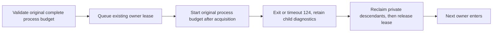

# ROI validation infrastructure qualification

> [!IMPORTANT]
> This patch bounds the maintained standalone process entrypoint, fixes demonstrated
> DevKit fixture path identity, and reports strict local shader-cache misses.
> It does not establish an aggregate host speedup or qualify any ROI feature.
> The first failures remain in the raw logs. Final PR checks bind delivery to the
> exact committed head. The original local attempts below were made on `c02945839` plus this diff; the new integration epoch is recorded separately.

## Selected corrections



| Change | Reproduced defect | Acceptance evidence |
|:--|:--|:--|
| Standalone `--timeout-ms` | Old CLI actually entered a stalled module with `timeoutMs:null` and required external rescue; CLI also rejected an explicit bound | [Contract red](standalone-red.log), [actual module before](stalled-module-before.log), [first diagnostic attempt](stalled-module-before-attempt1.log), [final 26-test green](regressions-timestamp-final.log); TERM-resistant child, retained input, next private-lock owner |
| UTC lease records | Historical audit could not reconstruct absolute acquisition/release intervals from duration counters | Current event logs append `at`; queued cancellation regression validates timestamps and preserves no-command admission |
| Canonical DevKit roots | Production `readProjectFacts` returned `/private/var`, while fixtures expected `/var`; real Vite archive loading failed at `/entry.js` | [Original fixtures red](roi-infra-fixtures-before.log), [project green](roi-infra-project-after.log), [nine actual Vite producers green](roi-infra-vite-archive-after.log) |
| SDK source preparation contract | Main #3669 correctly awaits source preparation before consumers, while a stale test still required the retired detached ternary | [First 84/85 attempt](roster-sdk-contracts-after.log), [corrected eight-test green](sdk-contract-after.log), [complete 86-test green](roster-sdk-contracts-final.log); actual verifier fragment waits for stage completion and does not build source for project/view groups |
| Strict local cache miss reporting | Local reuse returned only false, hiding whether receipt identity or output bytes caused regeneration | [Missing diagnostic red](shared-miss-red.log), [identity/digest green](shared-miss-green.log); same-length corruption still rebuilds |

The entity-visibility complete process ceiling is the ordinary 300-second Browser
process envelope. Runtime Pack Worker and Mesh interchange use the existing
45-minute Browser CI job ceiling as a final local cleanup backstop; their stage,
test, pixel, download, isolation and replay contracts remain unchanged. Do not use
one 240-second test timeout as the complete six-case Runtime Pack suite budget.

The before-route diagnostic used the original `-- COMMAND` syntax and reached
the module before its separate 8-second rescue reclaimed owned processes. It is
an unbounded-route failure, not a timeout PASS. The first 1.8-second diagnostic
failed before module readiness and remains retained. The new CLI regression
uses its own explicit 1.8-second process budget and returns 124 after cleanup.

## Handoff outcome accounting

| Priority | Qualified boundary in this patch | Remaining proof / retained owner |
|:--|:--|:--|
| 1 Native async lifecycle | Whole-process fail-closed standalone deadline and existing private-group cleanup, with real OS regression | ROI23 `7d2d13f3b` owns its 10/30/90-second stage watchdog. Its historical current5 pending await remains unlocated; complete music qualification remains with that owner. |
| 2 Public consumer preflight | CPU-side project, 11 Vite archive cases, four real Worker/module identity cases and builtin Worker are verified before graphic-effect admission | No new generic assembly/eval preflight is qualified. ROI24 retains public Result/eval consumer correction and its original Skin/native matrix; missing camera/assembly is not automatically an Engine implementation defect. |
| 3 Strict build reuse | Existing exact compiler/source/profile/WASM and payload checks retained; local misses now identify the rejected identity/digest | PR3680/3687 owner retains compiler/loader/cache and adoption. Historical `236a55674` source / `380b24386` and earlier `287897f75` from `12855b222` remain separate receipts; `06c613cee` is the tested gizmo route below, while `79da308f0` begins the next complete CI/SDK attempt. The [boundary receipt](coordinator-boundary-evidence.json) retains tested `287897f75` base/point identities and public admission; the new dist candidate must produce fresh receipts. `12855b222` has original-owner same-key in-flight 2-to-1 composition evidence, which does not explain passive repeats or Catalog failures. No cross-owner same-key duplicate production is inferred. |
| 4 Host resources | Own package preparation explicitly uses package/shader/Cargo concurrency 1; actual overlap is retained in [snapshot](host-overlap-snapshot.json) | Host-wide admission change unqualified: matched overlap/serial critical-path measurements are absent. Per-process concurrency does not provide a host budget; no indefinite owner pause was requested. |
| 5 Ordinary DevKit reliability | Canonical fixture roots preserve production root authority; project/Vite/Worker/builtin paths have 21 green cases. [Full first attempt](devkit-six-first.log) retains five Host replacement and two named-shader original-deadline failures. After strict source preparation, [both original named-shader cases pass](devkit-shader-prepared-final.log) within their 120-second deadlines; Mac Chromium graceful shutdown remains unqualified: real contexts/Vite cleanup finish, but native process exit stalls; stable Chrome self-terminates via watchdog with exit code 2. Final Linux CI must cover the unchanged five cases | Other DevKit failures remain distinct. Missing built dependencies are preparation failures, not rendering passes. Full source/consumer checks remain required. |

The first six-file integration run limited Vitest to one worker but omitted the
three build-concurrency overrides; its internal shader preparation is not a
serial measurement. Subsequent diagnostic and acceptance commands set all three
overrides explicitly. This does not alter any original assertion deadline.

The observed `js` Host replacement diagnostic completed assertions before native
teardown; the full five-case run has no per-case stage proof. A
[context-close diagnostic](devkit-session-context-close-diagnostic.log) closed
two real contexts in about 55 ms, then remained in Chromium process shutdown
until worker retirement triggered owned cleanup. The [stable-channel diagnostic](devkit-session-chrome-stable-diagnostic.log)
had framework exit 0 but Chromium watchdog termination with native exit code 2;
that is not healthy shutdown evidence. The [full Beta attempt](devkit-session-five-chrome-beta.log)
remains 1 pass / 4 original-deadline failures. No browser-sharing or deadline
change was selected from these results.

No domain algorithm, other owner's WIP, service, scheduler, physical lock inode,
backend, roster, original test deadline, 60-frame gate, pixel threshold or falsifier
was removed or weakened. Existing #3678/#3682/#3685 delivery is prerequisite evidence,
not credited to this patch. Coordination used verified existing Console bindings
and receipted messages at natural boundaries.

## Build provenance and reference boundaries

The primary checkout's available WASM had source key `f8d6443d...` and was rejected
against current `b981f1a5...`; no bytes were copied from that mismatched candidate.
A matching immutable carrier was then verified through the current provenance owner:
5,573,825 bytes, SHA-256 `a5bb05bb460593060e06258db778ff9980e58f80cf5f7ad317f72de5f9cc922e`.
The native Dawn carrier was independently checked against key `a654e1a7...`, pinned
Node/Dawn/patch/architecture facts and payload digest `b42d0ca6ce88da0c21f452600988fcc634d179b1ed39be46c2ee2f236443ab6a`.
The task's first preparation was retired before an unnecessary duplicate native
source build; this does not classify any foreign process or claim a speedup.

Installed reference sources informed boundaries only:

| Reference | Applicable boundary |
|:--|:--|
| [Three.js Pipelines at installed revision](https://github.com/mrdoob/three.js/blob/d3b629c0c2097cec664ad16369bb6eae3b10e335/src/renderers/common/Pipelines.js) | Pipeline/program maps belong to one backend/renderer scope; they do not authorize reuse across different ForgeaX compiler identities. |
| [Godot PipelineCacheRD at installed revision](https://github.com/godotengine/godot/blob/4c311cbee68c0b66ff8ebb8b0defdd9979dd2a41/servers/rendering/renderer_rd/pipeline_cache_rd.cpp) | Versions derive framebuffer/vertex/pass/specialization facts and create through RenderingDevice; device policy stays outside an offline producer receipt. |
| [Unreal Derived Data Cache](https://dev.epicgames.com/documentation/en-us/unreal-engine/derived-data-cache) | Derived output is disposable and regenerable; a cache hit cannot replace source authority or final consumer qualification. |

## Original local source preparation and checks

| Gate | Result | Evidence |
|:--|:--|:--|
| Package build / full typecheck | Exit 0, original checked declaration emit and all workspace typechecks retained | [Package preparation](packages-build-reuse.log), [typecheck](typecheck-final.log) |
| Full lint | Exit 0, ten existing warnings; first evidence JSON formatting failure retained and corrected | [Final lint](lint-final.log), [formatting red](lint-evidence-format-red.log) |
| Shared shader source | Exit 0; all three concurrency overrides 1, 1,845,619.6 ms; current local and transferable receipt admission verified; repeat maintained producer returns compile count 0 | [Source log](shared-inputs-preparation.log), [strict qualification](shared-inputs-qualified.json), [repeat reuse](shared-inputs-reuse-final.log) |
| Original named shader consumer | 2/2 pass, wrong WGSL rejected and valid WGSL accepted; 12,558 / 25,042 ms, original 120-second deadline | [Real DevKit log](devkit-shader-prepared-final.log) |

The current `e22fc111...` identity differs from the coordinator's tested profile
identities. This worktree generated its own source output; matching final payload
bytes do not make another receipt interchangeable. The output has 67 entries,
26 materials and 3,433 unique published sources. These are publication counts,
not inferred Naga invocations or a clean throughput measurement.

## First complete CI attempt

> [!WARNING]
> Exact head `e4065eac6cb3be0e88bce4009139f34715f487ad` is **not accepted**.
> Both first workflows naturally reached terminal non-success. These results
> remain attached to that head; no unchanged blind rerun or admin merge followed.

| Original gate | Terminal observation | Evidence |
|:--|:--|:--|
| Complete Main CI | 45m31s created to last completed job including queueing (terminal workflow update at 45m32s); 45 jobs succeed, 9 skip, and gizmo shard plus Smoke aggregate fail | [Run 37580668216](https://github.com/ForgeaX-Games/forgeax-engine/actions/runs/37580668216), [exact structured receipt](ci-first-qualified-negative.json) |
| Browser / Dawn / coverage | Original aggregates pass; Mesh Catalog/RHI replay passes and Runtime Pack Worker has 6/6 passes | Same run, exact job results retained in the structured receipt |
| Native lifecycle / DevKit Linux | Primary process regression 475/475 passes. Coverage shard 0 passes all five unchanged Host replacement cases and both unchanged named-shader cases | [Primary job](https://github.com/ForgeaX-Games/forgeax-engine/actions/runs/37580668216/job/112660718203), [coverage shard 0](https://github.com/ForgeaX-Games/forgeax-engine/actions/runs/37580668216/job/112660718413). This does not establish Mac native Chromium exit 0. |
| Gizmo Browser | Ten real pointer assertions complete, then screenshot stalls. Original 300-second process budget returns 124, owned cleanup follows, and there is no accepted completed-frame receipt | [Unmodified child log](ci-first-gizmo.log), original failed entry in the structured receipt |
| Four SDK consumers | 28m25s including queueing; project/source/view pass, npm persist/restore preview and required aggregate fail | [Run 37580668228](https://github.com/ForgeaX-Games/forgeax-engine/actions/runs/37580668228), [unmodified npm log](ci-first-sdk-npm.log), [matching failure JSON](ci-first-sdk-npm-failure.log) |

The restored preview failure is world 4 with submitted 6 / completed 4,
readyCompletedFrame 0, and frames 5/6 queue and reflection pending within the
original 10-second fresh-ready-frame boundary. World health remains healthy and
errors are empty; this does not make pending GPU work successful. Its payload
reports no adapter. The earlier successful-target tape and independent resident
world 1/frame 0 diagnostics cannot identify this failing frame. App
`throttledTicks=546` describes frame-credit backpressure, not CPU quota pressure.

[Download the actual SDK failure screenshot artifact](https://github.com/ForgeaX-Games/forgeax-engine/actions/runs/37580668228/artifacts/11465485991). Extract `view-registry/runtime-js/live/failure.png`; the original 322,245 bytes have SHA-256 `d81d7b612a79b3a211049813396a29fde24562514f8e3eca5d600ca48f071cbd`. The artifact was verified available on 2026-10-07 and declares expiry on 2026-10-10; the unchanged local raw copy is retained at `/private/tmp/roi-validation-infrastructure-20261007/sdk-npm-first-artifact/view-registry/runtime-js/live/failure.png`. See the [text-only preservation receipt](next-epoch-screenshot-preservation.json) and [verified artifact metadata](next-epoch-screenshot-artifact.json). Engine's original zero-binary gate remains unchanged.

*Actual failure screenshot: visible pixels do not prove a new ready completed
frame, or replace the missing target-specific failing RHI tape.*

The following common-candidate observations are historical; the accepted integration base is recorded separately below.

The common owner's `06c613cee7ce12f2b0f95fb1fe214ee9adfd04fa` candidate passes
this same gizmo route with exit 0 and 332 completed frames. Its roster digest,
declared gates, shard assignment and 60-frame requirement match this first
attempt exactly; the selected original entry and artifact link are retained in
the structured receipt. That is a tested integration route, not a matched
performance comparison or acceptance of the complete common candidate. Common
npm/View failures are distinct: world 1 progresses to 42/47 ready completions,
below the original startup requirement of 60 within 90 seconds. The common
owner retains the measured software-GPU thread-affinity escape and original
27-minute Dawn lane cancellation. Its next wrapper/scheduling correction is
still subject to complete exact-head acceptance; this patch duplicates neither.

## Reproduction

```bash
node --test scripts/ci/__tests__/local-gpu-lease.test.mjs \
  scripts/ci/__tests__/gate-process-lifecycle.test.mjs \
  scripts/__tests__/shared-build-cache.test.mjs \
  scripts/__tests__/build-task-cache.test.mjs
# Prepare package JS/declarations and strict shared inputs first; use Node 22.
export FORGEAX_PACKAGE_BUILD_CONCURRENCY=1
export FORGEAX_SHADER_COMPILE_WORKERS=1
export CARGO_BUILD_JOBS=1
export FORGEAX_SHARED_APP_INPUTS_MANIFEST="$PWD/shared-build-inputs/manifest.json"
pnpm --filter @forgeax/engine-devkit exec vitest run --maxWorkers=1 \
  --no-file-parallelism src/__tests__/project.test.ts \
  src/__tests__/shader-check.integration.test.ts \
  src/__tests__/worker-module-identity.integration.test.ts \
  src/build/__tests__/builtin-worker.integration.test.ts \
  src/build/__tests__/dev-plugin-session.test.ts \
  src/build/__tests__/dev-program-archive.test.ts
FORGEAX_LOCAL_GPU_LEASE=1 node scripts/ci/local-gpu-lease.mjs \
  --timeout-ms ORIGINAL_COMPLETE_BUDGET_MS -- node path/to/prepared-probe.mjs
```

Regression process times are local diagnostic observations. Queue duration is
not GPU busy time; summed job minutes are not a host wall-clock critical path.
All exact-head Browser/Dawn/Smoke and four SDK consumers remain delivery checks.


## Integration epoch on accepted main

> [!IMPORTANT]
> Local source/consumer gates in this section bind to `97fad6d1cbc31af5b22cba9b9d9ac8c677236d33`, based on `321edc5929dee4d08996b462fd2133fc438d0bae`, using Node `v22.23.2`. Original evidence above remains historical. Final committed PR-head complete Main and all four SDK consumers remain required; CI's Node `v22.22.3` is a separate compiler identity.

Common PR [#3680](https://github.com/ForgeaX-Games/forgeax-engine/pull/3680) delivered `94b2271d354e7fcbc7b3b3a5a13db6b4df4a0fbd` through Main [37593168237 attempt 2](https://github.com/ForgeaX-Games/forgeax-engine/actions/runs/37593168237) and all four SDK consumers [37593168245](https://github.com/ForgeaX-Games/forgeax-engine/actions/runs/37593168245), then admin squash merged to this integration base. Its first View3 failure and same-head failed-job retry remain distinct evidence; the complete path including retry exceeded the 30-minute target. The affinity/compiler fixes belong to that owner and are not this patch's deliverables. Both sides of the debug routing table survive the single rebase conflict.

| Original gate | Current local result | Evidence |
|:--|:--|:--|
| Package preparation / typecheck | Exit 0; 69 packages built, no skips; workspace scope 236, 225 `tsc --noEmit` invocations | [Packages](next-epoch-packages-build.log), [typecheck](next-epoch-typecheck.log) |
| Process/cache + roster/SDK contracts | 27/27 and 96/96 pass, no skips | [Process/cache](next-epoch-process-cache-regressions.log), [roster/SDK](next-epoch-roster-sdk-contracts.log) |
| Current WASM | Old `b981f1a5...` rejected; maintained published fetch verifies actual `53076cab...` source key and payload digest | [Fetch](next-epoch-wasm-fetch.log), [provenance](next-epoch-wasm-provenance.json); original eight pkg files retained externally before fetching |
| Strict source / reuse | Producer exit 0, execution count 1, 1,095,078.2 ms; identical maintained repeat exit 0 and count 0; both local and transferable admission pass | [Producer](next-epoch-shared-inputs-producer.log), [exact receipt](next-epoch-shared-inputs-qualified.json), [repeat](next-epoch-shared-inputs-reuse.log), [post-consumer recheck](next-epoch-post-consumer-admission.json) |
| Ordinary DevKit | First attempt 21 pass / 2 fail; missing Playwright 1.60.0 shell 1223 is then prepared, unchanged Worker suite 4/4 pass. All 23 selected cases have actual pass evidence across these retained runs | [First attempt](next-epoch-devkit-consumers.log), [browser preparation](next-epoch-devkit-browser-preparation.log), [Worker 4/4](next-epoch-worker-prepared.log) |
| Layout / English | 3,606 test-like files valid; existing source and agent-document checks exit 0 | [Layout](next-epoch-test-layout.log), [source English](next-epoch-english-source.log), [agent English](next-epoch-english-agent-docs.log) |
| Full lint | Exit 0, 10 existing warnings; 6,076 files checked | [Lint](next-epoch-lint-final.log) |
| Zero binary publication | Actual red is the only accidentally tracked evidence PNG; its exact original bytes are preserved externally and tracking is removed. Gate unchanged; its staged-tree green and lint are recorded in this epoch qualification | [Original red](next-epoch-binary-gate-red.log), [retained bytes](next-epoch-screenshot-preservation.json) |

The current strict key is `3abbad31df596c02b914069bc84915eecbf2cacb8c6df41f3973800610ae30b1`. The 45,479,791-byte shader manifest has SHA-256 `079d0d5a31b794a9756295f34f94c0d6a292a77fe01cf15b0770ef8a2975c153`: 67 entries, 26 materials and 3,433 sources. These are output/publication counts, not Naga invocation counts or a matched performance comparison. No receipt was edited to force reuse.

Both original named-shader cases pass in 7,153 / 17,560 ms within 120 seconds. Both browser Worker cases pass within 60 seconds (32,794 / 31,044 ms); framework success does not establish native Chromium graceful exit. Historical e406 Linux CI has five unchanged Host cases green, while the new final exact-head CI must run them again. Mac native shutdown, host-wide admission improvement, the original pending ROI23 await, and aggregate sub-30-minute CI remain unqualified.

Storage PRs #3652/#3653 are already ancestors of this worktree and their four source hashes match the supplied adoption bundle. Shared Harness real/common ownership is verified; manifest-only production is used normally. The external session ack records adoption. No storage-only build, compression, deletion, repack or GC was launched; the singleton cleanup owner retains maintenance. Full receipts and logical-byte hashes are in [this epoch's qualification](next-epoch-qualified.json).
