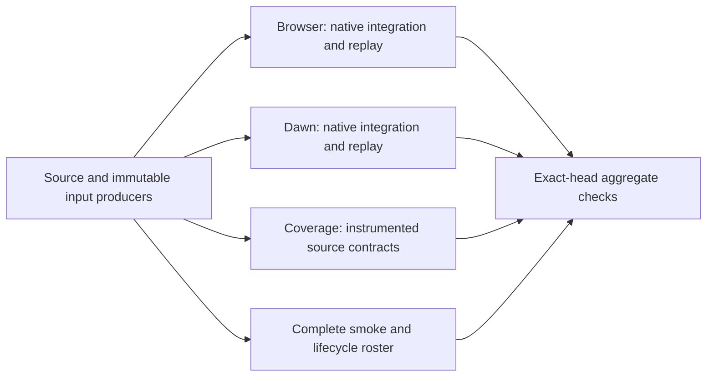

# Conservative CI workload audit

> [!IMPORTANT]
> This change retains every workflow job, matrix lane, test case, backend,
> lifecycle, quality threshold and destructive falsifier. It removes unconsumed
> work inside tests and modestly reduces two diagnostic carriers. The user's
> "retain roughly 80% of the essence" is a coverage/value constraint, not a
> requirement to delete 20% of jobs or a measured speedup claim.

## Measurement boundary

Base: `32866d344cb8a8808eb4b83aa664c07e94f2bf2f` (PR #3666).
Its PR has 64 check rows: CI 56, SDK PR Preflight 6, Bench 1 and one other row.
Counts include skipped administrative checks and are not 64 independent tests.
[Raw job and slow-step evidence](evidence/workload-audit-2026-10-06.json) retains
job identities, runner names and durations for the following successful PRs.

| Run | Latest attempt | Executed CI jobs | Sum of execution minutes | Longest Browser job | Longest Dawn job |
|:--|--:|--:|--:|--:|--:|
| [37363035253](https://github.com/ForgeaX-Games/forgeax-engine/actions/runs/37363035253) | 1 | 48 | 410.6 | 33m47s | 20m36s |
| [37417541916](https://github.com/ForgeaX-Games/forgeax-engine/actions/runs/37417541916) | 2 | 48 | 416.2 | 36m26s | 23m14s |
| [37362371550](https://github.com/ForgeaX-Games/forgeax-engine/actions/runs/37362371550) | 2 | 48 | 405.4 | 21m19s | 23m14s |

The first run is a complete first-attempt reference: creation to terminal update
was **53m56s**, including queueing and cleanup. The other two job lists combine
successful jobs from multiple attempts; their execution sums exclude failed
attempts and cannot be called clean full-run latency. A post-merge reuse run
skips accepted PR tests and is also unsuitable as a performance comparison.
Runner heterogeneity and unrelated concurrent workflows limit causal inference.



## Review across dimensions

| Dimension / lane | Observed expensive work | Decision and coverage reason |
|:--|:--|:--|
| Queue and DAG | The clean reference takes 53m56s despite its longest job taking 33m47s. | Measure queue, dependency waits and execution separately. No additional shards or machines in this change. |
| Source/input production and app shards | Shared producer and app builds compile and transport complete inputs. | Retain exact-source admission, missing/corrupt-input recovery and independently built app closures. |
| Browser | Native suites take 14–29 minutes inside jobs; Canvas alone reached 236.74s, modeling 93.44s and video diagnostics 52.73s. | Remove unused capture/replay work; reduce only video diagnostic input dimensions. Keep process isolation and deadlines. |
| Dawn | GI, replay and renderer owners dominate a 20–23 minute tail. Specular-AA quality plus diagnostics took 54.16s; its cost-only case took 22.93s. | Reduce the diagnostic raster size, retain every quality reference, variant, render path, sample count and ordering. GI convergence loops remain because their sample windows decide correctness. |
| Coverage / source tests | Full point-profile compilation took 283.75s in the public-surface routing test; the source-built Vite manifest took 272.50s. | Public routing can consume admitted real WGSL; the Vite integration continues to force a complete source build. Real Naga source and cache/fallback regressions remain. |
| Smoke / Bevy | Full rosters, per-owner frame evidence and materialization dominate these lanes. | Retain all owners, 60-frame admission, parser/falsifier checks and backend coverage. No default-frame or timeout change. |
| View / SDK consumers | Independent copied/source/npm/template and recovery journeys take several minutes. | Retain them: they cover distribution, cold startup and lifecycle paths that native renderer tests do not. |
| Primary / Bun / static governance | Some textual checks repeat, but these are short and enforce existing package-manager alignment. | Retain them; changing channel policy has low measured return compared with expensive GPU/compiler work. |
| Metrics / parity | Fixed quality and performance thresholds own their statistical windows. | Retain thresholds and producer joins. Smaller diagnostics are explicitly labeled by actual workload and are not performance improvement evidence. |
| Reporting / cleanup / admission | Aggregation and transfer validation have low direct cost. | Retain fail-closed complete-roster and exact-HEAD checks, provenance, reporting and cleanup. |

## Exact internal cuts

| Owner | Before → after | Preserved proof |
|:--|:--|:--|
| Public standalone point-shadow test | Forced full source build → ordinary admitted prepared-profile route with source fallback | Real skinned point-shadow WGSL marker; full source integration and compiler routing/fallback owners remain. No mock manifest substitution. |
| Canvas, all six input/geometry combinations | Initial tape saved without inspection → same completed draw and initial pixel/upload assertion; redundant geometry-prefix inspection removed | Upload tape, dirty/update/resize, device recovery, actual source texture/alpha/UV reads, presented pixel comparison, fresh replay and missing-model falsifier. |
| External video replay | Prefix replay for unconsumed intermediate pixels → captured model bindings plus the existing presented-pixel replay | Snapshot texture discovery, live/replay epsilon, native validation errors and cleanup. |
| Advanced modeling, all geometry cases | Separate geometry-prefix pixel read plus event-identity assertion → existing lighting replay and independently mutated missing-draw tape | Every hole/bevel/sweep case, live/replay epsilon ≤0.05, occupancy and hole control, falsifier difference >0.1, native validation. |
| Video diagnostic in existing Browser lightweight mode | 1280x720 / 1920x1080 → 960x540 / 1280x720 | Both source sizes and zero-copy/copy paths, readiness, import/copy counters, completed frames and timing records. Local diagnostic remains 720p/1080p. |
| Specular-AA cost diagnostic in existing Dawn lightweight mode | 512x512 → 384x384 | Both AB/BA orders, forward/deferred, rounds, sample windows and actual timing presence. Separate quality test retains its 8x supersampled truth. Local cost scene remains 1024x1024. |
| Native Standard alias identity fixture | Full physical parameter/color/ray workload → minimal real depth Surface, using the package-owned built-ins once | Same real Engine source-key alias normalization and module assertions; strict direct ABI, both uniform backends and unchanged default 5s bound. Complete Forward/physical/color/ray gates remain. |

For the video diagnostic, total source pixels per pair fall from 2,995,200 to
1,440,000 (**51.9% less**) in this one diagnostic. Specular-AA cost pixels fall
by **43.75%**. These are work-size calculations, not full-job or engine speedups.
Only two generic assertions are removed: nonempty unused Canvas intermediate
pixels and modeling event identity already known from the captured frame model.
No test is skipped, removed, merged into a mock or assigned a looser deadline.

## Local validation

| Gate | Result |
|:--|:--|
| Fresh package JavaScript/declarations build | PASS |
| Runtime and shader package typechecks | PASS |
| CI ownership, artifact policy, Browser/Dawn roster and Smoke budgets | 97 Node tests passed |
| Shader source-profile producer and coverage scheduler | 23 Node tests passed |
| Real Naga single-worker compilation and standalone source/cache routing | 9 Vitest tests passed |
| Changed TypeScript formatting, channel alignment, path SSOT, guidance English and code-file size | PASS |

The first local test invocation preceded complete declaration materialization
and failed with a missing generated import entry; the fresh source build restored
the owning outputs. A redundant focus preparation and the standalone full-source
baseline measurement were explicitly stopped while other tasks saturated this
Mac. Neither is recorded as a passing test or a before/after latency result.
The shared source producer and real public/GPU acceptance use their normal paths;
final CI remains necessary for the actual software-GPU and complete roster proof.

## First PR execution and recovery

[Run 37440428941](https://github.com/ForgeaX-Games/forgeax-engine/actions/runs/37440428941)
executed head `433d952f2e8cd2d7fd3a68a1ca558bdc0c35c726`. Complete Browser,
Smoke and the four SDK consumers passed, but Dawn lane four exceeded its existing
27-minute job bound. Its annotation and partial native output remain failure
evidence; this run is not a complete CI pass or an accepted latency comparison.

| Changed case / file | Historical reference | First PR execution |
|:--|--:|--:|
| Public point-shadow routing | 283.746s | 0.815s |
| Full source integration file (90 cases retained) | 280.236s | 276.781s |
| Canvas texture file (six cases retained) | 236.741s | 103.708s |
| External video diagnostic | 52.731s | 30.344s |
| External texture file (three cases retained) | 47.851s | 26.853s |
| Advanced modeling | 93.436s | 98.085s |
| Specular-AA file (four cases retained) | 54.157s | 123.906s |

These are observations across different runners, not isolated A/B speedups.
The modeling and specular-AA results explicitly do not establish a wall-time
improvement. Coverage logs verify all three new profile steps reused current
source products with `compile count=0`; the real complete source integration
continued to execute. Actual pixel workload reductions remain independent facts.

Dawn lanes one/two/three completed in 948/795/1399 seconds. Lane four spent
240 seconds compiling its necessary disabled-point-shadow control and reached
the job bound during `gi-2`, before its remaining native owners. Move the complete
`renderer` and `gi-2` groups to lane two. The renderer's base-profile preparation
follows its existing conditional owner. Four jobs, every group, serial native
execution, original deadlines and full discovery remain; new complete CI must
qualify this balance. Moving owners reduces a tail, not total machine work.

## Local GPU lease handoff

After the frozen run ended, this worktree merged `origin/main`, including
`7c2347915ed161743b87102356eb0287e88d3a69` (PR #3678). The merge HEAD was
`d0a9a59e945a1ebbd87b231fced06161147dc957`. Both the workload and lease guidance
were preserved. Thirteen real OS-lock/process lifecycle contracts passed.
The prepared RHI native probe was submitted through the new entry:

```bash
FORGEAX_LOCAL_GPU_LEASE=1 node scripts/ci/local-gpu-lease.mjs -- node node_modules/vitest/vitest.mjs run --project=dawn --passWithNoTests=false --maxWorkers=1 --no-file-parallelism packages/rhi-webgpu/src/__tests__/dawn-real-gpu.dawn.test.ts
```

Its queue is not passing native evidence. Require its terminal result and
`[local-gpu] released` before recording local GPU success. Builds, dependency
installation and shared shader production run outside the lease; no outer
`flock` or manually set held marker is used. Future full gates use:

```bash
FORGEAX_LOCAL_GPU_LEASE=1 pnpm test:browser
FORGEAX_LOCAL_GPU_LEASE=1 pnpm test:dawn
FORGEAX_LOCAL_GPU_LEASE=1 pnpm ci:focus --kind smoke --select all --frames 60
```

## Reproduction and acceptance

Focused file gates are available through `pnpm ci:focus --kind browser --select`
for Canvas, external video, its diagnostic and advanced modeling. The source
owner uses `pnpm ci:focus --kind unit --select @forgeax/engine-vite-plugin-shader`;
Dawn specular-AA uses `pnpm ci:focus --kind dawn --select specular-aa`.

The canonical complete final-HEAD CI is the delivery gate, including Browser,
Dawn, all hello/learn-render/Bevy smoke lanes, aggregate coverage, SDK consumers
and required checks. Read before/after test duration separately from job minutes
and complete-run wall time. Preserve initial failures and infrastructure retries;
do not report a successful retry as a first-attempt full run.

## Second frozen HEAD and SDK recovery

> [!WARNING]
> Complete CI [37446224367](https://github.com/ForgeaX-Games/forgeax-engine/actions/runs/37446224367)
> passed at `d22795ddc481064b7929036fadb41f93d88fb831`, but took **51m58s**
> and **420.9 machine-minutes**. The historical clean run used 410.6
> machine-minutes. This result establishes acceptance of the cuts and Dawn
> balance, not an overall speedup, resource saving, or the 30-minute target.

All four Dawn lanes passed in 797/1153/1222/1262 seconds with the original
27-minute bound. Complete Browser, Smoke, coverage and additional consumers in
that CI passed. SDK workflow [37446224738](https://github.com/ForgeaX-Games/forgeax-engine/actions/runs/37446224738)
remained a separate failing gate: attempt one reached 50/60 View-ready frames
at the unchanged deadline; the same-head full rerun passed View, npm and source,
but the selected SDK gameplay failed after WebGL2 recovery.

The gameplay error named material `6c771936-3236-50c4-956c-ec4baa8fd381`,
`game_3d::rusted_iron_surface`, and a missing exact WebGL2/uniform-fallback
program. A real Native cooker followed by the runtime publication selector
reproduced the same error without a driver. The source publication contained
only WebGPU storage contexts. A real-Naga regression first passed storage and
failed both uniform contexts; the correction publishes authored Standard
uniform programs and their actual direct ABI for both backends. Scene-index,
storage-only View extensions and runtime compilation remain excluded from
uniform contexts. Full final-head SDK acceptance is still required.

After both frozen workflows became terminal, the worktree adopted the two
Browser compiler commits from PR #3682 (`fbf6dcc4a`, `1dff64cc2`). The resulting
local HEAD was `741caa1855e5d67c87c78b8fa08af73e43410603`; owning packages must
be rebuilt before the next acceptance run. The unchanged joint material cache
limits remain 128 entries / 16 MiB. Its two public WGSL fields share one immutable
source, while caller copies isolate mutable metadata. The existing real Standard
reuse gate retains its 30-second limit.

The first prepared lease probe acquired and released normally after 4,619,791ms
in queue, but exited 1 because default Dawn discovery excludes the compact group.
That is not native passing evidence. The corrected command selects the existing
compact roster explicitly:

```bash
FORGEAX_LOCAL_GPU_LEASE=1 FORGEAX_DAWN_COMPACT=1 node scripts/ci/local-gpu-lease.mjs -- node node_modules/vitest/vitest.mjs run --project=dawn --passWithNoTests=false --maxWorkers=1 --no-file-parallelism packages/rhi-webgpu/src/__tests__/dawn-real-gpu.dawn.test.ts
```

Builds and source preparation remain outside the lease. Final acceptance must
identify the actual source HEAD, terminal result, and release; a queued or
unselected probe is never a substitute for the complete remote gates.

Local recovery validation on the combined source rebuilt both compiler/Vite
owners and passed their typechecks. The complete cold-cook fixture passed all
four cases at its unchanged 15-second per-case bound: Standard, skin, and both
particle modules. It retains all original storage/address/color/ray assertions
and adds the portable uniform selections. Unique WGSL artifact counts increase
from 18/16 to 20/18; backend selections remain independently identified even
where immutable WGSL bytes agree.

The complete real SDK rusted-iron material (Forward/Deferred/shadow) then passed
Native cook and the actual runtime `projectMaterialRecord` /
`selectMaterialPassProgram` lookup for both uniform backends. This is publication
and selection evidence, not browser rendering acceptance. Broader regression
also identified an older Standard alias without direct ABI facts; the strict
record validator correctly rejects mixing it with modern uniform selections.
The producer now derives its direct ABI from the actual schema and compiled
vertex entry on that path too. The strict validator is unchanged; the original
failure is retained in the local evidence.

The corrected compact RHI probe completed **31/31 tests**, exit 0, on the
combined `741caa185...` source with the pending compiler edits. Its lease
record shows queue 805,089ms, owner execution 11,520ms, child cleanup
`alreadyGone`, and `[local-gpu] released`. This proves the new per-owner entry
was actually used; it is a focused RHI gate, not complete Browser/Dawn/Smoke
acceptance or a latency comparison. Full canonical gates retain the commands
above and every 60-frame, backend and quality requirement.


## Combined compiler follow-up

The initial combined-source whole compiler run was not green: 332/336 tests
passed, with alias, full physical-root, medium and reuse failures, plus a new
regression's Ray-context type narrowing error. The narrowing was corrected;
old direct-only Standard publication now receives actual ABI facts. Intermediate
local timeout failures remain evidence, not acceptance. Switching from Node
26.4.0 to CI's exact Node 22.22.3 did not itself resolve the cold-cook failures.

The bounded compiler now validates actual composed WGSL and its selected
entry/attachment/dynamic-offset contract once. Source checks and composition
remain before that lookup, while each invocation publishes its own import
projection. Native IR is still freed per validation; retained facts stay within
the unchanged 128-entry / 16-MiB joint limit. Real entry/format rejection,
malformed selectors, changed source, mutation isolation and eviction controls
remain. The alias fixture removes an unasserted duplicate of the complete
physical-layer parameter inventory; its Native alias path and module assertions
remain, with additional strict ABI and both-backend checks.

| Complete cold-cook case | Node 22 combined source before program-stage reuse | After reuse and fresh owner builds |
|:--|--:|--:|
| Standard | 27.111s, original 15s timeout | 9.213s, PASS |
| Skin | 20.821s, original 15s timeout | 9.167s, PASS |
| Particle mesh | PASS | 0.708s, PASS |
| Particle mesh inputs | PASS | 0.614s, PASS |

These are local runs sharing a machine with other sessions, not controlled
performance estimates. All four original cases and 15-second limits remain;
unique artifact counts are 20/18/2/2 and every original semantic assertion is
retained. The real bounded-cache/full Standard reuse regressions also passed
11 cases with the original 30-second fixture bound. Broader updated regressions
and complete final-head CI/SDK must still qualify the combined source.

### View base-profile mismatch investigation

Peer final-head run `37452282996`, View shard three, rejected the shared receipt:
expected `0aafe5956dd092b078e1e54a53d5a320c09fa35de11709cdf7811de3dc8b7b67`,
observed `6eaaf31553ac77a6fa71958a44fe73e7e13e844656a1f6294317c61f208cea93`.
The matching local cache was absent and the source producer ran once for
143,245ms. Producer job `112247517567` recorded the observed fingerprint.

| Input fact | Shared producer | View base-profile consumer |
|:--|:--|:--|
| Fingerprint implementation | `sharedShaderInputFingerprint` | Same function |
| Node | 22.22.3 | 22.22.3 |
| Point shadows | Enabled | Disabled |
| SSAO | Enabled | Enabled |

The profile configuration difference is proven and requires distinct identities.
The old run now lists zero retained artifacts; downloading shared artifact
`11407271197` returns HTTP 404. Thus exact compiler-byte comparison cannot prove
that configuration alone caused this specific pair of hashes. Keep that evidence
boundary and all original receipt checks. Central production of a separate base
profile is a candidate for further measurement, not a point-profile alias or a
claimed speedup in this change.

PR #3682 was later squash-merged as `3baf78431d52e9437ef9d0c7f6da588d88ac12fa`.
The two original commits were already adopted here, so the squash must not be
cherry-picked again. Main alignment follows the current frozen-source local
verification; remote complete CI and four SDK routes will test the new final HEAD.


Updated source verification retained the full Standard matrix: **36/36 PASS**,
including all texture paths, physical root, anisotropy, multi-pass and shadow ABI.
The 12-file source run passed **167/168** before the alias fixture correction;
the complete 17-case alias/cook file then passed at its unchanged original
bounds. The identity case uses a minimal real depth Surface and the default
package-owned cooker, avoiding an explicit duplicate built-in source root.
The 26-case plugin suite initially passed 24 and exposed two obsolete assertions
that uniform aliases have no ABI. Their corrected full-file rerun passed both
cases and checks actual schema-derived direct rows, absent scene-index, palette
and geometric/color attributes on all six variants. No limits were relaxed.
Owner builds/typechecks passed again. Native cook of the complete SDK material
and the real runtime selector passed both uniform backends with direct `vs_main`.
These remain local proofs; complete final-head CI and SDK acceptance are pending.

## Frozen combined-head failures and recovery

At `9f03d86d46160e4d3c60135b1acd9d1c2995c67f`, SDK run
`37465917617` passes source, project, npm and View, including the installed
project recovery that previously lacked the uniform program. Full CI run
`37465917882` fails: 32 successful jobs, 12 skipped, eight failed and one
cancelled. Its roughly 34m57s wall and 354.3 executed machine-minutes are
incomplete evidence, not a speed win. All four Browser lanes pass; the failed
app build prevents full Smoke acceptance.

| Failed owner | Evidence | Correction or acceptance boundary |
|:--|:--|:--|
| hello-GI build | Node heap exhaustion; same full build reproduces twice locally at 2 GiB | Allocation trace identifies finalizer numeric-array copies; remove copies while preserving original revision goldens |
| Dawn lane two | Base 347.536s, ordinary 824.124s, compact 135.264s, Surface 219.845s and renderer 25.570s complete; heavy four unfinished at 27m | Transfer complete renderer/GI-two owners and producer to measured headroom; no group or deadline removed |
| Surface publication coverage | Legacy assertion assumes every selection has storage scene-index ABI | Preserve storage assertions; add actual runtime uniform selection and schema/entry checks on both backends; complete file passes 3/3 |
| View Game 3D | 57/60 completed frames at the original 180s; World/Renderer healthy and pipeline compilation resolved | Preserve failure and require full new-head View; no frame, pixel or timeout change |

The finalizer's `sorted` and `revisionStable` now consume existing canonical
numeric arrays without another recursive copy. No cache survives the call and
caller bytes remain untouched. The complete finalizer contract passes eight
cases, Pack builds and typechecks pass, and the complete Vite/Sponza GI build
passes in **3m53s at the original 2-GiB heap**, after both original OOMs.
These shared-host local observations prove the original failing path can finish;
they do not establish controlled timing gains or complete final-head acceptance.
New-head full CI and all four SDK paths remain mandatory after main alignment.


Main alignment adopts `ce1fff291`, retaining its complete GI-four move to lane
three and GI-five to lane two. On the combined frozen source these owners take
126.416s and 159.140s. Renderer, its conditional base producer and GI-two move
to lane one; transmission remains on lane three given the measured 824.124s
ordinary-two cost. Conservation and new-head execution qualify this resolved
allocation; prior main or cancelled-lane receipts cannot certify it.


After main alignment all 68 packages build, the complete package TypeScript
check passes, nine Dawn conservation contracts pass, and 41 selected finalizer,
Surface publication, compiler-cache, portable-program and cook contracts pass.
The first complete cold-cook run retains one Skin failure at its original
15-second limit (17.357s observed); Standard and both particle cases pass. A
serial complete-file rerun passes all four at 11.187s/9.505s/0.757s/0.751s.
Both receipts remain: this demonstrates shared-host variability, not a stable
latency guarantee. All 22 changed code files pass Biome and English checks.
Complete final-head remote CI and four SDK consumers remain pending.


## Completed 83b acceptance and subsequent stability work

> [!WARNING]
> [CI 37475117260](https://github.com/ForgeaX-Games/forgeax-engine/actions/runs/37475117260) and [SDK 37475117347](https://github.com/ForgeaX-Games/forgeax-engine/actions/runs/37475117347) passed at frozen `83b46c12` after failed-job reruns. Their original failures remain negative stability evidence. Total elapsed including retries was 66m17s / 60m04s; the 30-minute target remains unmet.

| Original failure | What the evidence establishes | Subsequent correction / remaining boundary |
|:--|:--|:--|
| Dawn 1 and 3 cancelled at the original 27-minute job bound | Their admitted native groups slowed roughly twofold; remaining complete groups were never admitted. | Reuse an independently verified base profile from core; move complete Direct Light to2 and Shadow Fields to1 using passing native intervals. Next-head timing still requires full CI. |
| View 1 reached 50/60 Game completed frames at 180s | The frame stream advanced with healthy World/Renderer; same-head retry passed. | Preserve the deadline and failure. No established cause. This differs from main View 3's Editor ready-frame oracle. |
| SDK project lost its second-epoch device before the first completed frame | The producer reported device-lost, then exhausted its existing single replacement. | Preserve backend loss detail in receipts and classify by the native reason, not an arbitrary message substring. This improves diagnosis, not driver stability proof. |
| Multiple simultaneous affinity receipts selected 48-55 | Whole-window equality is proven; shared physical host is not. | Record an opaque kernel fingerprint for future correlation without changing quotas or claiming exclusive CPU admission. |

The next source includes main `1288e4590`, with the owner-provided pending-frame diagnostics and Dawn carrier. Build and acceptance evidence must be regenerated; none of the `83b46c12` receipts is relabeled as this source. GPU entrypoints remain `FORGEAX_LOCAL_GPU_LEASE=1 pnpm test:browser`, `FORGEAX_LOCAL_GPU_LEASE=1 pnpm test:dawn`, and `FORGEAX_LOCAL_GPU_LEASE=1 pnpm ci:focus --kind smoke --select all --frames 60`, without an outer lock or manual lease-held flag.


The original main View artifact's disappearance is independently explained by cleanup: View 3 failed at 12:12:08 UTC, while cleanup succeeded at 12:15:02 and deleted nine artifacts with no preserved inputs or API failures. View was absent from cleanup's dependencies. The correction adds the View aggregate and final Collectathon consumer, and retains failed captures under the producer-owned `failure-` prefix until the existing three-day expiry, including after same-head retries. Two deterministic regressions were red before the correction. This repairs lost failure evidence, not the ready-frame stall itself.


Local validation on the main-aligned source used Node 22.22.3: 69 package builds and complete declarations passed; 75 Renderer assembly/fanout/fence tests, 22 profile/affinity/Dawn contracts and 16 artifact-policy/deletion tests passed. The full cold-cook file retained its original 15s limits: Standard 14.876s, skin 14.245s, particle cases 1.205s / 1.858s. These narrow margins do not establish stable latency on CI runners.

The real base producer compiled once in 666.447s on the shared local machine, then a separate consumer with an empty local cache admitted its core receipt with compile count zero. This validates actual profile reuse, not a speed comparison or the 30-minute target. Complete new-head CI and four SDK consumption paths remain required before merge.


The independently reported View `FinalizeArtifact ECONNRESET` happened after all
verification commands exited zero. Both View uploads now use the existing single
in-place transport retry, keep evidence required and retain hidden preview files
on either attempt. The workflow regression was red before the change. This is
bounded transport recovery, not a change to native validation or a claim that
ready-frame stalls are fixed.


The additional complete material-cook owner file initially passed 16/17: its real
Standard alias exceeded the unchanged 5s limit (6.134s observed). Keep that first
failure even if a serial repeat passes; the default bound is not raised. The two
artifact suites now pass all 17 cases, including required retry transport and
hidden-capture forwarding on both attempts.


The same complete material-cook file passes all 17 in a serial repeat with the
original bounds (26.22s total); the first alias timeout remains negative evidence.
The Host close diagnostic separately proves an intermittent Playwright 1.56.1
30s graceful-close fallback (40.173s native / 7.67s Vitest). Its launch-argument
trial is not a measured fix: unchanged original Host arguments also pass the same
real PNG capture in 6.751s / 5.54s. Preserve that negative control, adopt only the
qualified roster patch, and leave native Renderer launch policy unchanged.

## Frozen 75a acceptance and capture correction

> [!WARNING]
> [CI 37490839825](https://github.com/ForgeaX-Games/forgeax-engine/actions/runs/37490839825)
> at `75a8fc4849feac61bd254d257eb1dfa085a4d79e` failed after **53m00s**.
> [SDK 37490839895](https://github.com/ForgeaX-Games/forgeax-engine/actions/runs/37490839895)
> passed all four consumers in **34m51s**. Neither establishes the 30-minute target.

| Owner | Terminal observation | Limit on the conclusion |
|:--|:--|:--|
| Four Dawn lanes | All pass in 1081 / 1227 / 1094 / 768 seconds. | Full owners and original 27-minute limits retained; different hosts preclude isolated speed attribution. |
| Four Browser lanes | All pass in 2508 / 1186 / 1256 / 1368 seconds. | Lane 0 includes two original 300-second process timeouts and the existing one-group retries. |
| Lane 0 LensFlare / Host PCM-stream | First attempts time out without test completion output; fresh attempts pass in 132.015s / 10.839s. | Preserve censored attempts; no evidence equates them to the intermittent 30-second graceful-close fallback. No launch flag change. |
| View 3 | Original Editor oracle fails at 42 ready frames; pending submissions remain. | Original 60-ready-frame / 90-second deadline retained. Frame progression does not prove a permanent stall. |
| Multithread benchmark | Required 15% improvement fails: observed -2.7118%, bootstrap CI95 [-8.4587%, 2.1028%], runnerPauses empty. | Same-browser ABBA/workload remains; no threshold, sample or pause-classifier relaxation. |
| Base-profile preparation | Core publishes one base compile in 273.602s. View and Dawn reject the point receipt, then admit core with compile count zero. | Real publisher/consumer reuse is established; it does not fix subsequent ready-frame failures. |
| Failure transport | Original View and Preview failure artifacts upload successfully and are downloaded. | Native failure still fails the job; evidence transport is separate acceptance. |
| Catalog | This own frozen shared-inputs-browser passes; peer and main logs fail the unchanged 90-second fetch before browser creation. | No correction in this PR is proven to resolve Catalog. It predates Host splitting and remains separately investigated. |

The View and benchmark receipts prove a shared kernel but expose different
logical CPU masks (56-63 / 8-15). Their physical-core relationship is unknown.
The next receipt reads actual SMT sibling lists without changing selection,
quota or admission; missing topology remains null. Do not infer contention from
mask arithmetic or runner labels.

The Preview capture error is separately reproduced in actual Chromium with
graphics acquisition rejected: default-ID `uploadTape` throws `Illegal invocation`
because `crypto.randomUUID` is detached from its receiver. The existing HTTP
integration file now exercises the default ID and the real plugin routes; it is
red before the receiver correction and green afterward. All six plugin files
pass (21 tests). An actual-source Chromium probe publishes a canonical 5340-byte
tape and verifies its full bytes and digest, without an in-memory source patch.
This fixes the capture owner. It does not attribute or repair native queue delay.

## 06b terminal evidence and cache recovery

> [!WARNING]
> Exact `06b0793a372f5bf335f125d88e73c2384be2ac1f` is not merge-qualified.
> [CI 37498864261](https://github.com/ForgeaX-Games/forgeax-engine/actions/runs/37498864261)
> ends CANCELLED after 48m40s, while
> [SDK 37498863992](https://github.com/ForgeaX-Games/forgeax-engine/actions/runs/37498863992)
> ends FAILURE after 29m18s. No rerun or cancellation was requested by this session.

| Owner | Original result | Consequence |
|:--|:--|:--|
| Dawn three | Ordinary 930.027s, all five VFX-depth partitions and all four Transmission partitions pass; GPU timing begins before the original 27-minute job cancellation. | Remaining complete owners did not run. Adopt main 938e64d59's complete qualified allocation rather than combining stale transfer estimates. |
| Browser zero | LensFlare collects zero tests and rejects a dynamic import shortly after a neighboring Host config re-optimization. | Actual maintained Native/Host configurations resolve to the same dependency cache; fix the publication invariant with separate Host cache. Original CI HTTP request causality remains unconfirmed. |
| Four View lanes / Catalog | All pass. | This is narrow acceptance on 06b; earlier unchanged Catalog and main ready-frame failures remain real negative evidence. |
| SDK project | Four submitted, two completed, zero ready; two queue receipts pending, no reported error. | Keep separate from the two-final-frame case and from the resolved Crypto receiver bug. |
| SDK npm | Play reaches sixty submitted / fifty-eight completed; last two queue and reflection stages remain pending. Later diagnostics advance to sixty-five / sixty-three. | This is continued bounded backlog, not evidence of a submission cap at sixty. Original 180s deadline and sixty completed-frame oracle remain. |
| Multithread benchmark | Observed 51.0718% improvement exceeds required 15%; bootstrap CI95 [49.747, 52.4392], no runner pauses. | Workload, ABBA and all 480-frame windows remain; no performance source changed in this revision, so this does not explain the previous negative result. |

The controlled Vite regression uses both maintained resolved cache paths. Host
startup deletes Native's already published `pako.js` in the shared-cache control;
isolated caches retain its full bytes and HTTP 200. Actual software Chromium also
rejects the old published dependency import in the shared-cache control and imports
it with isolation. A fresh source request can repair the cache and pass: retain that
negative control and do not attribute every dynamic import failure to this race.
The focused fix is `e3934acba8b57ee4be9f39b0e0c9429684bc22c6`; native flags,
rosters, deadlines and GPU admission are unchanged.

Main Host post-merge View one at `26c0b739a` independently reports sixty / fifty-eight,
while its separate Editor document has thirty-eight / thirty-eight. Later failure
diagnostics advance Play to sixty-five / sixty-three, still with two in flight. Source tracing
shows the App retains the rAF heartbeat at its two-in-flight credit bound. Renderer
completion waits for the real queue fence plus reflection; reflection itself waits
for the submitted fence. This narrows the ownership to outstanding completion but
does not identify the native cause. Play's actual 1280x720 framebuffer also differs
from its 1000x700 UI workload; that propagation gap is a separate optimization lead,
not proof of a queue-stall fix. No deadline or dimensions are changed on that evidence.

After integrating qualified main 938e64d59, 54 compiler tests, owning package builds
and declarations pass. The original full four-case cold-cook file still fails its
15s limits locally: Standard 21.490s and skin 17.669s; both particle cases pass.
Retain this failure. Composer candidate bbf4dff25 is adopted for the next source
epoch and must regenerate WASM/provenance and shader profiles before revalidation;
its earlier microbenchmark and unrelated failed full CI are not combined-head proof.


## e393 terminal evidence and complete-owner recovery

> [!WARNING]
> Exact `e3934acba8b57ee4be9f39b0e0c9429684bc22c6` CI
> [37507788304](https://github.com/ForgeaX-Games/forgeax-engine/actions/runs/37507788304)
> terminates CANCELLED after34m03s. Its SDK
> [37507788269](https://github.com/ForgeaX-Games/forgeax-engine/actions/runs/37507788269)
> passes all four consumers after27m02s. No rerun or cancellation was requested.

Dawn four reaches the original27-minute job bound during Direct Light's second
partition. Its preceding ordinary, compact, Surface, Renderer, all five VFX-depth
parts, Screen Probe and first Direct Light part pass; unfinished parts remain
unaccepted. The other Dawn lanes complete. All Browser and View lanes, Catalog,
Smoke and the other executed CI owners pass; the Dawn aggregate fails.

The four consumers admit core's strict base receipt with compile count zero in
0.265–0.555s. Whole Surface moves4→1 using its378.743s complete observation;
whole Direct Light moves4→3 using an earlier345.463s complete observation because
this head's second part is censored. The projected native totals are
1252.839/1204.553/1151.567/1130.894s, excluding setup/transfer/upload/queueing.
These are estimates with heterogeneous runners, not a30-minute result. Nine
conservation/admission contracts pass with a15% native variance reserve and the
original27-minute bound. All35 owners and their full partitions survive.

The Native/Host cache publication regression is red before e393 isolation and
passes after it; the complete21-file Host roster passes76 assertions on the
Composer-integrated local source. Generated native output traversal is a separate
CPU waste: the split runner and actual Vitest discovery now exclude only
`packages/wgpu-wasm/target` and `packages/dawn-node/.native-build`. A source owner
under `packages/render/target` stays admitted. The same-path regression is red
before and green after; all four actual discovery contracts and82 scheduler /
affinity / traversal contracts pass. No native file or assertion is removed.

The local Composer-integrated canonical opt-level3 source WASM build, owning
package builds and types pass. Its regenerated source key is
`sha256-53076cab8a20db2fa695ef5ce4a68c400e59caf0f96f8daecda9347451ae9eec`;
old profiles are not current receipts. The full original cold-cook file remains
red locally: Standard29.614s and skin19.536s exceed15s, while both particles pass.
A separate complete20-artifact Standard cook takes36.510s wall but4.291s process
CPU; that gap does not identify which scheduling, I/O or asynchronous wait owns it.
A hash-only diagnostic finds20 distinct WGSL outputs from20 composition misses,
so no duplicate variant removal is justified. Dist instrumentation is restored
byte-for-byte and is not shipped. These local negatives remain separate from
future cloud qualification and from the proven isolated Composer microbenchmark.


## e9b terminal evidence and next complete-owner recovery

> [!WARNING]
> Exact `e9b42e21aae0e04cb591e3053a7141954f22a3fa` Engine CI
> [37514525522](https://github.com/ForgeaX-Games/forgeax-engine/actions/runs/37514525522)
> fails after 39m03s. Its four-consumer SDK
> [37514525396](https://github.com/ForgeaX-Games/forgeax-engine/actions/runs/37514525396)
> is cancelled after 40m01s. Neither run was cancelled or restarted by this owner.

GitHub annotations identify the original 27-minute Dawn-three and 30-minute npm
job limits. The npm consumer had reached installed View's Game 3D phase; its
heartbeat and captured files do not establish the blocked call or completed-frame
acceptance. Dawn-three's completed prefix takes 1483.417s, including only three
Direct Light partitions before cancellation. All four Browser lanes, all Smoke
and Bevy paths, three Dawn lanes and SDK source/project/View pass. Catalog's
original 90-second startup gate, View-one/two completion and the benchmark remain
red. Benchmark frame-p95 improvement is 4.55%, below the unchanged 15% gate; its
95% interval is [-11.12%, 33.76%]. No runner-pause samples establish contention.
The primary and Bun failures identify the audit JSON formatting miss.

The next candidate moves complete GI-three 2→1, GI-five 3→4 and Direct Light 3→4,
retaining all 35 owners and every native partition. Estimated native totals are
1108.569 / 1272.974 / 1161.472 / 1076.331 seconds, excluding setup, transfer,
upload and queueing. Direct Light uses an earlier complete 345.463s observation;
its censored e9b prefix is not a receiving-lane estimate. All nine conservation
contracts pass with the original 15% variance reserve and two-minute job reserve.
This projection is not a measured 30-minute result.

Owned GPU-thread observation now walks kernel per-thread child records instead
of requiring a host-wide `ps` binary. A same-path regression is red before the
change and green afterward; the actual Linux Worker-child contract remains a
required CI check, skipped on this Mac. Scope absence remains unknown and does
not prove isolation. Failed Lens Effects captures are preserved through an exact
owner artifact route; absent captures remain a diagnosis gap.

The strict Node shared-publication loader is integrated with its 11 passing
regressions, owning build/types and current WASM provenance. Its measured loader
CPU and memory reduction does not qualify Catalog's original startup deadline.
The Composer evidence now also retains the full current opt-level-3/no-wasm-opt
recipe check, identical outputs and concurrent-load limitations. Complete final
Engine CI and all four SDK consumers must qualify this combined source epoch.

## Complete 380 acceptance

> [!NOTE]
> Exact `380b243866c89122721b246eb443cf252f8e57f7` Engine
> [37558857178](https://github.com/ForgeaX-Games/forgeax-engine/actions/runs/37558857178)
> and four-consumer SDK
> [37558857169](https://github.com/ForgeaX-Games/forgeax-engine/actions/runs/37558857169)
> naturally complete SUCCESS on attempt one. No owner cancellation or rerun.

Complete Engine CI takes 51m24s, including dependency execution and queueing.
The 30-minute target remains unmet. Dawn-two is created at 01:53:09 UTC after
its input dependencies complete, starts at 02:13:27 (20m18s queue), and finishes
at 02:38:02 (24m35s execution). This is an observed queue interval, not physical
host contention proof. All four Browser/Dawn/View lanes, complete
Smoke/Bevy rosters and all four SDK consumers pass. Standard cold cooking's
complete four-case file passes at the original 15-second case bounds; the local
negative timings above remain separate evidence. Catalog's original 90-second
startup gate passes all four templates. The unchanged benchmark observes
52.0513% improvement with 95% interval [50.7647%,53.3389%], 480 samples per mode
and no runner-pause exclusions. These results do not isolate a compiler, loader,
physical GPU or scheduler cause.

Native GPU observation remains `not-observed`. The next source epoch preserves
every accepted owner, transfers GI-two from lane two to four, integrates main's SSAO/build/metrics corrections and
the scoped pending-composition race correction. Its GPU-role parser regression
first fails on a rewritten title, then passes with exact-token recognition;
real Linux qualification and the complete integrated gates remain required.
Complete owner extraction corrects the initial Dawn-one prefix by including
all six shadow-fields partitions: complete native totals are
1122.660/1378.755/1153.829/883.063 seconds. The next allocation transfers complete
GI-two 2→4 (203.561s), projecting 1122.660/1175.194/1153.829/1086.624 seconds,
excluding setup/transfer/upload/queue. Preserve all 35 owners, the 15% native
variance guard and two-minute job reserve; new complete CI must qualify it.

The pending-composition correction's negative ROI15 causal control remains:
none of 24 repeated keys starts before the prior call ends, so that passive trace
does not establish this race as Catalog's cause.

Fresh base/shared-point producers naturally succeed once each; strict release
preparation admits both profiles without a third source compilation. Actual
public builder outputs preserve all 67 entries, 26 material rows and 3433 unique
sources per profile. The original five-file gate then passes 25/26; only the
original 5s unselected-project discovery case expires at 5140ms. Its named owner
performs 100 synchronous Git queries during unused plugin construction. The
maintained revision regression first fails with 100 calls and a stale load value;
actual built production changes 100→0 construction queries while one active virtual
load queries Git. The original 26 cases plus 4 controls pass 30/30 at unchanged
limits. Configured CI already skips Git; retain wall samples as uncontrolled
observations and regenerate strict source/compiler/profile receipts after this
built-plugin change. No new CI acceptance or physical-GPU gain is inferred.


## Rebuilt revision source epoch

> [!NOTE]
> Source `236a55674b2b33af77b69128c924243e0fdbbef5` rebuilds plugin index
> bytes before regenerating both strict profiles. Previous producer receipts
> remain separate; no old fingerprint is rewritten.

| Profile | Current input fingerprint prefix | Fresh source compilations | Previous publication bytes |
|:--|:--|--:|:--|
| Base SSAO | `a15ccf21` | 1 | Identical |
| Point SSAO | `2b5ddee9` | 1 | Identical |

Pinned Node 22.22.3 and maintained WASM provenance pass. Single-worker serial
base/point preparation takes 1809.342/1593.675 seconds on a shared host; these
are preparation observations, not isolated performance or GPU measurements.
Strict release preparation rejects point as base, admits matching core base
and shared point, and performs zero additional source compilations. Full public
builder projections retain all 67 entries, 26 material rows and 3433 validated
unique sources per profile. Both complete payload SHA256 values match the
preserved pre-revision publications. The unchanged six-file gate passes all
30 cases with no type errors in 21.45s. Every original limit remains.
Complete final-head Engine CI and four SDK consumers are still required.
