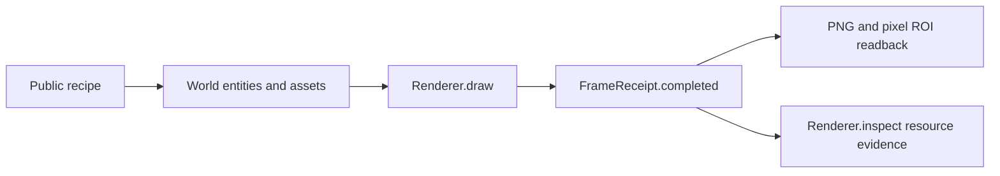

# Wave1 rendering fixture

> [!NOTE]
> This is a public Engine consumer recipe. It keeps scene authoring facts in
> `recipe.ts`; the Browser test owns frame submission and acceptance evidence.

> [!CAUTION]
> [`DELIVERY.md`](DELIVERY.md) is a **historical PR3136 handoff** bound to
> Engine commit `634c561d12a3132f5730de25fe5cf74f5a6e2ee5`. It is not a
> current-main PASS record. Current acceptance must use a fresh CI/loop run
> against the checked-out product SHA, with its receipts, logs and skips
> preserved. The formal current-main evidence is the exact-head
> [CI run 34748531802](https://github.com/ForgeaX-Games/forgeax-engine/actions/runs/34748531802),
> whose required fleet gates are green. A local attempt at the same
> `3497cebedc061df17d39d335d52e55dce0604aa9` stopped at host `ENOSPC` while
> retaining the full smoke outputs; that local limitation does not override
> the CI result.

## Coverage

| Surface | Evidence |
| --- | --- |
| Geometry and materials | ordinary mesh, multiple submeshes, vertex color, wood/metal PBR, emissive stripes |
| Lighting | fixed exposure, weak Skylight, DirectionalLight with 1024 shadow map, local PointLight |
| Environment | Atmosphere on/off, sky-only view, visible sun ROI, opaque wall occlusion ROI |
| Lifetime | aperture replacement, two moved successors, delete and recreate, dynamic retire |
| Temporal and resources | FXAA/none resize/TAA, completed receipts, pixel readback, 60-frame bounded resource check |



## Focused browser gate

```sh
pnpm exec vitest run --config config/vitest.browser.config.ts --project=browser \
  packages/runtime/src/__tests__/wave1-rendering-p0.browser.test.ts \
  packages/runtime/src/__tests__/wave1-rendering-materials.browser.test.ts \
  packages/runtime/src/__tests__/wave1-shadow-diagnostic.browser.test.ts \
  packages/runtime/src/__tests__/wave1-rendering-recovery.browser.test.ts \
  packages/runtime/src/__tests__/wave1-dynamic-geometry.browser.test.ts
```

This focused command covers **5 files and 9 tests**. It is a focused browser
gate, not the complete browser fleet or the 80-entry Dawn smoke roster.

The test uses the public `@forgeax/engine-*` exports and the checked shader
manifest. It reads pixels from `page.screenshot` and records representative
captures under the local, generated `artifacts/wave1-rendering/` directory.
Image and compressed-tape outputs stay out of the Engine Git history; the
tracked JSON summaries and source-level gates remain the reviewable evidence.


## Delivery boundary

This change targets Wave 1 Engine **P0 items 1-5 and their observation,
budget, and recovery obligations** from the Voxel rendering infrastructure
strategy. P1 improvements and P2 effects are outside this PR. Engine-only
meshes and injected events do not prove Voxel connectivity, physics, or the
joint destruction lifecycle.

## One retained scene update flow

World change evidence selects affected identities and fields. Each identity
publishes once through `RenderScene.apply`, whether its mesh/material, root
transform, and instance payload change together or independently. Missing
producer evidence triggers conservative extraction into that same retained
projection. World order changes and catalog reconciliation preserve surviving
slots and submitted temporal history. Camera/light/environment updates do not
throw away geometry.

GPU raster resolves meshes by the retained composition slot. World-scoped
asset handles are resolved by the existing residency owner before that
projection; identical numeric handles in different Worlds remain distinct.
The stale mesh-view WeakMap is removed.

The GPU projection compares affected matrix and metadata rows against the
resident CPU tables. Material changes therefore do not re-upload unchanged
instance matrices. A 64-instance regression changes one local matrix plus its
root transform and verifies the exact matrix upload range; mixed-World tests
compare every result with independent full extraction outside the update flow.

## TAA equivalence and measured cost

The resolve keeps the settled 5-by-5 footprint and the moving center plus eight
neighbors. It reduces YCoCg bounds directly instead of storing an intermediate
25-color array and scanning it again. History clipping, rejection, velocity,
stability, and age remain unchanged.

The Dawn equivalence gate compares all three MRT attachments byte for byte
against the pinned baseline shader. Dedicated falsifiers remove a unique moving
neighbor, a settled corner, the secondary search footprint, depth tie handling,
and history rejection; each must change actual GPU output.

| Run | GPU interval union p50 | p95 |
| --- | ---: | ---: |
| Baseline A | 14.025 ms | 24.904 ms |
| Baseline B | 11.993 ms | 21.365 ms |
| Final A | 8.651 ms | 16.450 ms |
| Final B | 8.847 ms | 16.450 ms |

These are Apple M4 Pro / Metal measurements of the fixed hello-SSR tiles scene
at 1920 by 1080, with TAA enabled and completed GPU work. Each run submits 420
frames; statistics use ordinals 121-420. The union merges overlapping raw GPU
timestamp intervals; it is neither an exclusive TAA pass duration nor an FPS
claim. The baseline and changed shader identities, raw ticks, error arrays, and
hardware facts are retained in the performance reports. Measurements made
before the implementation commit are bound by their recorded shader
fingerprints. Raw JSON and compressed captures are generated locally when the
gate runs; the tracked summary keeps the digests and measured values without
adding binary assets to the Engine repository.

Regenerate the table from the raw reports with:

```sh
node scripts/dev-verify/wave1-rendering/summarize-performance.mjs
```

The mixed CPU workload covers two Worlds, hierarchy and visibility changes,
material edits, root transforms, and instance counts `3 -> 0 -> 1 -> 2`.
Four initial base/current pairs were noisy while repository builds ran; they
do not support a CPU latency improvement claim. The deterministic RHI-null
upload probe reduced 200 calls / 405,680 bytes to 120 calls / 215,600 bytes.
RHI-null is a software accounting probe and does not establish hardware GPU cost.


## Shadow layout regression

Colored geometry uses a 64-byte vertex stride. The old shared shadow pipeline
assumed the default 48-byte layout, so the same vertex buffers generated broken
triangles in the shadow atlas while their forward geometry remained correct.
Both the wall self-shadow and its ground projection were affected.

Each caster now resolves the mesh-owned vertex layout, actual triangle topology,
and skin layout through the ordinary shadow recorder. Recovery prepares the
same descriptor shape. A real browser capture checks shadow and forward strides
for identical buffers, with shadow-off and canonical uncolored wall/floor controls.
The paired RHI tapes contain 20 matched shadow draws each. The red tape uses
48-byte shadow versus 64-byte forward layouts; the corrected tape uses 64 bytes
in both passes. Raw tapes and screenshots are generated locally by the focused
gate; the tracked `shadow-layout-comparison.json` keeps the layout comparison
and digests without committing binary outputs.
For raw console evidence, run the focused test using the root Vitest config
with `--silent=false --disableConsoleIntercept --reporter=verbose`; the
`tape-base64` line is the exact serialized v7 artifact.
Corrected images show a continuous ground projection and no wall triangles.

The corrected capture shows a continuous ground projection and no wall
triangles. Re-run the focused browser gate above to regenerate the before and
after PNGs locally when visual inspection is needed.

## Material and air-layer acceptance

The material browser gate removes scene lights and disables Bloom before
checking emissive intensity and stripe-pattern changes. A canonical mesh without
`color` and the same mesh with white vertex colors produce identical pixels.
The no-light Standard fixture intentionally produces a black diagnostic frame
and may emit the corresponding no-lights warning; that setup signal is expected
and is not a test failure.

The P0 air layer uses the existing bounded `VolumetricFog` volume and its
`volume-inject`, `volume-integrate`, `volume-temporal`, and `volume-composite`
passes. Atmosphere and this volume can be enabled independently. The older
analytic `Fog` component remains extraction/validation data; this change does
not reconnect per-material analytic fog or add a second air-layer renderer.

The recovery browser gate injects an explicit host `unknown` loss signal at a
completed frame boundary and requires real GPU frames from the replacement
generation using the same Renderer, World, and lease. It also changes a
MeshFilter to a previously unsubmitted ordinary mesh before loss, then requires
the first recovered draw to show the current World. It does not simulate a
native driver reset or treat `GPUDevice.destroy()` as recoverable loss. This
loss injection is an internal test fixture path; it is not a public loss
simulator. Public consumers depend on the Engine `device-lost` and recovery
contract and the actual host device-loss signal.


## Recovery and view corrections

FrameCamera's explicit entity selection now reaches the same camera extraction
used by culling, shadow fitting, and temporal history. An invalid explicit camera
uses the existing no-camera error; omitting the entity preserves ActiveCamera.
Atmosphere receives the sun's unscaled color and intensity separately, so
illumination is applied once.

Standard lighting requests carry explicit cluster, storage, and vertex-color
facts until manifest resolution. The old empty request lost its cluster fact
and selected a direct-light variant for colored clustered meshes. The regression
composes the producer key, geometry projection, and backend resolver together.

Recovery prepares GPU-culling candidate mesh/LOD residency through the same
function as recording. Preparing only CPU-visible meshes left other GPU-culling
candidates cold on the first recovered frame. The candidate still validates
that its prepared last-known-good pipelines resolve from a stable cache.


The replacement TAA pipeline uses the same three attachment formats as its
history textures and graph targets. Recovery now forwards the format array
without nesting it and publishes the corresponding cache key.


Recovery preparation has a bounded last-successful-frame seed. The next draw
still consumes the current World through the normal extraction and residency
owners. A runtime guard previously rejected every new pipeline or upload in
that draw, which made an unsubmitted mesh edit fail repeatedly after recovery.
The guard and its wiring are removed; candidate preparation and cache validation
remain. Resource uploads and pass work use their existing observation surfaces.
This does not promise zero cold work for newly introduced content or every
optional effect.

> [!NOTE]
> Native driver-reset survival and Voxel's joint destruction lifecycle are
> outside this Engine fixture's evidence.

## Complete local smoke roster

After fixing the implementation commit and rebuilding its packages, run:

```sh
node scripts/dev-verify/wave1-rendering/run-smokes.mjs \
  --run --expected-product-sha <implementation-commit>
node scripts/dev-verify/wave1-rendering/run-additional-smokes.mjs \
  --run --expected-product-sha <implementation-commit>
```

The first runner uses the canonical roster's 80 runnable frame-receipt gates.
Its strict receipt aggregate currently rejects legacy producers that still
lack canonical stdout receipts, matching the migration gap explicitly deferred
by base CI. The delivery record keeps that result separate from command exit
status and the completed-frame rechecks; it never synthesizes receipts.
The supplement attempts eight directly available Dawn 60-frame owners plus
six existing numerical/composite or bounded Dawn smoke commands. Its plan
records non-Dawn exclusions and already covered children separately. Neither
runner treats an excluded or unavailable path as a successful 60-frame run.
