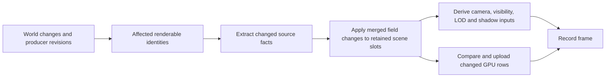

# Unified scene update acceptance

This follow-up updates PR #3136 against Engine `46cb8923eef3852c89a86de4270a7a0bc3e49f33`.
It preserves the Wave 1 Engine P0, TAA, and vertex-layout changes while removing
latest main's scene classification and dynamic GPU bypass.

## One publication flow

| Concern | Result |
|:--|:--|
| Scene routing | Removed `rigidOnly`, `gpuDrivenDynamicFrame`, `deriveDynamicFramePlan`, `refreshDynamicFrame`, and the visibility bypass. |
| Mixed edits | Content, root matrices, and instance collections merge by World/entity identity in one `RenderScene.apply` publication. |
| Dependencies | Material/mesh consumers, instance revisions, visibility subtrees, and skin-joint consumers determine source refresh scope. |
| Skin lifecycle | Stable World/entity palette identities survive partial updates and World reorder; removal and detach retire the affected slice. |
| LOD cache | Filtered main and shadow plans depend on projected LOD heights, including moving roots with a stationary camera; no-LOD plans retain cache reuse. |
| Missing evidence | Source reconciliation retains surviving slots; it is recovery within the same projection. |
| Shadow ownership | Each retained renderable carries producer pass facts; frame indices derive before camera culling. |
| Cost reduction | Reuse dispatch entries and remap storage, compare matrix rows before publication/upload, scope structural scans to changed Worlds, and avoid subtree queue shifts. |

GPU capability and shader/material admission still select supported drawing work.
They do not select a second scene extraction or visibility implementation.

## Mixed workload comparison

The benchmark uses two Worlds with 256 ordinary entities each. Every update
changes instance count, root transform, parent, visibility, and a shared material.
Eight warmup updates precede 31 measured updates. Every measured frame is checked
against an independent full extraction outside the timed region.

> [!IMPORTANT]
> RHI Null measures CPU work and upload requests only. It is not evidence of GPU
> execution time or pixel correctness. Physical GPU gates are recorded separately.

Three alternating baseline/follow-up pairs were run separately for CPU publication
and for publication with the RHI Null upload probe. Each run uses 8 warmup updates
and 31 measured updates. Both checkouts had no tracked changes during measurement.

| Metric | Main `46cb8923ee` | Follow-up `05f597b2a9` |
|:--|--:|--:|
| Initializations / full rebuilds per run | 40 | 1 |
| Delta updates per run | 0 | 39 |
| Full-extraction oracle checks per run | 31 passed | 31 passed |
| CPU scene-update p50 range, ms | 4.198–4.405 | 3.197–3.329 |
| Median of the three CPU p50 values, ms | 4.357 | 3.217 |
| CPU scene-update p95 range, ms | 6.742–8.190 | 6.177–7.086 |
| Upload-probe p50 range, ms | 5.662–7.071 | 3.920–4.313 |
| Uploaded bytes over 31 samples | 20,824,064 | 4,127,200 |
| Upload calls over 31 samples | 155 | 179 |

The local CPU p50 median is about 26% lower and sampled upload bytes about 80%
lower. Sparse updates issue more upload calls (179 versus 155); reduced bytes do
not establish a GPU latency improvement. These measurements cover scene update
work, not complete frame time or FPS.

[Summary and all measured values](evidence/unified-scene/summary.json) links the
results to clean source commits. The twelve adjacent raw run files retain every
timing sample, oracle count, and upload counter.

## Validation

| Gate | Current result |
|:--|:--|
| Full build | Pass: 211 applications rebuilt, 1 unchanged; final Engine rebuild also passes. |
| Render tests | 408 files / 1745 tests pass. |
| Runtime, Assets, Geometry, Scene | 428 files / 3362 tests pass; existing configuration skips 4 files / 20 tests. |
| Source and test TypeScript | Pass. |
| Biome and 4096-line gate | Pass. |
| Full `pnpm test:browser` | Exit 0: 26 groups / 145 files plus dedicated entity visibility; 267 tests pass. |
| Full `pnpm test:dawn` | Exit 0, including compact, isolated, heavy-carrier, and direct-light partitions. |
| 80-command smoke roster | All commands exit 0; strict aggregate remains blocked by legacy missing receipts. |
| Supplemental smoke checks | 11/14 pass; all three failures reproduce on clean current main. |
| Independent review | No blocker found in structural removal, instance revisions, retry, skin lifecycle, World reorder, or unified GPU synchronization. |

Local gates ran on the pre-commit merge tree. Every changed non-Markdown file
was hashed and matched against committed product `05f597b2a9cb72cfbaeddb174cd5dc95ddcc6c2f`;
[source inputs](evidence/unified-scene/source-inputs.json) preserves that binding.
The benchmark ran on that clean committed product. Subsequent changes publish
verification records only. CI status belongs to the final PR head.

The earlier [delivery record](DELIVERY.md) describes its original source revision,
including the TAA GPU timing and SDK ZIP. Those historical results are not
presented as fresh measurements of this follow-up.

## Supplemental baseline failures

| Owner | Follow-up and clean main `46cb8923ee` |
|:--|:--|
| IBL irradiance | 332 frames; mean absolute difference 0.07083 exceeds epsilon 0.05. |
| IBL specular | 332 frames; mean absolute difference 0.08039 exceeds epsilon 0.05. |
| Physical Material | Eight missing-material-receipt errors for the same six authored aliases; all 300 direct-frame attempts fail and no FrameReceipt is produced. |

These failures were reproduced using separately built baseline applications and
the same asset commit `377dd57a0c147a16f0e453d65d43f23e5087d717`.
References, thresholds, and material admission checks remain unchanged.

## Baseline receipt limitation

The strict roster parser rejects the legacy `hello-triangle` producer with
`expected exactly one observed receipt, found 0`, although its owner smoke exits
0 and reports 300 submitted frames. An independent run on clean main
`46cb8923eef3852c89a86de4270a7a0bc3e49f33` reproduces the same result. This does
not count as a completed canonical FrameReceipt. The aggregate limitation is
reported separately from successful owner checks; neither the parser nor the
rendering thresholds are relaxed by this change.
