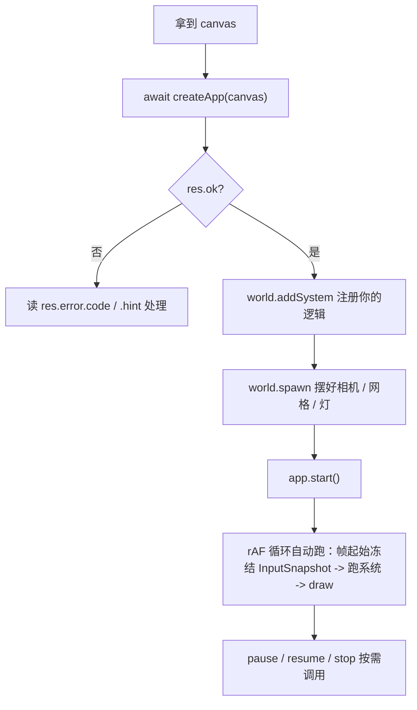

# forgeax-engine-app

> 基线: [`5c8c90f1`](../../commit/5c8c90f1) (2026-06-03) · 同步至: [`c182ffc00`](../../commit/c182ffc00) (2026-07-08)

> 把"一块 canvas"变成"一个在跑的游戏"。引导 + 主循环 + 输入 + 动画/物理接线，四件事一个 skill。聚合 `@forgeax/engine-app` · `@forgeax/engine-input` · `@forgeax/engine-runtime`（引导面）。

## 心智模型

两个引导入口：

| 入口 | 给你 | 谁驱动循环 |
|:--|:--|:--|
| `createApp(canvas, opts?, bundler?)` | `App`——rAF 循环 / dt 钳制 / 输入 attach / 错误 fan-out 已接好 | 引擎 |
| `createRenderer(canvas, opts?, bundler?)` | `Renderer`——只渲染 | 你自己拿 rAF 调 `draw([world], { owner: 0 })` |

绝大多数游戏从 `createApp` 起步。`App` 是状态机：`start → (pause ⇄ resume) → stop`。输入不轮询——引擎在**帧起始**冻结成只读 `InputSnapshot` 资源，系统在 `world` 里读它。

gamepad 采集是「每帧轮询式」（`navigator.getGamepads()` 在 `sample()` 内调用——无 `gamepadconnected` 事件监听），touch 相位转换是「事件流」（pointerdown/pointermove/pointerup 在帧内积入队列），但 `InputSnapshot` 读写面完全一样：`snap.gamepad(0).button(b)` / `snap.pointer(id).x` / `snap.virtualAxis('move')`——charter P4 将采集差异隐藏在后端内部，AI 用户不需感知"轮询 vs 事件流"的区别。

参数面分两层：`canvas`（必选）/ `opts?: CreateAppOptions`（app 行为：`plugins` / `maxDt`）/ `bundler?: BundlerOptions`（构建层：`shaderManifestUrl` + `importTransport`）。`clearColor` 不在参数里——已搬到 `Camera.clearColor`（`array<f32, 4>`）：渲染表现归 `Camera`，构建通道归 `bundler`，app 行为归 `opts`，三关注面分离。

## Plugin 系统

`createApp` 把所有能力接入收拢成一个入口：`plugins: Plugin[]`。一个 `Plugin` 就是一个 `{ name, build(world) }`——**你写引擎系统时熟悉的 `world` 就是 plugin 的唯一参数**（charter P4：transform / physics / audio 同形）。

```ts
// Plugin 形状——住 @forgeax/engine-plugin，公开路径 @forgeax/engine-app
interface Plugin {
  readonly name: string;                              // kebab-case，如 'my-tool' / 'physics'
  build(world: World): Result<void, PluginError>       // 同步或 async
                   | Promise<Result<void, PluginError>>;
}
```

> [!NOTE]
> `Plugin` 类型从 `@forgeax/engine-app` import（`app` re-export 自 `@forgeax/engine-plugin`——薄协议层包，仅依赖 `@forgeax/engine-ecs`）。能力包作者在写 `xxxPlugin()` 工厂时**直连** `@forgeax/engine-plugin`（绕开 app 以免成环）；AI 用户只需 `import { ... } from '@forgeax/engine-app'`——入口不变。

### canvas form 默认必装集

`createApp(canvas, {})` 零配置时自动注入 5 个内置 plugin：

```ts
// 等价于你在 createApp(canvas, {}) 内部得到的
createApp(canvas, {
  plugins: [
    transformPlugin(),   // registerPropagateTransforms(world)
    timePlugin(),        // 命名占位——Time 仍由 frame-loop 每帧写
    animationPlugin(),   // registerAdvanceAnimationPlayer(world)
    statePlugin(),       // registerStatesPlugin(world)
    inputPlugin(),       // addSystem(InputFrameStartScan) —— canvas 上的 browser 后端由 createApp 预注入 world 资源
  ],
});
```

全部来自 `@forgeax/engine-app` 的 `inputPlugin`（只有它复用了 app 层的 DOM attach 副作用——其它都来自能力包）。

### 内置 plugin 工厂速查

| Plugin | 工厂 | import 路径 | 做了什么 |
|:--|:--|:--|:--|
| `transform` | `transformPlugin()` | `@forgeax/engine-runtime` | `registerPropagateTransforms(world)`——写 `Transform.world` mat4 列 |
| `time` | `timePlugin()` | `@forgeax/engine-runtime` | no-op 占位——Time 每帧由 frame-loop 写；占位让 inspector 枚举 `'time'`、重名检测生效 |
| `animation` | `animationPlugin()` | `@forgeax/engine-runtime` | `registerAdvanceAnimationPlayer(world)`——驱动分时采样 + 混合 |
| `state` | `statePlugin()` | `@forgeax/engine-state` | `registerStatesPlugin(world)`——状态 token 的资源创建 + `transitionStates` 系统 |
| `input` | `inputPlugin()` | `@forgeax/engine-app` | guard `world.hasResource(INPUT_BACKEND_KEY)` → `addSystem(InputFrameStartScan)`；backend 由 `createApp` 预注入 |
| `physics` | `physicsPlugin(backend)` | `@forgeax/engine-physics` | **async**：动态 import 后端 → loadRapier → `insertResource('PhysicsWorld')` + 注册三阶段 tick。失败返 `PluginError({ code: 'plugin-build-failed' })` |
| `audio` | `audioPlugin()` | `@forgeax/engine-audio-webaudio` | guard `world.hasResource(AUDIO_ENGINE_RESOURCE_KEY)` → 注册 audio-tick 系统；backend 由 `createApp` 预注入 |

### 显式 plugins 用法

```ts
import { createApp } from '@forgeax/engine-app';
import { physicsPlugin } from '@forgeax/engine-physics';
import { audioPlugin } from '@forgeax/engine-audio-webaudio';
import { forgeaxBundlerAdapter } from 'virtual:forgeax/bundler';

// 自动装默认 5 插件（transform/time/animation/state/input）+ 手动加 physics + audio
const app = await createApp(canvas, {
  plugins: [physicsPlugin('rapier-3d'), audioPlugin()],
}, forgeaxBundlerAdapter());

if (!app.ok) {
  // PluginError 和 AppError 共用同一 Result 路径
  if (app.error.code === 'duplicate-plugin') {
    console.error(`Duplicate plugin name: ${app.error.detail.name}`);
  } else if (app.error.code === 'plugin-build-failed') {
    console.error(`Plugin ${app.error.detail.pluginName} failed: ${app.error.detail.cause}`);
  }
}
app.value.start();
```

### assemble form——显式 plugin 集

assemble 形态不自动拼默认集（host 自管 world core），只跑你在 `plugins` 里显式列的：

```ts
import { createApp } from '@forgeax/engine-app';
import { World } from '@forgeax/engine-ecs';
import { createRenderer, transformPlugin, timePlugin, animationPlugin } from '@forgeax/engine-runtime';
import { statePlugin } from '@forgeax/engine-state';
import { forgeaxBundlerAdapter } from 'virtual:forgeax/bundler';

const renderer = await createRenderer(canvas, {}, forgeaxBundlerAdapter());
const world = new World();

// 不传 plugins 就是纯粹空 world——所有能力由 host 决定
const app = await createApp({ renderer, world, plugins: [
  transformPlugin(), timePlugin(), animationPlugin(), statePlugin(),
] });
```

> [!NOTE]
> `input: false` 旧 opt 的迁移路径：切到 assemble form，**不**传 `inputPlugin` 即为无 input。旧 API `opts.input` / `opts.audio` / `opts.physics` 已删除——`plugins` 是唯一入口。

## 核心 API 速查

| 入口 | 形态 | 用途 |
|:--|:--|:--|
| `createApp(canvas, opts?, bundler?)` | `async => Result<App, CanvasAppError>` | 一行起飞：自动装配 Renderer + World + input + rAF 循环 + 默认 5 plugin。第三参数 `bundler` 携带构建层注入（`shaderManifestUrl` + `importTransport`），典型传 `forgeaxBundlerAdapter()` |
| `createApp({ renderer, world, plugins?, ... })` | `async => Result<App, AssembleAppError>` | assemble 形态：显式注入已有 Renderer / World + plugins（参见 `packages/app/README.md` §Assemble form） |
| `createRenderer(canvas, opts?, bundler?)` | `async => Renderer` | 低层：只要渲染器，自己驱动循环（失败 throw `EngineEnvironmentError`） |
| `Engine.create(canvas, opts?, bundler?)` | `createRenderer` 的命名空间别名 | 与 `createRenderer` 同一函数，喜欢 `Engine.create({...})` 写法时用 |
| `forgeaxBundlerAdapter()` | `() => BundlerOptions` | 由 `virtual:forgeax/bundler` 虚拟模块导出，标准第三参数——聚合 `shaderManifestUrl` + `importTransport` |
| `App.start() / stop() / pause() / resume()` | `() => Result<void, AppError>` | 主循环状态机；返回结构化 `Result` |
| `world.getResource<{dt:number;elapsed:number}>('Time')` | `=> { dt, elapsed }` | 帧时钟（frame-loop 每帧在 `world.update()` 前写）。`dt`=本帧夹取后的秒增量（积它做逐帧运动）；`elapsed`=自循环启动累计秒数（Σ dt，单调不减），做**绝对时间**驱动（脉动 / `sin(elapsed·ω)` 振荡 / 动画时钟）时读它，别在系统里自己累加 dt（会漂移+重复推导）。对标 Bevy `Time::elapsed_secs()`；与 dt 同夹取，后台标签页只按夹取量前进（无时间跳变） |
| `world.getResource<InputSnapshot>(INPUT_SNAPSHOT_RESOURCE_KEY)` | `=> InputSnapshot` | 在系统里取帧起始输入快照（推荐 import 常量 `INPUT_SNAPSHOT_RESOURCE_KEY` 而非裸字符串 `'InputSnapshot'`）。读点面：keyboard（down/up）/ mouse（movementDelta/button(0\|1\|2)/wheelDelta）/ gamepad（gamepad(i).button(b)/buttonValue/justPressed/justReleased/axis(a)/connected/standardMapping）/ pointer（pointer(id) → {active,x,y,pressure,pointerType,delta}）/ virtualAxis（virtualAxis(name) → {x,y}）/ capabilities（frozen {gamepad,pointer}）/ pointerEvents（本帧相位队列） |
| `world.insertResource(INPUT_BACKEND_KEY, backend)` | 资源注入 | 插入 `InputBackend` 实例到 World（由 `createApp` 自动完成）；系统 token `InputFrameStartScan` 经 `resources: [INPUT_BACKEND_KEY]` 声明依赖，ParamValidation 校验缺失 |
| `world.insertResource(ANIMATION_ASSET_RESOLVER_KEY, resolver)` | 资源注入 | 插入 `AnimationAssetResolver` 到 World（由 `createApp` 自动完成）；系统 token `AdvanceAnimationPlayer` 经 `resources: [ANIMATION_ASSET_RESOLVER_KEY]` 声明依赖 |
| `world.addSystem(InputFrameStartScan)` | 注册 token | 激活帧起始输入扫描系统（替代已删除的 `createFrameStartScanSystem` 工厂） |
| `world.addSystem(AdvanceAnimationPlayer)` | 注册 token | 激活动画推进系统（替代旧的闭包注册形态） |
| `registerPropagateTransforms(world, opts?)` | 接线函数 | 注册 `PropagateTransforms` token；opts 可选 `beforeSystemName` |
| `registerAdvanceAnimationPlayer(world)` | 接线函数 | 注册 `AdvanceAnimationPlayer` token + `insertResource(ANIMATION_ASSET_RESOLVER_KEY, ...)` |
| `registerPhysicsSystems(world)` | 接线函数 | 注册 3D 物理三系统 token（第二参已删除；系统 fn 内 `resolveComponent('Transform')` 自取组件 token） |
| `registerPhysicsSystems2D(world)` | 接线函数 | 注册 2D 物理三系统 token（同理） |
| `createInputSnapshot()` | `() => InputSnapshot` | headless 测试 / 预启动的空快照（held/edge 全 `false`） |

> [!IMPORTANT]
> `createApp` / `createRenderer` / `Engine.create` 都接受三个位置参数 `(canvas, opts?, bundler?)`。`createApp` 走 `Result`（查 `.ok`），`createRenderer` / `Engine.create` 在拿不到后端时 throw `EngineEnvironmentError`（`try/catch`）。别混。

## 规范调用顺序



## idiom 代码骨架

```ts
import { createApp } from '@forgeax/engine-app';
import { forgeaxBundlerAdapter } from 'virtual:forgeax/bundler';
import { INPUT_SNAPSHOT_RESOURCE_KEY, type InputSnapshot } from '@forgeax/engine-input';
import { defineSystem } from '@forgeax/engine-ecs';
import { Transform } from '@forgeax/engine-runtime';

const res = await createApp(canvas, {}, forgeaxBundlerAdapter());
if (!res.ok) {
  console.error(res.error.code, res.error.hint);
  throw new Error(res.error.code);
}
const app = res.value;
const world = app.world;

// Per-frame clear color 在 Camera 组件上，不在 createApp 参数里
world.spawn(
  { component: Camera, data: {
    clearColor: [0.1, 0.1, 0.1, 1.0],
    // ... projection 字段
  } },
);

const MovePlayer = defineSystem({
  name: 'move-player',
  queries: [{ with: [Transform] }],
  fn: (world, queryResults) => {
    const input = world.getResource<InputSnapshot>(INPUT_SNAPSHOT_RESOURCE_KEY);
    // keyboard + mouse (classic 4-method surface)
    const dx = (input.keyboard.down('d') ? 1 : 0) - (input.keyboard.down('a') ? 1 : 0);
    // gamepad: left stick X-axis (0.x) + button A (0) for jump
    const gpx = input.gamepad(0).axis(0);
    const jump = input.gamepad(0).justPressed(0); // one-frame edge
    // pointer: touch position (pointerId 0)
    const touch = input.pointer(0);
    const tx = touch.active ? touch.x : 0;
    // virtual joystick (named 'move')
    const joy = input.virtualAxis('move');
    // capability probe (one-shot at attach)
    const hasGamepad = input.capabilities.gamepad;
    for (const bundle of queryResults[0]) {
      const pos = bundle.Transform.pos; // flat stride-3: row i x lane at pos[i * 3]
      for (let i = 0; i < bundle.entityCount; i++) pos[i * 3] = (pos[i * 3] ?? 0) + dx + gpx;
    }
  },
});
world.addSystem(MovePlayer);

app.start();   // arms the rAF loop
// app.pause(); app.resume(); app.stop();
```

### Action mapping recipe (declare once, forget device)

Declare an `InputMap` (via `INPUT_MAP_KEY` Resource) to derive per-frame `snap.action(name)` / `snap.getVector` readpoints -- consumers only know action names, never raw device details (AC-07: same getVector output from keyboard WASD AND gamepad left stick).

```ts
import { createApp } from '@forgeax/engine-app';
import { forgeaxBundlerAdapter } from 'virtual:forgeax/bundler';
import { INPUT_MAP_KEY, INPUT_SNAPSHOT_RESOURCE_KEY, type InputSnapshot } from '@forgeax/engine-input';
import { defineSystem } from '@forgeax/engine-ecs';
import { Transform } from '@forgeax/engine-runtime';

const res = await createApp(canvas, {}, forgeaxBundlerAdapter());
const world = res.value.world;

// Insert InputMap BEFORE adding InputFrameStartScan.
// Duplicate action names → last-wins (D-8). Per-action deadzone: default 0.2.
world.insertResource(INPUT_MAP_KEY, [
  { action: 'jump', bindings: [
    { type: 'key', key: ' ' },
    { type: 'gamepadButton', button: 0 },
  ]},
  { action: 'moveLeft',  bindings: [
    { type: 'key', key: 'a' },
    { type: 'gamepadAxis', axis: 0, sign: -1 },
  ]},
  { action: 'moveRight', bindings: [
    { type: 'key', key: 'd' },
    { type: 'gamepadAxis', axis: 0, sign: 1 },
  ]},
  { action: 'moveUp',    bindings: [
    { type: 'key', key: 'w' },
    { type: 'gamepadAxis', axis: 1, sign: -1 },
  ]},
  { action: 'moveDown',  bindings: [
    { type: 'key', key: 's' },
    { type: 'gamepadAxis', axis: 1, sign: 1 },
  ]},
]);

const MovePlayer = defineSystem({
  name: 'move-player',
  queries: [{ with: [Transform] }],
  fn: (world, queryResults) => {
    const snap = world.getResource<InputSnapshot>(INPUT_SNAPSHOT_RESOURCE_KEY);

    // Action: same isPressed() for keyboard space AND gamepad A (AC-07)
    if (snap.action('jump').justPressed()) {
      // one-frame edge -- jump (space or gamepad A)
    }

    // getVector: radial deadzone, WASD diagonal magnitude = 1 (AC-06)
    const move = snap.getVector('moveLeft', 'moveRight', 'moveUp', 'moveDown');
    // move.x / move.y ∈ [-1, 1]; circular deadzone (NOT square)
    for (const bundle of queryResults[0]) {
      const pos = bundle.Transform.pos; // flat stride-3: row i x lane at pos[i * 3]
      for (let i = 0; i < bundle.entityCount; i++) {
        pos[i * 3] = (pos[i * 3] ?? 0) + move.x;
      }
    }
  },
});
world.addSystem(MovePlayer);
```

**ActionBinding types** (4-member closed discriminant union, AC-08b: exhaustive switch at compile time):

| binding type | fields | semantics |
|:--|:--|:--|
| `'key'` | `key: string` | `KeyboardEvent.key` value (e.g. `' '`, `'a'`, `'ArrowUp'`) |
| `'mouseButton'` | `button: 0 \| 1 \| 2` | W3C MouseEvent.button |
| `'gamepadButton'` | `button: GamepadButtonIndex` (0..16) | Standard-layout button index. Aggregates across ALL connected `standardMapping` slots (D-9: Godot device=-1 semantic) |
| `'gamepadAxis'` | `axis: GamepadAxisIndex` (0..3) + `sign?: 1 \| -1` | Standard-layout axis index. `sign` omitted → \|value\| (trigger); `sign=1\|-1` → max(0, value*sign). Aggregates across ALL connected `standardMapping` slots |

**Unregistered action names** → empty signal: `isPressed()=false`, `strength=0`, `justPressed=false` -- never throws (AC-01/09, charter P3).

### Gesture reading recipe (five recognizers, dual-channel)

Gesture recognizers (pinch / rotate / swipe / long-press / double-tap) run in the browser backend closure (C-3). Two output channels: continuous values via `snap.gesture`, one-frame lifecycle events via `snap.gestureEvents` (D-4).

```ts
import { INPUT_SNAPSHOT_RESOURCE_KEY, type InputSnapshot } from '@forgeax/engine-input';
import { defineSystem } from '@forgeax/engine-ecs';

const GestureConsumer = defineSystem({
  name: 'gesture-consumer',
  queries: [],
  fn: (world) => {
    const snap = world.getResource<InputSnapshot>(INPUT_SNAPSHOT_RESOURCE_KEY);

    // Continuous values -- identity when no gesture active (AC-12)
    const zoom = snap.gesture.pinchScale;       // 1.0 = no pinch
    const rot = snap.gesture.rotationAngle;      // 0 = no rotation

    // Lifecycle events -- one-frame queue (mirrors pointerEvents)
    for (const ev of snap.gestureEvents) {
      switch (ev.kind) {
        case 'pinch-begin':
          // ev.pointerIds: [number, number], ev.pointerType: 'mouse'|'pen'|'touch'
          break;
        case 'pinch-end':
          break;
        case 'pinch-cancel':
          break;
        case 'rotate-begin':
          break;
        case 'rotate-end':
          break;
        case 'rotate-cancel':
          break;
        case 'swipe':
          // ev.direction: 'left' | 'right' | 'up' | 'down'
          break;
        case 'long-press':
          // ev.pointerId, ev.position: {x,y}
          break;
        case 'double-tap':
          // ev.pointerId, ev.position: {x,y}
          break;
      }
      // Exhaustive switch on GestureEvent kind -- no default branch (AC-13)
    }
  },
});
world.addSystem(GestureConsumer);
```

**Gesture thresholds** (all exported constants from `@forgeax/engine-input`, D-10):

| constant | value | meaning |
|:--|:--|:--|
| `LONG_PRESS_DURATION_MS` | 500 | Hold time before long-press fires |
| `LONG_PRESS_SLOP` | 10 | Max pointer movement (canvas px) during hold |
| `DOUBLE_TAP_INTERVAL_MS` | 350 | Max time between two taps |
| `DOUBLE_TAP_DISTANCE` | 10 | Max distance between two tap positions (canvas px) |
| `SWIPE_VELOCITY_THRESHOLD` | 0.5 | Min speed (px/ms) over SWIPE_WINDOW_MS |
| `SWIPE_WINDOW_MS` | 100 | Velocity computation sliding window |
| Per-action deadzone | 0.2 | Default for action analog deadzone (Godot prior-art) |

**Gesture events** carry `pointerType` (narrowed `'mouse' | 'pen' | 'touch'`, AC-19) -- consumers can exhaustively switch on both `kind` and `pointerType`. Blur/visibilitychange resets all recognizers: emits cancel events, resets continuous values to identity, and clears timers (AC-18). Clock is decoupled from pointer-event frequency: a long-press timer advances on idle frames too (AC-16, D-3).

`InputSnapshot` 多设备读点面——全部在同一 `world.getResource<InputSnapshot>(...)` 对象上，无需任何互斥 / mode 开关。action / gesture 是构建在原始设备集群之上的高层抽象：action 将跨设备输入的 N 种组合坍缩为单一语义名，gesture 从相位事件流派生连续值 + 生命周期事件。

| 集群 | 读点 | 类型 |
|:--|:--|:--|
| keyboard | `.down(key)` / `.up(key)` | `boolean` per key（key 匹配 `KeyboardEvent.key`） |
| mouse | `.movementDelta`（`{x,y}`）/ `.pointerLocked`（`boolean`）/ `.button(0\|1\|2)`（`boolean`）/ `.wheelDelta`（`number`） | PointerLock 累加 + 合并锁态 + W3C button 槽 + sign-discrete 滚轮 notches |
| gamepad | `.gamepad(i).button(b)` / `.buttonValue(b)` / `.justPressed(b)` / `.justReleased(b)` / `.axis(a)` / `.connected` / `.standardMapping` | slot `i` 不收窄（运行时断连 / 越界回空信号）；`b: 0\|1\|...\|16` / `a: 0\|1\|2\|3`——越界字面量 TS 编译报错 |
| pointer | `.pointer(id)` — 返回 `{ active, x, y, pressure, pointerType, delta }` | per-pointerId reader；不存在 → `active=false`（空信号） |
| virtualAxis | `.virtualAxis(name)` — 返回 `{ x, y }` | named joystick 读点；不存在 → 零向量（空信号） |
| capabilities | `.capabilities` — 返回 `{ gamepad: boolean, pointer: boolean }` | 后端 attach 时冻结的一次性探针 |
| pointerEvents | `.pointerEvents` — 返回 `readonly PointerPhaseEvent[]` | 本帧相位事件队列（down / move / up / cancel，一帧寿命） |
| **action** | `.action(name)` — 返回 `{ isPressed, justPressed, justReleased, strength }` / `.getAxis(neg,pos)` / `.getVector(nX,pX,nY,pY)` | 声明式设备无关语义层：一次性声明 InputMap（`INPUT_MAP_KEY` Resource），消费端盲写 action 名（AC-07 跨设备统一）。未注册 → 空信号不抛。WASD 斜向 `getVector` 模长 1（径向死区，AC-06） |
| **gesture** | `.gesture` — `{ pinchScale, rotationAngle }` / `.gestureEvents` — `GestureEvent[]` | 五类触摸手势识别器（pinch/rotate/swipe/long-press/double-tap），双通道输出：连续值 + 一帧寿命事件队列。无手势 → identity（1.0/0），不抛（AC-12） |

未按下的键 / 断连 slot / 不对齐 pointerId / 不存在的 virtualAxis name 全部返回 `false` / `0` / 零向量——空信号即信号（charter P3）。超出字面量范围的 gamepad button/axis 索引触发 TS 编译错误（literal union 收紧）。

### Pointer-lock（单属性 + 单 setter + 单 error code）

Pointer-lock 的全部状态收敛为三个锚点——消费侧读 `snap.mouse.pointerLocked`，游戏侧通过 `ctx.setPointerLockAllowed` 命令锁门，host 侧注入 `lockProvider`（`CreateAppOptions.lockProvider`）替代 W3C path。

| 锚点 | 位置 | 形态 | 作用 |
|:--|:--|:--|:--|
| `pointerLocked` | `snap.mouse.pointerLocked` | `boolean`（required） | 合并锁态——W3C `pointerlockchange` OR host provider `requestLock` 置位；consumer 读此判断是否消费 `movementDelta` |
| `setPointerLockAllowed` | `BootstrapContext.setPointerLockAllowed?` | `(allowed: boolean) => void` | 游戏侧命令式 gate——`setPointerLockAllowed(mode === 'fps')` 允许/禁止锁；`false` 立即释放已锁 + 下次 click 不锁 |
| `lockProvider` | `CreateAppOptions.lockProvider?` | `PointerLockProvider`（`{ requestLock, exitLock }`） | host 注入的 pointer-lock 实现——editor 包装 `set_pointer_capture`；缺省走 W3C `requestPointerLock()` |
| `app-pointer-lock-failed` | `AppError.code` closed union member #6 | `err.detail.path: 'w3c' \| 'provider'` + `err.detail.cause: unknown` | 锁请求失败的结构化信号——host `onError` 消费，exhaustive switch 守卫完整性 |

> 签名 SSOT 在 README/源码：`packages/input/README.md`（本表各 readpoint 的全签名）、`packages/app/README.md`（`CreateAppOptions.lockProvider` / `BootstrapContext.setPointerLockAllowed` / `AppErrorCode` 码表）。

**契约要点**：

- `pointerLocked` 是 `required boolean`（非 optional）——与 `movementDelta` 同路径，consumer 写 `if (snap.mouse.pointerLocked)` 判断"仅锁定态消费 look delta"
- `lockProvider` 是 host 注入的抽象回调——`engine` 仓零 Tauri/WKWebView 知识，backend 只见 `PointerLockProvider` 接口
- `setPointerLockAllowed` 是双 gate 的 game 侧——`set(false)` 立即释放已锁（W3C 路径调 `exitPointerLock`、provider 路径调 `exitLock` + 清算 `providerLocked`）；与既有 host predicate `pointerLockAllowed`（`CreateAppOptions`）AND 合成
- `app-pointer-lock-failed` 经 `app.onError` fan-out——`err.detail.path` 区分 w3c/provider 来源，`err.detail.cause` 携带原始拒因

**模板用法**（见 `templates/game-default/main.ts`）：

```ts
// setPointerLockAllowed — fps 允许锁、top-down 立即释放并禁锁
const setMode = (m: ViewMode) => {
  mode = m;
  ctx.setPointerLockAllowed?.(m === 'fps');
};

// pointerLocked — look system 仅锁定态消费 movementDelta
const lookSystem = defineSystem({
  name: 'game-look',
  fn: () => {
    const snap = readInput();
    if (mode !== 'fps' || !snap.mouse.pointerLocked) return;
    lookYaw -= snap.mouse.movementDelta.x * LOOK_SENS;
  },
});
```

**宿主注入**（`apps/preview/src/main.ts` + editor `play-runtime`）：

```ts
// Editor host: inject lockProvider wrapping set_pointer_capture
const app = await createApp(canvas, {
  lockProvider: { requestLock: () => post(true), exitLock: () => post(false) },
});

// setPointerLockAllowed is a readonly BootstrapContext field — wire it inline
// when assembling ctx (Web host omits lockProvider → W3C path):
const ctx: BootstrapContext = {
  registerUpdate,
  registerCleanup,
  setPointerLockAllowed: (v) => app.value.input?.setPointerLockAllowed?.(v),
};
```

### Sprite bootstrap：`renderState.blend` 是 transparent 的 SSOT

在 `createApp` 之后挂 sprite material 时（hello-sprite / asi-world / tilemap-object-layer 路径），sprite material 必须在 pass 上声明 `renderState.blend`，否则走 opaque pass 出现 hard-edged 非 blended quad。**`renderState.blend !== undefined` 是 transparent 路由的 SSOT 信号**（feat-20260626 把旧 `transparent: boolean` 字段坍缩消亡）。推荐 preset：`SPRITE_PREMULTIPLIED_ALPHA_BLEND`。

```ts
import { SPRITE_PREMULTIPLIED_ALPHA_BLEND, type MaterialAsset } from '@forgeax/engine-runtime';

const spriteMat: MaterialAsset = {
  kind: 'material',
  passes: [{
    name: 'Forward',
    shader: 'forgeax::sprite',
    renderState: { blend: SPRITE_PREMULTIPLIED_ALPHA_BLEND },
  }],
  paramValues: { colorTint: [1, 1, 1, 1], baseColorTexture: spriteTextureGuid, sampler: spriteSamplerGuid },
};
```

完整字段表 + 9-slice / 备选 blend preset（additive / multiply / straight-alpha / opaque overlay）见 `packages/runtime/README.md` §Sprite materials；material 层 SSOT 见 `forgeax-engine-material` skill §Sprite material。

## 踩坑

- **canvas 起飞失败别吞**：`createApp` 失败回 `Result`，`res.error` 带结构化 `.code` / `.hint`；按属性消费，别 `String(err)` 解析。后端拿不到时是 `createRenderer` throw `EngineEnvironmentError`，不是 `Result`。
- **预启动读 InputSnapshot 全 false 是预期**：`app.start()` 之前 / headless 下，held-key 与 edge 都报 `false` / `0`，不是 bug——空信号本身是信号。同样：gamepad 断连 slot / non-existent pointerId / unconfigured virtualAxis name 全部返回 `false` / `0` / 零向量——不 throw。
- **`clearColor` 不在 `createApp` 参数里**：已搬到 `Camera` 组件的 `clearColor`（`array<f32, 4>`）字段（`packages/runtime/README.md` §Camera clear color）。零 Camera 场景 fallback 为 `[0,0,0,1]`。
- **`shaderManifestUrl` 不在 `opts` 里**：已搬到第三参数 `BundlerOptions`。零配置场景省略第三参数即可（引擎 fallback `'/shaders/manifest.json'`）；显式注入用 `forgeaxBundlerAdapter()`（`virtual:forgeax/bundler`）。
- **内置网格不需要 `registerWithGuid`**：`cube` / `triangle` / `quad` / `sphere` 四种内置网格的 GUID→handle 映射已在 `AssetRegistry` 构造时预注册（Tier 0, feat-20260604）。手动再 `registerWithGuid` 会抛 GUID 碰撞错误。自定义资产仍需显式注册。
- **渲染 / 循环类症状**（白屏、demo 不动、CI 断言全过却 exit 1）先查 [`forgeax-engine-debug`](../forgeax-engine-debug/SKILL.md) 的症状索引，再回溯引擎层；别在 app 里塞手动 rAF mutation 绕过。
- **`createApp` auto-registers the state-machine plugin**（feat-20260616-engine-state-and-state-scoped-entities）：both canvas and assemble forms call `registerStatesPlugin(world)` internally. State tokens defined with `defineState` at module level have their Resources auto-inserted and the `transitionStates` system auto-registered. Manual `createRenderer` users must call `registerStatesPlugin(world)` themselves before `setNextState`. See [`forgeax-engine-state`](../forgeax-engine-state/SKILL.md).
- **系统 fn 首参是 `world`**：`defineSystem({ fn: (world, queryResults, commands) => {...} })`——旧签名 `(queryResults, commands)` 已废弃。`createApp` 自动接线的 input/anim/physics/state 系统全部已迁到新签名。自定义系统须跟上：形参加 `world`，体内 `world.getResource(KEY)` 取资源，不走闭包捕获。
- **输入接线已资源化**：`createFrameStartScanSystem` 工厂已删除。`createApp` 内部自动 `world.insertResource(INPUT_BACKEND_KEY, backend)` + `world.addSystem(InputFrameStartScan)`。headless/manual 用户：`import { INPUT_BACKEND_KEY, InputFrameStartScan } from '@forgeax/engine-input'` → `world.insertResource(INPUT_BACKEND_KEY, mockBackend)` → `world.addSystem(InputFrameStartScan)`。
- **动画接线已资源化**：`registerAdvanceAnimationPlayer` 内部 `insertResource(ANIMATION_ASSET_RESOLVER_KEY, resolver)` 后 `addSystem(AdvanceAnimationPlayer)`。`AdvanceAnimationPlayer` 是模块顶层 `defineSystem` token，`resources: [ANIMATION_ASSET_RESOLVER_KEY]` 声明依赖——缺失时走 ParamValidation `'invalid'` 路径（不裸 throw）。
- **physics register 第二参已删除**：`registerPhysicsSystems(world)` / `registerPhysicsSystems2D(world)` 不再接受 `transformComponent` 第二参。系统 fn 内 `resolveComponent('Transform')` 自取组件 token。

## Camera.autoAspect 与 aspect-sync sidecar

`Camera.autoAspect`（默认 `true`）让引擎自动跟随画布尺寸调整宽高比——你只负责 resize canvas，aspect 引擎搞定。

- **`CreateAppOpts` 不提供**：`autoAspect` 在 `Camera` 组件上，不是 createApp 参数
- **默认即对（charter P1）**：`perspective()` 工厂不传 `autoAspect` → 默认 `true`，现有 demo 零改动自然启用
- **opt-out**：`perspective({ autoAspect: false })` 一步关闭——用于 render-to-texture / 分屏相机，由宿主自行驱动 aspect
- **仅 createApp 路径**：aspect-sync sidecar 只在 `createApp(canvas)` 内注册；`createRenderer` / assemble 形态不获此行为（host↔engine 契约 clause #3）

sidecar 每帧做：
1. 读 `canvas.width / canvas.height`，尺寸为 0（detached / `display:none`）静默跳过，aspect 不变为 NaN
2. 遍历所有 `Camera` 实体：只写 `autoAspect === true` 且 `projection === perspective` 的相机
3. 通过 `world.get` 读 `autoAspect` bool 列（readRow 窄化为 JS boolean），非 query-bundle 路径

> [!NOTE]
> host↔engine 契约 SSOT：`docs/how-to/2026-06-18-host-engine-contract.md`——6 接触面归属表、createApp vs createRenderer 两路径差异、9 条范围外边界条款、3 项标准样板代码。引擎技能只放指针，不复制正文。

## 视频过场：pause → overlay → resume（worked example）

`apps/hello/video-cutscene/` 演示如何用 `app.pause()` / `app.resume()` 驱动视频过场，全程零引擎 video 代码——`<video>` DOM overlay 由宿主管理，引擎只提供暂停/恢复能力。

```text
app.pause() → 引擎冻结（渲染继续，模拟不动）
  ↓ video overlay 出现（DOM CSS，引擎不知其存在）
  ↓ video.play() → video.onended
  ↓ overlay display:none
  ↓ app.resume() → 引擎恢复（dt 基线重置，首帧 dt ≤ 16ms）
app.stop() → 宿主同时在 DOM 清除 overlay
```

- **dt 基线重置**：`app.resume()` 后首帧 dt 不膨胀（frame-loop 内部已 onResume 时 flush lastTick）
- **幂等 pause**：已暂停再 `pause()` 无副作用（状态机 guard）
- **overlay 清理归宿主**：`app.stop()` 时引擎不碰 DOM——demo 内部自己清理 overlay

参见 `apps/hello/video-cutscene/src/main.ts`（≤ 200 LoC，完整端到端示例）。

## Renderer health / recover

Renderer 提供三个健康面动词：`health()` 拉取当前快照，`onHealthChange(cb)` 推送健康变化，`recover()` 显式触发设备重建。device-lost 恢复是单次幂等操作——重试节奏留宿主（引擎内无退避/定时器/计数器）。

### 三动词速查

| 动词 | 形态 | 用途 |
|:--|:--|:--|
| `renderer.health()` | `() => HealthSnapshot` | 拉取当前健康快照：`reason`（降级态判别元）+ `detail?`（per-reason 窄化）+ `recoverable`（是否可尝试恢复） |
| `renderer.recover()` | `() => Promise<Result<void, RecoverError>>` | 命令式触发恢复——device-lost 态执行：销毁所有 GPU 资源 → 清理 pendingDestroy → 重建 device → 复装监听器 → 重建 Shader/Pipeline → 重配 canvas context。**成功返 `Result.ok` + fire `'alive'`**；失败返 err（`.code` 可判别 adapter/device 两路失败）。alive 态调用返 `'recover-not-needed'`。**异步**——device 重获取（`requestAdapter` / `requestDevice`）是异步操作 |
| `renderer.onHealthChange(cb)` | `(cb: HealthChangeListener) => () => void` | 推送式订阅：low-frequency 事件，推优先于轮询；返回 unsubscribe |

`recover()` 直接调用，不需自己开关——alive 态调返 `'recover-not-needed'`（安全 no-op）。宿主自行决定重试节奏（引擎不做内部重试、不持定时器/计数器、不在 `HealthReason` 加 `'recovering'` 态）。

### HealthReason closed union（3 成员）

```ts
type HealthReason = 'alive' | 'device-lost' | 'internal-fault';
```

| reason | 含义 | recoverable |
|:--|:--|:--|
| `'alive'` | 健康基线（registry 未 fire） | `false` |
| `'device-lost'` | device 丢失已检测到 | `true` |
| `'internal-fault'` | 内部渲染器故障 | `false` |

AI 用户消费走 `switch (snap.reason)` 穷举，TS 守完整性：

```ts
const snap = renderer.health();
switch (snap.reason) {
  case 'alive':
    // snap has no detail field in this branch
    break;
  case 'device-lost':
    // TS narrows snap.detail to HealthDetailDeviceLost
    console.warn(`Device lost (${snap.detail.lostReason}): ${snap.detail.message}`);
    break;
  case 'internal-fault':
    // TS narrows snap.detail to HealthDetailInternalFault
    console.warn(`Internal fault: ${snap.detail.message}`);
    break;
}
```

### RecoverError closed union（4 成员）

```ts
type RecoverErrorCode =
  | 'recover-not-needed'
  | 'recover-not-implemented'
  | 'recover-adapter-unavailable'
  | 'recover-device-unavailable';
```

| code | 触发 | .hint |
|:--|:--|:--|
| `'recover-not-needed'` | 健康态调 `recover()`（`health().reason === 'alive'`） | "call health() first to confirm degraded state before calling recover()" |
| `'recover-not-implemented'` | **reserved**——S3 骨架曾返回此码；实现后不再生产，保留不删避免 breaking | "self-heal recovery is now implemented; this code should not appear in production" |
| `'recover-adapter-unavailable'` | `requestAdapter` 返 null（driver/GPU 被重置） | "retry recover() after a host-chosen delay; adapter availability is transient" |
| `'recover-device-unavailable'` | `requestDevice` 失败或抛错 | "retry recover() after a host-chosen delay; device creation is driver-dependent" |

`RecoverError` 只携 `.code` / `.expected` / `.hint`——**无 `.detail` 字段**（每个 code 语义固定无可变载荷；不同于 `RhiError` / `AssetError`，勿在 `RecoverError` 上访问 `err.detail`）。

消费走 `switch (err.code)` 穷举（4 case + 零 `default`），TS 守完整性：

```ts
const res = await renderer.recover();
if (!res.ok) {
  switch (res.error.code) {
    case 'recover-not-needed':
      // 健康态，无需恢复
      break;
    case 'recover-not-implemented':
      // reserved——不应出现在生产路径
      console.warn('Unexpected reserved code; health unchanged.');
      break;
    case 'recover-adapter-unavailable':
      // requestAdapter 失败——稍后重试
      console.warn('Adapter unavailable; retry after delay.');
      break;
    case 'recover-device-unavailable':
      // requestDevice 失败——稍后重试
      console.warn('Device unavailable; retry after delay.');
      break;
  }
}
```

### HealthSnapshot 形状

```ts
type HealthSnapshot =
  | { readonly reason: 'alive'; readonly recoverable: boolean }
  | { readonly reason: 'device-lost'; readonly detail: HealthDetailDeviceLost; readonly recoverable: boolean }
  | { readonly reason: 'internal-fault'; readonly detail: HealthDetailInternalFault; readonly recoverable: boolean };
```

`HealthSnapshot` 是按 `reason` 判别的 discriminated union——`switch(snap.reason)` case 内 `snap.detail` 自动窄化为该 reason 专属类型，无需 `as`。`alive` 分支无 `detail` 字段；降级 reason 下 `detail` 必填。

### onHealthChange 语义

- **late-attach replay**：health 已变化（已 fire）后才注册的回调，注册时立即以当前快照 replay 一次
- **unsubscribe**：`onHealthChange` 返回 unsubscribe 函数，调用后该 cb 不再收到变化
- **listener-throw 隔离**：一个回调抛异常不影响其他回调，不影响 fire 流程
- **replay 与 onLost/onError 关系**：三信道独立——`onLost` 是终端事件，`onError` 是逐 draw 事件流，`onHealthChange` 是健康态变化这一降维聚合面

### 典范用法

```ts
// 监控 device-lost：推式订阅 + 尝试恢复（重试节奏由宿主决定）
renderer.onHealthChange(async (snap) => {
  if (snap.reason === 'device-lost') {
    console.warn('Renderer degraded:', snap.detail.message);
    if (snap.recoverable) {
      const res = await renderer.recover();
      if (res.ok) {
        console.log('Recovered -- renderer is alive again.');
      } else {
        switch (res.error.code) {
          case 'recover-adapter-unavailable':
          case 'recover-device-unavailable':
            // Host-chosen: setTimeout(() => recover(), 1000) or show reload button
            console.warn('Recovery failed:', res.error.code, res.error.hint);
            break;
        }
      }
    }
  }
});

// 帧尾拉取：UI 提示 / 日志
const snap = renderer.health();
if (snap.reason !== 'alive') {
  showDegradationBanner(snap.reason);
}

// device-lost 态 draw() 静默返 err（不每帧 fire onError 刷屏，canvas 保持上一帧）
```

**device-lost 态 draw 行为**：`draw()` 在 `health().reason === 'device-lost'` 时静默返回错误，不每帧触发 `onError`（相对 S3 每帧 fire 收窄），canvas 保留上一帧内容。宿主收 `onHealthChange('device-lost')` 后自行决定调 `recover()` 的节奏，不再需要 `location.reload()`。

## 深入

- 引导 / 主循环状态机 / AppError 6 成员 / onError fan-out / 资源化接线：见 `packages/app/README.md` §One-screen takeoff · §AppError 6-member closed union · §onError multi-listener；源码 SSOT `packages/app/src/create-app.ts` + `packages/app/src/errors.ts`
- 低层渲染器 / `Renderer.draw` / `Renderer.ready` 屏障：见 `packages/runtime/README.md` §API 索引；源码 `packages/runtime/src/createRenderer.ts`
- 输入 4 步 recipe / 形态铁律 / 多设备表面（keyboard + mouse + gamepad + pointer + virtualAxis）/ `InputFrameStartScan` token + `INPUT_BACKEND_KEY` 资源化接线：见 `packages/input/README.md` §4 步 recipe · §多设备表面；源码 `packages/input/src/input-snapshot.ts` + `packages/input/src/frame-start-scan-system.ts`
- 蒙皮 / 动画 4 步 recipe（`createApp` + `configurePackIndex` + `loadByGuid<SceneAsset>` + 多实例 instantiate + 每实例独立 `AnimationPlayer`）+ `AdvanceAnimationPlayer` token + `ANIMATION_ASSET_RESOLVER_KEY` 资源化接线：参考 `apps/hello/skin/src/main.ts`；底层 SkinAsset / SkeletonAsset / AnimationClip POD 由 gltfImporter 自动 emit，bridge 自动挂 `Skin` 组件；多实例关节隔离由 postSpawnResolveJoints 子树作用域兜底；源码 `packages/runtime/src/systems/advance-animation-player.ts`
- 物理 3D/2D 接线（`registerPhysicsSystems(world)` / `registerPhysicsSystems2D(world)`，第二参已删除）：源码 `packages/physics-rapier3d/src/rapier-physics-world-3d.ts` + `packages/physics-rapier2d/src/rapier-physics-world-2d.ts`
- **完整游戏集成范例**：`apps/collectathon/` —— 单关卡 3D 第三人称 collectathon，把 11 项能力组合在一个 app（third-person `CharacterController`+KCC 移动、`AnimationPlayer` weights[] crossfade、`defineState` 四态机+state-scoped 实体、sensor `CollidingEntities` 拾取/命中、bloom+tonemap+fxaa 后处理 + emissive Core 驱动 bloom glow、sky.hdr IBL `Skylight`+`SkyboxBackground`、3D 空间音频双 bus、HUD DOM overlay 单向派生）。grep 关键词 `third-person` / `core-collect` / `guardian-ai` / `hud-sync` / `audio-cue` 直达对应子系统单文件；单入口能力索引 `apps/collectathon/README.md`

## AnimationPlayer：N-way SoA 槽位 + 用户每帧驱权重

> [!IMPORTANT]
> AnimationPlayer 是 **schema-as-state** 组件：6 字段、4 槽并行、零 helper 方法。所有播放控制（硬切 / 交叉淡化 / 同重多 clip）都靠 `world.set(entity, AnimationPlayer, { ... })` 写字段达成；引擎不烤曲线、不自动归零、不维护播放栈——**由用户在游戏循环里每帧驱动 weights[i]**。

### 6 字段 schema（SoA inline arrays，arity=4）

| 字段 | 类型 | 默认 | 含义 |
|:--|:--|:--|:--|
| `clips` | `array<handle<AnimationClip>, 4>` | 全 0（4 槽全 invalid） | 每槽指向一条 AnimationClip；handle id=0 = invalid，**该槽被引擎跳过**（不解析、不调 resolver、不 warn） |
| `times` | `array<f32, 4>` | 全 0 | 每槽的当前播放时刻（秒），引擎按 `times[i] += dt * speeds[i]` 推进 |
| `weights` | `array<f32, 4>` | 全 0 | 每槽的混合权重；引擎做 `Σ(w_i · sample_i) / Σ(w_i)` 加权归一化（per-channel）；w<0 入口 clamp 但不写回 |
| `speeds` | `array<f32, 4>` | 全 0 | 每槽播放速度倍率；**spawn 时不显式填则槽不推进**——这是 §约定，不是 bug |
| `paused` | `bool` | `false` | 整组件暂停；`true` 时不推进 `times` 也不写 Transform |
| `looping` | `bool` | `true` | 沿 clip duration 取模；`false` 时超过 duration 后 `times[i]` 钳在 duration |

> 物理形态由 `defineComponent` SSOT 约束（`packages/runtime/src/components/animation-player.ts`）：`clips` 以 `Uint32Array(4)` 列，`times/weights/speeds` 以 `Float32Array(4)` 列。读组件用 `world.get(ent, AnimationPlayer)` 拿到的就是这五条 typed array + 两个 bool 的 column view。

### invalid handle (id=0) 跳过语义

| 行为 | 详细 |
|:--|:--|
| spawn 默认 = 全 invalid | 不传 `clips` 字段时 4 槽 handle 全为 0；`advanceAnimationPlayer` 每帧早返（无任何 `world.set Transform` 写）——**这是合理静态体**，不是错误 |
| 单槽硬切 | `clips=[h, 0, 0, 0]`、`weights=[1, 0, 0, 0]`：仅槽 0 生效，等价旧 single-clip 路径 |
| 槽 i invalid 但 `weights[i] > 0` | 引擎跳过该槽采样，权重也不计入归一化分母——视觉等价 weights[i]=0 |
| `speeds[i]` 默认 0 | spawn 不传 `speeds` 则即使 clips 有效也 `times` 不推进；用户责任：spawn 时与 clips 同步显式写 `speeds: new Float32Array([1,1,1,1])` |

### Spawn-then-update 范式

**硬切单 clip（按键 1/2/3 风格）**：

```ts
// 在 world.addSystem 内每帧（或 press-edge 触发）
world.set(playerEnt, AnimationPlayer, {
  clips:   [walkH, 0 as ClipHandle, 0 as ClipHandle, 0 as ClipHandle],
  times:   new Float32Array([0, 0, 0, 0]),
  weights: new Float32Array([1, 0, 0, 0]),
});
```

**交叉淡化（按键 4 风格 — 0.3s Walk → Run 线性 crossfade）**：

```ts
// 按下 4 时记录 startTime，预填 clips
let crossfadeStart: number | null = null;
const FADE = 0.3;

// press-edge：
crossfadeStart = performance.now() / 1000;
world.set(playerEnt, AnimationPlayer, {
  clips:   [walkH, runH, 0 as ClipHandle, 0 as ClipHandle],
  times:   new Float32Array([0, 0, 0, 0]),
  weights: new Float32Array([1, 0, 0, 0]),
});

// 每帧（在 driver 系统里）：
if (crossfadeStart !== null) {
  const t = Math.min(1, (performance.now() / 1000 - crossfadeStart) / FADE);
  world.set(playerEnt, AnimationPlayer, {
    weights: new Float32Array([1 - t, t, 0, 0]),
  });
  if (t >= 1) crossfadeStart = null;
}
```

**3-way 同重稳态（按键 5 风格）**：

```ts
const third = 1 / 3;
world.set(playerEnt, AnimationPlayer, {
  clips:   [surveyH, walkH, runH, 0 as ClipHandle],
  times:   new Float32Array([0, 0, 0, 0]),
  weights: new Float32Array([third, third, third, 0]),
});
// 一次写入即稳态——引擎每帧自动推 times、加权混合，无需后续 update
```

**活范例**：`apps/hello/skin/src/main.ts` —— 五条按键路径（1/2/3 硬切 + 4 crossfade + 5 3-way + Space pause）端到端覆盖；按系统名一眼分辨：`skin-clip-toggle` = 硬切，`skin-blend-driver` = 软切。

### 引擎边界（用户责任清单）

| 引擎 **不**做 | 用户 **必须**做 |
|:--|:--|
| 不烤曲线 / 不缓存采样结果——每帧重采样 clip channel | 每帧或 press-edge 写 `weights[i]` 跑业务循环（淡化 / 切换） |
| 不自动归零 weights——结束 crossfade 后引擎不会把过渡槽 weight 自动收回 0 | crossfade 结束时显式写 `weights=[0,1,0,0]`（settle）或 `weights=[1,0,0,0]`（回硬切） |
| 不推 paused 期间的 times | 用户切 `paused: true / false` 控制；paused 期间 weights 修改也不立即生效 |
| 不维护"上次播放的 clip 栈"——状态全在 `clips/times/weights/speeds` 里 | 自己保留语义上的 `currentMode` / `prevClip`（demo 在闭包 `let currentMode` 落地） |
| 不分配新累加器 / 不 emit per-channel `world.set Transform` | 引擎按 entity 单次 `world.set(jointEnt, Transform, fullPose)`，N 个 channel 不再放大写次数 |

### 深入

- 6 字段 schema 全表 + 默认值规则：`packages/runtime/src/components/animation-player.ts`（SSOT）
- 两阶段管线（queryRun → 累加器 → 单次 `world.set`）+ per-channel 加权归一化数学：`packages/runtime/src/systems/advance-animation-player.ts` + 单测 `packages/runtime/src/__tests__/systems.unit.test.ts`
- dev-mode warn 节流形态（once-per-(entity, channelKey, reason)，导出 `__resetAnimationWarnsForTests` `@internal`）：源码同上文件顶部 + 单测 anchor `'warn-throttle once-per-(entity,channelKey,reason)'`

## 自定义 Plugin

`Plugin` 只有一个形状——会写 `world.addSystem` 就会写 plugin（charter P4：引擎内建 plugin 和用户 plugin 同构）。自定义 plugin 就是把散落在 `createApp` 之后的"裸 world 接线代码"包进 `{ name, build }` 的可复用单元。

### before：散落的 ad-hoc 接线

```ts
const app = await createApp(canvas, {}, forgeaxBundlerAdapter());
if (!app.ok) throw app.error;

const world = app.value.world;

// 散落各处——必须记住顺序和依赖
world.insertResource(TOOL_CONFIG_KEY, { speed: 2.0 });
world.addSystem(MyToolSystem);
world.addSystem(MyCleanupSystem);

app.value.start();
```

### after：包成 plugin，收进 `plugins[]`

```ts
import { createApp } from '@forgeax/engine-app';
import type { Plugin } from '@forgeax/engine-app';       // app re-export，公开路径不变
import { ok } from '@forgeax/engine-ecs';
import { forgeaxBundlerAdapter } from 'virtual:forgeax/bundler';

// "工具箱"收成一个 plugin——build 内做 insertResource + addSystem
function toolPlugin(config: { speed: number }): Plugin {
  return {
    name: 'my-tool',
    build(world) {
      world.insertResource(TOOL_CONFIG_KEY, config);
      world.addSystem(MyToolSystem);
      world.addSystem(MyCleanupSystem);
      return ok(undefined);         // 必须返回 Result<void, PluginError>
    },
  };
}

// 一行——所有接线在 plugins[] 里声明式到位
const app = await createApp(canvas, {
  plugins: [toolPlugin({ speed: 2.0 })],
}, forgeaxBundlerAdapter());
if (!app.ok) throw app.error;
app.value.start();
```

### 常见模式

| 你的 plugin 需要... | 写法 |
|:--|:--|
| 异步初始化（fetch 配置 / import WASM） | `async build(world) { ... await fetchOrImport(); return ok(undefined); }`——plugin runner 顺序 await |
| 失败报错 | `return err(new PluginError({ code: 'plugin-build-failed', expected: PLUGIN_EXPECTED['plugin-build-failed'], hint: PLUGIN_ERROR_HINTS['plugin-build-failed'], detail: { pluginName: 'my-tool', cause: 'missing config' } }))` |
| 预注入资源给别的 plugin 消费 | 把资源名写进 `name`，host 在 `createApp` 前 `world.insertResource(KEY, data)`，plugin 内 `if (world.hasResource(KEY)) {...}` guard |
| 从能力包拆出独立 plugin | 能力包导出 `xxxPlugin()` 工厂（返回 `Plugin`，import 自 `@forgeax/engine-plugin`**直连**），不依赖 app 包 |

> [!IMPORTANT]
> 能力包**直连** `@forgeax/engine-plugin` import `Plugin` / `PluginError`，不要经 `@forgeax/engine-app` re-export——app 已依赖你的能力包，反向 import 会成环（R8）。用户代码（demo / 游戏）始终 `import { Plugin } from '@forgeax/engine-app'`——单入口路径不变。

### 参考

- Plugin 接口源码：`packages/plugin/src/index.ts`
- 实际工厂实现：`packages/runtime/src/plugin-factories.ts`（transform/time/animation）、`packages/state/src/plugin-factory.ts`（state）、`packages/app/src/plugin-factories.ts`（input）
- Plugin runner 去重+失败累积逻辑：`packages/app/src/internal/run-plugins.ts`
- PluginError 结构测试：`packages/plugin/src/__tests__/plugin-error.test.ts`
