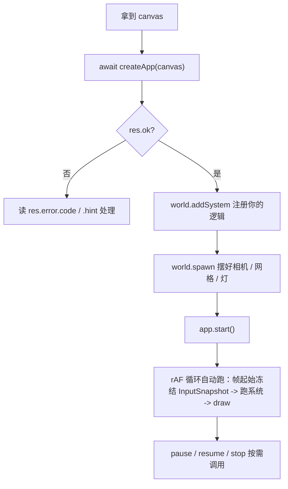

# forgeax-engine-app

> 基线: [`5c8c90f1`](../../commit/5c8c90f1) (2026-06-03) · 同步至: [`358592eb`](../../commit/358592eb) (2026-06-09)

> 把"一块 canvas"变成"一个在跑的游戏"。引导 + 主循环 + 输入 + 动画/物理接线，四件事一个 skill。聚合 `@forgeax/engine-app` · `@forgeax/engine-input` · `@forgeax/engine-runtime`（引导面）。

## 心智模型

两个引导入口：

| 入口 | 给你 | 谁驱动循环 |
|:--|:--|:--|
| `createApp(canvas, opts?, bundler?)` | `App`——rAF 循环 / dt 钳制 / 输入 attach / 错误 fan-out 已接好 | 引擎 |
| `createRenderer(canvas, opts?, bundler?)` | `Renderer`——只渲染 | 你自己拿 rAF 调 `draw(world)` |

绝大多数游戏从 `createApp` 起步。`App` 是状态机：`start → (pause ⇄ resume) → stop`。输入不轮询——引擎在**帧起始**冻结成只读 `InputSnapshot` 资源，系统在 `world` 里读它。

参数面分三层：`canvas`（必选）/ `opts?: CreateAppOptions`（app 行为：`input` / `audio` / `physics` / `maxDt`）/ `bundler?: BundlerOptions`（构建层：`shaderManifestUrl` + `importTransport`）。`clearColor` 不在参数里——已搬到 `Camera.clearR/G/B/A`：渲染表现归 `Camera`，构建通道归 `bundler`，app 行为归 `opts`，三关注面分离。

## 核心 API 速查

| 入口 | 形态 | 用途 |
|:--|:--|:--|
| `createApp(canvas, opts?, bundler?)` | `async => Result<App, CanvasAppError>` | 一行起飞：自动装配 Renderer + World + input + rAF 循环。第三参数 `bundler` 携带构建层注入（`shaderManifestUrl` + `importTransport`），典型传 `forgeaxBundlerAdapter()` |
| `createApp({ renderer, world, input?, audio?, physics?, ... })` | `async => Result<App, AssembleAppError>` | assemble 形态：显式注入已有 Renderer / World（参见 `packages/app/README.md` §Assemble form） |
| `createRenderer(canvas, opts?, bundler?)` | `async => Renderer` | 低层：只要渲染器，自己驱动循环（失败 throw `EngineEnvironmentError`） |
| `Engine.create(canvas, opts?, bundler?)` | `createRenderer` 的命名空间别名 | 与 `createRenderer` 同一函数，喜欢 `Engine.create({...})` 写法时用 |
| `forgeaxBundlerAdapter()` | `() => BundlerOptions` | 由 `virtual:forgeax/bundler` 虚拟模块导出，标准第三参数——聚合 `shaderManifestUrl` + `importTransport` |
| `App.start() / stop() / pause() / resume()` | `() => Result<void, AppError>` | 主循环状态机；返回结构化 `Result` |
| `world.getResource<InputSnapshot>(INPUT_SNAPSHOT_RESOURCE_KEY)` | `=> InputSnapshot` | 在系统里取帧起始输入快照（推荐 import 常量 `INPUT_SNAPSHOT_RESOURCE_KEY` 而非裸字符串 `'InputSnapshot'`） |
| `world.insertResource(INPUT_BACKEND_KEY, backend)` | 资源注入 | 插入 `InputBackend` 实例到 World（由 `createApp` 自动完成）；系统 token `InputFrameStartScan` 经 `resources: [INPUT_BACKEND_KEY]` 声明依赖，ParamValidation 校验缺失 |
| `world.insertResource(ANIMATION_ASSET_RESOLVER_KEY, resolver)` | 资源注入 | 插入 `AnimationAssetResolver` 到 World（由 `createApp` 自动完成）；系统 token `AdvanceAnimationPlayer` 经 `resources: [ANIMATION_ASSET_RESOLVER_KEY]` 声明依赖 |
| `world.addSystem(InputFrameStartScan)` | 注册 token | 激活帧起始输入扫描系统（替代已删除的 `createFrameStartScanSystem` 工厂） |
| `world.addSystem(AdvanceAnimationPlayer)` | 注册 token | 激活动画推进系统（替代旧的闭包注册形态） |
| `registerPropagateTransforms(world, opts?)` | 接线函数 | 注册 `PropagateTransforms` token；opts 可选 `beforeSystemName` |
| `registerAdvanceAnimationPlayer(world)` | 接线函数 | 注册 `AdvanceAnimationPlayer` token + `insertResource(ANIMATION_ASSET_RESOLVER_KEY, ...)` |
| `registerPhysicsSystems(world)` | 接线函数 | 注册 3D 物理三系统 token（第二参已删除；系统 fn 内 `resolveComponent('Transform')` 自取组件 token） |
| `registerPhysicsSystems2D(world)` | 接线函数 | 注册 2D 物理三系统 token（同理） |
| `createInputSnapshot()` | `() => InputSnapshot` | headless 测试 / 预启动的空快照（held/edge 全 `false`） |

> [!IMPORTANT]
> `createApp` / `createRenderer` / `Engine.create` 都接受三个位置参数 `(canvas, opts?, bundler?)`。`createApp` 走 `Result`（查 `.ok`），`createRenderer` / `Engine.create` 在拿不到后端时 throw `EngineEnvironmentError`（`try/catch`）。别混。

## 规范调用顺序



## idiom 代码骨架

```ts
import { createApp } from '@forgeax/engine-app';
import { forgeaxBundlerAdapter } from 'virtual:forgeax/bundler';
import { INPUT_SNAPSHOT_RESOURCE_KEY, type InputSnapshot } from '@forgeax/engine-input';
import { defineSystem } from '@forgeax/engine-ecs';
import { Transform } from '@forgeax/engine-runtime';

const res = await createApp(canvas, {}, forgeaxBundlerAdapter());
if (!res.ok) {
  console.error(res.error.code, res.error.hint);
  throw new Error(res.error.code);
}
const app = res.value;
const world = app.world;

// Per-frame clear color 在 Camera 组件上，不在 createApp 参数里
world.spawn(
  new Camera({
    clearR: 0.1, clearG: 0.1, clearB: 0.1, clearA: 1.0,
    // ... projection + transform 字段
  })
);

const MovePlayer = defineSystem({
  name: 'move-player',
  queries: [{ with: [Transform] }],
  fn: (world, queryResults) => {
    const input = world.getResource<InputSnapshot>(INPUT_SNAPSHOT_RESOURCE_KEY);
    const dx = (input.keyboard.down('d') ? 1 : 0) - (input.keyboard.down('a') ? 1 : 0);
    for (const bundle of queryResults[0]) {
      const xs = bundle.Transform.posX;
      for (let i = 0; i < bundle.entityCount; i++) xs[i] = (xs[i] ?? 0) + dx;
    }
  },
});
world.addSystem(MovePlayer);

app.start();   // arms the rAF loop
// app.pause(); app.resume(); app.stop();
```

`InputSnapshot` 表面（4 方法）：`keyboard.down(key)` / `keyboard.up(key)`（上一帧释放的 up-edge）/ `mouse.button(0|1|2)` / `mouse.movementDelta` + `mouse.wheelDelta`。未按下的键返回 `false`，不 throw（charter P3：空信号即信号）。

## 踩坑

- **canvas 起飞失败别吞**：`createApp` 失败回 `Result`，`res.error` 带结构化 `.code` / `.hint`；按属性消费，别 `String(err)` 解析。后端拿不到时是 `createRenderer` throw `EngineEnvironmentError`，不是 `Result`。
- **预启动读 InputSnapshot 全 false 是预期**：`app.start()` 之前 / headless 下，held-key 与 edge 都报 `false` / `0`，不是 bug——空信号本身是信号。
- **`clearColor` 不在 `createApp` 参数里**：已搬到 `Camera` 组件的 `clearR/G/B/A` 字段（`packages/runtime/README.md` §Camera clear color）。零 Camera 场景 fallback 为 `[0,0,0,1]`。
- **`shaderManifestUrl` 不在 `opts` 里**：已搬到第三参数 `BundlerOptions`。零配置场景省略第三参数即可（引擎 fallback `'/shaders/manifest.json'`）；显式注入用 `forgeaxBundlerAdapter()`（`virtual:forgeax/bundler`）。
- **内置网格不需要 `registerWithGuid`**：`cube` / `triangle` / `quad` / `sphere` 四种内置网格的 GUID→handle 映射已在 `AssetRegistry` 构造时预注册（Tier 0, feat-20260604）。手动再 `registerWithGuid` 会抛 GUID 碰撞错误。自定义资产仍需显式注册。
- **渲染 / 循环类症状**（白屏、demo 不动、CI 断言全过却 exit 1）先查 [`forgeax-engine-debug`](../forgeax-engine-debug/SKILL.md) 的症状索引，再回溯引擎层；别在 app 里塞手动 rAF mutation 绕过。
- **`createApp` auto-registers the state-machine plugin**（feat-20260616-engine-state-and-state-scoped-entities）：both canvas and assemble forms call `registerStatesPlugin(world)` internally. State tokens defined with `defineState` at module level have their Resources auto-inserted and the `transitionStates` system auto-registered. Manual `createRenderer` users must call `registerStatesPlugin(world)` themselves before `setNextState`. See [`forgeax-engine-state`](../forgeax-engine-state/SKILL.md).
- **系统 fn 首参是 `world`**：`defineSystem({ fn: (world, queryResults, commands) => {...} })`——旧签名 `(queryResults, commands)` 已废弃。`createApp` 自动接线的 input/anim/physics/state 系统全部已迁到新签名。自定义系统须跟上：形参加 `world`，体内 `world.getResource(KEY)` 取资源，不走闭包捕获。
- **输入接线已资源化**：`createFrameStartScanSystem` 工厂已删除。`createApp` 内部自动 `world.insertResource(INPUT_BACKEND_KEY, backend)` + `world.addSystem(InputFrameStartScan)`。headless/manual 用户：`import { INPUT_BACKEND_KEY, InputFrameStartScan } from '@forgeax/engine-input'` → `world.insertResource(INPUT_BACKEND_KEY, mockBackend)` → `world.addSystem(InputFrameStartScan)`。
- **动画接线已资源化**：`registerAdvanceAnimationPlayer` 内部 `insertResource(ANIMATION_ASSET_RESOLVER_KEY, resolver)` 后 `addSystem(AdvanceAnimationPlayer)`。`AdvanceAnimationPlayer` 是模块顶层 `defineSystem` token，`resources: [ANIMATION_ASSET_RESOLVER_KEY]` 声明依赖——缺失时走 ParamValidation `'invalid'` 路径（不裸 throw）。
- **physics register 第二参已删除**：`registerPhysicsSystems(world)` / `registerPhysicsSystems2D(world)` 不再接受 `transformComponent` 第二参。系统 fn 内 `resolveComponent('Transform')` 自取组件 token。

## Camera.autoAspect 与 aspect-sync sidecar

`Camera.autoAspect`（默认 `true`）让引擎自动跟随画布尺寸调整宽高比——你只负责 resize canvas，aspect 引擎搞定。

- **`CreateAppOpts` 不提供**：`autoAspect` 在 `Camera` 组件上，不是 createApp 参数
- **默认即对（charter P1）**：`perspective()` 工厂不传 `autoAspect` → 默认 `true`，现有 demo 零改动自然启用
- **opt-out**：`perspective({ autoAspect: false })` 一步关闭——用于 render-to-texture / 分屏相机，由宿主自行驱动 aspect
- **仅 createApp 路径**：aspect-sync sidecar 只在 `createApp(canvas)` 内注册；`createRenderer` / assemble 形态不获此行为（host↔engine 契约 clause #3）

sidecar 每帧做：
1. 读 `canvas.width / canvas.height`，尺寸为 0（detached / `display:none`）静默跳过，aspect 不变为 NaN
2. 遍历所有 `Camera` 实体：只写 `autoAspect === true` 且 `projection === perspective` 的相机
3. 通过 `world.get` 读 `autoAspect` bool 列（readRow 窄化为 JS boolean），非 query-bundle 路径

> [!NOTE]
> host↔engine 契约 SSOT：`docs/how-to/2026-06-18-host-engine-contract.md`——6 接触面归属表、createApp vs createRenderer 两路径差异、9 条范围外边界条款、3 项标准样板代码。引擎技能只放指针，不复制正文。

## 视频过场：pause → overlay → resume（worked example）

`apps/hello/video-cutscene/` 演示如何用 `app.pause()` / `app.resume()` 驱动视频过场，全程零引擎 video 代码——`<video>` DOM overlay 由宿主管理，引擎只提供暂停/恢复能力。

```text
app.pause() → 引擎冻结（渲染继续，模拟不动）
  ↓ video overlay 出现（DOM CSS，引擎不知其存在）
  ↓ video.play() → video.onended
  ↓ overlay display:none
  ↓ app.resume() → 引擎恢复（dt 基线重置，首帧 dt ≤ 16ms）
app.stop() → 宿主同时在 DOM 清除 overlay
```

- **dt 基线重置**：`app.resume()` 后首帧 dt 不膨胀（frame-loop 内部已 onResume 时 flush lastTick）
- **幂等 pause**：已暂停再 `pause()` 无副作用（状态机 guard）
- **overlay 清理归宿主**：`app.stop()` 时引擎不碰 DOM——demo 内部自己清理 overlay

参见 `apps/hello/video-cutscene/src/main.ts`（≤ 200 LoC，完整端到端示例）。

## Renderer health / recover

Renderer 提供三个健康面动词：`health()` 拉取当前快照，`onHealthChange(cb)` 推送健康变化，`recover()` 显式触发恢复。S3 阶段为骨架——`recover()` 占位返回错误，自愈逻辑落地 S5。

### 三动词速查

| 动词 | 形态 | 用途 |
|:--|:--|:--|
| `renderer.health()` | `() => HealthSnapshot` | 拉取当前健康快照：`reason`（降级态判别元）+ `detail?`（per-reason 窄化）+ `recoverable`（是否可尝试恢复） |
| `renderer.recover()` | `() => Result<void, RecoverError>` | 命令式触发恢复；S3 阶段两态均返回 `Result.err`（绝不静默成功） |
| `renderer.onHealthChange(cb)` | `(cb: HealthChangeListener) => () => void` | 推送式订阅：low-frequency 事件，推优先于轮询；返回 unsubscribe |

`recover()` 直接调用，不需自己开关——先 `health()` 查 `recoverable`，`true` 再调；`false` 时 `recover()` 自身也返回 `'recover-not-needed'`，额外一层安全网。

### HealthReason closed union（3 成员）

```ts
type HealthReason = 'alive' | 'device-lost' | 'internal-fault';
```

| reason | 含义 | recoverable |
|:--|:--|:--|
| `'alive'` | 健康基线（registry 未 fire） | `false` |
| `'device-lost'` | device 丢失已检测到 | `true` |
| `'internal-fault'` | 内部渲染器故障 | `false` |

AI 用户消费走 `switch (snap.reason)` 穷举，TS 守完整性：

```ts
const snap = renderer.health();
switch (snap.reason) {
  case 'alive':
    // snap has no detail field in this branch
    break;
  case 'device-lost':
    // TS narrows snap.detail to HealthDetailDeviceLost
    console.warn(`Device lost (${snap.detail.lostReason}): ${snap.detail.message}`);
    break;
  case 'internal-fault':
    // TS narrows snap.detail to HealthDetailInternalFault
    console.warn(`Internal fault: ${snap.detail.message}`);
    break;
}
```

### RecoverError closed union（2 成员）

```ts
type RecoverErrorCode = 'recover-not-needed' | 'recover-not-implemented';
```

| code | 触发 | .hint |
|:--|:--|:--|
| `'recover-not-needed'` | 健康态调 `recover()` | "call health() first to confirm degraded state before calling recover()" |
| `'recover-not-implemented'` | 降级态调 `recover()`（S3 占位） | "self-heal recovery lands in S5; health().reason still reflects the degraded state" |

消费走 `switch (err.code)` 穷举，无 `default`：

```ts
const res = renderer.recover();
if (!res.ok) {
  switch (res.error.code) {
    case 'recover-not-needed':
      // 健康态，无需恢复
      break;
    case 'recover-not-implemented':
      // 降级态但 S3 未实现自愈；health().reason 不变
      console.warn('Recovery not yet implemented; health unchanged.');
      break;
  }
}
```

### HealthSnapshot 形状

```ts
type HealthSnapshot =
  | { readonly reason: 'alive'; readonly recoverable: boolean }
  | { readonly reason: 'device-lost'; readonly detail: HealthDetailDeviceLost; readonly recoverable: boolean }
  | { readonly reason: 'internal-fault'; readonly detail: HealthDetailInternalFault; readonly recoverable: boolean };
```

`HealthSnapshot` 是按 `reason` 判别的 discriminated union——`switch(snap.reason)` case 内 `snap.detail` 自动窄化为该 reason 专属类型，无需 `as`。`alive` 分支无 `detail` 字段；降级 reason 下 `detail` 必填。

### onHealthChange 语义

- **late-attach replay**：health 已变化（已 fire）后才注册的回调，注册时立即以当前快照 replay 一次
- **unsubscribe**：`onHealthChange` 返回 unsubscribe 函数，调用后该 cb 不再收到变化
- **listener-throw 隔离**：一个回调抛异常不影响其他回调，不影响 fire 流程
- **replay 与 onLost/onError 关系**：三信道独立——`onLost` 是终端事件，`onError` 是逐 draw 事件流，`onHealthChange` 是健康态变化这一降维聚合面

### 典范用法

```ts
// 监控 device-lost：推式订阅 + 尝试恢复
renderer.onHealthChange((snap) => {
  if (snap.reason === 'device-lost') {
    console.warn('Renderer degraded:', snap.detail.message);
    if (snap.recoverable) {
      const res = renderer.recover();
      if (!res.ok && res.error.code === 'recover-not-implemented') {
        // S3 占位：降级态仍持续
        console.warn('Auto-recovery waits for S5. User may reload.');
      }
    }
  }
});

// 帧尾拉取：UI 提示 / 日志
const snap = renderer.health();
if (snap.reason !== 'alive') {
  showDegradationBanner(snap.reason);
}
```

## 深入

- 引导 / 主循环状态机 / AppError 5 成员 / onError fan-out / 资源化接线：见 `packages/app/README.md` §One-screen takeoff · §AppError 5-member closed union · §onError multi-listener；源码 SSOT `packages/app/src/create-app.ts` + `packages/app/src/errors.ts`
- 低层渲染器 / `Renderer.draw` / `Renderer.ready` 屏障：见 `packages/runtime/README.md` §API 索引；源码 `packages/runtime/src/createRenderer.ts`
- 输入 4 步 recipe / 形态铁律 / PointerLock 后端 / `InputFrameStartScan` token + `INPUT_BACKEND_KEY` 资源化接线：见 `packages/input/README.md` §4 步 recipe · §4 方法表面；源码 `packages/input/src/input-snapshot.ts` + `packages/input/src/frame-start-scan-system.ts`
- 蒙皮 / 动画 4 步 recipe（`createApp` + `configurePackIndex` + `loadByGuid<SceneAsset>` + 多实例 instantiate + 每实例独立 `AnimationPlayer`）+ `AdvanceAnimationPlayer` token + `ANIMATION_ASSET_RESOLVER_KEY` 资源化接线：参考 `apps/hello/skin/src/main.ts`；底层 SkinAsset / SkeletonAsset / AnimationClip POD 由 gltfImporter 自动 emit，bridge 自动挂 `Skin` 组件；多实例关节隔离由 postSpawnResolveJoints 子树作用域兜底；源码 `packages/runtime/src/systems/advance-animation-player.ts`
- 物理 3D/2D 接线（`registerPhysicsSystems(world)` / `registerPhysicsSystems2D(world)`，第二参已删除）：源码 `packages/physics-rapier3d/src/rapier-physics-world-3d.ts` + `packages/physics-rapier2d/src/rapier-physics-world-2d.ts`

## AnimationPlayer：N-way SoA 槽位 + 用户每帧驱权重

> [!IMPORTANT]
> AnimationPlayer 是 **schema-as-state** 组件：6 字段、4 槽并行、零 helper 方法。所有播放控制（硬切 / 交叉淡化 / 同重多 clip）都靠 `world.set(entity, AnimationPlayer, { ... })` 写字段达成；引擎不烤曲线、不自动归零、不维护播放栈——**由用户在游戏循环里每帧驱动 weights[i]**。

### 6 字段 schema（SoA inline arrays，arity=4）

| 字段 | 类型 | 默认 | 含义 |
|:--|:--|:--|:--|
| `clips` | `array<handle<AnimationClip>, 4>` | 全 0（4 槽全 invalid） | 每槽指向一条 AnimationClip；handle id=0 = invalid，**该槽被引擎跳过**（不解析、不调 resolver、不 warn） |
| `times` | `array<f32, 4>` | 全 0 | 每槽的当前播放时刻（秒），引擎按 `times[i] += dt * speeds[i]` 推进 |
| `weights` | `array<f32, 4>` | 全 0 | 每槽的混合权重；引擎做 `Σ(w_i · sample_i) / Σ(w_i)` 加权归一化（per-channel）；w<0 入口 clamp 但不写回 |
| `speeds` | `array<f32, 4>` | 全 0 | 每槽播放速度倍率；**spawn 时不显式填则槽不推进**——这是 §约定，不是 bug |
| `paused` | `bool` | `false` | 整组件暂停；`true` 时不推进 `times` 也不写 Transform |
| `looping` | `bool` | `true` | 沿 clip duration 取模；`false` 时超过 duration 后 `times[i]` 钳在 duration |

> 物理形态由 `defineComponent` SSOT 约束（`packages/runtime/src/components/animation-player.ts`）：`clips` 以 `Uint32Array(4)` 列，`times/weights/speeds` 以 `Float32Array(4)` 列。读组件用 `world.get(ent, AnimationPlayer)` 拿到的就是这五条 typed array + 两个 bool 的 column view。

### invalid handle (id=0) 跳过语义

| 行为 | 详细 |
|:--|:--|
| spawn 默认 = 全 invalid | 不传 `clips` 字段时 4 槽 handle 全为 0；`advanceAnimationPlayer` 每帧早返（无任何 `world.set Transform` 写）——**这是合理静态体**，不是错误 |
| 单槽硬切 | `clips=[h, 0, 0, 0]`、`weights=[1, 0, 0, 0]`：仅槽 0 生效，等价旧 single-clip 路径 |
| 槽 i invalid 但 `weights[i] > 0` | 引擎跳过该槽采样，权重也不计入归一化分母——视觉等价 weights[i]=0 |
| `speeds[i]` 默认 0 | spawn 不传 `speeds` 则即使 clips 有效也 `times` 不推进；用户责任：spawn 时与 clips 同步显式写 `speeds: new Float32Array([1,1,1,1])` |

### Spawn-then-update 范式

**硬切单 clip（按键 1/2/3 风格）**：

```ts
// 在 world.addSystem 内每帧（或 press-edge 触发）
world.set(playerEnt, AnimationPlayer, {
  clips:   [walkH, 0 as ClipHandle, 0 as ClipHandle, 0 as ClipHandle],
  times:   new Float32Array([0, 0, 0, 0]),
  weights: new Float32Array([1, 0, 0, 0]),
});
```

**交叉淡化（按键 4 风格 — 0.3s Walk → Run 线性 crossfade）**：

```ts
// 按下 4 时记录 startTime，预填 clips
let crossfadeStart: number | null = null;
const FADE = 0.3;

// press-edge：
crossfadeStart = performance.now() / 1000;
world.set(playerEnt, AnimationPlayer, {
  clips:   [walkH, runH, 0 as ClipHandle, 0 as ClipHandle],
  times:   new Float32Array([0, 0, 0, 0]),
  weights: new Float32Array([1, 0, 0, 0]),
});

// 每帧（在 driver 系统里）：
if (crossfadeStart !== null) {
  const t = Math.min(1, (performance.now() / 1000 - crossfadeStart) / FADE);
  world.set(playerEnt, AnimationPlayer, {
    weights: new Float32Array([1 - t, t, 0, 0]),
  });
  if (t >= 1) crossfadeStart = null;
}
```

**3-way 同重稳态（按键 5 风格）**：

```ts
const third = 1 / 3;
world.set(playerEnt, AnimationPlayer, {
  clips:   [surveyH, walkH, runH, 0 as ClipHandle],
  times:   new Float32Array([0, 0, 0, 0]),
  weights: new Float32Array([third, third, third, 0]),
});
// 一次写入即稳态——引擎每帧自动推 times、加权混合，无需后续 update
```

**活范例**：`apps/hello/skin/src/main.ts` —— 五条按键路径（1/2/3 硬切 + 4 crossfade + 5 3-way + Space pause）端到端覆盖；按系统名一眼分辨：`skin-clip-toggle` = 硬切，`skin-blend-driver` = 软切。

### 引擎边界（用户责任清单）

| 引擎 **不**做 | 用户 **必须**做 |
|:--|:--|
| 不烤曲线 / 不缓存采样结果——每帧重采样 clip channel | 每帧或 press-edge 写 `weights[i]` 跑业务循环（淡化 / 切换） |
| 不自动归零 weights——结束 crossfade 后引擎不会把过渡槽 weight 自动收回 0 | crossfade 结束时显式写 `weights=[0,1,0,0]`（settle）或 `weights=[1,0,0,0]`（回硬切） |
| 不推 paused 期间的 times | 用户切 `paused: true / false` 控制；paused 期间 weights 修改也不立即生效 |
| 不维护"上次播放的 clip 栈"——状态全在 `clips/times/weights/speeds` 里 | 自己保留语义上的 `currentMode` / `prevClip`（demo 在闭包 `let currentMode` 落地） |
| 不分配新累加器 / 不 emit per-channel `world.set Transform` | 引擎按 entity 单次 `world.set(jointEnt, Transform, fullPose)`，N 个 channel 不再放大写次数 |

### 深入

- 6 字段 schema 全表 + 默认值规则：`packages/runtime/src/components/animation-player.ts`（SSOT）
- 两阶段管线（queryRun → 累加器 → 单次 `world.set`）+ per-channel 加权归一化数学：`packages/runtime/src/systems/advance-animation-player.ts` + 单测 `packages/runtime/src/__tests__/systems.unit.test.ts`
- dev-mode warn 节流形态（once-per-(entity, channelKey, reason)，导出 `__resetAnimationWarnsForTests` `@internal`）：源码同上文件顶部 + 单测 anchor `'warn-throttle once-per-(entity,channelKey,reason)'`
