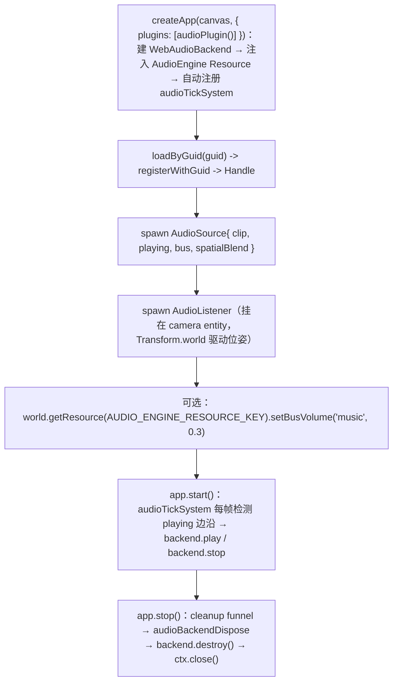

# forgeax-engine-audio

> **音频 = 给 entity 挂 `AudioSource`，把 `playing` 从 false 翻到 true 就出声**。`@forgeax/engine-audio` 是**接口层**：定义 ECS 组件（`AudioSource` / `AudioListener`）、`AudioBackend` 协议、固定两段 bus 拓扑（`sfx` + `music` -> Master）、`AudioError` 族。实现是 `@forgeax/engine-audio-webaudio`（Web Audio API 浏览器后端：AudioContext 生命周期 + bus 拓扑 + tick 系统 + clip loader）。开音频只需 `createApp(canvas, { plugins: [audioPlugin()] })`——`audioPlugin`（来自 `@forgeax/engine-audio-webaudio`）建一个 `WebAudioBackend` 并注册为 `AudioEngine` World Resource，**并自动注册 `audioTickSystem` + listener sync 系统（ECS addSystem, after propagateTransforms）**。声明式 SFX（给 `AudioSource` 写 `playing: true`）自动发声，3D 空间音 listener pose 自动同步（无需手动 `Update schedule registration`），`app.stop()` 自动回收音频后端（经 cleanup funnel 的 `audioBackendDispose` 回调触发 `WebAudioEngine.destroy()`，关闭 AudioContext）。3D 空间音靠 `AudioSource.spatialBlend: 1` + 一个 `AudioListener`（其 `Transform.world` 世界矩阵每帧驱动 Web Audio 监听者位姿）。聚合 `@forgeax/engine-audio`（接口）+ `@forgeax/engine-audio-webaudio`（后端）。

## 心智模型

三层渐进式（charter P1）：

1. **立即播放**：spawn 一个 `AudioSource`，`playing: true`。`playing` 是**边沿检测**——false->true 起播，true->false 停。`createApp({ plugins: [audioPlugin()] })` 自动注册 `audioTickSystem`，AI 用户无需手动 `Update schedule registration(audioTickSystem)`。
2. **混音**：经 `AudioEngine` Resource（即注入的 `AudioBackend`）调 `setBusVolume` / `setBusMute`，作用于 `sfx` / `music` 两条固定 bus。
3. **3D 空间音**：`AudioSource.spatialBlend: 1`（PannerNode）+ 给监听 entity 挂 `AudioListener` 标记组件。World 里**只有第一个** `AudioListener` entity 被每帧同步，sync 系统读它的 `Transform.world` mat4（16 float 列主序）驱动 Web Audio listener 位姿。`createApp({ plugins: [audioPlugin()] })` 自动注册此系统（ECS addSystem, after propagateTransforms——与 audioTickSystem 的 Update schedule registration seam 不同，因 listener sync 须读当帧 `Transform.world`）。
4. **自动回收**：`app.stop()` 经 cleanup funnel 的 `audioBackendDispose` 回调（仅 `reason === 'stop'` 触发）→ `WebAudioEngine.destroy()` → 停所有源 + 断开 bus 拓扑 + 关闭 AudioContext。非 loop 源播完经 `node.onended` 自卸（节点身份比对守卫防止竞态错杀）。`getActiveSourceCount()` 用于长会话后自检资源是否泄漏。

`AudioBackend` 是协议接口，`createApp({ plugins: [audioPlugin()] })` 注入 `WebAudioBackend` 实现并存为 `AudioEngine` Resource（key 常量 `AUDIO_ENGINE_RESOURCE_KEY`）。clip 经资产系统 `loadByGuid` / `registerWithGuid` 拿到 `Handle<'AudioClipAsset','unmanaged'>` 再装到 `AudioSource.clip`。

## 核心 API / 组件速查

| 名字 | 来源包 | 形态 | 用途 |
|:--|:--|:--|:--|
| `AudioSource` | audio | 组件（6 字段） | `clip` / `playing`(边沿) / `loop` / `volume` / `spatialBlend` / `bus` |
| `AudioListener` | audio | 组件（marker） | 挂在监听 entity；其 `Transform.world` 驱动 listener 位姿；只第一个生效 |
| `AudioBackend` | audio | 协议接口 | `setVolume` / `setBusVolume` / `setBusMute` / `getState` / `getActiveSourceCount` / `destroy` |
| `AUDIO_ENGINE_RESOURCE_KEY` | audio | 常量（`'AudioEngine'`） | 取 backend Resource 的 key |
| `BusName` | audio | `'sfx' \| 'music'` | 固定两段 bus 名 |
| `AudioClipAsset` | audio（types SSOT） | POD | 音频 clip 资产；`loadByGuid<AudioClipAsset>` 取 |
| `WebAudioEngine` / `createWebAudioBackend` | audio-webaudio | class / fn | Web Audio 后端实现（`createApp` 内部建） |
| `getActiveSourceCount()` | audio-webaudio | method（on `AudioBackend`） | 返回当前活跃源数；长会话后趋近 0 则无泄漏 |
| `AudioErrorCode` | audio（types SSOT） | 闭集 union（勿抄） | 结构化失败码 |

> [!IMPORTANT]
> `playing` 是**边沿触发**不是电平——要重播一次性音必须先写回 false 再翻 true（re-arm）。`AudioListener` 是无字段 marker，靠它所在 entity 的 `Transform.world` 取位姿（不要找 `GlobalTransform`，已删）。`AudioErrorCode` 全集 + `.code/.expected/.hint/.detail` 结构见 `packages/audio/README.md` §Error model + `packages/types/src/index.ts`，**勿抄**。

## 规范调用顺序



## idiom 代码骨架

```ts
import { createApp } from '@forgeax/engine-app';
import { AUDIO_ENGINE_RESOURCE_KEY, AudioListener, AudioSource } from '@forgeax/engine-audio';
import type { AudioBackend, AudioClipAsset } from '@forgeax/engine-audio';
import { audioPlugin } from '@forgeax/engine-audio-webaudio';
import { HANDLE_CUBE } from '@forgeax/engine-assets-runtime';
import { Update } from '@forgeax/engine-ecs';
import { Camera, MeshFilter, MeshRenderer, Transform } from '@forgeax/engine-runtime';

// createApp({ plugins: [audioPlugin()] }) auto-registers audioTickSystem —
// no manual Update schedule registration(audioTickSystem) needed.
const app = await createApp(canvas, { plugins: [audioPlugin()] });
const world = app.world;
const assets = app.renderer.assets;
if (assets === null) throw new Error('backend not initialized');

// 1) load a clip by GUID -> Handle (async, Result)
const clipRes = await assets.loadByGuid<AudioClipAsset>(bgmGuid);
if (!clipRes.ok) throw new Error(clipRes.error.code);

// 2) spawn an emitter; playing:false->true edge starts playback
//    (edge detected by the auto-registered audioTickSystem)
world
  .spawn(
    { component: Transform, data: { pos: [0, 0, 0] } },
    { component: MeshFilter, data: { assetHandle: HANDLE_CUBE } },
    { component: MeshRenderer, data: {} },
    { component: AudioSource, data: { clip: clipRes.value, playing: true, loop: true, volume: 0.8, bus: 'music' } },
  )
  .unwrap();

// 3) listener on the camera entity (its Transform.world drives listener pose)
world.spawn(
  { component: Transform, data: {} },
  { component: Camera, data: {} },
  { component: AudioListener, data: {} },
);

// 4) bus mix via the AudioEngine Resource
const audioBackend = world.getResource<AudioBackend>(AUDIO_ENGINE_RESOURCE_KEY);
audioBackend.setBusVolume('music', 0.3);

app.start();

// 5) on teardown: app.stop() auto-reclaims audio backend via cleanup funnel
//    (stop all sources -> disconnect bus -> ctx.close())
// app.stop();
```

## 踩坑

- **`playing: true` 但没声**：(a) `playing` 是边沿——若一开始就 true 且从未翻过 false 可能错过沿；一次性音需 re-arm（true->false->true）。(b) AudioContext 被浏览器 suspend，必须在用户手势（click/keydown）后才能 resume（错误码 `context-suspended`）。
- **3D 音不空间化**：`spatialBlend` 默认 0（2D，直连 bus）；要 PannerNode 空间化必须设 1，且 World 里要有 `AudioListener`。
- **多个 `AudioListener` 只有一个生效**：sync 系统只同步 World 中第一个 `AudioListener` entity 的 `Transform.world`。
- **bus 名写错**：只有 `'sfx'` / `'music'` 两条（固定拓扑，不支持自定义 bus），越界报 `bus-not-found`。
- **clip handle 悬空**：把 GUID 字符串直接塞 `clip` 而非 `loadByGuid` 解析后的 `Handle`，报 `invalid-clip-handle`。资产链路见 [`forgeax-engine-assets`](../forgeax-engine-assets/SKILL.md)。
- **`app.stop()` 自动回收音频后端（canvas 形态）**：`app.stop()` 经 cleanup funnel 的 `audioBackendDispose` 回调 → `WebAudioEngine.destroy()`（停所有活跃源 → 断开 bus 拓扑 → 移除手势监听器 → `ctx.close()` 关闭 AudioContext）。funnel `invoked` latch + `destroy()` 内 `ctx === undefined` 短路构成**双保险**——多次 `app.stop()` 安全（仅第一次真正执行 `ctx.close()`）。assemble 形态不自动回收（宿主自管 backend 生命周期，见下节）。
- **`getActiveSourceCount()` 自检资源泄漏**：长会话后调 `backend.getActiveSourceCount()` 应趋近 0（非 loop 源播完后经 `node.onended` 自卸）。loop 源持续驻留 `sources` Map，不计入泄漏。`backend.getState().contextState === 'closed'` 确认 `destroy()` 已生效。
- **同 entityId 快速替换安全**：连按播放键触发同 entity 的 `play()` 替换（先 `stop()` 旧源再 `set` 新源）。旧源 `onended` 异步触发时，节点身份比对守卫（`sources.get(entityId)?.node === oldNode`）检测到已指向新源，no-op —— 新源不会被错杀。
- **一次性 SFX 播完自动释放**：非 loop 源 `play()` 时挂 `node.onended` 回调（`web-audio-engine.ts:207-214`），播完后自动从 `sources` Map 移除，不增 size。loop 源不挂 `onended`（永不自然结束），需显式 `stop()` 或整个 backend `destroy()`。

## 深入

- 3-symbol core surface / 最小 BGM 播放 / bus 控制示例：见 `packages/audio/README.md` §Minimal BGM playback / §Bus control via AudioEngine Resource
- `AudioSource` 6 字段 / `AudioListener` marker schema：见 `packages/audio/README.md` §ECS component schema
- `AudioBackend` 协议（`setVolume` / `setBusVolume` / `setBusMute` / `getState` / `getActiveSourceCount` / `destroy`）：源码 `packages/audio/src/audio-backend.ts`
- Web Audio 后端实现（AudioContext 生命周期 / bus 拓扑 / tick 状态实例字段 / F25 去单例化）：源码 `packages/audio-webaudio/src/web-audio-engine.ts`（`_tickStates` / `_prevFrameEntities` 是 `WebAudioEngine` 实例字段，非模块级单例；同包 `audioTickSystem` 窄化到具体类读这两个字段）
- tick 系统（playing 边沿检测 / despawn 清理 / F24 非 loop 源 onended 自卸）：源码 `packages/audio-webaudio/src/audio-tick-system.ts`
- cleanup funnel audio 回收腿（`audioBackendDispose` 回调 / 仅 `reason === 'stop'` 触发 / 与 `rendererDispose` 同形并列）：源码 `packages/app/src/internal/cleanup.ts:90,137-143`
- 自动注册接线——audioTickSystem（`Update schedule registration` FIFO seam，无帧序约束） + audioListenerSync（`addSystem` ECS DAG seam，`after: [PROPAGATE_TRANSFORMS_SYSTEM]`，须读当帧 `Transform.world` 故必须排在 propagateTransforms 之后）：源码 `packages/app/src/create-app.ts:903-916`（tick） + `:503-544`（listener sync）
- 监听者世界矩阵同步（`Transform.world` mat4 -> Web Audio listener）：源码 `packages/audio-webaudio/src/audio-listener-sync-system.ts`
- `AudioErrorCode` 闭集 + 结构化失败（**勿抄**）：`packages/audio/README.md` §Error model + `packages/types/src/index.ts`
- `createApp` 音频 auto-attach 入口：源码 `packages/app/src/create-app.ts`；app 引导见 [`forgeax-engine-app`](../forgeax-engine-app/SKILL.md)
- clip 经资产系统 `loadByGuid` / `registerWithGuid`：见 [`forgeax-engine-assets`](../forgeax-engine-assets/SKILL.md)

## 回收链路与边界情况

### 回收链路（canvas 形态）

`app.stop()` 触发 → cleanup funnel → `audioBackendDispose()` → `WebAudioEngine.destroy()` 六步：

| 步骤 | 动作 | 源码 |
|:--|:--|:--|
| 1 | 停所有活跃源（遍历 `sources.keys()` 调 `stop(eid)`，复用幂等 `stop`） | `web-audio-engine.ts:291-293` |
| 2 | 断开 bus 拓扑（sfxGain / musicGain / masterGain 各 `disconnect()` + 置 undefined） | `web-audio-engine.ts:296-308` |
| 3 | 移除手势监听器（click / keydown / touchstart `removeEventListener`） | `web-audio-engine.ts:310` |
| 4 | **`ctx.close()`**（不可逆，释放系统音频资源）| `web-audio-engine.ts:313-316` |
| 5 | 置 `closed = true`（`getState()` 直接返回 `contextState: 'closed'`） | `web-audio-engine.ts:317` |
| 6 | tick 状态随实例 GC（`_tickStates` / `_prevFrameEntities` 是实例字段，无模块级残留） | `web-audio-engine.ts:62-64` |

**幂等保证**：cleanup funnel 有 `invoked` latch（`cleanup.ts:109,114-120`），重入直接 no-op；`destroy()` 内部 `ctx === undefined` 短路使 `close()` 不会二次调用。两次 `app.stop()` 安全。

### 边界情况

| 场景 | 行为 | 设计锚点 |
|:--|:--|:--|
| **device-lost** | `audioBackendDispose` **不触发**。AudioContext 不依赖 GPU device，音频在 device-lost 后仍可用。| OOS-2（对齐 `rendererDispose` 仅 `reason === 'stop'` 语义） |
| **assemble 形态** | 宿主先 `world.insertResource(AUDIO_ENGINE_RESOURCE_KEY, hostBackend)` 再 `createApp({ renderer, world, plugins: [audioPlugin()] })`；不传 `audioBackendDispose` —— 宿主自管 backend 生命周期（创建与销毁都在宿主手中）。listener sync 系统需宿主**手动注册**（`world.addSystem(Update, { name: 'audio-listener-sync', after: [PROPAGATE_TRANSFORMS_SYSTEM], ... })`——与 audioTickSystem 的 `Update schedule registration` seam 不同，因 listener sync 须读当帧 `Transform.world`）。 | OOS-5（对齐 `inputBackend` assemble 不 auto-cleanup 模式）+ D-7（ECS DAG seam） |
| **多 world 场景** | 每个 `WebAudioEngine` 持有独立 `AudioContext` 和独立 tick 状态（`_tickStates` / `_prevFrameEntities` 是 per-engine 实例字段）。多 world 间后端复用由宿主控制。| F25（去单例化）+ OOS-3（不引入多 world 共享 context API） |
| **`playing` 组件态不同步** | 非 loop 源经 `onended` 自卸后，`AudioSource.playing` 组件态仍为 `true`（ECS 列不自动回写）。本特性只回收 Web Audio 资源，组件态同步留作后续 UX 增强。| OOS-1 |
| **不传 `audioPlugin()`** | 不建 backend、不注册 `audioTickSystem`、不传 `audioBackendDispose`。无音频能力。| AC-12 反向 |