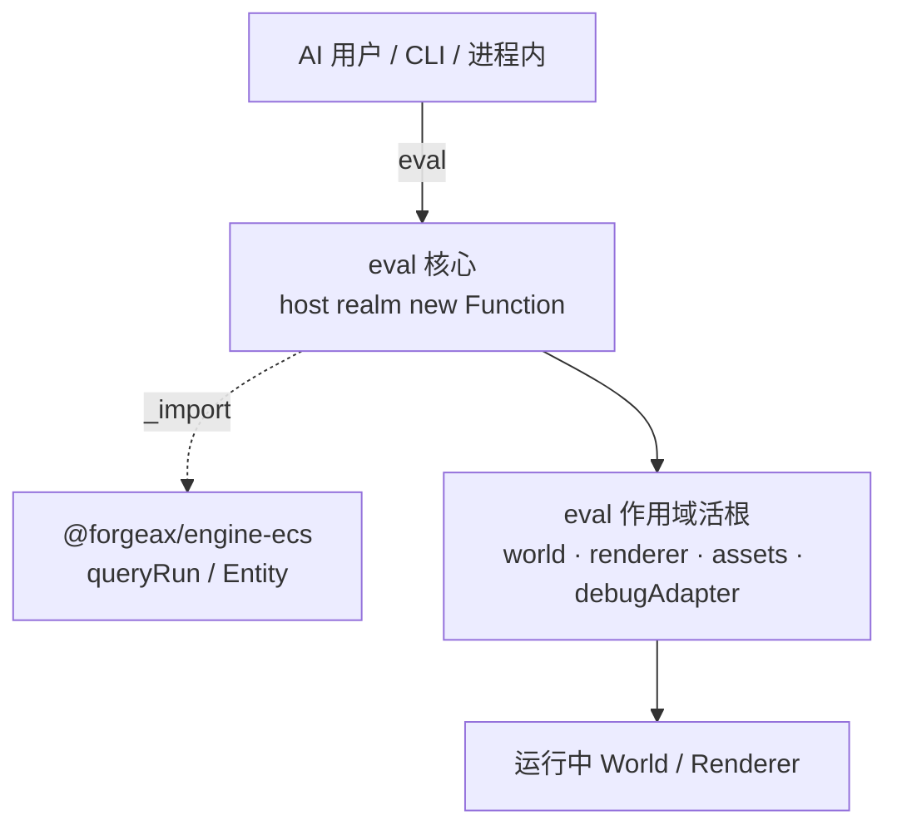

# forgeax-engine-cli

> **唯一能力 = `eval` 活引擎**。`@forgeax/engine-remote` 提供单一入口：把一段 JS 代码发给运行中的引擎实例求值并取回结果。AI 用户不需记 Registry 路由表或预制命令名册——会写 `queryRun` 就能发现 handle、读状态、改值、抓帧。对齐 Bevy BRP / Unreal Remote Control 的"对活实例求值"心智，不暗示 console/inspector（带 UI/devtools）语义。

## 心智模型

`eval(script)` 就是全部。一段脚本被送到 host 进程中的 `new Function` 作用域执行，作用域内注入四个活根：

| 活根 | 类型 | 用途 |
|:--|:--|:--|
| `world` | `World`（来自 `@forgeax/engine-ecs`） | ECS 读写：spawn / despawn / set / queryRun |
| `renderer` | `Renderer` | 渲染器控制：创建/销毁 RT、读 backbuffer |
| `assets` | `AssetRegistry` | 资产查询：loadByGuid / resolveName / rename |
| `debugAdapter` | `DebugRhiAdapter \| undefined` | RHI 帧抓取：`captureFrame({...})` / `inspectAt({...})`。**仅当 createApp 运行在 `FORGEAX_ENGINE_RHI_DEBUG=1` 时注入**，否则 `undefined`（用前先 guard）。world / renderer / assets 三根恒在场。 |

脚本内通过 `_import(specifier)` 按需引入引擎包（如 `const ecs = await _import('@forgeax/engine-ecs')`），拿到 `createQueryState` / `queryRun` / `Entity` 等。`_import` 是 eval 作用域注入的 import 函数——脚本内**无**裸 `import` 关键字。

> [!NOTE]
> **协议层另有一个内建方法 `introspect`**（与 `eval` 并列）：返回 OpenRPC L2 子集文档，列出可用方法（`eval` / `introspect`）+ eval 作用域活根。AI 用户连上后可先 `introspect` 自描述，无需读源码即知能 eval 什么。错误码映射 JSON-RPC -32001..-32006。

**安全模型**：eval 全开（无只读拦截、无能力黑名单）。唯一边界是 host 起不起 server：`createApp` dev 模式默认 wire `app.remote`（WS server 在场）；production 默认不起 server（天然安全）。危险 API（`renderer.dispose()` / `world.despawn`）允许执行，详见末尾 NOTE。

## 传输路径

三条路径统一收束到同一个 `eval(script)` 协议：



| 路径 | 形态 | 适用场景 |
|:--|:--|:--|
| 进程内 client | `app` 获取 `RemoteHandle`，`client.eval(script)` | host 自身做查询/调试（零网络开销） |
| WS JSON-RPC 2.0 | `ws://localhost:5732` 发 `{"method":"eval","params":{"script":"..."}}` | 外部工具 / AI 代理连运行中引擎 |
| CLI plugin bin | `forgeax-engine-remote-{ecs,asset,gltf,font,state}` | 离线/进程外数据工具 |

## 核心 API / bin 速查

| 名字 | 来源 | 形态 | 用途 |
|:--|:--|:--|:--|
| `client.eval(script)` | `@forgeax/engine-remote` | `async (script: string) => Promise<Result<unknown, RemoteError>>` | 对运行中引擎执行一段 JS，取返回值 |
| `RemoteHandle` | `@forgeax/engine-types` | `{ port: number; close(): Promise<void> }` | `app.remote` 的类型；暴露 server 端口与关闭方法 |
| `RemoteError` | `@forgeax/engine-remote` | class extends Error，含 `.code` / `.expected` / `.hint` | 结构化错误，4 成员 `RemoteErrorCode` 闭集 |
| `forgeax-engine-remote-ecs` | ecs | plugin bin | `entities` / `components` / `systems` / `resources` / `world` |
| `forgeax-engine-remote-asset` | pack | plugin bin | `scan` / `lookup` / `verify` / `atlas` |
| `forgeax-engine-remote-gltf` | gltf | plugin bin | `import` |
| `forgeax-engine-remote-font` | font | plugin bin | `bake` |
| `forgeax-engine-remote-state` | state | plugin bin | `list` / `get <name>` |

> [!IMPORTANT]
> CLI plugin bin 是各能力包自带的独立可执行文件，进程外直接调用。`RemoteErrorCode`（4 成员：`script-syntax-error` / `script-runtime-error` / `server-startup-failed` / `server-not-running`）SSOT 见 `packages/types/src/index.ts` + `packages/remote/src/errors.ts`。

## handle 发现配方

eval 内发现 entity handle 的唯一方法是写 `queryRun` 查询——零新 ECS API。**必须用真实 callback 形态**（`queryRun(state, world, (bundle) => { ... })` ——返回 `void`，结果在 `bundle` 参数内拿到）：

```js
// eval 脚本内
const ecs = await _import('@forgeax/engine-ecs');
const state = ecs.createQueryState({ with: [ecs.Entity] });

let handles;
ecs.queryRun(state, world, (bundle) => {
  // bundle.Entity.self 是 Uint32Array，包含所有匹配 entity 的 handle
  handles = Array.from(bundle.Entity.self);
});

// handles 现在是一个 number[]，每个都是 entity handle
```

**带组件的精确查询**：

```js
const ecs = await _import('@forgeax/engine-ecs');
const { createQueryState, queryRun, Entity, Transform, MeshRenderer } = ecs;

const state = createQueryState({ with: [MeshRenderer, Transform, Entity] });
let result = [];
queryRun(state, world, (bundle) => {
  for (let i = 0; i < bundle.Entity.self.length; i++) {
    result.push({
      entity: bundle.Entity.self[i],
      position: [bundle.Transform.position.x[i], bundle.Transform.position.y[i], bundle.Transform.position.z[i]],
    });
  }
});
```

> [!NOTE]
> `Entity` 是 id=0 的 essential 组件，每个 archetype 必带——`bundle.Entity.self` 永远是 `Uint32Array`。引擎自身用此形态做反射，外部 eval 脚本亦然。

## 读写配方

### 读组件值

```js
const ecs = await _import('@forgeax/engine-ecs');
const state = ecs.createQueryState({ with: [ecs.Transform, ecs.Entity] });

ecs.queryRun(state, world, (bundle) => {
  for (let i = 0; i < bundle.Entity.self.length; i++) {
    const h = bundle.Entity.self[i];
    const x = bundle.Transform.position.x[i];
    const y = bundle.Transform.position.y[i];
    const z = bundle.Transform.position.z[i];
    // 使用 h / x / y / z
  }
});
```

### 写组件值 / 生命周期

```js
// spawn——带组件
const h = world.spawn([new Transform({ position: [0, 5, 0] })]);

// set——直接修改已存在实体的组件值
world.set(h, new Transform({ position: [1, 2, 3] }));

// despawn
world.despawn(h);
```

eval 无任何写入拦截——`spawn` / `set` / `despawn` 直接执行，不会返回 `inspector-write-denied`（该错误码已随 sandbox 删除）。危险操作（`renderer.dispose()` 等）见末尾 NOTE。

## debugAdapter 帧抓取

eval 内通过第 4 活根 `debugAdapter` 做 RHI 帧抓取：

```js
// 抓取当前帧的稳态 tape（结构化 draw-call 数据）
const tape = await debugAdapter.captureFrame({ label: 'my-snapshot' });
// tape.frameModel 是结构化 FrameModel（与 RHI debug viewer / CLI summary 同一 SSOT）

// per-draw inspect
const draw = await debugAdapter.inspectAt({ tape, drawIdx: 3 });
// draw.pipelineState / draw.bindings / draw.renderTargetPNG
```

离线子命令（`inspect-offline` / `summary` / `trigger-browser`）是纯本地工具，不连 WS，不受 eval 收编影响。详见 [`forgeax-engine-rhi-debug`](../forgeax-engine-rhi-debug/SKILL.md)。

## createApp 默认在场

`createApp` dev 模式默认起 remote server，消隐"没 wire 等于没有"黑洞：

```ts
import { createApp } from '@forgeax/engine-app';

const app = await createApp({ canvas });

// dev 模式：app.remote 非 undefined，port > 0
if (app.remote) {
  console.log('remote eval server on port', app.remote.port);
  // 进程内直接 client.eval(...)
  // 或外部工具连 ws://localhost:<port>
}

// production 模式：app.remote 为 undefined（server 不启，天然安全）
```

`RemoteHandle` 类型（`{ port: number; close(): Promise<void> }`）定义在 `@forgeax/engine-types`，host 类型面不静态引 `@forgeax/engine-remote`。

## RemoteErrorCode 闭集（4 成员）

```mermaid
stateDiagram-v2
    direction LR
    script-syntax-error: 脚本语法错
    script-runtime-error: 脚本运行期抛错
    server-startup-failed: server 起不来（端口被占等）
    server-not-running: server 未运行（客户端尝试连接但 host 未起）
```

| code | JSON-RPC 段位 | `.expected` | `.hint` |
|:--|:--|:--|:--|
| `script-syntax-error` | -32001 | `'script body is valid JavaScript'` | `'check syntax position in errMessage; fix and resubmit'` |
| `script-runtime-error` | -32002 | `'script executes without throwing'` | `'inspect error; verify symbol availability; eval has full access to world/renderer/assets'` |
| `server-startup-failed` | -32003 | `'server starts successfully on requested port'` | `'check if port is already in use (default 5732); pass different port; or kill existing process holding the port'` |
| `server-not-running` | -32004 | `'server is reachable at ws://localhost:<port>'` | `'start the demo first; verify app.remote is wired; pass --port to override default 5732'` |

消费方式——`switch (err.code)` 穷举 4 成员，无 `default` 分支（TS 严格模式守完整性）：

```ts
import { RemoteError, type RemoteErrorCode } from '@forgeax/engine-remote';

function recover(code: RemoteErrorCode): string {
  switch (code) {
    case 'script-syntax-error':     return 'fix script body syntax and resubmit';
    case 'script-runtime-error':    return 'inspect stack trace; verify symbol availability';
    case 'server-startup-failed':   return 'pick a different port or free port 5732';
    case 'server-not-running':      return 'start demo dev or wire app.remote';
  }
}
```

## CLI plugin bin

plugin bin 是各能力包自带的独立可执行文件，进程外直接调用：

```bash
# ECS 查询
forgeax-engine-remote-ecs entities
forgeax-engine-remote-ecs entities --with Transform,Velocity --without Frozen
forgeax-engine-remote-ecs systems
forgeax-engine-remote-ecs components

# 资产扫描/校验
forgeax-engine-remote-asset scan ./assets
forgeax-engine-remote-asset verify
forgeax-engine-remote-asset lookup <guid>

# glTF 导入
forgeax-engine-remote-gltf import ./model.glb

# 字体烘焙
forgeax-engine-remote-font bake ./font.ttf

# 状态机查询
forgeax-engine-remote-state list
forgeax-engine-remote-state get <tokenName>

# 切端口
forgeax-engine-remote-ecs entities --port 5731
```

## 踩坑

- **eval 内不能用裸 `import`**：脚本作用域不认 `import` 关键字——用注入的 `_import(specifier)` 函数做动态 ESM 引入。`const ecs = await _import('@forgeax/engine-ecs')`。
- **`queryRun` 返回 `void`，结果在回调的 `bundle` 里**：`queryRun(state, world, callback)` 是 **batch-callback 形态**——参数顺序是 `(state, world, callback)`，不是链式 `.Entity.self`。把结果变量声明在回调外、回调内赋值。
- **`app.remote` 为 `undefined`**：`createApp` 仅 dev 模式默认起 server。production / headless / dawn-node（无显式 env opt-in）下 `app.remote` 为 `undefined`。dawn-node 需要时设环境变量 `FORGEAX_REMOTE_SERVER=1`。
- **plugin bin 找不到**：确认 `@forgeax/engine-{ecs,pack,font,gltf,state}` 已安装（`pnpm install`），bin 会自动出现在 `node_modules/.bin/`。

## 深入

- 包定位 / RemoteError 类 / RemoteErrorCode SSOT / 物理隔离 gate：见 `packages/remote/README.md`
- 错误模型源码：`packages/remote/src/errors.ts`
- eval 执行引擎源码：`packages/remote/src/execute.ts`
- server 源码：`packages/remote/src/server.ts`
- `RemoteHandle` / `RemoteErrorCode` / `RemoteError` 类型定义：`packages/types/src/index.ts`
- 5 个 plugin bin 的 owner 包源码：`packages/ecs/src/cli-ecs.ts` / `packages/pack/src/cli-pack.ts` / `packages/font/src/cli-font.ts` / `packages/gltf/src/cli-gltf.ts` / `packages/state/src/cli-state.ts`

## RHI 录帧 CLI（capture-frame / inspect-at / inspect-offline / summary）

> `@forgeax/engine-rhi-debug` 的 `capture-frame` / `inspect-at` 子命令经 `client.eval` 通道（构造 `debugAdapter.captureFrame({...})` 脚本发送），不再走独立 JSON-RPC method。离线子命令 `inspect-offline <tape> <drawIdx>`（自举 dawn-node，per-draw，输出含 `pipelineState`）与 `summary <tape>`（纯函数零 GPU，整帧 `FrameModel`——RHI debug viewer 与 CLI 同一 SSOT）不连 WS。flag 表、输出 schema、症状定位工作流全在 [`forgeax-engine-rhi-debug`](../forgeax-engine-rhi-debug/SKILL.md)（SSOT）。

## forgeax-engine-remote-state plugin bin

> `@forgeax/engine-state` provides a CLI plugin bin for inspecting state machines. Two subcommands, discoverable via the `forgeax-engine-remote-` prefix scan.

### list

```bash
forgeax-engine-remote-state list
```

Output format: one line per registered state token:

```
<tokenName>: <currentVariant> (variants: <variant1>, <variant2>, ...)
```

If no state tokens are registered, prints `(no state tokens registered)`.

### get

```bash
forgeax-engine-remote-state get <tokenName>
```

Prints the current variant string for the named state token. Exit code 0 on success, exit code 1 with structured error on unknown token name or if `getState` returns `Result.err`.

### Deeper

- Plugin bin source: `packages/state/src/cli-state.ts`
- State machine API surface: [`forgeax-engine-state`](../forgeax-engine-state/SKILL.md)

---

> [!CAUTION]
> **危险 API NOTE**：eval 全开可读写——脚本内可以调用 `renderer.dispose()`（销毁 GPU 上下文、整个 app 崩溃）、`world.despawn` 批量清实体、`AssetRegistry.clear()` 等破坏性操作。引擎不做代码层拦截。production 环境的天然安全来自不起 server（`app.remote` 为 `undefined`）；dev 环境的保护靠开发者自觉。AI 用户在 dev 模式 eval 前确认脚本不含毁灭性 API 调用。
