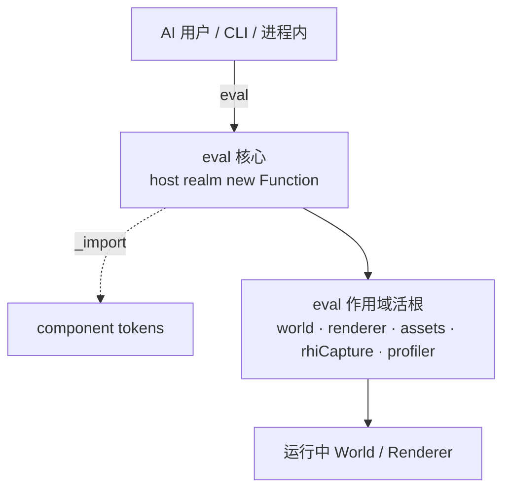
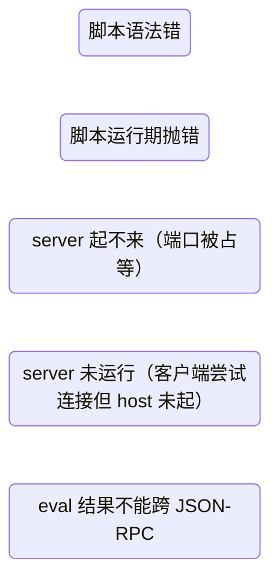

# forgeax-engine-cli

> [!IMPORTANT]
> **这里只有一个产品入口：`forgeax`。** 项目操作使用根命令 `list / describe / run / exec`；
> `ToolContribution`、`ToolClient` 与 `ToolRun` 是 CLI 背后的内部组合契约，不是第二套 tools
> 产品或第二个 skill。包级离线 bin 保留为具体能力的低层入口。

## 先按意图路由

| 意图 | 入口 |
|:--|:--|
| 把外部 `forge.json` 游戏构建成静态发布目录 | `forgeax build <project> --base <url> --out-dir <dir> --json` |
| 从 npm 安装完整离线 SDK | `forgeax sdk install <dir> [--version VERSION]` |
| 从 SDK 创建工程或初始化已有工程 | `forgeax new [dir] [--template empty\|game-3d]` / `forgeax init` / `forgeax doctor` |
| 安装或校验游戏根 Engine skills | `forgeax skill install` / `forgeax skill verify` |
| 生成可托管、包含 Engine runtime 的游戏发行包 | `forgeax package [--output release/game-web.zip]` |
| 浏览器合成截图（Canvas + HTML/Shadow DOM UI） | `forgeax capture --backend auto --require-ui --output <png> --json` |
| 无显示器/无物理 GPU 的软件截图 | `forgeax capture --backend software --require-ui --output <png> --json` |
| 同一局自动游玩并在多个状态检查点截图 | `forgeax exec <scenario.mjs> --json` + `browser.open()` / `session.capture()` |
| 发现和执行 build/resource-preview/authoring operation | `forgeax list -> describe -> run` |
| 用程序组合多个 operation | `forgeax exec <program.mjs>` |
| 安装或移除项目插件 | `forgeax plugin install/uninstall` |
| 查询或修改活 World/Renderer | 下文 `eval(script)` |
| 离线分析 RHI tape | `forgeax-engine-rhi-debug` |

> [!IMPORTANT]
> `forgeax new` 的目标必须位于解压 SDK 之外。SDK 根或其子目录返回 `project-target-inside-sdk`；使用兄弟目录或其他外部绝对路径。`forgeax init` 面向已有外部工程，不改变这条所有权边界。

`sdk install` 从公开 npm registry 获取与当前 CLI 相同版本的
`@forgeax/engine-sdk` carrier；npm integrity 是传输校验，carrier 内的
`sdk-manifest.json` 再校验 SDK 版本。GitHub Release 是私有内部归档，不是
用户下载源。目标必须为空，下载、版本检查和复制任一步失败都会清理 staging。

项目操作、组合、preview evidence 和可选 service acceleration 的完整契约见
[`references/authoring-operations.md`](references/authoring-operations.md)。只在这些任务中加载该页。

Resource preview operations are Engine-owned host-realm plugins. The public operation union is
`project.preview`, `material.preview`, `mesh.preview`, `vfx.preview`, and `texture.preview`;
the four resource operations accept `{ "guid": "...", "size": 512 }`, where `size` is optional,
square, and power-of-two (64..4096, default 512). Mesh framing derives from the asset AABB;
texture framing is an aspect-preserving orthographic unlit quad on black with no lights or tonemap.
`forgeax dev` / `forgeax serve` start the source-development asset path; `forgeax preview` verifies and
serves built `dist/`. They are project commands, not resource `*.preview` operations. There is no
generic `asset.preview` facade or legacy preview command.

## 浏览器合成截图

> [!IMPORTANT]
> 这是开发态视觉证据能力，不限定为无 GPU 主机。默认 auto 使用可用的浏览器适配器；
> 需要在无显示器/无物理 GPU 环境运行时，显式传 backend software。普通 preview、玩家路径和
> release acceptance 不会自动切换到软件后端。

```bash
forgeax capture --backend auto --require-ui \
  --output artifacts/capture/game-ui.png \
  --width 1280 --height 720 --wait-ms 4000 --json
```

命令使用 source-development host；Linux 缺少 `$DISPLAY` 时自动补 Xvfb，并调用真实 Chromium
的 `page.screenshot()`。因此一张 PNG 同时包含 Canvas、普通 HTML 和 open
ShadowRoot UI；只读 canvas pixels 或 `canvas.toDataURL()` 不包含 DOM UI。相邻 JSON sidecar
记录实际 `GPUAdapterInfo`、Chrome 版本、X display、lavapipe ICD、canvas/UI witness 与
console/page errors。`--require-ui` 要求生成 host 的 `#game-ui` 下至少挂载一个游戏 UI 子节点；
引擎或浏览器自身的 ShadowRoot 不能冒充游戏 UI。

backend auto 在 WebGPU adapter 不可用时回退到 software；backend hardware 要求非软件 adapter；
backend software 固定 SwiftShader/lavapipe 兼容参数。旧 `--software` 仍是 software 别名。
CLI 会自适应等待 canvas 出现非平坦像素，再追加 `--wait-ms` settle；uniform 黑帧即使
canvas、adapter、ShadowRoot 结构都存在也失败。sidecar 的 `pixels` 保存 canvas-only sampled
luma range；witness 截图会临时隐藏所有非 canvas 元素，因此 HTML HUD 自身的颜色变化不能
掩盖黑色 3D 帧；最终 PNG 仍是完整页面合成结果。

Browser context 固定 viewport/screen、DPR 1、sRGB、light color scheme、`en-US`、UTC，并等待
`document.fonts.ready`。项目仍须携带同一份 Web 字体；system font fallback 不能作为布局或色彩
parity 契约。

本机与远端要比较像素或色彩时，加 `--deterministic`。CLI 会用 `?forgeaxCapture=1` 打开页面；
Engine App 在 Renderer 真实提交帧后发布 `document.documentElement.dataset.forgeaxFrameSubmitted`，
并在 canvas 派发 `forgeax:frame-submitted`。CLI 先等待这个引擎信号和非平坦 canvas crop，再等待
游戏发布的 `document.documentElement.dataset.forgeaxCaptureReady = 'true'`。游戏在发布 ready 前负责
固定随机种子、逻辑帧、状态与项目内 Web 字体。只固定 viewport、DPR 和等待毫秒数不构成 parity。

连续游玩截图不要循环调用一次性 `capture`，否则每张图都会重启页面和 World。用已有组合入口：

```js
export default async function scenario({ browser }) {
  const session = await browser.open({
    backend: 'auto',
    deterministic: true,
    requireUi: true,
    outputDir: 'artifacts/playthrough/boss-flow',
  });
  try {
    const { page } = session;
    await page.getByRole('button', { name: '开始' }).click();
    const spawn = await session.capture('spawn');
    await page.keyboard.press('KeyW');
    const arena = await session.capture('arena');
    return { report: session.reportPath, captures: [spawn, arena] };
  } finally {
    await session.close();
  }
}
```

```bash
forgeax exec tests/playthrough.mjs --json
```

游戏把命名状态写入 `document.documentElement.dataset.forgeaxCaptureReady`；`capture('arena')` 组合
等待 Engine frame signal、精确值、非平坦 canvas crop 后截浏览器 compositor。`session.page` 保留原生 Playwright 输入与
断言，不再造 workflow DSL；DevKit 只拥有 Vite/Xvfb/Chrome 生命周期、画面稳定、PNG/evidence
和有序 `run.json`。program 只能返回 JSON-safe 值，不能返回 `Page` 或 session；`exec` 退出时会
兜底关闭遗漏会话。

| 路径 | 软件后端 | 证据边界 |
|:--|:--|:--|
| Dawn/Node smoke | Mesa lavapipe | GPUTexture readback；不含 DOM |
| `forgeax capture --backend auto` | Chrome 硬件适配器（不可用时回退 software） | 浏览器最终合成的 Canvas + DOM/Shadow DOM |
| `forgeax capture --backend software` / `forgeax exec` persistent session | Chrome SwiftShader + Xvfb | 浏览器最终合成的 Canvas + DOM/Shadow DOM；后者保留同一游戏状态连续截图 |

> [!CAUTION]
> 软件像素用于截图迭代和确定性回归，不代表物理 GPU 性能、厂商驱动兼容、HDR 显示设备或发布验收。

## 外部游戏静态构建

```bash
forgeax build ./games/my-game \
  --base /games/my-game/ \
  --out-dir ./website-staging/games/my-game \
  --json
```

| 输入 | 契约 |
|:--|:--|
| `<project>` | 包含 `forge.json` 与项目入口的外部游戏目录；项目文件是 author authority。 |
| `--base` | 静态托管 URL 前缀；传入 Vite、Pack index 与运行时资源 URL。 |
| `--out-dir` | 专用派生目录；相对路径以项目目录解析，构建前清空。 |
| `--json` | 返回 `forgeax-dist.json` 对应的完整 artifact/digest 闭包。 |

DevKit 是生成 host、Vite、Shader、Pack cooking 与 dist manifest 的唯一 owner。Website、CI
和其他发布 host 只选择输入/输出位置，不复制构建配置，也不重写 Engine 产物。
`forge.json#entry` 若未同时列入 `plugins[]`，其具名
`bootstrap(world, gameHost)` 会在项目 plugins 就绪后被适配到同一原生 plugin lifecycle；
发布 host 不需要也不得再生成第二套启动器。

## Web 游戏发布

```bash
forgeax package --json
forgeax package --output release/my-game-web.zip --json
```

`package` 重新执行相对基址生产构建，校验 `forgeax-dist.json` 中每个文件的大小与 SHA-256，
再生成确定性 ZIP 和相邻 `.sha256` 文件。ZIP 根直接包含 `index.html`、hashed JS/WASM、shader
manifest、pack index 与 cooked assets；Engine runtime 已在闭包内，不携带 SDK source、
`node_modules`、author source 或 remote 调试服务。

| 动作 | 入口 | 判定 |
|:--|:--|:--|
| 本机开发 | `forgeax dev` | HMR 与开发 catalog；不是发行证据 |
| 本机验收 | `forgeax preview` | 通过 HTTP 服务已校验的 `dist/` |
| 生成发行物 | `forgeax package` | 输出 `release/*-web.zip` 与 SHA-256 |
| 分享给玩家 | 将 ZIP 上传到 HTTPS 静态/HTML 游戏托管 | 玩家打开 URL；不得双击 `index.html` |

> [!CAUTION]
> 浏览器 ESM、WASM、`fetch` 和资产索引要求 HTTP(S)。`file://` 打开 `index.html` 出现黑屏不是
> 受支持的玩家运行方式。离线桌面发行需要按 OS/CPU 构建并签名独立壳，不属于 Web ZIP。

活实例路径由 `@forgeax/engine-remote` 把一段 JS 发给运行中的引擎实例求值并取回结果。用
`world.query` 发现 handle，再直接读写活根；包自带 bin 处理离线数据。

## 心智模型

`eval(script)` 在 host 进程的 `new Function` 作用域执行，作用域内注入五个活根：

| 活根 | 类型 | 用途 |
|:--|:--|:--|
| `world` | `World`（来自 `@forgeax/engine-ecs`） | ECS 读写：spawn / despawn / set / query |
| `renderer` | `Renderer` | 渲染器控制：创建/销毁 RT、读 backbuffer |
| `assets` | `AssetRegistry` | 资产查询：loadByGuid / resolveName / rename |
| `rhiCapture` | `{ captureFrame(options?) } \| undefined` | RHI 单帧抓取：返回一个 `{ kind: 'rhi-tape', digest, bytes }` artifact。**仅当 createApp 运行在 `FORGEAX_ENGINE_RHI_DEBUG=1` 时注入**，否则 `undefined`（用前先 guard）。world / renderer / assets 三根恒在场。 |
| `profiler` | `Profiler \| undefined` | Bounded CPU capture through `startCapture({ frameLimit, eventLimit })`; injected only when the host opts in. |

脚本内通过 `_import(specifier)` 按需引入组件 token。`_import` 是 eval 作用域注入的 import 函数；脚本内没有裸 `import` 关键字。

> [!NOTE]
> **协议层另有一个内建方法 `introspect`**（与 `eval` 并列）：返回 OpenRPC L2 子集文档，列出可用方法（`eval` / `introspect`）+ eval 作用域活根。AI 用户连上后可先 `introspect` 自描述，无需读源码即知能 eval 什么。错误码映射 JSON-RPC -32001..-32005。

**安全模型**：eval 全开（无只读拦截、无能力黑名单）。唯一边界是 host 起不起 server：`createApp` dev 模式默认 wire `app.remote`（WS server 在场）；production 默认不起 server（天然安全）。危险 API（`renderer.dispose()` / `world.despawn`）允许执行，详见末尾 NOTE。

## 传输路径

三条路径统一收束到同一个 `eval(script)` 协议：


```mermaid
flowchart TD
    A[AI 用户 / CLI / 进程内] -->|eval| E[eval 核心<br/>host realm new Function]
    E -.->|_import| ECS["component tokens"]
    E --> R["eval 作用域活根<br/>world · renderer · assets · rhiCapture · profiler"]
    R --> W[运行中 World / Renderer]
```

| 路径 | 形态 | 适用场景 |
|:--|:--|:--|
| 进程内 client | `app` 获取 `RemoteHandle`，`client.eval(script)` | host 自身做查询/调试（零网络开销） |
| WS JSON-RPC 2.0 | `ws://localhost:5732` 发 `{"method":"eval","params":{"script":"..."}}` | 外部工具 / AI 代理连运行中引擎 |
| CLI plugin bin | `forgeax-engine-remote-{asset,gltf,font,state}` | 离线/进程外数据工具 |

## 核心 API / bin 速查

| 名字 | 来源 | 形态 | 用途 |
|:--|:--|:--|:--|
| `client.eval(script)` | `@forgeax/engine-remote` | `async (script: string) => Promise<Result<unknown, RemoteError>>` | 对运行中引擎执行一段 JS，取返回值 |
| `RemoteHandle` | `@forgeax/engine-types` | `{ port: number; close(): Promise<void> }` | `app.remote` 的类型；暴露 server 端口与关闭方法 |
| `RemoteError` | `@forgeax/engine-remote` | class extends Error，含 `.code` / `.expected` / `.hint` / bounded `.detail` | 结构化错误，5 成员 `RemoteErrorCode` 闭集 |
| `forgeax-engine-remote-asset` | pack | plugin bin | `scan` / `lookup` / `verify` / `atlas` |
| `forgeax-engine-remote-gltf` | gltf | plugin bin | `import` |
| `forgeax-engine-remote-font` | font | plugin bin | `bake` |
| `forgeax-engine-remote-state` | state | plugin bin | `list` / `get <name>` |

> [!IMPORTANT]
> CLI plugin bin 是各能力包自带的独立可执行文件，进程外直接调用。`RemoteErrorCode`（5 成员：`script-syntax-error` / `script-runtime-error` / `server-startup-failed` / `server-not-running` / `eval-result-not-serializable`）SSOT 见 `packages/types/src/index.ts` + `packages/remote/src/errors.ts`。

## handle 发现配方

空 descriptor 访问所有启用实体；`row.entity` 是完整 packed handle。

```js
const query = world.query({});
if (!query.ok) throw query.error;
return Array.from(query.value, (row) => row.entity);
```

带组件数据时从所属包导入 token，并声明 `read` / `write` / `optional` / filter 角色：

```js
const { MeshRenderer } = await _import('@forgeax/engine-render');
const { Transform } = await _import('@forgeax/engine-scene');
const query = world.query({ read: [Transform], with: [MeshRenderer] });
if (!query.ok) throw query.error;
return Array.from(query.value, (row) => ({
  entity: row.entity,
  position: Array.from(row.get(Transform).pos),
}));
```

## 读写配方

### 读组件值

```js
const { Transform } = await _import('@forgeax/engine-scene');
const query = world.query({ read: [Transform] });
if (!query.ok) throw query.error;
return Array.from(query.value, (row) => ({
  entity: row.entity,
  position: Array.from(row.get(Transform).pos),
}));
```

`Transform.pos` is the flat `array<f32, 3>` column; row `i` starts at
`i * 3`. `quat` and `scale` use strides 4 and 3 respectively, and query
bundles do not expose `.x` / `.y` / `.z` sub-fields.

### 写组件值 / 生命周期

```js
// spawn——带组件
const scene = await _import('@forgeax/engine-scene');
const h = world.spawn({
  component: scene.Transform,
  data: { pos: [0, 5, 0], quat: [0, 0, 0, 1], scale: [1, 1, 1] },
}).unwrap();

// set——直接修改已存在实体的组件值
world.set(h, scene.Transform, { pos: [1, 2, 3] });

// despawn
world.despawn(h);
```

eval 无任何写入拦截——`spawn` / `set` / `despawn` 直接执行，不会返回 `inspector-write-denied`（该错误码已随 sandbox 删除）。危险操作（`renderer.dispose()` 等）见末尾 NOTE。

## rhiCapture 单帧抓取

eval 内通过第 4 活根 `rhiCapture` 做 RHI 帧抓取：

```js
if (rhiCapture === undefined) return { ok: false, error: { code: 'capture-unavailable' } };
const capture = await rhiCapture.captureFrame();
if (!capture.ok) return capture;
return { kind: capture.value.kind, digest: capture.value.digest };
```

离线 operation（`rhi.summary` / `rhi.inspect`）是纯本地工具，不连 WS，不受 eval 收编影响。详见 [`forgeax-engine-rhi-debug`](../forgeax-engine-rhi-debug/SKILL.md)。

## Profiler artifact path

When the host passes the public `profiler` capability to `createApp`, use the existing `eval`
method to start a bounded capture. This adds no RPC method and does not change the remote transport.

```js
if (profiler === undefined) return { ok: false, error: { code: 'profiler-not-enabled' } };
const started = profiler.startCapture({ frameLimit: 120, eventLimit: 1024 });
if (!started.ok) return started;
// Drive the live App, then finish and persist the returned ProfileCapture.
return started.value.finish();
```

For offline analysis, use the package bin on the captured JSON:

```bash
forgeax-engine-profiler summary --file profile-capture.json
forgeax-engine-profiler frame --file profile-capture.json --frame-id 12
forgeax-engine-profiler phase --file profile-capture.json --source render --phase record
```

Read `validateProfileCapture` and `buildProfileModel` from the profiler package for schema and
semantic recovery. The profiler covers bounded App/Render CPU evidence only; it is not an ECS span,
GPU timestamp, UI, or external trace path.

## createApp 默认在场

`createApp` dev 模式默认起 remote server，消隐"没 wire 等于没有"黑洞：

```ts
import { createApp } from '@forgeax/engine-app';

const app = await createApp({ canvas });

// dev 模式：app.remote 非 undefined，port > 0
if (app.remote) {
  console.log('remote eval server on port', app.remote.port);
  // 进程内直接 client.eval(...)
  // 或外部工具连 ws://localhost:<port>
}

// production 模式：app.remote 为 undefined（server 不启，天然安全）
```

`RemoteHandle` 类型（`{ port: number; close(): Promise<void> }`）定义在 `@forgeax/engine-types`，host 类型面不静态引 `@forgeax/engine-remote`。

## remote-live：驱动**运行中的浏览器**引擎（环回中继）

> [!IMPORTANT]
> **WS server 只在 Node/dawn-node 活。** `@forgeax/engine-remote/server` 靠 `ws.WebSocketServer`（Node 监听 socket）。**浏览器起不了监听 socket**——所以 `pnpm --filter <app> dev`（:5173）跑起来的真浏览器引擎，`app.remote` 恒 `undefined`，经典 `forgeax-engine-remote eval` CLI 无处可连。这就是"remote 不支持运行时"的真相。

**解法（对齐 editor 的 gateway-live）**：浏览器页面只能**拨出**，没人能拨入。于是 `createApp` 在 dev 里让页面**拨出**一条 WS client 连到本机**环回中继**，中继再把 CLI 的 `POST /eval` 转发给页面，页面在自己的 realm 里跑 ws-free 的 eval 核（`@forgeax/engine-remote/execute`）打到活的 `world`/`renderer`/`assets`/`rhiCapture`。中继是两边都够得着的会合点。

```
 remote-live.mjs  --POST /eval-->  中继 (:5733, Node ws)  --WS /bridge-->  浏览器页面
   (CLI)          <--{ok,value}--   HTTP + WS 会合点        <--{result}--   (拨出)
                                                                           executeScript(...)
```

**opt-in（`VITE_FORGEAX_ENGINE_BRIDGE=1`）**：页面**只有**在 vite 见到该 flag 时才拨中继——`scripts/dev-live.mjs` 会注入它并同时起中继，所以 `node scripts/dev-live.mjs <app>` 一条命令即开。**为什么不默认开**：拨一个没起的中继会让**浏览器自己**往 console 打 `WebSocket connection failed`（JS `catch` 拦不住），踩爆所有 zero-console-error 浏览器 smoke（collectathon / hello-*）。所以裸 `pnpm --filter <app> dev` 和 CI 永远静默。production 整块 DCE（零注入）。中继起了、页面尚未连上时静默重连退避（1s→15s），不刷屏。

**帧起始 drain（确定性）**：WS `message` 可能落在 rAF tick 任意相位，页面**不内联 eval**，而是入队、在 `app.registerUpdate`（帧起始）里 drain——每次 bridge 写都保证过这一帧的 systems，跨运行可复现。代价：回复延到那次 drain（亚毫秒）；**页面被切到后台 → rAF 暂停 → drain 停 → 30s 超时**，保持窗口前台。

**安全**：中继给"任何能 POST 到 :5733 的东西"授予"在页面里跑任意 JS"。仅 loopback、仅 DEV、只由 dev 栈启动。**绝不**对 production / 公网暴露。

### 用法

```bash
# 一条命令起中继 + 选定 app 的 vite（bridge 默认开，无需注入 env）：
node scripts/dev-live.mjs @forgeax/remote-demo
# → 中继 :5733 + vite :5173；浏览器打开 http://localhost:5173

# 另一个终端，页面 boot 完后：
node skills/forgeax-engine-cli/scripts/remote-live.mjs --health
# → {"ok":true,"pageConnected":true}，exit 0

# 读：从活的浏览器 world 发现 handle
node skills/forgeax-engine-cli/scripts/remote-live.mjs \
  "const q=world.query({}); if(!q.ok) throw q.error; return Array.from(q.value,row=>row.entity)"

# 写：直接改活实体，屏幕立刻动（无 rebuild/refresh）
node skills/forgeax-engine-cli/scripts/remote-live.mjs \
  "world.set(<h>, (await _import('@forgeax/engine-runtime')).Transform, {pos:[5,0,0]})"

# 从文件读脚本
node skills/forgeax-engine-cli/scripts/remote-live.mjs --file snippet.js

# 换端口（中继 + CLI 都读同一 env）
FORGEAX_ENGINE_BRIDGE_PORT=6001 node scripts/dev-live.mjs @forgeax/remote-demo
FORGEAX_ENGINE_BRIDGE_PORT=6001 node skills/forgeax-engine-cli/scripts/remote-live.mjs --health
```

`remote-live.mjs` 严格 flag 解析：只认 `--file` / `--health`；未声明 flag（如 `--settle`）loud 失败 exit 2，绝不把裸值漏进 code 串。错误码（中继层）：`PAGE_NOT_CONNECTED` / `EVAL_TIMEOUT` / `BAD_REQUEST` / `SEND_FAILED`；eval 层是 5 成员 `RemoteErrorCode`。

| script | 角色 |
|:--|:--|
| `skills/forgeax-engine-cli/scripts/remote-bridge-server.mjs` | 环回中继（`GET /health` + `POST /eval` + WS `/bridge`），端口 `FORGEAX_ENGINE_BRIDGE_PORT ?? 5733` |
| `skills/forgeax-engine-cli/scripts/remote-live.mjs` | CLI：`--health` / `--file` / positional snippet，POST 到中继 |
| `skills/forgeax-engine-cli/scripts/remote-cli-common.mjs` | 严格 `parseArgs` / `readSnippet` / `printResult`（SSOT，防 flag 漏入 code） |
| `scripts/dev-live.mjs` | 一条命令起中继 + `pnpm --filter <pkg> dev` |

> [!NOTE]
> **remote-live 与 WS server 正交**：浏览器用 remote-live（中继），Node/dawn-node 用 WS server（`FORGEAX_ENGINE_REMOTE_SERVE=1`）。两条路都收束到同一个 `executeScript` eval 核 + 同一 `RemoteError` 模型；`app.remote` 语义不变（浏览器里仍 `undefined`，bridge 与它无关）。

## RemoteErrorCode 闭集（5 成员）


```mermaid
stateDiagram-v2
    direction LR
    state "脚本语法错" as scriptSyntaxError
    state "脚本运行期抛错" as scriptRuntimeError
    state "server 起不来（端口被占等）" as serverStartupFailed
    state "server 未运行（客户端尝试连接但 host 未起）" as serverNotRunning
    state "eval 结果不能跨 JSON-RPC" as evalResultNotSerializable
```

| code | JSON-RPC 段位 | `.expected` | `.hint` |
|:--|:--|:--|:--|
| `script-syntax-error` | -32001 | `'script body is valid JavaScript'` | `'check syntax position in errMessage; fix and resubmit'` |
| `script-runtime-error` | -32002 | `'script executes without throwing'` | `'inspect error; verify symbol availability; eval has full access to world/renderer/assets'` |
| `server-startup-failed` | -32003 | `'server starts successfully on requested port'` | `'check if port is already in use (default 5732); pass different port; or kill existing process holding the port'` |
| `server-not-running` | -32004 | `'server is reachable at ws://localhost:<port>'` | `'start the demo first; verify app.remote is wired; pass --port to override default 5732'` |
| `eval-result-not-serializable` | -32005 | `'eval result is JSON-serializable'` | `'return a JSON-safe value; BigInt and cyclic objects are unsupported over JSON-RPC'` |

消费方式——`switch (err.code)` 穷举 5 成员，无 `default` 分支（TS 严格模式守完整性）：

```ts
import { RemoteError, type RemoteErrorCode } from '@forgeax/engine-remote';

function recover(code: RemoteErrorCode): string {
  switch (code) {
    case 'script-syntax-error':     return 'fix script body syntax and resubmit';
    case 'script-runtime-error':    return 'inspect stack trace; verify symbol availability';
    case 'server-startup-failed':   return 'pick a different port or free port 5732';
    case 'server-not-running':      return 'start demo dev or wire app.remote';
    case 'eval-result-not-serializable': return 'return a JSON-safe eval result';
  }
}
```

## CLI plugin bin

plugin bin 是各能力包自带的独立可执行文件，进程外直接调用：

### Offline AssetEvidence probe

`forgeax-engine-remote-asset lookup` and `verify` have a machine-readable evidence form:

```bash
forgeax-engine-remote-asset lookup --guid <guid> --project <project> --catalog <catalog.json> --json
forgeax-engine-remote-asset verify --guid <guid> --project <project> --catalog <catalog.json> --json
```

The probe joins source inventory, catalog `packageUrl`/`cookReceiptUrl`, the producer `CookReceipt`, Pack v2 descriptors, and artifact bytes. Success writes one `AssetEvidence` JSON object. Failure writes exactly one structured JSON object to stderr with `code`, `expected`, `hint`, and optional `detail`; there is no WS connection. Read `notCooked`, `ready/current`, `ready/stale`, `unknown`, `notChecked`, `passed`, and `failed` literally and follow the `.hint` recovery action. A catalog row by itself is navigation, not proof.

```bash
# 资产扫描/校验
forgeax-engine-remote-asset scan ./assets
forgeax-engine-remote-asset verify
forgeax-engine-remote-asset lookup <guid>

# glTF 导入
forgeax-engine-remote-gltf import ./model.glb

# 字体烘焙
forgeax-engine-remote-font bake ./font.ttf

# 状态机查询
forgeax-engine-remote-state list
forgeax-engine-remote-state get <tokenName>

```

## 踩坑

- **eval 内不能用裸 `import`**：脚本作用域不认 `import` 关键字——用注入的 `_import(specifier)` 函数做动态 ESM 引入。`const ecs = await _import('@forgeax/engine-ecs')`。
- **`world.query` 返回 `Result`**：先处理失败，再迭代 `result.value`；不要忽略 descriptor 冲突或 span capability 错误。
- **`app.remote` 为 `undefined`（尤其浏览器里）**：`app.remote` 是 **Node WS server** 句柄。浏览器起不了监听 socket，`createApp` 尝试 `startServer` 会在 `ws` 浏览器 shim 上抛错并被静默吞掉 → 浏览器 dev 里 `app.remote` 恒为 `undefined`。想在**运行中的浏览器引擎**里 eval，用下面的 **remote-live** 环回中继（不是 `app.remote`）。dawn-node / headless 无 GUI 时才用 WS server：设环境变量 `FORGEAX_ENGINE_REMOTE_SERVE=1` opt-in（源码 SSOT：`packages/app/src/internal/remote-serve-flag.ts`）。
- **plugin bin 找不到**：确认对应能力包已安装（`pnpm install`），bin 会自动出现在 `node_modules/.bin/`。

## 深入

- 包定位 / RemoteError 类 / RemoteErrorCode SSOT / 物理隔离 gate：见 `packages/remote/README.md`
- 错误模型源码：`packages/remote/src/errors.ts`
- eval 执行引擎源码：`packages/remote/src/execute.ts`
- server 源码：`packages/remote/src/server.ts`
- `RemoteHandle` / `RemoteErrorCode` / `RemoteError` 类型定义：`packages/types/src/index.ts`
- 4 个 plugin bin 的 owner 包源码：`packages/pack/src/cli-pack.ts` / `packages/font/src/cli-font.ts` / `packages/gltf/src/cli-gltf.ts` / `packages/state/src/cli-state.ts`

## RHI 调试 operations（capture / summary / inspect）

> RHI 调试统一走 `forgeax run rhi.capture`、`forgeax run rhi.summary`、`forgeax run rhi.inspect` 三个 operation。`rhi.capture` 返回单个 `ArtifactRef(kind='rhi-tape')`，`rhi.summary` 从 artifact 派生 `FrameModel.works`，`rhi.inspect` 按 `workIndex` 在 fresh backend 上读取状态和像素；不再走独立 JSON-RPC method。flag 表、输出 schema、症状定位工作流全在 [`forgeax-engine-rhi-debug`](../forgeax-engine-rhi-debug/SKILL.md)（SSOT）。

## forgeax-engine-remote-state plugin bin

> `@forgeax/engine-state` provides a CLI plugin bin for inspecting state machines. Two subcommands, discoverable via the `forgeax-engine-remote-` prefix scan.

### list

```bash
forgeax-engine-remote-state list
```

Output format: one line per registered state token:

```
<tokenName>: <currentVariant> (variants: <variant1>, <variant2>, ...)
```

If no state tokens are registered, prints `(no state tokens registered)`.

### get

```bash
forgeax-engine-remote-state get <tokenName>
```

Prints the current variant string for the named state token. Exit code 0 on success, exit code 1 with structured error on unknown token name or if `getState` returns `Result.err`.

### Deeper

- Plugin bin source: `packages/state/src/cli-state.ts`
- State machine API surface: [`forgeax-engine-state`](../forgeax-engine-state/SKILL.md)

---

> [!CAUTION]
> **危险 API NOTE**：eval 全开可读写——脚本内可以调用 `renderer.dispose()`（销毁 GPU 上下文、整个 app 崩溃）、`world.despawn` 批量清实体、`AssetRegistry.clear()` 等破坏性操作。引擎不做代码层拦截。production 环境的天然安全来自不起 server（`app.remote` 为 `undefined`）；dev 环境的保护靠开发者自觉。AI 用户在 dev 模式 eval 前确认脚本不含毁灭性 API 调用。

## Visibility diagnostics quick start

Use the existing `introspect` and `eval` surfaces; there is no visibility CLI
command. First inspect `components.schemas.Visibility`, then evaluate the
same live path used by the app:

```ts
const render = await _import('@forgeax/engine-render');
const query = world.query({ read: [render.Visibility] }).unwrap();
for (const row of query) console.log(row.get(render.Visibility).state);
console.log(render.resolveVisibility(world).effective(entity));
console.log(renderer.visibilityStats);
```

| Signal | Meaning | Recovery |
|:--|:--|:--|
| `current` | Component intent currently stored in ECS | Use reflected labels and retry a rejected `world.set` |
| `effective` | Parent-resolved state consumed by render candidates | Repair `snapshot.diagnostics` when hierarchy input is invalid |
| `visibilityStats` | Renderer count for explicitly hidden candidates | Inspect the real render path; do not add an RPC or CLI method |

The remote server receives a JSON-safe registry projection from app. It keeps
the two existing methods and the closed `RemoteError` shape; production remote
still has no ECS, render, or runtime dependency. Camera, picking, lifecycle,
assets, material authoring, and VFX shadow policy are out of scope.

## Simulation inspection through the existing front door

Discover the `simulation` root from `introspect`, then read
`simulation.inspect()` through existing `eval` transport. Consume the summary
fields and schema; do not add a Remote/CLI restore or replay method and do not
return raw World, Rapier, or Web Audio objects.

For errors, switch on the closed `code` and use `expected`, `hint`, and
`detail`. Repair the owner or fresh target and inspect again. RHI tape replay
and game replay have separate commands and evidence owners.
