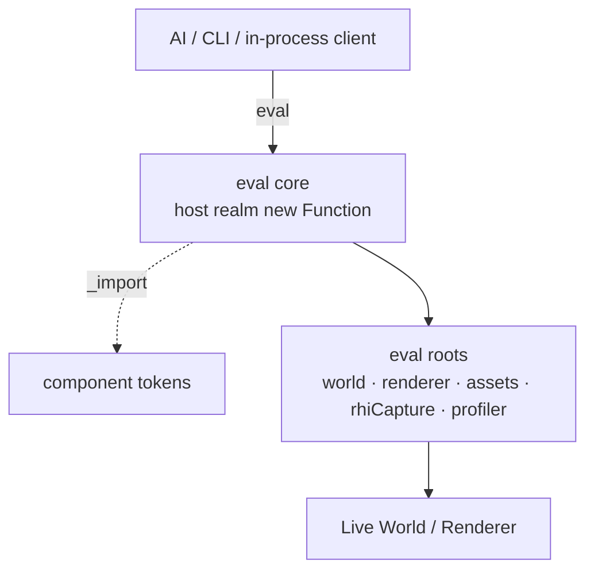
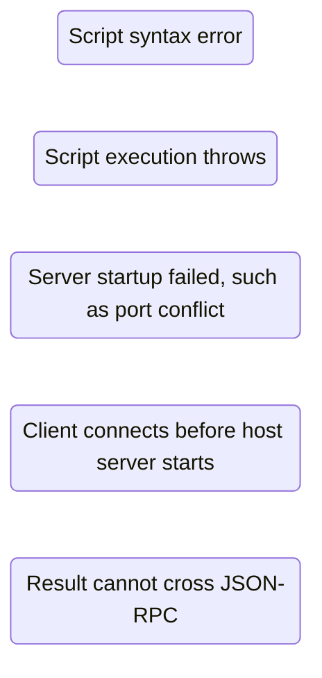

# forgeax-engine-cli

> [!IMPORTANT]
> **forgeax is the single product entry.** Discover commands progressively with forgeax help;
> forgeax help --tree --json returns the complete structured command tree. ToolContribution, ToolClient,
> and ToolRun are internal composition contracts behind the CLI, not additional product entries.

For difficult or unexplained rendering failures, start with
[`forgeax-engine-rhi-debug`](../forgeax-engine-rhi-debug/SKILL.md). Use live
control to reproduce and capture the failing frame; let tape evidence select
further state queries and the repair owner.

## Persistent live control

Run commands from a game project root, or pass `--root`. The live owner keeps
one actual game running between CLI calls. Use `help dev` for discovery.

```bash
forgeax dev start --headless false --json
forgeax dev find --name Player --json
forgeax dev focus --name Player --distance 6 --json
forgeax dev camera set --position '[8,6,8]' --target '[0,1,0]' --json
forgeax dev capture --json
forgeax dev camera release --json
forgeax dev stop --json
```

Observation commands default to the current runtime. Every successful
observation returns its `revision`; pass `--revision` to require that exact
runtime on the next command. Reload or World replacement invalidates old
revisions and entity refs. `find` returns refs usable with `focus --ref` when
names are ambiguous. Focus frames the selected subtree from Renderer bounds using the current camera projection; `--distance` overrides automatic distance. `focus --name` uses an exact name and never chooses the
first duplicate. `find --limit` defaults to 20 (maximum 100).

`dev eval --revision <revision> --code 'return simulation.execution.report()'`
requires a revision because arbitrary code can contain old entity handles.
Canceling its wait does not stop already-running code; reload/stop destroys
its execution environment. Camera control is temporary: set/focus acquires
an observation camera, get reports `control`, and release returns control to
the game. These operations do not save scene edits.

`dev capture` returns PNG and JSON report references with absolute paths and
digests. Default artifacts live in the user's data directory and survive
stop or temporary-project deletion. `--output` selects an explicit PNG path;
relative paths resolve against the project. `--checkpoint` waits for an exact
game-provided ready marker; it is not an image label and is unnecessary for
ordinary screenshots. The frame number confirms a submission before capture,
not the exact frame represented by the PNG.

The default `--backend auto` prefers hardware and allows software fallback;
status reports the requested policy, actual backend, and fallback reason.
Explicit `hardware` or `software` must match the selected adapter. Stop an
existing owner before changing its browser options. Headed live windows use
the native display density; fixed-size capture keeps its declared resolution.

Use `--headless true` for unattended operation and `--workers '{}'` for automatic
Engine, Render and eligible Kernel Workers. Override individual fields with
`auto`, `true` or `false`, such as `--workers '{"kernels":false}'`; inspect actual
`workers` decisions in status. Omitted `workers` selects auto for Engine, Render and Kernel Workers, including newly created projects. Declare DOM/UI entries as `realm: "frontend"` (Node backend plugins use `host`) and gameplay as `realm: "engine"`; `{"engine":false}` runs the same bootstrap locally. `dev reload` rereads project inputs;
Live periodically checks author file metadata and checks again around operations
and reloads, independent of filesystem event delivery. Direct disk edits invalidate
the runtime; failed input reads block observation until recovery. `revision` is a
runtime identity, not a disk-content digest or an atomic multi-file snapshot.
Installed dependencies and generated output are excluded; explicitly reload after
changing installed Engine/dependency builds. `dev status`
reports stopped when no owner is registered, and unreachable when an existing
owner cannot be contacted; it never silently replaces that owner.

## Optional workspace clients

For an embedded backend, discover `engine.workspace.capabilities` and call
`engine.workspace.call` on its authenticated Host transport. Use `projectId`
for project/asset operations and both `targetId` and `targetGeneration` from
`engine.workspace.get` for preview/camera operations. Refresh identities after
replacement; never retry an old target against the current UI selection.

`engine.run.*` uses the existing live owner. Headless start does not contact a
View carrier. Headed attach requires the process that holds the actual Page;
endpoint credentials alone cannot supply one. Keep a camera transaction and
its idempotent retry on one connection; disconnect revokes its unfinished draft.
See the [DevKit workspace contract](../../packages/devkit/README.md#engine-workspace-provider).

## Route by intent

| Intent | Entry |
|:--|:--|
| Build an external forge.json game into static output | `forgeax project build <project> --base <url> --out-dir <dir> --json` |
| Install the SDK from npm | `forgeax sdk install <dir> [--version VERSION]` |
| Create from the SDK or initialize an existing project | `forgeax project new [dir] --template empty\|game-3d` / `forgeax project init` / `forgeax project check` |
| Install/verify project-local Engine skills | `forgeax project skill install` / `forgeax project skill verify` |
| Package a hosted Web ZIP including Engine runtime | `forgeax project package --format web-zip [--output release/game-web.zip]` |
| Create a single-HTML offline candidate | `forgeax project package --format single-html --output release/game-offline.html --json` |
| Browser compositor screenshot including Canvas and HTML/Shadow DOM | `forgeax project capture --backend auto --require-ui --output <png> --json` |
| Capture without a display or physical GPU | `forgeax project capture --backend software --require-ui --output <png> --json` |
| Play one session and capture multiple checkpoints | `node <scenario.mjs>` + `createBrowserCapture(root).open()` / `session.capture()` |
| Discover commands and arguments | `forgeax help [path] [--tree] [--json]` |
| Execute build/resource-preview/authoring operations | `forgeax project ...` / `forgeax asset ...` / `forgeax debug ...` |
| Compose operations programmatically | Import the SDK command client in an ordinary Node/Bun module. |
| Inspect or maintain project plugins | `forgeax project plugin list\|inspect\|configure\|disable\|enable\|install\|uninstall` |
| Query or mutate live World/Renderer | eval(script), below |
| Analyze an offline RHI tape | forgeax-engine-rhi-debug |

> [!IMPORTANT]
> project new requires an explicit template: game-3d for 3D games, empty otherwise. Targets must be outside the unpacked SDK; its root/subdirectories return project-target-inside-sdk. project init handles existing external projects.

> [!IMPORTANT]
> game-3d copies a runnable third-person reference with scene content, visible objects/colliders, character/material/animation packs, and UI. Read its generated README before retaining, adapting, replacing, or removing content; update scene, runtime code, and pack references together.

sdk install downloads the same-version
@forgeax/engine-sdk carrier from public npm. npm integrity checks transport; the carrier's
sdk-manifest.json checks SDK identity. Private GitHub Releases are internal archives, not
consumer download sources. The target must be empty; download, version, or copy failures clean staging.

For project operations, composition, preview evidence, and optional service acceleration, read
[`references/authoring-operations.md`](references/authoring-operations.md) when those tasks apply.

Resource preview operations are Engine-owned host-realm plugins. Discover the exact request with
`forgeax help asset preview --json`; `forgeax asset preview --kind material --guid <guid> --json`
selects the existing material preview operation. Material, mesh, texture and VFX subjects are
supported; scene assets are not currently preview subjects. Mesh framing derives from the asset
AABB; texture preview uses an aspect-preserving unlit presentation. A Standard material result also
carries `sampledTextureBudget` (`limit`, `required`, `transmission`, `conflicts`) at the portable
16-texture limit; `transmission: "exceeded"` means refraction drops on 16-texture devices.
`forgeax dev start` runs the source-development asset path. `forgeax project preview` verifies and
serves built `dist/`; it does not start a source-development server.

## Browser compositor capture

> [!IMPORTANT]
> This development visual-evidence path supports available browser adapters through backend auto.
> Explicitly select backend software on hosts without a display/physical GPU. Ordinary preview, player paths, and
> release acceptance do not silently switch to software.

```bash
forgeax project capture --backend auto --require-ui \
  --output artifacts/capture/game-ui.png \
  --width 1280 --height 720 --wait-ms 4000 --json
```

The command uses the source-development host, adds Xvfb on Linux without DISPLAY, and calls real Chromium
page.screenshot(). The PNG includes Canvas, ordinary HTML, and open
ShadowRoot UI; canvas pixel reads/toDataURL omit DOM UI. The adjacent JSON sidecar
records GPUAdapterInfo, Chrome version, X display, lavapipe ICD, canvas/UI witnesses, and
console/page errors. --require-ui requires a game UI child beneath the generated host's #game-ui;
Engine/browser ShadowRoots do not count as game UI.

backend auto falls back to software when a WebGPU adapter is unavailable; hardware requires a non-software adapter;
software pins SwiftShader/lavapipe-compatible flags. --software remains an alias.
The CLI waits for non-flat canvas pixels before additional --wait-ms settling. A uniform black frame fails even
when Canvas, adapter, and ShadowRoot exist. Sidecar pixels record canvas-only sampled
luma range; witness screenshots temporarily hide non-canvas elements, preventing HUD color changes from
masking a black 3D frame. The final PNG still includes full page composition.

Browser context fixes viewport/screen, DPR 1, sRGB, light color scheme, en-US, UTC, and waits for
document.fonts.ready. Projects must bundle the same Web fonts; system font fallback cannot define layout/color
parity.

Use --deterministic for local/remote pixel or color comparisons. The CLI opens ?forgeaxCapture=1;
App publishes document.documentElement.dataset.forgeaxFrameSubmitted after an actual renderer submission
and dispatches forgeax:frame-submitted on Canvas. The CLI waits for that signal and non-flat canvas crop, then
for document.documentElement.dataset.forgeaxCaptureReady = 'true'. Before readiness, the game must pin
random seed, logical frame, state, and project fonts. Viewport, DPR, and elapsed time alone do not establish parity.

For continuous playthroughs, reuse one session; repeated one-shot capture restarts the page and World:

```js
export default async function scenario({ browser }) {
  const session = await browser.open({
    backend: 'auto',
    deterministic: true,
    requireUi: true,
    outputDir: 'artifacts/playthrough/boss-flow',
  });
  try {
    const { page } = session;
    await page.getByRole('button', { name: 'Start' }).click();
    const spawn = await session.capture('spawn');
    await page.keyboard.press('KeyW');
    const arena = await session.capture('arena');
    return { report: session.reportPath, captures: [spawn, arena] };
  } finally {
    await session.close();
  }
}
```

```bash
a Node or Bun script using the SDK command client tests/playthrough.mjs --json
```

Games write checkpoint names to document.documentElement.dataset.forgeaxCaptureReady. capture('arena') waits
for the Engine frame signal, exact marker, and non-flat crop before compositor capture. session.page retains native Playwright input and
assertions without another DSL. DevKit owns Vite/Xvfb/Chrome lifetime, stabilization, PNG/evidence,
and ordered run.json. Node/Bun programs return only JSON-safe values and release their own
Pages/sessions in finally.

| Path | Backend | Evidence boundary |
|:--|:--|:--|
| Dawn/Node smoke | Mesa lavapipe | GPUTexture readback without DOM. |
| forgeax project capture --backend auto | Chrome hardware, software fallback when unavailable | Final Canvas + DOM/Shadow DOM composition. |
| forgeax project capture --backend software / persistent SDK command-client session | Chrome SwiftShader + Xvfb | Final Canvas + DOM/Shadow DOM composition; persistent sessions retain game state across captures. |

> [!CAUTION]
> Software pixels support screenshot iteration and deterministic regression, not physical GPU performance, vendor-driver compatibility, HDR displays, or release acceptance.

## External game static builds

```bash
forgeax project build ./games/my-game \
  --base /games/my-game/ \
  --out-dir ./website-staging/games/my-game \
  --json
```

| Input | Contract |
|:--|:--|
| project | External game directory containing forge.json and its entry; project files own authored truth. |
| --base | Hosting URL prefix passed to Vite, Pack index, and runtime resource URLs. |
| --out-dir | Dedicated derived directory, resolved relative to project and cleared before build. |
| --json | Complete artifact/digest closure corresponding to forgeax-dist.json. |

DevKit owns generated hosts, Vite, shader/Pack cooking, and dist manifests.
`forge.json#roots` selects plugin assets; DevKit compiles static program tables and installs
native Cordis Fibers. Configuration belongs to Pack. Discover authoring with `help asset plugin`
and `help project root set`. Source and configuration updates compile before replacing the session.

## Web game delivery

```bash
forgeax project package --format web-zip --json
forgeax project package --format web-zip --output release/my-game-web.zip --json
```

package rebuilds production output with relative base URLs, verifies every forgeax-dist.json size/SHA-256,
then emits the selected format; web-zip is the default. The ZIP root contains
index.html, hashed JS/WASM, shader manifest, pack index, and cooked assets, including Engine runtime.
It excludes SDK source, node_modules, authored source, and remote debugging services.

| Action | Entry | Evidence |
|:--|:--|:--|
| Local development | forgeax dev start | HMR/development catalog, not release evidence. |
| Local acceptance | forgeax project preview | Serves verified dist over HTTP. |
| Build Web release | forgeax project package --format web-zip | release/*-web.zip and SHA-256. |
| Share with players | Upload ZIP to HTTPS static/HTML-game hosting | Players open the URL, not index.html directly. |

> [!CAUTION]
> The HTTP(S) requirement applies to web-zip: its index.html cannot be opened through file://.
> single-html is an explicit alternative artifact; file:// is supported only after its acceptance gate below passes.

## Single-HTML offline delivery

```bash
forgeax project package --format single-html \
  --output release/my-game-offline.html --json
```

single-html and web-zip share project facts, relative-base production builds, and
complete forgeax-dist.json verification. DevKit then embeds real entry/dynamic modules, Engine/Kernel
Workers, WASM, Pack, Shader, media, and fonts into one HTML outside dist, with
an adjacent release/my-game-offline.html.sha256. JSON html.path, HTML SHA-256,
distManifestSha256, and embeddedAssets identify the candidate; acceptance/promotion use that same absolute path.

Pass generic checks before running the game's own gameplay scenario:

| Layer | Required proof |
|:--|:--|
| Structure | One HTML closes the verified dist resources, without adjacent JS/CSS/Worker/WASM files. |
| Offline | Target Chrome opens file:// with zero HTTP(S) requests, failed requests, or missing resources. |
| Engine | No console/page errors; correct Canvas size, real submission/non-flat output, functioning Worker/WASM/Pack/Shader. |
| Playability | Project scenario proves input, state changes, and key gameplay; readiness or Canvas existence is insufficient. |

browser.open({ target: { kind: 'single-html', path }, launchProfile: 'release' }) reuses browser
lifecycle for generic checks. The release profile omits unsafe flags such as --allow-file-access-from-files.
If target hardware/headed Chrome is unavailable, preserve the candidate and completed evidence, mark player conditions
not-run, and do not substitute software screenshots or HTTP preview for single-file player acceptance.

The live path sends JS through @forgeax/engine-remote to the running engine and returns its result. Discover
handles with world.query, then access live roots directly; offline data uses package tools.

## Mental model

eval(script) executes in a host new Function scope with five injected live roots:

| Live root | Type | Purpose |
|:--|:--|:--|
| world | World from @forgeax/engine-ecs | ECS spawn/despawn/set/query. |
| renderer | Renderer | Render-target lifecycle and backbuffer reads. |
| assets | AssetRegistry | loadByGuid / resolveName / rename. |
| rhiCapture | { captureFrame(options?) } \| undefined | Returns a single { kind: 'rhi-tape', digest, bytes } artifact. Injected only with FORGEAX_ENGINE_RHI_DEBUG=1; guard before use. World/renderer/assets remain present. |
| `profiler` | `Profiler \| undefined` | Bounded CPU capture through `startCapture({ frameLimit, eventLimit })`; injected only when the host opts in. |

Import component tokens through injected _import(specifier); bare import syntax is unavailable inside eval.

> [!NOTE]
> The protocol also exposes introspect beside eval. It returns an OpenRPC L2 subset listing methods and eval roots, allowing discovery without source inspection. Errors map to JSON-RPC -32001..-32005.

**Access model**: eval allows reads and writes without an API denylist. Host server startup is the boundary: development wires app.remote by default; production does not start it. Destructive APIs can execute; see the final note.

## Transport paths

All paths converge on eval(script):


```mermaid
flowchart TD
    A["AI / CLI / in-process client"] -->|eval| E["eval core<br/>host realm new Function"]
    E -.->|_import| ECS["component tokens"]
    E --> R["eval roots<br/>world · renderer · assets · rhiCapture · profiler"]
    R --> W["Live World / Renderer"]
```

| Path | Form | Use |
|:--|:--|:--|
| In-process client | RemoteHandle from app; client.eval(script) | Host queries/debugging without network overhead. |
| WS JSON-RPC 2.0 | ws://localhost:5732 with {"method":"eval","params":{"script":"..."}} | External tools/agents connect to a live engine. |
| Unified CLI | forgeax help / asset / debug / dev | Discovery, offline operations, and live observation. |

## Core API quick reference

| Name | Source | Form | Purpose |
|:--|:--|:--|:--|
| client.eval(script) | @forgeax/engine-remote | async (script: string) => Promise<Result<unknown, RemoteError>> | Execute JS in the running engine and retrieve its result. |
| RemoteHandle | @forgeax/engine-types | { port: number; close(): Promise<void> } | app.remote port and shutdown handle. |
| RemoteError | @forgeax/engine-remote | Error class with code/expected/hint/bounded detail | Structured failures from closed RemoteErrorCode. |

> [!IMPORTANT]
> All public operations enter through the command tree. RemoteErrorCode describes live eval bridge failures; offline commands use domain-owned error unions.

## Discover handles

An empty descriptor visits enabled entities; row.entity is the complete packed handle.

```js
const query = world.query({});
if (!query.ok) throw query.error;
return Array.from(query.value, (row) => row.entity);
```

For component data, import owning-package tokens and declare read/write/optional/filter roles:

```js
const { MeshRenderer } = await _import('@forgeax/engine-render');
const { Transform } = await _import('@forgeax/engine-scene');
const query = world.query({ read: [Transform], with: [MeshRenderer] });
if (!query.ok) throw query.error;
return Array.from(query.value, (row) => ({
  entity: row.entity,
  position: Array.from(row.get(Transform).pos),
}));
```

## Read and write recipes

### Read component values

```js
const { Transform } = await _import('@forgeax/engine-scene');
const query = world.query({ read: [Transform] });
if (!query.ok) throw query.error;
return Array.from(query.value, (row) => ({
  entity: row.entity,
  position: Array.from(row.get(Transform).pos),
}));
```

`Transform.pos` is the flat `array<f32, 3>` column; row `i` starts at
`i * 3`. `quat` and `scale` use strides 4 and 3 respectively, and query
bundles do not expose `.x` / `.y` / `.z` sub-fields.

### Write components and manage lifetime

```js
// Spawn with components.
const scene = await _import('@forgeax/engine-scene');
const h = world.spawn({
  component: scene.Transform,
  data: { pos: [0, 5, 0], quat: [0, 0, 0, 1], scale: [1, 1, 1] },
}).unwrap();

// Set an existing entity's component values.
world.set(h, scene.Transform, { pos: [1, 2, 3] });

// despawn
world.despawn(h);
```

eval does not intercept writes: spawn/set/despawn execute directly. inspector-write-denied was removed with the sandbox. See the final note for destructive operations.

## rhiCapture single-frame capture

Games should use forgeax dev start --rhi-capture true and forgeax debug rhi capture;
the live owner invokes the recorder and persists its tape. Embedded hosts can capture through the eval root:

```js
if (rhiCapture === undefined) return { ok: false, error: { code: 'capture-unavailable' } };
const capture = await rhiCapture.captureFrame();
if (!capture.ok) return capture;
return { kind: capture.value.kind, digest: capture.value.digest };
```

Embedded hosts must persist capture.value.bytes separately and retain the digest; the example returns a summary only.
Offline rhi.summary/rhi.inspect consume local artifacts without WS and remain independent of eval. See [`forgeax-engine-rhi-debug`](../forgeax-engine-rhi-debug/SKILL.md).

## Profiler artifact path

When the host passes the public `profiler` capability to `createApp`, use the existing `eval`
method to start a bounded capture. This adds no RPC method and does not change the remote transport.

```js
if (profiler === undefined) return { ok: false, error: { code: 'profiler-not-enabled' } };
const started = profiler.startCapture({ frameLimit: 120, eventLimit: 1024 });
if (!started.ok) return started;
// Drive the live App, then finish and persist the returned ProfileCapture.
return started.value.finish();
```

For offline analysis, use the unified debug command on the captured artifact:

```bash
forgeax debug profile summary --root ./game --artifact profile-capture.json --json
forgeax debug profile frame --root ./game --artifact profile-capture.json --frame-id 12 --json
forgeax debug profile phase --root ./game --artifact profile-capture.json --source render --phase record --json
```

Read `validateProfileCapture` and `buildProfileModel` from the profiler package for schema and
semantic recovery. The profiler covers bounded App/Render CPU evidence only; it is not an ECS span,
GPU timestamp, UI, or external trace path.

## Default createApp attachment

createApp development mode starts the remote server by default:

```ts
import { createApp } from '@forgeax/engine-app';

const app = await createApp({ canvas });

// Development: app.remote is defined and port > 0.
if (app.remote) {
  console.log('remote eval server on port', app.remote.port);
  // Call client.eval(...) in-process,
  // or connect externally to ws://localhost:<port>.
}

// Production: app.remote is undefined; no server starts.
```

RemoteHandle ({ port: number; close(): Promise<void> }) lives in @forgeax/engine-types; the host type surface does not statically import engine-remote.

## Live evaluation

Use the live control commands above for routine camera and capture work. For custom
runtime inspection, obtain `revision` from `dev status` and pass it to `dev eval`.
Evaluation executes in the actual App realm, including Engine Worker.

A caller timeout can stop waiting without stopping an already admitted script.
`live-eval-continuing` leaves `unfinishedEval` visible in status and blocks conflicting
operations. `dev reload` or `dev stop` destroys that execution environment.

The Node/dawn-node `@forgeax/engine-remote/server` transport and live browser bridge
share the script execution contract. Neither belongs in a public production service.

## Closed RemoteErrorCode union


```mermaid
stateDiagram-v2
    direction LR
    state "Script syntax error" as scriptSyntaxError
    state "Script execution throws" as scriptRuntimeError
    state "Server startup failed, such as port conflict" as serverStartupFailed
    state "Client connects before host server starts" as serverNotRunning
    state "Result cannot cross JSON-RPC" as evalResultNotSerializable
```

| code | JSON-RPC code | expected | hint |
|:--|:--|:--|:--|
| `script-syntax-error` | -32001 | `'script body is valid JavaScript'` | `'check syntax position in errMessage; fix and resubmit'` |
| `script-runtime-error` | -32002 | `'script executes without throwing'` | `'inspect error; verify symbol availability; eval has full access to world/renderer/assets'` |
| `server-startup-failed` | -32003 | `'server starts successfully on requested port'` | `'check if port is already in use (default 5732); pass different port; or kill existing process holding the port'` |
| `server-not-running` | -32004 | `'server is reachable at ws://localhost:<port>'` | `'start the demo first; verify app.remote is wired; pass --port to override default 5732'` |
| `eval-result-not-serializable` | -32005 | `'eval result is JSON-serializable'` | `'return a JSON-safe value; BigInt and cyclic objects are unsupported over JSON-RPC'` |

Handle all members through switch(err.code) without default; strict TypeScript enforces completeness:

```ts
import { RemoteError, type RemoteErrorCode } from '@forgeax/engine-remote';

function recover(code: RemoteErrorCode): string {
  switch (code) {
    case 'script-syntax-error':     return 'fix script body syntax and resubmit';
    case 'script-runtime-error':    return 'inspect stack trace; verify symbol availability';
    case 'server-startup-failed':   return 'pick a different port or free port 5732';
    case 'server-not-running':      return 'start demo dev or wire app.remote';
    case 'eval-result-not-serializable': return 'return a JSON-safe eval result';
  }
}
```

## Unified commands

Discovery and execution derive from the same plugin declarations:

```bash
forgeax help
forgeax help asset --tree --json
forgeax asset list --root ./game --json
forgeax asset verify --root ./game --json
forgeax asset import ./model.glb --root ./game --json
forgeax dev status --root ./game --json
```

forgeax dev eval queries the current instance; domain plugins own import, Cook, Meta, and LKG policy.

## Pitfalls

- **Bare import inside eval**: use injected _import(specifier), for example const ecs = await _import('@forgeax/engine-ecs').
- **world.query returns Result**: handle errors before iterating result.value; do not ignore descriptor conflicts or span capability errors.
- **Browser instance unavailable**: inspect phase, bridgeConnected, and worldIdentity in forgeax dev status --root ./game --json; do not create a second temporary Page. Only Node/Dawn explicitly enables @forgeax/engine-remote/server.
- **Retired standalone bin missing**: discover unified asset/debug/dev commands through forgeax help --tree.

## Further reading

- Package boundary, errors, and physical-isolation gates: packages/remote/README.md.
- Error model: packages/remote/src/errors.ts.
- Eval implementation: packages/remote/src/execute.ts.
- Server: packages/remote/src/server.ts.
- RemoteHandle / RemoteErrorCode / RemoteError types: packages/types/src/index.ts.
- Producer owners remain packages/pack/src/cli-asset.ts, packages/font/src/cli-font.ts, and packages/gltf/src/cli-gltf.ts; DevKit loads these internal implementations lazily, without standalone bins.

## RHI debugging operations

Start with [`forgeax-engine-rhi-debug`](../forgeax-engine-rhi-debug/SKILL.md) to capture the real failing frame.
forgeax dev start --rhi-capture true enables the recorder; after reproduction, forgeax debug rhi capture
invokes the live host and persists the tape without automatically starting App. Offline forgeax debug rhi summary and
forgeax debug rhi inspect consume the same path/digest and select work by workIndex; forgeax debug rhi read
batches up to 64 buffer/texture/binding reads (records, images, atlas-tile PNGs) in one replay; forgeax debug rhi timing reports replay GPU time per pass.
Discover argument/output contracts through forgeax help debug rhi --tree --json.

## State and asset commands

Query current state through forgeax dev eval; asset discovery, verification, and import use
forgeax asset list/verify/import. Project plugins declare capabilities; help exposes supported paths and arguments.
State queries execute in the real Engine realm. State plugins keep their schemas and lifecycle without another CLI.

### Deeper

- State machine API surface: [`forgeax-engine-state`](../forgeax-engine-state/SKILL.md)

---

> [!CAUTION]
> **Destructive API note**: eval can call renderer.dispose(), despawn entities, or clear AssetRegistry without code-level interception. Production omits the server (app.remote is undefined); development callers must check scripts for destructive API calls before execution.

## Visibility diagnostics quick start

Use the existing `introspect` and `eval` surfaces; there is no visibility CLI
command. First inspect `components.schemas.Visibility`, then evaluate the
same live path used by the app:

```ts
const render = await _import('@forgeax/engine-render');
const query = world.query({ read: [render.Visibility] }).unwrap();
for (const row of query) console.log(row.get(render.Visibility).state);
console.log(render.resolveVisibility(world).effective(entity));
console.log(renderer.visibilityStats);
```

| Signal | Meaning | Recovery |
|:--|:--|:--|
| `current` | Component intent currently stored in ECS | Use reflected labels and retry a rejected `world.set` |
| `effective` | Parent-resolved state consumed by render candidates | Repair `snapshot.diagnostics` when hierarchy input is invalid |
| `visibilityStats` | Renderer count for explicitly hidden candidates | Inspect the real render path; do not add an RPC or CLI method |

The remote server receives a JSON-safe registry projection from app. It keeps
the two existing methods and the closed `RemoteError` shape; production remote
still has no ECS, render, or runtime dependency. Camera, picking, lifecycle,
assets, material authoring, and VFX shadow policy are out of scope.

## Simulation inspection through the existing front door

Discover the `simulation` root from `introspect`, then read
`simulation.inspect()` through existing `eval` transport. Consume the summary
fields and schema; do not add a Remote/CLI restore or replay method and do not
return raw World, Rapier, or Web Audio objects.

For errors, switch on the closed `code` and use `expected`, `hint`, and
`detail`. Repair the owner or fresh target and inspect again. RHI tape replay
and game replay have separate commands and evidence owners.
