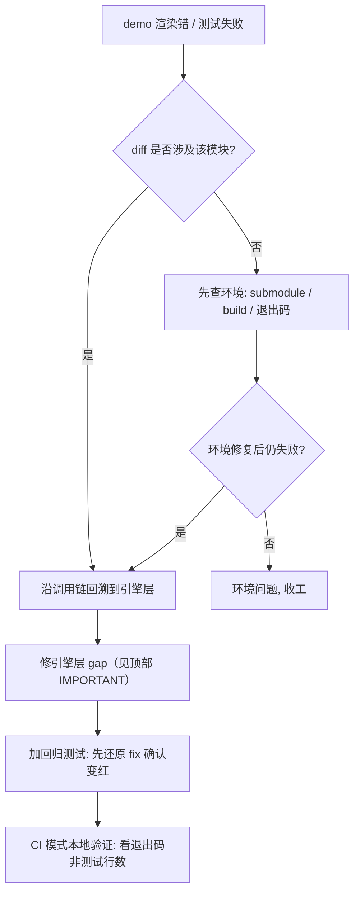

# forgeax-engine-debug

> 渲染 / 测试 / CI 排查的症状索引。每条都是踩实过的真坑，给出**判定信号**与**修法落点**，不复述引擎设计（设计见各 package README + AGENTS.md）。
>
> 基线: [`5c8c90f1`](../../commit/5c8c90f1) (2026-06-03) · 同步至: studio game-template integration (2026-06-17, CSM viewZ 符号 + Skylight 纯色环境光)

> [!IMPORTANT]
> **Demo 渲染错 = 引擎暴露了真实 gap，修引擎不修 demo**（AGENTS.md §Change stance）。在 demo 里塞 1×1 占位 / 手动 rAF / ad-hoc fetch 只会冻结 gap 并误导下一个读样例的 AI。先沿调用链回溯到引擎层，再决定修法。

## 症状速查

| 症状 | 最可能根因 | 跳转 |
|:--|:--|:--|
| 贴图 demo 渲染**纯白方块**（无纹理、无光照梯度） | `paramValues` 里贴图槽是 GUID **字符串**，未解析成 Handle | [§贴图纯白](#贴图纯白) |
| `world.spawn(...).unwrap()` 抛 `spawn-data-unknown-field` / 实体**隐形或灰白**（旧版本静默） | `data` 字段名拼写错或重命名残留（典型 `MeshRenderer { material }` vs schema `materials`） | [§spawn-data-字段名拼写错](#spawn-data-字段名拼写错) |
| 材质静默不生效，控制台 `register<MaterialAsset> failed: ... shader 'X' not registered` | `.pack.json` 里的 shader 标识符是**改名残留** | [§shader 标识符残留](#shader-标识符残留) |
| CI job 失败但**测试断言全过**（`N passed`，无 `failed`） | teardown 期 **unhandled rejection** 把退出码顶成 1 | [§断言全过却-exit-1](#断言全过却-exit-1) |
| 测试只在**新 worktree** 本地失败（`ENOENT` fixture / `Failed to resolve` 包） | submodule 未初始化 / 未 `pnpm build` | [§worktree-本地假失败](#worktree-本地假失败) |
| 贴图在 **hot-reload 后消失**（dev warm-refresh） | vite-plugin-pack DDC 丢失 sourcePath / 写入源树 | [§vite-plugin-pack-ddc-热更新](#vite-plugin-pack-ddc-热更新) |
| 测试只在 **Windows** 失败，CRLF 污染 diff | `.gitattributes` 未强制 LF 或 grep/glob 路径分隔符 | [§windows-兼容性](#windows-兼容性) |
| **天空盒（cubemap）渲染上下颠倒** | skybox.wgsl 含错误的 V-flip | [§天空盒-v-flip](#天空盒-v-flip) |
| **方向光 CSM 阴影完全无遮挡**（diffuse 正常有明暗，shadow 项恒为 1 全亮；`shadowCascade0-3` pass 都在跑、light matrix 有效） | VS 发 `viewZ=-clipPos.w`（负）与正 `splitPlanes` 比较，cascade 选择全压到 layer 0 近 slab → 远处投影出 tile → 越界门返回 1.0 | [§csm-阴影全亮无遮挡](#csm-阴影全亮无遮挡) |
| **方向光完全不投射阴影**（`castShadow` 开着但某些 mesh 不写入 shadow atlas） | mesh 的材质缺少 `ShadowCaster` pass（手写 `MaterialAsset` 只声明了 forward/deferred pass，没加 shadow-caster）——该 mesh 静默不进入 shadow depth pass | [§方向光阴影不出现-castshadow-与-shadowcaster-pass](#方向光阴影不出现-castshadow-与-shadowcaster-pass) |
| **standard 材质冷启动黑几秒 / 无 IBL 处全黑** | 唯一环境光是异步 IBL cubemap 的 Skylight，cubemap 就绪前 ambient=0 | [§ambient-黑到-ibl-加载](#ambient-黑到-ibl-加载) |
| **多 glTF mesh 文档材质错乱**（每节点绑了所有 mesh 的材质） | glTF bridge 未按 meshIndex 过滤材质 | [§gltf-bridge-多mesh材质串](#gltf-bridge-多mesh材质串) |
| **pbr-skin pipeline 创建失败** (`Binding doesn't exist in pbr-mesh-array-bgl` / `Vertex attribute slot 5 not present`) | 标准 PBR pipeline-layout 被 skin shader 错误复用 (L1)；JOINTS_0/WEIGHTS_0 vertex 属性未上传 (L2) | [§pbr-skin-pipeline-build-fail](#pbr-skin-pipeline-build-fail) |
| **skin browser 全黑而 dawn smoke 全绿**（`cube-vbo size=768` 不是 1152；slot 5 missing） | parse-gltf → bridge → mesh-loader → render-data → buildPipelineContext → extract 6 环节有断点 | [§skin-vertex-attribute-chain](#skin-vertex-attribute-chain) |
| **`pnpm -F @forgeax/hello-skin dev` Fox 黑屏**，console `loadByGuid<SceneAsset> failed: AssetError code=asset-not-imported`，但 `smoke` (dawn) 全绿 | fresh worktree 漏 `pnpm build` / 端口被 sibling 占用 / submodule 未 init —— 99% 是环境，先证伪三连 | [§fox-demo-dev-加载报-asset-not-imported](#fox-demo-dev-加载报-asset-not-imported) |
| **skin entity 静止不动**：hasSkin + AnimationPlayer 已挂，但 Fox 维持 bind-pose 静态；clip 时间轴在推、`Transform.world` 在变，画面就是不动 | palette UBO 没接 allocator / record dyn-offset 写死 0 / extract T-21 placeholder 没兑付 / **`MAX_JOINTS` off-by-one 256 vs 16320 BGL cap** / **browser-async pack-fetch 路径 SkinAsset 还没 register 就 instantiate**（`Skin.joints.length=0` + `JointCountMismatchError` 每帧；M2 fixup `e5e68b35` SceneAsset.skinGuids cross-edge 修；旧 silent-skip 改为 `'skin-asset-unresolved'` Result.err fail-fast） | [§skin-entity-静止不动](#skin-entity-静止不动) |
| **FBX 骨骼动画整体扭曲 / 上下颠倒 / 动作乱抽**（bind-pose 关掉 AnimationPlayer 是完美直立人形，一开动画就崩） | FBX 动画提取链 bug：`WriteAnimationData` 直接读 `LclRotation` 原始**欧拉度数**当四元数（runtime slerp 它），且 `GetDstPropertyCount()=1` 只读 X 轴 Y/Z 恒 0；修法是每帧 `EvaluateLocalTransform(t).GetQ()`（需先 `SetCurrentAnimationStack`）—— 与 bind-pose 的 `WalkNode` 同一权威路径 | [§fbx-skin-动画扭曲](#fbx-skin-动画扭曲) |
| `'webgpu-runtime-error'` 300 frame，`detail.error.name=SkinPaletteOverflowError needs=16384 cap=16320` 首帧即报 | `MAX_JOINTS=256 × 64 = 16384 B` 超过 PR #361 立的 `pbr-skin` BGL `@group(2)@binding(1)` 16320 B 容量 | [§skinpaletteoverflowerror-needs-16384-b-exceeds-16320-b](#skinpaletteoverflowerror-needs-16384-b-exceeds-16320-b) |
| Edge 浏览器报 `EngineEnvironmentError: webgpu inner=adapter-unavailable`，全屏黑 | 浏览器配置整体禁了硬件 GL 栈，**不是引擎可修** | [§edge-webgpu-disabled](#edge-webgpu-disabled) |
| wgpu-wasm WebGL2 fallback 路径 `wgpu error: Validation Error` panic（`pbr-pipeline-standard` storage/uniform mismatch · `msaaColor` `DownlevelFlags(VIEW_FORMATS)` · 类似形态） | 引擎在 fallback 路径上漏了 device-cap gate（写死单 axis variant key、graph 层 viewFormats 没按 cap 过滤、texture view-format reinterpret 没 gate） | [§wgpu-wasm-webgl2-fallback-cap-gates](#wgpu-wasm-webgl2-fallback-cap-gates) |
| WebKit 上 mesh SSBO `ceiling 0 B`（伪 `mesh-ssbo-ceiling-reached`），场景全黑 | `downlevel_webgl2_defaults` 设 `maxStorageBufferBindingSize=0`，`growMeshSsbo` 读 0 当真实上限且超容后跳帧 | [§webkit-mesh-ssbo-ceiling-0](#webkit-mesh-ssbo-ceiling-0) |
| WebKit 上 submit 后黑屏 / GPU 死、无任何 onError 事件 | wgpu submit 校验错误走 error-sink 静默投递，JS 侧不可见且无回调接住，GPU 进入不可恢复状态 | [§webkit-submit-黑屏-gpu死](#webkit-submit-黑屏-gpu死) |
| WebKit Channel 3 e2e 探针 `panicked at .../storage.rs: Surface[Id(0,N)] does not exist` + `Unreachable code`，截图全黑（hello-triangle 同 binary 不 panic） | **探针装配 bug 非引擎**：探针跑有限循环后 `main()` 返回，无持久引用 hold renderer → WebKit GC-finalize wasm-bindgen wrapper → 析构 Rust 侧 Surface | [§webkit-probe-renderer-gc-finalize](#webkit-probe-renderer-gc-finalize) |
| CI 上 grep `Vitest unit (PR + main)` 显示在 main push **未跑**；或 `vitest-browser` / `vitest-dawn` 不再嵌在 `primary-pnpm` 内被误以为消失；或 `cache-tsbuildinfo.outputs.cache-hit == 'true'` 失效但 typecheck step 仍 skip | feat-20260616 CI 形态：unit 改 if-gate（main push 用 coverage step 覆盖）+ vitest-browser/dawn 拆独立 job + cache-matched-key 替代 cache-hit（exact-hit + prefix-match 都跳）+ Playwright cache 三 job 共享 key | [§ci-form-2026-06-16](#ci-form-2026-06-16) |
| **GPU 资源（buffer/texture/cubemap）单调增长**——长会话下资源计数持续上升、内存压力累积 | 四族对称释放缺失：A 族 store 无 per-handle evict、B 族 instance buffer delete 不 destroy、C 族 transient resize 后旧尺寸 stranded、D 族 handleToId 分配器已消除（feat-20260622，嵌套 WeakMap） | [§gpu-resource-单调增长](#gpu-resource-单调增长) |

---

## 贴图纯白

**信号**：textured demo（learn-render 贴图章节 / hello-room 类）渲染成均匀白方块，无纹理细节、无光照明暗。材质注册成功、无报错。

**根因**：demo 把 `.pack.json` 的 `paramValues` 原样塞进 `register<MaterialAsset>`，其中 `baseColorTexture` / `metallicRoughnessTexture` 是 **GUID 字符串**。但 render-system 的 extract 阶段只在槽值 `typeof === 'number'`（已解析的 numeric `Handle`）时才绑定贴图——字符串落到 1×1 白色占位视图。

**判定**：grep extract 阶段的类型守卫确认契约。
```bash
grep -n "typeof pv.baseColorTexture === 'number'" packages/runtime/src/render-system-extract.ts
```

**修法**：demo 用 `loadByGuid<TextureAsset>` 取回的 **handle**（`res.value`）替换 paramValues 里的字符串 GUID；贴图加载失败时**丢弃该槽**（回退占位，而非塞字符串）。

```ts
for (const [k, v] of Object.entries(paramValuesIn)) {
  if (k === 'baseColorTexture') {
    if (!diffuseRes.ok) continue;       // drop slot -> 1x1 placeholder
    filteredValues[k] = diffuseRes.value; // resolved numeric Handle
    continue;
  }
  // ... 同理 metallicRoughnessTexture
  filteredValues[k] = v;
}
```

> [!CAUTION]
> `Handle<T>` 是 branded `number`（`packages/types/src/handle.ts`）。pack JSON 只能存字符串 GUID，所以"pack → 运行时"之间**必须**有一次 `loadByGuid` 解析。注释写"GUID 在 extract 时解析"是**错的**——extract 不解析字符串，只认 number。

---

## spawn-data 字段名拼写错

**信号**：`world.spawn(...).unwrap()` 抛 `Error: <Component>: spawn data carries unknown field. code: spawn-data-unknown-field`，或 `commands.spawn` 在系统里同步 throw。bug-20260615 之前同样的 typo 是**静默丢弃**——实体生成出来但渲染隐形/灰白，看着像图形 bug。

**根因**：`fillComponentDefaults` 走的是 `Object.keys(schema)`，从来不看调用者传的 `raw` 键，所以未声明字段直接落进默认值路径。最常见踩中的是单复数重命名残留（典型 `MeshRenderer { material: h }` 旧名单数 → schema 已改 `materials: array<...>` → 槽是空数组 → extract 走 `defaultMaterialSnapshot` mid-grey）。

**判定**：报错信息里 `.detail.knownFields` 已列出该组件的合法字段白名单，比对 `data` 字面量。
```bash
# 反查 schema 字段
grep -n "defineComponent('<ComponentName>'" packages/runtime/src/components/*.ts
```

**修法**：把 `data` 里的 typo 字段改成 schema 名字；如果是真的"组件改名了"，沿调用链所有 spawn 点一起改（搜 `component: <Name>, data: {`）。`commands.spawn` 路径 throw 在 system body，stack frame 直接指向调用站。

**适用范围**：`world.spawn` / `world.addComponent` / `SceneAsset.instantiate`（含 `.pack.json` SceneEntity components）/ `Commands.spawn` / `Commands.addComponent`。`fillComponentDefaults` 公共 helper **不**校验（保持 pure，校验集中在 spawn 边界）。

---

## shader 标识符残留

**信号**：控制台 `register<MaterialAsset> failed: asset-invalid-value pass[0] references shader 'forgeax::X' which is not registered`。材质注册失败 → 走无材质回退（常表现为黑 / 白）。

**根因**：引擎重命名了内置 shader 标识符（如 `forgeax::default-pbr-forward` → `forgeax::default-standard-pbr`），但散落在各 demo `assets/*.pack.json` 的 `passes[].shader` 字段是**手写常量**，改名时漏改。读 pack `shader` 字段的 demo 才会触发；硬编码正确标识符的 demo（如 hello-room main.ts）即使 pack 残留也无感——是潜伏雷。

**判定**：列出全仓引用 vs 实际注册的标识符，找差集。
```bash
# 谁注册了 material shader（manifest 入口）
grep -rn "reservedIdentifier:" packages/vite-plugin-shader/src/index.ts
# 谁还在引用某个标识符
grep -rln "forgeax::<旧名>" apps/ packages/ | grep -v node_modules | grep -v dist
```

**修法**：把所有 `.pack.json`（含看似无感的 hello-room）的残留标识符一次性改到当前注册名。改完再 grep 一遍确认零残留。

---

## 断言全过却 exit 1

**信号**：CI job 红，但日志里 `Test Files N passed`、`Tests M passed`，**无 `failed`**。常见尾部：`Vitest caught K unhandled errors` + `Unhandled Rejection`。

**根因**：测试断言全绿,但某处 **Promise 在 teardown 期 reject 且无人 catch** → vitest 计为 unhandled error → 进程退出码 1。本仓实战例：`rhi-webgpu` 的 `createShaderModule` 里 `await getCompilationInfo()` 未防护「device 在 await 期间被销毁」——headless swiftshader 上 reject 成 `OperationError: Instance dropped`，从测试文件间的 GPU teardown 逃逸。

> [!IMPORTANT]
> **永远看退出码,不要只数测试行**。`grep "Tests.*passed"` 看到全过就放行是这次最大教训——`echo $?` / 末尾的 `exit code 1` 才是 gate 真相。本地 chrome-beta 常**不复现** headless 环境的 teardown 竞态,所以本地全绿 ≠ CI 会绿。

**判定**：
```bash
CI=1 pnpm test:browser; echo "EXIT: $?"          # 退出码是真相
grep -aE "Unhandled|Instance dropped|OperationError" <log>  # 逃逸源
```

**修法**：在引擎层把"teardown 期可能 reject 的 await"包 try/catch,走既有 graceful-degradation 路径返回 ok（charter proposition 9）。修异步逃逸点时同步加回归测试——用 mock 让该 Promise reject,断言外层 resolve 而非 reject,并**先还原 fix 确认测试变红**再定稿。

```ts
let info: GPUCompilationInfo;
try {
  info = await handleWithInfo.getCompilationInfo();
} catch {
  return ok(handle as unknown as ShaderModule); // instance dropped mid-await
}
```

---

## worktree 本地假失败

**信号**：在新建 worktree 里跑测试,出现下列任一,但 main 主工作树正常：
- `ENOENT: ... forgeax-engine-assets/.../X.meta.json`（fixture 缺失）
- `Failed to resolve entry for package "@forgeax/engine-vite-plugin-shader"`（包未构建）

**根因**：worktree 是**干净 checkout**——submodule 未初始化、`dist/` 未生成。与代码改动无关。

**判定 + 修复**：
```bash
git submodule status forgeax-engine-assets   # 前缀 '-' = 未初始化
git submodule update --init forgeax-engine-assets
pnpm install && pnpm build                    # 生成所有 dist/（.mjs + .d.ts）
```

> [!TIP]
> 判断"失败是我引入的还是环境的"：`git diff --name-only main...HEAD` 看失败包是否在你的 diff 里。不在 → 几乎必是环境(submodule / build / 缓存),先修环境再下结论。

---

## vite-plugin-pack DDC 热更新

**信号**：`pnpm dev` 后在浏览器刷新页面,某些贴图消失（白色/黑色）。或者源目录里莫名出现大量 `.bin` 文件,不被 git 追踪。

**根因**：三项按时间线递进：

| 问题 | 提交 | 表现 |
|:--|:--|:--|
| `sourcePath` 被覆盖 | `5b032fd0` | dev cook 把 cooked row 的 `sourcePath` 写成了 `.bin` 路径,warm-refresh 时丢失原始源路径 → 贴图查找失败 |
| `.bin` 写入源树 | `48ba705b` | dev DDC 写入源文件旁边（`${sourcePath}.<guid>.bin`）,源在 `forgeax-engine-assets` submodule 时每次 `pnpm dev` 往 submodule 工作树灌 ~70 `.bin`（~317 MB） |
| 命名不一致 | `e42b1541` | "bin cache" 重命名为 DDC（Derived Data Cache）,路径统一到 `node_modules/.cache/forgeax-ddc/` |

**判定**：
```bash
# 源树里不该有任何 co-located .bin 文件
find packages/ apps/ -name "*.bin" -not -path "*/node_modules/*" -not -path "*/dist/*"
# DDC 应全部在 node_modules/.cache/forgeax-ddc/
ls node_modules/.cache/forgeax-ddc/
```

**修法**：用当前最新。DDC 已迁移到 `node_modules/.cache/forgeax-ddc/`,`sourcePath` 在 warm-refresh 时保持原始路径。如遇热更新贴图丢失,先检查 `node_modules/.cache/forgeax-ddc/` 是否存在旧版 artifact——清空后重启 `pnpm dev`。

---

## Windows 兼容性

**信号**：测试在 Windows 上失败（`≠` 断言值 / `ENOENT: no such file or directory` / grep gate 找不到应命中行）,但 macOS / CI Linux 全过。

**根因**：三项叠加：
- **CRLF 行尾** — `core.autocrlf=true` 使 checkout 时 `\n` → `\r\n`,biome 再 normalize 回 LF 产生全量 diff（由 `449515d6` 的 `.gitattributes` `* text=auto eol=lf` 根除）
- **路径分隔符** — grep/glob 脚本使用 Unix `paths.join()` 在多处,Windows `\` 不匹配 `/`（由 `3da96cbb` 修复 12 处 test + 6 处 grep/glob/路径解析）
- **路径空格/大小写** — 部分脚本假设路径无空格、盘符大小写一致

**判定**：
```bash
# 检查是否强制 LF（git clone 后）
git config core.autocrlf          # 应为 false 或不输出
file <source.ts>                   # ASCII text / UTF-8, 无 "CRLF"
# Windows 上的测试失败
pnpm test:unit 2>&1 | grep -E "FAIL|≠|no such file"
```

**修法**：
1. 确保 `.gitattributes` 存在且首行为 `* text=auto eol=lf`
2. 在 Windows 新工作树：`git config core.autocrlf false && git checkout .`
3. 如仍有路径分隔符问题,bump 到当前（`3da96cbb` 已修复所有已知路径相关 crash）

---

## 天空盒 V-flip

**信号**：天空盒（skybox）渲染出来的 cubemap **上下颠倒**——山的倒影在天顶,地面纹理在下方。

**根因**：`skybox.wgsl` 的 fragment 阶段对采样方向做了一次多余的 **V-flip**（`ndcY = -ndcY`）。常见于从 OpenGL 的 `texture(skybox, dir)` 直接搬运的 skybox shader——OpenGL 的 cubemap 采样 Y 轴与 WebGPU/WGSL 的 `textureSample` 不同。正确实现直接取 `uv` 计算 view direction,不 flip。

**判定**：
```bash
# 只要 skybox.wgsl 里有 -ndcY、-1 * uv.y * 2 之类的 V-flip 就是根因
grep -n "ndcY\|uv.y\" packages/shader/src/builtin/skybox.wgsl
```

**修法**：用当前最新 `skybox.wgsl`。如果手写自定义 skybox shader,**不要 V-flip 采样方向**——WGSL `textureSample` 的 cubemap 坐标系统与 OpenGL 相反。

---

## CSM 阴影全亮无遮挡

**信号**：方向光 + standard PBR（每材质带 `ShadowCaster` pass）场景**完全没有阴影**——diffuse 明暗正常（受光面/背光面对），唯独 shadow 项死掉。debug 采样所有点 `shadowFactor === 1.000`（全亮），即便正对太阳的遮挡点下方。`r.perFramePassNames` 含 `shadowCascade0-3`（CSM pass 在跑）、`r.directionalShadow.lightSpaceMatrix` 有效。

**根因**：**cascade 选择的 `viewZ` 符号不匹配**。VS 发 `out.viewZ = -clipPos.w`（相机前方为**负**——这是 cluster Z-slice 路径也依赖的故意约定），但 `pssmSplit` host 端产出**正**的 view-space split 深度。`_pickCascadeLayer` / `cascadeBlend` band 数学拿原始负 `viewZ` 跟正 `splitPlanes` 比 → 每个可见 fragment 都落进 cascade 0 的近 slab（约 0.1~1 单位深）→ 几单位外的物体投影出 [0,1] tile → `lighting-directional.wgsl` 的 NaN-safe 越界门返回 `1.0`（全亮）。整个 frame 看起来全受光。

**判定**：
```bash
# 看 cascade 选择是否拿带符号的 viewZ 直接跟 splitPlanes 比（未转正深度）
grep -n "viewZ\|viewDepth\|splitPlanes" packages/shader/src/lighting-directional.wgsl
# VS 端确认 viewZ 是负的（-clipPos.w）—— 这是对的，别改 VS
grep -n "out.viewZ" packages/shader/src/default-standard-pbr*.wgsl
```
关键陷阱：单测 `shadow-csm-shader.dawn.test.ts` 内嵌的 kernel 若复刻了**正** `viewZ` 直接比较，会复制 bug 并永绿——测试必须喂生产用的**负** `viewZ`。

**修法**：在消费侧转一次 `viewDepth = -viewZ`，让 `_pickCascadeLayer` + blend band 都是正比正（VS 的负 viewZ 约定不动，cluster 路径不受影响）。源码 SSOT `packages/shader/src/lighting-directional.wgsl`；split 计算 `packages/runtime/src/render-system-extract.ts` `pssmSplit`。

---

## 方向光阴影不出现（castShadow 与 ShadowCaster pass）

**信号**：场景有 `DirectionalLight`（`castShadow` 未设或为 `true`），`perFramePassNames` 含 `shadowCascade0-3`（shadow depth pass 在跑），但某个（或全部）mesh **完全不投射阴影**——其他 mesh 的阴影正常，或被遮挡面全亮。

**根因（两候选，按常见顺序排）**：

| 排序 | 根因 | 判定 | 修法 |
|:--|:--|:--|:--|
| **R1** | `DirectionalLight.castShadow` 被手动设为 `false` | `world.get(lightEntity, DirectionalLight).unwrap().castShadow === false` | 删掉 `castShadow: false`（走默认 true）或显式改回 `castShadow: true`。合并后（feat-20260621）shadow 字段全在同一个 `DirectionalLight` 组件上，不需要第二个组件 |
| **R2** | mesh 的材质缺少 `ShadowCaster` pass——depth-only shadow pass 靠 `passKind='shadow-caster'` 筛选 entity；`Materials.standard(...)` 工厂自动产出该 pass，但手写 `MaterialAsset` 字面量如果只写了 `forward` / `deferred` pass，该 mesh 静默不进入 shadow depth pass | `material.passes` 数组里没有 `passKind='shadow-caster'` 的条目 | 在 `passes[]` 里加 `{ name: 'ShadowCaster', shader: 'forgeax::default-standard-pbr' }`，或改用 `Materials.standard(...)` 工厂构造材质。详见 [`forgeax-engine-material`](../forgeax-engine-material/SKILL.md) §材质工厂 |

**背景**：`DirectionalLight.castShadow` 是**灯侧开关**——控制引擎是否跑 shadow depth pass（populate shadow atlas）。ShadowCaster pass 是**材质/渲染侧开关**——控制某个 mesh 是否被画进该 atlas。两个条件必须同时满足才有阴影。`castShadow` 默认 `true`（合并后 zero-config 即开），所以 R1 只在手动改 `castShadow: false` 时触发。R2 在手写材质时最常见——忘记加 ShadowCaster pass，看着灯光、看着 shadow pass 在跑，就是没阴影。

**不要**：在 demo 里把 mesh 的 material 换回 unlit 绕开问题——那只是躲，下一个 standard mesh 一样踩。素材质的 `passes[]` 数组才是 SSOT。

**相邻条目**：
- 同症状但全场景阴影全无（不是个别 mesh 没阴影）：见 [§CSM 阴影全亮无遮挡](#csm-阴影全亮无遮挡)（viewZ 符号不匹配）
- 材质工厂用法：[`forgeax-engine-material`](../forgeax-engine-material/SKILL.md) §规范调用顺序

---

## ambient 黑到 IBL 加载

**信号**：只挂 `DirectionalLight` 的 standard 场景**冷启动黑几秒**后才亮；或在 IBL float-texture 不可用处（如 WKWebView desktop）持续偏黑。新游戏（永远冷启动）必现多秒黑屏。

**根因**：唯一的环境光来源是 `Skylight`，而它过去**强制要 cubemap** 且经 `uploadCubemapFromEquirect` **异步** GPU 预计算（equirect→cube→irradiance 卷积→prefilter→BRDF LUT，冷启动几秒）。cubemap 就绪前 fallback irradiance cube 是全零 → ambient = 0。PBR shader 里**没有**任何常数/纯色环境项。

**判定**：
```bash
# PBR ambient 是否纯 IBL 派生（无常数项）
grep -n "ambient" packages/shader/src/default-standard-pbr.wgsl
# Skylight 是否支持无 cubemap 的纯色模式（cubemap 字段是否可选）
grep -n "cubemap\|colorR\|intensity" packages/runtime/src/components/skylight.ts
```

**修法**（引擎已支持，别在 demo 里塞常亮 PointLight 当 crutch）：spawn **无 cubemap 的 Skylight** 拿即时纯色环境光——`world.spawn({ component: Skylight, data: {} })`（白）或带 `colorR/G/B` + `intensity` 调色调强。引擎绑 1×1 白 fallback irradiance cube，首帧即 `ambient = kD·albedo·color·intensity`，零 async；给了 cubemap 才升级完整 IBL。源码 SSOT `packages/runtime/src/components/skylight.ts` + `packages/runtime/src/ibl/skylight-bind-group.ts`（白 fallback）。详见 [`forgeax-engine-material`](../forgeax-engine-material/SKILL.md) §踩坑。

---

## glTF bridge 多 mesh 材质串

**信号**：一个 glTF 文件含多个 mesh（每个 mesh 各有自己的材质槽）,导入后**不同 entity 绑定了所有 mesh 的材质合集**,而非各自 mesh 的材质。单 mesh 文件无感;多 mesh 文件（如含附件的小场景）渲染出来材质错位 / 全黑。

**根因**：`gltf/src/bridge.ts` 的 B1 路径遍历的是展开后的 `doc.meshes`（所有 `(gltf-mesh, primitive)` 元组平列表）,未按 node 的 mesh index 过滤。每个 node 收集材质时拿到的是全局拼接,而非自己 mesh 的 `primitives`。提交 `42c3335e` verifier 发现并修复。

**判定**：
```bash
# 检查 bridge.ts 的 B1 路径是否有 meshIndex 过滤逻辑
grep -n "meshIndex" packages/gltf/src/bridge.ts
# 上一行应该出现 filter——如果只有 meshIr.meshIndex 的赋值而无对照 filter,还是旧代码
```

**修法**：bump 到 `42c3335e` 之后。当前 bridge 里 `MeshIr.meshIndex` 记录了所属 glTF mesh 索引,B1 路径用 `meshIr.meshIndex === ir.meshIndex` 过滤,每个 node 只拿自己 mesh 的材质。

---

## pbr-skin pipeline build fail

**信号**：浏览器 console 出现下列一条或多条（按出现顺序，越靠前越接近 root）：

```
1) Binding doesn't exist in [BindGroupLayoutInternal "pbr-mesh-array-bgl"].
   - While validating vertex stage [ShaderModule "module-forgeax::pbr-skin#..."]
   - While calling [Device].CreateRenderPipeline([RenderPipelineDescriptor "pbr-pipeline-forgeax::pbr-skin"])
2) Vertex attribute slot 5 used in [ShaderModule "module-forgeax::pbr-skin#..."]
   is not present in the VertexState.
3) RhiError: limit-exceeded ... Invalid RenderPipeline "pbr-pipeline-forgeax::pbr-skin" is invalid due to a previous error.
4) [Invalid CommandBuffer from CommandEncoder "render-system-frame"] is invalid due to a previous error.
```

`(3)` + `(4)` 是 **后果**，不是根因。先 grep 之前的 `(1)` / `(2)` —— 那才是 GPU validation 拒绝 pipeline 的真原因。

**判定**：用 Playwright probe 拦 `device.createRenderPipeline` + `dev.addEventListener('uncapturederror')`，把 `[gpu-uncapturederror]` 信息打到 console。dawn smoke 永远抓不到这条 —— 它走 `gltfDocToSceneAsset` -> `register(handle)`，整条 WebGPU validation 路径不触达。范本：`apps/hello/skin/scripts/smoke-browser.mjs`（bug-20260611）。

**根因 + 修法分两层**：

| Layer | 根因 | 修法 | 状态 |
|:--|:--|:--|:--|
| **L1 BGL shape** | `forgeax::pbr-skin` shader 在 `@group(2)` 用 binding 0 (meshes) + binding 1 (palette)，但 pipeline 创建时拿到了 standard PBR 的 `pbr-mesh-array-bgl`（仅 binding 0）。`selectPipelineLayoutForVariant` 没有 skin 分支 | `pbr-pipeline.ts buildPbrSkinLayouts()` 出 2-binding mesh-array BGL；`PipelineState.pbrSkinPipelineLayout` slot；`selectPipelineLayoutForVariant` 接受 `LayoutKind = 'pbr-skin'`；`render-system-record` 把 `materialShaderId='forgeax::pbr-skin'` 透到 `buildPipelineContext` | bug-20260611 已修 |
| **L2 vertex attributes** | `gltfImporter` 不提取 JOINTS_0 / WEIGHTS_0 accessor；mesh 上传写死 `BUILTIN_FLOATS_PER_VERTEX = 12` (4-attribute 12-float interleave)；`buildPipelineContext` 也硬编码 4-attribute vertexBuffers。skin shader 申明 slot 4 (skinIndex) + 5 (skinWeight) 在 GPU 端找不到对应 vertex attribute | feat-20260611 已修：`parse-gltf` MeshIr 含 `skinAttrs?: { skinIndex, skinWeight }`；bridge 写 18F (12 + 4 idx + 4 weight) 当 skinAttrs 在；mesh-loader 双契约 + render-data layout `'12F'\|'18F'`；`buildPipelineContext` 走 `deriveVertexBufferLayout(map)`；extract 校验 mesh 18F 与 material `pbr-skin` 同进同退 | bug-20260611 + feat-20260611 已修 |

**调用链回溯**：
```
render-system-record:3539  materialShaderId = entry.skin !== undefined ? SKIN_MATERIAL_SHADER_ID : ...
  ↓
createRenderer.ts buildAndCachePipeline(materialShaderId)
  ↓
buildPipelineContext(variantSet, materialShaderId)
  ↓
selectPipelineLayoutForVariant(state, variantSet, layoutKind = 'pbr-skin')
  ↓
state.pbrSkinPipelineLayout    ← L1 修这里，2-binding mesh-array BGL
   +
ctx.vertexBuffers              ← L2 修这里，扩 6-attribute layout
```

**Don't**：在 demo 里 fallback 到 unlit material 绕过 skin shader —— 那只是把 gap 冻结到下一次有人尝试 skin。

---

## skin vertex attribute chain

**信号**：browser console 报 `Vertex attribute slot 5 used in [ShaderModule "...pbr-skin..."] is not present in the VertexState`，或 `cube-vbo size=768 (16 vertices x 48B stride)` 而 skin shader 实际期望 72B stride。dawn smoke `frames=300 PASS` 但 browser 全黑。

**根因链**：skin 渲染要求 4 个独立环节同时让 JOINTS_0 / WEIGHTS_0 数据贯通：

```
parse-gltf MeshIr.skinAttrs (Float32Array x2)
  -> bridge.ts 18F interleave (4 pos + 4 normal + 4 uv + 4 idx + 4 weight)
  -> mesh-loader dual contract (Float32Array AND number[] both produce skin slots)
  -> render-data layout '12F' | '18F' + gpu-resource-store divisor=18
  -> buildPipelineContext deriveVertexBufferLayout(map) (no hardcode)
  -> render-system-extract fail-fast: 18F mesh ↔ pbr-skin material co-presence
```

任何一环掉头：dawn smoke 过 (`gltfDocToSceneAsset -> register(handle)` 不走 dev-server pack-body)，browser 红。

**判定**：跑 `apps/hello/skin/scripts/smoke-browser.mjs` (`smoke:browser`) layer-3 探针。它拦截 `device.createBuffer` + `queue.writeBuffer` 比对 cube-vbo `size = vertexCount × 72`（18F skinned）vs `× 48`（12F unskinned），并统计 `device.createRenderPipeline` 中 `pbr-skin` 变体数量。layer-3 GREEN = 21 pipelines + 1 skin variant + 18F VBO ctor=Float32Array byteLength=1152。

**修法 pointer**：见上面 §pbr-skin pipeline build fail 表格 L2 行；feat-20260611 把 6 个文件一次性接通，不要试图只动其中一个（如只在 buildPipelineContext 加 `'18F'` 而不动 mesh-loader / parse-gltf）—— 浏览器仍会因上游 16 顶点 × 12F = 768B VBO 而 slot 5 = oob。

**Don't**：用 dawn smoke 的 PASS 当作 skin 链路 OK 的证据。dawn 永远绕过 dev-server pack-body 序列化和 WebGPU validation，凡 typed-array survival / BGL shape mismatch / vertex-attribute presence 必走 browser layer-3 (AGENTS.md §Smoke gate)。

---

## fox demo dev 加载报 asset-not-imported

**信号**：`pnpm -F @forgeax/hello-skin dev` 后，浏览器 console 红：

```
[skin] loadByGuid<SceneAsset> failed: AssetError code=asset-not-imported
  expected="import transport to fetch pack for GUID 019eb2ce-..."
```

Fox 不渲染（黑屏 / 占位 cube）。但 `pnpm -F @forgeax/hello-skin smoke` (dawn-node) **全绿**——`frames=300 PASS`、`pixelDelta≈0`。

**根因 ranking**：99% 是环境层假象，src 真坑极少。**先按 H-env-1/2/3 证伪三连**，全否定后才走 bisect。

| 排序 | 假说 | 体感信号 |
|:--|:--|:--|
| **H-env-1** | fresh worktree 没跑 `pnpm build`；`@forgeax/engine-gltf` 缺 `dist/index.mjs` → vite optimizeDeps crash → dev server 实际没起来，浏览器看的是上一次 sibling worktree 的 vite 残留 | vite stderr 含 `Failed to resolve entry for package "@forgeax/engine-gltf"` |
| **H-env-2** | `localhost:5173` 被另一 worktree 的 `pnpm dev` 占着，浏览器加载的是别的 demo 页 | 不带 `--strictPort` 时 vite 静默用 5174/5175；浏览器 tab title 不是 hello-skin |
| **H-env-3** | `forgeax-engine-assets` submodule 未 init —— Fox.glb / `*.meta.json` sidecar 缺 → vite-plugin-pack 没把 GUID 折进 `pack-index` → loadByGuid fail-fast | `git submodule status forgeax-engine-assets` 前缀 `-` |
| H-src（少见） | 真 import / loader 链 bug | 仅当 H-env-1/2/3 全否定后才考虑；走 `git bisect` |

**判定 + 修法**（按顺序逐条排除）：

```bash
# 1) H-env-1 — 看 vite stderr 是否有 optimizeDeps crash
pnpm -F @forgeax/hello-skin dev --strictPort 2>&1 | head -50
# 如有 "Failed to resolve entry for package ..." → 跑根 build：
pnpm build                                    # tsup .mjs + tsc -b .d.ts，两者必须都出
pnpm -F @forgeax/hello-skin dev --strictPort  # --strictPort 让端口冲突立即报错而非静默换端口

# 2) H-env-3 — 确认 submodule
git submodule status forgeax-engine-assets    # SHA 应非全 0、前缀非 '-'
git submodule update --init forgeax-engine-assets

# 3) fresh worktree 必需的 wgpu_wasm 拷贝（与本症状相邻常并发）
cp <main-tree>/packages/wgpu-wasm/pkg/wgpu_wasm_bg.wasm packages/wgpu-wasm/pkg/

# 4) 跑 smoke:browser 的 /__import positive probe（feat-20260612 M3 落地）
pnpm -F @forgeax/hello-skin smoke:browser     # 期望 importProbeHits ≥3，kindUnion 含 'scene'
```

**闸门**：`apps/hello/skin/scripts/smoke-browser.mjs` 在 bug-20260612 M3 加了 `/__import` positive probe——拦截 dev-server 的 import transport 命中，若 `hits<3` 或 `kindUnion` 不含 `scene` 即红。FALSIFY 模式（人为把 vite-plugin-pack 的 `roots=[]` 清空 / 删 sidecar）下必红。dawn smoke 走 `gltfDocToSceneAsset -> register(handle)` 整条绕过 dev-server pack-body fetch，所以**永远不会**抓到此症状。

**相邻条目**：
- 同型上游错配盲区：[§worktree-本地假失败](#worktree-本地假失败)（H-env-1/3 cousin，submodule + build 不到位）
- 同体感的 host-side 假象：[§edge-webgpu-disabled](#edge-webgpu-disabled)（先验环境，再修引擎）
- dawn 假绿盲区基类：[§skin-vertex-attribute-chain](#skin-vertex-attribute-chain)（dawn smoke 不触达 dev-server pack-body 的另一证据）

**审计**：完整 7-GUID HTTP 实证 + browser e2e + bisect 全证伪在 floating-clone harness 仓 `forgeax-loop/bug-20260612-skin-fox-loadbyguid-asset-not-imported-in-dev/`（M1 root-cause witness）。PR [#368](https://github.com/ForgeaX-Games/forgeax-engine/pull/368)。

> [!CAUTION]
> 看到 `asset-not-imported` 不要立刻去翻 `asset-registry.ts:3138` 的 fail-fast 分支——那是**正确**行为（shipped form / DDC miss 时严格失败，AGENTS.md §Error model）。先证伪环境三连，再证伪 dev-server transport，最后才考虑 src bug。

---

## skin entity 静止不动

**信号**：`apps/hello/skin` 三只 Fox 在浏览器里维持 bind-pose 静态；`hasSkin === true`、`AnimationPlayer` 时间轴在推、`advanceAnimationPlayer` 把 joint TRS 写进了 `Transform`、`propagateTransforms` 把 `Transform.world` 烘出来了——但画面就是不动。dawn smoke `frames=300 PASS` 同样观察不到该症状（因为 dawn smoke 不读 palette buffer 字节）。

**根因 ranking**（按 PR #361 → feat-20260612 的 4 个 milestone 修法落点排）：

| Layer | 根因 | 修法落点 | feat-20260612 兑付 |
|:--|:--|:--|:--|
| **L1** | palette UBO 仍是 PR #361 留下的 16320 B identity-mat4 静态 stub（`skinPaletteIdentityBuffer`），allocator 没接进 `PipelineState`，每帧 vertex shader 拿到同一份 identity | 删 stub；`createRenderer` 启动期 `createSkinPaletteAllocator(device, 16320)` 挂 `PipelineState.skinPaletteAllocator`；record-stage 从 allocator 取 buffer | M1 m1-2 / m1-3 |
| **L2** | extract `hasSkin` 段 T-21 placeholder 写死 `skinSlice = { jointCount: 0, byteOffset: 0 }`，没调 `allocator.allocateSlice` / `writeJointPalette` | `extractFrame` 入口 `allocator.resetForFrame()`；per-skin entity 调 `allocateSlice(jointCount) → writeJointPalette(slice, ibms, jointWorlds)`；`jointWorlds` 直读 `Skin.joints[i]` entity 的 `Transform.world` view | M2 m2-6 |
| **L3** | record-stage `group2DynamicOffsets[1]` 写死 `0`，多 skin entity 共享 palette[0..255]；只有第一只 Fox 的数据进 vertex shader | `group2DynamicOffsets[1] = entry.source.skin.byteOffset`；多 entity 各自 slice 不互覆盖 | M3 m3-2 |
| **L4** | `MAX_JOINTS = 256` off-by-one：`256 × 64 = 16384 B` 超过 BGL `@group(2)@binding(1)` 16320 B cap，第一帧 `allocateSlice` 即抛 `SkinPaletteOverflowError` 整路径走不通 | `MAX_JOINTS = 255` 与 PR #361 BGL 容量对齐；255 × 64 = 16320 等号成立 | M4 hotfix |

**判定**：跑 `pnpm -F @forgeax/hello-skin smoke` 看 m4-4 dawn smoke 注入的 globalThis palette readback 计数器：

```bash
pnpm -F @forgeax/hello-skin smoke 2>&1 | grep -E "paletteWrites|distinctFullHash"
# 期望：paletteWrites >= 900（300 frame × 3 Fox）；distinctFullHash >= 3（三 Fox / 三 clip 的 mat4 各异）
# 全 0 / distinctFullHash=1 → 上面 L1/L2/L3 任一未兑付
```

浏览器层用 `apps/hello/skin/scripts/smoke-browser.mjs`（M4 m4-1..m4-3）：拦截 `device.queue.writeBuffer` 抓 palette buffer 字节，跨帧 hash 互异。FALSIFY 模式（人为短路 `writeJointPalette` 写 identity）必红。

**修法 pointer**：feat-20260612 已把 4 层一次性接通；如再次出现，先按 L1→L4 顺序 grep `git log` + 检查 `git grep -n 'skinPaletteIdentityBuffer'` 是否复活。

引 PR #TBD（finalize 后 backfill）。

**Don't**：在 demo 里塞手动 rAF mutation 假装 joint 在动 / 强制重 spawn entity 绕过 allocator——这正是 PR #361 留下 stub 的形态，下一只 Fox 进来又复发。沿调用链走到 4 个 milestone 的落点修。

---

## fbx-skin 动画扭曲

**信号**：`apps/hello/fbx-skin`（humanoid.fbx，80 joints，clips run/punch/shot）能渲染但**整体扭曲、上下颠倒、动作乱抽**。无 onError，dawn smoke 全绿。

**先分层证伪 —— bind pose vs 动画**（交接文档 §逐层闸门协议，charter F2 image-untrustworthy）：临时关掉 `AnimationPlayer`（demo 里 `if (clip && !DEBUG)`），截图。
- **bind pose = 完美直立人形** → 骨架 / IBM / 蒙皮权重 / 坐标转换 / palette / shader 全对，缺陷 100% 在**动画提取链**（本症状）。
- bind pose 也扭 → 是 IBM / 列序 / 单位 / `M_i = jointWorld × IBM` 顺序，走 [§skin-vertex-attribute-chain] / hello-skin 家族。

**根因（FBX 动画提取链两个叠加 bug，皆在 `@forgeax/engine-fbx`）**：
1. **欧拉度数当四元数**：`binding.cc::WriteAnimationData` 读 `LclRotation` 曲线原始值（**欧拉角度数**），bridge 打包成 `[x,y,z,1]`，runtime `sampleChannel` 见 `elementCount===4` 当四元数 slerp。实时数据特征：rotation output `[62.93, 0, 0, 1]`（单位四元数分量不可能 >1）。
2. **只读 X 轴**：`GetDstPropertyCount()` 对这些 curve node 返回 1，Y/Z 曲线永不读 → 全 channel 的 Y/Z 槽位恒 0。

**判定**（绕开 vite，直接打 native addon）：
```bash
cd packages/fbx
node -e "const b=require('./build/Release/fbx_binding.node');const d=JSON.parse(b.parseFbx('<abs>/forgeax-engine-assets/vendor/fbx-test/humanoid.fbx'));
const c=d.clips[0];for(const ch of c.channels){if(ch.property==='rotation'&&ch.targetNode.endsWith('Hips')){console.log(ch.keyValues.slice(0,8));}}"
# 坏：[62.93, 0, 0, 1, ...]（欧拉度数）  好：[0.2, 0.031, -0.022, 0.979, ...]（单位四元数）
```

**修法**：`WriteAnimationData` 改成每个 key time 采样 `node->EvaluateLocalTransform(t)` 再 `GetT/GetQ/GetS` 分解 —— 与 bind-pose 的 `WalkNode` **同一条权威路径**，输出真四元数（SDK 自己处理旋转顺序 / pre-post-rotation / pivot）。
- **必须先 `scene->SetCurrentAnimationStack(animStack)`** —— 否则 `EvaluateLocalTransform(t)` 无视时间，永远返回 rest pose（数据全 identity/zero 就是漏了这句）。`WalkNode` 侥幸不需要是因为 rest pose == bind pose；二者顺序安全：`SceneToJson`（含 WalkNode）在 `WriteAnimationData` 之前跑完。
- IR schema 顺势从 per-axis `keyTimesX/Y/Z` 收成扁平 `keyTimes` + 交错 `keyValues`（stride 3 T/S，4 rotation quat）—— SSOT，结构上消灭单轴 bug。bridge 重采样 + 四元数 nlerp 归一化；符号跨相邻 key 规范化保短弧连续。

**坑（验证时极易踩）**：
- **native 改完必须 `node-gyp rebuild`**：`FBX_SDK_ROOT=$HOME/.local/fbxsdk/current npx node-gyp rebuild`（SDK 在则可重建；否则 postinstall graceful-skip）。
- **dist 陈旧陷阱**：`@forgeax/engine-fbx` 解析到 `dist/index.mjs`，改 `parse-animation-clip.ts` 后**必须 `pnpm --filter @forgeax/engine-fbx build`**，否则浏览器拿旧 schema 读不到 `keyValues` → 全 identity，看着像没改对。
- **vite 全程缓存 import 结果**：`SetCurrentAnimationStack` 这类 native 改完后要 **kill vite + `rm -rf node_modules/.vite node_modules/.cache`** 再重启，否则 `/__forgeax-ddc/*.pack.json` 还是旧 body（`metaPackBodies` 是进程内 Map）。
- CPU 侧蒙皮 AABB 自检（`palette[j]=jointWorld_j × IBM_j`，对每顶点 4-influence 加权变换求包围盒）是判定"数据对不对"的离线闸门：bind vs anim-f0 高度应都 ~160，塌成小 blob 说明数据仍坏。

**Don't**：在 demo 里手动转 quat / 改 camera 绕过 —— 这是引擎 importer 的 bug，必须修 native（charter "Demo failures route to engine fixes"）。`fbx_binding.node` 是构建产物；CI `smoke-fbx-macos-arm64` 是 label-gated（标签从不存在 → 从没跑过），故此修目前仅本地 native 验证。

---

## SkinPaletteOverflowError needs 16384 B exceeds 16320 B

**信号**：浏览器跑 `apps/hello/skin` 首帧即 console 红：

```
RhiError: 'webgpu-runtime-error'
detail.error.name = 'SkinPaletteOverflowError'
detail.error.message = 'Skin palette allocation needs 16384 B exceeds device max binding size 16320 B'
```

300-frame smoke 全部失败（`onError fired ≥1`）。Fox 不渲染。

**根因**：`MAX_JOINTS = 256` × `MAT4_BYTES = 64` = 16384 B，**超过** PR #361 R2/M8 立的 `pbr-skin` BGL `@group(2)@binding(1)` worst-case 容量 16320 B（= 255 × 64）。allocator 启动期 `grow(needed)` 用 `newCapacity = MAX_JOINTS * MAT4_BYTES` 当首轮容量，第一次 `allocateSlice(N)` 即触发 overflow——和 N 是多少无关，是常量级别的 off-by-one。

**判定**：grep 当前 allocator 的 `MAX_JOINTS` 常量。

```bash
grep -n "MAX_JOINTS" packages/runtime/src/systems/skin-palette-allocator.ts
# 期望：MAX_JOINTS = 255（与 BGL 16320 容量对齐）
# 命中 256 即根因
```

**修法**：`MAX_JOINTS = 255`。等式 `255 × 64 = 16320 = BGL cap` 成立——allocator 首轮 capacity 等于 BGL `maxBindingSize`，刚好不溢出。改 BGL 容量是另一条路（`buildPbrSkinLayouts()` + `selectPipelineLayoutForVariant` 同步 bump），但 PR #361 已把 16320 立为硬契约，本 feat 选 allocator 跟 BGL 对齐而非反过来（charter F1 / architecture-principles #1 SSOT——BGL 是先立的契约）。

引 PR #TBD（finalize 后 backfill）。

**相邻条目**：
- 同 feat 兄弟症状：[§skin-entity-静止不动](#skin-entity-静止不动)（L4 修法点同源）
- BGL 容量契约源头：[§pbr-skin-pipeline-build-fail](#pbr-skin-pipeline-build-fail)（PR #361 立的 16320 B = 255 mat4）

---

## edge webgpu disabled

**信号**：用户在 Microsoft Edge 报 demo 全屏黑,console 出 `EngineEnvironmentError: webgpu inner=adapter-unavailable`(配的 hint 提到 `edge://flags/#enable-unsafe-webgpu`)。降级到 wgpu wasm 也失败,显示 `webgl2 not available or canvas already in use`。

**根因**:Edge `edge://flags/#enable-unsafe-webgpu = Disabled` 这档配置下,浏览器**全局禁掉所有硬件 GL contexts**(`webgl` / `webgl2` / `experimental-webgl` 全返 null);只剩 Canvas2D。**与引擎无关,也无法在引擎层修复**——wgpu wasm GL backend 没有任何 GL context 可 attach。

> [!CAUTION]
> 不要去研究 "canvas pollution" / "type-lock" / "复用 canvas" / "重 mint canvas" 假说。这些都是当时调查中走过的弯路,**经一行 devtools 实验直接证伪**。完整反向避坑见 [`docs/handover/2026-06-10-edge-webgpu-disabled-no-graceful-webgl-fallback.md`](../../docs/handover/2026-06-10-edge-webgpu-disabled-no-graceful-webgl-fallback.md)。

**判定**:让用户在 Edge devtools 跑一行,贴回输出。

```js
const c2 = document.createElement('canvas');
console.log('webgl2:', c2.getContext('webgl2') ? 'OK' : 'null');
const c3 = document.createElement('canvas');
console.log('webgl :', c3.getContext('webgl')  ? 'OK' : 'null');
console.log('navigator.gpu:', !!navigator.gpu);
```

| 输出组合 | 含义 | 行动 |
|:--|:--|:--|
| webgl2=null + webgl=null | Edge 全栈禁 GL,与引擎无关 | 引导用户开 `edge://flags/#enable-unsafe-webgpu = Enabled`,重启浏览器 |
| webgl2=OK 但仍黑屏 | 真 bug,引擎 fallback 链有漏 | 看 EngineEnvironmentError.detail 的 wgpuError.hint,沿 wasm 链回溯 |
| navigator.gpu=true 但 demo 黑 | 单纯 WebGPU adapter 拿不到(headless / iframe / 远程桌面) | Channel 3 应自动接管;若也失败查 wasm load |

**修法**:不修(无法修)。`packages/runtime/src/create-renderer-env-classify.ts:composeEnvErrorHint` 已在两 channel 都报 `adapter-unavailable` / `rhi-not-available` 时拼接 browser-config guidance 到 `error.message`,告诉用户去开 flag。这是当前能做的最优解。

**纪律提醒**:**遇到"应该 fallback 但没 fallback"先验证浏览器有没有可降级的目标 context**,再去研究引擎逻辑。一行 devtools 命令省一晚上。

---

## wgpu-wasm webgl2 fallback cap gates

**信号**:浏览器在 wgpu-wasm Channel 3 (Edge `enable-unsafe-webgpu=Disabled` / Safari WebKit no-WebGPU)报 `panicked at .../wgpu-29.0.3/src/backend/wgpu_core.rs:N:M: wgpu error: Validation Error`,wrap 成 `RhiError [webgpu-runtime-error]` 出现在 `runShimSyncStep` 抓到的 `buildReadyWebGPU` 链路上。常见三种形态:

- `In Device::create_render_pipeline, label='pbr-pipeline-standard' ... Storage class Uniform doesn't match the shader Storage` — shader 编译走了 storage 变体但 pipeline layout 是 uniform
- `In Device::create_texture, label='msaaColor' ... Downlevel flags DownlevelFlags(VIEW_FORMATS) are required but not supported` — graph allocate 时给了 viewFormats 但 backend 不支持
- `In Device::create_texture_view ... format reinterpretation` — record 阶段试图给 fallback 路径的 texture 重建 sRGB view

**根因**:`maxStorageBuffersPerShaderStage === 0` 是 wgpu-wasm WebGL2 backend 的稳定 proxy(downlevel_webgl2_defaults 设 0),引擎在多处用这个值开/关 fallback 路径。漏一处就静默走错变体或申请不支持的能力,只在 wgpu validation 才接得住,dawn-node smoke / chromium playwright 全绿。

**典型踩坑**:

1. **写死 `definesKey = 'STORAGE_BUFFER_AVAILABLE=false'` 单 axis 字符串** — 一旦 sibling feat 把 shader 升到多 axis(PBR `+CLUSTER_FORWARD_AVAILABLE`),sorted-key 形态变了,`findVariantByKey` miss,patch 静默 no-op,引擎按默认 storage 变体编译。修法:按 `entry.variants[].defines` 字段对位筛(`v.defines.STORAGE_BUFFER_AVAILABLE === false && v.defines.CLUSTER_FORWARD_AVAILABLE === false`),不拼字符串
2. **graph addColorTarget 的 `viewFormats: [...]` 进 device.createTexture 没 cap gate** — WebGL2 backend 没 `VIEW_FORMATS` downlevel flag,任何非空 viewFormats panic。修法:`packages/render-graph/src/graph.ts allocateColorTargets` 加 `supportsViewFormats = limits.maxStorageBuffersPerShaderStage > 0` 闸,fallback 时把 viewFormats 当成空
3. **record 阶段给 graph texture 重建 sRGB view** — 底层 texture 没声明 viewFormats 时 `createTextureView({ format: '*-srgb' })` 失败。修法:fallback 路径下 `pipelineState.format === pipelineState.colorAttachmentFormat`(配的就是 sRGB 格式直挂),直接用 graph 默认 view,跳重建
4. **wgpu-wasm shim 用 `constructor.name` 派发 wasm-bindgen wrapper** — vite production build 把 `RhiWgpuSampler` / `RhiWgpuTextureView` minify 成单字母 `e` / `t`,shim 的 `if ctor_name == "RhiWgpuSampler"` 全 miss,`createBindGroup` 抛 `unsupported resource constructor 'e'`。recordFrame 每帧重抛但 onError 流被吞,fps=60 假绿。**`pnpm dev` 不 minify 不复现;`pnpm preview` 才复现**。修法:TS adapter 传明确的 `forgeaxKind: 'sampler' | 'textureView'` string literal,Rust shim 优先按 string field 派发,minify 安全。所有"按 wasm-bindgen wrapper class 名字派发"的 shim 路径都要审计

**判定 / 调试方法**(本地能复现就别等 CI):

```bash
# 1. 起 dev server(任一 hello-* / learn-render demo)
cd apps/learn-render/1.getting-started/2.hello-triangle && pnpm dev
# → http://localhost:5181/

# 2. 用 webkit playwright 跑无头浏览器(WebKit 默认没 WebGPU,自动落到 wgpu-wasm Channel 3)
URL=http://localhost:5181/ TIMEOUT_MS=20000 \
  node scripts/dev-verify/verify-webkit-hello-triangle.mjs
```

harness 输出含三段诊断:`DRAW DIAG`(globalThis 注入的 draw counter)/ `PIXEL SAMPLE`(canvas readback)/ `SCREENSHOT SAMPLE`(compositor 截图,落 `/tmp/hello-triangle.png`)+ `VERDICT`(`panic seen`/`navigation`)。WebKit 里 canvas pixel readback 经常返回 0,**真闸门是 screenshot 的 PNG**——`Read('/tmp/hello-triangle.png')` 看实际渲染。

**判定表**:

| 输出 | 含义 | 修法 |
|:--|:--|:--|
| `panic seen: true` + `runShimSyncStep` 在 stack 里 | 引擎在 wgpu-wasm 路径漏 cap gate | 沿 panic message 找 layout/format/feature flag,grep `maxStorageBuffersPerShaderStage` 看相邻代码已有的 gate 形态,补一处 |
| `panic seen: false` 但 PNG 全黑 | shader/layout 通了但渲染出错(camera/transform/depth) | 看 [DRAW DIAG] counter 是否真有 draw call;若有 draw 但黑则查 frustum/clear-color |
| `panic seen: false` + PNG 看见(灰)三角形 | 走通了 | 收工 |

**纪律**:wgpu-wasm fallback 改动**必须本地跑 webkit verify**——dawn-node 不能复现(走真 WebGPU 不走 fallback);**chromium playwright `headless: true` 默认无 GPU adapter,实际就是 wgpu-wasm Channel 3**(navigator.gpu === undefined → Channel 3 fallback)。这意味着 `metrics:run-fps`(用 plain `chromium.launch({headless:true})`)和 CI metrics-validate **同一栈**,跟 WebKit 等效;反过来,任何只在 production-build minify 后才暴露的 bug(`constructor.name` 派发坏掉等)`pnpm dev` 看不到,**只有 `pnpm preview`(= vite build minified)+ headless chromium 才复现**。

```bash
# CI metrics 等价的本地 repro:
pnpm --filter @forgeax/parity-instancing-static build      # production minified
pnpm metrics:run-fps -- --app apps/parity/instancing-static
# → p95 fps + onError detail walk(在 demo 加 renderer.onError 钩子用 Object.getOwnPropertyNames 遍历嵌套 detail)
```

参见 [`docs/handover/2026-06-10-edge-webgpu-disabled-no-graceful-webgl-fallback.md`](../../docs/handover/2026-06-10-edge-webgpu-disabled-no-graceful-webgl-fallback.md)。

---

## RHI tape 录制 (frame record + replay + offline inspect)

> RHI 帧录制 / replay / 离线 per-draw inspect（capture -> inspect -> dispose 工作流 + `DebugErrorCode` + 跨后端确定性）见 [`forgeax-engine-rhi-debug`](../forgeax-engine-rhi-debug/SKILL.md)（SSOT）。渲染症状（black/grey-screen / wrong-texture / wrong-binding）的 tape-driven 定位流程在那里的 §症状 -> tape -> inspect 决策流。

---

## ci form 2026-06-16

> [!NOTE]
> feat-20260616-ci-time-cut-roi-batch 把 CI 形态改成"PR vs main push 路由分叉 + cache-matched-key 兜底 prefix-match + Playwright 三 job 共享 cache + vitest-browser/dawn 拆独立 job"。下面四件事是常被误读的形态，列出来当映射表用。

**形态 1 — vitest 测试命令实际入口（PR vs main 分叉）**：

`Vitest unit (PR + main)` step 名字保留兼容旧引用，但 M1 起加了 `if: "!(github.event_name == 'push' && github.ref == 'refs/heads/main')"`——main push 不再跑 unit step（被同 job 下方的 `Vitest coverage (v8) + typecheck` 覆盖，避免双跑）。perf-budget guard 同步拆成 PR 路径读 `vitest-unit-out.json` / main 路径读 `vitest-coverage-out.json` 两 step（D-4：input source 在 yml 层级静态可见）。PR push 仍走 unit step。`vitest-browser` / `vitest-dawn` 始终跑（无 if-gate）。

**形态 2 — Playwright cache 形态（三 job 共享）**：

`primary-pnpm` / `vitest-browser` / `metrics-validate` 三 job 共享同一 cache key：
```yaml
key: playwright-${{ runner.os }}-${{ hashFiles('apps/hello/triangle/package.json') }}
path: ~/.cache/ms-playwright
```
M2 把 `playwright install --with-deps webkit` 拆成 binary（cache-miss only）+ apt deps（每跑必装，apt 包不入 ~/.cache）。改 `apps/hello/triangle/package.json` 的 `@playwright/test` 版本会失效全部三 job 的 cache。

**形态 3 — cache-tsbuildinfo 跳过条件（cache-matched-key）**：

```yaml
- name: Vitest typecheck (feat-20260608-ci-time-cut)
  if: steps.cache-tsbuildinfo.outputs.cache-matched-key == ''
  run: pnpm run typecheck
```
M4 起从 `cache-hit == 'true'` 升级为 `cache-matched-key != ''`——`cache-matched-key` 在 exact-hit 与 prefix-match 都非空，typecheck step 在 prefix-match 时也 skip（vitest --typecheck 138s 是研究 F-1 的 dominant），ROI win 集中在 main 后续 push（sibling src/** 改动只动 hash 后缀）。`cache-hit` 仅 exact-hit 真。actions/cache@v5 输出 SSOT：`.forgeax-harness/knowledge-base/2026-06-08-actions-cache-v5-readme.md`。

**形态 4 — vitest-browser / vitest-dawn 独立 job（不再嵌在 primary-pnpm 内）**：

M3 拆出来后，`primary-pnpm` 不再跑 `pnpm test:browser` / `pnpm test:dawn`；这俩是 `vitest-browser` / `vitest-dawn` 两个独立 job（PR + main 都跑）。`sticky-comment` job 的 `needs:` 数组里加了它俩，改 needs 时记得三个一起改（漏一个会让 sticky comment 在那 job 红时仍贴绿）。grep `^  vitest-browser:` / `^  vitest-dawn:` 找它俩的 job 定义。

> [!IMPORTANT]
> 这四件改动后果：(a) 改 ci.yml 后必须 `pnpm run lint && pnpm ci:channel-align`（AGENTS.md §Conventions）；(b) "为什么 main push 没跑 unit" 不是 bug，是设计；(c) "为什么 typecheck 有时 skip" 看 `cache-matched-key`，不是 `cache-hit`；(d) Playwright cache 失效要查 `apps/hello/triangle/package.json` 的 hash，不是仓根。

---

## 通用纪律



---

## webkit mesh SSBO ceiling 0

**信号**：WebKit（Safari / WKWebView）上场景全黑（或仅少数 mesh 渲染，其余消失），console 报 `mesh-ssbo-ceiling-reached`。Chromium / Dawn 路径正常。

**根因**：WebKit 的 wgpu-wasm WebGL2 回退路径（Channel 3）。`request_device` 请求 `downlevel_webgl2_defaults()` limits 预设，其 `max_storage_buffer_binding_size = 0`。`growMeshSsbo`（`createRenderer.ts`）过去直接读 `device.limits.maxStorageBufferBindingSize` 当上限，把 0 当真实上限——任何 mesh SSBO 请求都伪触 ceiling，调用点 `render-system-record.ts` 跳整帧（早期 `if (!ok) return`）。

**判定**：

```bash
# 看 deriveStorageBufferCeiling 是否存在（bug-20260622 R5 M1 引入）
grep -n "deriveStorageBufferCeiling" packages/runtime/src/createRenderer.ts
# 若不存在 → 旧代码，WebKit 路径 ceiling=0 跳帧 = 此 bug
```

**修法**（引擎已修，bug-20260622 R5 M1-M2）：

**(a) ceiling 派生** —— `createRenderer.ts` 新增 `deriveStorageBufferCeiling(device.limits)` helper（镜像 `SKIN_PALETTE_MAX_BINDING_BYTES` 的 0-floor 范式）：`maxStorageBufferBindingSize > 0` 直接取；`=== 0 || undefined` → 取 `maxBufferSize` → `maxUniformBufferBindingSize` → spec floor 128 MiB 兜底。

**(b) 超容降级** —— `render-system-record.ts` 调用点从 `if (!ok) return`（跳整帧）改为截断渲染子集：`validatedOrdered.slice(0, degradedToSlotCount)` 只容纳放不下的实体，丢弃溢出 + fire `mesh-ssbo-capacity-exceeded` 结构化 RuntimeError（`.detail { requested, capacity, ceiling }`）。**行为变化**：ceiling 触顶从「跳帧(黑屏)」改为「渲染子集(非黑)」。

**(c) AI 用户面**：零新增 API。`onError` 已订阅者无需改动即获降级信号；`switch (err.code)` 分支无需新增 case。

源码 SSOT：`packages/runtime/src/createRenderer.ts` `deriveStorageBufferCeiling` + `growMeshSsbo`；`packages/runtime/src/render-system-record.ts` `ensureMeshSsboCapacity`。

---

## webkit submit 黑屏 GPU 死

**信号**：WebKit（wgpu-wasm Channel 3）上 submit 后黑屏、GPU 死（后续 submit 全失败）、无任何 onError 事件、无 crash 日志。Chromium / Dawn 路径正常。

**根因**：wgpu backend 的 `queue_submit`（`wgpu_core.rs`）返回 `Err` 时走 `handle_error_nolabel` 投递到 **error sink**（非同步、非 panic）。但引擎未注册 `on_uncaptured_error` 全局回调，该投递对 JS 侧完全静默——相当于「submit 失败被吞掉、GPU 进入不可恢复状态」。这是 error-sink 断连问题，不是 Rust panic（`catch_unwind` / `error_scope` 对此无效——wasm32 `panic=abort` 下 catch_unwind 不可用，`pop_error_scope` 异步破坏同步合约）。

**判定**：

```bash
# 看 rhi.rs 是否有 on_uncaptured_error 注册（bug-20260622 R5 M4 引入）
grep -n "on_uncaptured_error" packages/wgpu-wasm/src/rhi.rs
# 若不存在 → 旧代码，submit 期 validation error 经 error-sink 静默投递 = 此 bug
```

**修法**（引擎已修，bug-20260622 R5 M3-M4）：

**(a) `on_uncaptured_error` 全局回调** —— device 初始化时注册（镜像 `register_lost_callback`（`rhi.rs:934`）的 `Closure::wrap` 范式），回调把 wgpu error-sink 投递的 validation / OOM / internal error 写入 per-queue thread_local last-error 槽位。

**(b) submit 错误扇出** —— Rust `submit()` 标 `#[wasm_bindgen(catch)]` 改返回 `Result`；调用 `self.inner.submit(...)` 后同步读 + 清空 last-error 槽位，命中则以稳定前缀 `[rhi-code:<code>]` 抛 JsValue 回 JS。TS shim `queue.ts` 按此前缀路由：`queue-submit-failed` → `queueSubmitFailed()`、其余 → `webgpuRuntimeError()`（复用 `RhiErrorCode` 既有成员，零新增）。

**(c) AI 用户面**：submit 期校验错误从「panic(GPU 死)」改为「经 onError 返回 RhiError(实例存活)」。下一帧 submit 正常（AC-06）。`switch (err.code)` 分支无需新增 case。

源码 SSOT：`packages/wgpu-wasm/src/rhi.rs` device init（`on_uncaptured_error`）+ `submit`；`packages/wgpu-wasm/src/rhi.rs` `classify_uncaptured_error` free helper；`packages/rhi-wgpu/src/queue.ts` `classifySubmitError`。

---

## webkit probe renderer GC finalize

**信号**：WebKit（或任何 Channel 3 = navigator.gpu 缺失）下跑 Playwright e2e 探针，`panicked at .../wgpu-core/src/storage.rs:N: Surface[Id(0,N)] does not exist` + `RuntimeError: Unreachable code should not be executed`，截图全黑。**关键鉴别**：同一 binary 的 hello-triangle `index.ts` 走 `/` 不 panic；把 `index.ts` 字节拷贝换文件名也不 panic——panic 只在探针自己的 `.ts` 内容。

**根因（探针装配 bug，非引擎）**：探针各 mode 跑**有限**循环（`for f<10 { draw; await rAF }`）后 `main()` 返回，**无任何持久引用 hold 住 renderer**。WebKit GC 回收 wasm-bindgen wrapper → FinalizationRegistry 析构掉 Rust 侧 `Surface` → 后续 present/lookup 命中已释放 slot（`Id(0,N)` 的 generation N = 释放后复用）。对比 `index.ts`：递归 `tick()` rAF 永久持有 renderer 闭包 → Surface 永不 GC，故永不 panic。

**确定性鉴别法**：`Engine.create` 后加一行 `(window as any).__keepRenderer = renderer` → panic 消失；删 → 复现。能确定性翻转即坐实此根因。

**修法（修探针，不动引擎）**：探针 `Engine.create` 后把 renderer 钉到模块生命周期（`win().__r5Renderer = renderer`，兼作 e2e 读取钩子）。正常 app 都跑持续 rAF 故无需此操作——只有「有限循环 + main 返回」的探针装配需要。

**连带坑（修 panic 后才暴露，均非引擎）**：
1. verify 脚本若只取 canvas 中心点判非黑 → 超容网格在下方带状渲染时假黑；改全画布网格扫描非黑计数。
2. 探针若请求**第二个** adapter 触发坏 submit 且不传 `compatibleSurface` → GL 后端 adapter 枚举必 `adapter-unavailable`（`rhi-wgpu/src/index.ts` requestAdapter 需 compatible surface）。改用 `renderer.device`（引擎活设备）——也更贴合「同一 renderer 存活」语义。坏 submit 配方：`copyBufferToBuffer(buf,0,buf,0,64)` + submit 前 `destroyBuffer(buf)`。

源码 SSOT：`apps/learn-render/1.getting-started/2.hello-triangle/src/r5-probe.ts`；`scripts/dev-verify/verify-webkit-r5-stability.mjs`。

---

## GPU 资源单调增长

**信号**：长会话（持续 spawn/despawn 数分钟或场景切换多轮）下 GPU buffer / texture / cubemap 计数持续上升，内存压力指纹（系统监控 / devtools GPU memory timeline 斜率 > 0）。`gpuStore` 三 Map 的 `.size` 随帧上升且不回落。

**根因（四族对称释放缺失）**：

| 族 | 泄漏点 | 现场坐标 | 机制 |
|:--|:--|:--|:--|
| **A** | `GpuResourceStore` 缺 per-handle evict 原语 + `allocSharedRef` 未挂 `onLastRelease` 回调 | `gpu-resource-store.ts`（evictTexture / evictMesh / evictCubemap）+ `render-system-extract.ts` / `createRenderer.ts` / `glyph-text-layout-system.ts`（wiring 站点） | despawn 时 SharedRefStore 压 refcount 至 0，但 store 内的 GPU 资源永不释放——每次 spawn 建新 handle 进 Map，Map 只增不减 |
| **B** | 每帧 `instanceBuffers.delete(key)` 前未 `buffer.destroy()` + fingerprint 失配 `set()` 新 buffer 前未 destroy 旧 `cached.buffer` | `render-system-record.ts`（F11 每帧轮询 delete + F12 三处 `instanceBuffers.set` 点：shadow / main / sprite） | 旧 buffer 被 delete/set 丢弃后 RHI 层 handle 仍存活——只有 JS 侧 GC 回收 GpuBuffer 包装，但 `GPUBuffer` 自身永不释放 |
| **C** | resize（swapchain 尺寸变化）后旧尺寸的 transient texture 仍留在 `transientPool`，新尺寸产生新 key | `render-graph/src/graph.ts`（`transientPool` key 含尺寸 `${W}x${H}`，resize 后旧 key 永不被命中 → stranded） | 同 key 覆盖在当前代码流不可达（`transientPool.set` 仅在 `get`-miss 后执行），旧尺寸条目成实质 dead store |
| **D** | `handleToId` 分配器已消除（feat-20260622-handle-to-id-allocator-elimination）。先前 `Map<object, number>`（S1a 改为 `WeakMap` 止血），现已整体替换为嵌套 WeakMap——handle 对象本身作 cache key，GC 自动回收 | 旧坐标 `render-system-record.ts` + `render-system.ts`（字段已删，符号 zero-survival） | 原 D 族泄漏面已闭合：无 handle→id 映射、无 string cache key、死 handle GC 自然回收 |

**判定**：

```bash
# A 族 — grep store 三 Map 的 public evict 原语是否存在
grep -n "evictTexture\|evictMesh\|evictCubemap\|releaseUnreferenced" packages/runtime/src/gpu-resource-store.ts

# B 族 — instanceBuffers.delete 前是否有 buffer.destroy()
grep -n "instanceBuffers.delete\|instanceBuffers.set" packages/runtime/src/render-system-record.ts

# C 族 — resize 时是否调用 drainTransient()
grep -n "drainTransient\|setSwapChainSize" packages/render-graph/src/graph.ts

# D 族 — handleToId 分配器已消除（feat-20260622），确认符号 zero-survival
grep -n "handleToId\|nextHandleId\|getOrAssignHandleId\|buildBindGroupCacheKey" packages/runtime/src/render-system-record.ts
```

**修法**：本 feat（`feat-20260619-gpu-resource-ownership-symmetric-release-primitive`）引入对称释放原语覆盖四族。

> [!IMPORTANT]
> **「用户要不要手动调」一栏先看**：B/C/D 三族修法**全在引擎内部**，用户 app 零改动——它们是引擎帧循环/resize/类型层的自动行为，下表描述的是引擎实现、不是用户 API。只有 A 族暴露了**可选**的显式 escape-hatch（`evict*` / `releaseUnreferenced`），且日常 despawn 已由事件式自动回收，用户**通常也不需调**。

| 族 | 用户要手动调吗 | 修法（引擎实现） | 原语 |
|:--|:--|:--|:--|
| A | **否（日常自动）**；仅突变点（编目失效 / device 重建）可选显式调 | `evictTexture(handle)` / `evictMesh(handle)` / `evictCubemap(id)` — per-handle 显式 evict；`allocSharedRef(brand, pod, onLastRelease)` 三参闭包自动触发 evict；`releaseUnreferenced(liveSet)` 兜底 | Per-handle evict + event-driven + sweep |
| B | **否（引擎帧循环自动）** | F11：每帧 `instanceBuffers.entries()` 遍历，`isDestroyed` gate + `buffer.destroy()` → `delete(key)`；F12：三处 set 前 `cached.buffer.destroy()` 再 set 新 buffer；`disposeInstanceBuffers` 统一 fire errorRegistry | Delete-before-destroy + set-before-overwrite |
| C | **否（resize 自动）** | `drainTransient()` — resize 时清理旧尺寸 transient 条目（`compile()` 入口检测 `setSwapChainSize` 返 true 即调）；同 key 覆盖前 destroy 旧 PooledTexture（防御性 1 行 if） | Resize-drain + same-key guard |
| D | **否（类型层自动 GC）** | `handleToId` 分配器已整体消除（feat-20260622-handle-to-id-allocator-elimination）——改用嵌套 WeakMap（`Map<entityKey, WeakMap<handle, BG>>`），handle 对象自身作 key，死 handle GC 自然回收 | 嵌套 WeakMap |

所有错误路径统一为「吞错 + fire errorRegistry + 继续 sweep」——单条 destroy 失败不崩帧（charter P3 可观测）。

**深入锚点**：`packages/runtime/README.md` §GPU-asset layers——对称释放 API 签名、两种错误约定、releaseUnreferenced 用途。

**相邻条目**：
- 同型 root cause：demolisher spawn/despawn 长会话压测 → 浏览器 OOM (`GPUBuffer` 外泄) → 同上四族
- A 族前缀：见 worktree 本地假失败（环境层面 `ensureResident` 调不通 → store 空 → 症状不现——但 evict 后 store 空与 never-populated 行为一致）

**纪律**：**在 demo 里调 `releaseUnreferenced(new Set())` 临时 flush 是 workaround，不是修正**——每帧 despawn 自动 evict 才是引擎的正确对称释放行为。A 族 wiring 在引擎层完成（`render-system-extract.ts` / `createRenderer.ts` / `glyph-text-layout-system.ts` 的 `allocSharedRef` 三参闭包），用户 app 代码**不**强制 wiring。```
