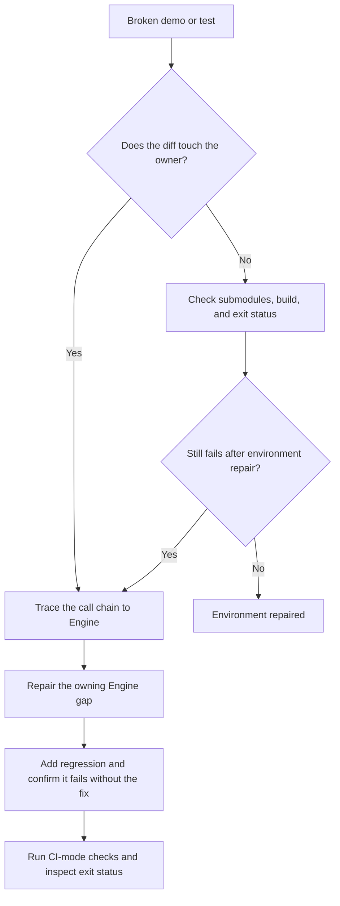

# Backend and CI troubleshooting

Use this reference for browser capability, wgpu fallback, RHI capture, and CI-form failures.

## WebGPU messages do not decide whole-machine support

ForgeaX first tries browser-native WebGPU, then may try
the wgpu/WASM WebGL2 downlevel lane. adapter-unavailable describes only the first
channel. Neither that error, navigator.gpu presence, nor startup text mentioning WebGPU
proves the machine cannot run ForgeaX.

Route using structured evidence:

| Signal | Meaning | Action |
|:--|:--|:--|
| requestAdapter returns null / adapter-unavailable | No native WebGPU adapter | Inspect Runtime's wgpu/WebGL2 outcome. |
| requestAdapter throws / webgpu-runtime-error with request-adapter-threw | Permissions, secure-context, or browser error | Read detail.error.name/message and repair that environment. |
| Structured WebGL2 fallback failure | Second channel also failed | Distinguish environment, WASM loading, capability gates, and Engine defects through code/hint. |
| Asset/Shader/Pack/App error | Not necessarily GPU capability | Repair its owner; do not inject Canvas fallback, swallow startup errors, or replace the engine. |
| object Object | Error was flattened incorrectly | Preserve name/message/code/expected/hint/detail/cause and diagnose again. |

DevKit hosts recursively show structured fields and explain WebGL2 fallback alongside WebGPU messages.
A publisher's uncaught-error check alone cannot establish rendering correctness;
preserve Engine identity and verify real browser output/pixels.

## edge webgpu disabled

**Signal**: Edge demo is black with adapter-unavailable and an unsafe-WebGPU flag hint; wgpu fallback also reports WebGL2 unavailable or canvas already in use.

**Cause**: in the observed Edge configuration, disabling edge://flags/#enable-unsafe-webgpu disabled all hardware GL contexts; webgl/webgl2/experimental-webgl returned null. The Engine cannot attach a GL backend when no context exists.

> [!CAUTION]
> Canvas pollution/type-lock/recreation hypotheses were falsified by a direct DevTools probe. Historical evidence: [Edge investigation](https://github.com/ForgeaX-Games/forgeax-engine-harness/blob/main/docs/handover/2026-06-10-edge-webgpu-disabled-no-graceful-webgl-fallback.md).

**Check**: run this in Edge DevTools and retain the result.

```js
const c2 = document.createElement('canvas');
console.log('webgl2:', c2.getContext('webgl2') ? 'OK' : 'null');
const c3 = document.createElement('canvas');
console.log('webgl :', c3.getContext('webgl')  ? 'OK' : 'null');
console.log('navigator.gpu:', !!navigator.gpu);
```

| Result | Meaning | Action |
|:--|:--|:--|
| webgl2=null and webgl=null | Browser disables the GL stack | Enable the identified flag and restart Edge. |
| webgl2 works but output remains black | Engine fallback may be defective | Follow EngineEnvironmentError.detail.wgpuError.hint through WASM. |
| navigator.gpu exists but output is black | Adapter may be unavailable in headless/iframe/remote desktop | Verify Channel 3 fallback; check WASM loading if it also fails. |

**Repair**: browser configuration is external to Engine. `classifyEnvErrorReason` in `packages/render/src/assembly/factory.ts` keeps the `no usable rendering backend` wording only for GPU-class inner codes (adapter-unavailable, rhi-not-available, ...); the message carries no browser-flag guidance, so apply the table above.

Verify an actual fallback context exists before debugging fallback selection.

---

## wgpu-wasm webgl2 fallback cap gates

**Signal**: wgpu-wasm Channel 3 reports a wgpu validation panic wrapped as webgpu-runtime-error in runShimSyncStep/buildReadyWebGPU. Common forms:

- Pipeline storage/uniform mismatch: shader chose a storage variant but layout uses uniforms.
- msaaColor texture creation requires unsupported VIEW_FORMATS: graph allocation supplied viewFormats without gating.
- Texture-view format reinterpretation: record recreates an sRGB view on an incompatible fallback texture.

**Cause**: WebGL2 downlevel defaults expose maxStorageBuffersPerShaderStage=0. Missing a corresponding capability gate can select unsupported variants/formats; ordinary native-WebGPU tests may not exercise this lane.

**Common failures**:

1. Hardcoded single-axis definesKey='STORAGE_BUFFER_AVAILABLE=false' stops matching when CLUSTER_FORWARD_AVAILABLE adds another axis. Filter entry.variants[].defines structurally instead of constructing sorted-key strings.
2. Ungated addColorTarget viewFormats reach createTexture without VIEW_FORMATS support. allocateColorTargets must use its capability gate and omit unsupported formats.
3. Record recreates an sRGB view without declared viewFormats. When fallback pipeline format already equals attachment format, use the graph's default view.
4. Dispatch by wasm-bindgen constructor.name breaks after minification (RhiWgpuSampler becomes e). Pass explicit forgeaxKind: sampler/textureView and dispatch on that stable field in Rust. Audit all class-name-based paths. Development may pass while minified preview fails; FPS alone can hide repeated errors.

**Local reproduction**:

```bash
# 1. Start a hello/learn-render development server.
cd apps/learn-render/1.getting-started/2.hello-triangle && pnpm dev
# → http://localhost:5181/

# 2. Run headless Playwright WebKit to exercise its no-WebGPU fallback.
URL=http://localhost:5181/ TIMEOUT_MS=20000 \
  node scripts/dev-verify/verify-webkit-hello-triangle.mjs
```

The harness reports DRAW DIAG, PIXEL SAMPLE, SCREENSHOT SAMPLE, and VERDICT. WebKit canvas readback may return zero; inspect the actual compositor PNG at /tmp/hello-triangle.png.

**Interpretation**:

| Result | Meaning | Repair |
|:--|:--|:--|
| Panic with runShimSyncStep in stack | Missing fallback capability gate | Use the validation message to identify layout/format/feature and inspect adjacent capability gates. |
| No panic but black PNG | Rendering-state issue after shader/layout validation | Inspect actual draws, frustum, and clear color through RHI Debug. |
| No panic and visible triangle | This path passes | Retain evidence. |

Fallback changes require local WebKit verification. Native Dawn does not exercise WebGL2. Headless Chromium configurations without navigator.gpu also take Channel 3, including the historical metrics path. Minification-only defects require production build/preview, not pnpm dev; record the actual selected backend.

```bash
# Reproduce the CI metrics path locally:
pnpm --filter @forgeax/parity-instancing-static build      # production minified
pnpm metrics:run-fps -- --app apps/parity/instancing-static
# Inspect p95 FPS and nested onError details, including non-enumerable properties.
```

See the [historical Edge investigation](https://github.com/ForgeaX-Games/forgeax-engine-harness/blob/main/docs/handover/2026-06-10-edge-webgpu-disabled-no-graceful-webgl-fallback.md).

---

## Replicated entity references omit derived render entities

**Signal**: replica state reports bodyLength > 1 but only the snake head renders; render-map count is below summed body lengths.

**Check**: drive growth through browser E2E, compare public state with data-render-entity-count, then capture/inspect an RHI render target if they differ. SnakeBody.segments may be an indexed object in replica data; entity references are not replica row IDs, so array length alone is insufficient.

**Repair**: use stable replicated business identity such as playerNetworkId for render ownership, carried by each derived segment. Use segments only for ordering/length; select materials by business identity rather than remapped handles. Regress renderEntityCount == sum(bodyLength) and verify visible segments with RHI target pixels.

## RHI tape capture, replay, and offline inspection

> [`forgeax-engine-rhi-debug`](../../forgeax-engine-rhi-debug/SKILL.md) owns capture/inspect/dispose, structured RhiDebugError recovery, and deterministic replay. Start unexplained black/gray output, wrong textures, or binding investigations there.

---

## ci form 2026-06-16

> [!WARNING]
> Historical workflow snapshot, not current operating instructions. In particular,
> PR #3158 removed whole Playwright-cache transfers. Read the current
> [CI operating guide](../../../scripts/ci/README.md) and the workflow at the
> failing commit before applying any cache, skip or job-layout advice below.

> [!NOTE]
> Historical CI restructuring separated PR/main routing, prefix-matched caches, shared Playwright caches, and browser/Dawn jobs. These notes explain that revision; current workflow/CI guide remain authoritative.

**Unit/coverage entry**:

Historically the retained Vitest unit step skipped main pushes, where coverage+typecheck already covered it. Performance guards read unit output for PRs and coverage output for main. Browser/Dawn jobs still ran on both paths.

**Shared Playwright cache**:

primary-pnpm, vitest-browser, and metrics-validate used the same key:
```yaml
key: playwright-${{ runner.os }}-${{ hashFiles('apps/hello/triangle/package.json') }}
path: ~/.cache/ms-playwright
```
Browser binaries install only on cache miss; apt dependencies install each run. Changing the hello-triangle Playwright version invalidates the shared key.

**cache-tsbuildinfo skip condition**:

```yaml
- name: Vitest typecheck (feat-20260608-ci-time-cut)
  if: steps.cache-tsbuildinfo.outputs.cache-matched-key == ''
  run: pnpm run typecheck
```
The historical M4 condition changed exact cache-hit to nonempty cache-matched-key, which also includes prefix hits. This skipped the 138-second typecheck on prefix matches; cache-hit itself is true only for exact matches. Historical actions/cache evidence lives in the Harness knowledge base.

**Separate browser and Dawn jobs**:

After M3, primary-pnpm no longer ran browser/Dawn commands internally. Their independent jobs ran for PR/main, and sticky-comment depended on both. Keep result aggregation aligned when changing job dependencies.

> [!IMPORTANT]
> After ci.yml changes, run pnpm run lint and pnpm ci:channel-align. For historical skip/cache behavior inspect cache-matched-key and the hello-triangle package hash rather than assuming every skipped unit/typecheck step is a defect.

---

## Diagnostic discipline



---
