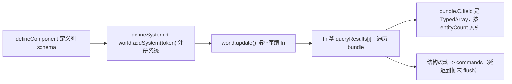

# forgeax-engine-ecs

> archetype ECS：组件是 SoA 列、系统按 query 拿列、结构改动走 Commands。聚合 `@forgeax/engine-ecs`（World / Entity / Component / Query / System / Schedule / Commands / Resource / Relationship / Reflection）。

## 心智模型

组件不是对象，是**列**：`defineComponent` 一次定义一个 schema（字段 → 类型），引擎把每个字段存成一条紧凑 TypedArray（Struct-of-Arrays）。系统拿到的不是实例数组，而是 `bundle.ComponentName.fieldName`（一条 `Float32Array`），按 `bundle.entityCount` 索引。`defineComponent` **本身**就让组件全局可用——没有 per-World 注册步骤。`Entity` 是 id=0 的内建组件（实体身份本身就是一列）；它的存在被引擎在 barrel 里强制初始化，你不用手动定义。结构性改动（spawn / despawn / add / remove component）在系统里要走 `Commands` 延迟到帧末，避免迭代中改 archetype。

系统定义也走"定义即注册"路径：`defineSystem({ name, queries, fn, ... })` 返回 `SystemHandle` token，`world.addSystem(token)` 直接激活——不经按名取回。`getRegisteredSystems()` 返回 `ReadonlyMap<string, SystemHandle>` 供辅路枚举；`getRegisteredComponents()` 同理，返回 `ReadonlyMap<string, Component>`。两组注册表独立、不互相污染。

SystemSet 是共享排序、条件和 chain 的纯分组 token：模块级 `defineSystemSet` 创建 token，`world.addSystems` 将系统归属到它，`world.configureSets` 声明 set 间顺序。set 展开为既有调度边，不增加同步边界或 command flush。`SystemDescriptor.runIf?: (world) => boolean` 是运行条件：每帧 ParamValidation 通过后、queryRun 前求值，`false` → 静默跳过（不跑 query、不调 fn、不增状态）。多个 set 归属时，所有 set 的 `runIf` 条件均须通过。

## 核心 API 速查

| 入口 | 形态 | 用途 |
|:--|:--|:--|
| `defineComponent(name, fields, options?)` | `=> Component` | 定义组件 schema；单 field-descriptor 签名，定义即全局可用。`options` 可带 `transient` / `relationship` / `cardinality` / `validate` / `onInsert` / `onRemove` |
| `defineSystem({ name, queries, fn, ... })` | `=> SystemHandle<Qs>` | 定义系统 token；返回冻结 descriptor，`world.addSystem(token)` 直接激活 |
| `defineSystemSet({ name, runIf?, chained? })` | `=> SystemSet` | 定义冻结的名义 set token；模块级同名定义会替换旧 token |
| `getRegisteredSystems()` / `getRegisteredSystemSets()` | `=> ReadonlyMap<...>` | 枚举已定义的系统或 set token |
| `world.addSystems(set, systems)` | `=> Result<void, SystemSetNotRegisteredError>` | 批量注册系统并写入 set 归属；已有系统不重复注册，允许多 set 归属 |
| `world.configureSets({ set, before?, after? })` | `=> Result<void, SystemSetNotRegisteredError>` | 声明 set 间排序；空 set 是 no-op，`chained` set 按加入顺序串行 |
| `getRegisteredComponents()` | `=> ReadonlyMap<string, Component>` | 枚举全部 defineComponent 注册的组件（按名取回） |
| `new World()` | 构造 | 实体 / 组件 / 系统 / 资源容器 |
| `world.spawn(...componentDatas)` | `=> Result<EntityHandle, EcsError>` | 创建实体 + 初始组件 |
| `world.get(e, C)` | `=> Result<bundle, EcsError>` | 读单实体某组件（也是 liveness 探针，despawned 回 `err('stale-entity')`） |
| `world.addComponent(e, C, data) / removeComponent(e, C)` | `=> Result<...>` | 增删组件（即时路径） |
| `world.addSystem(systemHandle)` | 注册系统 token | `fn(world, queryResults, commands)`；DAG 拓扑序跑 |
| `world.update()` | 跑一帧 schedule | 按依赖拓扑序执行全部系统 + flush commands |
| `createQueryState(...) + queryRun(state, world, cb)` | 临时查询 | 系统外的一次性遍历 |
| `queryCombinations(state, world, k, cb)` | 组合遍历 | 每个无序 K-组合调一次 `cb(handles)`（默认 k=2 成对）；成对交互（N-body/broadphase/flocking）别手写 `for i/for j=i+1`。对标 Bevy `iter_combinations`，但更简单：句柄对 + `world.get/set`，无可变别名约束。`Entity` 须在 `with`（否则 fail-fast `query-combinations-entity-required`） |
| `world.getResource<T>(key) / insertResource<T>(key, value)` | 全局态 | 单例资源（如 InputSnapshot） |
| `world.addChild(parent, child, ChildOf) / reparent(...) / removeChild(...)` | 层级 | relationship 同步维护反向 mirror 列 |
| `C.id / C.fields[f] / C.meta / TYPE_METADATA` | 反射 | 三层只读自省 |

> [!CAUTION]
> 这些 API 在近期已被删除/重塑——**别用**：`world.registerComponent` / `world.registerComponentChecked`（删，`defineComponent` 即可用）、`world.isAlive`（删，用 `world.get(e, Entity)` 探活）、`world.getComponentId(C)`（删，用 `C.id`）、独立的 `GlobalTransform` 组件（删，`Transform.world` 是 SSOT 世界矩阵）、`createFrameStartScanSystem` 工厂（删，改 `world.insertResource('InputBackend', backend) + world.addSystem(InputFrameStartScan)` 资源化接线）、`register` 函数内 addSystem 闭包/spread-覆盖-fn 形态（删，改模块顶层 `const S = defineSystem({...}) → world.addSystem(S)`）。

## 系统 / 查询：SoA 列读法



## idiom 代码骨架

```ts
import { defineComponent, defineSystem, World } from '@forgeax/engine-ecs';

const Position = defineComponent('Position', { x: 'f32', y: 'f32' });
const Velocity = defineComponent('Velocity', {
  dx: { type: 'f32', default: 0 },
  dy: { type: 'f32', default: 0 },
});

// 模块顶层 const S = defineSystem({...}) — fn 首参为 world
const Integrate = defineSystem({
  name: 'integrate',
  queries: [{ with: [Position, Velocity] }],
  fn: (world, queryResults, commands) => {
    for (const bundle of queryResults[0]) {
      const xs = bundle.Position.x;
      const dxs = bundle.Velocity.dx;
      for (let i = 0; i < bundle.entityCount; i++) xs[i] = (xs[i] ?? 0) + (dxs[i] ?? 0);
    }
    // commands.spawn(...) / commands.despawn(e) — deferred, flushed at frame end
  },
});

const world = new World();
world.spawn(
  { component: Position, data: { x: 0, y: 0 } },
  { component: Velocity, data: { dx: 1, dy: 0 } },
);
world.addSystem(Integrate);   // token 直传激活
world.update();
```

### 系统描述符完整字段

`defineSystem` 接受的 `SystemDescriptor` 全字段如下（全部可选，除 `name` / `queries` / `fn`）：

| 字段 | 类型 | 必填 | 说明 |
|:--|:--|:--|:--|
| `name` | `string` | 是 | 系统唯一名（供 `before`/`after` 引用 + 全局注册表 key） |
| `queries` | `ReadonlyArray<QueryDescriptor>` | 是 | 查询声明；`[]` = 零查询系统（纯 command/resource 操作） |
| `fn` | `(world: World, queryResults, commands) => void` | 是 | 系统函数。**首参为 World**（旧签名 `(queryResults, commands)` 已废弃；迁移：形参加 `world`，体内原闭包用的 `world` 改用参数） |
| `after` | `ReadonlyArray<string>` | 否 | 在此系统名前运行 |
| `before` | `ReadonlyArray<string>` | 否 | 在此系统名后运行 |
| `resources` | `ReadonlyArray<string>` | 否 | 所需 resource key 列表；缺失 → ParamValidation `'invalid'`（走 ErrorHandler，不裸 throw） |
| `runIf` | `(world: World) => boolean` | 否 | 运行条件：每帧 ParamValidation 通过后、queryRun 前求值；`false` → 静默跳过（不跑 query、不调 fn、不增状态）。缺省(=undefined) 每帧照跑 |

### runIf 运行条件

```ts
import { defineSystem, World } from '@forgeax/engine-ecs';

// 系统仅在「场景有活实体」时跑
const MySystem = defineSystem({
  name: 'cleanup',
  queries: [{ with: [Transform] }],
  runIf: (world: World) => {
    // 每帧求值；ParamValidation 已通过、fn 尚未调
    return world.hasResource('SceneRoot');
  },
  fn: (world, queryResults, commands) => {
    // ...
  },
});
```

> [!IMPORTANT]
> `runIf` 求值在 ParamValidation `tag==='ok'` 之后、queryRun 之前（requirements AC-07）。`tag==='invalid'` 时走 ErrorHandler 不触发 runIf。跳过是静默的——不暴露 skip 计数/诊断（OOS-6）。

### SystemSet 分组与调度

```ts
import { defineSystem, defineSystemSet, World } from '@forgeax/engine-ecs';

const PhysicsSet = defineSystemSet({ name: 'physics', chained: true });
const GameplaySet = defineSystemSet({ name: 'gameplay' });

const SyncPhysics = defineSystem({
  name: 'physics-sync',
  queries: [],
  fn: (world) => { /* synchronize physics */ },
});

const world = new World();
world.addSystems(PhysicsSet, [SyncPhysics]).unwrap();
world.configureSets({ set: PhysicsSet, after: [GameplaySet] }).unwrap();
```

Set constraints expand into normal scheduler edges; they do not create a synchronization boundary or flush commands. Empty sets are no-ops. A system can join multiple sets, and every applicable set `runIf` condition must pass before the system-level condition is evaluated. `chained: true` preserves `addSystems` insertion order by adding adjacent member edges.

关系（层级）用 `relationship` 元数据声明，反向 mirror 列由引擎自动维护：

```ts
const ChildOf = defineComponent('ChildOf', { parent: { type: 'entity' } }, {
  relationship: { mirror: 'Children', field: 'entities', exclusive: true, linkedSpawn: true },
});
world.addChild(parent, child, ChildOf); // child gains ChildOf; parent.Children.entities auto-updated
// linkedSpawn: true (default since feat-20260616) -- world.despawn(parent) cascades through the
// whole ChildOf subtree in one call; consumers include engine-state (despawnOnExit / scopeDespawn),
// tilemap (Tilemap -> TileLayer -> per-cell/instances subtree, tweak-20260714), and any user
// subtree that wants integral lifetime coupling.
```

### transient — 运行时派生、collect 跳过

`transient: true` 声明组件为运行时派生态，`rootsToSceneAsset` collect 跳过（不写盘）。

- **运行时仍在**：transient 组件在 archetype 列中物理存在，正常参与 `world.get` / query。`instantiateScene` 后由 relationship mirror hook 重建（如 `Children` 作为 `ChildOf` 的 mirror 由 mirror hook 填充）。**transient 只 gate collect 写盘路径，不影响运行时。**
- **relationship mirror 义务**：relationship 组件的 mirror target（如 `ChildOf` 的 mirror `Children`）应声明 `transient: true`。引擎提供 `checkRelationshipMirrorsTransient(RELATIONSHIP_COMPONENTS, resolveComponent)`（collect 时的 dev 断言）检测遗漏声明。断言检查的是 **mirror token**（如 `Children`），不是 **holder token**（如 `ChildOf`）。
- **标准示例**：`Children` 声明 `transient: true`，作为 `ChildOf` 的 mirror，instantiate 后由 mirror hook 重建，**永不序列化**。Mount round-trip 保真由 `ChildOf` 图保证，不依赖序列化 `Children` 数据。

```ts
// Children 声明 transient—collect 永不写盘
export const Children = defineComponent('Children', {
  entities: { type: 'array<entity>' },
}, { transient: true });

// SceneInstance 同样 transient—编辑态 play 不泄漏
export const SceneInstance = defineComponent('SceneInstance', { ... }, { transient: true });
```

**field 级 transient（feat-20260709）**：`transient: true` 也可声明在**单个 field**（`FieldDescriptor`）上，非只能整组件。collect 跳过 reflection 携带 `transient: true` 的 field——通用机制，key 在 `component.fields[fieldName].transient`，非组件特判。典型用途是每帧派生 / 引擎写回的 cache field：`Transform.world`（propagate 每帧从 local TRS 重算的 world mat4）声明 `transient: true`，场景 JSON 不存这 16 float 冗余（Derive）；instantiate 后首帧 propagate 重算等价 world。可反射自查：`Transform.fields.world.transient === true`。同批 feat 把其他引擎写回态也收敛为 field 级 transient：`CharacterController.grounded`（`moveAndSlide` 每帧写回的接触态）、`VideoPlayer.currentTime`（播放头，每帧从 `HTMLVideoElement` 派生）、`SpriteAnimation.currentFrame`/`accumDt`（动画驱动态）——均 collect 跳过、运行时照常读写。

```ts
export const Transform = defineComponent('Transform', {
  pos: { type: 'array<f32, 3>', default: new Float32Array([0, 0, 0]) },
  quat: { type: 'array<f32, 4>', default: new Float32Array([0, 0, 0, 1]) },
  scale: { type: 'array<f32, 3>', default: new Float32Array([1, 1, 1]) },
  world: { type: 'array<f32, 16>', default: IDENTITY_MAT4, transient: true },
});
```

## 踩坑

- **系统 fn 首参必须是 `world`**：`defineSystem({ fn: (world, queryResults, commands) => {...} })`——旧签名 `(queryResults, commands)` 已废弃。typecheck 不足以兜底此陷阱（TS 参数前插后 `arity-narrowed assignment` 合法，见 memory `overload-arg-shape-dispatch-hides-p0`）。迁移：形参加 `world`，体内原闭包捕获的 `world` 改用参数 `world`。
- **query 字段名拼写错 / 漏 column**：组件被链式 `addComponent` 加进 archetype 时曾有列错位 bug（已修），但若 `bundle.C.field` 为 `undefined`，先确认 query 的 `with` 真包含该组件、字段名与 schema 完全一致。
- **spawn-data 字段名拼写错 → fail-fast**（bug-20260615）：`world.spawn` / `world.addComponent` / `commands.spawn` 对 `data` 里出现的未声明字段仍返回 `err({ code: 'spawn-data-unknown-field', detail: { component, field, knownFields } })`——typo 是编程错误，应 fatal。但 **scene instantiate 路径已改为诊断通道**：`world.instantiateScene` 对 unknown-field 跳过该字段 + 记录 `SceneInstantiateDiagnostic` 条目（不 abort 整场景），见上节。
- **系统里直接结构改动会破迭代**：在 `fn` 里 spawn/despawn/add/remove 要走 `commands`，引擎帧末统一 flush；即时路径（`world.spawn`）留给系统外。
- **Result 不 unwrap 就静默丢错**：`world.get` 等返回 `Result`；系统体内显式 `if (!r.ok) return r;` 或 `.unwrap()`（TS 无 `?` 运算符）。其余渲染/测试症状见 [`forgeax-engine-debug`](../forgeax-engine-debug/SKILL.md)。
- **`defineSystem` 同名静默覆盖**：第二次 `defineSystem({ name: 'X', ... })` 用同名会 `SYSTEM_REGISTRY.set` 覆盖旧 token，不抛错（对齐 `defineComponent` 行为）。`getRegisteredSystems()` 反映最新 token。
- **`resources` 声明后缺失 → ParamValidation `'invalid'`**：`resources: ['SomeKey']` 但 `SomeKey` 未 insertResource → 系统不跑、ErrorHandler 被调用。不走 runIf 求值（runIf 只在 `tag==='ok'` 后触发）。
- **shared 字段传入非法值 → `shared-field-invalid-value`**（feat-20260713 M2 / w9）：`world.spawn` / `world.addComponent` / `world.set` 对 `shared<T>` / `array<shared<T>>` 字段收到非 number 值（裸 GUID 字符串、`{guid}` 对象、`{kind}` 对象）→ 返回结构化 `EcsError({ code: 'shared-field-invalid-value', expected, hint, detail: { component, field, fieldType, actualValue, index? } })`（`fieldType` = schema 声明的类型字面量如 `shared<T>` / `array<shared<T>>`；`actualValue` = 触发的非法值；`index` 仅 array 形态携带元素下标），不再静默清零为 `[0,0,0,0]`。正确做法：先用 `loadByGuid + allocSharedRef` 将 GUID 解析为 handle，再将 handle 传入。

## Bool 列

`defineComponent` 支持 `type: 'bool'` 列（既存基础设施，`AnimationPlayer.paused` / `AudioSource.playing` / `Camera.autoAspect` 生产在用）。

```ts
const MyComp = defineComponent('MyComp', {
  enabled: { type: 'bool', default: false },
});

// world.get path: readRow 窄化为 JS boolean
const r = world.get(entity, MyComp);
if (r.ok) {
  const flag = r.value.enabled;         // true | false（JS boolean）
  world.set(entity, MyComp, { enabled: false }); // 写入 boolean 或 0/1，引擎自动归一化
}
```

> [!CAUTION]
> **`world.get` 与 query-bundle 两条路径不可混用**：`world.get(entity, C)` 通过 readRow 窄化返回 JS `boolean`；但 query-bundle 直接暴露底层 TypedArray（`Uint8Array`），bool 列以 raw `0` / `1` number 形态出现——**不是 JS boolean**。
>
> ```ts
> // ❌ 陷阱：query-bundle 路径的 `!== 0` 对 bool 列恒为 true
> for (const bundle of queryResults[0]) {
>   for (let i = 0; i < bundle.entityCount; i++) {
>     if (bundle.MyComp.enabled[i] !== 0) {  // ✅ 正确：比较 number
>       // ...
>     }
>   }
> }
> // ❌ 错误：bundle 值 0/1 number !== true/false boolean
> //    if (bundle.MyComp.enabled[i])     // 0 → falsy ✓, 1 → truthy ✓（但语义模糊）
> //    if (bundle.MyComp.enabled[i] === true)  // 1 === true → false ❌
> //    if (bundle.MyComp.enabled[i] !== 0) // 0 !== 0=no-op, 1 !== 0=true ✓（唯一正确的判定）
> ```
>
> 在 query 里需要用 bool 判定时，**优先走 `world.get` 路径**（如 `Camera.autoAspect` 的 aspect-sync sidecar 设计）。若必须走 bundle，判定式用 `=== 1` 或 `!== 0`，绝不混用 JS truthy 或 `=== true`。
>
> 参考记忆：`bool-field-compared-with-not-equal-zero-always-true`——`rapler.charCtrlData.grounded !== 0` 恒 true 的踩坑记录。

## SceneInstance（feat-20260608 ECS-fication）

`SceneAsset` 不再走单独的 container，而是 ECS 化：`world.instantiateScene(handle)` 返回 `{ root, diagnostics }` 信封——`root` 是合成根 Entity（挂 `SceneInstance{source, mapping, state}` + 单位 `Transform`），`diagnostics` 是未知字段的结构化诊断数组（`readonly SceneInstantiateDiagnostic[]`）。diagnostics 属性访问消费（`d.component` / `d.field` / `d.localId`），非 NODE_ENV-gated——生产环境同样可观测。`SceneAsset.mounts[]` 让一个 SceneAsset 嵌入另一个；mount entity 也自动挂 Transform（R2/B-1）。

上行（collect）与下行（instantiate）对称：`rootsToSceneAsset(registry, world, roots)` 是下行 `instantiateScene` 的逆操作——遇带 `SceneInstance` 的实体子树折叠回 `mounts[]`（**mount-collapse**），成员实体不产出、`SceneInstance` 组件行不落盘、非 member 的 graft 实体保留为 owned。collect 产物经 `serializeSceneAssetToPack` 落盘后可重新 `loadByGuid → instantiateScene` 恢复等价 live 子树（round-trip 闭环，详见下节 §Entity 森林 → SceneAsset 序列化）。

### 8 个 World 方法（全在 `world.<TAB>` 自动补全）

| 方法 | 作用 |
|:--|:--|
| `instantiateScene(handle, parent?)` | 物化 SceneAsset，返回 `{ root: EntityHandle, diagnostics: readonly SceneInstantiateDiagnostic[] }`——`root` 为合成根 Entity，`diagnostics` 经属性访问消费未知字段信息 |
| `despawnScene(root, opts?)` | `despawnDescendants(root) + world.despawn(root)`；返回销毁数 `Result<number>` |
| `despawnDescendants(root, opts?)` | 沿 ChildOf 销毁子树，根保留；返回销毁数 `Result<number>` |
| `setSceneOverride<S>(root, member, component, field, value)` | Layer-0 override（写入 + 记录 diff）；`member` 是活 Entity，`component`/`field` 走 schema 类型 |
| `removeSceneOverride<S>(root, member, component, field)` | 撤销 diff，重放 Layer 1->2->3 |
| `detachSceneMember(root, member)` | 软 tombstone（不 despawn） |
| `reattachSceneMember(root, member)` | 清 tombstone |
| `getSceneAssetForInstance(root)` | 读源 SceneAsset 句柄 |

读路径：`world.queryRun([SceneInstance], ...)` 扫活实例 / `world.get(root, SceneInstance)` 单实例 / `world.getSceneInstanceState(root)` 拿完整 state ref（overrides / detachedLocalIds / rootEntities）。

### 4 个 mount-* fail-fast 错误码（SSOT 在 `packages/types/src/index.ts` PackErrorCode）

| code | 触发 |
|:--|:--|
| `pack-mount-localid-overlap` | `entities[].localId` 与 mount 槽位重叠 |
| `pack-mount-count-mismatch` | `mount.memberCount !== child SceneAsset totalSlots` |
| `pack-mount-override-localid-out-of-range` | `override.localId` 不在 `[memberFirst, memberFirst+memberCount)`（**parent namespace** 寻址） |
| `pack-mount-override-unknown-field` | `override.field` 不在已注册组件 schema |

> [!NOTE]
> mount.overrides[].localId 在**父 SceneAsset 的命名空间**里（即 `memberFirst + offset`，不是子 SceneAsset 的局部 id）。R2/F-8 cement。

### MountOverride add-or-patch 语义（feat-20260713 M2）

`MountOverride` 的 `field` 字段是可选的（`field?: string`），隐式判别覆盖模式：

| `field` | 语义 | 说明 |
|:--|:--|:--|
| 有值（`field: 'pos'`） | **patch 单字段** | 成员实体该字段覆盖为 `value`；其余字段保持源值 |
| 无值（`field` 缺省） | **add/upsert 整组件** | 成员实体无此组件 → `addComponent`（schema 补缺省字段）；已存在 → `set` 全覆盖（upsert，不报 duplicate） |

`value` 类型保持 `unknown`（不收窄为泛型）。判别规则收敛在 `field?` 形状自身，消费者不编码 variant 知识（不 switch op）。

```ts
// field-patch: 只改 pos
{ localId: 2, comp: 'Transform', field: 'pos', value: [1.0, 0, 0] }

// component-add: 整组件 upsert
{ localId: 2, comp: 'DirectionalLight', value: { direction: [0, -1, 0], color: [1, 0.5, 0.2], intensity: 1.0 } }
```

### SceneInstantiateDiagnostic — 结构化诊断通道

`instantiateScene` 成功值随 `root` 附带 `diagnostics: readonly SceneInstantiateDiagnostic[]`——未知字段不再 abort 整场景，而是跳过该字段 + 记录诊断条目。属性访问消费（`d.component` / `d.field` / `d.localId`），不做字符串解析，非 NODE_ENV-gated（生产环境同样可观测）。

```ts
import type { SceneInstantiateDiagnostic } from '@forgeax/engine-ecs';

const r = world.instantiateScene(handle);
if (r.ok) {
  const { root, diagnostics } = r.value;
  for (const d of diagnostics) {
    // d.component = 'DirectionalLightShadow'
    // d.field     = 'orthoHalfExtent'
    // d.localId   = 21
    console.warn(`Unknown field: ${d.component}.${d.field} on entity #${d.localId}`);
  }
  // All entities spawned normally; known fields written correctly.
}
```

**分层**：`assets.instantiate()`（runtime）保留 `Result<EntityHandle>` 契约——内部 unwrap `.root`，不对 AI 用户暴露 diagnostics。需诊断面时直调 `world.instantiateScene`。

### 踩坑

- **resolver 挂错地方**：`engine.assets.instantiate(...)` 自动 wire 内部 SceneAsset resolver；只有 unit test 才走 `world._setSceneAssetResolver`（`@internal`，前缀 `_`）。demo 不要写 `if (world.setSceneAssetResolver)` 防御逻辑——这教坏下个 AI。

## Entity 森林 → SceneAsset 序列化（存回）

活 entity 森林可通过 `rootsToSceneAsset(registry, world, roots)` 序列化为 `SceneAsset`——这是 asset perspective 的入口（签名与错误码详见 [`forgeax-engine-assets`](../forgeax-engine-assets/SKILL.md) §Scene save / writeback）。`rootsToSceneAsset` 是 `instantiateScene` 的逆操作——上行/下行对称构成 round-trip 闭环。从 ECS 视角，只需理解以下概念：

**基础语义**：

- **任意 entity 可作 root**：不要求 SceneInstance 守卫——裸 spawn 的 entity、某子树分支节点，都可传入 `roots`。
- **沿 Children BFS 收子树**：内部用共享 `collectSubtree` util（见下节），跨 root 共享 visited 去重。
- **字段从 schema 派生**：entity/array<entity>→localId、shared<>/array<shared<>>→GUID——读 `comp.schema[fieldName]` 判定字段类型，无需手维白名单。
- **root ChildOf 剥离**：作为 root 传入的 entity 若有 ChildOf（指向选区外父），产出 SceneEntity 不含 ChildOf 组件——新 scene 里它就是顶层。**不改动活 entity 状态**（纯读操作）。
- **localId BFS 重编号**：森林内 entity 按 BFS 遍历序从 0 连续重编号，不复用原 localId/raw handle。

**mount-collapse（嵌套场景折叠）**：

当 BFS 遍历遇到携带 `SceneInstance` 的实体（锚点），`rootsToSceneAsset` 将其子树**折叠**回一条 `mounts[]` 条目——而非将其当作普通 owned entity 序列化。折叠是三分类过滤，非子树剪枝（BFS 仍走完整子树）：

| 类别 | 实体 | 产物 |
|:--|:--|:--|
| **Member** | 子实例 mapping 内的实体 | 叠进 mount 窗口 `[memberFirst, memberFirst + memberCount)`，不产出为 owned entity |
| **Anchor** | 携带 SceneInstance 的实体自身 | SceneInstance 组件行不落盘；锚点自身不产出为 owned（由 mount 条目表示） |
| **Graft** | 挂到 member 下但不在 mapping 内的实体 | 保留为 owned entity；指向 member 的 entity 引用重映射为窗口内 LocalEntityId |

两种锚点形态：

- **形态 2**（root 自身即实例）——`roots` 中某 entity 携带 `SceneInstance`：整树折叠为单条 mount 的全新包裹 SceneAsset，`mount.parent=undefined`。
- **形态 1**（深层锚点）——非 root entity 携带 `SceneInstance`：锚点子树折叠为一条 mount，`mount.parent` 指向锚点 ChildOf 父的新 localId；祖先实体照常产出为 owned。

**窗口记账**（totalSlots 不变量）：mount 窗口覆盖子实例完整 `totalSlots`（不按存活成员数收缩），互不重叠，与 owned entity localId 不冲突。`totalSlots = entities.length + mounts.length + sum(memberCount)`。

**round-trip 闭环**：`instantiateScene → rootsToSceneAsset → serializeSceneAssetToPack → loadByGuid → registry.instantiate → instantiateScene` 产出结构等价的 live 子树。等价基准是**二次 collect 不动点**（第二次 collect 产物与第一次结构等价）。

**已知限制**：
- **D-9 形态 1 吸收**：mount 实体吸收仅在能证明时执行；无法证明时保留为 owned + `mount.components=undefined`，首次 reload 做一次性归一化。

### collectSubtree：可复用的层级遍历原语

`collectSubtree` 是沿 `Children` 组件 BFS 收子树的共享 util——AI 用户可直接 import 复用，无需手写 BFS。

```ts
import { collectSubtree } from '@forgeax/engine-runtime'; // barrel re-export 自 packages/runtime/src/scene-utils/collect-subtree.ts

function collectSubtree(
  world: World,
  spawnRoot: EntityHandle,
  visited?: Set<number>,  // 可选：传入外部 visited 支持跨 root 去重；不传时内部 new Set
): Set<number>;
```

| 参数 | 语义 |
|:--|:--|
| `world` | World 实例 |
| `spawnRoot` | 子树根 entity（自身被收入 visited） |
| `visited`（可选） | 外部 Set<number>——跨 root 共享去重：祖先-后代重叠 root 时后代静默去重不报错。省略时内部 `new Set()`（单 root 退化情形） |

**使用场景**：

```ts
// 单 root：不收外部 visited（如 postSpawnResolveJoints）
const subtree = collectSubtree(world, rootEntity);
subtree.forEach(eid => { /* eid 是 entity 整数 id */ });

// 多 root 森林：共享 visited 去重
const visited = new Set<number>();
for (const root of roots) {
  collectSubtree(world, root, visited); // 共享去重
}
// visited 含所有 root 子树闭包（无重复）
```

- entity 无 `Children` 组件 → 视为叶子，BFS 在该分支终止。
- 返回值 `Set<number>` 含 root 自身。
- 文件路径：`packages/runtime/src/scene-utils/collect-subtree.ts`，经 runtime barrel 导出。

## SpriteInstances / TileLayer.sortScope (feat-20260625)

2D 批绘 + tilemap terrain 折叠：把 779+ per-cell render entity 折叠为 $\leq 16N$ 个 per-(layer, chunk, atlas) 桶 entity（$N$ = terrain layer 数）。ECS 一等公民两条：(1) `SpriteInstances` 组件（runtime 包导出），(2) `TileLayer.sortScope: 'layer' | 'per-cell'` 字面量联合。

### SpriteInstances 组件（2D peer of `Instances`）

```ts
import { SpriteInstances, type SpriteInstancesData } from '@forgeax/engine-runtime';

world.spawn(
  { component: MeshFilter,      data: { assetHandle: HANDLE_QUAD } },
  { component: MeshRenderer,    data: { materials: [spriteMatHandle] } },
  { component: SpriteInstances, data: { transforms, regions } },
);
```

| field | schema | stride / instance |
|:--|:--|:--|
| `transforms` | `array<f32>` | 16 f32（column-major mat4，translation 在 m03/m13/m23） |
| `regions` | `array<f32>` | 4 f32（`[uMin, vMin, uW, vH]` atlas-normalized UV rect） |

不变量：`transforms.length / 16 === regions.length / 4`（per-instance 计数一致）。RenderSystem extract entry 做防御性校验，违规走 Layer-3 ErrorHandler，三条新 `EcsErrorCode` 字面量收敛于 ECS 闭合联合：

| code | 触发 | `detail` 关键字段 |
|:--|:--|:--|
| `sprite-instances-count-mismatch` | `transforms.length/16 !== regions.length/4` | `transformsLength` / `regionsLength` / `expectedStride: { transforms: 16, regions: 4 }` |
| `sprite-instances-requires-sprite-shader` | MaterialAsset 首 pass shader 非 `'forgeax::sprite'` | `entityId` / `observedMaterialShaderId` |
| `sprite-instances-mutually-exclusive-with-instances` | 同 entity 同时挂 `Instances` + `SpriteInstances` | `entityId` |

charter P4 一致抽象：`Instances`（3D, 16 f32 / instance）↔ `SpriteInstances`（2D, 16+4 f32 / instance interleaved 80B）—AI 用户按"per-instance 是否带 UV"挑组件，不按 API 形态挑。两条均走 array-vocab + Layer-3 error envelope，**不**新增 ECS 概念。

### `TileLayer.sortScope` 字面量联合（取代 `ySort: 0 | 1`）

```ts
type TileLayer = {
  readonly sortScope: 'layer' | 'per-cell';
  // ... 其它 tilemap 字段
};
```

| 字面量 | 语义 | 渲染路径 |
|:--|:--|:--|
| `'layer'` | 整层 y-sort（terrain 默认） | `tilemap-chunk-extract` 聚合为 per-(layer,chunk,atlas) 桶 → `SpriteInstances` 单 drawcall |
| `'per-cell'` | per-cell y-sort（object 层、Y-sort interleave） | 保留 per-cell 派生 entity，走 `render-system-extract` 主路径 |

迁移：旧字段 `ySort: 0 | 1` 一刀切（Optimal > compatible）；TS exhaustive switch 在所有 sortScope 消费方守门。grep `sortScope` 命中点是迁移单一锚点（charter F1）。

### TileLayer 子树完整化 (tweak-20260714)

tilemap 子树在 spawn / despawn 两侧都收敛为「一个 tilemap = 一个可整体 despawn 的 `ChildOf` 子树」——AI 用户不需要理解「派生实体在幕后成子树」这一实现细节。

**(a) `TileLayer` 默认 identity `Transform` 占位**——`TileLayer.defineComponent` 声明 `coAttach: [{ component: Transform, data: {} }]`，spawn 归位阶段引擎自动补齐 identity `Transform`（`pos=[0,0,0] / quat=[0,0,0,1] / scale=[1,1,1]`）；`TileLayer` archetype 因此固定含 `Transform` 列，进入 `propagateTransforms` liveMap。AI 用户 spawn 侧一行不改：

```ts
// 引擎注入 identity Transform；caller 不需要显式声明。
world.spawn(
  { component: TileLayer, data: { tiles, layerOrder: 0, sortScope: encodeSortScope('layer') } },
  { component: ChildOf, data: { parent: tilemapEntity } },
);
```

需要非 identity local TRS 时显式传 `{ component: Transform, data: { pos, quat, scale } }`，caller 的字段值 override `coAttach` 默认（layer-1 wins）。`coAttach` 是 `defineComponent` options 的通用扩展字段，任何组件均可声明；见 `packages/ecs/src/component.ts` §DefineComponentOptions.coAttach。

**(b) 派生渲染实体挂 `ChildOf`**——`tilemap-chunk-extract-system` 的两条 spawn 位（`spawnSpriteInstancesGroup` terrain / `spawnDerivedRenderEntities` per-cell streaming）追加 `{ component: ChildOf, data: { parent: layerEntity } }`；派生实体成为 `TileLayer` 子代，整条链是 `Tilemap → TileLayer → 派生实体` 深度 3 `ChildOf` 子树。`ChildOf.relationship.linkedSpawn: true`（默认，见上）——`world.despawn(tilemap)` / `despawnOnExit(state)` 借既有级联一次性回收整棵子树，不需要显式遍历子代。

**(c) 内部 tracker 拆除，签名不变**——`purgeDerivedEntities` 从模块级 `layerDerivedEntities` Map 迁到 `Children.entities` 反向镜像（SSOT 收敛，Derive Don't Duplicate）；`resetTilemapDerivedEntityTracker` / `resetTilemapChunkExtractCache` 公开符号 + 签名 **unchanged**——AI 用户调用位无需迁移。per-cell streaming 侧 `tilemapChunkExtractSystem` 主循环入口对比「已知 layerKey 集合 ↔ 本帧 query layerKey 集合」，差集 layerKey 触发 3 张 Map 主动清空，防止 layer despawn 后 slot 复用导致的误命中。

### grep 落点（charter F1 单一锚点）

- `TileLayer` 的完整心智模型（identity Transform 默认 + ChildOf 化派生实体 + 整体 despawn）落在本节；`packages/runtime/README.md` §Components 是 API SSOT。
- `coAttach` 元数据的 defineComponent 侧契约：`packages/ecs/src/component.ts` §`coAttach?: readonly [{ component, data }]`。
- 深度 3+ `ChildOf` 级联在 `_despawnCore` 的实现：`packages/ecs/src/world.ts` §linkedChildren 收集（feat-20260616 起 default 覆盖）。


## skinned animation (feat-20260612)

挂三件套即可让 glTF skinned mesh 真动起来：

```ts
import { Skin, AnimationPlayer, Transform, MeshFilter, MeshRenderer } from '@forgeax/engine-runtime';

world.spawn(
  { component: Transform, data: {} },
  { component: MeshFilter, data: { assetHandle: foxMesh } },
  { component: MeshRenderer, data: { materials: [foxMat] } },
  { component: Skin, data: { skeleton: foxSkeleton } },                          // joints 由 sceneInstances.instantiate auto-resolve
  { component: AnimationPlayer, data: { clips: [walkClip, 0, 0, 0], speeds: [1, 1, 1, 1], looping: true } },
).unwrap();
```

零 setup —— `createApp` 自动注册 `advanceAnimationPlayer`（`createRenderer` 直用方手动调 `registerAdvanceAnimationPlayer(world, animResolver)`）；`propagateTransforms` 把 joint TRS 烘成 `Transform.world`；`extractFrame` 的 `hasSkin` 段读 joint `Transform.world` × `SkeletonAsset.inverseBindMatrices` 上传到 per-frame palette UBO（feat-20260612 兑付，详见 [`forgeax-engine-render-pipeline`](../forgeax-engine-render-pipeline/SKILL.md) §skin palette per-frame upload）。

**3 个 closed-union errorCode** 反查模式（exhaustive `switch` 无 default，TS 守完整性 / charter P3 显式失败）：

| code | 触发 | 修法 |
|:--|:--|:--|
| `skeleton-resolve-failed` | `assets.get<SkeletonAsset>(skin.skeleton)` 返回 null/undefined | 检查 `registerWithGuid` 顺序、`SceneAsset` mount 是否带上 SkeletonAsset |
| `joint-count-mismatch` | `Skin.joints.length !== SkeletonAsset.jointCount` | 检查 `SkinAsset.jointPaths` 与 `SkeletonAsset.jointCount` 是否同源、`sceneInstances.instantiate` 的 Name lookup 是否全命中 |
| `joint-entity-dangling` | `Skin.joints[i]` Entity 已 despawn → `Transform.world` view 拿不到 | 检查 joint entity 生命周期（不要在播放时 despawn skeleton 子树） |

SSOT：`SkinExtractErrorCode` 在 `packages/runtime/src/errors.ts`；与 `SkinPaletteOverflowError`（buffer 容量超限）共享同一 `RhiError` discriminated-union surface。

## Schema vocab → brand → store 三层一致（feat-20260614 后）

| schema vocab | Handle brand | Store | 语义 | 写屏障行为 |
|:--|:--|:--|:--|:--|
| `'unique<T>'` | `Handle<T,'unique'>` | `UniqueRefStore` | 1-holder 独占 | spawn/set→直接 alloc；despawn/overwrite→直接 release |
| `'shared<T>'` | `Handle<T,'shared'>` | `SharedRefStore` | N-holder 共享（rc-tracked） | spawn/set→`retain` rc++；despawn/overwrite→`release` rc--；rc=0 → per-handle deleter 触发 |

> [!CAUTION]
> **2026-06-14 删除项**：vocab keyword `'ref<T>'` → `'unique<T>'`；vocab keyword `'handle<T>'` 物理删除（写入触发 `SchemaUnsupportedFieldError` + 迁移 hint）；brand `'managed'` → `'unique'`、`'unmanaged'` → `'shared'`；类 `ManagedRefStore` → `UniqueRefStore`，错误 `ManagedRef*Error` → `UniqueRef*Error`。无 deprecation alias，1 PR cut。

`SharedRefStore` API（barrel export `@forgeax/engine-ecs`）：release 信号是 **per-handle deleter**——`allocSharedRef` 第三参，rc `1→0` 时对该 handle 触发一次。无全局 listener（`store.onLastRelease(cb)` / `lastReleaseListeners` 已删，由 `scripts/grep/check-ecs-brand-grep-gate.mjs` 把守）。

```ts
// 第三参 = per-handle deleter（D-10）：rc 1→0 时对此 handle 触发一次
const handle = world.allocSharedRef<'MaterialAsset', MaterialAsset>(
  'MaterialAsset',
  materialPayload,
  (payload) => {
    // 信号——观察 rc 归零；不拥有生命周期（如可在此 lazy drop GPU 资源）
  },
);
// allocSharedRef 返回裸 Handle（无 .ok）；rc=1 (alloc-grant)
// spawn 含 'shared<MaterialAsset>' 字段的 entity 后 rc=2

world.sharedRefs.retain(handle);    // rc++（write-barrier 自动调，手动罕见）
world.sharedRefs.release(handle);   // rc--；rc=0 → 该 handle 的 deleter 触发一次
const result = world.sharedRefs.resolve(handle);   // Result<T, SharedRefReleasedError | BuiltinSlotNotOwnedError>
world.sharedRefs.refcount(handle);  // number，0 == released（debug/tests）
```

> [!NOTE]
> Phase 1 暂未注册 deleter 消费者——`AssetRegistry` / `GpuResourceStore` / 物理 / 音频后端 各自未来 loop 决定如何消费。本 phase 信号已对外暴露，行为不变。

### D-15 两层资产解析（builtin 进程静态 vs user-tier RC）

`SharedRefStore` **只管 user-tier**（slot `>= BUILTIN_BASE`，`BUILTIN_BASE = 1024`，定义在 `@forgeax/engine-types`）。builtin 资产（5 个内建 mesh：`HANDLE_CUBE`..`HANDLE_NINESLICE_QUAD` = slot `1..5`）是**进程静态 frozen const**，活在 `BuiltinAssetRegistry`（`@forgeax/engine-runtime`），从不 ref-count、跨任意 World / renderer 透明。

| tier | slot range | owner | resolve |
|:--|:--|:--|:--|
| builtin | `[1, BUILTIN_BASE)` | `BuiltinAssetRegistry`（进程静态） | `BuiltinAssetRegistry.resolve(handle)`，无需 World |
| user | `[BUILTIN_BASE, +∞)` | per-`World` `SharedRefStore` | `world.sharedRefs.resolve(handle)` |

ECS/render 侧单入口 `resolveAssetHandle<T>(world, handle): Result<T, AssetError>`（`packages/runtime/src/resolve-asset-handle.ts`）按 slot range 派发。`SharedRefStore` 拿到 builtin slot 时 `alloc`/`retain`/`release`/`resolve` 全部 fail-fast `BuiltinSlotNotOwnedError`（charter P3）。

资产从 GUID 到 column handle 的标准路径（`AssetRegistry` 无 handle 概念，`loadByGuid` 返回 payload）：

```ts
const payload = (await assets.loadByGuid<MeshAsset>(guid)).value;   // 返回 payload，非 handle
const handle = world.allocSharedRef('MeshAsset', payload);          // 在使用点铸 column handle
```

## 深入

- 组件 schema vocab / `array<T,N>` / `buffer<N>` 字段 / `world.push|pop|capacity`：见 `packages/ecs/README.md` §Schema vocabulary quick-ref · §Array / buffer field access；源码 `packages/ecs/src/component.ts`
- query `optional` 逐 archetype 列暴露：见 `packages/ecs/README.md` §Query；源码 `packages/ecs/src/query.ts`
- relationship 双向 mirror / 环检测 / `iterDescendants`：见 `packages/ecs/README.md` §Relationship；源码 `packages/ecs/src/world.ts`
- 三层反射（`component.meta` / `component.fields[f]` / `TYPE_METADATA`）：见 `packages/ecs/README.md` §Component reflection；源码 `packages/ecs/src/component.ts`
- SceneInstance 完整 surface（4-layer fallback / despawn destroy set / runtime-facing reference）：`packages/ecs/README.md` §SceneInstance lifecycle + `packages/runtime/README.md` §SceneInstance；源码 `packages/ecs/src/world.ts` `_instantiateSceneAsset`
- `EcsErrorCode` 全集（SSOT 在源码，勿抄）：`packages/ecs/src/errors.ts`；反向锚点 `packages/ecs/README.md` §Error code reverse anchors
- SystemSet 入口、built-in token root imports、`system-set-not-registered` 与 `CyclicDependencyError.detail.cycle`：`packages/ecs/README.md` §SystemSet scheduling；源码 `packages/ecs/src/schedule.ts`
- `PackErrorCode` 4 个 mount-* 全集：`packages/types/src/index.ts`；hint 字符串 SSOT 同文件 PACK_ERROR_HINTS

## 内置系统的 SystemSet 归属

内置系统由模块级 `defineSystem` token 定义，生产 registrar 使用 `world.addSystems` 建立归属。通过 `world.inspect().systems` 的 `sets` 字段查看某个已注册系统的 set membership；全局 `getRegisteredSystems()` 只枚举定义 token，不表示某个 World 已激活或归属它。

| 系统名 | 包 | SystemSet | 依赖资源 | before/after |
|:--|:--|:--|:--|:--|
| `propagateTransforms` | `runtime` | `TransformSet` | -- | -- |
| `advanceAnimationPlayer` | `runtime` | `AnimationSet` | `'AnimationAssetResolver'` | `before: ['propagateTransforms']` |
| `input-frame-start-scan` | `input` | `InputSet` | `'InputBackend'` | -- |
| `transitionStates` | `state` | `StateSet` | -- | -- |
| `physicsSyncBackend` | `physics-rapier3d` | `PhysicsSet` | `'PhysicsWorld'` | `before: ['physicsStepSimulation']` |
| `physicsStepSimulation` | `physics-rapier3d` | `PhysicsSet` | `'PhysicsWorld'` | `after: ['physicsSyncBackend']` |
| `physicsWriteback` | `physics-rapier3d` | `PhysicsSet` | `'PhysicsWorld'` | `after: ['physicsStepSimulation']` |
| `physicsSyncBackend2D` | `physics-rapier2d` | `PhysicsSet` | `'PhysicsWorld'` | `before: ['physicsStepSimulation2D']` |
| `physicsStepSimulation2D` | `physics-rapier2d` | `PhysicsSet` | `'PhysicsWorld'` | `after: ['physicsSyncBackend2D']` |
| `physicsWriteback2D` | `physics-rapier2d` | `PhysicsSet` | `'PhysicsWorld'` | `after: ['physicsStepSimulation2D']` |

> [!IMPORTANT]
> Import `TransformSet` / `AnimationSet` from `@forgeax/engine-runtime`, `InputSet` from `@forgeax/engine-input`, `StateSet` from `@forgeax/engine-state`, and `PhysicsSet` from `@forgeax/engine-physics`. The 2D names use a `2D` suffix to avoid collisions with the 3D systems in the global `SYSTEM_REGISTRY`. `resolveComponent('Transform')` in a system function reads the token directly without a closure capture.

## State-machine integration (zero-intrusion)

> `@forgeax/engine-state` is built entirely on ECS primitives -- it defines no custom queries, no new archetype storage, no schedule sub-graph. See [`forgeax-engine-state`](../forgeax-engine-state/SKILL.md).

| State primitive | ECS primitive consumed |
|:--|:--|
| `__scopedTo__<tokenName>` component | `defineComponent` with two `'enum'` fields (`value`, `mode`) |
| `State` / `NextState` / `PreviousState` per-token Resources | `world.insertResource` / `world.getResource` / `world.hasResource` |
| `transitionStates` system | `world.addSystem` with `after`/`before` anchors |
| Scoped entity collection | `createQueryState` + `queryRun` + `resolveComponent` |
| Scoped entity teardown | `world.despawn` (idempotent) |
| `OnEnter`/`OnExit` callbacks | Module-private callback registry, dispatched synchronously inside `transitionStatesSystem` |
