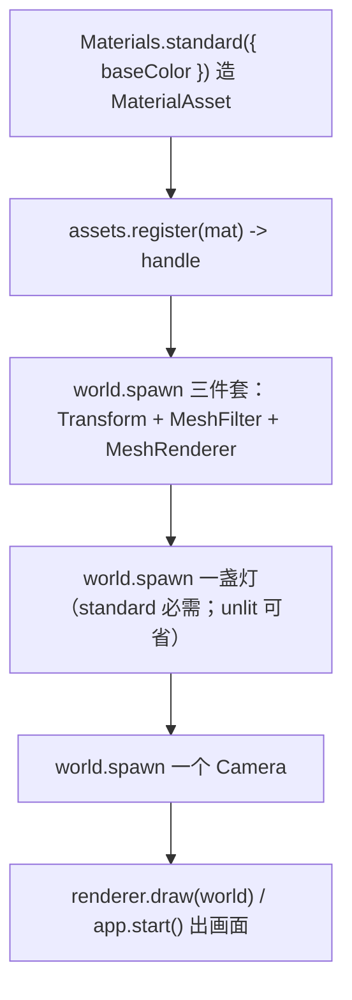

# forgeax-engine-material

> 基线: [`5c8c90f1`](../../commit/5c8c90f1) (2026-06-03) · 同步至: studio game-template integration (2026-06-17, Skylight 可选 cubemap + color/intensity 纯色环境光)

> **material = 让东西可见的三件套**。一个实体要被画出来，缺一不可：几何（MeshFilter）+ 材质绑定（MeshRenderer）+ 材质资源（MaterialAsset），standard 材质还需要场景里有灯。聚合 `@forgeax/engine-runtime`（material / mesh / lights / shadow）。

## 心智模型

渲染一个物体是"槽 + 资源"的组合：`MeshFilter` 是**几何槽**（指向一个 `MeshAsset` handle，内建有 `HANDLE_CUBE/QUAD/TRIANGLE/SPHERE`），`MeshRenderer` 是**材质绑定槽**（指向一个 `MaterialAsset` handle）。`MaterialAsset` 不在组件里手搓，用 `Materials.unlit(...)` / `Materials.standard(...)` 工厂造，`assets.register(...)` 拿回 handle。`unlit` 自发光不吃光照（调试 / UI 常用），`standard` 走 PBR 需要场景里有 `DirectionalLight` / `PointLight` / `SpotLight`——没灯就是一团黑。`Transform` 决定它在哪。

## 核心 API / 组件速查

| 名字 | 形态 | 用途 |
|:--|:--|:--|
| `MeshFilter` | 组件 `{ assetHandle: Handle<MeshAsset> }` | 几何槽：物体长什么形状 |
| `MeshRenderer` | 组件 `{ materials: readonly Handle<MaterialAsset>[], frustumCulled, pickable }` | 材质绑定槽：`materials[i]` 对 `submeshes[i]`，单 submesh 也写数组 `[handle]` |
| `Materials.unlit([r,g,b,a])` | `=> MaterialAsset` | 自发光纯色，不吃光照 |
| `Materials.standard({ baseColor, metallic?, roughness? })` | `=> MaterialAsset` | PBR；`metallic` 默认 0，`roughness` 默认 0.5 |
| `assets.register(materialAsset)` | `=> Result<Handle, AssetError>` | 注册材质拿 handle |
| `DirectionalLight` / `PointLight` / `SpotLight` | 组件 | 直接光源；standard 材质要靠它 |
| `Skylight` | 组件 `{ cubemap?, colorR/G/B, intensity }` | 环境光（ambient）。`cubemap` **可选**：省略 → 即时纯色环境光（白 fallback cube，无 async），给 cubemap → 完整 IBL。`color`×`intensity` 都是每帧实时调的 |
| `HANDLE_CUBE / QUAD / TRIANGLE / SPHERE` | 内建 `Handle<MeshAsset>` | 喂给 `MeshFilter.assetHandle` |
| `Transform` | 组件 | 位置 / 朝向 / 缩放（local TRS，引擎派生 world mat4） |

> [!CAUTION]
> `MaterialAsset` 已经**没有** `shadingModel` 字段（feat-20260526 改成 pass-based）。AGENTS.md §Component naming 里残留的 `MaterialAsset.shadingModel: 'unlit' | 'standard'` 描述是过期的——别按那个字段写代码，用 `Materials.unlit` / `Materials.standard` 工厂区分。

## 规范调用顺序



## idiom 代码骨架

```ts
import {
  Materials, MeshFilter, MeshRenderer, Transform,
  DirectionalLight, Camera, HANDLE_SPHERE,
} from '@forgeax/engine-runtime';

// 1) build + register the material -> handle
const matHandle = renderer.assets
  .register(Materials.standard({ baseColor: [0.8, 0.2, 0.2, 1], metallic: 0, roughness: 0.5 }))
  .unwrap();

// 2) the visible trio
world.spawn(
  { component: Transform, data: { posX: 0, posY: 0, posZ: 0, quatW: 1, scaleX: 1, scaleY: 1, scaleZ: 1 } },
  { component: MeshFilter, data: { assetHandle: HANDLE_SPHERE } },
  { component: MeshRenderer, data: { materials: [matHandle] } },
).unwrap();

// 3) standard PBR needs a light, or the frame is black
world.spawn({ component: DirectionalLight, data: {} }).unwrap();
world.spawn({ component: Camera, data: {} }).unwrap();
```

## 踩坑

- **standard 材质全黑**：场景里没灯。`unlit` 自发光不需要灯，`standard` 没有 `DirectionalLight/PointLight/SpotLight`/`Skylight` 任意一种就一团黑——先 spawn 一盏灯。
- **冷启动 / 无 IBL 时全黑几秒**：只挂 `DirectionalLight` 而环境光指望异步 IBL cubemap（`uploadCubemapFromEquirect` 要 GPU 预计算几秒）时，cubemap 就绪前场景接近黑。要即时环境光就 spawn **无 cubemap 的 Skylight**：`world.spawn({ component: Skylight, data: {} })` 给纯白环境光（首帧即亮，零 async），或 `data: { colorR, colorG, colorB, intensity }` 调色调强。给了 cubemap 才升级到完整 IBL。**别用高处补一盏常亮 PointLight 当 crutch**——那是绕过引擎缺口，现在引擎已直接支持纯色环境光。
- **贴图槽纯白方块**：`paramValues` 里贴图传了 GUID 字符串而非解析后的 `Handle`（extract 阶段只认 `number`）。详细判定 + 修法见 [`forgeax-engine-debug`](../forgeax-engine-debug/SKILL.md) §贴图纯白。
- **材质注册失败走黑/白回退**：`.pack.json` 里 `passes[].shader` 标识符改名残留 → `register failed: shader 'X' not registered`。见 [`forgeax-engine-debug`](../forgeax-engine-debug/SKILL.md) §shader 标识符残留。
- **物体不在该在的位置**：`Transform` 写的是 local TRS，引擎每帧派生 world mat4；要读世界坐标见 [`forgeax-engine-math`](../forgeax-engine-math/SKILL.md)。
- **glTF 蒙皮模型 (`.glb` w/ JOINTS_0+WEIGHTS_0) 自动用 `pbr-skin` shader**：cooker (`@forgeax/engine-gltf` `gltfDocToSceneAsset`) 在 mesh 含 `skinAttrs` 时把 material `passes[].shader` 从 `forgeax::default-standard-pbr` 改写为 `forgeax::pbr-skin` (feat-20260611 w17-a)；不需要手写 `.pack.json` 选 shader。下游 18F vertex layout / `pbr-skin-pl` pipeline-layout / extract 18F↔pbr-skin 同进同退由 runtime 自动接通。整链路诊断见 [`forgeax-engine-debug`](../forgeax-engine-debug/SKILL.md) §skin-vertex-attribute-chain。

## 深入

- 渲染流程（zero-config 默认 vs tonemap opt-in）/ FXAA / built-in mesh handles：见 `packages/runtime/README.md` §Render flow · §Built-in mesh handles
- 灯光 / shadow mapping / `DirectionalLightShadow`：见 `packages/runtime/README.md` §Lights · §Shadow mapping（`pcfKernelSize` now wired: drives directional shadow PCF kernel size, 1=hard / 3=soft / 5=softer）
- `Materials` 工厂 + `MaterialAsset` pass 结构：源码 SSOT `packages/runtime/src/materials.ts` + `packages/runtime/src/asset-registry.ts`
- 组件字段定义：源码 `packages/runtime/src/components/{mesh-filter,mesh-renderer,directional-light,point-light,spot-light,skylight}.ts`
- Skylight 环境光（可选 cubemap 纯色 fallback + color/intensity）：源码 SSOT `packages/runtime/src/components/skylight.ts` + `packages/runtime/src/ibl/skylight-bind-group.ts`（白 fallback irradiance cube）+ IBL 完整链路见 `packages/runtime/README.md` §Skylight / IBL
- `RuntimeErrorCode` 全集（勿抄）：`packages/runtime/src/errors.ts`
- 非三角形绘制（线框 / 点云 / debug-line）：`MeshAsset.submeshes[]`（必填非空）每项 `Submesh` 自带 `topology`（全 5 种：`'point-list' | 'line-list' | 'line-strip' | 'triangle-list' | 'triangle-strip'`，缺省 `'triangle-list'`）；vertex-only 的 line-list/point-list 可省 indices 走非索引 draw。用法见 `apps/hello/topology` demo + 源码 SSOT `packages/types/src/index.ts` `Submesh` JSDoc

### 贴图字段白名单（`MATERIAL_PARAM_TEXTURE_FIELDS`）

`MaterialAsset.paramValues` 的"贴图字段"由 `asset-registry.ts` 的 `MATERIAL_PARAM_TEXTURE_FIELDS` 闭集白名单声明，加载阶段把 GUID 字符串解析为 `Handle<TextureAsset>`。当前 6 个白名单字段：

| 字段 | 用途 | engine-side 消费方 |
|:--|:--|:--|
| `baseColorTexture` | albedo 颜色贴图 | 内建 PBR shader（standard 工厂自带） |
| `metallicRoughnessTexture` | metallic / roughness 打包贴图 | 内建 PBR shader |
| `normalTexture` | tangent-space 法线贴图 | 内建 PBR shader |
| `emissiveTexture` | 自发光贴图 | 内建 PBR shader |
| `occlusionTexture` | 环境光遮蔽贴图 | 内建 PBR shader |
| `heightTexture` | parallax mapping 高度图 | **仅 custom shader**（引擎 PBR 不读） |

接入：写 `paramValues.heightTexture: '<guid>'`，loader 解析为 handle；自定义 WGSL 通过 `paramSchema` 声明 `name='heightTexture' type='texture2d'` 拿到 binding。未设字段时 `paramValues.heightTexture` 为 `undefined`，不报错。

> [!IMPORTANT]
> **custom shader 声明任意贴图字段即自动获得 GPU binding（feat-20260621）。** material BGL 现在按 shader 的 `paramSchema` **逐 shader 派生**（`derive(paramSchema)` SSOT）：声明 `name='heightTexture' type='texture2d'` 后，extract（`render-system-extract.ts` 遍历 `textureFieldNames`）把 handle 取出，record（`render-system-record.ts`）把它装配进 `@group(1)` 派生 BGL 的对应 sampler/texture 对，端到端绑定——**不再需要改引擎扩槽位**。worked example：`apps/learn-render/5.advanced-lighting/5.parallax-mapping/`（basic/steep/POM 三算法，`heightTexture` 落 binding 5/6）。内建 PBR 材质 BGL 行为不变（仍 baseColor/metallicRoughness/normal 三贴图）。binding 排布 + sampler-first 规则见 [`forgeax-engine-shader`](../forgeax-engine-shader/SKILL.md) §内置绑定约定。

### 自定义材质：POJO `MaterialAsset` 直接构造（绕开工厂）

需要 custom shader + 自定义 `paramValues` 时，直接构造 `MaterialAsset` POJO 比 `Materials.standard` 工厂更直接——工厂只覆盖内建 PBR / unlit pass，custom shader 必须 POJO。模式见 `apps/learn-render/5.advanced-lighting/4.normal-mapping/src/index.ts`：

```ts
const mat: MaterialAsset = {
  schemaVersion: 1,
  refs: [baseColorGuid, normalGuid],   // 资产 GUID 数组（loader 用此解析）
  passes: [{
    name: 'Forward',                    // pass 显示名
    shader: 'forgeax::default-standard-pbr',  // registered shader id
  }],
  paramValues: {
    baseColorTexture: 0,                // refs[] 槽位偏移；loader 解析为 Handle<TextureAsset>
    normalTexture: 1,                   // 5.4 normal-mapping 关键字段
  },
} satisfies MaterialAsset;
const handle = renderer.assets.register(mat).unwrap();
```

POJO 路径仍走完整 loader pipeline：`MATERIAL_PARAM_TEXTURE_FIELDS` 白名单字段照样解析 GUID → handle，shader 标识符同样走 `registerMaterialShader` 注册表查询。区别只是构造期不走工厂语法糖。

## HDRP deferred opaque + forward transparent（≤ 256 灯打开关）

HDRP 默认 = **deferred opaque + forward transparent** 双阶段。URP 是引擎默认（zero-config，最多 8 punctual + 1 directional）。**场景需要 ≤ 256 punctual 灯就一行 opt-in 切到 HDRP**——opaque 几何写入 g-buffer（3 color RT + depth）→ lighting 全屏 quad 解码 g-buffer + cluster bins 计算 GGX → transparent 几何经 depth test（读 g-buffer depth）走 cluster-forward 写 hdrColor。

cluster-forward 把屏幕分 16×9×24 cluster cell，每像素只算覆盖自己 cell 的灯，复杂度不再随灯数线性涨。deferred 路径受益于 overdraw 密集场景（多灯 / 重叠几何），transparent 几何自动走 forward fallback（charter P4 一致抽象）。

```ts
import { HDRP_PIPELINE_ID, TONEMAP_ACES_FILMIC } from '@forgeax/engine-runtime';
import type { RenderPipelineAsset } from '@forgeax/engine-types';

// 1) register HDRP RenderPipelineAsset (clusterGrid 是 boot-time 决定，每维 [1,64])
const hdrpHandle = renderer.assets
  .register<RenderPipelineAsset>({
    kind: 'render-pipeline',
    pipelineId: HDRP_PIPELINE_ID,
    config: { clusterGrid: { x: 16, y: 9, z: 24 } },
  })
  .unwrap();

// 2) install — 这一行让 renderer 走 HDRP；未调用前一直是 URP
renderer.installPipeline(hdrpHandle).unwrap();

// 3) Camera 接 ACES tonemap（HDR 累积必须，否则 swap-chain sRGB clamp 会全白 burnout）
world.spawn(
  { component: Transform, data: { posX: 0, posY: 1.5, posZ: 6, quatW: 1 } },
  {
    component: Camera,
    data: {
      ...perspective({ fov: Math.PI / 4, aspect: 16 / 9, near: 0.1, far: 50 }),
      tonemap: TONEMAP_ACES_FILMIC,
      exposure: 0.6,
    },
  },
).unwrap();

// 4) 灯就和 URP 一样 spawn —— PointLight / SpotLight 一直加到 256 个
//    单灯 intensity 维持低位（点 0.3..0.7 / 聚光 0.5..1.0）让 256 灯叠加后 ACES 不爆
```

完整 demo：`apps/hello/hdrp-lighting`（200 PointLight + 56 SpotLight + falsify cluster-grid-zero 反证）。

> [!CAUTION]
> **灯数 > 256 不要用 HDRP**——`MAX_LIGHTS=256` 是固定上限（FR-3）。超过的灯会被 binner 截断且不出 fail-fast；多灯方案后续走 deferred path（OOS）。

> [!IMPORTANT]
> HDRP 安装后 opaque standard PBR 走 deferred（g-buffer write + lighting pass），transparent material 走 forward（cluster-forward），`Materials.standard(...)` 自动产出 3 条 pass。手写 `MaterialAsset` 字面量如仅声明 `passKind='forward'` 单 pass 则 opaque 几何在 forward pass 渲染——视觉等价但路径不同，显式补 `passKind='deferred'` 可参与 g-buffer。URP 在 install 期间被替换。`HdrpInstallError`（`.code='hdrp-grid-invalid'`）在 grid 任一维不属于 [1,64] 整数时抛——见源码 SSOT `packages/runtime/src/hdrp-pipeline.ts`。

| 项 | URP（默认） | HDRP（默认 deferred） |
|:--|:--|:--|
| 灯上限 | 8 punctual + 1 directional | 256 punctual + N directional |
| 安装 | 无（zero-config） | 1 行 `installPipeline(hdrpHandle)` |
| opaque 路径 | forward (per-light loop) | **deferred**：g-buffer write → lighting full-screen quad (GGX + cluster bins) |
| transparent 路径 | forward (alpha-blend) | **forward**：depth test vs g-buffer → cluster-forward |
| target 格式 | swap-chain `bgra8unorm-srgb` | HDR `rgba16float` → tonemap → swap-chain |
| 复杂度 | O(P × L) | O(P × L_cluster)，L_cluster 是单 cluster 平均覆盖灯数 |
| Tonemap | optional | **必需**（不接 ACES = 全白 burn） |
