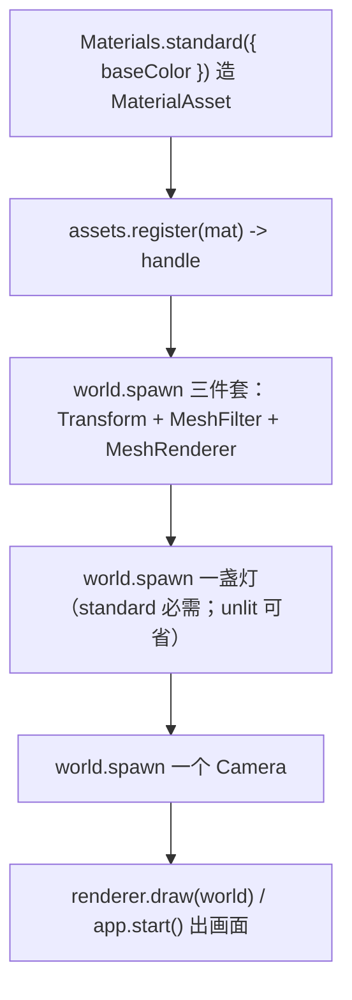

# forgeax-engine-material

> 基线: [`5c8c90f1`](../../commit/5c8c90f1) (2026-06-03) · 同步至: feat-20260623-world-space-video-asset M6（VideoPlayer 组件 + video GUID 进 paramValues 贴图槽）

> **material = 让东西可见的三件套**。一个实体要被画出来，缺一不可：几何（MeshFilter）+ 材质绑定（MeshRenderer）+ 材质资源（MaterialAsset），standard 材质还需要场景里有灯。聚合 `@forgeax/engine-runtime`（material / mesh / lights / shadow）。

## 心智模型

渲染一个物体是"槽 + 资源"的组合：`MeshFilter` 是**几何槽**（指向一个 `MeshAsset` handle，内建有 `HANDLE_CUBE/QUAD/TRIANGLE/SPHERE`），`MeshRenderer` 是**材质绑定槽**（指向一个 `MaterialAsset` handle）。`MaterialAsset` 不在组件里手搓，用 `Materials.unlit(...)` / `Materials.standard(...)` 工厂造，`assets.register(...)` 拿回 handle。`unlit` 自发光不吃光照（调试 / UI 常用），`standard` 走 PBR 需要场景里有 `DirectionalLight` / `PointLight` / `SpotLight`——没灯就是一团黑。`Transform` 决定它在哪。

## 核心 API / 组件速查

| 名字 | 形态 | 用途 |
|:--|:--|:--|
| `MeshFilter` | 组件 `{ assetHandle: Handle<MeshAsset> }` | 几何槽：物体长什么形状 |
| `MeshRenderer` | 组件 `{ materials: readonly Handle<MaterialAsset>[], frustumCulled, pickable }` | 材质绑定槽：`materials[i]` 对 `submeshes[i]`，单 submesh 也写数组 `[handle]` |
| `Materials.unlit([r,g,b,a])` | `=> MaterialAsset` | 自发光纯色，不吃光照 |
| `Materials.standard({ baseColor, metallic?, roughness? })` | `=> MaterialAsset` | PBR；`metallic` 默认 0，`roughness` 默认 0.5 |
| `assets.register(materialAsset)` | `=> Result<Handle, AssetError>` | 注册材质拿 handle |
| `DirectionalLight` / `PointLight` / `SpotLight` | 组件 | 直接光源；standard 材质要靠它 |
| `Skylight` | 组件 `{ cubemap?, colorR/G/B, intensity }` | 环境光（ambient）。`cubemap` **可选**：省略 → 即时纯色环境光（白 fallback cube，无 async），给 cubemap → 完整 IBL。`color`×`intensity` 都是每帧实时调的 |
| `VideoPlayer` | 组件 `{ clip, playing, loop, currentTime }` | 视频播放控制组件；`clip: Handle<'VideoAsset','shared'>` 指向 VideoAsset，对齐 AudioSource.clip |
| `VideoElementProvider` | interface + Resource key | host 实现的桥接接口；`world.insertResource(VIDEO_ELEMENT_PROVIDER_KEY, provider)` 注册后引擎的**每帧 record 阶段**直接取 element 上传（无需注册任何额外系统）|
| `HANDLE_CUBE / QUAD / TRIANGLE / SPHERE` | 内建 `Handle<MeshAsset>` | 喂给 `MeshFilter.assetHandle` |
| `Transform` | 组件 | 位置 / 朝向 / 缩放（local TRS，引擎派生 world mat4） |

> [!CAUTION]
> `MaterialAsset` 已经**没有** `shadingModel` 字段（feat-20260526 改成 pass-based）。AGENTS.md §Component naming 里残留的 `MaterialAsset.shadingModel: 'unlit' | 'standard'` 描述是过期的——别按那个字段写代码，用 `Materials.unlit` / `Materials.standard` 工厂区分。

## 规范调用顺序



## idiom 代码骨架

```ts
import {
  Materials, MeshFilter, MeshRenderer, Transform,
  DirectionalLight, Camera, HANDLE_SPHERE,
} from '@forgeax/engine-runtime';

// 1) build + register the material -> handle
const matHandle = renderer.assets
  .register(Materials.standard({ baseColor: [0.8, 0.2, 0.2, 1], metallic: 0, roughness: 0.5 }))
  .unwrap();

// 2) the visible trio
world.spawn(
  { component: Transform, data: { posX: 0, posY: 0, posZ: 0, quatW: 1, scaleX: 1, scaleY: 1, scaleZ: 1 } },
  { component: MeshFilter, data: { assetHandle: HANDLE_SPHERE } },
  { component: MeshRenderer, data: { materials: [matHandle] } },
).unwrap();

// 3) standard PBR needs a light, or the frame is black
world.spawn({ component: DirectionalLight, data: {} }).unwrap();
world.spawn({ component: Camera, data: {} }).unwrap();
```

## SpriteInstances（2D 批绘的让东西可见三件套，feat-20260625）

`SpriteInstances` 是 `Instances` 的 2D 同位组件——把 N 个 sprite 一次 drawcall 画完，per-instance 带 UV region：

```ts
import {
  MeshFilter, MeshRenderer, SpriteInstances, type SpriteInstancesData,
  HANDLE_QUAD,
} from '@forgeax/engine-runtime';

const transforms = new Float32Array(N * 16);  // column-major mat4 per instance
const regions    = new Float32Array(N * 4);   // [uMin, vMin, uW, vH] per instance
world.spawn(
  { component: MeshFilter,      data: { assetHandle: HANDLE_QUAD } },
  { component: MeshRenderer,    data: { materials: [spriteMatHandle] } },
  { component: SpriteInstances, data: { transforms, regions } },
);
```

| 选谁 | 什么时候 |
|:--|:--|
| `Instances` | 3D 场景批绘（per-instance 仅 mat4，stride 16 f32） |
| `SpriteInstances` | 2D 场景批绘（per-instance mat4 + atlas UV，interleaved 80B = 64B mat4 + 16B region） |

**materials[0] 首 pass shader 必须是 `'forgeax::sprite'`**（否则 extract 入口 fire `sprite-instances-requires-sprite-shader`）。**不可与 `Instances` 同实体共存**（fire `sprite-instances-mutually-exclusive-with-instances`）。**`transforms.length / 16` 必须等于 `regions.length / 4`**（fire `sprite-instances-count-mismatch`）。三条错误码均收敛于 `EcsErrorCode` 闭合联合，AI 用户通过 `switch (err.code)` 在 `world.onError` 消费（charter P3 显式失败）。

tilemap terrain 透明形态：AI 用户只用 `Tilemap + TileLayer { sortScope: 'layer' | 'per-cell' }`，engine 内部 extract system 自动把 `'layer'` 路径折叠为 `SpriteInstances` 桶（每 `(layer, chunk, atlas)` 一个），无需手挂 SpriteInstances。`'per-cell'` 路径保留 per-cell 派生 entity（Y-sort interleave 语义）。

详见 [`forgeax-engine-ecs` §SpriteInstances / TileLayer.sortScope](../forgeax-engine-ecs/SKILL.md#spriteinstances--tilelayersortscope-feat-20260625)（schema + 3 EcsErrorCode 详表）。

## 踩坑

- **standard 材质全黑**：场景里没灯。`unlit` 自发光不需要灯，`standard` 没有 `DirectionalLight/PointLight/SpotLight`/`Skylight` 任意一种就一团黑——先 spawn 一盏灯。
- **冷启动 / 无 IBL 时全黑几秒**：只挂 `DirectionalLight` 而环境光指望异步 IBL cubemap（`uploadCubemapFromEquirect` 要 GPU 预计算几秒）时，cubemap 就绪前场景接近黑。要即时环境光就 spawn **无 cubemap 的 Skylight**：`world.spawn({ component: Skylight, data: {} })` 给纯白环境光（首帧即亮，零 async），或 `data: { colorR, colorG, colorB, intensity }` 调色调强。给了 cubemap 才升级到完整 IBL。**别用高处补一盏常亮 PointLight 当 crutch**——那是绕过引擎缺口，现在引擎已直接支持纯色环境光。
- **贴图槽纯白方块**：`paramValues` 里贴图传了 GUID 字符串而非解析后的 `Handle`（extract 阶段只认 `number`）。详细判定 + 修法见 [`forgeax-engine-debug`](../forgeax-engine-debug/SKILL.md) §贴图纯白。
- **材质注册失败走黑/白回退**：`.pack.json` 里 `passes[].shader` 标识符改名残留 → `register failed: shader 'X' not registered`。见 [`forgeax-engine-debug`](../forgeax-engine-debug/SKILL.md) §shader 标识符残留。
- **物体不在该在的位置**：`Transform` 写的是 local TRS，引擎每帧派生 world mat4；要读世界坐标见 [`forgeax-engine-math`](../forgeax-engine-math/SKILL.md)。
- **glTF 蒙皮模型 (`.glb` w/ JOINTS_0+WEIGHTS_0) 自动用 `pbr-skin` shader**：cooker (`@forgeax/engine-gltf` `gltfDocToSceneAsset`) 在 mesh 含 `skinAttrs` 时把 material `passes[].shader` 从 `forgeax::default-standard-pbr` 改写为 `forgeax::pbr-skin` (feat-20260611 w17-a)；不需要手写 `.pack.json` 选 shader。下游 18F vertex layout / `pbr-skin-pl` pipeline-layout / extract 18F↔pbr-skin 同进同退由 runtime 自动接通。整链路诊断见 [`forgeax-engine-debug`](../forgeax-engine-debug/SKILL.md) §skin-vertex-attribute-chain。
- **方向光阴影不出现**：`DirectionalLight.castShadow` 默认为 `true`（feat-20260621 合并后），zero-config spawn 即投射 CSM 阴影。阴影不出现的两大根因：(a) `castShadow` 被手动设为 `false`——设回 `true` 或不填（走默认 true）；(b) **mesh 的材质缺少 `ShadowCaster` pass**——`Materials.standard(...)` 工厂自动产出 `passKind='shadow-caster'` 的 pass，引擎拿它把 mesh 画进 shadow depth atlas。手写 `MaterialAsset` 字面量如果只声明了 `forward` / `deferred` pass 而缺少 `shadow-caster`，该 mesh 静默不写入 shadow atlas——`castShadow` 开着也没阴影。修法：在 `passes[]` 里加一条 `{ name: 'ShadowCaster', shader: 'forgeax::default-standard-pbr' }` 或直接改用 `Materials.standard(...)` 工厂。详见 [`forgeax-engine-debug`](../forgeax-engine-debug/SKILL.md) §方向光阴影不出现。
- **聚光灯阴影不出现**：`SpotLight.castShadow` 默认为 `true`（feat-20260625 起），zero-config spawn 即投射 hard PCF 阴影（通过独立 `spotShadowDepth` atlas，`texture_depth_2d` + `sampler_comparison`，compat-safe）。阴影不出现的三大根因：(a) `castShadow` 被手动设为 `false`——删掉字段或设 `true`；(b) 场景超过 **4 盏** castShadow spot 灯——第 5 盏起被 clip（`shadowAtlasTile = -1`），灯仍正常直接光照但不投阴影；(c) mesh 的材质缺少 `ShadowCaster` pass——`Materials.standard(...)` 工厂自动产出，手写 `MaterialAsset` 须显式声明。`shadowAtlasTile` 是程序化检测锚点：`-1` 说明被 clip 或 `castShadow=false`，AI 用户/测试可据此断言撞了 4 灯上限。详见 [`forgeax-engine-debug`](../forgeax-engine-debug/SKILL.md) §聚光灯阴影不出现。

## 深入

- 渲染流程（zero-config 默认 vs tonemap opt-in）/ FXAA / built-in mesh handles：见 `packages/runtime/README.md` §Render flow · §Built-in mesh handles
- 灯光 / shadow mapping / `DirectionalLight` shadow 字段（合并后，`castShadow` 开关）：见 `packages/runtime/README.md` §Lights · §Shadow mapping（`pcfKernelSize` drives directional shadow PCF kernel size, 1=hard / 3=soft / 5=softer；`depthBias`/`normalBias` drive the slope-scaled shadow bias）
- `SpotLight` 阴影（默认投射，zero-config，feat-20260625）：见下 §SpotLight 阴影
- `Materials` 工厂 + `MaterialAsset` pass 结构：源码 SSOT `packages/runtime/src/materials.ts` + `packages/runtime/src/asset-registry.ts`
- 组件字段定义：源码 `packages/runtime/src/components/{mesh-filter,mesh-renderer,directional-light,point-light,spot-light,skylight}.ts`
- Skylight 环境光（可选 cubemap 纯色 fallback + color/intensity）：源码 SSOT `packages/runtime/src/components/skylight.ts` + `packages/runtime/src/ibl/skylight-bind-group.ts`（白 fallback irradiance cube）+ IBL 完整链路见 `packages/runtime/README.md` §Skylight / IBL
- `RuntimeErrorCode` 全集（勿抄）：`packages/runtime/src/errors.ts`
- 非三角形绘制（线框 / 点云 / debug-line）：`MeshAsset.submeshes[]`（必填非空）每项 `Submesh` 自带 `topology`（全 5 种：`'point-list' | 'line-list' | 'line-strip' | 'triangle-list' | 'triangle-strip'`，缺省 `'triangle-list'`）；vertex-only 的 line-list/point-list 可省 indices 走非索引 draw。用法见 `apps/hello/topology` demo + 源码 SSOT `packages/types/src/index.ts` `Submesh` JSDoc

### SpotLight 阴影（默认投射，zero-config）

> [!IMPORTANT]
> **一句话价值：** `SpotLight.castShadow` 默认为 `true`——spawn 即投 hard PCF 阴影，零配置。字段命名与调参语义对齐 `DirectionalLight`（同一套 `castShadow/mapSize/depthBias/normalBias/nearPlane/farPlane/pcfKernelSize`），从方向光迁移认知零成本。

**阴影字段速查（全部嵌入 `SpotLight`，无独立阴影组件）：**

| 字段 | 类型 | 默认值 | 用途 |
|:--|:--|:--|:--|
| `castShadow` | `bool` | `true` | 阴影开关；设 `false` 即不投阴影、不占 atlas tile、零深度 pass 开销（AC-03） |
| `mapSize` | `f32` | `2048` | 每 tile 阴影贴图分辨率（spot atlas = `2×2` tile，总大小 `2×mapSize × 2×mapSize`） |
| `depthBias` | `f32` | `0.005` | 深度偏移削 shadow acne；atch 对齐 DirectionalLight 默认值 |
| `normalBias` | `f32` | `0.05` | 法线偏移削掠射角自遮挡条纹 |
| `nearPlane` | `f32` | `0.1` | shadow-camera 近平面 |
| `farPlane` | `f32` | `50` | shadow-camera 远平面 |
| `pcfKernelSize` | `f32` | `3` | PCF 核宽度（本轮固定 9-tap 3×3，5×5 标记 OOS-defer） |

#### idiom

```ts
// 最小 spawn：默认投射阴影，零配置
world.spawn(
  { component: Transform, data: { posX: 0, posY: 5, posZ: 0 } },
  { component: SpotLight, data: { directionX: 0, directionY: -1, directionZ: 0 } },
);

// 显式关阴影（零开销路径）
world.spawn(
  { component: Transform, data: { posX: 0, posY: 5, posZ: 0 } },
  { component: SpotLight, data: { directionX: 0, directionY: -1, directionZ: 0, castShadow: false } },
);

// 调参消 self-shadow acne（对齐 directional 词汇）
world.spawn(
  { component: Transform, data: { posX: 0, posY: 5, posZ: 0 } },
  { component: SpotLight, data: { directionX: 0, directionY: -1, directionZ: 0, depthBias: 0.01, normalBias: 0.08, mapSize: 1024 } },
);
```

#### 4 灯上限 + clip 检测

spot 阴影 atlas 容量上限 **4 盏** castShadow 灯（对齐 point 灯数上限）。第 5 盏起被 clip——**不静默全黑**：灯仍正常直接光照（position/direction/color 不变），但 `shadowAtlasTile = -1` 是程序化检测锚点。AI 用户/测试可据此断言撞了上限：

```ts
// extract 阶段分配的 tile 索引：0..3 有效，-1 = 被 clip 或 castShadow=false
// AI 用户可通过 SpotLightSnapshot（extract 返回值）读 shadowAtlasTile
if (shadowAtlasTile === -1) {
  // 灯超限或显式关阴影——灯仍亮但无影
}
```

当场景不需阴影时把多余的 `castShadow` 设 `false` 释放 tile 名额。

#### compat-safe 硬约束

spot shadow 全链路**只用** `texture_depth_2d` + `sampler_comparison`（无 `texture_cube_array`、无 cube-array view）。WGSL binding 布局：binding 8 = `spotShadowMap`（`texture_depth_2d`，FRAGMENT-only）、sampler **复用** binding 4 `shadowSampler`（不占新 slot）；≤4 盏 spot 的透视矩阵随 **View UBO（binding 0）** 携带（字段 `view.spotLightViewProj: array<mat4x4,4>`，与 directional cascade 矩阵同处），**不占独立 binding**——这是为压回 WebGL2 fallback 的 `max_uniform_buffers_per_shader_stage=11` 上限（独立 binding 会成第 12 个 fragment uniform buffer 而炸移动端）。全部 always-on（无 `#ifdef` 条件门控），移动端 WebGPU Compatibility Mode 兼容。directional binding 3/4 与 point 5/6/7 不变。

spot 阴影深度采样调用共享低层核 `sample_shadow_2d`（`forgeax_pbr::shadow_pcf`，9-tap 固定核），与 directional 路径共享透视除法 + PCF 逻辑——不复制 PCF 循环代码。

**跨灯类型完整阴影绑定速查：**

| 灯类型 | atlas texture | sampler | 矩阵 / 参数 UBO |
|:--|:--|:--|:--|
| DirectionalLight | binding 3 (`shadowDepth`, `texture_depth_2d_array` CSM) | binding 4 `shadowSampler` | view UBO `lightViewProj_A..D` + shadow-params |
| PointLight | binding 5 (`pointShadowMap`, `texture_cube_array`) | binding 4 `shadowSampler` | binding 6 `shadowParams` (4×vec4) |
| **SpotLight** | **binding 8 (`spotShadowMap`, `texture_depth_2d`)** | **binding 4 `shadowSampler` (复用)** | **view UBO `view.spotLightViewProj` (4×mat4，不占独立 binding，WebGL2 uniform 预算)** |

### 贴图字段白名单（`MATERIAL_PARAM_TEXTURE_FIELDS`）

`MaterialAsset.paramValues` 的"贴图字段"由 `asset-registry.ts` 的 `MATERIAL_PARAM_TEXTURE_FIELDS` 闭集白名单声明，加载阶段把 GUID 字符串解析为 `Handle<TextureAsset>`。当前 6 个白名单字段：

| 字段 | 用途 | engine-side 消费方 |
|:--|:--|:--|
| `baseColorTexture` | albedo 颜色贴图 | 内建 PBR shader（standard 工厂自带） |
| `metallicRoughnessTexture` | metallic / roughness 打包贴图 | 内建 PBR shader |
| `normalTexture` | tangent-space 法线贴图 | 内建 PBR shader |
| `emissiveTexture` | 自发光贴图 | 内建 PBR shader |
| `occlusionTexture` | 环境光遮蔽贴图 | 内建 PBR shader |
| `heightTexture` | parallax mapping 高度图 | **仅 custom shader**（引擎 PBR 不读） |

接入：写 `paramValues.heightTexture: '<guid>'`，loader 解析为 handle；自定义 WGSL 通过 `paramSchema` 声明 `name='heightTexture' type='texture2d'` 拿到 binding。未设字段时 `paramValues.heightTexture` 为 `undefined`，不报错。

> [!IMPORTANT]
> **custom shader 声明任意贴图字段即自动获得 GPU binding（feat-20260621）。** material BGL 现在按 shader 的 `paramSchema` **逐 shader 派生**（`derive(paramSchema)` SSOT）：声明 `name='heightTexture' type='texture2d'` 后，extract（`render-system-extract.ts` 遍历 `textureFieldNames`）把 handle 取出，record（`render-system-record.ts`）把它装配进 `@group(1)` 派生 BGL 的对应 sampler/texture 对，端到端绑定——**不再需要改引擎扩槽位**。worked example：`apps/learn-render/5.advanced-lighting/5.parallax-mapping/`（basic/steep/POM 三算法，`heightTexture` 落 binding 5/6）。内建 PBR 材质 BGL 行为不变（仍 baseColor/metallicRoughness/normal 三贴图）。binding 排布 + sampler-first 规则见 [`forgeax-engine-shader`](../forgeax-engine-shader/SKILL.md) §内置绑定约定。

### 自定义材质：POJO `MaterialAsset` 直接构造（绕开工厂）

需要 custom shader + 自定义 `paramValues` 时，直接构造 `MaterialAsset` POJO 比 `Materials.standard` 工厂更直接——工厂只覆盖内建 PBR / unlit pass，custom shader 必须 POJO。模式见 `apps/learn-render/5.advanced-lighting/4.normal-mapping/src/index.ts`：

```ts
const mat: MaterialAsset = {
  schemaVersion: 1,
  refs: [baseColorGuid, normalGuid],   // 资产 GUID 数组（loader 用此解析）
  passes: [{
    name: 'Forward',                    // pass 显示名
    shader: 'forgeax::default-standard-pbr',  // registered shader id
  }],
  paramValues: {
    baseColorTexture: 0,                // refs[] 槽位偏移；loader 解析为 Handle<TextureAsset>
    normalTexture: 1,                   // 5.4 normal-mapping 关键字段
  },
} satisfies MaterialAsset;
const handle = renderer.assets.register(mat).unwrap();
```

POJO 路径仍走完整 loader pipeline：`MATERIAL_PARAM_TEXTURE_FIELDS` 白名单字段照样解析 GUID → handle，shader 标识符同样走 `registerMaterialShader` 注册表查询。区别只是构造期不走工厂语法糖。

### Sprite material：`renderState.blend` 是 transparent 的 SSOT

sprite material 走同一条 `MaterialAsset` POJO 路径，区别仅在 shader id 与 `renderState.blend`。**`renderState.blend !== undefined` 是 transparent 路由（LDR sub-pass split + back-to-front sort）的 SSOT 信号**；旧版 `transparent: boolean` 字段已被 feat-20260626 坍缩消亡。推荐 preset：`SPRITE_PREMULTIPLIED_ALPHA_BLEND`（`@forgeax/engine-runtime` re-export 自 `packages/runtime/src/materials.ts`）。

```ts
import {
  SPRITE_PREMULTIPLIED_ALPHA_BLEND,
  type MaterialAsset,
} from '@forgeax/engine-runtime';

const spriteMat: MaterialAsset = {
  kind: 'material',
  passes: [{
    name: 'Forward',
    shader: 'forgeax::sprite',
    renderState: { blend: SPRITE_PREMULTIPLIED_ALPHA_BLEND },
  }],
  paramValues: {
    colorTint: [1, 1, 1, 1],
    baseColorTexture: spriteTextureGuid,   // dash-form GUID string
    sampler: spriteSamplerGuid,
  },
};
```

漏写 `renderState.blend` → 走 opaque pass（hard-edged 非 blended quad）。SSOT 与 preset 速查表（additive / multiply / straight-alpha / opaque overlay 字面量）见 `packages/runtime/README.md` §Sprite materials。

## 世界空间视频纹理 -- VideoPlayer + paramValues video GUID

**一句话价值：** 视频就是"会动的贴图"——`MaterialAsset.paramValues` 的贴图字段（如 `baseColorTexture`）填入 VideoAsset GUID 后，材质采样视频帧的方式与静态贴图完全相同。AI 用户只需改一句 GUID，其余链路无需变动。

视频纹理的完整数据流：host 侧实现 `VideoElementProvider` → `world.insertResource(VIDEO_ELEMENT_PROVIDER_KEY, provider)` → spawn entity 带 `VideoPlayer { clip, playing, loop }` + `MeshFilter` + `MeshRenderer`（材质 paramValues 贴图字段引用 VideoAsset GUID 的**短横线字符串**形式，不是 `AssetGuid` 对象）。引擎**每帧 record 阶段**直接通过 provider 取 `HTMLVideoElement`、`copyExternalImageToTexture` 上传当前帧到 transient texture、shader 从同一 `texture2d` 槽位采样——**无需注册任何额外 ECS 系统**：上传与 AC-10 失败信号都在真实 `renderer.draw` 路径上。

### idiom 骨架

```ts
import {
  Camera, createRenderer, DirectionalLight,
  MeshFilter, MeshRenderer, HANDLE_QUAD, perspective, Transform,
  VideoPlayer, VIDEO_ELEMENT_PROVIDER_KEY,
  type VideoElementProvider,
} from '@forgeax/engine-runtime';
import type { VideoAsset } from '@forgeax/engine-types';

const renderer = await createRenderer(canvas);
await renderer.ready;
const assets = renderer.assets;
if (assets === null) throw new Error('backend not initialized');

const world = new World();

// --- host side: implement VideoElementProvider ---
const provider: VideoElementProvider = {
  getElement(_entity, _clipHandle) {
    const el = document.createElement('video');
    el.src = '/clip.webm';
    el.muted = true;
    el.playsInline = true;
    el.loop = true;
    el.crossOrigin = 'anonymous';
    el.load();
    el.play().catch(() => {});
    return el;
  },
};
world.insertResource(VIDEO_ELEMENT_PROVIDER_KEY, provider);
// No system to register: the per-frame upload runs inside renderer.draw.

// --- AI-user side: register VideoAsset ---
const videoGuid = /* parse/allocate GUID */;
assets.catalog<VideoAsset>(videoGuid, { kind: 'video', url: '/clip.webm' });
const videoRes = await assets.loadByGuid<VideoAsset>(videoGuid);
if (!videoRes.ok) throw new Error(videoRes.error.code);
const videoClipHandle = world.allocSharedRef('VideoAsset', videoRes.value);

// --- material with video GUID in paramValues ---
// (identical to a static texture material — only the GUID's kind differs)
const VIDEO_GUID_STRING = 'f1b3d000-1111-4aaa-9eee-aa1111112222'; // dash-form
const matGuid = /* parse/allocate GUID */;
assets.catalog(matGuid, {
  kind: 'material',
  passes: [{ name: 'Forward', shader: 'forgeax::default-unlit' }],
  paramValues: {
    baseColor: [0.9, 0.9, 0.9],
    // paramValues texture fields take a DASH-FORM GUID STRING (not the AssetGuid
    // object / Uint8Array). A non-string here matches neither the string nor the
    // minted-handle (number) arm and silently drops to the default white texture.
    baseColorTexture: VIDEO_GUID_STRING,
  },
});
const matRes = await assets.loadByGuid(matGuid);
if (!matRes.ok) throw new Error(matRes.error.code);
const matHandle = world.allocSharedRef('MaterialAsset', matRes.value);

// --- spawn the video-textured entity ---
world.spawn(
  { component: MeshFilter, data: { assetHandle: HANDLE_QUAD } },
  { component: MeshRenderer, data: { materials: [matHandle] } },
  { component: VideoPlayer, data: { clip: videoClipHandle, playing: true, loop: true } },
  { component: Transform, data: { posX: 0, posY: 0, posZ: -1, scaleX: 2, scaleY: 2 } },
);
// Use the perspective() factory: fov is in RADIANS and aspect has no schema
// default — a raw `{ fov: 60 }` leaves aspect=0 (degenerate projection -> blank
// screen) and treats 60 as radians.
world.spawn(
  { component: Camera, data: perspective({ fov: Math.PI / 3, aspect: canvas.width / canvas.height }) },
  { component: Transform, data: { posX: 0, posY: 0, posZ: 5 } },
);
world.spawn({ component: DirectionalLight, data: {} });

// --- render loop ---
const frame = () => {
  renderer.draw(world);
  requestAnimationFrame(frame);
};
requestAnimationFrame(frame);
```

完整范例：`apps/hello/video-texture`（M5 demo，host provider + AI-user 场景同文件）。

### AI 用户代码与静态贴图逐行同构

对比静态贴图材质 vs 视频纹理材质——**唯一差异是 GUID 指向的 Asset kind**：

```ts
// Static texture: TextureAsset { kind: 'texture', ... }
const staticMat = { paramValues: { baseColorTexture: textureGuid } };

// Video texture: VideoAsset { kind: 'video', url: '...' }
const videoMat = { paramValues: { baseColorTexture: videoGuid } };
```

材质构造、`paramValues` 字段、shader 绑定、深度遮挡、相机透视——全部一致。AI 用户学一次 `paramValues` 贴图字段即覆盖静态贴图与视频纹理。

### 能力边界

| 边界 | 说明 |
|:--|:--|
| **dawn-node 不渲染视频** | dawn 环境无 `HTMLVideoElement` / `VideoFrame`。像素验收只能走 browser e2e；dawn smoke 只验证结构链路 |
| **需 host 提供 `<video>`** | 引擎绝不创建 `<video>` / 设 `.src` / 碰 DOM。host 必须实现 `VideoElementProvider` 并 `insertResource` 为 World Resource（无需注册任何系统，record 阶段每帧自动取）|
| **无声轨** | `VideoPlayer` 不控音频；声音归后续 feat 或 host 自行管理 |
| **capability 双缺显式失败** | 两上传路径都不可用时（无 host element + 高性能路径未实现），引擎在真实 record 路径上 `errorRegistry.fire(VideoUploadUnsupportedError)`——`renderer.onError` 收到 `{ code: 'video-upload-unsupported', hint }`，AI 用户通过属性访问消费，不解析字符串 |
| **高性能路径为钩子** | `GPUExternalTexture` 零拷贝路径未实现（OOS-5），仅保留显式探测分支。通用 `copyExternalImageToTexture` 路径已全做且端到端可用 |

### 踩坑：视频纹理专用

- **dawn-node smoke 无画面**：dawn 无 `HTMLVideoElement`——视频像素只能 browser 验收。dawn structural smoke 仅验证注册/负载/组件链路不炸，**不验像素**。
- **视频画面黑屏**：先排查 demo 场景三连（这两条最常踩）：(a) **相机** 用 `perspective({ fov, aspect })` 工厂——别传裸 `{ fov: 60 }`（fov 当弧度 + aspect=0 退化投影 = 全屏空白）；(b) **paramValues 贴图字段** 填**短横线 GUID 字符串**，不是 `AssetGuid` 对象（对象既非 string 又非 number，整条 video 路由被静默丢弃 → 默认白）。再排查 video 链路：(c) `VideoElementProvider` 是否已 `insertResource`、(d) `VideoPlayer.clip` handle 是否指向正确的 VideoAsset GUID。能力双缺时引擎在 record 路径 fire `video-upload-unsupported`，`renderer.onError` 收到该 code 可定位根因。
- **video 材质不走静态 cache**：video 帧通过独立 `DynamicTextureStore` 每帧上传，**不进** `GpuResourceStore.ensureResident`。静态贴图的 `invalidate` 对 video 无缓存语义。

## HDRP deferred opaque + forward transparent（≤ 256 灯打开关）

HDRP 默认 = **deferred opaque + forward transparent** 双阶段。URP 是引擎默认（zero-config，最多 8 punctual + 1 directional）。**场景需要 ≤ 256 punctual 灯就一行 opt-in 切到 HDRP**——opaque 几何写入 g-buffer（3 color RT + depth）→ lighting 全屏 quad 解码 g-buffer + cluster bins 计算 GGX → transparent 几何经 depth test（读 g-buffer depth）走 cluster-forward 写 hdrColor。

cluster-forward 把屏幕分 16×9×24 cluster cell，每像素只算覆盖自己 cell 的灯，复杂度不再随灯数线性涨。deferred 路径受益于 overdraw 密集场景（多灯 / 重叠几何），transparent 几何自动走 forward fallback（charter P4 一致抽象）。

```ts
import { HDRP_PIPELINE_ID, TONEMAP_ACES_FILMIC } from '@forgeax/engine-runtime';
import type { RenderPipelineAsset } from '@forgeax/engine-types';

// 1) register HDRP RenderPipelineAsset (clusterGrid 是 boot-time 决定，每维 [1,64])
const hdrpHandle = renderer.assets
  .register<RenderPipelineAsset>({
    kind: 'render-pipeline',
    pipelineId: HDRP_PIPELINE_ID,
    config: { clusterGrid: { x: 16, y: 9, z: 24 } },
  })
  .unwrap();

// 2) install — 这一行让 renderer 走 HDRP；未调用前一直是 URP
renderer.installPipeline(hdrpHandle).unwrap();

// 3) Camera 接 ACES tonemap（HDR 累积必须，否则 swap-chain sRGB clamp 会全白 burnout）
world.spawn(
  { component: Transform, data: { posX: 0, posY: 1.5, posZ: 6, quatW: 1 } },
  {
    component: Camera,
    data: {
      ...perspective({ fov: Math.PI / 4, aspect: 16 / 9, near: 0.1, far: 50 }),
      tonemap: TONEMAP_ACES_FILMIC,
      exposure: 0.6,
    },
  },
).unwrap();

// 4) 灯就和 URP 一样 spawn —— PointLight / SpotLight 一直加到 256 个
//    单灯 intensity 维持低位（点 0.3..0.7 / 聚光 0.5..1.0）让 256 灯叠加后 ACES 不爆
```

完整 demo：`apps/hello/hdrp-lighting`（200 PointLight + 56 SpotLight + falsify cluster-grid-zero 反证）。

> [!CAUTION]
> **灯数 > 256 不要用 HDRP**——`MAX_LIGHTS=256` 是固定上限（FR-3）。超过的灯会被 binner 截断且不出 fail-fast；多灯方案后续走 deferred path（OOS）。

> [!IMPORTANT]
> HDRP 安装后 opaque standard PBR 走 deferred（g-buffer write + lighting pass），transparent material 走 forward（cluster-forward），`Materials.standard(...)` 自动产出 3 条 pass。手写 `MaterialAsset` 字面量如仅声明 `passKind='forward'` 单 pass 则 opaque 几何在 forward pass 渲染——视觉等价但路径不同，显式补 `passKind='deferred'` 可参与 g-buffer。URP 在 install 期间被替换。`HdrpInstallError`（`.code='hdrp-grid-invalid'`）在 grid 任一维不属于 [1,64] 整数时抛——见源码 SSOT `packages/runtime/src/hdrp-pipeline.ts`。

| 项 | URP（默认） | HDRP（默认 deferred） |
|:--|:--|:--|
| 灯上限 | 8 punctual + 1 directional | 256 punctual + N directional |
| 安装 | 无（zero-config） | 1 行 `installPipeline(hdrpHandle)` |
| opaque 路径 | forward (per-light loop) | **deferred**：g-buffer write → lighting full-screen quad (GGX + cluster bins) |
| transparent 路径 | forward (alpha-blend) | **forward**：depth test vs g-buffer → cluster-forward |
| target 格式 | swap-chain `bgra8unorm-srgb` | HDR `rgba16float` → tonemap → swap-chain |
| 复杂度 | O(P × L) | O(P × L_cluster)，L_cluster 是单 cluster 平均覆盖灯数 |
| Tonemap | optional | **必需**（不接 ACES = 全白 burn） |
