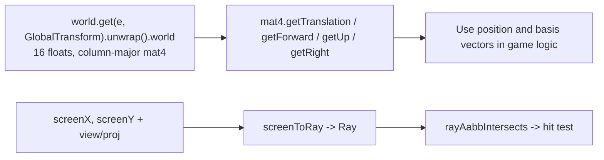

# forgeax-engine-math

> Pure functions, out-parameter-first, SoA-friendly math. Functions take `out` first to reuse buffers on allocation-free hot paths. Covers `@forgeax/engine-math`.

## Mental model

Namespaces (`vec3` / `mat4` / `quat` / `color` ...) group pure functions with `out` first: `vec3.add(out, a, b)` writes and returns `out`, allowing buffer reuse without GC. A common task is reading an entity's world pose: `GlobalTransform.world` is a derived column-major mat4 of 16 floats, updated every frame. Author local TRS; let the engine derive world transforms. Read position and basis vectors with `mat4.getTranslation/getForward/getUp/getRight` instead of unpacking matrices. Conversely, `screenToRay` constructs a world ray from screen coordinates and view/projection matrices.

## Core API quick reference

| Namespace / function | Form | Purpose |
|:--|:--|:--|
| `vec3.add/sub/scale/dot/cross/normalize/lerp(out, ...)` | out-param | Vector operations (`vec2`/`vec4` follow the same pattern). |
| `vec3.smoothDamp(out, current, target, decayRate, dt)` | `=> Vec3` | Frame-rate-independent exponential smoothing: `lerp(current, target, 1−exp(−decayRate·dt))`, equivalent to Bevy `Vec3::smooth_nudge` / Three.js `MathUtils.damp`; also available for `vec2`/`vec4`. Do not use `lerp(p, target, rate·dt)` for tracking: it varies between 30/60 fps and overshoots when `rate·dt>1`. |
| `vec3.catmullRom(out, p0, p1, p2, p3, t)` | `=> Vec3` | Catmull-Rom spline sampling through control points, tension 0.5: `t=0` selects `p1`, `t=1` selects `p2`; `p0`/`p3` determine endpoint tangents. Equivalent to Bevy `CubicCardinalSpline::new_catmull_rom` / Three.js `CatmullRomCurve3`; also available for `vec2`. Use for camera/animation paths and procedural curves instead of hand-written cubic matrices. Slide a four-point window `[pts[i-1..i+2]]` along the polyline. |
| `mat4.multiply/invert/lookAt/perspective/compose(out, ...)` | out-param | Matrix operations. |
| `mat4.getTranslation(out, m)` | `=> Vec3` | Read position from world mat4 column 3. |
| `mat4.getForward/getUp/getRight(out, m)` | `=> Vec3` | Read basis vectors; forward is -Z. |
| `mat4.unproject(out, ndcPoint, invVP)` | `=> Vec3` | NDC to world coordinates. |
| `quat.fromEuler/slerp/multiply/transformVec3(out, ...)` | out-param | Rotation. |
| `quat.fromLookAt(out, eye, target, up)` | `=> Quat` | Orientation quaternion with local -Z toward target; replaces manual `lookAt→invert→mat3→fromRotationMatrix` composition. |
| `quat.rotateAxis(out, q, axis, angleRadians)` | `=> Quat` | Incrementally rotate `q` around world `axis` by the angle in radians and renormalize. Use for per-frame spin/animation, like Bevy `Transform::rotate_y`/`rotate_axis`; premultiplying the delta uses world-axis order. Repeated manual `multiply(q, fromAxisAngle(...))` without normalization drifts away from a unit quaternion. |
| `quat.right/up/forward(out, q)` | `=> Vec3` | Local basis vectors expressed in world space: right=q·+X / up=q·+Y / forward=q·−Z. Matches `mat4.getRight/getUp/getForward` and Bevy `Transform::local_x`/`local_y`/`forward`. Use for movement/aiming along local orientation instead of manual `transformVec3(out, q, [0,0,-1])`; unit quaternion input gives unit vectors. |
| `color.srgbToLinear/linearToSrgb/fromHex/toHex` | out-param / value | Color-space conversion. |
| `easing.cubicInOut / smoothstep / smootherstep / elasticInOut(t)` | `=> number` | Scalar time remapping, clamped to [0,1]. `cubicInOut` / `smoothstep` / `smootherstep` ease in/out; `elasticInOut` preserves elastic overshoot, like Bevy `EaseFunction`. Use for animation/UI/camera transitions instead of hand-written polynomials; `easing` is an extensible namespace. |
| `screenToRay(out, sx, sy, vpW, vpH, view, proj, kind)` | `=> Ray` | Screen coordinates to world ray. |
| `worldToScreen(out, worldPos, viewProj, canvasW, canvasH)` | `=> { onScreen, behind }` | World coordinates to screen pixels; dual of `screenToRay`. |
| `rayAabbIntersects(ray, aabb)` | `=> RayAabbResult` | Ray/bounding-box intersection. |
| `rayTriangleIntersects(r, a, b, c)` | `=> RayTriResult` | Double-sided Moller-Trumbore ray/triangle intersection. |
| `mat4.computeViewProj(out, eye, target, up, fov, aspect, near, far)` | `=> Mat4` | Convenience composition: perspective * lookAt, plain numeric parameters, no dependencies. |

> [!NOTE]
> `Transform` stores authored local TRS only; transient `GlobalTransform.world` stores the resolved world matrix, written each frame by `propagateTransforms`. Raw `world.spawn` must attach both components; SceneAsset/mount helpers supply the pair automatically.

## Read an entity pose



## Usage skeleton

```ts
import { mat4, vec3 } from '@forgeax/engine-math';
import { GlobalTransform } from '@forgeax/engine-scene';

// read world-space pose off GlobalTransform.world (a live 16-float column-major Float32Array)
const worldMat = world.get(entity, GlobalTransform).unwrap().world;
const pos = mat4.getTranslation(vec3.create(), worldMat); // m[12..14]
const fwd = mat4.getForward(vec3.create(), worldMat);     // -Z basis
const up = mat4.getUp(vec3.create(), worldMat);           // +Y basis

// out-param idiom: allocate once, reuse across frames
const tmp = vec3.create();
vec3.scale(tmp, fwd, 5);          // tmp = fwd * 5
vec3.add(pos, pos, tmp);          // pos = pos + tmp (writes into pos, returns it)
```

```ts
import { screenToRay, rayAabbIntersects, ray as rayNs } from '@forgeax/engine-math';

const r = screenToRay(rayNs.create(), mouseX, mouseY, vpW, vpH, viewMat, projMat, 'perspective');
const hit = rayAabbIntersects(r, entityAabb); // hit.hit -> boolean
```

```ts
import { ray, mat4, vec2 } from '@forgeax/engine-math';

// world -> screen: project a 3D point to pixels, y-down from top-left.
const vp = mat4.computeViewProj(mat4.create(), eye, target, up, fovY, aspect, 0.1, 100);
const out = vec2.create();
const r = ray.worldToScreen(out, worldPos, vp, canvasW, canvasH);
if (r.onScreen && !r.behind) {
  // out[0], out[1] are valid pixels for DOM overlays or HUD anchors.
}
```

```ts
import { pickVertexOnEntity, pickVertex } from '@forgeax/engine-picking';

// propagateTransforms must have run for this frame (D-9 precondition).
propagateTransforms(world);

// Nearest vertex on one entity; omitted limit -> VertexHit|undefined.
const hit = pickVertexOnEntity(world, cameraEntity, sx, sy, w, h, entity);
if (hit) {
  // hit.worldPos / vertexIndex / screenDist / worldDist / deformed
}

// Whole-scene query with limit -> VertexHit[], ascending screenDist.
const candidates = pickVertex(world, cameraEntity, sx, sy, w, h, { limit: 5 });
```

## worldToScreen: world coordinates to screen pixels

`ray.worldToScreen` is the dual of `screenToRay`: project a world-space 3D point back to screen pixels. It computes `mat4 * vec4` internally to preserve pre-division `w`; `projectPoint` discards `w` and cannot be reused.

```ts
import { ray, mat4 } from '@forgeax/engine-math';

const vp = mat4.computeViewProj(mat4.create(), eye, target, up, fovY, aspect, near, far);
const out = vec2.create();
const result = ray.worldToScreen(out, worldPos, vp, canvas.width, canvas.height);
// result.onScreen -- NDC xyz are all inside clip space.
// result.behind -- behind the camera (w < 0); out is meaningless.
// !onScreen && !behind: outside the frustum but in front; out remains valid for screen-edge clamping.
```

- **Out parameter**: the first argument is `Vec2`, written with y-down, top-left pixel coordinates: `px = (ndc.x * 0.5 + 0.5) * w`, `py = (1 - (ndc.y * 0.5 + 0.5)) * h`.
- **Plain-data flags**: returns `{ onScreen: boolean, behind: boolean }`.
- **Degenerate canvas**: `canvasW <= 0 || canvasH <= 0` returns `{ onScreen: false, behind: false }`, leaving `out` unchanged.
- **Barrel import**: `import { ray } from '@forgeax/engine-math'; ray.worldToScreen(...)`; symmetric with the `screenToRay` namespace.

## computeViewProj: perspective and view composition

`mat4.computeViewProj` composes `mat4.perspective * mat4.lookAt` using plain numbers and Vec3Like arguments. It has no runtime POD dependency and follows the abstraction of `lookAt` / `perspective` (charter P4).

```ts
const vp = mat4.computeViewProj(mat4.create(), eye, target, up, fovY, aspect, near, far);
// Equivalent to:
// const view = mat4.lookAt(mat4.create(), eye, target, up);
// const proj = mat4.perspective(mat4.create(), fovY, aspect, near, far);
// const vp = mat4.multiply(mat4.create(), proj, view);
```

- **Signature**: `computeViewProj(out, eye, target, up, fovYRadians, aspect, near, far): Mat4`.
- **Out-parameter style**: writes and returns the first argument.
- **Composition**: a convenience operation, identified in JSDoc; internally `lookAt` + `perspective`, then `multiply`.
- **Typical use**: supply `worldToScreen` for 3D-to-2D projection, without coupling to engine components.

## Screen picking: vertex queries (pickVertex / pickVertexOnEntity)

> Vertex picking queries without editing. Import from `@forgeax/engine-runtime`; it composes `rayTriangleIntersects` and `screenToRay`.

| Function / type | Form | Purpose |
|:--|:--|:--|
| `pickVertexOnEntity(w, cam, sx, sy, vpW, vpH, e)` | `=> VertexHit \| undefined` | Nearest vertex on one entity; omitted `options` returns one hit or `undefined`. |
| `pickVertexOnEntity(w, cam, sx, sy, vpW, vpH, e, { limit })` | `=> VertexHit[]` | With `{ limit: N }`, returns up to N candidates in ascending `screenDist`. |
| `pickVertex(w, cam, sx, sy, vpW, vpH)` | `=> VertexHit \| undefined` | Whole scene: broad-phase AABB filtering, then per-entity `pickVertexOnEntity`; returns the globally nearest hit. |
| `pickVertex(w, cam, sx, sy, vpW, vpH, { limit })` | `=> VertexHit[]` | Whole-scene multiple-candidate mode. |
| `VertexHit` | `{ entity: EntityHandle; vertexIndex: number; worldPos: Vec3Like; screenDist: number; worldDist: number; deformed: boolean }` | `screenDist` is pixel distance; `worldDist` is perpendicular 3D distance to the ray. `worldPos` uses `Vec3Like` to avoid brand casts. |

**Return contract**: omitted `limit` returns `VertexHit | undefined`, supporting safe if-hit narrowing and direct `hit.worldPos` access without casts. With `limit`, returns `VertexHit[]`: empty means miss; a limit above the hit count returns all candidates. TypeScript distinguishes these forms; do not access `hit[0]` or `.length` when `limit` is omitted.

**Ordering**: ascending `screenDist` puts the nearest screen projection first. Use `worldDist` for world-space ordering or weighting. Behind-camera vertices (`behind=true`) are excluded; off-screen vertices in front remain candidates for edge snapping.

**Degenerate input**: skip triangle-strip, line, and point submeshes; only triangle-list participates. Without indices, use successive triples. Skip Uint16Array positions, matching `computeAABB`; exclude NaN/Inf vertices. Empty meshes return `undefined` / `[]`.

**Errors**: reuse `PickError`; the only thrown error is `camera-component-missing`. Missing/empty/degraded vertices return `undefined` / `[]` as recoverable misses without interrupting batch queries.

```ts
import { pickVertexOnEntity, pickVertex, type VertexHit } from '@forgeax/engine-picking';

const hit = pickVertexOnEntity(world, cameraEntity, sx, sy, w, h, entity);
if (hit) {
  const { entity, vertexIndex, worldPos, screenDist, worldDist, deformed } = hit;
  // worldPos: Vec3Like (Float32Array-like), world-space coords
  // deformed: true when mesh is skinned → worldPos is rest-pose
}
```

## Pitfalls

- **Out parameters overwrite buffers**: `vec3.add(out, a, b)` writes and returns `out`. `const c = vec3.add(a, a, b)` overwrites `a`; use a separate buffer to preserve it.
- **Column-major layout**: `GlobalTransform.world` matches GPU/WGSL `mat4x4<f32>`; translation is column 3 (`world[12..14]`). A newly spawned `GlobalTransform` with `data: {}` is identity before its first propagation, not uninitialized data.
- **Silent degenerate fallback**: invalid math input (zero-length normalization, perspective division with `w'=0`) falls back to safe values such as `(0,0,0)` without throwing. Callers own guards; this thin math layer prioritizes performance over charter P3. See the README's degenerate-input table.
- **Check `worldToScreen.behind`** before screen-edge clamping: when true, `out` is meaningless and can project behind-camera points into an opposite quadrant.
- **Run `propagateTransforms` before vertex picking**, as with `pick()`. Queries read `GlobalTransform.world` directly without propagation; newly spawned entities otherwise retain identity and yield incorrect `worldPos` without crashing.
- **`deformed: true` still uses rest-pose `worldPos`**: meshes with both skinIndex and skinWeight report rest-pose positions transformed by `GlobalTransform.world`, not GPU skinning results. There is no GPU deformation readback; snapping must account for that offset.
- For higher-level rendering/picking symptoms, see [`forgeax-engine-debug`](../forgeax-engine-debug/SKILL.md).

## Further reading

- Namespace/function quick reference, naming, degenerate-input policy, and three NDC projection modes: `packages/math/README.md`; README and `count-math-exports.mjs` own export counts.
- Pose helpers (`getTranslation/getForward/getUp/getRight`): `packages/math/src/mat4.ts`.
- Picking (`screenToRay` / `rayAabbIntersects` / `rayTriangleIntersects` / `mat4.unproject` / `worldToScreen`): `packages/math/src/ray.ts` and `packages/math/src/mat4.ts`; runtime `pick(...)`: `packages/runtime/README.md` Picking; vertex helpers: Vertex Picking.
- Derived `GlobalTransform.world` contract: `packages/runtime/README.md`, Transform: local TRS + world mat4.
