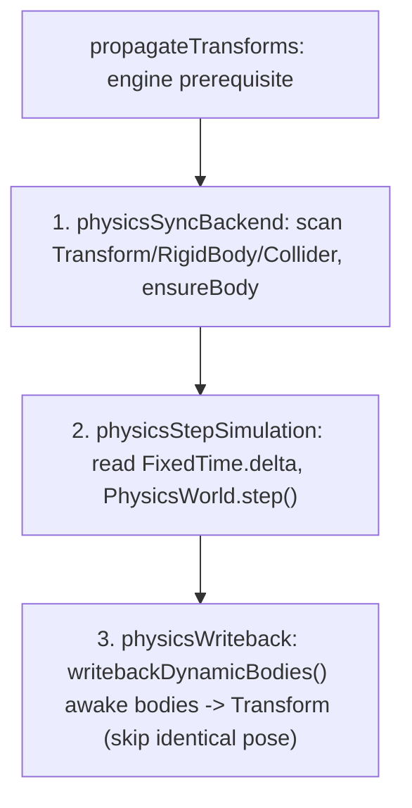

# forgeax-engine-physics

> Physics attaches `Transform + RigidBody + Collider` to an entity. Static/kinematic colliders synchronize resolved world TRS; dynamic bodies write simulated pose back to `Transform`. `@forgeax/engine-physics` defines component schemas (`RigidBody` / `Collider` / `CollidingEntities`), `PhysicsWorld` / `PhysicsWorld2D` resources, and the closed `PhysicsErrorCode` union. Implementations live in the WASM backends `@forgeax/engine-physics-rapier2d` and `@forgeax/engine-physics-rapier3d`. `createApp(canvas, { plugins: [physicsPlugin('rapier-3d')] })` dynamically imports the backend, registers the physics resource, and installs the three-phase tick systems.

## Mental model

Physics is component-driven: attach components instead of calling a body-creation API. `physicsSyncBackend` scans `(Transform, RigidBody, Collider)` archetypes and calls `ensureBody` for new entities; `physicsStepSimulation` advances simulation; `physicsWriteback` writes dynamic positions/rotations to `Transform`. After `propagateTransforms`, resolved world TRS supplies static and non-CharacterController kinematic collider poses, including hierarchy, rotation, and scale. Rapier owns dynamic pose after creation. The `createApp` physics selection (`'rapier-2d' | 'rapier-3d'`) injects `PhysicsWorld2D` or `PhysicsWorld`. World clamps host delta into `Time.delta`, then advances constant `FixedTime.delta` up to `maxStepsPerUpdate`. Discarded whole steps accumulate in `droppedSeconds` / `droppedUpdates`; only fractional `overstep` survives, with no later replay. All three systems safely return while WASM-backed resources load asynchronously. Read current collision pairs through read-only `CollidingEntities`.

## Core API and components

| Name | Package | Form | Purpose |
|:--|:--|:--|:--|
| `RigidBody` | physics | Component | Body `type` (`RigidBodyTypeValue.{dynamic,static,kinematic}`), `mass`, and other parameters. |
| `Collider` | physics | Component | `shape` (`ColliderShapeValue.{sphere,cuboid,capsule}`) and shape parameters. |
| `CollidingEntities` | physics | Read-only component | Entities touching this entity in the current frame. |
| `CharacterController` | physics | Component | Offset, slope, autostep, snap; angles in degrees; engine-written boolean `grounded`. |
| `PhysicsWorld.moveAndSlide` | physics | Method (3D `Vec3` / 2D `Vec2`) | Collision-aware movement: resolve `desiredDelta`, then write `Transform` and `grounded`. |
| `PhysicsWorld` | physics | 3D resource interface | Backend implements `step()` / `ensureBody` / `moveAndSlide` / `writebackDynamicBodies()` (awake dynamic bodies only; unchanged poses are not rewritten). |
| `PhysicsWorld2D` | physics | 2D resource interface | Equivalent 2D interface; `moveAndSlide` accepts and returns `Vec2`. |
| `RigidBodyTypeValue` / `ColliderShapeValue` | physics | Enum constants and `*FromF32` narrowing helpers | Type-safe component enum values. |
| `createRapier3DPhysicsWorld` | rapier3d | `async fn` | Construct a 3D PhysicsWorld manually; also used internally by `createApp`. |
| `createRapier2DPhysicsWorld` | rapier2d | `async fn` | Construct a 2D PhysicsWorld manually. |
| `PhysicsErrorCode` | physics (types SSOT) | Closed union; read source, do not copy members | Structured failure codes. |

### Collider transform projection

Physics consumes resolved world TRS, so child colliders follow parent translation, rotation, and scale. Cuboid half-extents use absolute per-axis scale. Spheres conservatively use the largest absolute scale. Capsules scale half-height along Y and cross-section by max(X,Z) in 3D or X in 2D. Negative scale uses its magnitude, without mirrored collision shapes. 2D projects only Z rotation into Rapier's scalar angle.

> [!IMPORTANT]
> Use enum constants such as `RigidBodyTypeValue.dynamic` / `ColliderShapeValue.sphere`, not raw numbers. Component fields/defaults: `packages/physics/README.md`, Component Schemas. Read `PhysicsErrorCode` from `packages/types/src/index.ts`; do not duplicate its members.

## Kinematic characters: moveAndSlide

Character movement is explicitly driven each frame with `PhysicsWorld.moveAndSlide(entity, desiredDelta)`, using `Vec3` in 3D and `Vec2` in 2D. Attach kinematic `RigidBody`, `Collider`, and `CharacterController`; combine input, gravity, and jump into `desiredDelta`. The method resolves collisions, slopes, autostep, and ground snapping; writes resolved position to `Transform` and contacts to `CharacterController.grounded`; returns actual displacement. There are no options or `dt` argument because displacement already includes time. Parameters are reread from components every frame (D-7 full reset).

```ts
import { CharacterController, Collider, ColliderShapeValue, RigidBody, RigidBodyTypeValue } from '@forgeax/engine-physics';

const char = world.spawn(
  { component: Transform, data: { pos: [0, 0.45, 0] } }, // Rest height: ground top + radius + halfHeight.
  { component: RigidBody, data: { type: RigidBodyTypeValue.kinematic } },
  { component: Collider, data: { shape: ColliderShapeValue.capsule, radius: 0.3, halfHeight: 0.5 } },
  { component: CharacterController, data: {} },
).unwrap();

app.registerUpdate(() => {
  const pw = world.getResource('PhysicsWorld'); // Catch and return early until WASM is ready.
  if (!pw.hasBody(char)) return;              // Async body creation may not have completed.
  pw.moveAndSlide(char, [dx, dy, dz]); // Writes Transform and grounded.
});
```

> [!CAUTION]
> Common pitfalls: compare boolean `grounded` with `=== true`, never `!== 0` (always true). Spawn capsules at rest height (ground top + radius + halfHeight); embedding them in ground degenerates KCC contact. Check trajectory Y for continuous-slope snapping rather than relying on `computedGrounded()`. Guard asynchronous initialization with `if (!pw.hasBody(entity)) return;`, not by catching `body-not-found`. `physicsSyncBackend` skips kinematic mirroring for CharacterController archetypes to avoid double writes. Demo: `apps/hello/character`.

## Three-phase tick order



> `createApp` with physics enabled registers these systems in this order. All return safely until the PhysicsWorld resource is ready.

## Usage skeleton

```ts
import { createApp } from '@forgeax/engine-app';
import { Collider, ColliderShapeValue, RigidBody, RigidBodyTypeValue, physicsPlugin } from '@forgeax/engine-physics';
import { Transform } from '@forgeax/engine-runtime';

const app = await createApp(canvas, { plugins: [physicsPlugin('rapier-3d')] });
const world = app.world;

// dynamic body: falls under gravity
world.spawn(
  { component: Transform, data: { pos: [0, 5, 0] } },
  { component: RigidBody, data: { type: RigidBodyTypeValue.dynamic, mass: 1 } },
  { component: Collider, data: { shape: ColliderShapeValue.sphere, radius: 0.5 } },
);

// static ground: immovable collision target
world.spawn(
  { component: Transform, data: { pos: [0, 0, 0] } },
  { component: RigidBody, data: { type: RigidBodyTypeValue.static } },
  { component: Collider, data: { shape: ColliderShapeValue.cuboid, halfExtents: [5, 1, 5] } },
);

app.start();
```

## Pitfalls

- **Components attached but no movement**: check `Transform` (writeback target) and `createApp({ plugins: [physicsPlugin(...)] })` (tick installation). All three components are required.
- **No physics in initial frames**: asynchronous WASM loading leaves PhysicsWorld temporarily unavailable; systems return early by design.
- **Large host deltas**: never pass host delta directly into physics. World clamps `Time.delta` to `maxDeltaSeconds`, runs at most `maxStepsPerUpdate` fixed steps, and records dropped whole steps without later catch-up. The `physicsStepSimulation` guard for `dt <= 0` / `> 0.1s` is backend defense, not host-frame recovery.
- **2D/3D mismatch**: `'rapier-2d'` uses `PhysicsWorld2D`; `'rapier-3d'` uses `PhysicsWorld`. Schemas are shared but coordinate dimensions differ.

## Further reading

- Component fields/defaults and enum/narrowing helpers: `packages/physics/README.md`, Component Schemas / Enum Constants.
- Three-phase ordering and early returns: `packages/physics/README.md`, Three-Phase Tick Pipeline; `packages/physics-rapier3d/src/rapier-physics-world-3d.ts`.
- PhysicsWorld resource interfaces: `packages/physics/src/physics-world.ts`.
- `CollisionEvent` / `CollisionEventPayload`: `packages/physics/src/collision-event.ts`.
- CharacterController schema and moveAndSlide parameters: `packages/physics/README.md`, Character Movement.
- Closed `PhysicsErrorCode` union: `packages/types/src/index.ts`; AGENTS.md Error model.
- Rapier WASM implementations: `packages/physics-rapier2d/src/` and `packages/physics-rapier3d/src/`.
- Physics auto-attachment: `packages/app/src/create-app.ts`; App setup: [`forgeax-engine-app`](../forgeax-engine-app/SKILL.md).

## Simulation participant

Register one ready physics participant with the ECS World when deterministic
source/fresh-target evidence must include portable physics state. Let ECS own
the record, restore transaction, trace, report, tolerance, and error contract.
Keep Rapier handles and native values inside the backend; never expose them to
App, Preview, or Remote. Recover by switching on the error code and following
its `expected`, `hint`, and `detail`.
