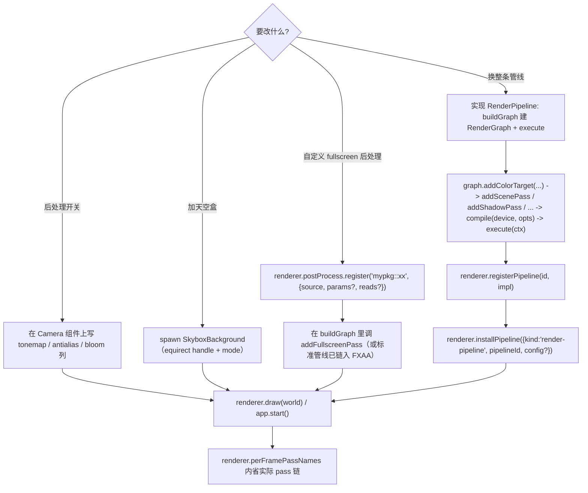

# forgeax-engine-render-pipeline

> 基线: [`5c8c90f1`](../../commit/5c8c90f1) (2026-06-03) · 同步至: feat-20260630-equirect-kind-internalized-ibl-declarative-skyligh M5

> **改画面的三个层次**：① 在 `Camera` 组件上拨内建后处理开关（tonemap / fxaa / msaa / bloom）；② spawn `SkyboxBackground` 加天空盒；③ 实现 `RenderPipeline` 接缝、用 7 个声明式图元（`addColorTarget` / `addScenePass` / `addShadowPass` / `addSkyboxPass` / `addBloomPasses` / `addTonemapPass` / `addFullscreenPass`）组装 per-frame 管线拓扑，经 `registerPipeline` / `installPipeline` 装上。引擎自带的 `forgeax::standard-forward` 就是走同一条公共通道 dogfood 的 worked example。聚合 `@forgeax/engine-runtime`（pipeline seam / render flow）· `@forgeax/engine-render-graph`（资源声明 + 编译 + 执行）。

## 心智模型

per-frame 渲染是一张**声明式 render-graph**，graph **直接持有** GPU 纹理：通过 `graph.addColorTarget(name, desc)` 声明 RT（transient / persistent / MSAA），`graph.addColorTargetAlias(name, source)` 折叠逻辑名到物理纹理（如 bloom composite 的 `hdrComposited`），再通过 7 个**公共图元**声明 pass 拓扑与读写依赖。`graph.compile({ device, backendKind, caps })` 分配物理纹理（keyed by `{format, w, h, usage, sampleCount}` pool）、做拓扑排序 + barrier 插入；`graph.execute(ctx)` 按序跑每个 pass 的闭包。

绝大多数后处理你**不用碰 graph**——它们是 `Camera` 组件上的 f32 列：`tonemap`（色调映射模式）/ `exposure` / `antialias`（`'none' | 'fxaa' | 'msaa'`）/ `bloom` + `bloomThreshold` 等，引擎据此往 per-frame graph 里增删内建图元。天空盒同理：spawn 一个 `SkyboxBackground`（equirect handle + mode），引擎在 shadow 与 main 之间插一个 skybox pass。只有当你要**换掉整条管线拓扑**（自定义 pass 链、deferred 等）才实现 `RenderPipeline` 接缝（`buildGraph(ctx, data)` 建图 + `execute(ctx)` 跑图），用 `renderer.registerPipeline(id, impl)` 登记、`renderer.installPipeline(asset)` 装上（`asset` 是 `RenderPipelineAsset` POJO，直收，无 register round-trip）。`renderer.perFramePassNames` 让你内省当前帧实际有哪些 pass。

自定义 fullscreen 后处理走 `addFullscreenPass`——它是 7 个图元中**唯一的扩展点**（其余 6 个是引擎内置，不接受用户 execute 闭包）。两步：① `renderer.postProcess.register('mypkg::vignette', { source, params?, reads? })` 登记 WGSL；② 在管线 `buildGraph` 里调 `addFullscreenPass(graph, 'vignette', { shader: 'mypkg::vignette', color, reads? })`。

> [!IMPORTANT]
> **想在 URP 之上加一个全屏后处理、又保留阴影/tonemap/bloom？用 `config.postEffects`，别装自定义管线。** `installPipeline` 装一条自定义管线是**整体替换** URP——你的 `buildGraph` 没声明 `addShadowPass` / `shadowDepth`，阴影就被静默丢弃（shadow demo 会渲染出零阴影）。正道是把注册的 effect id 经 URP 的 install config 传入：`renderer.installPipeline({ kind:'render-pipeline', pipelineId: URP_PIPELINE_ID, config: { postEffects: ['mypkg::overlay'] } })`。URP 在 fxaa 之后、debug-overlay 之前按序把每个 effect 经 `addFullscreenPass(..., { compositeOverSwapchain: true })` 叠加（copy swap-chain → scratch → 采样 → 写回 non-srgb storage view），内建 9-pass 链原封不动（AUGMENT，非 REPLACE）。空列表 = 零额外 pass（默认帧不变）。仅 WebGPU 后端（同 FXAA 的帧中 swap-chain 读限制）。worked example：`apps/learn-render/5.advanced-lighting/3.3.csm/`（CSM cascade overlay）。
>
> effect 的 WGSL 契约（无 params UBO 时）——`vs_main` 画全屏三角，`fs_main` 采样 `@group(1)` 的场景纹理 + sampler：
> ```wgsl
> struct VOut { @builtin(position) position : vec4<f32>, @location(0) uv : vec2<f32> };
> @vertex fn vs_main(@builtin(vertex_index) i : u32) -> VOut {
>   var x = -1.0; var y = -1.0;
>   if (i == 1u) { x = 3.0; } if (i == 2u) { y = 3.0; }
>   var o : VOut; o.position = vec4<f32>(x, y, 0.0, 1.0);
>   o.uv = vec2<f32>((x + 1.0) * 0.5, 1.0 - (y + 1.0) * 0.5); return o;
> }
> @group(1) @binding(0) var sceneTexture : texture_2d<f32>;
> @group(1) @binding(1) var sceneSampler : sampler;
> @fragment fn fs_main(in : VOut) -> @location(0) vec4<f32> {
>   let c = textureSample(sceneTexture, sceneSampler, in.uv).rgb;
>   return vec4<f32>(c * vec3<f32>(1.0, 0.95, 0.9), 1.0); // example: warm tint
> }
> ```

## 核心 API 速查

| 名字 | 来源包 | 形态 | 用途 |
|:--|:--|:--|:--|
| `Camera.tonemap` / `.exposure` | runtime | f32 列 | 色调映射模式 + 曝光（HDR target + fullscreen tonemap pass） |
| `Camera.antialias` | runtime | f32 列（`antialiasFromF32` 解码 `'none'\|'fxaa'\|'msaa'`） | `'none'` = 零开销；`'fxaa'` = FXAA 3.11 fullscreen；`'msaa'` = 4x 硬件多样本 |
| `Camera.bloom` / `.bloomThreshold` / ... | runtime | f32 列 | 辉光开关 + 阈值；触发 4 个声明式 bloom pass |
| `BLOOM_ENABLED` / `BLOOM_DISABLED` | runtime | 常量 | 写 `Camera.bloom` 的语义值 |
| `ANTIALIAS_NONE` / `ANTIALIAS_FXAA` / `ANTIALIAS_MSAA` | runtime | 常量（0 / 1 / 2） | 写 `Camera.antialias` 的编码值 |
| `SkyboxBackground` | runtime | 组件（equirect handle + `SKYBOX_MODE_CUBEMAP`） | 全屏天空盒 pass |
| `renderer.perFramePassNames` | runtime | `readonly string[]` | 内省当前帧 pass 名清单 |
| `renderer.postProcess.register(id, entry)` | runtime | `(string, PostProcessShaderEntry) => void` | 登记 fullscreen 后处理 WGSL；重名 throw `PostProcessError` |
| `RenderPipeline` | runtime | `{ buildGraph(ctx, data), execute(ctx) }` | 自定义管线接缝（即 forgeax 版 SRP） |
| `standardForwardPipeline` | runtime | `RenderPipeline` | 内建前向管线，dogfood worked example |
| `renderer.registerPipeline(id, impl)` | runtime | `(string, RenderPipeline) => void` | 登记一个管线逻辑 |
| `renderer.installPipeline(asset)` | runtime | `(RenderPipelineAsset) => Result<void, PipelineError>` | 装上管线：直收 `RenderPipelineAsset` POJO（`{kind:'render-pipeline', pipelineId, config?}`，D-19 无 register round-trip）；`config.postEffects` 走 URP 叠加后处理 |
| `new RenderGraph()` + `addColorTarget` / `addColorTargetAlias` / `addPass` / `compile` / `execute` | render-graph | class + 方法 | 声明式建图：RT 声明 + pass 拓扑 + 编译分配 + 执行 |
| `graph.addScenePass(g, name, opts)` | runtime | 图元（`color` + `depth` + optional `reads` + optional `filter`） | 把 ECS scene 渲染进 graph-owned colour+depth RT |
| `graph.addShadowPass(g, name, opts)` | runtime | 图元（`depth`） | 写阴影深度 RT |
| `graph.addSkyboxPass(g, name, opts)` | runtime | 图元（`color`） | 写天空盒 RT |
| `graph.addBloomPasses(g, opts)` | runtime | 图元（`hdrColor` + `hdrComposited` alias + 3 个 half-res 中间 RT） | 4-pass bloom 链 |
| `graph.addTonemapPass(g, name, opts)` | runtime | 图元（`hdrComposited`） | HDR → LDR tonemap |
| `graph.addSsaoPasses(g, opts)` | runtime | 图元（HDRP only；`gNormal` + `gDepth` reads + `ssaoRaw` + `ssaoBlurred` 1/2-res R8 targets） | LO 5.9 SSAO（64-sample + 4×4 blur），HDRP `config.ssao.enabled=true` 时由管线自动接入；ambient `*= mix(1.0, ssaoFactor*ao, intensity)` |
| `graph.addFullscreenPass(g, name, opts)` | runtime | 图元（`shader` id + `color` + optional `reads`）— **唯一扩展点** | 自定义 fullscreen post-process pass |
| `graph.listPasses()` / `listResources()` | render-graph | `=> readonly PassInfo[]` / `ResourceInfo[]` | 查询图结构 |

> [!IMPORTANT]
> 后处理优先用 `Camera` 列开关，不用手搓 graph——内建 tonemap / fxaa / msaa / bloom / skybox pass 已经接进默认管线。只有要改**管线拓扑**（pass 链本身）才落到 `RenderPipeline` + `RenderGraph` 层。自定义 fullscreen 后处理（如 vignette / color grading）用 `addFullscreenPass`，不手写 `graph.addPass`。

## 规范调用顺序



## idiom 代码骨架

```ts
import {
  Camera, perspective, SkyboxBackground, SKYBOX_MODE_CUBEMAP,
  EquirectAsset,
  BLOOM_ENABLED, ANTIALIAS_FXAA, ANTIALIAS_MSAA,
} from '@forgeax/engine-runtime';
import { TONEMAP_REINHARD_EXTENDED } from '@forgeax/engine-runtime';

// A) built-in post-processing: just write Camera columns
//    antialias now accepts 0 (none), 1 (fxaa), 2 (4x MSAA)
world.spawn({
  component: Camera,
  data: {
    ...perspective({ fov: Math.PI / 4, aspect: 16 / 9 }),
    tonemap: TONEMAP_REINHARD_EXTENDED,
    exposure: 1.0,
    antialias: ANTIALIAS_MSAA, // or ANTIALIAS_FXAA (1) or ANTIALIAS_NONE (0)
    bloom: BLOOM_ENABLED,
    bloomThreshold: 1.0,
  },
}).unwrap();

// B) skybox + IBL with equirect: load the equirect, mint a shared handle, spawn
//    one component each for Skylight (ambient) and SkyboxBackground (visual).
//    The cubemap projection + IBL precompute (irradiance, prefilter, BRDF LUT)
//    happen lazily inside the render-system record arm -- no upload call.
const hdrRes = await engine.assets.loadByGuid<EquirectAsset>(guidRes.value);
if (!hdrRes.ok) throw hdrRes.error;
// loadByGuid returns the EquirectAsset PAYLOAD; mint a shared<EquirectAsset>
// source handle for the component fields (same handle drives both, so the
// projection is shared idempotently).
const equirectHandle = world.allocSharedRef('EquirectAsset', hdrRes.value);
world.spawn({
  component: Skylight,
  data: { equirect: equirectHandle, intensity: 1.0 },
});
world.spawn({
  component: SkyboxBackground,
  data: { equirect: equirectHandle, mode: SKYBOX_MODE_CUBEMAP },
}).unwrap();

// C) inspect what the per-frame graph actually contains this frame
console.log(renderer.perFramePassNames);
// e.g. ['shadow', 'skybox', 'main', 'bloom-bright', 'bloom-blur-h',
//       'bloom-blur-v', 'bloom-composite', 'tonemap', 'fxaa']
```

```ts
// D) custom pipeline seam: use the 7 public primitives in buildGraph
//    the graph OWNS GPU textures — no hand-rolled ensureLazyTexture
import { RenderGraph } from '@forgeax/engine-render-graph';
import { type RenderPipeline, standardForwardPipeline } from '@forgeax/engine-runtime';

const myPipeline: RenderPipeline = {
  buildGraph(ctx, data) {
    const graph = new RenderGraph<RenderPipelineContext>();
    // 1) declare graph-owned colour targets (transient/persistent/MSAA)
    graph.addColorTarget('hdr', { format: 'rgba16float', size: 'swapchain', sample: 1 });
    graph.addColorTarget('depth', { format: 'depth32float', size: 'swapchain', sample: 1 });
    // 2) compose the pass chain via the 7 primitives
    addShadowPass(graph, 'shadow', { depth: 'depth' });
    addScenePass(graph, 'main', { color: 'hdr', depth: 'depth' });
    addTonemapPass(graph, 'tonemap', { hdrComposited: 'hdr' });
    // 3) compile — graph allocates textures, inserts barriers, topo-sorts
    const compiled = graph.compile({ device: ctx.runtime.device, ...opts });
    return compiled.ok ? graph : null;
  },
  execute(ctx) { /* graph.execute(ctx) */ },
};
renderer.registerPipeline('my-game::forward', myPipeline);
// then install the RenderPipelineAsset POJO directly (no register round-trip):
// renderer.installPipeline({ kind: 'render-pipeline', pipelineId: 'my-game::forward' })
```

```ts
// E) custom fullscreen post-process (the ONE extension point)
//    step 1: register the WGSL source + params schema. The WGSL declares the
//    params UBO at @group(1) @binding(2) (3-entry BGL: texture@0 + sampler@1 +
//    buffer@2). register eager-creates the per-id UBO (byteSize >= 16, init =
//    defaultValue); byteSize < 16 or defaultValue.length !== byteSize throws
//    PostProcessError{code:'params-size-mismatch'} at register (fail-fast).
renderer.postProcess.register('mypkg::vignette', {
  source: vignetteWGSL,
  params: { byteSize: 16, defaultValue: new Uint8Array(16) },
  reads: ['hdrComposited'],
});
//    step 2: reference it from buildGraph via addFullscreenPass
//    (inside a custom pipeline's buildGraph closure)
graph.addColorTarget('vignetteOut', { format: 'rgba16float', size: 'swapchain', sample: 1 });
addFullscreenPass(graph, 'vignette', {
  shader: 'mypkg::vignette',
  color: 'vignetteOut',
  reads: ['hdrComposited'],
});
//    step 3 (per-frame params, DATA-DRIVEN — not an imperative setter):
//    spawn a PostProcessParams component keyed by the shader id; change `data`
//    each frame and the engine uploads it (extract -> snapshot ->
//    dispatchFullscreenPass queue.writeBuffer). data.byteLength must equal the
//    registered byteSize or it throws PostProcessError{code:'params-update-size-mismatch'}.
world.spawn(PostProcessParams({ shader: 'mypkg::vignette', data: Float32Array.of(0.5, 0, 0, 0) }));
```

> **内建 tonemap 也走这条通道**（feat-20260621 / D-5）：`Camera.exposure` / `whitePoint` / `tonemap` 仍是 AI 用户面入口（不变），但引擎内部把它们桥接成 `forgeax::tonemap` 的数据驱动 params——没有专用 tonemap pipeline / BGL / UBO 了。`entry.params === undefined`（如 FXAA）时 BGL 退化 2-entry，零回归。

## 踩坑

- **画面全黑 / 后处理无效**：先确认 `Camera` 列写对了（`tonemap` / `bloom` / `antialias` 是 f32 列，用 `TONEMAP_*` / `BLOOM_*` / `ANTIALIAS_*` 常量，不是布尔）。再用 `renderer.perFramePassNames` 看 pass 链里到底有没有期望的 pass。
- **天空盒不显示**：`SkyboxBackground.equirect` 的 equirect projection 异步未完成——引擎内部懒触发的 equirect→cubemap 投影 + IBL 预计算（irradiance/prefilter/BRDF LUT）在 render record 阶段 fire-and-forget 启动，就绪前天空盒走白 cube fallback（即时可见、不黑屏）。投影失败报 `RuntimeError equirect-projection-failed`（只触发一次、不重试；替代旧 `skybox-cubemap-not-ready`）；caps.rgba16floatRenderable 不足时引擎永久退化到白 cube（非报错路径）。手写自定义 skybox shader 时不要 V-flip，理由见 [`forgeax-engine-debug`](../forgeax-engine-debug/SKILL.md) §天空盒 V-flip。
- **Skylight + equirect = 声明式 IBL**：`Skylight` 组件 `equirect` 字段接收 `Handle<EquirectAsset>`（`loadByGuid<EquirectAsset>(guid)` 得到），引擎 render record 阶段检测 equirect handle、懒触发的 equirect→cubemap 投影 + IBL 链（irradiance 卷积 / prefilter mip chain / BRDF LUT）全部内部化——**AI 用户不再调 `uploadCubemapFromEquirect`**（已降为 `@internal` package-internal `_uploadCubemapFromEquirect`）。投影按 equirect handle 幂等共享（同 handle 多帧不重复投影）、失败 fail-fast（只报一次）、永久退化白 cube 不重试。`Skylight.equirect` **可选**：省略时退化为纯色环境光（白 cube fallback、首帧即亮、零 async）。`colorR/G/B` + `intensity` 在两种模式下都是每帧实时可调的动态刻度。
- **自定义管线装不上**：`installPipeline` 返回 `Result`，失败带 `PipelineError`；按 `.code` 消费，别 `String(err)`。先 `registerPipeline` 再 `installPipeline`，顺序反了拿不到逻辑。
- **自定义 fullscreen pass 不生效**：`addFullscreenPass` 引用的 shader id 必须先用 `renderer.postProcess.register` 登记；miss 时 execute 闭包内 throw `PostProcessError({ code: 'post-process-not-found' })`。同名 register 两次 throw `PostProcessError({ code: 'post-process-already-registered' })`。
- **graph.compile 失败**：`RenderGraphErrorCode` 现已从 5 个扩为 7 个（新增 `resource-alloc-failed` / `invalid-format`）；`compile` 现在接收 `device`（用于分配 graph-owned GPU 纹理），缺少时报 `invalid-format` 或分配失败。
- **offscreen scene RT 的 format 不能写死 `'rgba8unorm-srgb'`**：当自定义管线把场景渲染进自己 `addColorTarget` 出来的 color target（再经 `addFullscreenPass` 采样回 swap-chain）时，那个 target 的 format **必须等于 swap-chain 色彩格式**——即 `ctx.pipelineState?.colorAttachmentFormat ?? 'rgba8unorm-srgb'`，而不是字面 `'rgba8unorm-srgb'`。几何 PSO 跟随 UA-preferred canvas format（macOS/Windows 上是 `bgra8unorm-srgb`，见 [[bug-20260612-webgpu-canvas-format-prefer-bgra-shipped]]），写死 rgba 会在 BGRA runner 上撞 `Attachment state ... is not compatible`（dawn smoke 把 `getPreferredCanvasFormat` 钉死成 rgba 故看不到，只有 macOS/Windows nightly browser project 抓——nightly #385/#391）。HDR 那种 `rgba16float` 中间靶不在此列（它本就不等于 swap-chain）。`buildGraph` 闭包内 `ctx.pipelineState` 已可读（与 per-frame execute 同字段）。
- **SSAO（HDRP only）**：在 `RenderPipelineAsset.config.ssao` 上拨开关——`{ enabled: true, radius?: 0.5, bias?: 0.025, intensity?: 1.0 }`；TS narrowing 在 `pipelineId === 'forgeax::hdrp'` 下生效（不需 `as` 断言）。`enabled=false` 时零分配（`getOrCreateSsaoBuffers` 返回 null，pass 不接入）。三个 closed-union 错误码：`ssao-radius-non-positive`（`radius<=0` fail-fast）/ `ssao-bias-negative`（`bias<0` fail-fast）/ `ssao-storage-buffer-unavailable`（caps `storageBuffer=false` 时 SSAO kernel SSBO 不可用）。Worked example：`apps/learn-render/5.advanced-lighting/9.ssao/`。
- **渲染类症状**（白屏、demo 不动、CI 断言全过却 exit 1）先查 [`forgeax-engine-debug`](../forgeax-engine-debug/SKILL.md) 症状索引，别在 demo 里塞手动 rAF mutation 绕过引擎缺口。
- **不同 material shader 形状不同的 pipeline-layout**（如 `forgeax::pbr-skin` 的 group(2) BGL 多了 binding 1 = palette）：每条 BGL shape 形态对应一个 PipelineState slot（`pbrPipelineLayout` / `hdrpPbrPipelineLayout` / `pbrSkinPipelineLayout`），由 `selectPipelineLayoutForVariant(state, variantSet, layoutKind)` 按闭枚举 `LayoutKind = 'pbr' | 'pbr-skin' | 'hdrp-pbr'` 选层。**selector body 内零字面值 shader-id**（caller 把 materialShaderId 映射成 `LayoutKind` 上溯），grep gate 锁住。新增材质 shader 形态在 `pbr-pipeline.ts` 加 factory + PipelineState 加 slot + selector 加 case，一刀切。

## skin palette per-frame upload (feat-20260612)

> `forgeax::pbr-skin` 的 `@group(2)@binding(1)` 由 `SkinPaletteAllocator` 在每帧 extract 阶段写动画 joint 矩阵；不再走 PR #361 留下的 16320 B identity-mat4 静态 stub。Fox 真动起来。

`createRenderer` 启动期一次性建 `createSkinPaletteAllocator(device, 16320)` 挂到 `PipelineState.skinPaletteAllocator`。**`maxBindingSize=16320` 必须与 `pbr-skin` BGL `@group(2)@binding(1)` 容量对齐——`MAX_JOINTS=255`（255 × 64 = 16320 B），off-by-one `256` 即第一帧 `SkinPaletteOverflowError needs 16384 B exceeds 16320 B`。**

每帧渲染管线（`extractFrame` / `recordFrame`）时序：

```
extractFrame entry        allocator.resetForFrame()         cursor = 0
  └─ per skinned entity   slice = allocator.allocateSlice(jointCount)
                          allocator.writeJointPalette(slice, ibms, jointWorlds)
recordFrame per draw      group2DynamicOffsets[1] = entry.source.skin.byteOffset
                          (多 entity 各自 slice 不互覆盖；BG entry size 仍 16320 worst-case，cache miss 仅在 buffer grow 时触发)
```

`jointWorlds` 直接是 `Skin.joints[i]` entity 的 `Transform.world`（16-float column-major view，`propagateTransforms` 写）。allocator 内部做 `M_i = jointWorld_i × IBM_i` 预乘后 `device.queue.writeBuffer` 进 GPU。`buffer` 字段在首次 `allocateSlice` 之前为 `null`，record-stage 据此 + `pbrSkinPipelineLayout !== null` 二者皆备才发 skin draw（charter P3 显式失败）。

extract 阶段三条 fail-fast errorCode（per-entity `_routeError + continue` 跳过，不让单 entity 崩整帧）：`skeleton-resolve-failed`（`assets.get<SkeletonAsset>(skin.skeleton)` 拿不到）/ `joint-count-mismatch`（`Skin.joints.length !== SkeletonAsset.jointCount`）/ `joint-entity-dangling`（joint Entity 已 despawn）。

引 PR #TBD（finalize 后 backfill）。

## 深入

- render flow（zero-config 默认 vs tonemap opt-in）/ 内建 pass 链 / `perFramePassNames`：见 `packages/runtime/README.md` §Render flow；源码 `packages/runtime/src/render-system.ts` + `packages/runtime/src/standard-forward-pipeline.ts`
- 7 个公共图元（`addColorTarget` / `addScenePass` / `addShadowPass` / `addSkyboxPass` / `addBloomPasses` / `addTonemapPass` / `addFullscreenPass`）的完整签名与 doc：源码 SSOT `packages/runtime/src/render-graph-primitives.ts`（含扩展点地图：只有 `addFullscreenPass` 是 AI 用户扩展点）
- `RenderPipeline` 接缝契约 / `RenderPipelineContext` / `RenderPipelineData`：源码 SSOT `packages/runtime/src/render-pipeline-context.ts`；`PipelineError` 见 `packages/runtime/src/pipeline-errors.ts`；`PostProcessError` 见 `packages/runtime/src/post-process-errors.ts`
- 声明式 render-graph（图元 API / 资源声明 / 编译 / 执行 / 错误模型）：见 `packages/render-graph/README.md`；源码 `packages/render-graph/src/graph.ts`；`RenderGraphErrorCode` 全集（勿抄）`packages/render-graph/src/errors.ts`
- Camera 后处理列定义（tonemap / antialias / bloom 编码）：源码 `packages/runtime/src/components/camera.ts`（`Antialias = 'none' | 'fxaa' | 'msaa'`）
- 自定义材质 shader（pass.shader 标识符来源）：见 [`forgeax-engine-shader`](../forgeax-engine-shader/SKILL.md)
- 场景规模上限：L1 mesh SSBO 已从固定 1024 entity cap 改为 pow2 动态扩容，>1024 entity 场景无需手动配 config（feat-20260608）
- 自定义 fullscreen pass 注册与 lookup：`renderer.postProcess.register` + `buildFullscreenPostProcessPass` / `createFullscreenBindGroup` 见 `packages/runtime/src/fullscreen-post-process-pass.ts`
- **Worked example**: `apps/learn-render/4.advanced-opengl/5.framebuffers/` -- a complete end-to-end demo of custom offscreen render-to-texture + six swappable fullscreen post-process effects (passthrough / inversion / grayscale / sharpen / blur / edge-detection), using `addColorTarget` + `addScenePass` + `addFullscreenPass` + `registerPipeline` + `installPipeline`.