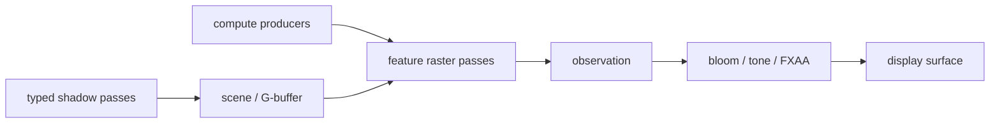

# forgeax-engine-render-pipeline

> [!IMPORTANT]
> RenderPipeline.build declares typed graph topology only. Renderer exclusively owns compile, last-known-good replacement, execution, retirement, finish(), and one queue.submit() per frame.

## Sky atmosphere and aerial perspective

Use one `Atmosphere` and one `DirectionalLight` for outdoor air. Author distance
in metres, coefficients in inverse metres, and solar intensity as outer-space
lux. Atmosphere Transform defines the ground reference; Skylight Transform
selects its independent capture position. Ordinary haze comes from Rayleigh/Mie
transport; `Fog` adds an extra height medium. Read the
[physical atmosphere contract](../../packages/render/README.md#atmosphere-and-aerial-perspective).

Keep sky, AP, solar attenuation and captures on the shared optical kernel. AP
stores RGB luminance and RGB transmittance. Camera-specific tables belong to their
view; medium tables and pinned capture generations belong to Renderer. Verify
fixed-exposure AP on/off, sun sweeps and colour ROIs against high-sample transport,
then inspect real RHI Debug work/resources and GPU timings. Single-sample depth
and the declared device texture budget are required; unavailable is explicit.

## Local volumetric fog

Use one `VolumetricFog` entity for each local medium; select
`VolumetricFogSamplingValue.density` for an authored local 3D density field.
Read the [Render contract](../../packages/render/README.md#local-volumetric-fog)
for author fields, owner limits, accepted-count inspection, and consumer
boundaries. On overflow or invalid parameters, repair the named owner and
retry; never silently drop a volume or composite it through a second renderer.

## Fog and translucency

`Fog` fogs the opaque scene in place (`analytic-fog`, before transmission and
translucent draws); every blended writer fogs itself at its own depth through
`translucent_fog` and the View copy selected by its blend composition. Do not add
a post-translucency fog pass or composite particles before fog. The
[Render contract](../../packages/render/README.md#fog-and-translucency) states the
composition rules and limits; prove a fog-order bug with an RHI capture (fog work
before the translucent work, bound View offset `translucentViewOffset(...)`).

## Transmission/refraction

Transmission/refraction stays in the Standard pipeline: one renderer-owned backdrop copy, optional
rough mip raster passes, transmission before ordinary transparent, then temporal/post. Use
`renderer.inspect().transmission` for capability, extent, format, mips, bytes, and recovery facts;
never add a second graph or app-owned scene-color copy. Below 21 sampled textures the renderer selects
the `TRANSMISSION_SHARED_SLOTS` variant; see the material skill for the budget error and check.

## Order-independent transparency

`Camera.transparency: TRANSPARENCY_WEIGHTED_BLENDED` replaces the sorted pass for eligible draws
with `oit-accumulate` (rgba16float accum + r16float weight, shared additive/revealage blend) and
`oit-composite` over scene color; ineligible draws keep the sorted `transparent` pass after the
composite. `addStandardTransparentPasses` builds this for forward and deferred alike. MSAA
accumulates into 4x targets with 1x resolves; TAA, fog, DoF and outline treat the composite as the
transparent pass; planar/target captures stay sorted; the GPU-driven lane carries no transparents.
Read `renderer.inspect().transparency` for requested/resolved mode, draw counts, closed ineligible
reasons, and the `capability-absent` fallback. Contract:
[render README](../../packages/render/README.md#order-independent-transparency).

## Stereo output (non-XR)

Add `StereoCamera { eyeSeparation, convergence, layout, swapEyes }` to a perspective
Camera; the renderer derives two CameraView eyes (own depth, post and TAA history, one
submit). Layouts are the closed `StereoLayoutValue` union: side-by-side, top-bottom and
write-mask anaglyph. Branch on `StereoCameraInvalidError.detail.field` for invalid
separation/convergence or unsupported orthographic, `Camera.target` and PlanarReflection
cameras. `inspect().views[].eye` identifies eye rows; composite receipts have no display
picking, so cast interaction rays from the mono Camera. Contract:
[render README](../../packages/render/README.md#stereo-output-non-xr).

## Routing

| Goal | Entry |
|:--|:--|
| tonemap / bloom / FXAA / MSAA | Camera fields |
| Image-based lens flare ghosts | `LensFlare` camera companion (HDR, after Bloom) |
| Skybox | SkyboxBackground |
| Side-by-side / top-bottom / anaglyph stereo | `StereoCamera` on a perspective Camera |
| Rough/glossy reflections of off-screen content under ray-traced GI | Deferred `diffuseGi: { gather, reflections: {} defaults 0.4/0.1 }` with `ibl: false`, any gather; `'exact'` traces both lobes, `'irradiance-field'`/`'screen-probe'` read the radiance cache above the trace threshold and trace Global SDF→Card below it, then denoise the traced lobe (hit-distance reprojection, same-reflector rejection, 3x3 variance clamp, 8-frame cap, edge-stopping filter; passes `irradiance-field.reflection-temporal` / `.reflection-denoise`). SSR stays first, world value fills misses. [Lite reflections](../../packages/render/README.md#lite-reflections-world-traced-specular-indirect) |
| CubeCamera / ReflectionProbe capture | `CubeCamera` / `ReflectionProbe` + one Renderer receipt path |
| RenderTarget source / readback | `Renderer.createRenderTargetTextureSource` + receipt-bound `observe` |
| Freeze a region of this frame for later material sampling | `Renderer.requestFramebufferSnapshot(target, { region, camera? })` into a 2D `rgba16float` target (linear-HDR scene color, copied before tonemap); observe the ticket via `observe(receipt, { framebufferSnapshots })`. Contract: [render README](../../packages/render/README.md#framebuffer-region-snapshot) |
| 3D / array RenderTarget (volume slices, layer atlases) | `shape: '3d' \| '2d-array'` + `depthOrArrayLayers`; one `Camera.target` writer per layer via `Camera.targetLayer`; `requestTargetReadback(target, { layer })`; [layered targets](../../packages/render/README.md#layered-targets-3d-and-2d-array) |
| Standard linear-output stages/camera effects | Camera companion + Standard output plan + ordinary RenderFeature |
| Encoded-output tail effects | createFullscreenRenderFeature + createRenderer({ features }); only effects that preserve spatial position |
| Diffuse GI (exact reference or Lumen-Lite irradiance field) | `StandardProfile.diffuseGi` with `gather: 'exact' \| 'irradiance-field'` (deferred, IBL off); exact MASK coverage runs 3 GPU-driven indirect rounds over a shared candidate pool, so a nonzero coverage-header `overflow` (invalid samples) means the pool, not the scene, ran out; [contract](../../packages/render/README.md#irradiance-field-diffuse-gi-lumen-lite) |
| Replace pass topology | RenderPipeline.build |
| Feature writes scene color/depth | createRenderFeatureTarget + staging.addGraphicsPass |
| Which GI world traversal ran (Global SDF or hardware Ray Query) | Automatic; read `renderer.inspect().diffuseGi.traversal` / `traversalFallback` / `acceleration` (screen-probe: `diffuseGi.field.*`) and the `irradiance-field.world-acceleration` build pass. Scene edits stay in place on both lanes; on Ray Query, `acceleration.blasBuilt` / `tlasBuilt` / `bytesBuilt` show the cost (move: TLAS only; add: one BLAS per new mesh; material: none); [world traversal seam](../../packages/render/README.md#world-traversal-seam-global-sdf-or-hardware-ray-query) |
| Static-scene diffuse GI with no per-frame tracing (build-time light bake) | Cook an `irradiance-volume` with `createIrradianceVolumeCooker()` (`@forgeax/engine-render/internal`, a NativeCooker over the exact path integrator; keep the GUID across rebakes), publish it in the Catalog, then `StandardProfile.diffuseGi: { gather: 'baked', volume: <guid>, resolution }` (deferred, IBL off). Inspect `renderer.inspect().diffuseGi.volume`; passes are only `baked-field.*`; dynamic objects receive, never contribute. [contract](../../packages/render/README.md#baked-irradiance-volume-build-time-light-bake) |
| Lumen-Lite Screen Probe diffuse GI (screen trace first, field fallback) | `StandardProfile.diffuseGi` with `gather: 'screen-probe'`, `probes` and the shared `field` (deferred, IBL off, compute required); inspect `renderer.inspect().diffuseGi` and `screen-probe.*` pass timings; [contract](../../packages/render/README.md#screen-probe-diffuse-gi-lumen-lite) |
| Camera-following GI probes over a large world (scroll re-traces only exposed slabs) | `field.clipmap: { levels, dimensions }` (or `DiffuseGiTierScene.clipmapDimensions`); `probeBudget` splits over levels; inspect `renderer.inspect().diffuseGi.probes.clipmap`. [Clipmap](../../packages/render/README.md#camera-following-probe-clipmap) |
| Pick a diffuse GI quality preset (low/medium/high/epic) with capability fallback | `resolveDiffuseGiTier(tier, scene, renderer.inspect().capabilities)` and spread `.profile` over the Standard profile; `.fallback.reason` is data. [Quality tiers](../../packages/render/README.md#quality-tiers) |
| Move/remove/add objects or change materials under the irradiance field without a reset | Nothing to call: moves, removals, adds and material changes edit Cards, the Global SDF box and nearby probes in place within the field's spare capacity (overflow or a handedness flip rebuilds); non-field changes skip re-projection; skinned/morph meshes are excluded from the field. Card capture (field and exact `global.cards`) is progressive, `cards.budget` tiles per frame. Inspect `renderer.inspect().diffuseGi.edits`. [Dynamic content](../../packages/render/README.md#dynamic-content) |
| A GI scene with more Cards than `cards.maxCaptureBytes`, or several GI CameraViews | Nothing to call: the field streams Card residency on both world traversals (Global SDF and Ray Query) by view distance and screen size (`inspect().diffuseGi.residency` resident/pending/evicted); CameraViews split the probe, capture and relight budgets equally (`views[i].diffuseGi.share`), each view owning its field memory. [Card residency](../../packages/render/README.md#card-residency) |
| Compute produces vertex/index/indirect buffers for raster | staging.addComputePass + staging.addGraphicsPass, sharing prepared GPU buffer refs |
| RHI backend / capability | `forgeax-engine-rhi` |
| Frame capture/replay | forgeax-engine-rhi-debug |

## Directional shadow entry

DirectionalLight.shadowFilter is the public directional-shadow authoring entry.
It is an ECS enum; assign
DirectionalShadowFilterValue.pcf1, .pcf3, .pcf5, .pcssMedium, or
.pcssHigh numeric constants, not string labels. Valid labels are
pcf1, pcf3, pcf5, pcssMedium, pcssHigh; default is pcf3. Do not create
numeric or compatibility aliases. PCSS
shadowAngularRadius is in radians, defaults to 0.00465, and accepts
[0.0001, 0.05]. maxPenumbraTexels is in texels, defaults to 32, and must be
a finite integer in [1, 64]. Other CSM fields, units, and defaults live in the
Directional shadow quality table in
[`packages/render/README.md`](../../packages/render/README.md); do not duplicate the schema here.

For small-scale contact occlusion below cascade resolution (grass, foliage,
feet), set DirectionalLight.contactShadowLength in meters (default 0, off;
typical 0.1-0.5). It is an inline depth march in the Deferred lighting pass and
does not add a pass. Forward ignores it, so pair it with
`renderPath: 'deferred'`. It is independent of castShadow. See Screen-space
contact shadows in the render README.

For skinned characters, add the `CapsuleShadow` tag component to cast the
directional shadow from `SkeletonAsset.shadowCapsules` (fitted at glTF/FBX
import) instead of re-rasterizing the mesh into every cascade. It needs
`renderPath: 'deferred'` and a `castShadow` DirectionalLight; read
`renderer.inspect().capsuleShadow.fallbacks` when an entity is not admitted.
See Capsule character shadows in the render README.

Per-entity opt-out is `ShadowParticipation { cast, receive }` (Bevy
`NotShadowCaster` / `NotShadowReceiver`; absent means both true). `cast: false`
leaves every shadow map, and `receive: false` skips all shadow sampling on that
surface. The WebGL2 fallback always receives. `PointLightShadow` bias uses
Bevy units: `depthBias` in world meters (default 0.08), `normalBias` in cube
texels (default 0.6). Point sampling is hardware 2x2 and needs
`forgeaxShader({ engineEntries: { pointShadows: true } })`; without it
`renderer.inspect().pointShadow.status` is `unavailable`, never `ready`. Directional and
spot bias keep normalized depth plus world-meter normal offset.

After authoring, read renderer.inspect().directionalShadow once. This bounded
POD uses the same field names as Render/Runtime READMEs: requested, effective,
`status`, `fallbackReason`, `lastKnownGood`, `pixelEvidence`,
`cascadeCount`, `mapSize`, `shadowMapBytes`, `writerPasses`, `blockerTaps`,
filterTapUpperBound, seamTapUpperBound, deviceGeneration, and
graphGeneration. effective is not an echo of the request: WebGL2 PCSS requests
produce explicit PCF fallback; RhiNull produces rhi-null-structural. Neither
is PCSS pixel evidence. not-run must remain not-run.

For shadow cost, read renderer.inspect().shadowRaster: `passCount`, `drawCount`,
and per-view `cache` plus `invalidationReason`. A static scene that keeps
missing names the changing input; fix that producer instead of disabling shadows.
Moving or animated casters only re-raster the views they touch: one
renderer-global classification splits settled and dynamic casters, and every
directional, spot, and point-face view keeps settled casters in a cached
`layer: 'static'` view and redraws only dynamic casters over a copy of it. `shadowRaster.views[]` lists both
identities; a static-layer hit with final-layer misses is the expected cost of a
scene with moving characters. Directional views also skip casters smaller than
one or two shadow texels; `views[].texelCulled` counts them per view.
A static-layer miss under an unchanged light matrix redraws only the changed
casters' footprint; `views[].dirtyRectCount` present means a partial redraw,
absent on a miss means a full one. Any light-matrix change, including a
cascade that moved by whole texels with the camera, is a full static redraw:
re-rastering settled casters is cheaper than shifting the retained depth.
Without GPU-driven shadow views (the direct lane or no storage buffers) the
whole directional atlas is retained while the persistent caster content and the
cascade matrices are unchanged, so camera-only motion redraws only when a
cascade crosses a page; skinned casters keep it redrawing every frame.
Declare level geometry `Mobility` static (`@forgeax/engine-scene`) so its casters
join the static layer at once even when spawned later; undeclared casters join
at the first frame only as part of the initial population, otherwise one 16-frame
window after creation or 100 unchanged frames after a move.

For per-frame CPU cache cost, read renderer.inspect().renderScene.frameCaches:
lifetime `hits`/`misses` for `visibilityProjection`, `temporalSnapshots`,
`transparentSort` and `renderBundles` (residency lives in
`renderScene.gpuDriven.residencyValidation*`). Diff two samples for a window
rate. Camera-only motion should keep visibility and temporal near 100%; a
distance-sorted transparent set legitimately misses when the orbit swaps pairs.
Render bundles re-record only the changed material batch; a pass whose batches
never repeat backs off to direct recording and probes again later. A quiet
scene (no movers or churn) should report zero steady-state bundle misses; a
persistent miss means some per-batch command input, such as a bind group,
is recreated every frame.

Diagnose failures through error.code, error.expected,
error.hint, and code-specific error.detail, not message parsing. For
shadow-invalid-config, read detail.field, detail.actual,
detail.bound, and detail.reason; repair that authored field and retry. If
status is rejected with lastKnownGood retained, repair or rebuild/cold-cook
the identified producer, invoke renderer.recover(), then retry. Do not label
fallback, LKG, or structural evidence as accepted PCSS.

Read evidence in this order: authored label/unit, inspect()'s
requested/effective/reason → `deviceGeneration`/`graphGeneration` →
MVD receipt backend and visual/readback/timing status. Only available supports
the corresponding pixel claim; unsupported and not-run remain explicit. Renderer alone owns
compile, LKG, execute, retire, finish(), and one queue.submit() per frame. This skill
adds no second query, buffer, UBO, binding, atlas, pass, RPC, or recovery owner.

## Selection outline

Use `Outline` on the active camera for an explicit camera-World entity set,
linear visible/hidden colors, integer output-pixel width, and
`OutlineOcclusionValue.visible`, `.hidden` or `.all`. Read the
[Render contract](../../packages/render/README.md#selection-outline) for bounds,
coverage and graph placement. Empty selection, zero width and component removal
produce no Outline passes. Inspect `renderer.inspect().perFramePassNames`, then capture the
selection, classification and composite work through RHI Debug; retain live and
fresh-device replay pixels plus the missing-composite falsifier.

## Camera and built-in pipelines

```ts
import {
  ANTIALIAS_FXAA,
  BLOOM_ENABLED,
  TONEMAP_REINHARD_EXTENDED,
} from '@forgeax/engine/render';

world.spawn(
  { component: Transform, data: cameraTransform },
  {
    component: Camera,
    data: {
      fov: Math.PI / 3,
      aspect: canvas.width / canvas.height,
      near: 0.1,
      far: 1000,
      tonemap: TONEMAP_REINHARD_EXTENDED,
      exposure: 1,
      antialias: ANTIALIAS_FXAA,
      bloom: BLOOM_ENABLED,
      bloomThreshold: 1,
      bloomIntensity: 0.35,
      bloomSoftKnee: 0.5,
      bloomScatter: 0.7,
    },
  },
);
```

Built-in topology:


```mermaid
flowchart LR
  S["typed shadow passes"] --> G["scene / G-buffer"]
  C["compute producers"] --> F["feature raster passes"]
  G --> F --> O["observation"] --> P["bloom / tone / FXAA"] --> D["display surface"]
```

renderer.perFramePassNames reports compiled pass order; it observes topology and does not execute it.

### Display-P3 output

The canvas colour space is the closed union `'srgb' | 'display-p3'`. Choose it with
`createRenderer(canvas, { outputColorSpace: 'display-p3' })` or switch at runtime with
`renderer.setOutputColorSpace(space)` (a Result; applied at the next draw). The working space
stays linear Rec.709. The Output Transform converts to linear P3 after tone mapping and then
applies the sRGB OETF. Author wide colours with `displayP3([r, g, b, a])`, not with raw
out-of-range numbers.

Branch on `renderer.inspect().output.colorSpace`, never on the backend. Its `status` is either
`'applied'` or `'fallback'`, and `effective` is what the surface presents. A fallback has
`fallback.detail.observed` in `configure-rejected | configuration-absent | color-space-absent |
color-space-mismatch`, and the Renderer keeps drawing sRGB. Readback of the `'final-display'`
domain carries `colorSpace`: decode P3 bytes with `color.displayP3ToLinear`, not as sRGB. An RHI
Debug tape records `rhiCaps.canvasColorSpace`, and the Output Transform uniform
`TonemapParams.outputGamut` (byte 16) is `1` for P3. Limits and the SSOT are listed in the
[render README](../../packages/render/README.md#display-p3-output-colour-space).

### Built-in camera Depth of Field

DoF is authored on the active perspective `Camera` through the Engine-owned
`DepthOfField` component. Its presence enables the shared Standard post chain;
`maxRadiusPixels: 0` or component removal is the exact zero-work path. Use the
closed numeric values exported by Render when selecting a side or quality:

```ts
import {
  Camera,
  DepthOfField,
  DepthOfFieldQualityValue,
  DepthOfFieldSideValue,
} from '@forgeax/engine-render';

world.addComponent(camera, {
  component: DepthOfField,
  data: {
    focusDistance: 8,
    fStop: 1.4,
    sensorHeight: 0.024,
    maxRadiusPixels: 16,
    quality: DepthOfFieldQualityValue.medium,
    blurSide: DepthOfFieldSideValue.both,
  },
});
```

Near/far/both use the same signed thin-lens CoC. Quality changes tap density and
does not change the radius. The feature consumes the Standard `RenderExtent`
domain and uses `max(1, ceil(axis / 2))` for half-resolution resources. It reads
the current matching depth contract, including the multisampled depth variant;
it does not reinterpret an invalid temporal-v1 sample as raw depth.

Read `renderer.inspect().depthOfField` after a submitted frame. `requested` is
the current component projection; `effective`, `graphGeneration`,
`deviceGeneration`, and `lastKnownGood` describe the last successful submit.
When candidate compilation or submission fails, the candidate is retained only
as a diagnostic and the prior accepted projection remains effective. Use the
reported `fallbackReason` before retrying the existing Renderer recovery path.
With no component on the active camera, the projection stays present as
`status: 'off'` with zero DoF graph facts. Invalid authoring fields and
orthographic requests remain inspectable through the camera snapshot's
structured `error` (`code`, `expected`, `hint`, `detail`) and report
`invalid` or `unsupported` without graph admission.

### Built-in lens flare

`LensFlare` is an HDR camera companion following the Unreal Engine lens-flare
model: every linear HDR pixel above `threshold` (`r + g + b`) is disc-blurred
(`bokehSize`) and re-imaged as eight ghosts at `ghostScales[i] * X` for a source
at screen offset X, tinted by `ghostTints` and `tint`. It runs directly after
Bloom and before exposure/tone mapping; zero intensity, zero tint, or no live
ghost is the exact zero-work path. It needs no light entity: occluded sources
simply are not bright pixels. Invalid fields report
`lens-flare-invalid-parameter`. Contract:
[render README](../../packages/render/README.md#camera-lens-flare).

### Built-in barrel distortion

`BarrelDistortion` is an ordinary camera companion. It samples the submitted
linear-LDR scene at the output extent after LUT and before FXAA and the single
output encoding. `strength` is finite in `[0, 0.35]`; `centerX` and `centerY`
are top-left-origin output-viewport fractions in `[0, 1]`. Missing or zero
strength is the exact-zero path. Positive strength uses auto-crop, so the
camera FOV stays fixed while the visible scene region becomes narrower.

```ts
import { BarrelDistortion, Camera } from '@forgeax/engine-render';

world.addComponent(camera, {
  component: BarrelDistortion,
  data: { strength: 0.2, centerX: 0.5, centerY: 0.5 },
});
```

The same output-sized mapping is available from the public Render package:
`createBarrelDistortionMapping(width, height, data)` derives the immutable POD,
then `mapDisplayToScene(out, mapping, x, y)` and `mapSceneToDisplay(out, mapping,
x, y)` use continuous physical pixels. Reuse the mapping from the submitted
`FrameReceipt` (or the serialized worker frame signal); do not read a newer ECS
component when the displayed frame is still older. An inverse point outside the
display rectangle is a miss. Legacy `pick` coordinates remain unwarped; use the
explicit `pickDisplay`/`computeDisplayScreenRay` entrypoints once per pointer.
DOM/ShadowRoot HUD layout is not transformed. World labels and vertex distance
tests must project through the inverse mapping into displayed pixels.

The built-in feature is registered through the ordinary ordered feature host and
uses the existing in-flight retirement. Missing or zero strength produces zero
resources, uploads, and passes while keeping the shader declaration available
to production Naga/Dawn validation. Each accepted receipt carries the immutable
mapping, output extent, camera matrices, device generation, graph generation,
and frame identity, including the identity case. Display consumers must reject
retired, lost, or zero-size contexts and never recover a camera from the live
World. Browser consumers can use the App frame-submission subscription to carry
that same context across the Engine Worker boundary.

Read `renderer.inspect().barrelDistortion` for the effective mapping, output
extent, accepted `frameId`, `deviceGeneration`, `graphGeneration`, and
`lastKnownGood`. An invalid component reports the closed
`barrel-distortion-invalid-parameter` error with `detail.field`, `detail.value`,
and the expected bound. A missing `rgba16floatRenderable` capability is admitted
only when the extracted plan is active; an empty or zero-strength plan remains
zero-work. Repair the producer or disable the component, then retry through the
same Renderer recovery route. While a candidate is pending or fails, the
previous mapping and picture stay paired; a successful disable publishes an
explicit identity mapping and retires the old resources after in-flight work.
Do not treat a missing mapping as identity, and do not use a newer World camera
to interpret an older submitted frame.

## GPU pass timing boundary

The public Render route is one opt-in on `RendererOptions.gpuPassTiming`, one
`draw()` `FrameReceipt`, and one `observe(receipt, { include: ['timings'] })`
request. Observation returns bounded JSON-safe facts for that receipt. Branch
on the closed statuses `complete`, `partial`, `unavailable`, and `failed`, then
read the matching `reason` or `error` `code`, `expected`, `hint`, and `detail`.
Pass duration is a pass fact; it is not frame latency. `current` status,
completeness, and `latestKnownGood` are distinct projections, and an omitted
`timings` include does not start work or materialize a future observation.

Render owns the session, generation fence, parser, retention, and recovery
publication. The bounded fact contract is
[`packages/render/src/record/gpu-pass-timing/contract.ts`](../../packages/render/src/record/gpu-pass-timing/contract.ts);
the fail-closed benchmark validator is
[`packages/render/bench/gpu-pass-timing/validator.ts`](../../packages/render/bench/gpu-pass-timing/validator.ts).
RenderGraph contributes only neutral pass-boundary seams such as
`timestampWrites` and `after(frame)`; it never owns timing policy or status.

```ts
const renderer = created.value;
const frame = renderer.draw(request);
if (frame.ok) {
  const observation = await renderer.observe(frame.value, { include: ['timings'] });
  if (observation.ok && observation.value.timings !== undefined) {
    const timing = observation.value.timings;
    if (timing.status === 'complete') console.log(timing.frame.passes);
    else console.log(timing.reason?.code ?? timing.error?.code, timing.latestKnownGood);
  }
}
```

Use the producer-owned recovery `hint` and inspect the named source before
retrying. Do not add a timing controller, second counter, live trace, or
membership-specific accepted-evidence path.

Target/probe capture stays inside this same typed graph. Each cube face uses its own face camera
and array-layer view; promotion waits for `FrameReceipt.completed`. PMREM work is bounded to one
face/mip step per frame, and a probe outside its box selects the renderer's Skylight irradiance
fallback. A healthy `renderer.recover()` result with `renderer-state-invalid` is a guard, not a
device-loss recovery result; recovery invalidates the old generation and rebuilds physical targets.

## Custom RenderPipeline

```ts
import {
  addTypedScenePass,
  addTypedOutputTransformPass,
  createRenderPipelineTarget,
  importRenderPipelineSurface,
  type RenderPipeline,
} from '@forgeax/engine/render/authoring';

export const customPipeline: RenderPipeline = {
  build({ graph, contributeFeatures, observationCaptureDomains }, topology) {
    const surface = importRenderPipelineSurface(graph, topology);
    if (!surface.ok) return surface;

    const color = createRenderPipelineTarget(graph, 'scene-color', {
      format: 'rgba16float',
      size: 'surface',
    });
    if (!color.ok) return color;
    const depth = createRenderPipelineTarget(graph, 'scene-depth', {
      format: 'depth24plus-stencil8',
      size: 'surface',
    });
    if (!depth.ok) return depth;

    const scene = addTypedScenePass(graph, {
      name: 'main',
      color: color.value,
      depth: depth.value,
      selector: { LightMode: ['Forward'] },
    });
    if (!scene.ok) return scene;

    const features = contributeFeatures([
      {
        kind: 'scene-color',
        texture: color.value.texture,
        view: color.value.view,
        format: color.value.format,
        sampleCount: color.value.sampleCount,
      },
      {
        kind: 'scene-depth',
        texture: depth.value.texture,
        view: depth.value.view,
        format: depth.value.format,
        sampleCount: depth.value.sampleCount,
      },
    ]);
    if (!features.ok) return features;

    if (topology.camera.tonemap === 'none') {
      return addTypedOutputTransformPass(graph, color.value, surface.value.storage, {
        outputOnly: true,
        observationCaptureDomains,
      });
    }
    return addTypedOutputTransformPass(graph, color.value, surface.value.display ?? surface.value.storage, {
      observationCaptureDomains,
    });
  },
};
```

Forward the build context's `observationCaptureDomains` to the final output transform: it
captures the requested `final-display` receipt there, so `requestObservation(['final-display'])` and
`observe(receipt, { include: ['final-display'] })` work on a custom graph. Unrequested frames add
no copy.

Feature installation happens through the public renderer construction options:

```ts
import { createRenderer } from '@forgeax/engine-runtime';
import { createFullscreenRenderFeature } from '@forgeax/engine-render/authoring';

const feature = createFullscreenRenderFeature({
  identity: 'game::vignette',
  source: VIGNETTE_WGSL,
  reads: ['ldrColor'],
});
const created = await createRenderer(canvas, { features: [feature] });
if (!created.ok) throw created.error;
const renderer = created.value;
```

Use `standardProfile` in the same construction options for Standard quality.
The returned `Renderer` has no runtime `configureStandard` or
`installRenderFeature` methods; the feature host owns declarations, graph
admission, and in-flight retirement after construction.

> [!CAUTION]
`postEffects` run after the encoded output and must not add a second spatial
warp. A spatial effect belongs in the Standard output plan so its sampling
domain, target, FXAA order, and one OETF writer remain explicit.

## Typed resource ownership

RenderGraphBuilder accepts only opaque handles created or imported by that builder:

| Resource | Creation/import | Pass access |
|:--|:--|:--|
| texture | `createTexture` / `importTexture` | `sampled-read`, `storage-read`, `storage-write`, `color-attachment`, `depth-stencil-read`, `depth-stencil-write`, `copy-src`, `copy-dst` |
| Texture view | view / importView | Attachments and texture read/write access |
| buffer | `createBuffer` / `importBuffer` | `uniform-read`, `storage-read`, `storage-write`, `vertex-read`, `index-read`, `indirect-read`, `copy-src`, `copy-dst` |
| TLAS | `importAccelerationStructure` (caller-owned, never allocated) | `acceleration-structure-build` (copy passes only), `acceleration-structure-read` (requires `caps.rayQuery`, else `capability-missing` `'ray-query'`) |

storage-write followed by vertex-read/index-read/indirect-read establishes compute-to-raster dependencies and required barriers. Do not duplicate this with a resource ledger, string keys, or manual pass dependencies.

```ts
const compacted = graph.importBuffer(
  'visible-draws',
  { size: maxBytes, usage: STORAGE | VERTEX | INDIRECT },
  (frame) => frame.visibleDrawBuffer,
);
if (!compacted.ok) return compacted;

const cull = graph.addComputePass('cull-and-compact', {
  accesses: [{ resource: compacted.value, usage: 'storage-write' }],
  encode: ({ pass, frame }) => {
    pass.setPipeline(frame.cullPipeline);
    pass.setBindGroup(0, frame.cullBindings);
    pass.dispatchWorkgroups(frame.cullWorkgroups);
  },
});
if (!cull.ok) return cull;

return graph.addRasterPass('visible-raster', {
  accesses: [
    { resource: compacted.value, usage: 'vertex-read' },
    { resource: compacted.value, usage: 'indirect-read' },
    { resource: color.view, usage: 'color-attachment' },
  ],
  colorAttachments: [{ view: color.view, loadOp: 'load', storeOp: 'store' }],
  encode: ({ pass, resources }) => {
    const buffer = resources.buffer(compacted.value);
    if (!buffer.ok) throw buffer.error;
    pass.setVertexBuffer(0, buffer.value);
    pass.drawIndirect(buffer.value, indirectOffset);
  },
});
```

## Render publication

For a separate Render Worker, keep `extract` beside World and construct the same
declared feature in the receiver bootstrap. Use `assetDependencies(data)` for
GUID resources and `onSourceFrameSubmitted(data, feedback)` for source-owned
intent acknowledgment. Keep GPU state in receiver-local planning/submission.
Bootstrap `configureRenderer` owns pipeline/post-effect installation;
`executionBootstrapHost.renderTargets` owns source target descriptions. Follow
[Render publication](../../packages/render/README.md#render-publication) for
payload ownership, geometry, resources and lifecycle rules.

## RenderFeature compute → raster

The pipeline owns attachments; features declare required logical targets:

```ts
const sceneColor = createRenderFeatureTarget({
  kind: 'scene-color',
  format: 'rgba16float',
  sampleCount: 1,
});
```

Feature prepare creates GPU programs, bindings, and buffer refs. contribute uses the same refs in addComputePass and subsequent addGraphicsPass vertexData/indexData/indirect commands. Projection imports each physical buffer once and records compute storage-write plus raster vertex-read/index-read/indirect-read in the renderer's graph.

Rules:

- Use RenderFeatureTargetHandle for attachments; do not guess internal pipeline names.
- Share prepared buffer refs between compute and raster; do not duplicate handle registries.
- Include topology changes in the contribution signature; compile and atomically replace the last-known-good graph next frame.
- Missing capabilities require structured errors or an explicit fallback lane; never silently submit invalid compute.
- Multi-World worldId is a renderer-local attachment identity, not this frame's worlds[] index. Reattachment after detach must get a new generation.

Prepared-compute VFX authoring: forgeax-engine-vfx. Builder/error contracts: packages/render-graph/README.md.

## Points and Lines main-pass route

Points and Lines are a raster consumer of the existing Standard main geometry
pass. Route them as `MeshAsset` topology -> `Points` or `Lines` style ->
`Materials.unlit` -> retained extract -> prepared expansion -> recorded draw.
The renderer owner retains the expanded vertex/index resources and carries the
vertex layout into record; the main pass binds the Points/Lines view at group 0,
binding 10 and resolves the dedicated manifest-backed material pipeline.

This is not a second graph, renderer, cache, recovery ledger, or backend branch.
The normal material and legacy topology paths remain unchanged. A point draw is
non-indexed when the source has no indices; a line draw preserves indexed or
non-indexed source semantics after paired expansion. Prepare must publish the
complete resource set atomically, and stale or failed preparation keeps the
retained last-known-good state.

Evidence routing is explicit:

| Route | Evidence strength |
|:--|:--|
| direct WebGPU focused probe | pixels, source/derived bytes, bindings, draw, and validation errors |
| clustered unlit | structural material/graph contract unless a lane-specific runtime capture exists |
| WebGL2 | structural no-compute/no-storage/no-indirect contract unless a WebGL2 runtime capture exists |
| RhiNull | structural resource and command bookkeeping only; never pixel or GPU timing evidence |

For a failure, inspect the same retained/prepared/record state, repair the
source or producer, and rerun the route. Do not add application WGSL, manually
fetch a stand-in mesh, or bypass capability data with a backend-name switch.
The browser gate may be explicitly skipped by the loop authority; record that
as skipped, never as a pass. A Dawn timeout is blocked environment evidence,
not a successful smoke result.

## Appending post-processing

```ts
const created = await createRenderer(canvas, { features: [vignetteFeature] });
if (!created.ok) throw created.error;
const renderer = created.value;
```

## GPU-driven LOD selection

The built-in GPU-driven lane selects LOD on the GPU per view. LOD members with
an identical chain share one batch that owns one indirect command and one
visible segment per level; the cull computes projected height from GpuScene
transforms and the view camera and appends each item to its level (two levels
for a crossfade pair). Camera motion across a LOD threshold keeps
`filteredPlanBuilds` at zero and uploads no height payload. Diagnose a wrong
level with the view readback (`lodSelection` histogram, per-level segments) or
an RHI Debug capture of the per-level `drawIndexedIndirect` commands, not by
adding a CPU selection path. `indirectDrawCount` counts per-level commands.

Shadow views rank LOD against their own light view-projection, clamped to at
most `SHADOW_LOD_MAX_COARSER` levels coarser than the main camera's finest
level, so a caster never drops detail the main view still shows. A retained
static shadow layer invalidates on LOD only when the clamped level becomes
finer; `lod-changed` static misses under camera motion indicate a broken clamp.

## GPU-driven occlusion (two-phase HZB)

Two-phase HZB is the only main-view occlusion owner. The main camera's GPU
lane splits the scene pass (single-sampled or MSAA): the early pass (`g-buffer` / `main`) draws last frame's visible items, a
furthest depth pyramid (`occlusion-depth-pyramid-*`) builds from its depth,
`gpu-driven.occlusion-cull` tests the rest, and `g-buffer-late` / `main-late`
draws what was revealed. It is on by default; opt out per pipeline with
`RenderPipelineAsset.config.gpuOcclusion: false`; there is no CPU occlusion
fallback. Under Deferred, shadow passes follow `g-buffer-late`. Directional and spot final-layer
casters whose receiver prism the camera pyramid hides are skipped
(`shadowRaster.views[].cameraCulled`). This is off for Forward, point lights, static
layers, and any frame where another camera, capture, probe, fog or ray-diffuse
consumer reads the maps (volumetric fog counts only when enabled). A missing
shadow near an occluder edge means a too-small receiver dilation. A
`cameraCulled` of 0 in a Deferred scene with occluders means the graph did not
bind the pyramid; check the admission roster first.
`apps/perf/shadow-stress/scripts/inspect-shadow-cull-tape.mjs` audits a
capture: the instances each shadow view drops must equal its camera-culled
count. There is no
reprojection: history is a per-instance visibility bit. A missing object that
reappears one frame late means a broken late append; a falsely culled object
means a wrong footprint or pyramid level. Diagnose it with `readLodSelection()`
(`occlusion.culled` / `late`, also projected into `renderer.inspect().lodOcclusion`)
and an RHI Debug capture of the pyramid mips and
late indirect commands, not by disabling the cull.

## Verification

| Change | Minimum verification |
|:--|:--|
| pipeline topology | `pnpm --filter @forgeax/engine-render test` |
| RenderFeature projection | render + runtime integration tests |
| RHI access/barrier | render-graph unit + Dawn mixed compute→raster capture/replay |
| Engine/RHI/demo | All hello/learn-render Dawn smokes at 60 completed frames + pnpm test:browser + pnpm test:dawn |

Checkpoints:

- Graph compilation precedes swapchain acquisition; failure retains the last-known-good graph.
- One shared encoder, one finish(), and one submission per frame.
- Retired graphs wait for in-flight execution before destroying resources.
- Compute-produced indirect buffers include both storage and indirect physical usage.
- Browser/Dawn checks provide real execution evidence; RhiNull proves structure only.

## SSOT

- Pipeline contract: `packages/render/src/render-pipeline.ts`
- Builtin topology: `packages/render/src/pipeline/standard-pipeline.ts`, `packages/render/src/pipeline/standard-post.ts`
- Typed targets/primitives: `packages/render/src/render-pipeline.ts`, `packages/render/src/typed-render-graph-primitives.ts`
- Feature projection: `packages/render/src/features/plan.ts`, `packages/render/src/features/host.ts`
- Graph builder/access validation: `packages/render-graph/src/builder.ts`
## Public material MRT

Author `MaterialPass.outputs` in WGSL location order, cook/load the material, then
bind matching `colorTargets` in `addTypedScenePass`. Install the graph through
`createRenderer(canvas, { pipeline })`; reuse the same graph views for downstream
passes. Use per-output blend/write masks and per-attachment `colorClearValues`.
See [the public MRT contract](../../packages/render/README.md#public-material-mrt).
Validate every attachment with the Browser and Dawn material-mrt fixtures,
including resize, live/replay equality and missing-draw falsification.

## Selective surface lighting

Set `lightingChannels` on the light and `MeshRenderer`; unsigned u32 intersection
selects direct illumination independently of camera visibility. Defaults match
all; zero disables only surface direct light. Use `0x80000000` for bit 31, never
`1 << 31`. Read the [Render contract](../../packages/render/README.md#surface-direct-light-channels)
for shader consumers, integer ABI, invalid-input recovery, captures and cost.
Shadow casting stays with `ShadowParticipation.cast`; unmatched receivers may
still cast. GI, IBL, baked light and volumetric scattering keep their existing
policies. Use linear HDR and a light-off independent oracle, then RHI Debug to
check actual light/receiver carriers and matching shader work.
