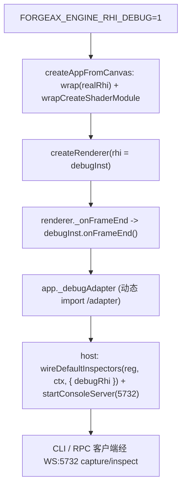
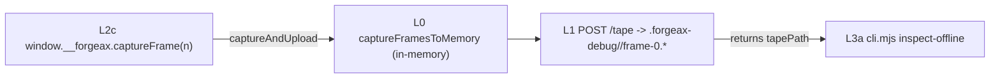

# forgeax-engine-rhi-debug

> **浏览器一行截帧 -> CLI 一行离线查看**已打通：`window.__forgeax.captureFrame(n)` 在浏览器控制台录一帧落盘，返回的 `tapePath` 直接喂给 `cli.mjs inspect-offline <tapePath> <drawIdx>` 离线 per-draw inspect——无需活设备、无需 WS 连接。底层仍是 **proxy 拦截全部 RHI 调用写进 tape，tape 在 fresh device 上确定性 replay**。`wrap(rhiInstance)` 返回 `DebugRhiInstance`，**不改** `@forgeax/engine-rhi` / `@forgeax/engine-rhi-webgpu`。第一用户是 AI subagent；通道并列暴露：WS:5732 JSON-RPC（活设备）、browser+offline CLI（离线）、直接 import。`FORGEAX_ENGINE_RHI_DEBUG=1` 开启；`=0`（默认）整包被 tree-shake，不进生产 bundle。

> [!IMPORTANT]
> contract SSOT 在 [`packages/rhi-debug/README.md`](../../packages/rhi-debug/README.md)——API 签名、错误码 hint 全串、tape format、OOS 列表都在那里，本 skill 不复述，只给"怎么用 + 怎么定位渲染 bug"。

## 心智模型

| 概念 | 是什么 |
|:--|:--|
| **wrap** | `wrap(rhi)` 返回 `DebugRhiInstance extends RhiInstance`，proxy 拦截 `createBuffer` / `beginRenderPass` / `setPipeline` / `draw` 等全部调用 |
| **tape** | 录制产出：有序 `RhiCallEvent[]` + hash 去重的二进制 blob pool。v2 起**自包含**——帧头快照活资源真实 GPU 字节为 `initialData` 事件存入 bootstrap 前缀，replay 不再依赖历史命令重建资源内容 |
| **replay** | tape 在 fresh `RhiDevice` 上严格按 **create 资源 → seed `initialData` → dispatch frame 命令** 顺序重建（caps 匹配为前提）。dawn-node 保证 RT 像素一致 ε≤0.01 |
| **inspectAt** | 在 replay 的指定 drawIdx 抓 bindings / drawCall / RT PNG。`fields` 裁剪避免 context 爆炸；RT 永远是 PNG 路径字符串，**不内联 base64** |

> v2 自包含的三件接口缝（`initialData` schema / `snapshotResource` / `snapshotAllLiveResources` / `replayInitialData` 签名 + capture-replay 时序）SSOT 在 README §Initial-state capture (v2)，本 skill 不复述。

## 开启 + 注入链路

```bash
FORGEAX_ENGINE_RHI_DEBUG=1 pnpm dev                            # 开发模式：recorder 自动注入
FORGEAX_ENGINE_RHI_DEBUG=1 pnpm -F @forgeax/hello-cube smoke   # dawn smoke 也可录
```

`FORGEAX_ENGINE_RHI_DEBUG=1` 时 `createAppFromCanvas`（`@forgeax/engine-app`）在 `createRenderer` **前**自动 `wrap(realRhi)` + `wrapCreateShaderModule(realCsm)` 注入代理；`createRenderer` **后**挂 `_onFrameEnd` 回调并动态 import `/adapter` 建出 `app._debugAdapter`。



> [!IMPORTANT]
> **createApp 只产 `_debugAdapter`，不自动接 console**——host 必须自己把 adapter 经 `wireDefaultInspectors` 的 `debugRhi` injector 挂进 `Registry` 再 `startConsoleServer`。范本：`apps/learn-render/3.model-loading/1.model-loading/src/index.ts`（demo host wiring）。console 装配机制本身见 [`forgeax-engine-cli`](../forgeax-engine-cli/SKILL.md)。

## 三连工作流：capture -> inspect -> dispose

每个动作两条对等通道——RPC（in-process / WS:5732 客户端）与 CLI（进程外）。RPC param / CLI flag / 产出形状 SSOT 在 README §RPC methods、§CLI subcommands。

| 动作 | RPC method | CLI |
|:--|:--|:--|
| 录 N 帧 | `debug.captureFrame` | `capture-frame` |
| 外触发 1 帧 | —（HMR custom event，非 WS） | `trigger-browser` |
| 查 drawIdx | `debug.inspectAt` | `inspect-at`（活设备）/ `inspect-offline`（离线自举） |
| 释放 replay | `debug.replayDispose` | — |

- 输出落 `.forgeax-debug/<runId>/frame-0.tape.bin` + `frame-0.report.json`。
- `fields` 未传 = 全字段；`--fields=bindings` 跳过 RT readback（省 `copyTextureToBuffer`）；`--fields=rt` 只要 PNG。

> [!NOTE]
> CLI 当前调用形态是 `node packages/rhi-debug/dist/cli.mjs <subcommand>`（需先 `pnpm -F @forgeax/engine-rhi-debug build`）。README 表里的 `forgeax-engine-console capture-frame` 是 end-state（plugin-bin 未落地，follow-up tweak）。未落地前 WS:5732 RPC 是 canonical 端到端通道。

## browser + offline 通道：七层渐进披露

与 WS-RPC 活设备通道**并列**的另一条：浏览器里录帧落盘，CLI / 浏览器里离线查看。每层单独可用；串联点是 **L2 返回的 `tapePath` 即 L3a 第一位置参**。各层入口签名 SSOT 在 README §Layered progressive disclosure。

| 层 | 干什么 | 入口子路径 / 命令 |
|:--|:--|:--|
| **L0** | 截帧到内存（零 fs / 零网络） | `/capture-browser` `captureFramesToMemory` |
| **L1** | 落盘 tape | POST `/__forgeax-debug/tape` 或 Node `finalize()` 尾 |
| **L2c** | 浏览器一行触发 | `window.__forgeax.captureFrame(n)`（控制台 autocomplete） |
| **L2a** | 外部 CLI 触发 | `cli.mjs trigger-browser` → POST `/__forgeax-debug/trigger` |
| **L3a** | 离线 CLI inspect（自举 dawn-node，不连 WS） | `cli.mjs inspect-offline <tapePath> <drawIdx>` |
| **L3b** | 浏览器 per-draw JSON | `/inspect-core` `inspectDrawJson` |
| **L3c** | 浏览器 RT 上屏 canvas | `/rt-to-canvas` `renderRtToCanvas` |



只有 skill 用户会踩的串联 / 隔离要点（签名细节见 README）：

- **L1 单写者**：dev-server POST 与 Node finalize 尾共用 `assembleReport`，浏览器 tape 与 Node tape 在盘上无法区分（D-3 / AC-05）。非法 body → `{error, hint}` envelope 不落盘（AC-06）；HTTP 层错误不进 `DebugError` 闭并集。
- **L2 → L3a 串联**：`captureFrame(n)` / `trigger-browser` 返回的 `tapePath` 原样作 `inspect-offline` 第一参。`FORGEAX_ENGINE_RHI_DEBUG=1` 时 `createAppFromCanvas` 才挂 `window.__forgeax`；未设 → 调用抛 `TypeError`（显式失败，非静默）。
- **L3b vs L3a 输出差异**：浏览器 `inspectDrawJson` 的 `['rt']` 返回 `{width, height, pixels: Uint8Array}`；Node `inspectAt` 返回 RT **PNG 路径字符串**——PNG 编码是 Node-only。
- **per-draw RT 必须 `commitThroughDraw(drawIdx)` 先步进**：看「draw #N 当时的画面」时，先 `replay.reset()` → `replay.commitThroughDraw(drawIdx)` 再 `inspectDrawJson`/`readbackDrawRt`/`renderRtToCanvas`。它重放到该 draw 并合成 `endRenderPass+finish+submit`，让 color attachment 拿到 **draw 0..N 累积**像素（选 N 看到的是执行到 N 那一刻，不是最终合成帧）。WebGPU 不能读进行中 pass 的 attachment，所以裸 `stepTo` 停在 pass 中间会读到未提交/全黑——这正是 `stepTo(end)` 被滥用导致「点哪个 draw 都看最终帧」的根因。返回 `{committed:false}` = 该 draw 在 depth-only / compute pass（无颜色 RT，渲染 no-rt 态）。单调前进，回看更早 draw 须先 `reset()`。**整帧**才用 `stepTo(events.length-1)`。CLI `inspect-offline` 与 viewer RtPanel 均已走此路。
- **node-free 隔离**：`/capture-browser`、`/inspect-core`、`/rt-to-canvas` 皆零 `node:` / `pngjs` / `ws` 且**不进 barrel**，只能经 subpath 触达（保 tree-shake gate，见 §tree-shake 约束）。

> 完整浏览器控制台 capture → replay → inspect 代码示例在 README §Browser inspect usage example。

## 症状 -> tape -> inspect 决策流

遇 black-screen / grey-screen / wrong-texture / wrong-binding 渲染症状：

1. **capture 1 帧** — `debug.captureFrame({ frames: 1 })` 录下当前帧全部 RHI 调用。
2. **读 `report.json`** — 找 pass 起止 drawIdx，定位"哪个 pass 之后 RT 开始崩"。
3. **inspectAt pass 边界** — `inspectAt(tapePath, passEndDrawIdx, ['rt'])` 看 RT PNG，确认错位发生在哪个 pass。
4. **inspectAt per-draw** — 缩窄到出错 draw，`['bindings']` 对比 bind group entries 与预期（贴图 GUID 未解析 / UBO 值不对 / sampler 类型错）。
5. **falsification check** — 在 tape 里 swap 一个 binding index，confirm 像素变化，证明定位正确。

**真实 demo 抓帧已打通**：非自包含 `captureFrame(n)` 在真实 demo（hello-cube 等）上产出自洽 tape，经 `deserializeTape` → `createReplay(tape, device, createShaderModule)` → `stepTo(N)` → `inspectDrawJson` 全链可用（swapchain RT 忠实重建、bgra→rgba 适配、bindGroup 资源包装等机制 SSOT 在 README §Layered progressive disclosure 真实 demo 段）。

> [!CAUTION]
> **`createReplay` 第三参 `createShaderModule` 必传**——真实 demo tape 都带 `createShaderModule` events；漏传则静默跳过，下游 pipeline 创建在 RHI 层炸（**非** `DebugError`，`createReplay` 不报错）。从 `@forgeax/engine-rhi-webgpu` import（它不在 `RhiDevice` 上）。

定位 `tape-handle-graph-broken`（同 code 两种 `.hint`，**按 hint 文本分支**选恢复路径，不按 code）：

- **finalize 侧**（`.hint` 含 bootstrap table）：`wrap()` 晚于资源创建 → 重新抓帧（wrap 须在资源创建前）。
- **deserialize 侧**（`.hint` 含稳态帧/self-contained 指引，无 bootstrap 子串）：旧式稳态帧 tape → 重新抓帧或改用自包含 tape。

## 错误码

`DebugErrorCode` 14 成员闭并集，**完全独立**于 `RhiErrorCode`；`switch (err.code)` 穷尽，TS 编译期抓漏分支。各 code 触发条件 + hint 模板 + `.detail` 形状全表 SSOT 在 README §Error codes——本 skill 的 §踩坑 只解释定位渲染 bug 时实际撞到的几个。

## 跨后端注意

| 后端 | replay 像素确定性 | capture |
|:--|:--|:--|
| dawn-node (WebGPU native) | ε≤0.01（最强保证） | yes |
| chromium WebGPU | 非零像素 + structural 一致，不保证像素精确 | yes |
| wgpu-wasm (WebGL2 fallback) | v1 不测（OOS-7） | peerDep 存在但未验证 |

> dawn-node smoke 走 `gltfDocToSceneAsset -> register(handle)`，绕过 dev-server pack-body 序列化与整条 WebGPU validation；typed-array survival / BGL shape mismatch / vertex-attribute presence 类 bug 只在 browser 路径暴露。dawn smoke 全绿不足以证明 browser 正确——视觉 SSOT 是 `Read(RT PNG)`。

## 踩坑

- **`recorder-not-attached`**：忘设 `FORGEAX_ENGINE_RHI_DEBUG=1`，或在 bootstrap 之后才设——必须 bootstrap 时已 `=1`，否则 wrap 注入跳过。
- **console 查不到 `debug.*` root**：host 没把 `debugRhi` injector 传给 `wireDefaultInspectors`（→ `rpc-target-not-wired`）。createApp 只产 `_debugAdapter`，wiring 是 host 的活。
- **import 找不到 inspector / cli / capture-browser / inspect-core / rt-to-canvas**：barrel 只导出 recorder/replayer/tape-format/errors + node-free L0 原语（`finalizeToMemory` / `assembleReport` / `generateRunId`）；其余全走对应子路径（不进 barrel 的清单 + 原因见 §tree-shake 约束）。
- **inspector vs inspect-core 选错（浏览器里炸）**：`/inspector` 是 Node-only（pngjs / fs），`inspectAt` 返 RT **PNG 路径**、需 `outputDir`；`/inspect-core` 是 node-free 浏览器安全口，`inspectDrawJson` 返 RT **像素 Uint8Array**、无 `outputDir`、`device` caller 传入。浏览器端用 `/inspector` 会因 Node builtin 不存在而炸。
- **`replay-dispose-busy`**：还有 in-flight `inspectAt` 时 dispose；先 `await` 完所有 inspect 再 dispose。
- **`trigger-browser` 返回 503 `no-browser-tab`**：trigger 通过 `Promise.race` 等待浏览器 tab 回传 tape，30 秒内无 tab 响应即超时。常见原因：(a) dev-server 未启动（`pnpm dev` 没跑）；(b) 浏览器未打开 `http://localhost:5173`；(c) 页面未加载完成或 HMR 未连接（检查浏览器控制台有无 `[vite] connected` 日志）；(d) `FORGEAX_ENGINE_RHI_DEBUG` 未设 `1`（HMR listener 在 gate 内，未设时不会注册）。先确认 dev-server 运行 + 浏览器 tab 打开 + HMR 已连接，再重试。
- **`trigger-browser` 磁盘出现多份 tape**：多 tab 同时在线时，HMR custom event 广播到每个 tab，各 tab 各自截帧上传——trigger 响应只返回首个到达的 tape 路径，但其余 tab 的 tape 仍正常落盘（不同 `runId`）。这是 broadcast 语义下的预期行为，非 bug；若不想多份 tape，确保 trigger 时只开一个 tab。

## tree-shake 约束

> [!IMPORTANT]
> 整包默认对生产 bundle 不可见，靠两条机械约束保证：

- **`/capture-browser` 不进 barrel**：L0 浏览器截帧只能经显式 `@forgeax/engine-rhi-debug/capture-browser` subpath 触达；barrel import 不会把它拉进图。`dist/capture-browser.mjs` 只 import `@forgeax/engine-types`（零 `node:` / `pngjs` / `ws`）。
- **`FORGEAX_ENGINE_RHI_DEBUG=0` 零注入**：未注册 vite plugin（或 flag 未设）时 `import.meta.env.FORGEAX_ENGINE_RHI_DEBUG` 无定义、`createApp` guard 整段不命中、`window.__forgeax` 不存在；整包被 tree-shake 出生产 bundle。grep gate：`grep -L 'engine-rhi-debug' apps/hello/*/dist/assets/*.mjs` 全 demo 集合无残留（AC-03 / AC-10）。
- pngjs / WS 在 `/inspector` / `/cli` / `/adapter`（node-only）子路径，刻意不进 barrel。
- **`/inspect-core` 与 `/rt-to-canvas` 不进 barrel**：这两个 subpath 是 node-free 的浏览器 inspect 入口（L3b + L3c），只 import `./readback` / `./tape-format` / `./errors`（皆 node-free），刻意不走 barrel 以保持 tree-shake gate。各自由 dist grep gate 守卫：`dist/inspect-core.mjs` 与 `dist/rt-to-canvas.mjs` 皆不含 `node:fs` / `node:path` / `pngjs` / `ws` 等 Node-only 标识符（AC-10 / AC-11）。

## L3d 离线 viewer 页面（dockview-based）

> 最顶层 **L3d**：纯离线 web app 把一份截帧 tape 可视化成 RenderDoc 风格的四面板 dockview 工作区。**不需要游戏在跑**：拖 `frame-0.tape.bin` + `frame-0.report.json` 进去就能看。布局可 float / split / stack，持久化到 localStorage，支持 Reset Layout 恢复默认。

| 属性 | 内容 |
|:--|:--|
| **入口** | `apps/rhi-debug-viewer/`（独立 Vite + React app） |
| **启动** | `pnpm -F @forgeax/rhi-debug-viewer dev` → localhost:5173 |
| **消费原语** | `deserializeTape` / `computePassOffsets` / `extractDrawInfo` / `createReplay` / `renderRtToCanvas` / `readbackTexturePixels` |
| **浏览器依赖** | 纯事件面板（EventBrowser / PipelineState / ResourceInspector）零 GPU；TextureViewer 面板需 WebGPU（无 GPU 时 per-texture 降级） |
| **tape 版本兼容** | viewer 读 `TAPE_FORMAT_VERSION` ∈ {2, 3}（`deserializeTape` 接受旧 v2 tape）。v2 tape 缺失的 v3 新事件（setBlendConstant / drawIndirect / pass-level debug group 等）视为「命令不存在」，对应面板区域呈空态而非报错 |

### 四面板 dockview 工作区

```
+-------------------+------------------------------------+
| Event Browser     | Pipeline State | Texture Viewer    |
| (pass->draw tree  +----------------+--------------------+
|  + full command   | Resource Inspector                 |
|  stream,          |                                    |
|  draw focus)      |                                    |
+-------------------+------------------------------------+
```

默认布局硬编码为 RenderDoc 式四面板排布，经 dockview layout API 加载。四面板通过 React Context 共享选择状态：选中一个 draw 时全部面板联动刷新。

| 面板 | 组件 | 功能 |
|:--|:--|:--|
| **Event Browser** | `EventBrowser.tsx` | pass->draw 树 + 完整命令流（含非 draw 命令：setPipeline/setBindGroup/copy*/clearBuffer/debug marker）。非 draw 命令暗色小图标，draw 高亮。`pushDebugGroup`->`popDebugGroup` 形成可折叠嵌套。顶部 `draws only` / `all commands` 过滤开关，默认 `draws only` |
| **Pipeline State** | `PipelineState.tsx` | 选中 draw 的完整管线状态，RenderDoc 式七阶段：IA（topology/index format）/ Vertex Input（per-slot buffer + layout）/ Shaders（vertex/fragment module handle + 内联展开 WGSL 源码）/ Rasterizer（cull mode/front face）/ Depth-Stencil（format/compare/stencil reference）/ Blend（per-target blend + blendConstant）/ Multisample（count/mask） |
| **Texture Viewer** | `TextureViewer.tsx` | 左侧缩略图列表（color RT 0..N + depth-stencil + 绑定纹理）+ 右侧大图预览。depth 附件以 auto-normalize 灰度可视化（two-pass min/max 归一化 + 除零退化）。per-selection 一次性回读全部纹理，缩略图切换零额外 GPU。per-texture 退化矩阵（ok/no-rt/no-webgpu/error），单纹理失败不影响其余 |
| **Resource Inspector** | `ResourceInspector.tsx` | 全部 `create*` 资源描述符（Buffers/Textures/Samplers/BindGroupLayouts/PipelineLayouts/Pipelines/ShaderModules）。usage flags 解码为可读字符串。handle 显示为超链接，点击跳转并高亮匹配行。选中非 draw 命令时显示该命令的 src/dst 资源 |

### Dock 操作 + 布局持久化

- **Float / Split / Stack**：dockview 内置，通过拖拽标题栏或右键菜单操作面板
- **布局持久化**：`onDidLayoutChange` 自动存档到 `localStorage`，key = `forgeax-viewer-layout-v<schemaVersion>`（schemaVersion 当前=1）。面板增减时 bump schemaVersion
- **版本不匹配回退**：`localStorage` 中 schemaVersion 不匹配时丢弃旧布局，使用硬编码默认四面板排布，不抛错
- **Reset Layout** 按钮：Header 栏 Reset Layout 按钮 → `api.clear()` → 重新应用默认布局

### 心智模型

| 概念 | 是什么 |
|:--|:--|
| **buildViewModel** | `Tape -> ViewModel` 纯函数（零 GPU）。预算阶段一次计算 `tree`（pass/draw 树）、`draws`（全部 draw/dispatch 信息）、`commands`（完整命令流，含非 draw）、`resources`（handleId -> 解析后 create* 描述符 Map）。惰性阶段（选中 draw）才跑 GPU readback 填 RT 像素 |
| **Replay 会话** | `ensureReplaySession(tape)` 建一次独立 WebGPU 设备 + `createReplay`，跨 draw 重选复用（C7） |
| **React Context** | `SelectionContext` 提供 `selectedDrawIdx` / `selectedCommandIdx`，四面板经 `useContext` 消费。选中 draw 刷新 Panel 2/3/4；选中非 draw 命令（如 copyBuffer）则 Panel 2/3 显示缺省文案，Panel 4 显示 src/dst 资源 |

### 工作流

```
拖入 frame-0.tape.bin + frame-0.report.json
  -> tape-source.ts pair 匹配 + 重建 {header,events} + deserializeTape
  -> buildViewModel: computePassOffsets(events) 算树 + extractDrawInfo 算 draws
     + 遍历 events 建 commands/commands[] 数组 + resources Map
     + 逐 draw 提取 pipelineState（createRenderPipeline.desc）
     + 逐 pass 收集 vertexBuffers/depthStencil
  -> window.__forgeaxViewer = vm（零副本暴露同对象引用）
  -> 默认首 draw 选中（data-forgeax-selected="true"）
  -> 四面板联动：EventBrowser 选 draw -> PipelineState/TextureViewer/ResourceInspector 刷新
  -> TextureViewer 选中 draw -> 一次性回读全部纹理（per-selection readback）
```

### AI 操作 viewer：结构化数据通道 + 定位元素

- **读数据唯一口**：`window.__forgeaxViewer`（类型 `ViewModel`，零副本）。扩展字段（v3）：
  - `viewModel.commands` — 完整命令流数组，含非 draw 事件（copy*/clear/debug marker），每项含 `passIdx` / `eventKind` / `isDraw`
  - `viewModel.resources` — `Map<HandleId, CreateDescriptor>`，含全部 `create*` 资源（buffer desc / texture desc / sampler desc / bindGroupLayout / pipelineLayout / renderPipeline desc / wgslCode）
  - `viewModel.draws[i].pipelineState` — 七阶段管线状态（inputAssembly / vertexInput / shaders / rasterizer / depthStencil / blend / multisample）
  - `viewModel.draws[i].vertexBuffers` — `Map<slot, bufferHandleId>`（来自 setVertexBuffer events）
  - `viewModel.draws[i].depthStencil` — `{ depthStencilViewHandleId, depthStencilAttachment }`（来自 beginRenderPass）
  - 既有字段：`viewModel.tree`（pass 节点 + draws 列表）、`viewModel.draws[i].bindings` / `.drawCall` / `.colorAttachmentHandleId`、`viewModel.meta`
- **定位元素**：用 `data-forgeax-*` 锚点（SSOT `apps/rhi-debug-viewer/src/selectors.ts`）：
  - `data-forgeax-event-browser` — EventBrowser 面板容器
  - `data-forgeax-pipeline-state` — PipelineState 面板容器
  - `data-forgeax-texture-viewer` — TextureViewer 面板容器
  - `data-forgeax-resource-inspector` — ResourceInspector 面板容器
  - `data-forgeax-command-row="<idx>"` — 命令流中第 idx 条命令行
  - `data-forgeax-texture-thumbnail="<idx>"` — 纹理缩略图第 idx
  - `data-forgeax-resource-row="<handleId>"` — 资源表中某 handle 对应行

### 退化矩阵

| 状态 | 触发条件 | 纯事件面板（Event/Pipeline/Resource） | Texture Viewer |
|:--|:--|:--|:--|
| **loaded** | tape 成功加载 | 正常渲染 | per-texture status（见下） |
| **parse-error** | `deserializeTape` 失败 / JSON 解析失败 | 不渲染（ErrorBanner 红条 + code/hint） | 不渲染 |
| **empty** | 未拖入 tape | 空页（DropZone 可见） | 不渲染 |

**Per-texture 退化（Texture Viewer，画板 3）：**

| status | 触发条件 | 显示 |
|:--|:--|:--|
| **ok** | 纹理回读成功 | 正常像素（color: RGBA; depth: auto-normalize 灰度） |
| **no-rt** | compute-only draw / 无 color/depth attachment | "no-rt" 占位 |
| **no-webgpu** | `navigator.gpu === undefined` / adapter 请求失败 | "no-webgpu" 占位，布局保留 |
| **error** | 回读失败（如 depth24plus 不可 copy） | "error" + 错误消息 |

Single texture error does not affect other textures in the same draw.

> **不新增 `DebugErrorCode`** —— 复用既有的 14 成员闭并集。

### 踩坑

- **viewer 不走 `inspectDrawJson` 取 bindings**：`draws[].bindings` 由 `extractDrawInfo`（纯 events）在预算阶段填充，零 GPU。`inspectDrawJson` 只在 L3b 浏览器控制台手动 inspect 时用。
- **report.json.passOffsets 不可信**：viewer 一律从 events 经 `computePassOffsets` 重算树结构（D-3），不读 report.json 里的 `passOffsets`（render-only，可能缺 compute pass）。
- **shader 用 standalone `createShaderModule`**：viewer `replay-session.ts` 从 `@forgeax/engine-rhi-webgpu` import standalone `createShaderModule` 喂 `createReplay` 第三参——**不是**幽灵 `RhiDevice.createShaderModule`（fix-f3 已移除）。
- **RT 面板独立 WebGPU 设备**：viewer 自己 `requestAdapter/requestDevice`，与被截帧的游戏无关。

## 深入

- 包全貌 / API 签名 / 错误码 hint 全串 / tape format 常量 / OOS 列表：[`packages/rhi-debug/README.md`](../../packages/rhi-debug/README.md)（contract SSOT）
- recorder 状态机 / blob pool / replayer / inspector LRU cache 源码：`packages/rhi-debug/src/`
- viewer 页面源码：`apps/rhi-debug-viewer/src/`（viewer-model.ts / selectors.ts / tape-source.ts / replay-session.ts / App.tsx + components/）
- `FORGEAX_ENGINE_RHI_DEBUG=1` 注入点：`packages/app/src/create-app.ts`（wrap + `_onFrameEnd` + `_debugAdapter`）
- demo host wiring 范本：`apps/learn-render/3.model-loading/1.model-loading/src/index.ts`（`debugRhi` injector + `startConsoleServer`）
- console / inspector 装配基座（`Registry` / `wireDefaultInspectors` / `startConsoleServer`）：[`forgeax-engine-cli`](../forgeax-engine-cli/SKILL.md)
- tree-shake grep gate：`FORGEAX_ENGINE_RHI_DEBUG !== '1'` 时 `grep -L 'engine-rhi-debug' apps/hello/*/dist/assets/*.mjs` 全 demo 集合无残留
