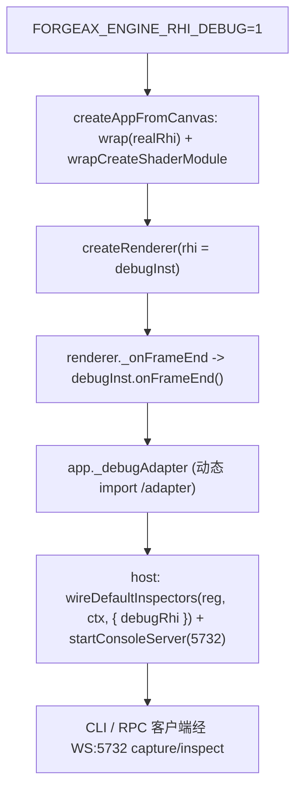
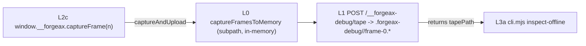

# forgeax-engine-rhi-debug

> **浏览器一行截帧 -> CLI 一行离线查看**已打通：`window.__forgeax.captureFrame(n)` 在浏览器控制台录一帧落盘，返回的 `tapePath` 直接喂给 `cli.mjs inspect-offline <tapePath> <drawIdx>` 离线 per-draw inspect——无需活设备、无需 WS 连接。底层仍是 **proxy 拦截全部 RHI 调用写进 tape，tape 在 fresh device 上确定性 replay**。`wrap(rhiInstance)` 返回 `DebugRhiInstance`，**不改** `@forgeax/engine-rhi` / `@forgeax/engine-rhi-webgpu`。第一用户是 AI subagent；通道并列暴露：WS:5732 JSON-RPC（活设备）、browser+offline CLI（离线）、直接 import。`FORGEAX_ENGINE_RHI_DEBUG=1` 开启；`=0`（默认）整包被 tree-shake，不进生产 bundle。

> [!IMPORTANT]
> contract SSOT 在 [`packages/rhi-debug/README.md`](../../packages/rhi-debug/README.md)——API 签名、错误码 hint 全串、tape format、OOS 列表都在那里，本 skill 不复述，只给"怎么用 + 怎么定位渲染 bug"。

## 心智模型

| 概念 | 是什么 |
|:--|:--|
| **wrap** | `wrap(rhi)` 返回 `DebugRhiInstance extends RhiInstance`，proxy 拦截 `createBuffer` / `beginRenderPass` / `setPipeline` / `draw` 等全部调用 |
| **tape** | 录制产出：有序 `RhiCallEvent[]` + hash 去重的二进制 blob pool。文件组合 `frame-0.tape.bin` + `frame-0.report.json` |
| **replay** | tape 在 fresh `RhiDevice` 上按 event 序列重建（caps 匹配为前提）。dawn-node 保证 RT 像素一致 ε≤0.01 |
| **inspectAt** | 在 replay 的指定 drawIdx 抓 bindings / drawCall / RT PNG。`fields` 裁剪避免 context 爆炸；RT 永远是 PNG 路径字符串，**不内联 base64** |

## 开启 + 注入链路

```bash
FORGEAX_ENGINE_RHI_DEBUG=1 pnpm dev                            # 开发模式：recorder 自动注入
FORGEAX_ENGINE_RHI_DEBUG=1 pnpm -F @forgeax/hello-cube smoke   # dawn smoke 也可录
```

`FORGEAX_ENGINE_RHI_DEBUG=1` 时 `createAppFromCanvas`（`@forgeax/engine-app`）在 `createRenderer` **前**自动 `wrap(realRhi)` + `wrapCreateShaderModule(realCsm)` 注入代理；`createRenderer` **后**挂 `_onFrameEnd` 回调并动态 import `/adapter` 建出 `app._debugAdapter`。



> [!IMPORTANT]
> **createApp 只产 `_debugAdapter`，不自动接 console**——host 必须自己把 adapter 经 `wireDefaultInspectors` 的 `debugRhi` injector 挂进 `Registry` 再 `startConsoleServer`。范本：`apps/learn-render/3.model-loading/1.model-loading/src/index.ts`（demo host wiring）。console 装配机制本身见 [`forgeax-engine-cli`](../forgeax-engine-cli/SKILL.md)。

## 三连工作流：capture -> inspect -> dispose

两条对等通道，RPC（in-process / WS 客户端）与 CLI（进程外）：

| 动作 | RPC method (WS:5732) | CLI | 产出 |
|:--|:--|:--|:--|
| 录 N 帧 | `debug.captureFrame({ frames, label? })` | `capture-frame [--frames=N] [--label=STR] [--target=WS]` | `{ tapes: [{ frameIdx, runId, tapePath, reportPath }] }` |
| 外触发 1 帧 | —（HMR custom event 信道，非 WS RPC） | `trigger-browser [--frames=N] [--label=STR] [--dev-url=URL]` | `{ runId, tapePath, reportPath }`——`tapePath` 喂 `inspect-offline` |
| 查 drawIdx | `debug.inspectAt({ tapePath, drawIdx, fields? })` | `inspect-at <tapePath> <drawIdx> [--fields=LIST] [--target=WS]` | `InspectReport`（JSON；RT 是 PNG 路径） |
| 释放 replay | `debug.replayDispose({ tapePath })` | — | `{ ok: true }`（LRU cache 清退） |

- 输出落 `.forgeax-debug/<runId>/frame-0.tape.bin` + `frame-0.report.json`。
- `--target` 默认 `ws://localhost:5732`；`--frames` 默认 `1`；`--label` 默认空。
- `--dev-url` 默认 `http://localhost:5173`（trigger-browser 用的 dev-server HTTP 地址）。
- `fields` 未传 = **全字段**（bindings + drawCall + rt）；传 `--fields=bindings` 跳过 RT readback（省 `copyTextureToBuffer`）；传 `--fields=rt` 只要 PNG。
- **trigger-browser HTTP 错误信封**：非 200 响应返回 `{ error: string, hint: string }`（非 `DebugError`，不扩张 12 成员闭并集）：`no-browser-tab`（503，hint 提示检查 dev-url 是否打开且浏览器 tab 已加载 HMR）、`recorder-busy`（409，hint 提示等待当前 capture 完成）。

> [!NOTE]
> CLI 当前调用形态是 `node packages/rhi-debug/dist/cli.mjs <subcommand>`（需先 `pnpm -F @forgeax/engine-rhi-debug build`）。README 表里的 `forgeax-engine-console capture-frame` 是 end-state（plugin-bin 未落地，follow-up tweak）。未落地前 WS:5732 RPC 是 canonical 端到端通道。

## browser + offline 通道：七层渐进披露（L0 / L1 / L2c / L2a / L3a / L3b / L3c）

与上面 WS-RPC 活设备通道**并列**的另一条通道：浏览器里录帧落盘，CLI 里离线查看。每层都能单独用；L2c 返回的 `tapePath` 就是 L3a 的第一参——这是串联点。

| 层 | 表面 | 入口 | 产出 |
|:--|:--|:--|:--|
| **L0** | node-free subpath（原始字节） | `@forgeax/engine-rhi-debug/capture-browser` 的 `captureFramesToMemory(debugInst, frames, label?)` | `CaptureBrowserTape { runId, json, blob, passOffsets, valid }`（纯内存，零 fs / 零网络） |
| **L1** | 落盘 tape | POST `/__forgeax-debug/tape`（dev-server）或 Node `finalize()` 尾 | `.forgeax-debug/<runId>/frame-0.tape.bin` + `frame-0.report.json`（两写者经同一 `assembleReport`，逐字节一致 D-3） |
| **L2c** | 浏览器一行触发 | `window.__forgeax.captureFrame(n)`（控制台 autocomplete 可发现） | `{ runId, tapePath, reportPath }`——`tapePath` 喂 L3a |
| **L2a** | 外部 CLI 触发 | `node packages/rhi-debug/dist/cli.mjs trigger-browser [--frames=N] [--label=STR] [--dev-url=URL]` | `{ runId, tapePath, reportPath }`——`tapePath` 喂 L3a |
| **L3a** | 离线 CLI inspect | `node packages/rhi-debug/dist/cli.mjs inspect-offline <tapePath> <drawIdx> [--fields=...]` | 结构化 InspectReport JSON（bindings / drawCall）+ RT PNG 路径 |
| **L3b** | browser per-draw JSON | `@forgeax/engine-rhi-debug/inspect-core` -> `inspectDrawJson(replay, drawIdx, events, device, fields?)` | structured `InspectReport` (bindings + drawCall, no PNG path) |
| **L3c** | browser RT to canvas | `@forgeax/engine-rhi-debug/rt-to-canvas` -> `renderRtToCanvas(replay, drawIdx, device, canvas)` | RT pixels rendered onto external canvas (no fs/pngjs) |



- **L0 隔离**：`/capture-browser` 只 import `recorder-core` + `tape-format`（皆 node-free），无 `node:` / `pngjs` / `ws`。**不进 barrel**，只能经 subpath 触达——保 tree-shake gate。
- **L1 单写者**：dev-server POST 端点与 Node finalize 尾都走同一 `assembleReport`，故浏览器录的 tape 与 Node 录的在盘上无法区分（D-3 / AC-05）。非法 body -> `{error, hint}` envelope 不落盘（AC-06），HTTP 层错误不进 `DebugError`（12 成员不扩张）。dev-server 端点由 `@forgeax/engine-vite-plugin-rhi-debug` 的 `vitePluginRhiDebug()` 挂载（加进 `vite.config` 的 `plugins[]` 即可，零样板自注入 flag）。`POST /__forgeax-debug/trigger` 端点同步返回 `{ runId, tapePath, reportPath }`（20ms ~ 30s，取决 tab 响应速度），非 200 返回 HTTP 错误信封 `{ error, hint }`（`no-browser-tab` 503 / `recorder-busy` 409）。
- **L2c 串 L3a**：`captureFrame(n)` 返回 `{ runId, tapePath, reportPath }`，把 `tapePath` 原样作为 `inspect-offline` 第一位置参。`FORGEAX_ENGINE_RHI_DEBUG=1` 时 `createAppFromCanvas` 才挂 `window.__forgeax`；未设 -> 不存在 -> 调用抛 `TypeError`（显式失败，非静默）。`trigger-browser` CLI 子命令是 `captureFrame` 的 Node 侧等价物——同样调用 `captureAndUpload`，但触发信道是 CLI HTTP POST 而非 DevTools 控制台。
- **L2a 串 L3a**：`trigger-browser` 走 `POST /__forgeax-debug/trigger` 同步往返，返回的 `tapePath` 可直喂 `inspect-offline`。`--dev-url` 默认 `http://localhost:5173`，`--frames` 默认 `1`，`--label` 可选。**多 tab 行为**：HMR custom event 广播到所有连接 tab，每个 tab 各自截帧并上传 tape；trigger 响应只返回首个到达的 tape 路径，但后续 tab 的上传仍正常写盘——磁盘可能出现多份 tape（不同 `runId`），这是预期行为，非 bug。（见下方踩坑条目。）
- **L3a 离线**：`inspect-offline` 读盘 + 自举 dawn-node device + replay，**不连 WS**——区别于 `inspect-at`（WS:5732 活设备）。bin 是 `forgeax-rhi-debug`（`package.json#bin`），programmatic 用法经 `exports['./cli']`。
- **L3b 浏览器 per-draw JSON**：`inspectDrawJson(replay, drawIdx, events, device, fields?)` 在浏览器内直接产出 `InspectReport`，不需要 CLI / Node / 落盘。`events` 就是 capture 产出的 `RhiCallEvent[]`；`device` 是 caller 传入的 `RhiDevice`（来自 `navigator.gpu`）。`fields` 裁剪同 `inspectAt`：`undefined` = 全量，`['bindings']` 跳过 RT readback，`['rt']` 返回 `{width, height, pixels}`（是 `Uint8Array` 像素数据，**不是 PNG 路径**——那是 Node `inspectAt` 独有）。入口是 subpath `@forgeax/engine-rhi-debug/inspect-core`。
- **L3c 浏览器 RT 上屏**：`renderRtToCanvas(replay, drawIdx, device, canvas)` 把 RT 像素直接画到任意 canvas 元素上（通过 `getContext('2d')` + `putImageData`），零文件系统。支持 `HTMLCanvasElement` 和 `OffscreenCanvas`（Worker 场景）。入口是 subpath `@forgeax/engine-rhi-debug/rt-to-canvas`。

### 浏览器内 inspect (L3b + L3c)

浏览器侧 per-draw inspect 不需要 CLI / Node / 落盘——capture 产出的 `RhiCallEvent[]` + `Replay` 直接喂给 `inspectDrawJson` 出结构化 JSON，或者 `renderRtToCanvas` 把 RT 像素画到 canvas 上。两者皆 node-free（subpath 零 `node:` / `pngjs` / `ws` 导入），可在浏览器控制台或 dev 脚本内使用。

```ts
// Browser console / dev script -- no CLI, no Node.
import { inspectDrawJson } from '@forgeax/engine-rhi-debug/inspect-core';
import { renderRtToCanvas } from '@forgeax/engine-rhi-debug/rt-to-canvas';

// inspectDrawJson: per-draw JSON report
const report = await inspectDrawJson(replay, 0, events, device, ['bindings', 'drawCall']);
if (report.ok) {
  console.log(report.value.bindings, report.value.drawCall);
}

// renderRtToCanvas: render RT pixels to canvas
const canvas = document.getElementById('debug-canvas') as HTMLCanvasElement;
const rtRes = await renderRtToCanvas(replay, 0, device, canvas);
```

`contract SSOT` 是 [`packages/rhi-debug/README.md`](../../packages/rhi-debug/README.md)——API 签名、错误码 hint 全串、完整用法示例都在那里。本 skill 是"怎么定位渲染 bug"的决策流参照，不重复 API 签名。

## 症状 -> tape -> inspect 决策流

遇 black-screen / grey-screen / wrong-texture / wrong-binding 渲染症状：

1. **capture 1 帧** — `debug.captureFrame({ frames: 1 })` 录下当前帧全部 RHI 调用。
2. **读 `report.json`** — 找 pass 起止 drawIdx，定位"哪个 pass 之后 RT 开始崩"。
3. **inspectAt pass 边界** — `inspectAt(tapePath, passEndDrawIdx, ['rt'])` 看 RT PNG，确认错位发生在哪个 pass。
4. **inspectAt per-draw** — 缩窄到出错 draw，`['bindings']` 对比 bind group entries 与预期（贴图 GUID 未解析 / UBO 值不对 / sampler 类型错）。
5. **falsification check** — 在 tape 里 swap 一个 binding index，confirm 像素变化，证明定位正确。

**真实 demo 抓帧支持**：非自包含抓帧 `captureFrame(n)` 在真实 demo（hello-cube 等）上也能产出自洽 tape，经 `deserializeTape` → `createReplay(tape, device, createShaderModule)` → `stepTo(N)` → `inspectDrawJson` 全链端到端可用。swapchain RT 经忠实 createTexture（真实尺寸 / format / usage+COPY_SRC）在 fresh device 上重建为 offscreen RT；带资源 bindGroup（buffer / sampler / textureView）经 `RhiBindingResource {kind,value}` 包装满足 replay 的 4-kind bind 路径。浏览器抓帧把 canvas swapchain 录为 `bgra8unorm` texture，但以 `bgra8unorm-srgb` 建 view / pipeline target（多数平台 canvas 偏好的 srgb view）；离线 replay 时该 srgb view 套在 plain bgra texture 上是 incompatible-view-format 错（在 `beginRenderPass` 暴露）。`createReplay` 在 replay 层内部把 canvas BGRA format 一致地适配为字节兼容的 `rgba8unorm`（createTexture / createTextureView / pipeline target 三处同步），浏览器 tape 因此可直接喂入 `createReplay`，无需 per-script format 改写。`wrap()` 须在资源创建前调用；否则 `finalize()` 返回 `tape-handle-graph-broken`（`.hint` 含 bootstrap table 标记，指引重新抓帧）。旧式稳态帧 tape deserialize 报 `tape-handle-graph-broken` 且 `.hint` 含稳态帧/self-contained 恢复指引（指向 deserialize 侧标记，不含 bootstrap 子串），提示重新抓帧或改用自包含 tape。

## 错误码速查

`DebugErrorCode` 12 成员闭并集，**完全独立**于 `RhiErrorCode`；`switch (err.code)` 穷尽，TS 编译期抓漏分支。

| code | 触发 |
|:--|:--|
| `recorder-not-attached` | RPC `debug.captureFrame` 但 bootstrap 时 `FORGEAX_ENGINE_RHI_DEBUG !== '1'` |
| `recorder-already-armed` | 上次 arm 未完成又 arm；先 `disposeError()` 或等 capture 收尾 |
| `frame-end-hook-missing` | `_onFrameEnd` 注入点缺失（理论不可达） |
| `tape-format-version-mismatch` | tape `formatVersion` 与 runtime 不一致 |
| `tape-handle-graph-broken` | event 引用未声明的 handleId |
| `caps-mismatch` | replay 设备 caps 不足（`.detail.missingCaps` 列缺失项） |
| `replay-step-out-of-range` | `stepTo(N)` 超界或回溯 |
| `replay-deterministic-violation` | replay RT 与原帧像素超阈（test-only） |
| `rt-readback-failed` | `copyTextureToBuffer` / `mapAsync` 链失败 |
| `png-encode-failed` | PNG 编码失败 |
| `rpc-target-not-wired` | `wireDefaultInspectors` 没传 `debugRhi` injector |
| `replay-dispose-busy` | `dispose()` 时存在未完成的 in-flight inspect（`.detail.inFlightDrawIndices`）|

## 跨后端注意

| 后端 | replay 像素确定性 | capture |
|:--|:--|:--|
| dawn-node (WebGPU native) | ε≤0.01（最强保证） | yes |
| chromium WebGPU | 非零像素 + structural 一致，不保证像素精确 | yes |
| wgpu-wasm (WebGL2 fallback) | v1 不测（OOS-7） | peerDep 存在但未验证 |

> dawn-node smoke 走 `gltfDocToSceneAsset -> register(handle)`，绕过 dev-server pack-body 序列化与整条 WebGPU validation；typed-array survival / BGL shape mismatch / vertex-attribute presence 类 bug 只在 browser 路径暴露。dawn smoke 全绿不足以证明 browser 正确——视觉 SSOT 是 `Read(RT PNG)`。

## 踩坑

- **`recorder-not-attached`**：忘设 `FORGEAX_ENGINE_RHI_DEBUG=1`，或在 bootstrap 之后才设——必须 bootstrap 时已 `=1`，否则 wrap 注入跳过。
- **console 查不到 `debug.*` root**：host 没把 `debugRhi` injector 传给 `wireDefaultInspectors`（→ `rpc-target-not-wired`）。createApp 只产 `_debugAdapter`，wiring 是 host 的活。
- **import 找不到 inspector / cli / capture-browser**：barrel（`@forgeax/engine-rhi-debug`）只导出 recorder/replayer/tape-format/errors + node-free L0 原语（`finalizeToMemory` / `assembleReport` / `generateRunId`）；inspector 走 `/inspector`、CLI 走 `/cli`、adapter 走 `/adapter`、L0 浏览器截帧走 `/capture-browser` 子路径（pngjs / WS 是 Node-only，刻意不进 barrel 以保 tree-shake）。`inspect-core` 走 `/inspect-core`、`rt-to-canvas` 走 `/rt-to-canvas`——它们也不进 barrel。
- **inspector subpath vs inspect-core 混淆**：`@forgeax/engine-rhi-debug/inspector` 是 Node-only（含 pngjs / fs），提供 `inspectAt`（返回 RT PNG 路径字符串），需 `outputDir` 参数用于写 PNG 文件。`@forgeax/engine-rhi-debug/inspect-core` 是 node-free 浏览器安全入口，提供 `inspectDrawJson`（返回 RT 像素 Uint8Array，不写文件），无 `outputDir` 参数，`device` 从 caller 传入。浏览器端必须用 `/inspect-core`，用 `/inspector` 会在浏览器里炸（Node builtin 不存在）。contract SSOT 是 [`packages/rhi-debug/README.md`](../../packages/rhi-debug/README.md)。
- **`replay-dispose-busy`**：还有 in-flight `inspectAt` 时 dispose；先 `await` 完所有 inspect 再 dispose。
- **`trigger-browser` 返回 503 `no-browser-tab`**：trigger 通过 `Promise.race` 等待浏览器 tab 回传 tape，30 秒内无 tab 响应即超时。常见原因：(a) dev-server 未启动（`pnpm dev` 没跑）；(b) 浏览器未打开 `http://localhost:5173`；(c) 页面未加载完成或 HMR 未连接（检查浏览器控制台有无 `[vite] connected` 日志）；(d) `FORGEAX_ENGINE_RHI_DEBUG` 未设 `1`（HMR listener 在 gate 内，未设时不会注册）。先确认 dev-server 运行 + 浏览器 tab 打开 + HMR 已连接，再重试。
- **`trigger-browser` 磁盘出现多份 tape**：多 tab 同时在线时，HMR custom event 广播到每个 tab，各 tab 各自截帧上传——trigger 响应只返回首个到达的 tape 路径，但其余 tab 的 tape 仍正常落盘（不同 `runId`）。这是 broadcast 语义下的预期行为，非 bug；若不想多份 tape，确保 trigger 时只开一个 tab。

## tree-shake 约束

> [!IMPORTANT]
> 整包默认对生产 bundle 不可见，靠两条机械约束保证：

- **`/capture-browser` 不进 barrel**：L0 浏览器截帧只能经显式 `@forgeax/engine-rhi-debug/capture-browser` subpath 触达；barrel import 不会把它拉进图。`dist/capture-browser.mjs` 只 import `@forgeax/engine-types`（零 `node:` / `pngjs` / `ws`）。
- **`FORGEAX_ENGINE_RHI_DEBUG=0` 零注入**：未注册 vite plugin（或 flag 未设）时 `import.meta.env.FORGEAX_ENGINE_RHI_DEBUG` 无定义、`createApp` guard 整段不命中、`window.__forgeax` 不存在；整包被 tree-shake 出生产 bundle。grep gate：`grep -L 'engine-rhi-debug' apps/hello/*/dist/assets/*.mjs` 全 demo 集合无残留（AC-03 / AC-10）。
- pngjs / WS 在 `/inspector` / `/cli` / `/adapter`（node-only）子路径，刻意不进 barrel。
- **`/inspect-core` 与 `/rt-to-canvas` 不进 barrel**：这两个 subpath 是 node-free 的浏览器 inspect 入口（L3b + L3c），只 import `./readback` / `./tape-format` / `./errors`（皆 node-free），刻意不走 barrel 以保持 tree-shake gate。各自由 dist grep gate 守卫：`dist/inspect-core.mjs` 与 `dist/rt-to-canvas.mjs` 皆不含 `node:fs` / `node:path` / `pngjs` / `ws` 等 Node-only 标识符（AC-10 / AC-11）。

## L3d 离线 viewer 页面（PR4）

> 最顶层 **L3d**：纯离线 web app 把一份截帧 tape 可视化成 RenderDoc 风格 —— pass/draw 树 + 选中 draw 的 bindings 面板 + RT 图。**不需要游戏在跑**：拖 `frame-0.tape.bin` + `frame-0.report.json` 进去就能看。

| 属性 | 内容 |
|:--|:--|
| **入口** | `apps/rhi-debug-viewer/`（独立 Vite + React app） |
| **启动** | `pnpm -F @forgeax/rhi-debug-viewer dev` → localhost:5173 |
| **消费原语** | PR1-PR3 已 ship 的全部 browser inspect 原语（`deserializeTape` / `computePassOffsets` / `extractDrawInfo` / `createReplay` / `renderRtToCanvas`） |
| **浏览器依赖** | 树和 bindings 纯 events 计算无需 GPU；RT 面板需 WebGPU（无 GPU 时格调降级，见下） |

### 心智模型

| 概念 | 是什么 |
|:--|:--|
| **ViewModel** | `buildViewModel(tape)` 产出的纯数据对象：`{ tree: PassNode[], draws: DrawEntry[], meta: ViewModelMeta }`。预算阶段全量计算（纯 events，零 GPU） |
| **两阶段加载** | 预算阶段（拖入 tape 时）跑 `computePassOffsets` + 逐 draw `extractDrawInfo` → 树立刻出；惰性阶段（选中某 draw 时）跑 `renderRtToCanvas` → RT 像素上屏 |
| **window.__forgeaxViewer** | ViewModel 的同一对象引用（零副本），page.evaluate AI 读数据唯一口 |
| **data-* 锚点** | `selectors.ts` 唯一定义：组件渲染 + smoke 测试 + AI 操作都 import 它；不做数据镜像，只做交互/状态定位 |
| **Replay 会话** | `ensureReplaySession(tape)` 建一次独立 WebGPU 设备 + `createReplay`，跨 draw 重选复用（C7） |

### 工作流

```
拖入 frame-0.tape.bin + frame-0.report.json
  → tape-source.ts pair 匹配 + 重建 {header,events} + deserializeTape
  → buildViewModel: computePassOffsets(events) 算树 + extractDrawInfo 算 draws
  → window.__forgeaxViewer = vm（零副本暴露）
  → TreePanel 渲染 pass/draw 树（data-forgeax-draw / data-forgeax-pass 锚点）
  → 默认首 pass 展开 + 首 draw 选中（data-forgeax-selected="true"）
  → 点选 draw → BindingsPanel 显示 bindings 表 + drawCall 摘要
  → 点选 draw → RtPanel 惰性 boot GPU replay → renderRtToCanvas 到 <canvas>
```

### window.__forgeaxViewer 契约（AI 读数据唯一口）

```ts
// window.__forgeaxViewer 类型 = ViewModel（apps/rhi-debug-viewer/src/viewer-model.ts）

interface ViewModel {
  tree: PassNode[];    // pass/draw 树（render+compute 混合）
  draws: DrawEntry[];  // 每 draw 全量 bindings + drawCall + colorAttachmentHandleId
  meta: ViewModelMeta; // { totalDraws, totalPasses, hasCompute }
}

interface PassNode {
  kind: 'render' | 'compute';
  passIdx: number;
  draws: { drawIdx: number; eventKind: 'draw' | 'drawIndexed' | 'dispatchWorkgroups' }[];
}

interface DrawEntry {
  frameIdx: number;
  passIdx: number;
  bindings: InspectBindingEntry[];  // 预算阶段已存全量
  drawCall: InspectDrawCall;        // 预算阶段已存全量
  colorAttachmentHandleId: string | undefined;
}
```

> `DrawEntry.bindings` 和 `DrawEntry.drawCall` 在**预算阶段**已通过 `extractDrawInfo`（纯 events）填充全量，**不清惰性阶段补**——惰性阶段只负责 RT 像素（`renderRtToCanvas`）。

AI 经 page.evaluate 读取：`await page.evaluate(() => window.__forgeaxViewer.draws[0].bindings)`。

### data-forgeax-* 锚点契约（selectors.ts SSOT）

所有锚点常量定义在 `apps/rhi-debug-viewer/src/selectors.ts`，命名 `data-forgeax-<noun>` 全小写连字符：

| 锚点 | 值 | 用途 |
|:--|:--|:--|
| `data-forgeax-draw` | `"<N>"`（整数 drawIdx） | TreePanel 每行 draw 定位；`page.locator('[data-forgeax-draw="3"]').click()` |
| `data-forgeax-pass` | `"<N>"`（整数 passIdx） | TreePanel 每行 pass 定位 |
| `data-forgeax-selected` | `"true"` | 当前选中 draw 行标记 |
| `data-forgeax-load-status` | `"loaded"` / `"parse-error"` / `"empty"` | 容器加载状态 |
| `data-forgeax-rt-status` | `"ok"` / `"no-rt"` / `"no-webgpu"` / `"error"` | RT 面板状态 |
| `data-forgeax-rt-canvas` | （无值，存在即标记） | RT canvas 元素定位 |

> **不靠** tailwind/shadcn class 名（cosmetic，会变）。

### 退化矩阵

| 状态 | 触发条件 | 树+bindings | RT 面板 |
|:--|:--|:--|:--|
| **loaded** | tape 成功加载 | 正常渲染 | `ok` + canvas 像素非全零（有 WebGPU） |
| **parse-error** | `deserializeTape` 失败 / JSON 解析失败 | 不渲染（ErrorBanner 红条 + code/hint） | 不渲染 |
| **empty** | 未拖入 tape | 空页（DropZone 可见） | 不渲染 |
| **no-rt** | compute-only draw / 无 color attachment → `renderRtToCanvas` 返 `rt-readback-failed` | 正常（其他 draw 仍可查看） | `data-forgeax-rt-status="no-rt"` + "This draw has no render target" |
| **no-webgpu** | `navigator.gpu === undefined` / adapter 请求失败 | 正常 | `"no-webgpu"` + "WebGPU not available" 居中文案，布局保留 |
| **error** | shader 编译失败 / replay stepTo 失败 | 正常 | `"error"` + 错误消息 |

> **不新增 `DebugErrorCode`** —— 复用既有的 12 成员闭并集（`rt-readback-failed` / `tape-format-version-mismatch` 等）。

### shader 编译路径（C1 修正）

viewer 的 `replay-session.ts` 经 `@forgeax/engine-rhi-webgpu` 的 standalone `createShaderModule(device, {code, label?})` 编译 shader（NOT 幽灵的 `RhiDevice.createShaderModule`，该方法在 fix-f3 已移除）。签名匹配 `createReplay` 第三参 `CreateShaderModuleFn`。

```ts
// replay-session.ts 实际调用（apps/rhi-debug-viewer/src/replay-session.ts）
import { createShaderModule, rhi } from '@forgeax/engine-rhi-webgpu';
import { createReplay } from '@forgeax/engine-rhi-debug';

const replayResult = createReplay(tape, device, createShaderModule);
```

### 与 inspect-offline CLI 的关系

| 维度 | L3a CLI `inspect-offline` | L3d viewer 页面 |
|:--|:--|:--|
| **定位** | AI 可脚本化的单 draw 查询 | 人类/AI 可交互浏览的全帧可视化 |
| **运行方式** | `node cli.mjs inspect-offline <tapePath> <drawIdx>` | 浏览器拖拽文件 |
| **输出** | 结构化 JSON + RT PNG 路径 | 交互式 UI（树 + bindings 面板 + RT canvas） |
| **消费原语** | 同一套（`deserializeTape` / `inspectAt` / `computePassOffsets`） | 同一套（`deserializeTape` / `computePassOffsets` / `extractDrawInfo` / `renderRtToCanvas`） |

### 踩坑

- **viewer 不走 `inspectDrawJson` 取 bindings**：ViewModel.draws[].bindings 由 `extractDrawInfo`（纯 events）在预算阶段填充，不是惰性阶段跑 `inspectDrawJson`。`inspectDrawJson` 只在 PR3 L3b 浏览器控制台手动 inspect 时使用；viewer 的 bindings 面板直接读 ViewModel，零 GPU。
- **report.json.passOffsets 不可信**：viewer 一律从 events 经 `computePassOffsets` 重算树结构（D-3），不读 report.json 里的 `passOffsets`（render-only，可能缺 compute pass）。
- **RT 面板独立 WebGPU 设备**：viewer 自己 `requestAdapter/requestDevice` 开独立 reply 设备，与被截帧的游戏无关。

## 深入

- 包全貌 / API 签名 / 错误码 hint 全串 / tape format 常量 / OOS 列表：[`packages/rhi-debug/README.md`](../../packages/rhi-debug/README.md)（contract SSOT）
- recorder 状态机 / blob pool / replayer / inspector LRU cache 源码：`packages/rhi-debug/src/`
- viewer 页面源码：`apps/rhi-debug-viewer/src/`（viewer-model.ts / selectors.ts / tape-source.ts / replay-session.ts / App.tsx + components/）
- `FORGEAX_ENGINE_RHI_DEBUG=1` 注入点：`packages/app/src/create-app.ts`（wrap + `_onFrameEnd` + `_debugAdapter`）
- demo host wiring 范本：`apps/learn-render/3.model-loading/1.model-loading/src/index.ts`（`debugRhi` injector + `startConsoleServer`）
- console / inspector 装配基座（`Registry` / `wireDefaultInspectors` / `startConsoleServer`）：[`forgeax-engine-cli`](../forgeax-engine-cli/SKILL.md)
- tree-shake grep gate：`FORGEAX_ENGINE_RHI_DEBUG !== '1'` 时 `grep -L 'engine-rhi-debug' apps/hello/*/dist/assets/*.mjs` 全 demo 集合无残留
