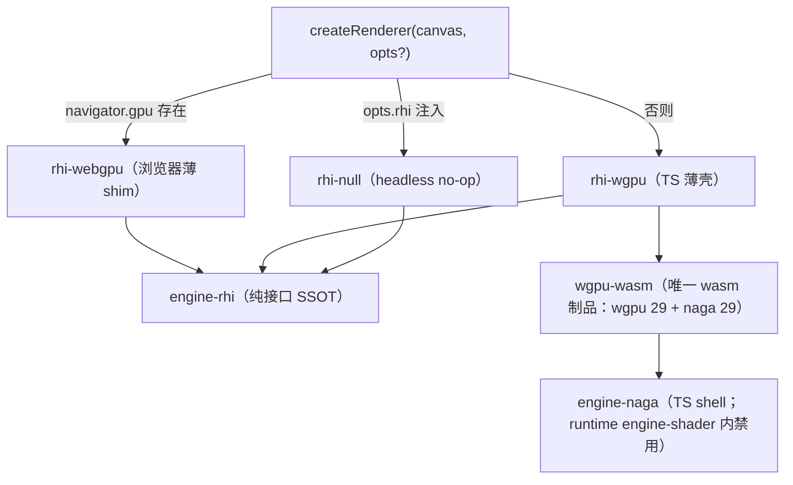

# forgeax-engine-rhi

> 基线: [`5c8c90f1`](../../commit/5c8c90f1) (2026-06-03) · 同步至: feat-20260629-multi-uv-set-support M7（vertex layout 别名机制 + clamp-to-last 绑定 + deriveVertexBufferLayout 派生规则）

> **RHI 是引擎与 GPU 之间的纯接口腰线，大多数 AI 用户不直接碰它**——可见性走 [`forgeax-engine-material`](../forgeax-engine-material/SKILL.md)，pass / 后处理走 [`forgeax-engine-render-pipeline`](../forgeax-engine-render-pipeline/SKILL.md)。本 skill 面向**贡献者 / 进阶**：理解后端如何被抽象、能力如何门控、多实现如何共存。`@forgeax/engine-rhi` 是 spec-aligned 纯接口（无运行时值）；浏览器侧 `rhi-webgpu` 薄 shim 包 WebGPU，非浏览器侧 `rhi-wgpu` 是 TS 薄壳套 `wgpu-wasm`（唯一 wasm 制品 SSOT，~1.17 MB gzip，wgpu 29 + naga 29 + naga_oil Composer）。`createRenderer(canvas)` 经 `navigator.gpu` 在两者间自动选。第 3 个后端 `rhi-null`（headless no-op，`feat-20260623-dummy-null-rhi-headless-backend`）不进自动选——通过 Channel 1 escape hatch 手动注入 `createRenderer(canvas, { rhi: rhiNull })`，供 `test:unit` 做命令流结构断言。

## 心智模型

RHI 的四条铁律塑造它的形态（AGENTS.md §RHI form rules 是 SSOT）：

- **spec-aligned**：descriptor 字段与 `@webgpu/types`（`^0.1.70`）逐字节对齐，`'x' in src` 区分"缺字段"与"显式 undefined"——你照 WebGPU 规范写就对。
- **opaque handle**：14 个资源句柄全是 brand-only 的 `Id<T>`（无运行时值）；想访问句柄内部的裸 GPU 字段 = tsc 编译期 red signal。句柄靠模块路径区分（`engine-rhi` 的 `Buffer` vs `@webgpu/types` 的 `GPUBuffer`）。
- **math-free**：`engine-rhi` 只收 POD + `ArrayBuffer` / `Float32Array`，不依赖 `engine-math`。
- **dual-impl ship-together**：`rhi-webgpu` 与 `rhi-wgpu` 永远一起发；`createRenderer` 在运行时按 `navigator.gpu` 是否存在选浏览器 / 原生路径，AI 用户不手选后端。

能力（wgpu native features）经 `device.caps.X` 门控——`caps` 是 `RhiCaps`（15 字段：`backendKind` + 14 个布尔能力位，含 `rgba16floatRenderable` / `rg11b10ufloatRenderable` / `float32Filterable` 等 HDR/可过滤寻址位）。用前查 cap，别假定特性都在。

## 核心 API 速查

| 名字 | 来源包 | 形态 | 用途 |
|:--|:--|:--|:--|
| `createRenderer(canvas, ...)` | runtime | `async fn` | 引擎入口；经 `navigator.gpu` 自动选 RHI 后端 |
| `device.caps` | rhi | `RhiCaps`（15 字段） | 能力门控读取点；含 `backendKind` 四成员判后端 |
| `RhiCaps.backendKind` | rhi | `'webgpu' \| 'wgpu-native' \| 'wgpu-webgl2' \| 'null'` | 区分当前跑在哪条实现路径 |
| 14 opaque handles | rhi | brand-only `Id<T>`（如 `Buffer` / `Texture`） | 资源句柄；裸 GPU 字段访问 = tsc red |
| 9 descriptors | rhi | `Pick<GPUXxxDescriptor, ...>` + `ExplicitUndefined<>` | 与 `@webgpu/types` 对齐的创建参数 |
| `RhiErrorCode` | rhi | 闭集 union（20 成员，勿抄） | 结构化失败码；`switch` 穷尽无 default |

> [!IMPORTANT]
> 14 句柄 / 7 接口 / 9 descriptor 的**完整名单与签名不在此**——见 `packages/rhi/README.md`。`RhiErrorCode` 的 20 个成员是 `packages/rhi/src/errors.ts` 的 SSOT，**勿抄进 skill**。消费者 tsconfig 的 `compilerOptions.types` 必须含 `"@webgpu/types"`。

## 后端选择与依赖链



## idiom 代码骨架

```ts
import { createRenderer } from '@forgeax/engine-runtime';

const renderer = await createRenderer(canvas);
await renderer.ready;

// capability-gated: read device.caps before assuming a native feature is present
const device = renderer.device;
if (device !== null) {
  const caps = device.caps;
  if (caps.backendKind === 'wgpu-native') {
    // native-only path; webgpu / wgpu-webgl2 / null take the portable branch
  }
  if (caps.rgba16floatRenderable) {
    // HDR render-target path available (IBL cubemap, HDR post-processing)
  }
}
```

> 绝大多数 AI 用户到 `createRenderer` 为止——其后是 [`forgeax-engine-material`](../forgeax-engine-material/SKILL.md) / [`forgeax-engine-render-pipeline`](../forgeax-engine-render-pipeline/SKILL.md)。直接调 RHI 接口创建 buffer / texture 仅在贡献后端或写自定义 pass 时需要。

## RhiNull — headless no-op 后端（`'null'`）

`@forgeax/engine-rhi-null`（`feat-20260623-dummy-null-rhi-headless-backend`）是第 3 个 RHI 后端：headless no-op，零 GPU/DOM 依赖，专供 `test:unit` 做命令流结构断言。不走 `navigator.gpu` 自动选，而是通过 Channel 1 escape hatch 手动注入：

```ts
import type { RhiNullDevice } from '@forgeax/engine-rhi-null';
import { rhi } from '@forgeax/engine-rhi-null';
import { createRenderer } from '@forgeax/engine-runtime';

// canvas is a required positional param; RhiNull never touches the DOM, so a
// minimal stub suffices in headless CI (no `undefined` — it won't typecheck).
const canvas = { width: 1, height: 1 } as unknown as HTMLCanvasElement;
const renderer = await createRenderer(canvas, { rhi });
await renderer.ready; // resolves ok — createShaderModule skips WGSL compilation
renderer.draw(world);  // no-op execution, command-stream ledger populated

// Read back command-stream shape for assertions. renderer.device is typed
// RhiDevice (spec surface); cast to RhiNullDevice for the ledger + counters.
const device = renderer.device as unknown as RhiNullDevice;
console.log(renderer.perFramePassNames);      // type-safe pass order, no cast
console.log(device.totalDrawCount);           // >= 1 after draw
console.log(device.framePassNames);           // same data on the cast device
console.log(device.totalBindGroupCount);      // bind-group assembly count
```

### 关键语义

- **`backendKind: 'null'`** —— `RhiCaps.backendKind` 的 4th union member，表示"无真 GPU，结构记账"。graph barrier 归入 `webgpu` / `wgpu-webgl2` 等同组（不插 barrier）。
- **caps 全 true 除 3 reserved** —— `multiDrawIndirect` / `pushConstants` / `textureBindingArray` 为 `false`（`@reserved-for-wgpu-native-only`）；其余 boolean caps 全 `true`，`maxColorAttachments = 8`。最大化能力路径的结构覆盖。
- **createShaderModule 跳编译** —— 不调 WebGPU shader compiler，直接返 legal `ShaderModule` brand。`renderer.ready` 的 shader step 不 reject。
- **handle 记账** —— 每个 `create*` 返回的 brand 在 per-device `Bookkeeper` 中注册；`setVertexBuffer` / `setBindGroup` 做跨设备 + 二次 destroy 校验，返回结构化 err（复用 `'rhi-not-available'` / `'destroy-after-destroy'` 既有码，零新增）。
- **不产像素** —— `getCurrentTexture` 返回 brand 但无真 GPU 纹理数据。RhiNull 是结构层，不可替换 smoke / dawn e2e 的 pixel readback。
- **per-renderer 实例独立** —— 每次 `createRenderer({ rhi })` 创建独立 `RhiNullDevice` + `Bookkeeper`，互不污染。

完整 API 层、caps 表、bookkeeping 行为、与 vitest mock 的区分见 `packages/rhi-null/README.md`。

## Vertex layout 别名机制 -- 多套 UV clamp-to-last 的 RHI 层基石（feat-20260629）

> [!IMPORTANT]
> **一句话价值：** WebGPU spec 允许 vertex buffer layout 的多个 `attribute` 共享同一 buffer offset（同 offset、异 `shaderLocation`）——这是 forgeax 实现 clamp-to-last 的 **RHI 层基石**。引擎在真实 draw 路径产出别名 layout：mesh 有 n 套 UV、shader 声明 m>n 套时，超界 location `[n,m)` 所有 attribute 全部指向第 `n-1` 套 UV 的 buffer offset。

### WebGPU spec 行为

`ValidateVertexAttribute`（Dawn specification）对 vertex attribute 无 byte-range overlap check——多 attribute 共享 offset 是合法且「有意为之」的规范设计。唯一硬约束是别名 attribute 须异 `shaderLocation`（与 clamp-to-last「每套 UV 独立 @location」天然吻合）。`setBindGroup` 有 overlap check，但 vertex attribute 路径无此约束——这是 forgeax D-1 决策的 spec 层面依据。

```ts
// 合法：2 个 vertex attribute 共享同一 buffer offset
{
  arrayStride: 80,
  attributes: [
    { shaderLocation: 6, offset: 72, format: 'float32x2' },  // uv1（真实数据）
    { shaderLocation: 7, offset: 72, format: 'float32x2' },  // uv2（别名到 uv1，同 offset）
    { shaderLocation: 8, offset: 72, format: 'float32x2' },  // uv3（别名到 uv1，同 offset）
  ]
}
```

> **单流兼容**：现有路径全部走 `setVertexBuffer(0, ...)` 单流 interleaved——别名 attribute 全在 buffer 0，无 multi-slot 兼容张力。

### clamp-to-last 绑定表（`deriveVertexBufferLayout` 产出）

| mesh UV 套数 n | shader 声明 m | 绑定行为 |
|:--|:--|:--|
| n > 0, m <= n | 一一绑定 | shader index `0..m-1` 各绑实际 offset |
| n > 0, m > n | clamp-to-last | `0..n-1` 绑实际 offset；`[n,m)` 全部 shaderLocation 指向第 `n-1` 套的 offset（**同 offset、异 shaderLocation**） |
| n = 0 | 全 0 buffer | 分配 8 字节 `[0,0,0,0]` 全 0 默认 buffer，所有 UV location 均指向 offset=0 |

> **全部静默，无 warn / 无 error**（用户拍板对齐 UE 语义）。PSO 构建走全组合路径（mesh n∈{0..8} × shader m∈{1..8}）全部成功——`unsupported-vertex-layout` 不触发。

### deriveVertexBufferLayout 派生规则

`deriveVertexBufferLayout(map, { shaderUvSetCount? })` 是 vertex layout 的**唯一派生入口**（SSOT）：

1. **Canonical keys 顺序**：`position / normal / uv / tangent / skinIndex / skinWeight / uv1 / uv2 / uv3 / uv4 / uv5 / uv6 / uv7` —— offset 累加沿此固定顺序
2. **Per-key 路径复用**：每个 key 经 `ATTRIBUTE_FORMAT_MAP`（format）+ `ATTRIBUTE_BYTE_STRIDE`（byte size）确定 format + byte len；`CANONICAL_KEYS.indexOf(key)` 得 `shaderLocation`
3. **UV 计数**：`countMeshUvSets(map)` 从 `UV_KEYS` 数组反向扫描，遇 undefined 即停——mesh 实有套数 n = 最后一个非 undefined UV key 的 index+1
4. **Alias 生成**：当 `shaderUvSetCount > meshUvSetCount` 时，`emitAliasEntries` 对 `[n, m)` 范围内的每个 UV key 推一条 entry：`shaderLocation = CANONICAL_KEYS.indexOf(uvKey)`、`offset = aliasOffset`（第 n-1 套的已有 offset）、format 与 UV 一致
5. **n=0 特殊**：当 `fromIndex=0`（mesh 无任何 UV），追加 8 字节 stride + location(0) 的空 UV entry（buffer 内容为全 0 `vec2f`）

> **`@location(0..5)` offset 零变化**：`position=0 / normal=12 / uv=24 / tangent=32 / skinIndex=48 / skinWeight=56` —— uv1..uv7 在 skinWeight 之后 `72/80/...`。与 glTF bridge、FBX to-asset-pack 的 interleaved 写入顺序（canonical interleaved = pos/normal/uv/tangent/skinIndex/skinWeight/uv1..uv7）三处统一。

### PSO cache key 复用（零新增变体轴）

`cacheKeyOf` 已含 vertexLayout 形状哈希（sorted keys + byteLength）——多套 UV 体现为 `VertexAttributeMap` 新增 key（`uv1..uv7`），自然进 sorted-keys 哈希区分不同 UV 套数 layout 的 PSO。**不新建变体轴、不引入显式 uvSetCount 字段进 cache key**（D-5）。

### 与 RhiNull 的协作

RhiNull 后端（headless no-op）对 vertex buffer layout 不做真 GPU 绑定——`setVertexBuffer` 仅记账 buffer brand，不验证 stride / attribute 合法性。`deriveVertexBufferLayout` 的别名 entry 在 RhiNull 路径下照常产出，结构断言可利用 `RhiNullDevice` 的 command ledger 验证 layout 形状。

## Video capability -- 通用 / 高性能双路径

视频帧上传到 GPU texture 有两条潜在路径：**通用路径**（`copyExternalImageToTexture`）和**高性能路径**（`GPUExternalTexture` + `texture_external` WGSL 采样）。当前引擎**通用路径已全做**——`copyExternalImageToTexture` 是 RHI `GPUQueue` 的既有方法，双后端（webgpu / wgpu-native）语义一致，零 RHI 新增。高性能路径**仅保留显式探测分支**（代码可见、可 grep 命中），但引擎还未暴露 `importExternalTexture` 入口（OOS-5，后续 feat 填）。

两条路径的 capability 判定由 `@forgeax/engine-runtime` 的 `probeVideoHighPerfUpload` 完成（每帧 record 阶段调用）——不是 RHI 层的附加 API，而是基于既有 `RhiCaps.backendKind` 的运行时判定。RHI 层**不变**——只消费既有 `copyExternalImageToTexture` 接口：

```ts
// RhiCaps.backendKind is the capability probe anchor:
//   'webgpu'      -> general copyExternalImageToTexture available (browser)
//   'wgpu-native' -> general copyExternalImageToTexture available (native)
//   'wgpu-webgl2' -> copyExternalImageToTexture MAY be absent (WebGL2 subset)
//
// GPUExternalTexture high-perf path requires BOTH 'webgpu' backend AND an
// importExternalTexture RHI entry (absent today, OOS-5 — always false).
```

### cap 双缺 — 结构化失败 `video-upload-unsupported`

当两条上传路径都不可用时（如 dawn-node 无 host `HTMLVideoElement` + 高性能路径未实现），引擎在真实的每帧 record 上传路径上 `errorRegistry.fire(VideoUploadUnsupportedError)`——没有旁路的独立"video 系统"，失败信号与上传走同一条 `renderer.draw` 路径（单一 video 路径）。AI 用户在 `renderer.onError` 回调里消费：

```ts
renderer.onError((err) => {
  // err.code is a member of the closed RuntimeErrorCode union; switch exhaustively.
  if (err.code === 'video-upload-unsupported') {
    //   .code === 'video-upload-unsupported'
    //   .hint  — actionable recovery (static texture / switch backend)
    // Consume via property access, NOT string parsing (charter P3)
  }
});
```

`'video-upload-unsupported'` 是 `RuntimeErrorCode` 闭合联合的 add-only minor 成员（`packages/runtime/src/errors.ts`），AI 用户通过 `switch (err.code)` 穷尽消费。

### 能力边界

| 边界 | 说明 |
|:--|:--|
| **dawn-node 不渲染视频** | dawn 环境无 `HTMLVideoElement` / `VideoFrame`；通用路径的 `copyExternalImageToTexture` 存在但调用链无源 element。像素验收只能走 browser e2e |
| **高性能路径未实现** | `GPUExternalTexture` 零拷贝路径保留显式探测分支（代码可见、grep 命中），但分支主体为"回退通用路径"——不落 RHI 方法、不新增 `texture_external` MaterialParamType、不写 WGSL 外部采样 |
| **通用路径双后端语义一致** | `copyExternalImageToTexture` 在 webgpu 与 wgpu-native 行为一致——视频帧经此上传为普通 `texture_2d`，shader 正常采样，material BGL 无变更 |
| **无声轨** | RHI 层不处理视频音轨；声音归后续 feat |

## 资源释放 — destroyBuffer / destroyTexture

与 `createBuffer` / `createTexture` 对偶的 release-side API。RHI 暴露 `RhiDevice.destroyBuffer(buf)` / `destroyTexture(tex)`（`feat-20260612-rhi-destroy-renderer-dispose-gpu-lifecycle` 引入），双 backend 行为对称。

### 快乐路径

```ts
const device = renderer.device;
const buf = device.createBuffer({ size: 64, usage: GPUBufferUsage.UNIFORM });
// ... use buf in renders ...
const result = device.destroyBuffer(buf);
// result.ok === true — resource marked destroyed
```

AI 用户在 IDE 上 `RhiDevice.` autocomplete 看到 `createBuffer` / `destroyBuffer` 对偶出现（charter F1 单入口可索引），无需读文档即知释放路径。

### API 签名与错误码

| 方法 | 签名 | 返回 |
|:--|:--|:--|
| `RhiDevice.destroyBuffer` | `(buf: Buffer) => Result<void, RhiError>` | 正常返回 `ok(undefined)` |
| `RhiDevice.destroyTexture` | `(tex: Texture) => Result<void, RhiError>` | 同上 |

二次 destroy 同一资源返回 fail-fast：

```ts
const r1 = device.destroyBuffer(buf); // ok
const r2 = device.destroyBuffer(buf);
// r2.ok === false
switch (r2.error.code) {
  case 'destroy-after-destroy':
    // AI user self-detects "I already released this"
    // hint: "object already destroyed; track lifecycle in caller or check isDestroyed before re-destroy"
    break;
}
```

`'destroy-after-destroy'` 是 `RhiErrorCode` 闭并集的第 19 个成员（add-only minor，不破坏已有 switch）。双 backend（`rhi-webgpu` / `rhi-wgpu`）行为完全一致：状态簿记在 RHI shim 层，不依赖 wasm boundary。

`'rhi-descriptor-invalid'` 是 `RhiErrorCode` 闭并集的第 20 个成员（add-only minor，不破坏已有 switch）。判别口径：

- **`'rhi-descriptor-invalid'`** = descriptor 解析失败 = 调用方 bug（传入了畸形 descriptor 数据）。wgpu-wasm Rust 端 `#[wasm_bindgen(catch)]` 以稳定前缀 `[wgpu-wasm] failed to parse` 返 `Err`，TS `wrap()` 层据此前缀归类。
- **`'webgpu-runtime-error'`** = 合法 descriptor 被 wgpu 运行时拒（如 binding 数超限）= 运行时条件，非调用方 descriptor 数据问题。

`.hint` 携带出错字段索引（如 `fragment.targets[0]`）供人类定位，`.code` 供 AI 用户 exhaustive switch。SSOT：`packages/rhi/src/errors.ts`。

### runtime 层 GpuResource

`@forgeax/engine-runtime` 暴露并行类型 `GpuBuffer` / `GpuTexture`，合并别名 `type GpuResource = GpuBuffer | GpuTexture`。每个 wrapper 持 boolean `isDestroyed` getter + `destroy(): Result<void, RhiError>` 方法，内部转发到 RHI 的 `destroyBuffer` / `destroyTexture`。二次 destroy 同 fail-fast 语义。

`Renderer.dispose()` 经此 wrapper 显式 walk 释放全部 GPU 资源（gpuStore.destroyAll → graph.drain → instanceBuffers clear → IBL cache.clear → context.unconfigure → listenerRegistry.clear）；二次 dispose idempotent。`createApp().stop()` 串接 `renderer.dispose()`。

### Caveat: chromium adapter pool 中毒

> [!CAUTION]
> **`device.destroy()` 不可在公共路径调用。** chromium 的 adapter pool 在 `GPUDevice.destroy()` 后无法重新获取 adapter（详见 `createRenderer.ts:1725-1738` 注释 + w23/w25/w26 历史）。本 feat 只加资源级 `destroyBuffer` / `destroyTexture`，不暴露 `destroyDevice` 公共契约。需要访问裸 `GPUDevice.destroy()` 的路径仍走既有 `_internal_getRawDevice(device)` escape hatch（OOS-1）。

GpuResource v1 是单 owner immortal 模型：有且仅有一个所有者负责 destroy；不引入 refcount / 共享所有权。

## 踩坑

- **想读句柄里的裸 GPU 对象**：句柄是 brand-only，没有运行时值——访问内部 GPU 字段是 tsc 编译期错误，不是运行时 bug。要操作底层资源走 RHI 接口的方法，而非穿透句柄。
- **假定某 native feature 一定在**：不同 `backendKind` 能力不同；`wgpu-webgl2` / `webgpu` 缺的 native feature 在 `wgpu-native` 才有。先 `device.caps.X` 门控。
- **tsconfig 缺 `@webgpu/types`**：descriptor 类型对齐依赖它；消费者 `compilerOptions.types` 不含 `"@webgpu/types"` 会满屏类型错。
- **在 runtime `engine-shader` 里 import `engine-naga`**：物理隔离的 3 道 grep gate（triple-grep gate）会拦——naga 只在 build-time 的 shader-compiler 链路出现，runtime 侧禁用。
- **二次 destroy 同一个 buffer / texture**：返回 `err.code === 'destroy-after-destroy'` 而非 OK——这是 fail-fast 设计（不是 bug）。在调用方用 `switch (err.code)` 走 `'destroy-after-destroy'` 分支即可自检"已释放过"。若期望 idempotent OK 语义，在调用前检查 `GpuResource.isDestroyed`（runtime 层 wrapper）。
- **想调 `device.destroy()` 释放整个设备**：不可在公共路径调用（chromium adapter pool 中毒）。只加资源级 `destroyBuffer` / `destroyTexture`；需要裸 `GPUDevice.destroy()` 走 `_internal_getRawDevice(device)` escape hatch。
- **wgpu-wasm Channel 3（WebKit/headless chromium）上 submit 后静默黑屏 / GPU 死**：旧代码 `RhiWgpuQueue::submit` 返回 `()` 不标 `#[wasm_bindgen(catch)]`，且 wgpu backend 的 submit 校验 error 走 error-sink 对 JS 侧不可见——相当于 submit 失败被静默吞掉、GPU 死透。已修（bug-20260622 R5 M4）：Rust 侧 `device.on_uncaptured_error` 全局回调接收 error-sink 投递并写入 per-queue last-error 槽位；`submit()` 标 `#[wasm_bindgen(catch)]` 改返回 `Result`，调用后同步读取 + 清空槽位，命中则以 `[rhi-code:<code>]` 前缀抛回 JS。TS shim `queue.ts` 按前缀路由到 `queueSubmitFailed` / `webgpuRuntimeError`（复用既有 `RhiErrorCode` 闭合联合成员，零新增）。**行为变化**：submit 期校验错误从「panic(GPU 死)」改为「经 onError 返回 RhiError(实例存活)」，下一帧 submit 正常。

## 深入

- 14 opaque handles / 7 interfaces / 9 descriptors 完整表 + `ExplicitUndefined<>` 桥接：见 `packages/rhi/README.md` §14 opaque handles / §9 descriptors
- `RhiErrorCode` 20 成员闭集（**勿抄**，SSOT）：`packages/rhi/src/errors.ts`
- Capability tri-layer / `RhiCaps` 字段索引（SSOT 15 字段：`backendKind` + 14 bool）：见 `packages/rhi/README.md` §Capabilities + `packages/rhi/src/index.ts` `interface RhiCaps`
- RHI form rules（spec-aligned / opaque / math-free / dual-impl / single-wasm / naming）：AGENTS.md §RHI form rules
- 双实现与 wasm SSOT：源码 `packages/rhi-webgpu/src/` · `packages/rhi-wgpu/src/` · `packages/wgpu-wasm/`（Rust crate，build 见 `CONTRIBUTING.md` §Rust toolchain）
- headless no-op 后端（`'null'`，`feat-20260623-dummy-null-rhi-headless-backend`）：见 `packages/rhi-null/README.md`（API / caps 表 / bookkeeping / 边界 / 与 vitest mock 区分）；源码 `packages/rhi-null/src/`（Device / Queue / Adapter / CommandEncoder / PassEncoders / CanvasContext / Shader / Bookkeeping）
- 声明式 render-graph（RHI-pure 上层）：见 [`forgeax-engine-render-pipeline`](../forgeax-engine-render-pipeline/SKILL.md)；`RenderGraphErrorCode`（5 成员，勿抄）`packages/render-graph/src/errors.ts`
- `createBindGroupLayout` 接收的 `entries` 长度可变——material `@group(1)` BGL 的条目形状由各 shader 的 `paramSchema` 在 runtime 上游派生（`derive(paramSchema)`，feat-20260621），RHI 这层只是按已组装好的 descriptor 建层，不感知材质语义。派生规则 + sampler-first 排布见 [`forgeax-engine-shader`](../forgeax-engine-shader/SKILL.md) §内置绑定约定
- 渲染 / RHI 实战排查：见 [`forgeax-engine-debug`](../forgeax-engine-debug/SKILL.md)
