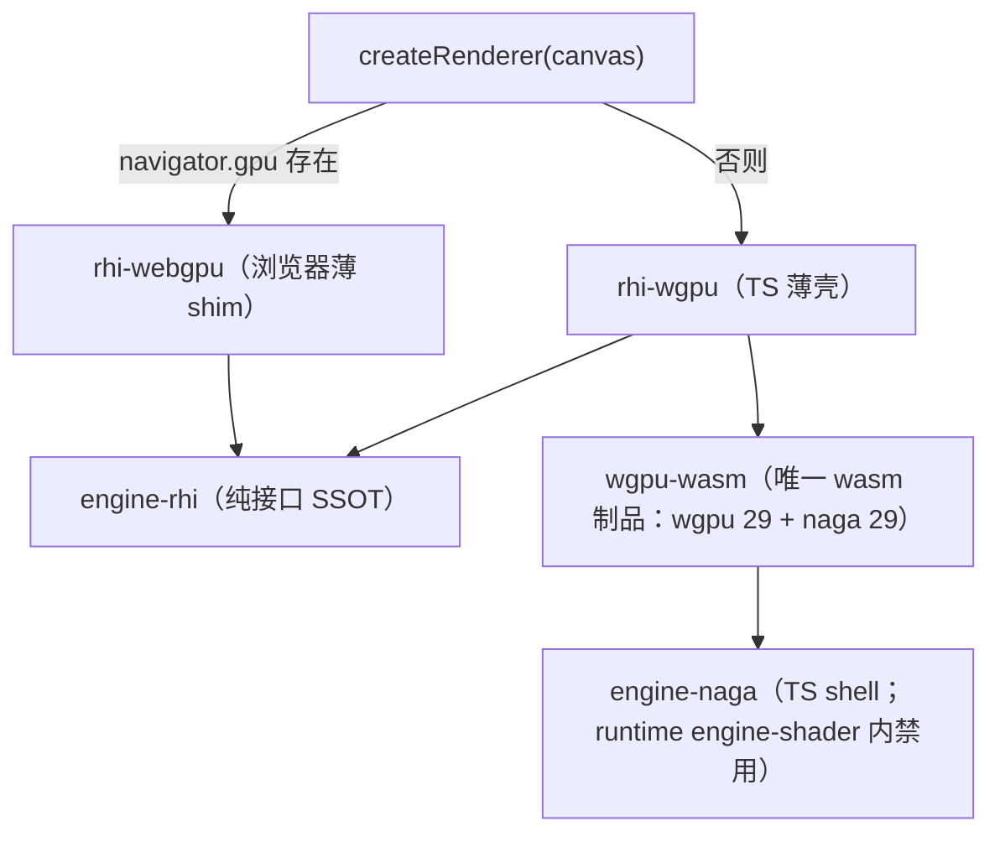

# forgeax-engine-rhi

> 基线: [`5c8c90f1`](../../commit/5c8c90f1) (2026-06-03) · 同步至: [`358592eb`](../../commit/358592eb) (2026-06-09)

> **RHI 是引擎与 GPU 之间的纯接口腰线，大多数 AI 用户不直接碰它**——可见性走 [`forgeax-engine-material`](../forgeax-engine-material/SKILL.md)，pass / 后处理走 [`forgeax-engine-render-pipeline`](../forgeax-engine-render-pipeline/SKILL.md)。本 skill 面向**贡献者 / 进阶**：理解后端如何被抽象、能力如何门控、双实现如何同发。`@forgeax/engine-rhi` 是 spec-aligned 纯接口（无运行时值）；浏览器侧 `rhi-webgpu` 薄 shim 包 WebGPU，非浏览器侧 `rhi-wgpu` 是 TS 薄壳套 `wgpu-wasm`（唯一 wasm 制品 SSOT，~1.17 MB gzip，wgpu 29 + naga 29 + naga_oil Composer）。`createRenderer(canvas)` 经 `navigator.gpu` 在两者间自动选。

## 心智模型

RHI 的四条铁律塑造它的形态（AGENTS.md §RHI form rules 是 SSOT）：

- **spec-aligned**：descriptor 字段与 `@webgpu/types`（`^0.1.70`）逐字节对齐，`'x' in src` 区分"缺字段"与"显式 undefined"——你照 WebGPU 规范写就对。
- **opaque handle**：14 个资源句柄全是 brand-only 的 `Id<T>`（无运行时值）；想访问句柄内部的裸 GPU 字段 = tsc 编译期 red signal。句柄靠模块路径区分（`engine-rhi` 的 `Buffer` vs `@webgpu/types` 的 `GPUBuffer`）。
- **math-free**：`engine-rhi` 只收 POD + `ArrayBuffer` / `Float32Array`，不依赖 `engine-math`。
- **dual-impl ship-together**：`rhi-webgpu` 与 `rhi-wgpu` 永远一起发；`createRenderer` 在运行时按 `navigator.gpu` 是否存在选浏览器 / 原生路径，AI 用户不手选后端。

能力（wgpu native features）经 `device.caps.X` 门控——`caps` 是 `RhiCaps`（15 字段：`backendKind` + 14 个布尔能力位，含 `rgba16floatRenderable` / `rg11b10ufloatRenderable` / `float32Filterable` 等 HDR/可过滤寻址位）。用前查 cap，别假定特性都在。

## 核心 API 速查

| 名字 | 来源包 | 形态 | 用途 |
|:--|:--|:--|:--|
| `createRenderer(canvas, ...)` | runtime | `async fn` | 引擎入口；经 `navigator.gpu` 自动选 RHI 后端 |
| `device.caps` | rhi | `RhiCaps`（15 字段） | 能力门控读取点；含 `backendKind` 三成员判后端 |
| `RhiCaps.backendKind` | rhi | `'webgpu' \| 'wgpu-native' \| 'wgpu-webgl2'` | 区分当前跑在哪条实现路径 |
| 14 opaque handles | rhi | brand-only `Id<T>`（如 `Buffer` / `Texture`） | 资源句柄；裸 GPU 字段访问 = tsc red |
| 9 descriptors | rhi | `Pick<GPUXxxDescriptor, ...>` + `ExplicitUndefined<>` | 与 `@webgpu/types` 对齐的创建参数 |
| `RhiErrorCode` | rhi | 闭集 union（20 成员，勿抄） | 结构化失败码；`switch` 穷尽无 default |

> [!IMPORTANT]
> 14 句柄 / 7 接口 / 9 descriptor 的**完整名单与签名不在此**——见 `packages/rhi/README.md`。`RhiErrorCode` 的 20 个成员是 `packages/rhi/src/errors.ts` 的 SSOT，**勿抄进 skill**。消费者 tsconfig 的 `compilerOptions.types` 必须含 `"@webgpu/types"`。

## 后端选择与依赖链



## idiom 代码骨架

```ts
import { createRenderer } from '@forgeax/engine-runtime';

const renderer = await createRenderer(canvas);
await renderer.ready;

// capability-gated: read device.caps before assuming a native feature is present
const device = renderer.device;
if (device !== null) {
  const caps = device.caps;
  if (caps.backendKind === 'wgpu-native') {
    // native-only path; webgpu / wgpu-webgl2 take the portable branch
  }
  if (caps.rgba16floatRenderable) {
    // HDR render-target path available (IBL cubemap, HDR post-processing)
  }
}
```

> 绝大多数 AI 用户到 `createRenderer` 为止——其后是 [`forgeax-engine-material`](../forgeax-engine-material/SKILL.md) / [`forgeax-engine-render-pipeline`](../forgeax-engine-render-pipeline/SKILL.md)。直接调 RHI 接口创建 buffer / texture 仅在贡献后端或写自定义 pass 时需要。

## 资源释放 — destroyBuffer / destroyTexture

与 `createBuffer` / `createTexture` 对偶的 release-side API。RHI 暴露 `RhiDevice.destroyBuffer(buf)` / `destroyTexture(tex)`（`feat-20260612-rhi-destroy-renderer-dispose-gpu-lifecycle` 引入），双 backend 行为对称。

### 快乐路径

```ts
const device = renderer.device;
const buf = device.createBuffer({ size: 64, usage: GPUBufferUsage.UNIFORM });
// ... use buf in renders ...
const result = device.destroyBuffer(buf);
// result.ok === true — resource marked destroyed
```

AI 用户在 IDE 上 `RhiDevice.` autocomplete 看到 `createBuffer` / `destroyBuffer` 对偶出现（charter F1 单入口可索引），无需读文档即知释放路径。

### API 签名与错误码

| 方法 | 签名 | 返回 |
|:--|:--|:--|
| `RhiDevice.destroyBuffer` | `(buf: Buffer) => Result<void, RhiError>` | 正常返回 `ok(undefined)` |
| `RhiDevice.destroyTexture` | `(tex: Texture) => Result<void, RhiError>` | 同上 |

二次 destroy 同一资源返回 fail-fast：

```ts
const r1 = device.destroyBuffer(buf); // ok
const r2 = device.destroyBuffer(buf);
// r2.ok === false
switch (r2.error.code) {
  case 'destroy-after-destroy':
    // AI user self-detects "I already released this"
    // hint: "object already destroyed; track lifecycle in caller or check isDestroyed before re-destroy"
    break;
}
```

`'destroy-after-destroy'` 是 `RhiErrorCode` 闭并集的第 19 个成员（add-only minor，不破坏已有 switch）。双 backend（`rhi-webgpu` / `rhi-wgpu`）行为完全一致：状态簿记在 RHI shim 层，不依赖 wasm boundary。

`'rhi-descriptor-invalid'` 是 `RhiErrorCode` 闭并集的第 20 个成员（add-only minor，不破坏已有 switch）。判别口径：

- **`'rhi-descriptor-invalid'`** = descriptor 解析失败 = 调用方 bug（传入了畸形 descriptor 数据）。wgpu-wasm Rust 端 `#[wasm_bindgen(catch)]` 以稳定前缀 `[wgpu-wasm] failed to parse` 返 `Err`，TS `wrap()` 层据此前缀归类。
- **`'webgpu-runtime-error'`** = 合法 descriptor 被 wgpu 运行时拒（如 binding 数超限）= 运行时条件，非调用方 descriptor 数据问题。

`.hint` 携带出错字段索引（如 `fragment.targets[0]`）供人类定位，`.code` 供 AI 用户 exhaustive switch。SSOT：`packages/rhi/src/errors.ts`。

### runtime 层 GpuResource

`@forgeax/engine-runtime` 暴露并行类型 `GpuBuffer` / `GpuTexture`，合并别名 `type GpuResource = GpuBuffer | GpuTexture`。每个 wrapper 持 boolean `isDestroyed` getter + `destroy(): Result<void, RhiError>` 方法，内部转发到 RHI 的 `destroyBuffer` / `destroyTexture`。二次 destroy 同 fail-fast 语义。

`Renderer.dispose()` 经此 wrapper 显式 walk 释放全部 GPU 资源（gpuStore.destroyAll → graph.drain → instanceBuffers clear → IBL cache.clear → context.unconfigure → listenerRegistry.clear）；二次 dispose idempotent。`createApp().stop()` 串接 `renderer.dispose()`。

### Caveat: chromium adapter pool 中毒

> [!CAUTION]
> **`device.destroy()` 不可在公共路径调用。** chromium 的 adapter pool 在 `GPUDevice.destroy()` 后无法重新获取 adapter（详见 `createRenderer.ts:1725-1738` 注释 + w23/w25/w26 历史）。本 feat 只加资源级 `destroyBuffer` / `destroyTexture`，不暴露 `destroyDevice` 公共契约。需要访问裸 `GPUDevice.destroy()` 的路径仍走既有 `_internal_getRawDevice(device)` escape hatch（OOS-1）。

GpuResource v1 是单 owner immortal 模型：有且仅有一个所有者负责 destroy；不引入 refcount / 共享所有权。

## 踩坑

- **想读句柄里的裸 GPU 对象**：句柄是 brand-only，没有运行时值——访问内部 GPU 字段是 tsc 编译期错误，不是运行时 bug。要操作底层资源走 RHI 接口的方法，而非穿透句柄。
- **假定某 native feature 一定在**：不同 `backendKind` 能力不同；`wgpu-webgl2` / `webgpu` 缺的 native feature 在 `wgpu-native` 才有。先 `device.caps.X` 门控。
- **tsconfig 缺 `@webgpu/types`**：descriptor 类型对齐依赖它；消费者 `compilerOptions.types` 不含 `"@webgpu/types"` 会满屏类型错。
- **在 runtime `engine-shader` 里 import `engine-naga`**：物理隔离的 3 道 grep gate（triple-grep gate）会拦——naga 只在 build-time 的 shader-compiler 链路出现，runtime 侧禁用。
- **二次 destroy 同一个 buffer / texture**：返回 `err.code === 'destroy-after-destroy'` 而非 OK——这是 fail-fast 设计（不是 bug）。在调用方用 `switch (err.code)` 走 `'destroy-after-destroy'` 分支即可自检"已释放过"。若期望 idempotent OK 语义，在调用前检查 `GpuResource.isDestroyed`（runtime 层 wrapper）。
- **想调 `device.destroy()` 释放整个设备**：不可在公共路径调用（chromium adapter pool 中毒）。只加资源级 `destroyBuffer` / `destroyTexture`；需要裸 `GPUDevice.destroy()` 走 `_internal_getRawDevice(device)` escape hatch。

## 深入

- 14 opaque handles / 7 interfaces / 9 descriptors 完整表 + `ExplicitUndefined<>` 桥接：见 `packages/rhi/README.md` §14 opaque handles / §9 descriptors
- `RhiErrorCode` 20 成员闭集（**勿抄**，SSOT）：`packages/rhi/src/errors.ts`
- Capability tri-layer / `RhiCaps` 字段索引（SSOT 15 字段：`backendKind` + 14 bool）：见 `packages/rhi/README.md` §Capabilities + `packages/rhi/src/index.ts` `interface RhiCaps`
- RHI form rules（spec-aligned / opaque / math-free / dual-impl / single-wasm / naming）：AGENTS.md §RHI form rules
- 双实现与 wasm SSOT：源码 `packages/rhi-webgpu/src/` · `packages/rhi-wgpu/src/` · `packages/wgpu-wasm/`（Rust crate，build 见 `CONTRIBUTING.md` §Rust toolchain）
- 声明式 render-graph（RHI-pure 上层）：见 [`forgeax-engine-render-pipeline`](../forgeax-engine-render-pipeline/SKILL.md)；`RenderGraphErrorCode`（5 成员，勿抄）`packages/render-graph/src/errors.ts`
- `createBindGroupLayout` 接收的 `entries` 长度可变——material `@group(1)` BGL 的条目形状由各 shader 的 `paramSchema` 在 runtime 上游派生（`derive(paramSchema)`，feat-20260621），RHI 这层只是按已组装好的 descriptor 建层，不感知材质语义。派生规则 + sampler-first 排布见 [`forgeax-engine-shader`](../forgeax-engine-shader/SKILL.md) §内置绑定约定
- 渲染 / RHI 实战排查：见 [`forgeax-engine-debug`](../forgeax-engine-debug/SKILL.md)
