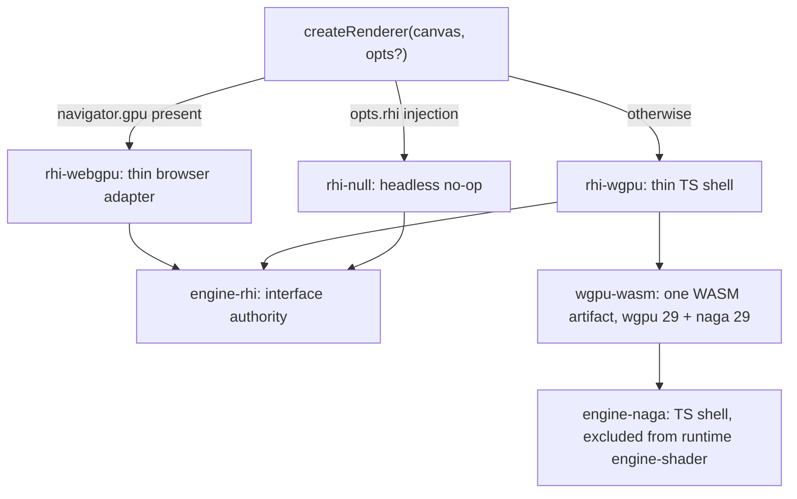

# forgeax-engine-rhi

> RHI is the pure interface between engine and GPU. For unexplained rendering failures start with [`forgeax-engine-rhi-debug`](../forgeax-engine-rhi-debug/SKILL.md); material authoring uses [`forgeax-engine-material`](../forgeax-engine-material/SKILL.md), passes/post-processing use [`forgeax-engine-render-pipeline`](../forgeax-engine-render-pipeline/SKILL.md). This skill covers backends, capabilities, descriptors, and resource lifetime. `rhi-webgpu` adapts browsers; `rhi-wgpu` + `wgpu-wasm` provide the compatibility path; explicitly injected `rhi-null` supports structural tests.

For opaque ray-query foundation work, use the [reference verification guide](../../scripts/raytracing/README.md) and [native owner contract](../../packages/rhi-wgpu-native/README.md#opaque-scene-reference-transport). Keep portable compute replay, native scene re-execution, and RHI-level AS command capture distinct: RHI Debug records BLAS/TLAS builds on ray-query-capable RHI devices: RhiNull, and in Node the native-wgpu device of `@forgeax/engine-rhi-wgpu-native`, an opt-in napi addon ([Node binding](../../packages/rhi-wgpu-native/README.md#node-binding-napi-rs)).

## Native timestamp diagnosis

For stale or inverted native counters, run the native owner regression
`packages/rhi-wgpu-native/src/__tests__/timestamps.dawn.test.ts` through the existing
Dawn setup with `FORGEAX_WEBGPU_NODE=wgpu-native`. Preserve raw reused-query results
for draw, clear-only, zero-draw, dispatch and empty compute, adapter identity and
validation errors. Include zero and indirectly dispatched compute, multiple
resolves with intervening copies, and one-row texel copies with omitted stride
and nonzero offsets. The native-ray-query foundation group publishes its receipt.
Fresh counters alone do not establish exclusive pass cost; qualify their boundary
scope and observer overhead before accepting a rendering performance budget.

## Color-lighting parity handoff

For backend or native readback failures, start with the [color-lighting parity status index](../../apps/parity/color-lighting/status-index.md), then inspect the [parity README](../../apps/parity/color-lighting/README.md) and the named `CaseReport` evidence. Preserve backend identity, native format, frame, size, and raw hash; capability loss is incomplete evidence, not a fallback pass.

## Mental model

RHI follows four rules (AGENTS.md RHI form rules owns the contract):

- **Spec-aligned**: descriptors match `@webgpu/types` (`^0.1.70`); `'x' in src` distinguishes absent fields from explicit undefined. Follow WebGPU descriptors.
- **Opaque handles**: brand-only `Id<T>` resources reject raw GPU field access at compile time. Module paths distinguish RHI `Buffer` from native `GPUBuffer`.
- **Math-free**: accepts POD and ArrayBuffer/Float32Array without engine-math.
- **Implementations ship together**: rhi-webgpu and rhi-wgpu share releases; createRenderer selects the runtime path using navigator.gpu rather than requiring game authors to select it.

Gate features through `device.caps.X`. Read `RhiCaps` for the field contract rather than duplicating it here.

## Core API quick reference

| Name | Package | Form | Purpose |
|:--|:--|:--|:--|
| `createRenderer(canvas, ...)` | runtime | `async fn` | Engine entry; automatically selects the RHI path through navigator.gpu. |
| `device.caps` | rhi | `RhiCaps` | Capability gates, including backendKind. |
| `RhiCaps.backendKind` | rhi | `'webgpu' \| 'wgpu-native' \| 'wgpu-webgl2' \| 'null'` | Reports the active implementation path. |
| Opaque handles | rhi | Brand-only `Id<T>`, such as Buffer/Texture | Raw GPU field access is a compile error. |
| Descriptors | rhi | `Pick<GPUXxxDescriptor, ...>` + `ExplicitUndefined<>` | Creation arguments aligned with WebGPU types. |
| `RhiErrorCode` | rhi | Closed union; read source | Structured failures; exhaustive switch without default. |

> [!IMPORTANT]
> Full handles, interfaces, and descriptor signatures live in `packages/rhi/README.md`; error members live in `packages/rhi/src/errors.ts`. Do not copy these inventories. Consumer `compilerOptions.types` must include `"@webgpu/types"`.

## Backend selection and dependencies


```mermaid
flowchart TD
  CR["createRenderer(canvas, opts?)"] -->|opts.rhi injection| NULL["rhi-null: headless no-op"]
  CR -->|navigator.gpu present| WG["rhi-webgpu: thin browser adapter"]
  CR -->|otherwise| WP["rhi-wgpu: thin TS shell"]
  WG --> RHI["engine-rhi: interface authority"]
  WP --> WASM["wgpu-wasm: one WASM artifact, wgpu 29 + naga 29"]
  WP --> RHI
  WASM --> NAGA["engine-naga: TS shell, excluded from runtime engine-shader"]
  NULL --> RHI
```

## Usage skeleton

```ts
import { createRenderer } from '@forgeax/engine-runtime';

const created = await createRenderer(canvas);
if (!created.ok) throw created.error;
const renderer = created.value;

// capability-gated: inspect() is the public POD boundary; raw devices stay
// inside the RHI/backend construction seam.
const caps = renderer.inspect().capabilities;
if (caps.backendKind === 'wgpu-native') {
  // native-only path; webgpu / wgpu-webgl2 / null take the portable branch
}
if (caps.rgba16floatRenderable) {
  // HDR render-target path available (IBL cubemap, HDR post-processing)
}
```

> Most game authors stop at createRenderer and use the material/render-pipeline skills. Direct buffer/texture creation is for backend contributions or custom passes.

## RhiNull: headless no-op backend

`@forgeax/engine-rhi-null` has no GPU/DOM dependency and supports command-structure assertions in unit tests. It is explicitly injected through Channel 1, never selected through navigator.gpu:

```ts
import type { RhiNullDevice } from '@forgeax/engine-rhi-null';
import { rhi } from '@forgeax/engine-rhi-null';
import { createRenderer } from '@forgeax/engine-runtime';

// canvas is a required positional param; RhiNull never touches the DOM, so a
// minimal stub suffices in headless CI (no `undefined` — it won't typecheck).
const canvas = { width: 1, height: 1 } as unknown as HTMLCanvasElement;
const created = await createRenderer(canvas, { rhi });
if (!created.ok) throw created.error;
const renderer = created.value;
const attached = renderer.attach(world);
if (!attached.ok) throw attached.error;
if (!world.update().ok) throw new Error('World update failed');
const frame = renderer.draw({
  leases: [attached.value],
  camera: { lease: attached.value },
  environment: { lease: attached.value },
});
if (!frame.ok) throw frame.error; // no-op execution, command stream submitted

// Read structural facts through renderer.inspect(). Detailed RhiNull counters
// belong to owner-local tests using the injected backend pack, not Renderer.
console.log(renderer.inspect().capabilities.backendKind); // 'null'
```

### Key semantics

- **`backendKind: 'null'`** means structural bookkeeping without a real GPU. Graph barrier handling groups it with webgpu/wgpu-webgl2, without inserted barriers.
- **Capabilities**: boolean caps are true except reserved `multiDrawIndirect`, `pushConstants`, and `textureBindingArray`; `maxColorAttachments = 8`. This maximizes structural capability coverage.
- **Shader compilation is skipped**: returns a legal ShaderModule brand. createRenderer publishes a Renderer only on a successful Result.
- **Handle bookkeeping**: each created handle is registered per device. setVertexBuffer/setBindGroup reject cross-device or destroyed handles with existing structured errors, including rhi-not-available and destroy-after-destroy.
- **Mixed-frame counters**: totalDispatchCount/totalDrawCount include direct and indirect commands. Combine with framePassNames to assert compute-before-raster order; these do not prove shader or pixel correctness.
- **No pixels**: getCurrentTexture returns a brand without GPU texture data. RhiNull cannot replace smoke/Dawn pixel readback.
- **Independent instances**: every createRenderer with injected RHI gets its own RhiNullDevice and Bookkeeper.

See `packages/rhi-null/README.md` for API, capabilities, bookkeeping, and differences from Vitest mocks.

## Vertex layout aliases: multi-UV clamp-to-last

> [!IMPORTANT]
> WebGPU allows multiple vertex attributes to share a buffer offset with distinct shaderLocation values. ForgeaX uses this for clamp-to-last: when a mesh has n UV sets and a shader declares m>n, attributes in `[n,m)` point to set n-1's offset on the actual draw path.

### WebGPU behavior

ValidateVertexAttribute has no byte-range overlap check; shared offsets are intentional and legal when shaderLocation values differ. setBindGroup overlap restrictions do not apply to vertex attributes. This supports ForgeaX's D-1 decision.

```ts
// Legal: vertex attributes share a buffer offset.
{
  arrayStride: 80,
  attributes: [
    { shaderLocation: 6, offset: 72, format: 'float32x2' },  // uv1: actual data.
    { shaderLocation: 7, offset: 72, format: 'float32x2' },  // uv2 aliases uv1.
    { shaderLocation: 8, offset: 72, format: 'float32x2' },  // uv3 aliases uv1.
  ]
}
```

> Existing paths use one interleaved stream via `setVertexBuffer(0, ...)`; aliases stay in buffer 0.

### Clamp-to-last bindings from deriveVertexBufferLayout

| Mesh UV sets n | Shader sets m | Binding behavior |
|:--|:--|:--|
| n > 0, m <= n | One-to-one | Shader sets 0..m-1 use actual offsets. |
| n > 0, m > n | Clamp-to-last | Sets 0..n-1 use actual offsets; remaining shader locations share set n-1's offset. |
| n = 0 | Zero buffer | Allocate an 8-byte zero default vec2 buffer; all UV locations use offset 0. |

> All combinations are silent, matching the agreed UE semantics. PSO creation succeeds for mesh n=0..8 and shader m=1..8 without unsupported-vertex-layout errors.

### deriveVertexBufferLayout rules

`deriveVertexBufferLayout(map, { shaderUvSetCount? })` is the single vertex-layout derivation entry:

1. Canonical offset order: position / normal / uv / tangent / skinIndex / skinWeight / uv1 / uv2 / uv3 / uv4 / uv5 / uv6 / uv7.
2. Each key derives format and size from ATTRIBUTE_FORMAT_MAP and ATTRIBUTE_BYTE_STRIDE; CANONICAL_KEYS.indexOf(key) gives shaderLocation.
3. countMeshUvSets(map) scans UV_KEYS to derive the actual set count from defined UV keys.
4. When shaderUvSetCount exceeds meshUvSetCount, emitAliasEntries adds entries for `[n,m)` with the UV key's shaderLocation, the last set's aliasOffset, and the UV format.
5. With no UVs (`fromIndex=0`), append 8 bytes of stride and an empty first UV entry backed by a zero vec2f.

> Existing locations 0..5 keep offsets position=0 / normal=12 / uv=24 / tangent=32 / skinIndex=48 / skinWeight=56. uv1..uv7 follow at 72/80/...; glTF and FBX interleaving use the same canonical order.

### PSO cache keys

cacheKeyOf already hashes sorted vertex-layout keys and byteLength. Added uv1..uv7 keys distinguish UV layouts naturally; do not add another variant axis or explicit uvSetCount cache field (D-5).

### RhiNull interaction

RhiNull setVertexBuffer tracks buffer brands without real stride/attribute validation. deriveVertexBufferLayout still emits aliases; its command ledger supports structural layout assertions.

## Texture interop and zero-copy video

Three device methods, gated by capability data (never by `backendKind`):

| Method | Gate | Failure data |
|:--|:--|:--|
| `nativeDevice()` | a native WebGPU device exists | `feature-not-enabled` on rhi-wgpu / rhi-null |
| `importTexture(gpuTexture)` (async) | `caps.textureImport` | foreign device `rhi-not-available`; shape/usage `rhi-descriptor-invalid`; `device-lost` |
| `importExternalTexture({ source })` | `caps.externalTexture` (importExternalTexture plus a media realm) | undecoded element / closed frame `rhi-descriptor-invalid`; absent `feature-not-enabled` |

Caps: rhi-webgpu in a browser reports both `true`; Dawn node reports
`textureImport: true, externalTexture: false`; rhi-wgpu reports both `false`;
rhi-null admits both structurally. An imported `ExternalTexture` expires with
the current task, so import every frame. A `{ externalTexture: {} }` layout
entry also accepts a `textureView`, which is how the copy fallback and borrowed
GPU textures share one layout and one `texture_external` shader. The borrowed
texture's `destroyTexture` drops bookkeeping only; the caller keeps ownership.

`probeVideoHighPerfUpload` (graphics-extras) reads only `caps.externalTexture`.
Game code should use `renderer.importTexture` (see `packages/render/README.md`
§External textures) rather than these RHI methods directly.

### Neither path available: video-upload-unsupported

A `VideoPlayer` entity whose host provides no element fires
VideoUploadUnsupportedError through the renderer error channel on the same
record path. Consume it through `renderer.subscribe` and an exhaustive switch
on `err.code === 'video-upload-unsupported'` (`packages/runtime/src/errors.ts`).

### Capability boundaries

| Boundary | Meaning |
|:--|:--|
| Dawn cannot decode video | No HTMLVideoElement/VideoFrame realm; zero-copy and video pixel acceptance require browser e2e. GPUTexture import and the `texture_external` layout do run on Dawn. |
| RHI Debug | The recorder snapshots each imported frame into a recorded rgba8 texture view, so tapes replay without media objects. |
| No audio track handling | RHI does not own video audio; that work is separate. |

## Resource release: destroyBuffer / destroyTexture

RhiDevice.destroyBuffer(buf) and destroyTexture(tex) pair with resource creation and behave symmetrically across backends.

### Normal path

```ts
// GPU handles remain owner-local. Public Renderer exposes capability facts only;
// resource creation belongs to a RenderFeature plan or an owner-local test.
console.log(renderer.inspect().capabilities.backendKind);
```

RhiDevice autocomplete exposes createBuffer/destroyBuffer together, making release discoverable at the same entry (charter F1).

### Signatures and errors

| Method | Signature | Result |
|:--|:--|:--|
| `RhiDevice.destroyBuffer` | `(buf: Buffer) => Result<void, RhiError>` | `ok(undefined)` on success. |
| `RhiDevice.destroyTexture` | `(tex: Texture) => Result<void, RhiError>` | Same. |

Destroying the same resource twice fails immediately:

```ts
const r1 = device.destroyBuffer(buf); // ok
const r2 = device.destroyBuffer(buf);
// r2.ok === false
switch (r2.error.code) {
  case 'destroy-after-destroy':
    // AI user self-detects "I already released this"
    // hint: "object already destroyed; track lifecycle in caller or check isDestroyed before re-destroy"
    break;
}
```

`destroy-after-destroy` is an add-only minor RhiErrorCode member. Both backends use RHI-shim bookkeeping independent of the WASM boundary.

`rhi-descriptor-invalid` is another add-only minor RhiErrorCode member. Classify failures as follows:

- `rhi-descriptor-invalid`: malformed caller descriptor data. Rust wasm_bindgen(catch) returns an error with stable prefix `[wgpu-wasm] failed to parse`; TS wrap() classifies it.
- `webgpu-runtime-error`: a valid descriptor is rejected by runtime conditions, such as binding limits.

`.hint` identifies fields such as fragment.targets[0]; `.code` supports exhaustive handling. Authority: `packages/rhi/src/errors.ts`.

### Runtime GpuResource

Runtime exposes GpuBuffer/GpuTexture and `type GpuResource = GpuBuffer | GpuTexture`. Wrappers expose boolean isDestroyed and `destroy(): Result<void, RhiError>`, forwarding to RHI resource destruction with the same repeat-destroy failure.

Renderer.dispose() releases wrappers through gpuStore.destroyAll, graph.drain, instance-buffer clearing, IBL cache clearing, context.unconfigure, and listener cleanup; repeated dispose is idempotent. App.stop() only stops frame scheduling; App.dispose() also disposes the renderer.

### Chromium adapter pool caveat

> [!CAUTION]
> Do not call device.destroy() on public paths: Chromium may fail to reacquire an adapter after GPUDevice.destroy(). Public APIs expose resource destruction only. Low-level diagnostics can use `_internal_getRawDevice(device)` to reach raw device destruction.

GpuResource uses one destruction owner without refcounts or shared ownership.

## Pitfalls

- **Raw GPU access through handles**: opaque brands reject internal GPU field access at compile time. Use RHI methods.
- **Assuming native features**: capabilities differ by backend; gate through device.caps before use.
- **Missing WebGPU types**: consumer compilerOptions.types must include @webgpu/types for descriptor alignment.
- **Importing naga into runtime shader**: physical-isolation grep gates reject it; naga belongs only to the build-time shader-compiler chain.
- **Repeated resource destruction**: destroy-after-destroy is intentional. Handle it exhaustively or check the runtime wrapper's isDestroyed before calling when idempotence is needed.
- **Destroying the whole device**: public paths avoid Chromium adapter-pool poisoning. Use resource destruction; raw device diagnostics require the internal escape hatch.
- **Silent black output/GPU loss after wgpu-wasm Channel 3 submit**: historically submit returned void without wasm_bindgen(catch), and error-sink validation failures never reached JS. The R5 M4 repair installs device.on_uncaptured_error, stores a per-queue last error, and makes submit return Result. It reads/clears the slot after submission and forwards `[rhi-code:<code>]`; TS queue.ts maps this to existing queueSubmitFailed/webgpuRuntimeError. Submission validation now reports through onError while the instance remains usable for the next frame.

## Hardware Ray Query

Gate on `device.caps.rayQuery.supported` (closed union with a `reason` when false);
never probe by try/catch. Browser WebGPU and wgpu WebGL2 report
`backend-has-no-ray-query`; RhiNull simulates support only with
`new RhiNullAdapter({ rayQuery: limits })`; native wgpu derives it from
`EXPERIMENTAL_RAY_QUERY` and reports `adapter-lacks-feature` without it.

```ts
if (device.caps.rayQuery.supported) {
  // vertexBuffer/indexBuffer need BLAS_INPUT_BUFFER_USAGE (refused as data without ray query)
  const blas = device.createBlas({ geometries: [{ vertexFormat: 'float32x3', vertexCount, index: { format: 'uint32', count } }] });
  const tlas = device.createTlas({ maxInstances: 1024, updateMode: 'refit' });
  encoder.buildAccelerationStructures(
    [{ blas, geometries: [{ vertexBuffer, vertexStride: 12, index: { buffer: indexBuffer } }] }],
    [{ tlas, instances: [{ blas, transform: rowMajor3x4, customIndex, mask: 0xff }] }],
  ); // rebuild the TLAS each frame to move instances
}
```

Shaders starting with `enable wgpu_ray_query;` are a capability-gated variant and
are refused (`feature-not-enabled`) on devices without Ray Query. Keep a compute/SDF
traversal for every other device. Contract: `packages/rhi/README.md` §Hardware Ray Query.
GI world traces select that pair through one WGSL seam, `worldTraversalWgsl('global-sdf' |
'ray-query')` (`packages/render/README.md` §World traversal seam). The renderer selects the
lane itself (`ray-query` iff supported and within limits, else `global-sdf` plus a closed
`traversalFallback` in `inspect().diffuseGi`); there is no user knob. Browser/Dawn always
report `backend-has-no-ray-query`. In Node, the opt-in `@forgeax/engine-rhi-wgpu-native`
addon is a W3C-shaped `GPU` over native wgpu 30 with the Ray Query extension, consumed
through the rhi-webgpu shim. To run any `*.dawn.test.ts` or the hello-gi scripts on it:

- set `FORGEAX_WEBGPU_NODE=wgpu-native`;
- `caps.rayQuery` is then derived from the real adapter (Lavapipe 25.2 and Metal included);
- `FORGEAX_WGPU_NATIVE_RAY_QUERY=off` gives the Global SDF lane on the same device.

The other evidence is RhiNull (structure) and the `rhi-wgpu-native` cargo tests (GPU, with
`FORGEAX_REQUIRE_NATIVE_RAY_QUERY=1` under `pnpm ci:graphics`). A missing addon is
`adapter-unavailable`.

## Deferred membership timing

Render is the sole timing owner. The opaque pass-descriptor
`timestampWrites` -> `resolveQuerySet` -> `mapAsync` seam is used only around
real render/compute work. A backend publishes
`caps.timestampQuery` plus its positive `timestampPeriodNanoseconds` when
trustworthy; RhiNull and the current wgpu WebGL2 backend publish `false` and
`null`. The obsolete command-encoder `writeTimestamp` entry is not part of the
RHI surface because current Dawn rejects it even when the feature is
advertised. Do not synthesize ticks, add a profiler, or move the Render reason
union into RHI. `feature-not-enabled` remains an RHI detail and is translated
to Render's `timestamp-query-unsupported` refusal at that boundary.

The same boundary applies to generic GPU pass timing: RHI supplies only the
capability primitive and opaque handles. Render owns admission, pass identity,
receipt binding, parsing, retention, status, and recovery; benchmark validation
is a separate offline Render concern. `RhiNull` refusal or exact-zero command
evidence cannot be promoted to a real GPU tick or duration, and membership
timing is not generic accepted evidence.

## Further reading

- Handles, interfaces, descriptors, and ExplicitUndefined bridging: `packages/rhi/README.md`.
- Closed RhiErrorCode authority: `packages/rhi/src/errors.ts`.
- Capability layers and RhiCaps fields: `packages/rhi/README.md` and `packages/rhi/src/index.ts`.
- RHI form rules (spec-aligned / opaque / math-free / dual-impl / single-wasm / naming): AGENTS.md §RHI form rules
- Backend/WASM implementations: `packages/rhi-webgpu/src/`, `packages/rhi-wgpu/src/`, `packages/wgpu-wasm/`; build instructions: CONTRIBUTING.md, Rust toolchain.
- RhiNull API, capabilities, bookkeeping, and mock distinction: `packages/rhi-null/README.md`; implementations: `packages/rhi-null/src/`.
- Declarative RHI-pure graph: [`forgeax-engine-render-pipeline`](../forgeax-engine-render-pipeline/SKILL.md); RenderGraphErrorCode: `packages/render-graph/src/errors.ts`.
- createBindGroupLayout accepts variable-length entries. Material group-1 layouts derive from each shader's paramSchema upstream; RHI only creates the assembled descriptor. Sampler-first layout rules: [`forgeax-engine-shader`](../forgeax-engine-shader/SKILL.md).
- Rendering/RHI diagnosis: [`forgeax-engine-rhi-debug`](../forgeax-engine-rhi-debug/SKILL.md), then [`forgeax-engine-debug`](../forgeax-engine-debug/SKILL.md) for owner-specific symptoms.
