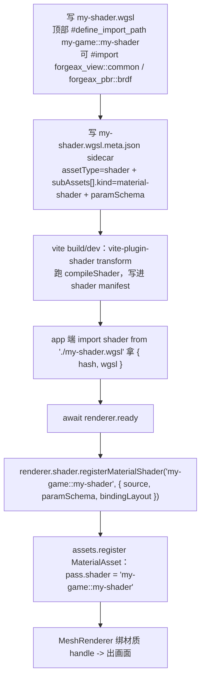

# forgeax-engine-shader

> 基线: [`5c8c90f1`](../../commit/5c8c90f1) (2026-06-03) · 同步至: [`358592eb`](../../commit/358592eb) (2026-06-09)

> **自定义 WGSL 走"编译 → 注册 → 被 MaterialAsset 引用"三步**。build-time 把 `.wgsl` 编译 / 组合（`compileShader`，naga_oil `#import`），runtime 把它登记成一个 `MaterialShader` 标识符（`registerMaterialShader`），然后 [`forgeax-engine-material`](../forgeax-engine-material/SKILL.md) 里 `MaterialAsset` 的 pass 用 `shader: '<标识符>'` 引用它。聚合 `@forgeax/engine-shader`（runtime registry）· `@forgeax/engine-shader-compiler`（build-time）· `@forgeax/engine-vite-plugin-shader`（vite 钩子）· `@forgeax/engine-naga`（WGSL 工具，**禁止**出现在 runtime）。

## 心智模型

着色器有 **build-time** 和 **runtime** 两个世界，物理隔离。build-time：`compileShader(source, options)` 跑 naga_oil 解析 `#import` / `#define`，产出组合后的 WGSL + content hash；在 vite 里这一步由 `@forgeax/engine-vite-plugin-shader` 的 transform 钩子自动做——你 `import shader from './x.wgsl'` 就拿到 `{ hash, wgsl }`。runtime：`ShaderRegistry`（通过 `renderer.shader` 暴露，实例化非单例）用 `registerMaterialShader(identifier, entry)` 把一个 `MaterialShaderEntry`（`{ source, paramSchema, bindingLayout }`）登记到一个**路径标识符**（如 `'my-game::pulse-material'`）。最后 `MaterialAsset` 的一个 pass 用 `shader: '<标识符>'` 把材质连到这个 shader——shader 没注册就 fail-fast。`@forgeax/engine-naga`（WGSL→IR 工具）只活在 build-time，runtime `@forgeax/engine-shader` 物理禁止 import 它（3 个 grep 闸门守护）。

### 内置绑定约定（built-in binding convention）

引擎的 5 条 vertex shader（PBR / unlit / sprite / skin / shadow_caster）使用统一绑定布局。当你写自定义 WGSL 材质 vertex shader 并希望接入引擎内置 pass（Forward / ShadowCaster）时，用同样的布局——否则自管 bindingLayout。

| group | binding | 内容 | 用途 |
|:--|:--|:--|:--|
| `@group(0)` | `@binding(0)` | `var<uniform> view : View` | 帧级 uniform：VP 矩阵、相机位置、时间、屏幕尺寸 |
| `@group(0)` | `@binding(1)` | `PointLightsArray` | 点光（storage 或 uniform，取决于 `STORAGE_BUFFER_AVAILABLE`） |
| `@group(0)` | `@binding(2)` | `SpotLightsArray` | 聚光（同上） |
| `@group(0)` | `@binding(3)` | `texture_depth_2d` | shadow map |
| `@group(0)` | `@binding(4)` | `sampler_comparison` | shadow sampler |
| `@group(1)` | `@binding(0)` | `var<uniform> material : Material` | 材质 UBO：baseColor + metallic/roughness + channelMap |
| `@group(1)` | `@binding(1..N)` | texture + sampler 对 | 材质贴图槽，**由 `paramSchema` 派生**：每个 `type:'texture2d'` 字段按声明顺序生成一对 **sampler-first**（sampler 在奇数 binding，texture 在 +1）。内置 PBR 是 baseColor/metallicRoughness/normal（binding 1..6），自定义 shader 声明几张就有几对——见下方派生规则 |
| `@group(2)` | `@binding(0)` | `array<Mesh>` | 逐 mesh 的 worldFromLocal mat4（storage 或 uniform） |
| `@group(3)` | `@binding(0)` | `array<InstanceData>` | **逐 instance 的 localFromInstance mat4**（storage 或 uniform）。Vertex shader 通过 `@builtin(instance_index)` 索引。写支持 instancing 的自定义 vertex shader 时，用 `@group(3)` 取 instancing transform——引擎 record 阶段自动填充该通道（feat-20260604） |

> `@group(3)` 是 per-instance transform 通道 SSOT：5 条 vertex shader 全部在 `vs_main` 中从 `instances[instance_index]` 读取，引擎 record 阶段在 `render-system-record.ts` 写入——你不必手动管理，只要 vertex shader 正确的 `@group(3) @binding(0)` 声明即可。

> [!IMPORTANT]
> **`@group(1)` 材质 BGL 由 `paramSchema` 逐 shader 派生（feat-20260621）。** 自定义 shader 声明**任意张**贴图字段（`type:'texture2d'`）即自动获得对应槽位 + 端到端绑定，**无需改引擎**。规则（`derive(paramSchema)` SSOT，`packages/types/src/derive-paramschema.ts`）：
> - 连续 numeric 字段（color/f32/vec*）合并进 `@binding(0)` 一个 std140 UBO；
> - 每个 `texture2d` 字段按**声明顺序**生成 sampler（奇 binding）+ texture（+1）对，从 binding 1 起；
> - 引擎注入区（IBL irradiance/prefilter/brdfLut + emissive/AO）紧跟在用户区之后动态起始——**用户 shader 的 binding 不得超过用户区末尾**（内置 PBR 是 6，再往上是引擎注入区，会撞 IBL）。
>
> 内置材质 BGL 行为不变（仍是 3 贴图 / binding 1..6）。worked example：LO 5.5 parallax demo 声明 baseColor/normal/**height** 三张贴图，`heightTexture` 落在 binding 5/6，引擎自动绑定（`apps/learn-render/5.advanced-lighting/5.parallax-mapping/`）。
>
> **naga filtering 反射坑**：只用 `textureSampleLevel`（显式 LOD）采样的贴图会被 naga 反射成 `unfilterable-float` + `non-filtering`，与 `derive` 期望的 `filtering` 不符，build 时 binding 校验报 `material-shader-binding-mismatch`。修法：让该贴图至少有一次 `textureSample`（隐式 LOD，须在 uniform control flow 内）使其反射为 `filtering`。

> **自定义 fullscreen post-process WGSL 的 binding 约定**（feat-20260621，与材质 shader 不同）：post-process fragment shader 在 `@group(1)` 上声明——`@binding(0)` 输入纹理 `texture_2d<f32>`、`@binding(1)` `sampler`、`@binding(2)` `var<uniform> params`（当 `postProcess.register` 声明了 `params` 时；无 params 则只有 binding 0/1 的 2-entry BGL）。`@group(0)` 是预留的空 view-BGL。内建 `tonemap.wgsl` 即按此布局（`@group(1) @binding(2) var<uniform> params : TonemapParams`）。注册 + 数据驱动每帧更新（`PostProcessParams` 组件）见 [`forgeax-engine-render-pipeline`](../forgeax-engine-render-pipeline/SKILL.md) §自定义 fullscreen 后处理。

## 核心 API 速查

| 名字 | 来源包 | 形态 | 用途 |
|:--|:--|:--|:--|
| `compileShader(source, options?)` | shader-compiler | `async => Result<CompileResult, ShaderError>` | build-time 编译 / 组合 WGSL；返回组合后 wgsl + hash |
| `import x from './x.wgsl'` | vite-plugin-shader | `=> { hash, wgsl }` | vite 自动跑 `compileShader`，省去手调 |
| `ShaderRegistry` | shader | class（经 `renderer.shader` 拿，非单例） | runtime registry：注册 / 解析 material shader |
| `registry.registerMaterialShader(id, entry)` | shader | `(string, MaterialShaderEntry) => void` | 登记自定义 shader；同名重复 fail-fast 不覆盖 |
| `MaterialShaderEntry` | shader | `{ source, paramSchema, bindingLayout }` | 注册载荷：WGSL 源 + 参数 schema + 绑定布局 |
| `registry.materialShaderIdentifiers()` | shader | `=> IterableIterator<string>` | 枚举已注册标识符（调试 'not registered' 用） |
| `registry.get(hash)` | shader | `=> Result<ShaderModule, RhiError\|ShaderError>` | content hash → 编译好的 RHI `ShaderModule` 句柄 |
| `registerDefaultStandardPbrSkin(...)` | shader | 函数 | 引擎自带 PBR shader 注册（worked example） |

> [!IMPORTANT]
> `MaterialShaderEntry.paramSchema` 是**参数布局 SSOT**：它的字段顺序决定每个参数落到 48 字节 Material UBO 的哪个偏移（positional overlay）。WGSL 里 `struct` 字段名可以和 schema 名不同（如 schema 的 `metallic` f32 被 WGSL 读成 `time`），但**顺序 + 类型**必须 std140 字节对齐。

## 规范调用顺序



## idiom 代码骨架

```ts
import { createRenderer, type MaterialAsset, MeshFilter, MeshRenderer } from '@forgeax/engine-runtime';
import myShader from './my-shader.wgsl'; // vite-plugin-shader returns { hash, wgsl }

const renderer = await createRenderer(canvas, { shaderManifestUrl: '/shaders/manifest.json' });
await renderer.ready;

const shader = renderer.shader;
const assets = renderer.assets;
if (shader === null || assets === null) throw new Error('backend not initialized');

// 1) register the custom material shader under a path identifier
shader.registerMaterialShader('my-game::my-shader', {
  source: myShader.wgsl,
  paramSchema: [
    { name: 'baseColor', type: 'color' },
    { name: 'metallic', type: 'f32' },
    { name: 'roughness', type: 'f32' },
  ],
  bindingLayout: [],
});

// 2) a MaterialAsset pass references the shader by identifier
const mat = assets.register<MaterialAsset>({
  kind: 'material',
  passes: [{ name: 'Forward', shader: 'my-game::my-shader', tags: { LightMode: 'Forward' }, queue: 2000 }],
  paramValues: { baseColor: [0.95, 0.45, 0.2], metallic: 0, roughness: 2 },
}).unwrap();

// 3) bind it to an entity via MeshRenderer.material (see forgeax-engine-material)
```

## 踩坑

- **`register failed: shader 'X' not registered`**：MaterialAsset 的 `pass.shader` 标识符没注册，或注册时机晚于第一次 draw。必须在 `await renderer.ready` 之后、首帧之前 `registerMaterialShader`。改名残留场景见 [`forgeax-engine-debug`](../forgeax-engine-debug/SKILL.md) §shader 标识符残留。
- **vite build 缺 sidecar 报错**：自定义 `.wgsl` 走 vite 生产构建必须配一份同名 `*.wgsl.meta.json`（`assetType: 'shader'` + `subAssets[].kind: 'material-shader'` + `paramSchema`）——它是 vite-plugin-shader transform 读 `paramSchema` 的 SSOT；缺了报 "missing required .wgsl.meta.json sidecar"。dawn-node smoke 走内联 compose 不读 sidecar，会掩盖这个构建缺口。
- **贴图槽纯白方块**：`paramValues` 里贴图传了 GUID 字符串而非解析后的 `Handle`。见 [`forgeax-engine-debug`](../forgeax-engine-debug/SKILL.md) §贴图纯白。
- **同名注册 throw**：`registerMaterialShader` 同标识符二次注册 fail-fast 不覆盖（AGENTS.md explicit registration）；一个标识符只登记一次。

## 深入

- runtime registry 形态铁律 / 物理隔离 3 grep 闸门（`check-shader-no-naga-in-dist` · `check-shader-runtime-deps` · `check-shader-no-compiler-import`）：见 `packages/shader/README.md`；源码 SSOT `packages/shader/src/ShaderRegistry.ts` + `packages/shader/src/index.ts`
- build-time `compileShader` / naga_oil `#import` / `#define` 规则 / OOS-1 非布尔 define：见 `packages/shader-compiler/README.md`；源码 `packages/shader-compiler/src/index.ts`
- vite transform 钩子 / sidecar 检测 / manifest 产出：源码 `packages/vite-plugin-shader/src/index.ts`
- 端到端 worked example：`apps/hello/custom-shader/`（`pulse-material.wgsl` + `.wgsl.meta.json` + `.pack.json` 三方共源；grep `my-game::pulse-material` 找全链路）
- `ShaderErrorCode` 全集（勿抄）：`packages/types/src/index.ts`
- 材质如何用 `MaterialShader` 标识符渲染：见 [`forgeax-engine-material`](../forgeax-engine-material/SKILL.md)
