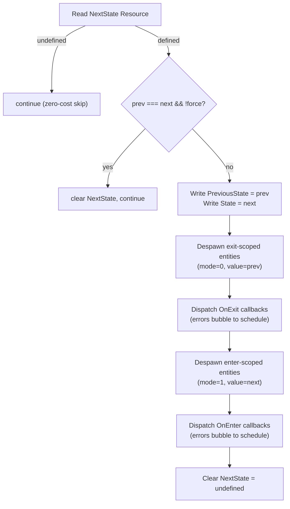

# forgeax-engine-state

> Baseline: feat-20260616-engine-state-and-state-scoped-entities (2026-06-16)
>
> Single-world typed-state machine: `defineState` + `setNextState` + state-scoped entity lifecycle (`despawnOnExit`/`despawnOnEnter`) + `OnEnter`/`OnExit` user schedule labels. Zero-intrusion on ECS -- consumes existing `defineComponent`/`addSystem`/Resource CRUD/`queryRun`/`despawn` primitives only. Aggregates `@forgeax/engine-state`.

## Mental model

A state machine is a module-level `StateToken` (branded type created by `defineState`) plus per-token Resources in the ECS `World`. You define states at module level with an `as const` variant tuple, request transitions via `setNextState(world, token, variant)`, and read current/previous state via `getState`/`getPreviousState`. Entities can be scoped to state variants with `despawnOnExit`/`despawnOnEnter` -- they are auto-despawned when the state leaves or enters a variant. `OnEnter`/`OnExit` return dispatch labels for registering transition callbacks.

The `transitionStatesSystem` runs every frame (registered by `registerStatesPlugin`, which `createApp` calls automatically). It reads `NextState` Resource, flips `State`, despawns scoped entities, dispatches callbacks, then clears `NextState`.

## Core API quick reference

| Name | Shape | Purpose |
|:--|:--|:--|
| `defineState(name, variants as const)` | `=> StateToken<N, V>` | Define a typed state machine at module level; `as const` enables compile-time variant narrowing |
| `StateToken` | branded interface | Holds `name`, `variants`, `nameToIdx` (Map), `defaultValue` (`variants[0]`) |
| `setNextState(world, token, variant)` | `=> Result<void, StateError>` | Request a state transition for next frame |
| `setNextStateForce(world, token, variant)` | `=> Result<void, StateError>` | Like `setNextState` but with `force=true` (re-fires even same-state) |
| `getState(world, token)` | `=> Result<string, StateError>` | Read the current state variant string |
| `getPreviousState(world, token)` | `=> Result<string, StateError>` | Read the previous-frame state variant string |
| `inState(token, variant)` | `=> (world: World) => boolean` | Factory returning a run-condition predicate; true when the state machine is in the given variant |
| `registerStatesPlugin(world)` | `=> void` | Idempotent: inserts per-token Resources + registers `transitionStates` system; called automatically by `createApp` |
| `despawnOnExit(world, entity, token, variant)` | `=> void` (throws on duplicate) | Mark entity to be despawned when `token` leaves `variant` |
| `despawnOnEnter(world, entity, token, variant)` | `=> void` (throws on duplicate) | Mark entity to be despawned when `token` enters `variant` |
| `OnEnter(token, variant)` | `=> string` | Returns a dispatch label string for registering enter callbacks |
| `OnExit(token, variant)` | `=> string` | Returns a dispatch label string for registering exit callbacks |
| `addOnEnter(token, variant, fn)` | `=> UnsubscribeHandle` | Register a callback to fire when entering `variant` |
| `addOnExit(token, variant, fn)` | `=> UnsubscribeHandle` | Register a callback to fire when leaving `variant` |
| `StateError` | structured error | `.code` (4-member closed union) / `.expected` / `.hint` / `.detail` |
| `forgeax-engine-console-state` | CLI plugin bin | `list` (all registered tokens + current state) / `get <name>` (variant string) |

> [!IMPORTANT]
> `StateErrorCode` is a 4-member closed union: `'state-already-defined'` | `'state-not-registered'` | `'invalid-variant'` | `'state-default-required'`. SSOT at `packages/state/src/errors.ts` -- do not copy.

## Transition pipeline (per-token, per-frame)



## Idiom code skeleton

```ts
import { createApp } from '@forgeax/engine-app';
import { defineState, setNextState, getState, despawnOnExit, OnEnter, addOnEnter, inState } from '@forgeax/engine-state';
import { defineSystem, Transform, MeshFilter, MeshRenderer, Camera, DirectionalLight, HANDLE_CUBE } from '@forgeax/engine-runtime';

// 1) Define state machines at module level
export const LevelId = defineState('LevelId', ['main-menu', 'tutorial', 'street-a'] as const);
export const GamePhase = defineState('GamePhase', ['loading', 'playing', 'paused'] as const);
// LevelId.variants           -> readonly ['main-menu', 'tutorial', 'street-a']
// LevelId.defaultValue       -> 'main-menu'
// LevelId.nameToIdx.get('tutorial') -> 1

const res = await createApp(canvas);
// registerStatesPlugin is called automatically by createApp
const world = res.value.world;

// 2) Spawn level-scoped entities
function spawnTutorial(world: World): void {
  const e = world.spawn(
    { component: Transform, data: { posX: 0, posY: 0, posZ: 0 } },
    { component: MeshFilter, data: { assetHandle: HANDLE_CUBE } },
  ).unwrap();
  despawnOnExit(world, e, LevelId, 'tutorial');
}

// 3) Request transitions
setNextState(world, LevelId, 'tutorial');
// Next frame: transitionStatesSystem flips LevelId -> 'tutorial'

// 4) Read current state
const current = getState(world, LevelId);
if (current.ok) console.log('Current level:', current.value);

// 5) Register transition callbacks
addOnEnter(LevelId, 'tutorial', (w) => {
  spawnTutorial(w);
  console.log('Entered tutorial level');
});

// 6) Force re-trigger (e.g. restart level)
setNextStateForce(world, LevelId, 'tutorial');
// Even though already 'tutorial', force=true re-fires OnExit/OnEnter + scoped despawn

// 7) Gate a system to run only in 'Playing' state
const GameplaySystem = defineSystem({
  name: 'gameplay',
  queries: [{ with: [Transform] }],
  runIf: inState(GamePhase, 'Playing'),
  fn: (world, queryResults, commands) => {
    // Only runs when GamePhase === 'Playing'
  },
});
world.addSystem(GameplaySystem);
```

## inState condition factory (system gating by game state)

`inState(token, variant)` returns a `(world: World) => boolean` predicate suitable for `SystemDescriptor.runIf`. The predicate reads the state token's current value from the World resource store each frame and returns `true` when the state matches the given variant.

```ts
import { defineSystem } from '@forgeax/engine-ecs';
import { inState, defineState } from '@forgeax/engine-state';

const GameState = defineState('GameState', ['Menu', 'Playing', 'Paused'] as const);

// System runs only when GameState === 'Playing'
const Gameplay = defineSystem({
  name: 'gameplay',
  queries: [{ with: [Transform] }],
  runIf: inState(GameState, 'Playing'),
  fn: (world, queryResults, commands) => {
    // frame logic -- runs only in Playing state
  },
});
```

**Behavior**:
- State matches variant: predicate returns `true`, system runs normally.
- State does not match: predicate returns `false`, system is silently skipped (no query execution, no fn call).
- State not activated (resource not yet inserted): predicate returns `false` -- safe to use before `registerStatesPlugin`.

**Implementation**: `inState` reuses `stateResourceKey(token)` (from `packages/state/src/resources.ts`) to derive the per-token Resource key, then reads the current state index via `world.getResource<number>(key)` and compares against `token.nameToIdx.get(variant)`. Zero new primitives -- consumes ECS Resource CRUD only.

> [!IMPORTANT]
> `inState` is the sole condition factory in the current feature (OOS-7: no `and`/`or`/`not` combiners). Future loops may add combinators.

## Pitfalls

- **`setNextState` before `registerStatesPlugin`** -- returns `StateError { code: 'state-not-registered' }`. `createApp` auto-registers; manual `createRenderer` users must call `registerStatesPlugin(world)` before any state operation.
- **Duplicate `despawnOnExit` on same entity + token** -- throws `ComponentAlreadyPresentError` (ECS default exclusive=false fail-fast). One entity can only carry one `__scopedTo__<tokenName>` component.
- **`force` flag** -- `setNextStateForce` skips the "same-state no-op" guard. Use for restart semantics (re-fire `OnExit` + `OnEnter` + scoped despawn for the same variant).
- **Transition is next-frame** -- `setNextState` writes `NextState` Resource; transition happens when `transitionStatesSystem` runs (after `input-frame-start-scan`, before `propagateTransforms`). `getState` won't see the new value until the next frame.
- **Callback ordering** -- `OnEnter`/`OnExit` callbacks fire inside `transitionStatesSystem`, after scoped entity despawn for the old state but before despawn for the new state. Callbacks receive the `World` and can spawn/query freely.
- **Callback errors bubble** -- callbacks are *not* wrapped in try-catch. A throwing callback aborts the transition system and propagates to the ECS schedule; the `State` flip has already committed (no rollback) and later tokens skip that frame. Validate inside callbacks and return rather than throw.
- **`inState` before `registerStatesPlugin`** -- safe: the predicate returns `false` (state not activated). The system is skipped silently until the state resource is inserted. No throw, no error.

## Deeper

- `StateToken` branded type + `as const` compile-time narrowing: source `packages/state/src/define-state.ts`
- `StateErrorCode` 4-member closed union + discriminated detail: source `packages/state/src/errors.ts` (SSOT)
- `transitionStatesSystem` 8-step pipeline: source `packages/state/src/transition-system.ts`
- `inState` condition factory (predicate closure, resource key derivation): source `packages/state/src/conditions.ts`
- `registerStatesPlugin` auto-wire in `createApp`: source `packages/app/src/create-app.ts`
- CLI plugin bin `forgeax-engine-console-state`: source `packages/state/src/cli-state.ts`
- Zero-intrusion design (consumes ECS primitives only): see [`forgeax-engine-ecs`](../forgeax-engine-ecs/SKILL.md)
- App bootstrap + `createApp` auto-register: see [`forgeax-engine-app`](../forgeax-engine-app/SKILL.md)