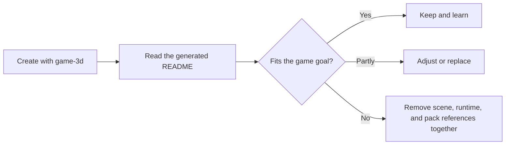
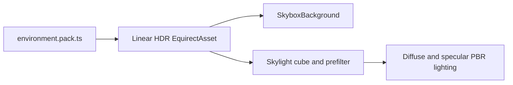

# ForgeaX Game 3D

Compact third-person reference: pointer-locked camera, camera-relative movement, Rapier character
collision, a fantasy PBR showcase, a procedural low-poly armored scout, and one UiAsset.

> [!IMPORTANT]
> `game-3d` is a runnable, contentful reference—not an empty 3D scene. `forgeax project new` copies a
> working scene, the feature-owned plugin Packs, procedural meshes and materials, a skinned character, and
> UI into the new project. These starter contents intentionally affect the visible composition,
> player collision space, and asset closure.
>
> Treat this as a guidance starting point: read the examples, keep what matches your game, and
> adjust or replace the rest. Do not delete visible scene entities, their colliders, or their pack
> dependencies independently; use the dependency guide below when pruning the starter.

> [!IMPORTANT]
> Click the game to lock the camera. Move with <kbd>W</kbd><kbd>A</kbd><kbd>S</kbd><kbd>D</kbd>,
> look with the mouse, jump with <kbd>Space</kbd>, and release the pointer with <kbd>Esc</kbd>.



## Behavior Packs

Start with the Pack for the feature you want to change. `game.pack.ts` only composes the engine
root. Each feature owns its namespace, configuration, and asset references. There is no special
`plugin.ts` entry file; native Cordis still owns every installed behavior's lifetime.

| Pack | Owns | Runtime implementation |
|:--|:--|:--|
| `assets/game.pack.ts` | Engine root; references physics and scene | Same-file `game` export |
| `assets/physics.pack.json` | Rapier capability | Existing npm plugin |
| `assets/world/world.pack.ts` | Scene instance; references scene data, player and camera | Same-file `scene` export |
| `assets/player/player.pack.ts` | Movement settings and walk-clip reference | `player.ts`, a normal implementation module |
| `assets/camera/camera.pack.ts` | Camera behavior | Same-file `camera` export |
| `assets/ui/ui.pack.ts` | Browser frontend root, guide and vase controls | Same-file `ui` export |
| `assets/runtime-vase/vase.pack.ts` | Runtime vase generation and bound mesh lifetime | Same-file `vase` export |

`build()` produces persistent definitions. `apply()` installs runtime contributions through
`ctx.effect()`. Pass generated values through asset configuration; runtime code cannot capture
locals from a build invocation. Each behavior declares its own `packageId`; `$asset` references point to the GUIDs derived from
the owning Pack and output key. Copying a feature requires its referenced asset and source closure.

To scaffold another behavior in one file:

```sh
forgeax asset plugin create --path assets/combat/combat.pack.ts --json
```

## Execution and UI

New projects default to automatic Engine, Render and Kernel Workers. `forge.json`
places gameplay/physics in the Engine realm and the guide UI in the browser frontend realm.
The Host loads the UiAsset by GUID, mounts it in the Host `#game-ui` container, and observes
browser pointer-lock state; gameplay consumes the frozen input snapshot in its
World. `FORGEAX_EXECUTION_WORKERS='{"engine":false}'` selects local execution
through the same bootstrap. Shared kernels require COOP/COEP on production
hosting; DevKit dev and preview already provide them.

## Runtime vase

The vase at the front of the showcase is generated when the game starts. Release the
camera with <kbd>Esc</kbd>, edit **Height**, **Radius**, or **Sides**, then select
**Generate vase**. The same scene entity and asset GUID receive the new mesh. A rejected
parameter set preserves the previous vase.

`assets/runtime-vase/vase-program.ts` supplies a native JS generator, parameter metadata,
and a fixed material dependency to the App's `runtimePacks` producer. The mesh is published
to its Catalog and loaded by GUID; variants are not stored in the cooked geometry Pack.
`vase.pack.ts` is an ordinary PluginAsset under the scene owner. The Host UI sends values
through the borrowed `GameHost.port`, so the same controls work with an Engine Worker.
Disposal cancels generation, removes the entity, and withdraws the owned generator.

To remove this example, remove its child reference from `world.pack.ts`, its Pack and
program files, and the vase panel/control binding from the UI together.

## Starter content guide

| Content | Role | Adjust or remove together |
|:--|:--|:--|
| `assets/scene.pack.ts` | Runnable scene and 3C example: ground, obstacles, lights, sky, camera, kinematic `Player`, and `Player Body`. Showcase obstacles have matching static `RigidBody` + `Collider` components. | Move, recolor, or replace entities freely. Removing a blocking/showcase object means removing its scene entity and matching collider; keep or update `Ground` for the floor and `Player`/`Main Camera` for the starter runtime. |
| `assets/character.pack.ts` + `assets/player/player-rig.ts` | Skinning and animation example: generated player mesh, skeleton, skin, joint paths, and walk clip. | When replacing player art, update the `Player Body`/`Skin` scene reference and the binding code in `assets/player/player.ts` together; do not leave stale identity rows in the pack closure. |
| `assets/fantasy-meshes.pack.ts`, `geometry.pack.ts`, and `materials.pack.ts` | Procedural geometry, PBR material, and fantasy-showcase examples. Geometry also supplies the ground and obstacle meshes used by the scene. | Keep, tune, or replace the examples. When deleting a showcase, remove its scene GUID references and now-unused pack/source keys together; preserve anything still referenced by the scene. |
| `assets/materials.pack.ts` + `assets/shaders/rusted-iron.wgsl` | Import-first Standard Surface example: a short `evaluate_surface` function drives the engine-owned lit passes. | Change the WGSL parameters and matching Pack values together; keep `moduleSlots.surface` pointed at the imported module. |
| `assets/environment.pack.ts` and lighting in `assets/scene.pack.ts` | Authored procedural HDR daylight shared by the visible sky and PBR environment lighting. | Tune the environment generator and the single `DirectionalLight`; keep `Skylight` and `SkyboxBackground` bound to the same environment GUID. |
| `assets/guide.ui.html` + `assets/guide.ui.css` + `assets/ui/ui.pack.ts` | Readable ShadowRoot control overlay authoring, pointer-lock state, and crosshair example. | Restyle or replace the HTML/CSS pair, or remove the corresponding UI mount/update code in `assets/ui/ui.pack.ts` and its `.ui.html.meta.json` sidecar together. |

The current reference implementation expects the authored `player`, `camera`, and `player/joint/*`
binding keys, plus the walk clip and guide UI. Those are requirements of this runnable sample—not
a rule that every game must keep the same content. If the game changes that contract, change the
owning runtime code and author sources together.

## Procedural sky and PBR reflections

`assets/environment.pack.ts` generates an ordinary linear HDR `EquirectAsset`
from source. The scene binds the same GUID to `SkyboxBackground` and `Skylight`,
so the blue daylight background and PBR environment lighting share one authored
image. The generator includes a broad circumsolar response and subdued ground
bounce; the single `DirectionalLight` owns direct sunlight. Its intensity is
3.2, with 0.92 exposure and ACES Filmic output. These values belong to this
artistic environment; they are not a physical Atmosphere's lux/exposure preset.



The mirror sphere and torus show specular environment reflections; rough materials
receive blurred reflections and nonmetal surfaces receive diffuse sky lighting.
Changing the environment source rebuilds the same asset GUID through the normal
Pack producer. No external sky image or runtime source generator is required.

These are sky reflections. Reflecting nearby scene objects requires the Engine's reflection
probe or screen-space reflection features, which this starter does not enable.

## Import-first Surface material example

[`assets/shaders/rusted-iron.wgsl`](assets/shaders/rusted-iron.wgsl) declares
`game_3d::rusted_iron_surface` and implements only
`evaluate_surface(SurfaceInput) -> SurfaceData`. The companion
[`assets/materials.pack.ts`](assets/materials.pack.ts) supplies the parameter
schema and values, and its `moduleSlots.surface` selects that module for the
Standard material. Authors therefore write the surface calculation, not
Forward/Deferred/ShadowCaster stages or light bindings.

The build and runtime route is one ownership chain:

```text
WGSL source + Pack values -> importer/cooker -> DDC payload + pack-index
  -> catalog -> assets.loadByGuid(materialGuid)
```

The cooker resolves the imported module and the Engine derives the pass family
from the root parameters. Runtime reads the cooked GUID record; it never parses
raw WGSL or repairs a missing artifact. For the TypeScript form of the same
contract, see the [`Materials.standard` Surface example](../../packages/render/README.md#standard-surface-authoring).

## Procedural character

The scout is generated entirely by `assets/character.pack.ts`: chamfered polygon sections form
the helmet, visor, chest, backpack, and articulated limb plates. Face-split normals preserve
the hard edges; each closed plate belongs to one joint so walking cannot stretch the armor.
No external model, texture, or encoded mesh payload is required.

| Edit | Author source |
|:--|:--|
| Torso silhouette and attached details | Rig-derived torso dimensions and chest sections in `character.pack.ts`; breastplate, ribs, backpack rails and signals follow those dimensions |
| Helmet silhouette and face details | Head proportions and shell landmarks in `character.pack.ts`; visor, brow and chin follow the shell |
| Limb armor and boots | Bone frames in `character.pack.ts`; coverage, thickness and taper determine the plates between joint anchors |
| Ceramic, petrol, graphite, amber palette | Four `material/player-*` entries in `materials.pack.ts` |
| Rest pose | Local offsets in `player/player-rig.ts`; mirrored chains, world anchors and inverse binds are derived |
| Walk motion | Named sway, swing and flexion amplitudes in `walkClip`; one closed cycle drives both sides with opposite phases |

The mesh, skeleton, skin and clip retain their stable source keys. The character tests check
repeatable generation, closed surfaces, face normals, a 4,000-triangle budget and rigid
plate lengths at both walk extremes, local/world bind consistency, cycle closure and left/right
phase relationships. Preview browser smoke exercises the actual skinned character with movement,
camera and collisions.

## Coordinate contract

ForgeaX uses a right-handed world with `+Y` up. This template sets yaw `0` to camera-forward `-Z`
and camera-right `+X`. Mouse-right turns the view right; mouse-down looks down and mouse-up looks
up. WASD is projected onto the camera's horizontal forward/right axes, then the character turns to
that resolved world-space movement. Pitch never adds vertical movement; Rapier remains the only
owner of the final player position.

## Reference ownership

| Source | Owns |
|:--|:--|
| `assets/camera/third-person.ts` | Camera axes, pointer look, pitch clamp, orbit, and facing math |
| `assets/camera/camera.pack.ts` + `assets/player/player.ts` | Pointer-lock policy, fixed-step movement, camera follow, animation binding, and UI state |
| `assets/scene.pack.ts` | Kinematic player controller plus static colliders for every visible obstacle |
| `assets/character.pack.ts` | Chamfered planar armor, four PBR material ranges, rigid 14-joint skin, and walk clip |
| `assets/fantasy-meshes.pack.ts` | Klein bottle, trefoil knot, and astral bloom multi-material meshes |
| `assets/guide.ui.html` + `assets/guide.ui.css` | Readable HTML/CSS authoring pair for the control/lock-state overlay |
| `assets/guide.ui.html.meta.json` | UI importer declaration and stable public GUID |

> [!IMPORTANT]
> Keep the engine root from `assets/game.pack.ts` and the frontend root from `assets/ui/ui.pack.ts` in `forge.json#roots`. The engine root mounts the physics and scene-owner assets. Player motion runs in `FixedUpdate` through
> `PhysicsWorld.moveAndSlide`; visible walkable/blocking geometry has a matching static
> `RigidBody` + `Collider`, including the fantasy showcase pieces. Do not write player positions
> directly around collision or use a render mesh as implicit physics.

```bash
pnpm exec forgeax project check --json
pnpm test
pnpm exec forgeax project build --json
pnpm typecheck
pnpm exec forgeax project preview --json
pnpm exec forgeax project package --output release/game-3d-web.zip --json
```

`test` / `typecheck` are template-local checks. `serve` is the development game
path, `preview` serves the validated build, and `package` emits the Web release
ZIP; do not use `pnpm dev` or `pnpm build` as template lifecycle commands.

During development append confirmed Engine, SDK, template, build, asset, runtime,
or browser issues to [`docs/feedback.md`](docs/feedback.md). `forgeax project package
--format web-zip` attaches both this README and that feedback file unchanged to
the release archive.

The UI overlay is intentionally authored as the `guide.ui.html` / `guide.ui.css`
pair. DevKit's standalone host includes the Engine UI importer in its default
build composition; the `.ui.html.meta.json` sidecar declares the importer,
semantic source key, and stable public GUID. DevKit cooks the pair into the
runtime `UiAsset` package. Keep HTML and CSS multiline and readable in source
control; the generated Pack and DDC output are build projections, not
hand-edited sources.

The Host provides the `#game-ui` overlay container. The frontend root plugin mounts the guide there; the engine root owns physics, the scene, player, and camera.
