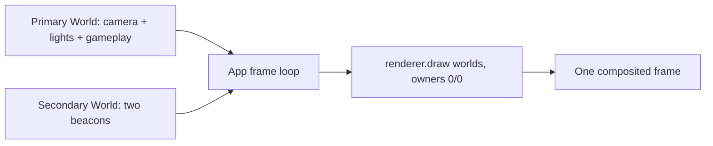

# Game Default

This is ForgeaX's canonical first game: a small four-view target range that teaches scene assets,
ECS behavior, physics, picking, rendering, UiAssets, and spatial audio through one coherent loop.

## Run, inspect, change

From the engine checkout:

```sh
pnpm --filter @forgeax/preview dev
```

Open `http://localhost:5173/?game=game-default` in a WebGPU browser. Start with
`assets/scene.pack.json` and `assets/multi-material-target.pack.json` for persistent world content.
The `RedBox` mesh uses two positional material slots, so its triangle-list body and line-list accent
are the first multi-primitive asset recipe in the template. Start with `src/scene-runtime.ts` for scene
loading, fallback, and physics attachment. `main.ts` composes those boundaries with input, camera,
and gameplay systems (top-down, fixed-radius orbit, FPS/free-flight, and bounded orthographic Map); `src/camera-orbit.ts`, `src/camera-zoom.ts`, and `src/free-camera.ts` own the
canonical spherical pose math; `src/gameplay-input.ts` owns the InputSnapshot-to-intent systems;
`src/gameplay-lifecycle.ts` owns the reset request; `src/hud.ts` and `src/settings.ts` own the
DOM-facing UiAssets; `src/gameplay-audio.ts` owns the GUID-loaded hit SFX and AudioSource edge loop;
`src/hit-flash.wgsl` plus `src/hit-flash-material.ts` demonstrate the build-time/runtime custom
material shader boundary. The authored `YellowPillar` also demonstrates the same boundary with
`src/animated-target.wgsl`: Preview registers a schema-driven `time` uniform, the Play update writes
it, and `R` restores the authored material object exactly. The canonical standalone shader gallery
remains `apps/bevy/animate-shader`; this template keeps one animated target in the existing game.
`src/change-detection.ts` composes ECS `Added`/`Changed` filters and resource change ticks with the
existing target hit/reset loop; the score resource is the single numeric source projected to the HUD,
while `apps/bevy/change-detection` remains the canonical isolated matrix. The settings panel also
demonstrates `Camera.clearColor` as a live preset (`Sky blue`/`Purple`) over the authored scene;
`apps/bevy/clear-color` remains the canonical empty-scene toggle. The authored `BlueBall` also gets
a private `MaterialAsset` clone with standard PBR clearcoat parameters in `src/clearcoat-material.ts`;
it keeps the same physics, scoring, hit-flash, and reset loop, while `apps/bevy/clearcoat` remains the
canonical coated-versus-uncoated contrast.

Depth of field is the template's first depth-aware fullscreen post-process. `src/depth-of-field.ts`
registers the authored WGSL pass through the public `Renderer.postProcess` and `PostProcessParams`
boundaries, composes it into the existing URP pipeline, and exposes a reset-safe Bokeh toggle in the
settings UiAsset. The render-evidence smoke proves that the effect changes compositor pixels and that
off/on/reset state remains owned by one gameplay settings path; `apps/bevy/depth-of-field` remains the
isolated focal-distance/aperture reference.

The authored hit loop also composes `src/chromatic-aberration.ts` and
`src/chromatic-aberration.wgsl` as a transient fullscreen material. `triggerFlash()` writes a
short-lived intensity through `PostProcessParams`, the Play system decays it, and `R` restores zero.
The effect is installed after DoF as an ordered URP post-effect, so the template demonstrates
multiple fullscreen passes without adding a second scene; `apps/bevy/fullscreen-material` remains
the standalone chromatic-shader oracle.

Hit feedback also demonstrates world-space MSDF text. `src/world-score-text.ts` keeps one pooled
`GlyphText`, loads the legacy baked DejaVu `FontAsset` by GUID, and can switch that same entity with
`Y` to a second stable GUID produced from the licensed `DejaVuSansMono.ttf` by the public `font`
importer/plugin. Preview registers `fontImporter`, delivers the TTF source through the Pack-v2
catalog, and keeps the legacy pack as the comparison baseline; `R` returns the pooled label to the
legacy source. This teaches source TTF → declared sub-asset GUIDs → MSDF bake/importer → runtime
FontAsset without copying the hello-text gallery or adding another scene. The DOM score popup remains
the screen-space UI example, so the two text contracts are visible together without creating a second
score owner. `apps/hello/text` remains the pre-baked MSDF renderer oracle, while
`apps/hello/m2-content-pipeline` remains the source-reimport/Worker recovery oracle.

The Play shooting system also demonstrates the ECS `CommandBuffer` boundary: bullets are spawned and
expired through deferred commands, while `commands.isDeferred` prevents same-system Transform writes
against pending handles. The synchronous `R` reset remains the gameplay owner's cleanup boundary, and
the render-evidence smoke records the deferred spawn count after a deterministic canvas shot (manual
play still uses `F`).

For the shipped path, run `pnpm --filter @forgeax/preview smoke:render-evidence-production`. It builds
Preview and runs the same render-evidence owner from `dist/`/`vite preview`, covering the authored
FBX/compressed-texture/material/post-process/camera/hit-reset/recovery composition without a second
gameplay owner.

For shipped GPU recovery, run `pnpm --filter @forgeax/preview smoke:device-loss-reentry-production`.
It builds `dist/`, crashes Chrome's GPU process, calls public `Renderer.recover()`, and checks the
same `Play` projection, advancing fixed ticks, visible frame, and zero unexpected errors after
`alive → device-lost → alive`.

Target health is the template's dense ECS example: `src/target-health.ts` attaches one
`GameDefaultTargetHealth` component to each authored target, runs its writable `current/max/Entity`
columns through `queryRunContiguous`, applies hit damage with `world.set`, and restores all rows on `R`.
The render-evidence snapshot proves the contiguous capability and row-shape invariant; the canonical
32-row health grid remains in `apps/bevy/contiguous-query`.

Structural lifecycle is paired with that health owner in `src/target-disabling.ts`: when a target
reaches zero health, the template adds the ECS `Disabled` marker. Ordinary target queries then omit
the row while an explicit `[TargetDisabling, Disabled, Entity]` query supplies the witness; reset
removes the marker from the original target identities before restoring health. This teaches the
difference between structural disabling and merely hiding a mesh, while keeping the canonical
`apps/bevy/entity-disabling` timeline as the isolated query oracle.

The same target also demonstrates the render-owned `Visibility` component through
`src/visibility-loop.ts`. Press `B` to toggle explicit `hidden`/`visible` intent; the target
remains a physics body, pick candidate, scored target, and possible `Disabled` row, so this is
not a second lifecycle path. `R` restores `inherited`, while the render-evidence and Preview
snapshot report the author intent, resolved effective state, resolution source, and renderer's
explicit-hidden count. `apps/hello/entity-visibility` remains the canonical hierarchy and
shadow-participation oracle; game-default keeps only the gameplay-sized composition.

The authored HDR sky follows the same asset path. Preview registers the image importer, while
`src/asset-content-evidence.ts` provides an opt-in browser witness for GUID loading, skybox
application, reload/reset churn, and structured missing-asset recovery:

```sh
FORGEAX_ASSET_LOOP_DIR=<run>/artifacts \
pnpm --filter @forgeax/preview smoke:asset-loop
```

`L` is the guided JPEG image lesson. Preview includes the exact `wood-container.jpg.meta.json`
sidecar from `forgeax-engine-assets/demo-assets/hello-sprite`; `src/jpeg-texture-swap.ts` loads
the cooked `TextureAsset` by GUID, clones the existing RedBox `MaterialAsset` slots with
`baseColorTexture`, and keeps the authored mesh, line-list accent, collider, hit, score, and
Visibility owners intact. The render-evidence and `game-default.snapshot` projections expose the
source name, dimensions, format, color space, and swap count. `R` restores the authored material
array, so the JPEG path teaches source → sidecar → image importer → pack-index → runtime material
delivery without adding a second scene or a decoder in game code. `apps/hello/sprite` remains the
deeper 2D texture/sort oracle.

`M` is the guided runtime-video lesson. Preview serves the licensed
`forgeax-engine-assets/demo-assets/hello-video-cutscene/cutscene.webm` from Vite's `publicDir`;
`src/video-texture-panel.ts` catalogs a runtime-only `VideoAsset { kind: 'video', url }`, loads it
through the default video loader, creates a `VideoPlayer` quad with a video-backed MaterialAsset,
and registers a host-owned `VideoElementProvider`. The panel follows the existing scored target and
faces the active camera, so the lesson composes with the same hit, input, inspection, App/World, and
typed `R` reset owners. This is intentionally not a new WebM importer or Pack sidecar: the engine's
video contract keeps bytes and DOM lifecycle at the host boundary. `game-default.toggle-video-texture`
and `M` toggle the panel; `R` pauses, hides, and rewinds it, while Stop removes the provider and
disposes the `<video>` element. The focused canonical upload and cutscene oracles remain
`apps/hello/video-texture` and `apps/hello/video-cutscene`.

`P` is the host-plugin lesson. `assets/target-profile.json` and its sidecar declare a
`game-default-target-profile` GUID; `apps/preview/vite.config.ts` injects the matching importer,
while `main.ts` registers the runtime loader and loads the profile through `AssetRegistry`. The
profile applies a visible target tint and doubles the existing score value on the same RedBox;
`game-default.toggle-target-profile` and `R` provide the reversible action/reset path. This is the
complete custom source → sidecar/GUID → pluginPack importer → Pack v2 → loader → gameplay chain,
adapted from `apps/hello/custom-importer` without importing its unrelated reel-machine scene.

`N` is the first atlas-animation asset lesson. Preview adds the `hello-sprite-atlas` directory to
the existing `pluginPack` roots, so `walk.atlas.png.meta.json` is handled by the standard image
importer and its GUID resolves to a cooked `TextureAsset`. `src/sprite-atlas-loop.ts` projects the
four regions from the companion `walk.atlas.json` build-time text channel into the public
`SpriteAnimation` + `SpriteRegionOverride` components on the same fired projectile. The engine's
`spriteAnimationTickSystem` advances frames; `game-default.toggle-sprite-atlas` (or `N`) turns the
representation on for newly spawned shots, while `game-default.snapshot.spriteAtlas` proves the
GUID, payload format, current frame, tracked entity count, and structured error state. Hit/score,
physics, audio, and `R` reset remain the existing owners. `apps/hello/sprite-atlas` stays the
10,000-entity fold/performance oracle; this template intentionally composes one animated shot
instead of copying its gallery. If named atlas metadata becomes a runtime requirement, add a
narrow host importer/plugin rather than parsing source JSON in the player.

The fired projectile is also the custom-mesh lesson. `src/custom-projectile-mesh.ts` builds a
24-vertex indexed cube with position/normal/UV/tangent attributes and uploads a deterministic
procedural checker texture. `G` mutates the shared GPU mesh between the upper and lower atlas halves
and `R` restores the mesh bytes and removes active projectiles. The projectile keeps a capsule
collider so rendering and physics are separate public contracts. Authored image import and texture
compression remain owned by their focused canonical apps rather than making every copied game
depend on a generated, gitignored source asset. `V` cycles the fired representation through that PBR
mesh, an unlit `forgeax::sprite` quad, and `forgeax::sprite-lit` using the existing authored
DirectionalLight and PointLight; the same input, physics, scoring, audio, inspection, and reset owners
remain in play. The canonical standalone custom-mesh correctness matrix remains
`apps/bevy/generate-custom-mesh`.

The authored `RedBox` is the multi-material/submesh lesson. Its separate
`assets/multi-material-target.pack.json` carries one GUID-addressed 12F mesh with a filled
triangle-list submesh and a line-list accent, plus red/cyan `MaterialAsset` rows. The scene binds
`materials[0..1]` to `submeshes[0..1]`; `triggerFlash()` changes only slot 0 so the cyan accent remains
visible, and the same `R` owner restores the complete material array. The browser render-evidence
snapshot reports the material/submesh counts and topologies before, during, and after reset. The
isolated positional/mixed-topology oracle remains `apps/hello/multi-material`.

The template also composes a secondary ECS World without creating a second
renderer or requestAnimationFrame loop. `src/multi-world-overlay.ts` creates
two small beacons with their own material handles; `App.setDrawSource` routes
`[primaryWorld, overlayWorld]` through the existing camera and lights. The
inspection action `game-default.toggle-multi-world` is a safe falsifier: turning
it off must remove both beacons while leaving the primary gameplay scene alive,
`R` restores the documented two-world baseline, and Stop removes the routing.



This is the classic host-composition pattern: each World keeps its own ECS
state and time policy, while the App owns one measured delta and one lifecycle.
Do not add a template-local `requestAnimationFrame`; change the App seam if a
future composition needs another routing policy.

`J` is the guided FBX asset-format lesson. Preview registers the FBX importer and scans the hydrated
`forgeax-engine-assets/vendor/fbx-test/cube.fbx` sidecar; `src/fbx-mesh-swap.ts` loads the emitted mesh
sub-asset by GUID and swaps it onto the same authored scoring target. Because `cube.fbx` has one
submesh while `RedBox` teaches two authored material slots, the swap owner derives a one-slot view
while FBX is active and restores the complete authored mesh/material pair on `R`. The existing
collider, hit/score, input, render-evidence, and reset owners stay in place, so this is a format
delivery change rather than a second scene. `H` remains the built-in sphere comparison and `J` is
the FBX comparison; both return to the authored mesh on reset.

The imported `humanoid.fbx` is the guided skeletal-animation lesson. `src/fbx-skinned-target.ts`
loads the scene and its `run` clip by stable GUID, instantiates the `Skin`/`AnimationPlayer` payload,
and joins the existing Play, hit, and reset lifecycle. The authored placement is written to the
imported scene root (`scale: [0.03, 0.03, 0.03]`) rather than only to the mesh node: skin palettes
are derived from the joint hierarchy, so root placement keeps the rendered mesh and its joints in
the same coordinate space. `game-default.snapshot` reports the root, skin entity, clip, joint count,
placement, animation time, and hit pulses; the inspection smoke also requires a 72-byte skinned
vertex layout and an indexed FBX draw.

`K` and `T` are the guided glTF asset-format lessons. Preview scans the license-safe Khronos
`khronos-gltf-samples/BoxTextured/BoxTextured.glb` and
`khronos-gltf-samples/BoxTextured/glTF/BoxTextured.gltf` sidecars with `gltfImporter`;
`src/gltf-mesh-swap.ts` loads both mesh/material pairs by GUID. `K` demonstrates the binary GLB
container and embedded Cesium texture; `T` demonstrates textual glTF source closure with the
external `BoxTextured0.bin` buffer. Both variants replace the same scored RedBox target, while its
explicit physics, hit, score, inspection, and reset owners remain unchanged. The variants are
mutually exclusive with each other, the built-in sphere, and the FBX swap; `R` restores the authored
RedBox mesh and its complete two-slot material array. The public render-evidence snapshot exposes
`glbMeshSwap` and `gltfMeshSwap` independently so browser probes can falsify either delivery path.

The same semantic `InputMap` accepts a standard gamepad without adding a second input owner:
left-stick axes move, South jumps, R2 fires, Y toggles the projectile UV atlas, and East requests
reset; keyboard `V` cycles the projectile visual. `InputSnapshot.gamepad(0)` is frozen at the frame-start scan, so browser evidence can inspect
the exact button/trigger/axis state while normal gameplay systems consume the same actions. Run the
focused proof with `pnpm --filter @forgeax/preview smoke:gamepad`.

The authored `Player` is also the guided CharacterController example. `src/scene-runtime.ts`
attaches a kinematic capsule and `CharacterController`; `main.ts` computes movement intent and jump
gravity, calls `PhysicsWorld.moveAndSlide`, and reads back the resolved `Transform` plus
`grounded`. The scene's static colliders own obstacle behavior, so the template has no duplicate
manual blocker list. FPS free-flight explicitly teleports the same body because KCC owns kinematic
movement in the other views.

Run the focused semantic proof with `pnpm --filter @forgeax/preview smoke:character-controller`.

After a change, run the browser smoke and the derived capability audit from the engine root:

```sh
pnpm test:browser
pnpm game-default:audit -- --output /tmp/game-default-capability-audit.json
```

During Play, press `R` to reset the player, dynamic props, bullets, score, camera, view mode, input
intent, and the player-owned hit AudioSource to the authored starting state. Shoot a target to see
the same hit event drive score, flash, popup, physics, and a spatial `sfx` bus one-shot.

The local `AGENTS.md` is the detailed contract. If a requested feature does not fit the current
engine boundary, fix the deepest owner or document the routed gap before adding a template-only
shim.
# UI consumer boundary

The default template consumes HUD and settings UiAssets from `assets/ui/*.pack.json`. Their stable markup and style live directly in the pack payloads; use `src/hud.ts` or `src/settings.ts` only for dynamic values, event ownership, modal focus, and cleanup. UI screenshots are auxiliary evidence; DOM assertions and lifecycle behavior remain the acceptance source of truth.

For a shipped-path check, run `pnpm --filter @forgeax/preview smoke:ui-production`. This builds
Preview and proves the two GUID rows, Pack v2 payloads, ShadowRoot interaction, and three clean
Stop/boot cycles from the production `dist/`; `smoke:ui-authoring` is the separate authoring-host
contract.

For an authored HUD change, run `pnpm --filter @forgeax/preview smoke:production-ui-edit`. It edits
the source pack, proves a new production package URL and live score text, and restores the pack after
the baseline/changed/restored cache legs.
